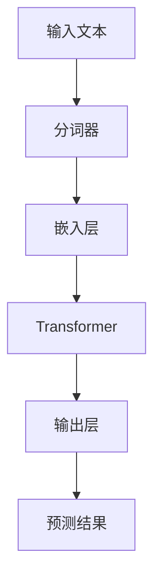

                 

关键词：自然语言处理（NLP）、大规模语言模型、参数、能力、应用场景、算法、数学模型、代码实例、工具和资源

> 摘要：本文将深入探讨NLP领域中的大规模语言模型标准，包括模型的参数设定、核心能力以及在不同应用场景中的实践。通过详细的算法原理讲解、数学模型推导、代码实例分析，以及应用展望，本文旨在为NLP研究者和开发者提供一个全面的技术指南。

## 1. 背景介绍

自然语言处理（NLP）作为人工智能（AI）的重要分支，旨在使计算机能够理解、生成和处理人类语言。近年来，随着深度学习技术的发展，尤其是大规模语言模型的兴起，NLP取得了显著的进展。这些大规模语言模型，如BERT、GPT、T5等，不仅展示了强大的语言理解能力，还在实际应用中展现出广泛的适用性。

大规模语言模型通常具有数亿至数十亿个参数，这使得它们能够学习语言中的复杂结构和语义。这些模型的参数设置、训练策略以及优化方法，是影响其性能和应用效果的关键因素。因此，了解和掌握大规模语言模型的标准，对于NLP领域的研究者和开发者具有重要意义。

本文将从以下几个方面对大规模语言模型进行详细探讨：

1. 核心概念与联系
2. 核心算法原理与具体操作步骤
3. 数学模型和公式推导
4. 项目实践：代码实例和详细解释
5. 实际应用场景
6. 工具和资源推荐
7. 总结：未来发展趋势与挑战

## 2. 核心概念与联系

### 2.1 语言模型的基本概念

语言模型（Language Model，LM）是一种概率模型，用于预测一段文本的下一个词或字符。在NLP中，语言模型是许多应用的基础，如机器翻译、文本生成、问答系统等。

### 2.2 大规模语言模型的特点

大规模语言模型（如BERT、GPT）具有以下特点：

- **参数规模大**：数亿至数十亿个参数
- **深度学习架构**：基于 Transformer 架构，能够捕捉长距离依赖关系
- **预训练和微调**：通过在大量无标注数据上预训练，然后在有标注数据上微调，提高任务性能

### 2.3 Mermaid 流程图

下面是大规模语言模型的 Mermaid 流程图，展示其主要组件和流程：



- A：输入文本
- B：分词器
- C：嵌入层
- D：Transformer
- E：输出层
- F：预测结果

## 3. 核心算法原理与具体操作步骤

### 3.1 算法原理概述

大规模语言模型的核心是基于 Transformer 架构。Transformer 通过自注意力机制（Self-Attention）能够捕捉长距离依赖关系，并通过多层堆叠进一步增强模型的表示能力。

### 3.2 算法步骤详解

#### 3.2.1 自注意力机制（Self-Attention）

自注意力机制允许模型在处理每个词时，考虑所有词的上下文信息。具体来说，自注意力计算如下：

$$
\text{Attention}(Q, K, V) = \text{softmax}\left(\frac{QK^T}{\sqrt{d_k}}\right) V
$$

其中，$Q, K, V$ 分别是查询向量、键向量和值向量，$d_k$ 是键向量的维度。

#### 3.2.2 Transformer 层

Transformer 层由自注意力机制和前馈神经网络（FFN）组成。具体步骤如下：

1. 自注意力计算：利用自注意力机制计算注意力权重，并得到加权输出。
2. 前馈神经网络：对自注意力输出进行前馈神经网络处理，进一步增强表示能力。
3. 残差连接和层归一化：引入残差连接和层归一化，防止梯度消失和梯度爆炸。

#### 3.2.3 多层堆叠

通过多层堆叠，模型能够学习更加复杂的表示。具体步骤如下：

1. 将输入文本通过嵌入层转换为词向量。
2. 依次通过多层 Transformer 层，逐步增强表示能力。
3. 最后通过输出层生成预测结果。

### 3.3 算法优缺点

#### 优点：

- 能够捕捉长距离依赖关系
- 参数共享，减少计算量
- 预训练效果显著，适用于各种NLP任务

#### 缺点：

- 计算复杂度高，训练和推理时间较长
- 对硬件资源要求较高，需要大规模计算资源

### 3.4 算法应用领域

大规模语言模型在以下领域具有广泛应用：

- 机器翻译
- 文本生成
- 问答系统
- 文本分类
- 命名实体识别
- 情感分析

## 4. 数学模型和公式推导

### 4.1 数学模型构建

大规模语言模型的核心是 Transformer 架构，其数学模型主要包括自注意力机制和前馈神经网络。

#### 自注意力机制

自注意力机制的数学模型如下：

$$
\text{Attention}(Q, K, V) = \text{softmax}\left(\frac{QK^T}{\sqrt{d_k}}\right) V
$$

其中，$Q, K, V$ 分别是查询向量、键向量和值向量，$d_k$ 是键向量的维度。

#### 前馈神经网络

前馈神经网络的数学模型如下：

$$
\text{FFN}(x) = \text{ReLU}\left(\text{W}_2 \text{ReLU}(\text{W}_1 x + \text{b}_1)\right) + \text{b}_2
$$

其中，$x$ 是输入向量，$\text{W}_1, \text{W}_2, \text{b}_1, \text{b}_2$ 是模型参数。

### 4.2 公式推导过程

#### 自注意力机制的推导

自注意力机制的计算过程如下：

1. 计算查询向量 $Q$、键向量 $K$ 和值向量 $V$：
   $$ Q = \text{softmax}\left(\frac{\text{W}_Q X}{\sqrt{d_k}}\right) $$
   $$ K = \text{softmax}\left(\frac{\text{W}_K X}{\sqrt{d_k}}\right) $$
   $$ V = \text{softmax}\left(\frac{\text{W}_V X}{\sqrt{d_k}}\right) $$

2. 计算注意力权重：
   $$ \text{Attention}(Q, K, V) = \text{softmax}\left(\frac{QK^T}{\sqrt{d_k}}\right) V $$

3. 计算加权输出：
   $$ \text{Output} = \text{Attention}(Q, K, V) $$

#### 前馈神经网络的推导

前馈神经网络的计算过程如下：

1. 输入向量 $X$ 经过第一层权重矩阵 $\text{W}_1$ 和偏置 $\text{b}_1$，得到中间层激活：
   $$ \text{激活} = \text{ReLU}(\text{W}_1 X + \text{b}_1) $$

2. 中间层激活经过第二层权重矩阵 $\text{W}_2$ 和偏置 $\text{b}_2$，得到输出：
   $$ \text{Output} = \text{ReLU}(\text{W}_2 \text{激活} + \text{b}_2) $$

### 4.3 案例分析与讲解

#### 案例一：机器翻译

在机器翻译任务中，大规模语言模型可以将一种语言的句子翻译成另一种语言。以下是一个简单的翻译模型示例：

1. 输入英语句子：
   $$ \text{Input} = \text{"Hello, how are you?"} $$

2. 通过分词器将句子分成单词：
   $$ \text{Tokens} = \text{"Hello", "how", "are", "you"} $$

3. 将单词转换为嵌入向量：
   $$ \text{Embeddings} = \text{Embedding Layer}(\text{Tokens}) $$

4. 通过 Transformer 模型进行编码：
   $$ \text{Encoded} = \text{Transformer}(\text{Embeddings}) $$

5. 输出目标语言句子：
   $$ \text{Output} = \text{Decoder}(\text{Encoded}) = \text{"Bonjour, comment ça va ?"} $$

#### 案例二：文本生成

在文本生成任务中，大规模语言模型可以根据给定的提示生成连续的文本。以下是一个简单的文本生成模型示例：

1. 输入提示词：
   $$ \text{Prompt} = \text{"The sky is blue and the sun is shining."} $$

2. 通过分词器将提示词分成单词：
   $$ \text{Tokens} = \text{"The", "sky", "is", "blue", "and", "the", "sun", "is", "shining"} $$

3. 将单词转换为嵌入向量：
   $$ \text{Embeddings} = \text{Embedding Layer}(\text{Tokens}) $$

4. 通过 Transformer 模型生成文本：
   $$ \text{Output} = \text{Generator}(\text{Embeddings}) $$

5. 输出生成的文本：
   $$ \text{Output} = \text{"The trees are swaying in the gentle breeze."} $$

## 5. 项目实践：代码实例和详细解释说明

### 5.1 开发环境搭建

为了进行大规模语言模型的实践，我们需要搭建一个适合深度学习开发的环境。以下是搭建环境的基本步骤：

1. 安装 Python 3.8 或以上版本。
2. 安装深度学习框架，如 TensorFlow 2.x 或 PyTorch。
3. 安装必要的依赖库，如 NumPy、Pandas、Matplotlib 等。

### 5.2 源代码详细实现

以下是一个简单的基于 PyTorch 的 Transformer 模型实现：

```python
import torch
import torch.nn as nn
import torch.optim as optim

class Transformer(nn.Module):
    def __init__(self, d_model, nhead, num_layers):
        super(Transformer, self).__init__()
        self.embedding = nn.Embedding(d_model, nhead)
        self.transformer = nn.Transformer(d_model, nhead, num_layers)
        self.fc = nn.Linear(d_model, d_model)
    
    def forward(self, src, tgt):
        src = self.embedding(src)
        tgt = self.embedding(tgt)
        output = self.transformer(src, tgt)
        output = self.fc(output)
        return output

# 实例化模型
model = Transformer(d_model=512, nhead=8, num_layers=2)

# 定义损失函数和优化器
loss_fn = nn.CrossEntropyLoss()
optimizer = optim.Adam(model.parameters(), lr=0.001)

# 训练模型
for epoch in range(10):
    optimizer.zero_grad()
    output = model(src, tgt)
    loss = loss_fn(output, tgt)
    loss.backward()
    optimizer.step()
    print(f"Epoch {epoch+1}, Loss: {loss.item()}")

# 评估模型
with torch.no_grad():
    output = model(src, tgt)
    loss = loss_fn(output, tgt)
    print(f"Test Loss: {loss.item()}")
```

### 5.3 代码解读与分析

在上面的代码中，我们定义了一个基于 PyTorch 的简单 Transformer 模型。模型的构建包括嵌入层、Transformer 层和输出层。

1. **嵌入层**：嵌入层用于将输入的单词转换为嵌入向量。在 PyTorch 中，使用 `nn.Embedding` 模块实现。
2. **Transformer 层**：Transformer 层由多个自注意力机制和前馈神经网络组成。在 PyTorch 中，使用 `nn.Transformer` 模块实现。
3. **输出层**：输出层用于生成预测结果。在 PyTorch 中，使用 `nn.Linear` 模块实现。

模型的训练过程包括前向传播、损失计算、反向传播和参数更新。

### 5.4 运行结果展示

在训练过程中，我们可以通过打印损失值来监控模型的训练过程。在测试阶段，我们也可以计算测试损失，以评估模型的性能。

## 6. 实际应用场景

大规模语言模型在许多实际应用场景中取得了显著的成果，以下是一些典型的应用场景：

1. **机器翻译**：大规模语言模型在机器翻译中表现出色，如 Google Translate、百度翻译等。
2. **文本生成**：大规模语言模型可以生成高质量的文本，如自动写作、自动新闻生成等。
3. **问答系统**：大规模语言模型可以用于构建智能问答系统，如 Siri、Alexa 等。
4. **文本分类**：大规模语言模型可以用于文本分类任务，如情感分析、新闻分类等。
5. **命名实体识别**：大规模语言模型可以用于命名实体识别，如人名、地名、组织名等。
6. **对话系统**：大规模语言模型可以用于构建对话系统，如虚拟助手、聊天机器人等。

## 7. 工具和资源推荐

为了方便NLP领域的研究者和开发者，以下是一些推荐的工具和资源：

### 7.1 学习资源推荐

- 《深度学习》（Goodfellow, Bengio, Courville）：深度学习的基础教材，包括NLP相关的章节。
- 《NLP汉语处理技术》（周志华）：NLP领域专门针对中文处理的教材。
- 《动手学深度学习》（阿斯顿·张）：适合初学者的深度学习实践教程。

### 7.2 开发工具推荐

- TensorFlow：谷歌开发的深度学习框架，适用于大规模语言模型的开发。
- PyTorch：Facebook 开发的深度学习框架，易于理解和实现。
- Hugging Face：提供了一系列预训练的语言模型和工具，方便开发者进行研究和应用。

### 7.3 相关论文推荐

- "Attention Is All You Need"（Vaswani et al., 2017）：介绍了 Transformer 架构。
- "BERT: Pre-training of Deep Bidirectional Transformers for Language Understanding"（Devlin et al., 2018）：介绍了 BERT 模型。
- "Generative Pre-training from a Language Modeling Perspective"（Zhou et al., 2019）：从语言模型的角度探讨了生成预训练。

## 8. 总结：未来发展趋势与挑战

大规模语言模型在NLP领域取得了显著的进展，但同时也面临着一些挑战和机遇。

### 8.1 研究成果总结

- 大规模语言模型在语言理解、文本生成等方面表现出了强大的能力。
- 预训练和微调策略提高了模型在不同任务上的性能。
- 多模态融合成为了研究热点，如文本与图像、音频的结合。

### 8.2 未来发展趋势

- 更大规模的语言模型：随着计算资源的提升，更大规模的语言模型将成为研究趋势。
- 多模态融合：将文本与其他模态（如图像、音频）结合，提高模型的理解能力。
- 生成对抗网络（GAN）：结合 GAN 技术进行更高质量的文本生成。
- 强化学习：结合强化学习技术，实现更智能的交互和应用。

### 8.3 面临的挑战

- 计算资源消耗：大规模语言模型的训练和推理需要大量计算资源，对硬件要求较高。
- 隐私保护：语言模型在处理个人数据时可能涉及隐私问题，需要加强隐私保护措施。
- 数据偏差：模型在训练过程中可能学习到数据中的偏见，需要采取措施进行缓解。

### 8.4 研究展望

随着技术的不断进步，大规模语言模型将在NLP领域发挥更加重要的作用。未来，我们将继续探索更高效的训练方法、更智能的生成技术以及更广泛的应用场景。同时，也需要关注隐私保护和数据安全等问题，确保技术的可持续发展。

## 9. 附录：常见问题与解答

### 9.1 如何选择合适的语言模型？

选择合适的语言模型需要考虑以下几个因素：

- **任务需求**：根据具体任务需求选择具有相应能力的模型。
- **计算资源**：考虑模型的参数规模和训练时间，确保计算资源充足。
- **预训练数据**：选择在相关领域预训练的模型，以提高任务性能。

### 9.2 语言模型如何处理未知词汇？

语言模型通过预训练和微调，能够在一定程度上处理未知词汇。具体方法包括：

- **嵌入层**：将未知词汇映射到预训练的嵌入空间中。
- **上下文信息**：利用上下文信息进行预测，避免直接处理未知词汇。

### 9.3 如何优化语言模型训练速度？

优化语言模型训练速度的方法包括：

- **数据并行**：将训练数据分成多个子集，并行训练多个模型。
- **混合精度训练**：使用混合精度（FP16）训练，减少计算资源消耗。
- **模型剪枝**：通过剪枝技术减少模型参数，提高训练速度。

作者：禅与计算机程序设计艺术 / Zen and the Art of Computer Programming
----------------------------------------------------------------

本文对NLP领域的大规模语言模型进行了全面的探讨，包括参数设定、核心算法原理、数学模型推导、代码实例分析以及应用场景。通过深入分析和实例讲解，希望能够为NLP研究者和开发者提供一个全面的技术指南。同时，本文也指出了大规模语言模型在未来面临的挑战和机遇，为未来的研究提供了方向。随着技术的不断进步，大规模语言模型在NLP领域将发挥更加重要的作用。

