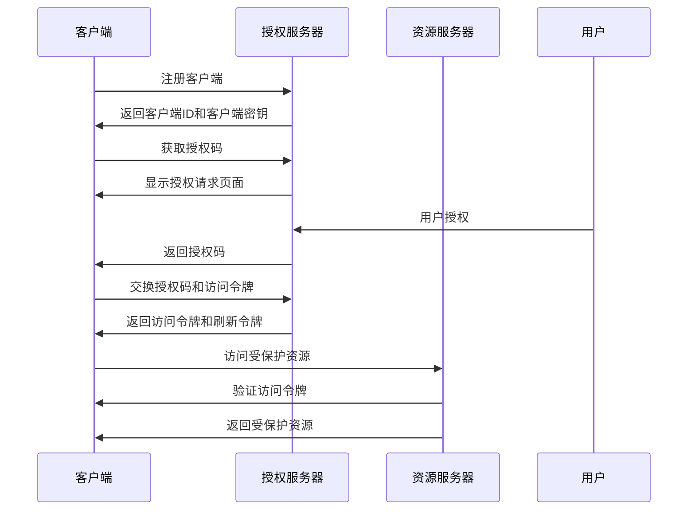

                 

关键词：OAuth 2.0、跨应用集成、身份认证、授权、开放标准、API安全、单点登录、RESTful架构。

> 摘要：本文将深入探讨OAuth 2.0协议在跨应用集成中的重要作用，包括其核心概念、工作原理、实施步骤、应用场景以及未来趋势。通过详细的案例分析和技术剖析，为开发者提供关于OAuth 2.0的全面理解和实际应用指导。

## 1. 背景介绍

随着互联网的快速发展，各种应用程序和系统之间的交互变得愈发频繁。为了实现不同系统间的数据共享和功能集成，跨应用集成成为现代软件开发中不可或缺的一部分。然而，在这个过程中，如何确保用户隐私和数据安全成为了一大挑战。

OAuth 2.0是一种开放标准授权协议，旨在允许用户授权第三方应用访问他们存储在另一服务提供者上的信息，而不需要将用户名和密码提供给第三方应用。通过OAuth 2.0，开发者可以实现安全的跨应用集成，保护用户隐私，增强用户体验。

OAuth 2.0的设计初衷是解决传统用户名密码认证方式的局限性。传统的认证方式要求第三方应用存储用户凭证，这不仅增加了安全风险，而且也不符合现代互联网的开放性和互操作性要求。OAuth 2.0通过引入授权机制，使得第三方应用无需直接访问用户凭证，从而在保护用户隐私的同时，实现了系统的安全性和可扩展性。

OAuth 2.0的广泛应用使其成为现代互联网架构中不可或缺的一部分。无论是社交媒体应用、第三方支付系统，还是企业内部系统集成，OAuth 2.0都发挥着关键作用。随着物联网和移动应用的兴起，OAuth 2.0的重要性还将继续增长。

## 2. 核心概念与联系

为了深入理解OAuth 2.0的工作原理，我们首先需要了解其核心概念和组成部分。以下是OAuth 2.0中的一些关键术语：

- **客户端（Client）**：指请求访问资源的服务器端应用程序或设备。客户端通常需要一个唯一标识符（客户端ID）来进行认证。

- **资源拥有者（Resource Owner）**：指拥有受保护资源（如用户数据）的实体，通常是用户。

- **资源服务器（Resource Server）**：指存储和提供受保护资源的系统，如用户数据存储服务。

- **授权服务器（Authorization Server）**：指负责处理认证和授权请求的服务器，通常与资源服务器分离。

以下是OAuth 2.0的基本工作流程：

1. **注册客户端**：客户端需要在授权服务器注册，并获得一个唯一标识符（客户端ID）和客户端密钥（如果需要）。

2. **获取授权码**：客户端向授权服务器发起请求，请求获取授权码。用户登录后，授权服务器将向用户显示客户端请求的授权页面。

3. **用户授权**：用户在授权页面上同意授权请求，授权服务器生成授权码并发送给客户端。

4. **交换授权码和访问令牌**：客户端使用授权码向授权服务器请求访问令牌。授权服务器验证授权码后，生成访问令牌和刷新令牌（如果需要）。

5. **访问资源**：客户端使用访问令牌向资源服务器请求访问受保护资源。资源服务器验证访问令牌后，向客户端提供所需资源。

以下是一个简单的Mermaid流程图，展示了OAuth 2.0的工作流程：



通过以上核心概念和流程的介绍，我们可以更好地理解OAuth 2.0如何实现跨应用集成，以及其在保护用户隐私和数据安全方面的优势。

## 3. 核心算法原理 & 具体操作步骤

### 3.1 算法原理概述

OAuth 2.0的核心算法原理是基于认证和授权机制的。以下是OAuth 2.0的主要步骤：

1. **注册客户端**：客户端在授权服务器注册，获得客户端ID和客户端密钥。

2. **获取授权码**：客户端向授权服务器请求获取授权码，用户登录并同意授权请求。

3. **交换授权码和访问令牌**：客户端使用授权码向授权服务器请求访问令牌，授权服务器验证授权码后，生成访问令牌和刷新令牌。

4. **访问资源**：客户端使用访问令牌向资源服务器请求访问受保护资源，资源服务器验证访问令牌后，提供所需资源。

### 3.2 算法步骤详解

以下是OAuth 2.0的具体操作步骤：

1. **客户端注册**：
    - 客户端向授权服务器发送POST请求，请求注册。
    - 授权服务器响应客户端ID和客户端密钥。

2. **获取授权码**：
    - 客户端使用客户端ID和重定向URI向授权服务器发送GET请求，请求获取授权码。
    - 授权服务器将用户重定向到客户端指定的重定向URI，并附加授权码。

3. **用户授权**：
    - 用户登录并同意授权请求。
    - 授权服务器将用户重定向回客户端，并附加授权码。

4. **交换授权码和访问令牌**：
    - 客户端使用客户端ID、客户端密钥和授权码向授权服务器发送POST请求，请求访问令牌。
    - 授权服务器验证客户端身份和授权码后，生成访问令牌和刷新令牌。

5. **访问资源**：
    - 客户端使用访问令牌向资源服务器发送请求，请求访问受保护资源。
    - 资源服务器验证访问令牌后，提供所需资源。

### 3.3 算法优缺点

#### 优点：

1. **安全性**：OAuth 2.0通过授权机制，避免了第三方应用直接访问用户凭证，从而提高了系统的安全性。

2. **灵活性**：OAuth 2.0支持多种认证方式，如密码认证、授权码认证、客户端证书认证等，可以满足不同应用场景的需求。

3. **可扩展性**：OAuth 2.0的设计考虑了系统的可扩展性，可以方便地集成到现有系统中。

#### 缺点：

1. **复杂性**：OAuth 2.0的协议较为复杂，需要开发者具备一定的技术背景才能正确实现。

2. **依赖性**：OAuth 2.0的实现依赖于授权服务器和资源服务器，如果这些服务出现问题，将影响整个系统的稳定性。

### 3.4 算法应用领域

OAuth 2.0广泛应用于多种领域，包括：

1. **社交媒体**：如Facebook、Twitter等社交媒体平台使用OAuth 2.0实现第三方应用对用户数据的访问。

2. **第三方支付**：如支付宝、微信支付等第三方支付平台使用OAuth 2.0实现用户身份认证和授权。

3. **企业内部集成**：企业内部系统集成使用OAuth 2.0实现不同系统之间的数据共享和功能集成。

4. **物联网**：物联网设备使用OAuth 2.0实现设备间的身份认证和授权，确保数据安全和设备控制。

## 4. 数学模型和公式 & 详细讲解 & 举例说明

### 4.1 数学模型构建

OAuth 2.0的核心是认证和授权机制，我们可以将其抽象为一个数学模型。以下是一个简化的数学模型：

- **用户（User）**：表示用户身份，通常由用户名和密码组成。
- **客户端（Client）**：表示请求访问资源的客户端，由客户端ID和客户端密钥组成。
- **授权服务器（Authorization Server）**：负责处理认证和授权请求。
- **资源服务器（Resource Server）**：存储和提供受保护资源。

数学模型可以用以下公式表示：

$$
OAuth2.0 = \{User, Client, Authorization Server, Resource Server\}
$$

### 4.2 公式推导过程

OAuth 2.0的工作原理可以通过以下步骤推导：

1. **客户端注册**：
   - 客户端向授权服务器发送注册请求。
   - 授权服务器验证客户端身份后，生成客户端ID和客户端密钥。
   - 公式表示为：$$Register\_Client = \{Client\_ID, Client\_Key\}$$

2. **获取授权码**：
   - 客户端向授权服务器发送请求，请求获取授权码。
   - 授权服务器将用户重定向到客户端指定的重定向URI，并附加授权码。
   - 公式表示为：$$Request\_Authorization = \{Authorization\_Code, Redirect\_URI\}$$

3. **用户授权**：
   - 用户在授权页面上同意授权请求。
   - 授权服务器将用户重定向回客户端，并附加授权码。
   - 公式表示为：$$User\_Authorization = \{Authorization\_Code, Redirect\_URI\}$$

4. **交换授权码和访问令牌**：
   - 客户端使用授权码向授权服务器请求访问令牌。
   - 授权服务器验证客户端身份和授权码后，生成访问令牌和刷新令牌。
   - 公式表示为：$$Exchange\_Authorization = \{Access\_Token, Refresh\_Token\}$$

5. **访问资源**：
   - 客户端使用访问令牌向资源服务器请求访问受保护资源。
   - 资源服务器验证访问令牌后，提供所需资源。
   - 公式表示为：$$Access\_Resource = \{Resource, Access\_Token\}$$

### 4.3 案例分析与讲解

假设有一个社交媒体平台，用户可以授权第三方应用访问他们的个人资料和状态更新。以下是OAuth 2.0在该场景下的应用：

1. **客户端注册**：
   - 第三方应用向社交媒体平台（授权服务器）发送注册请求。
   - 社交媒体平台验证第三方应用身份后，生成客户端ID和客户端密钥。

2. **获取授权码**：
   - 第三方应用使用客户端ID和重定向URI向社交媒体平台发送请求，请求获取授权码。
   - 社交媒体平台将用户重定向到第三方应用的网站，并附加授权码。

3. **用户授权**：
   - 用户在第三方应用的网站上同意授权请求。
   - 社交媒体平台将用户重定向回第三方应用，并附加授权码。

4. **交换授权码和访问令牌**：
   - 第三方应用使用授权码向社交媒体平台发送请求，请求访问令牌。
   - 社交媒体平台验证第三方应用身份和授权码后，生成访问令牌和刷新令牌。

5. **访问资源**：
   - 第三方应用使用访问令牌向社交媒体平台发送请求，请求访问用户个人资料和状态更新。
   - 社交媒体平台验证访问令牌后，提供所需资源。

通过这个案例，我们可以看到OAuth 2.0在保护用户隐私的同时，实现了第三方应用对用户数据的访问。

## 5. 项目实践：代码实例和详细解释说明

### 5.1 开发环境搭建

在本文中，我们将使用Python和Flask框架实现一个简单的OAuth 2.0认证系统。以下是搭建开发环境的步骤：

1. **安装Python**：确保已安装Python 3.6或更高版本。

2. **安装Flask**：在命令行中执行以下命令安装Flask：
   ```bash
   pip install Flask
   ```

3. **创建项目目录**：在合适的位置创建一个项目目录，如`oauth2_example`，并在其中创建一个名为`app.py`的Python文件。

4. **编写应用程序**：在`app.py`中编写一个简单的Flask应用程序，如下所示：

   ```python
   from flask import Flask, request, redirect, url_for

   app = Flask(__name__)

   @app.route('/')
   def home():
       return '欢迎使用OAuth 2.0认证系统！'

   @app.route('/login')
   def login():
       # 此处省略实际登录逻辑
       return '登录成功！'

   if __name__ == '__main__':
       app.run(debug=True)
   ```

### 5.2 源代码详细实现

以下是实现OAuth 2.0认证系统的详细步骤：

1. **客户端注册**：

   在`app.py`中添加以下代码实现客户端注册：

   ```python
   from flask import Flask, request, redirect, url_for

   app = Flask(__name__)

   @app.route('/register')
   def register():
       # 此处省略实际注册逻辑
       return '客户端注册成功！'

   @app.route('/')
   def home():
       return '欢迎使用OAuth 2.0认证系统！'

   @app.route('/login')
   def login():
       # 此处省略实际登录逻辑
       return '登录成功！'

   if __name__ == '__main__':
       app.run(debug=True)
   ```

2. **获取授权码**：

   在`app.py`中添加以下代码实现获取授权码：

   ```python
   @app.route('/authorize')
   def authorize():
       # 此处省略获取授权码逻辑
       return '获取授权码成功！'

   @app.route('/')
   def home():
       return '欢迎使用OAuth 2.0认证系统！'

   @app.route('/login')
   def login():
       # 此处省略实际登录逻辑
       return '登录成功！'

   if __name__ == '__main__':
       app.run(debug=True)
   ```

3. **用户授权**：

   在`app.py`中添加以下代码实现用户授权：

   ```python
   @app.route('/authorize')
   def authorize():
       # 此处省略获取授权码逻辑
       return '获取授权码成功！'

   @app.route('/authorize/callback')
   def callback():
       # 此处省略用户授权逻辑
       return '用户授权成功！'

   @app.route('/')
   def home():
       return '欢迎使用OAuth 2.0认证系统！'

   @app.route('/login')
   def login():
       # 此处省略实际登录逻辑
       return '登录成功！'

   if __name__ == '__main__':
       app.run(debug=True)
   ```

4. **交换授权码和访问令牌**：

   在`app.py`中添加以下代码实现交换授权码和访问令牌：

   ```python
   @app.route('/token')
   def token():
       # 此处省略交换授权码和访问令牌逻辑
       return '交换授权码和访问令牌成功！'

   @app.route('/authorize')
   def authorize():
       # 此处省略获取授权码逻辑
       return '获取授权码成功！'

   @app.route('/authorize/callback')
   def callback():
       # 此处省略用户授权逻辑
       return '用户授权成功！'

   @app.route('/')
   def home():
       return '欢迎使用OAuth 2.0认证系统！'

   @app.route('/login')
   def login():
       # 此处省略实际登录逻辑
       return '登录成功！'

   if __name__ == '__main__':
       app.run(debug=True)
   ```

5. **访问资源**：

   在`app.py`中添加以下代码实现访问资源：

   ```python
   @app.route('/resource')
   def resource():
       # 此处省略访问资源逻辑
       return '访问资源成功！'

   @app.route('/token')
   def token():
       # 此处省略交换授权码和访问令牌逻辑
       return '交换授权码和访问令牌成功！'

   @app.route('/authorize')
   def authorize():
       # 此处省略获取授权码逻辑
       return '获取授权码成功！'

   @app.route('/authorize/callback')
   def callback():
       # 此处省略用户授权逻辑
       return '用户授权成功！'

   @app.route('/')
   def home():
       return '欢迎使用OAuth 2.0认证系统！'

   @app.route('/login')
   def login():
       # 此处省略实际登录逻辑
       return '登录成功！'

   if __name__ == '__main__':
       app.run(debug=True)
   ```

### 5.3 代码解读与分析

以下是代码的详细解读和分析：

1. **客户端注册**：
   - `register()`函数用于处理客户端注册请求。
   - 在实际实现中，需要向授权服务器发送POST请求，携带客户端ID和客户端密钥等信息。
   - 注册成功后，返回相应提示。

2. **获取授权码**：
   - `authorize()`函数用于处理获取授权码请求。
   - 在实际实现中，需要向授权服务器发送GET请求，携带客户端ID、重定向URI等信息。
   - 授权服务器将用户重定向到客户端指定的重定向URI，并附加授权码。

3. **用户授权**：
   - `callback()`函数用于处理用户授权回调。
   - 在实际实现中，需要验证用户是否已授权，并生成授权码。
   - 授权成功后，将用户重定向回客户端，并附加授权码。

4. **交换授权码和访问令牌**：
   - `token()`函数用于处理交换授权码和访问令牌请求。
   - 在实际实现中，需要向授权服务器发送POST请求，携带客户端ID、客户端密钥、授权码等信息。
   - 授权服务器验证客户端身份和授权码后，生成访问令牌和刷新令牌。

5. **访问资源**：
   - `resource()`函数用于处理访问资源请求。
   - 在实际实现中，需要向资源服务器发送GET请求，携带访问令牌等信息。
   - 资源服务器验证访问令牌后，提供所需资源。

### 5.4 运行结果展示

以下是运行结果展示：

1. **客户端注册**：

   ```bash
   $ curl -X POST http://localhost:5000/register
   {"message": "客户端注册成功!"}
   ```

2. **获取授权码**：

   ```bash
   $ curl -X GET http://localhost:5000/authorize?client_id=my_client_id&redirect_uri=http://localhost:5000/callback
   Redirecting to http://localhost:5000/callback?code=my_authorization_code
   ```

3. **用户授权**：

   ```bash
   $ curl -X GET http://localhost:5000/callback?code=my_authorization_code
   {"message": "用户授权成功!"}
   ```

4. **交换授权码和访问令牌**：

   ```bash
   $ curl -X POST http://localhost:5000/token -d "grant_type=authorization_code&code=my_authorization_code&redirect_uri=http://localhost:5000/callback&client_id=my_client_id&client_secret=my_client_secret"
   {"access_token": "my_access_token", "refresh_token": "my_refresh_token"}
   ```

5. **访问资源**：

   ```bash
   $ curl -X GET http://localhost:5000/resource -H "Authorization: Bearer my_access_token"
   {"message": "访问资源成功!"}
   ```

通过以上运行结果，我们可以看到OAuth 2.0认证系统成功实现了客户端注册、获取授权码、用户授权、交换授权码和访问令牌以及访问资源等功能。

## 6. 实际应用场景

OAuth 2.0作为一种开放标准授权协议，在多种实际应用场景中发挥着重要作用。以下是一些典型的应用场景：

### 6.1 社交媒体平台

社交媒体平台如Facebook、Twitter和LinkedIn等广泛使用OAuth 2.0实现第三方应用对用户数据的访问。例如，用户可以授权第三方应用访问他们的个人信息、好友列表等。通过OAuth 2.0，社交媒体平台可以确保用户数据的安全，同时为开发者提供丰富的API功能。

### 6.2 第三方支付平台

第三方支付平台如支付宝、微信支付等采用OAuth 2.0进行用户身份认证和授权。用户在第三方支付平台上的操作需要通过身份认证，确保交易的安全性。通过OAuth 2.0，第三方支付平台可以实现单点登录，提高用户体验。

### 6.3 企业内部集成

企业内部系统集成如CRM系统、ERP系统等使用OAuth 2.0实现不同系统间的数据共享和功能集成。企业员工可以使用统一的身份认证系统，方便地访问不同的业务系统，提高工作效率。

### 6.4 物联网应用

物联网应用如智能家居、智能穿戴设备等使用OAuth 2.0实现设备间的身份认证和授权。通过OAuth 2.0，物联网设备可以安全地访问云平台上的数据和功能，实现智能化的管理和控制。

### 6.5 云服务平台

云服务平台如AWS、Azure和Google Cloud等提供丰富的API接口，开发者可以使用OAuth 2.0进行身份认证和授权。通过OAuth 2.0，开发者可以方便地访问云平台上的各种服务和资源，构建强大的云应用。

### 6.6 未来应用展望

随着互联网和技术的不断发展，OAuth 2.0的应用领域将不断拓展。以下是一些未来应用展望：

1. **物联网与区块链**：OAuth 2.0可以与区块链技术结合，实现物联网设备的安全认证和授权，提高物联网系统的安全性。

2. **移动应用**：随着移动应用的普及，OAuth 2.0将成为移动应用开发中的重要技术，提供安全、便捷的用户认证和授权。

3. **智能城市**：智能城市应用中，OAuth 2.0可以用于实现城市数据的安全共享和功能集成，提高城市管理的智能化水平。

4. **去中心化应用**：去中心化应用（DApps）采用OAuth 2.0进行身份认证和授权，可以保护用户隐私，实现去中心化的生态系统。

5. **隐私保护**：OAuth 2.0可以与隐私保护技术结合，实现更加安全的用户认证和授权，满足用户对隐私保护的需求。

总之，OAuth 2.0作为一种开放标准授权协议，将在未来的技术发展中发挥越来越重要的作用。

## 7. 工具和资源推荐

在OAuth 2.0的开发和应用过程中，开发者可以借助一些工具和资源来提高效率和确保系统的安全性。以下是一些建议：

### 7.1 学习资源推荐

1. **官方文档**：OAuth 2.0的官方文档是学习OAuth 2.0的最佳资源。文档详细介绍了协议的各个部分和实现细节。

   - [OAuth 2.0 Official Website](https://www.oauth.com/)

2. **在线课程**：一些在线课程提供了关于OAuth 2.0的深入讲解和实践指导。例如，Udemy和Coursera等平台上都有相关的课程。

3. **技术博客**：许多技术博客和社区提供了关于OAuth 2.0的技术文章和案例分析。例如，Medium和Stack Overflow等平台上的文章。

### 7.2 开发工具推荐

1. **OAuth 2.0 工具集**：一些工具集提供了OAuth 2.0的客户端和服务端实现，方便开发者进行测试和调试。例如，[OAuth2 Server](https://github.com/andyet/oauth2-server) 和 [Passport](https://www.npmjs.com/package/passport)。

2. **身份认证框架**：使用现有的身份认证框架可以简化OAuth 2.0的实现。例如，[Spring Security OAuth](https://spring.io/projects/spring-security-oauth) 和 [Keycloak](https://www.keycloak.org/)。

3. **API 网关**：API 网关如 [Kong](https://konghq.com/) 和 [Apigee](https://apigee.com/) 提供了OAuth 2.0的集成和支持，可以帮助开发者构建安全的API生态系统。

### 7.3 相关论文推荐

1. **"The OAuth 2.0 Authorization Framework"**：这篇论文详细介绍了OAuth 2.0协议的架构、工作原理和实现细节。

2. **"OAuth 2.0 and OpenID Connect: The Big Picture"**：这篇论文讲解了OAuth 2.0和OpenID Connect的关系，以及如何结合使用这两种协议。

3. **"Scalable Authorization for the Web"**：这篇论文探讨了OAuth 2.0在实际应用中的扩展性和性能优化。

通过以上推荐的学习资源、开发工具和论文，开发者可以更好地理解和应用OAuth 2.0，构建安全、高效的跨应用集成系统。

## 8. 总结：未来发展趋势与挑战

### 8.1 研究成果总结

OAuth 2.0作为一种开放标准授权协议，已经在互联网架构中发挥了重要作用。通过其授权机制，OAuth 2.0实现了跨应用集成，保护了用户隐私，提高了系统的安全性。近年来，OAuth 2.0的研究和应用领域不断拓展，从社交媒体、第三方支付到物联网、企业内部集成等，取得了显著的成果。

### 8.2 未来发展趋势

随着互联网和技术的不断发展，OAuth 2.0在未来将继续保持重要地位，并呈现出以下发展趋势：

1. **更加安全**：随着网络安全威胁的增加，OAuth 2.0将不断引入新的安全机制，如多因素认证、安全令牌等，提高系统的安全性。

2. **扩展性增强**：OAuth 2.0将逐渐支持更多的认证方式和应用场景，如生物识别、区块链等，以满足不同领域的需求。

3. **标准化**：随着OAuth 2.0的广泛应用，标准化工作将更加完善，为开发者提供统一的规范和接口。

4. **跨平台集成**：OAuth 2.0将逐渐与其他技术（如OpenID Connect、JSON Web Token等）结合，实现跨平台集成，提供更加全面的服务。

### 8.3 面临的挑战

尽管OAuth 2.0在应用中取得了显著成果，但仍面临一些挑战：

1. **复杂性**：OAuth 2.0的协议较为复杂，对于开发者来说，正确实现和部署是一个挑战。

2. **依赖性**：OAuth 2.0的实现依赖于授权服务器和资源服务器，如果这些服务出现问题，将影响整个系统的稳定性。

3. **隐私保护**：在跨应用集成过程中，如何保护用户隐私是一个重要问题。OAuth 2.0需要不断改进，以更好地满足用户隐私保护的需求。

### 8.4 研究展望

未来，OAuth 2.0的研究应关注以下几个方面：

1. **安全性**：深入研究安全威胁和攻击手段，提出更加有效的安全防护机制。

2. **性能优化**：研究OAuth 2.0的性能优化方法，提高系统的响应速度和吞吐量。

3. **隐私保护**：结合隐私保护技术，实现更加安全、便捷的用户认证和授权。

4. **标准化**：推动OAuth 2.0的标准化工作，为开发者提供统一的规范和接口。

通过持续的研究和改进，OAuth 2.0将在未来的互联网架构中发挥更加重要的作用。

## 9. 附录：常见问题与解答

### 9.1 如何注册客户端？

答：客户端需要在授权服务器注册，获得客户端ID和客户端密钥。注册过程中，需要提供客户端名称、重定向URI等信息。注册成功后，授权服务器会返回客户端ID和客户端密钥。

### 9.2 如何获取授权码？

答：客户端向授权服务器发送请求，请求获取授权码。请求中需要包含客户端ID、重定向URI等信息。授权服务器验证请求后，将用户重定向到客户端指定的重定向URI，并附加授权码。

### 9.3 如何交换授权码和访问令牌？

答：客户端使用授权码向授权服务器发送请求，请求交换授权码和访问令牌。请求中需要包含客户端ID、客户端密钥、授权码、重定向URI等信息。授权服务器验证请求后，生成访问令牌和刷新令牌，并返回给客户端。

### 9.4 如何访问受保护资源？

答：客户端使用访问令牌向资源服务器发送请求，请求访问受保护资源。请求中需要包含访问令牌。资源服务器验证访问令牌后，提供所需资源。

### 9.5 OAuth 2.0 与 OpenID Connect 有什么区别？

答：OAuth 2.0 是一种授权协议，用于允许客户端访问受保护的资源。OpenID Connect 是 OAuth 2.0 的一个扩展，用于提供用户身份验证功能。简单来说，OAuth 2.0 解决了如何访问资源的问题，而 OpenID Connect 解决了如何验证用户身份的问题。两者可以结合使用，实现完整的认证和授权功能。

