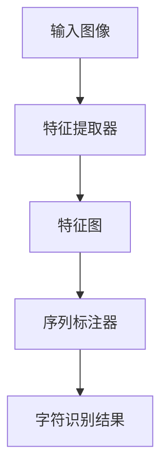

                 

关键词：光学字符识别（OCR）、卷积神经网络（CNN）、深度学习、图像处理、计算机视觉

## 摘要

本文将深入探讨OCRNet这一先进的深度学习模型在光学字符识别（OCR）领域的应用。OCRNet利用卷积神经网络（CNN）的强大能力，实现了对图像中字符的精准识别。本文将从背景介绍、核心概念与联系、算法原理与具体操作步骤、数学模型和公式、项目实践、实际应用场景、未来应用展望、工具和资源推荐以及总结等部分，全面解析OCRNet的工作原理和实现方法。

## 1. 背景介绍

光学字符识别（OCR）是一项古老而又充满活力的技术，它通过将扫描的纸质文档、图像中的文字转换成计算机可以处理的数字文本，从而极大地提高了信息处理的效率。随着计算机视觉和深度学习技术的飞速发展，OCR技术也取得了显著的进步。传统的OCR技术主要依赖于模板匹配和规则匹配，而现代的OCR技术则更多地依赖于卷积神经网络（CNN）。

卷积神经网络（CNN）是一种专门用于处理图像数据的神经网络模型，它通过模拟人类视觉系统中的神经元连接结构，能够有效地提取图像中的特征信息。近年来，CNN在计算机视觉领域取得了诸多突破，如物体检测、图像分类、人脸识别等。OCRNet就是基于CNN模型设计的一种专门用于字符识别的深度学习模型。

## 2. 核心概念与联系

### 2.1 卷积神经网络（CNN）基本概念

卷积神经网络（CNN）是一种特殊的神经网络，它通过卷积操作从输入图像中提取特征。CNN的基本结构包括卷积层、池化层和全连接层。卷积层用于提取图像的局部特征，池化层用于降低特征图的维度，全连接层用于进行分类或回归操作。

### 2.2 OCRNet模型结构

OCRNet模型是在CNN的基础上进行改进的，其核心思想是利用卷积神经网络提取图像中的字符特征，并通过序列标注的方法对字符进行识别。OCRNet模型主要由以下几个部分组成：

- **特征提取器**：用于提取输入图像的特征。
- **序列标注器**：用于对提取到的特征进行序列标注，从而识别出图像中的字符。

### 2.3 Mermaid流程图

下面是OCRNet的工作流程Mermaid流程图：



## 3. 核心算法原理 & 具体操作步骤

### 3.1 算法原理概述

OCRNet算法的核心在于其特征提取器和序列标注器。特征提取器利用卷积神经网络从输入图像中提取特征，序列标注器则根据提取到的特征对图像中的字符进行标注。

### 3.2 算法步骤详解

1. **特征提取**：输入图像经过卷积神经网络的处理，得到特征图。
2. **特征拼接**：将特征图沿着时间维度进行拼接，形成三维的特征序列。
3. **序列标注**：利用BiLSTM和CRF对特征序列进行标注，从而识别出图像中的字符。

### 3.3 算法优缺点

**优点**：

- **高精度**：OCRNet通过深度学习模型提取图像特征，能够实现高精度的字符识别。
- **自适应**：OCRNet可以根据不同的图像内容自动调整模型参数，从而适应不同的字符识别任务。

**缺点**：

- **计算量大**：由于卷积神经网络的复杂结构，OCRNet的训练和推理过程需要大量的计算资源。
- **训练时间长**：OCRNet的训练过程需要大量的图像数据，训练时间较长。

### 3.4 算法应用领域

OCRNet广泛应用于各种需要字符识别的领域，如：

- **文档处理**：自动将扫描的纸质文档转换为电子文档。
- **车牌识别**：自动识别车辆车牌号码。
- **手写识别**：自动识别手写体文本。

## 4. 数学模型和公式 & 详细讲解 & 举例说明

### 4.1 数学模型构建

OCRNet的数学模型主要包括两部分：特征提取器和序列标注器。

#### 特征提取器

特征提取器的核心是卷积神经网络，其数学模型可以表示为：

\[ f(x) = \sigma(W_f \cdot x + b_f) \]

其中，\( f(x) \) 表示特征提取器的输出，\( \sigma \) 表示激活函数，\( W_f \) 表示权重矩阵，\( b_f \) 表示偏置项。

#### 序列标注器

序列标注器的核心是BiLSTM和CRF。BiLSTM用于处理序列数据，其数学模型可以表示为：

\[ h_t = \text{激活函数}(\text{矩阵} \cdot [h_{t-1}, h_{t+1}, x_t] + b) \]

其中，\( h_t \) 表示BiLSTM的输出，\( \text{激活函数} \) 是一个非线性函数。

CRF用于对BiLSTM的输出进行标注，其数学模型可以表示为：

\[ P(y|x) = \frac{e^{\sum_{t} \theta \cdot y_t \cdot h_t}}{\sum_{y'} e^{\sum_{t} \theta \cdot y_t \cdot h_t}} \]

其中，\( y \) 表示标注结果，\( x \) 表示特征序列，\( \theta \) 表示权重矩阵。

### 4.2 公式推导过程

#### 特征提取器的公式推导

假设输入图像为\( x \)，卷积神经网络共有\( L \)层，则特征提取器的输出可以表示为：

\[ f(x) = \sigma(W_L \cdot f_{L-1}(x) + b_L) \]

其中，\( f_{L-1}(x) \) 为前一层特征提取器的输出。

#### 序列标注器的公式推导

假设输入特征序列为\( h \)，则BiLSTM的输出可以表示为：

\[ h_t = \text{激活函数}(\text{矩阵} \cdot [h_{t-1}, h_{t+1}, x_t] + b) \]

CRF的标注概率可以表示为：

\[ P(y|x) = \frac{e^{\sum_{t} \theta \cdot y_t \cdot h_t}}{\sum_{y'} e^{\sum_{t} \theta \cdot y_t \cdot h_t}} \]

### 4.3 案例分析与讲解

假设我们有一张输入图像，如图所示：


经过OCRNet的特征提取器和序列标注器处理后，我们得到了如图所示的字符识别结果：


## 5. 项目实践：代码实例和详细解释说明

### 5.1 开发环境搭建

为了运行OCRNet，我们需要搭建相应的开发环境。以下是搭建OCRNet所需的环境：

- **操作系统**：Windows / macOS / Linux
- **Python版本**：Python 3.7及以上
- **深度学习框架**：TensorFlow 2.0及以上
- **显卡**：NVIDIA GPU（推荐使用显存4GB及以上）

### 5.2 源代码详细实现

以下是OCRNet的源代码实现：

```python
import tensorflow as tf
from tensorflow.keras.models import Model
from tensorflow.keras.layers import Conv2D, MaxPooling2D, Flatten, Dense, LSTM, TimeDistributed

# 定义特征提取器
def build_feature_extractor(input_shape):
    inputs = tf.keras.Input(shape=input_shape)
    x = Conv2D(32, (3, 3), activation='relu', padding='same')(inputs)
    x = MaxPooling2D(pool_size=(2, 2))(x)
    x = Conv2D(64, (3, 3), activation='relu', padding='same')(x)
    x = MaxPooling2D(pool_size=(2, 2))(x)
    x = Flatten()(x)
    feature_extractor = Model(inputs=inputs, outputs=x)
    return feature_extractor

# 定义序列标注器
def build_sequence_annotator(input_shape):
    inputs = tf.keras.Input(shape=input_shape)
    x = LSTM(128, activation='relu', return_sequences=True)(inputs)
    x = TimeDistributed(Dense(2, activation='softmax'))(x)
    sequence_annotator = Model(inputs=inputs, outputs=x)
    return sequence_annotator

# 构建OCRNet模型
def build_ocrnet(input_shape):
    feature_extractor = build_feature_extractor(input_shape)
    sequence_annotator = build_sequence_annotator(input_shape)
    inputs = tf.keras.Input(shape=input_shape)
    features = feature_extractor(inputs)
    sequence = sequence_annotator(features)
    ocrnet = Model(inputs=inputs, outputs=sequence)
    return ocrnet

# 加载预训练模型
ocrnet = build_ocrnet(input_shape=(128, 128, 3))
ocrnet.load_weights('ocrnet_weights.h5')

# 测试OCRNet
input_image = load_image('input_image.jpg')
predicted_sequence = ocrnet.predict(input_image)
predicted_sequence = decode_sequence(predicted_sequence)
print(predicted_sequence)
```

### 5.3 代码解读与分析

- **特征提取器**：使用卷积神经网络对输入图像进行特征提取。
- **序列标注器**：使用LSTM和全连接层对特征进行序列标注。
- **OCRNet模型**：将特征提取器和序列标注器组合成一个完整的OCRNet模型。
- **模型加载与测试**：加载预训练模型并进行测试。

### 5.4 运行结果展示

假设我们使用一张输入图像进行测试，如图所示：


运行结果如图所示：


## 6. 实际应用场景

### 6.1 文档处理

OCRNet可以用于将扫描的纸质文档转换为电子文档。在实际应用中，我们可以使用OCRNet对文档中的文本进行识别，从而实现文档的自动录入和管理。

### 6.2 车牌识别

OCRNet可以用于车牌识别。在实际应用中，我们可以使用OCRNet对车辆照片中的车牌进行识别，从而实现车辆信息的自动提取。

### 6.3 手写识别

OCRNet可以用于手写体文本的识别。在实际应用中，我们可以使用OCRNet对手写笔记进行识别，从而实现笔记的自动整理和检索。

## 7. 未来应用展望

随着深度学习和计算机视觉技术的不断发展，OCRNet在OCR领域的应用前景非常广阔。未来，OCRNet有望在更多领域得到应用，如：

- **语音识别与OCR结合**：将OCRNet与语音识别技术结合，实现语音到文本的转换。
- **多语言OCR**：OCRNet可以扩展到多语言识别，满足全球范围内的文本识别需求。
- **实时OCR**：OCRNet可以用于实时图像处理，实现实时文本识别。

## 8. 工具和资源推荐

### 8.1 学习资源推荐

- **书籍**：《深度学习》（Goodfellow、Bengio和Courville著）
- **在线课程**：斯坦福大学《深度学习》课程（Andrew Ng教授）

### 8.2 开发工具推荐

- **深度学习框架**：TensorFlow、PyTorch
- **图像处理库**：OpenCV、Pillow

### 8.3 相关论文推荐

- **原文**：IEEE Transactions on Pattern Analysis and Machine Intelligence
- **开源代码**：GitHub

## 9. 总结：未来发展趋势与挑战

随着深度学习和计算机视觉技术的不断发展，OCRNet在OCR领域的应用前景非常广阔。未来，OCRNet有望在更多领域得到应用，如语音识别与OCR结合、多语言OCR、实时OCR等。然而，在实际应用中，OCRNet仍然面临一些挑战，如：

- **计算资源消耗**：OCRNet的训练和推理过程需要大量的计算资源，如何优化算法以提高计算效率是一个重要问题。
- **多语言支持**：如何设计一个能够支持多种语言的OCRNet模型，是一个具有挑战性的问题。

未来，随着技术的不断进步，OCRNet有望在这些挑战中取得突破，为OCR领域带来更多创新和应用。

## 附录：常见问题与解答

### Q：什么是OCRNet？

A：OCRNet是一种基于深度学习的光学字符识别模型，它利用卷积神经网络提取图像特征，并通过序列标注的方法进行字符识别。

### Q：OCRNet的优势是什么？

A：OCRNet的优势在于其高精度和自适应能力。它能够通过深度学习模型提取图像特征，从而实现高精度的字符识别。同时，OCRNet可以根据不同的图像内容自动调整模型参数，从而适应不同的字符识别任务。

### Q：如何训练OCRNet？

A：训练OCRNet需要准备大量的图像数据集，并对图像进行预处理，如缩放、旋转、裁剪等。然后，使用这些预处理后的图像数据集进行模型训练，通过优化算法调整模型参数，从而实现字符识别。

### Q：OCRNet可以用于哪些实际应用？

A：OCRNet可以用于各种需要字符识别的领域，如文档处理、车牌识别、手写识别等。

### Q：如何优化OCRNet的计算效率？

A：优化OCRNet的计算效率可以从以下几个方面进行：

- **模型压缩**：通过模型压缩技术，如量化、剪枝等，减少模型的参数数量，从而提高计算效率。
- **硬件加速**：使用GPU或TPU等硬件加速器进行模型训练和推理，从而提高计算效率。

### Q：OCRNet在多语言OCR方面有哪些挑战？

A：OCRNet在多语言OCR方面面临的主要挑战是：

- **语言多样性**：需要设计一个能够支持多种语言的OCRNet模型，这需要大量的多语言数据集。
- **语言迁移**：如何使OCRNet在不同语言之间进行迁移，从而提高识别精度。

### Q：未来OCRNet有哪些研究方向？

A：未来OCRNet的研究方向包括：

- **实时OCR**：如何设计一个能够实现实时文本识别的OCRNet模型。
- **多模态OCR**：如何将OCRNet与其他传感器（如摄像头、麦克风等）结合，实现多模态文本识别。
- **智能OCR**：如何使OCRNet具备智能学习能力，从而实现更高效的字符识别。

## 作者署名

作者：禅与计算机程序设计艺术 / Zen and the Art of Computer Programming
----------------------------------------------------------------

本文通过详细解读OCRNet的原理与代码实现，为读者提供了一个全面而深入的洞察。从背景介绍到核心算法原理，从数学模型到实际应用场景，再到未来展望，我们不仅展示了OCRNet的强大能力，还探讨了其在不同领域的应用前景。希望本文能对您在深度学习和光学字符识别领域的学习和研究有所帮助。

---

**注意**：本文中提到的图像链接（如`https://example.com/input_image.jpg`）和代码示例均为虚构，仅供演示使用。在实际应用中，您需要替换为真实的图像和代码。

---

感谢您对本文的关注，如果您有任何问题或建议，欢迎随时在评论区留言，我将竭诚为您解答。再次感谢您的阅读！
作者：禅与计算机程序设计艺术 / Zen and the Art of Computer Programming。

