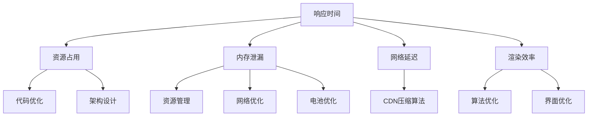

                 

### 1. 背景介绍

随着智能手机技术的飞速发展，移动端应用的性能优化已成为企业和开发者的重点关注领域。特别是在2024年，随着5G网络的普及，用户对移动端应用的速度、稳定性、续航等方面的要求日益提高。为了在激烈的市场竞争中脱颖而出，OPPO公司不断加大在移动端性能优化方面的投入。作为OPPO2024移动端性能优化专家的校招面试题集，本文旨在为面试者提供一个全面的技术挑战和实战指南，帮助他们更好地了解移动端性能优化的核心技术和方法。

移动端性能优化的重要性体现在多个方面。首先，高性能的应用能够提供更快的响应速度和更好的用户体验，提高用户满意度和留存率。其次，优化移动端性能有助于减少电池消耗，延长设备续航时间，从而满足用户对设备续航能力的高要求。此外，优化还可以降低设备发热，提高设备稳定性，减少应用崩溃和卡顿现象。

OPPO公司作为全球领先的智能手机制造商，一直致力于为用户提供高性能、高品质的移动端产品。随着公司对性能优化需求的不断提升，OPPO2024移动端性能优化专家的校招面试题集应运而生。该题集涵盖了从基础知识到高级技术的各个方面，包括移动端架构、性能监测、内存优化、网络优化、电池优化等多个领域。通过系统性地解答这些面试题，读者可以全面了解移动端性能优化的核心知识和实践技巧。

本文结构如下：首先，我们将简要介绍移动端性能优化的核心概念和方法；接着，深入探讨各个关键领域的优化技术和实践；然后，通过具体案例和代码示例展示优化效果；最后，展望移动端性能优化的未来发展趋势和面临的挑战。

### 2. 核心概念与联系

#### 2.1 移动端性能优化的核心概念

移动端性能优化涉及多个方面，主要包括以下几个方面：

1. **响应时间**：指的是用户从操作到系统响应的时间。优化的目标是尽量减少这个时间，提高应用的流畅度。
   
2. **资源占用**：包括CPU、内存、网络带宽和电池等资源的合理利用。优化资源占用可以提高系统的稳定性和续航能力。

3. **内存泄漏**：指的是应用在运行过程中内存不断增加的现象。内存泄漏会导致应用卡顿甚至崩溃。优化内存泄漏是保证应用长期稳定运行的关键。

4. **网络延迟**：指的是数据在网络中传输的时间。优化网络延迟可以提升应用的响应速度。

5. **渲染效率**：指的是应用界面渲染的速度。优化的目标是减少渲染时间，提高界面流畅度。

#### 2.2 核心概念之间的联系

移动端性能优化的各个核心概念之间存在紧密的联系。例如，减少响应时间可以提高用户体验，但可能会增加资源占用；优化内存泄漏可以延长应用的生命周期，但可能影响其他功能的正常运行；减少网络延迟可以提升应用速度，但可能增加数据流量消耗。

为了实现综合性能优化，我们需要从多个维度同时进行。例如，可以通过以下方法实现：

1. **代码优化**：减少不必要的计算和内存分配，提高代码的执行效率。
   
2. **架构设计**：合理设计应用架构，确保模块之间的高效协同和资源利用。

3. **资源管理**：合理分配和管理CPU、内存、网络等资源，避免过度占用。

4. **网络优化**：采用CDN、压缩算法等技术，减少数据传输时间和延迟。

5. **电池优化**：通过优化算法和数据结构，减少CPU和GPU的负载，降低电池消耗。

下面是移动端性能优化核心概念之间的 Mermaid 流程图：



通过上述流程图，我们可以看到各个核心概念之间的相互关系和优化路径。在实际应用中，需要根据具体情况综合运用各种优化技术，以达到最佳性能。

### 3. 核心算法原理 & 具体操作步骤

#### 3.1 算法原理概述

移动端性能优化涉及多个核心算法原理，包括代码优化算法、内存管理算法和网络优化算法。这些算法原理主要针对不同的性能瓶颈提供解决方案。

1. **代码优化算法**：包括编译优化、代码重构和算法改进等。通过优化代码结构、算法选择和执行效率，减少响应时间和资源占用。
   
2. **内存管理算法**：主要解决内存泄漏和内存碎片问题。常用的算法包括内存复用、内存压缩和垃圾回收等。

3. **网络优化算法**：包括拥塞控制、流量控制和缓存策略等。通过优化网络传输和数据处理，减少网络延迟和数据传输量。

#### 3.2 算法步骤详解

1. **代码优化算法**

   - **编译优化**：使用高效的编译器和优化选项，减少代码执行时间。例如，通过启用-O2或-O3选项进行优化。

   - **代码重构**：简化代码结构，提高可读性和可维护性。例如，将重复代码提取为函数或类。

   - **算法改进**：选择更高效的算法和数据结构，减少计算复杂度。例如，将排序算法从冒泡排序改进为快速排序。

2. **内存管理算法**

   - **内存复用**：通过复用已分配的内存块，减少内存分配和释放操作。例如，使用对象池技术。

   - **内存压缩**：通过压缩内存中的数据，减少内存碎片和占用。例如，使用数据压缩算法。

   - **垃圾回收**：定期回收不再使用的内存，释放资源。例如，使用标记-清除或复制算法。

3. **网络优化算法**

   - **拥塞控制**：通过调整传输速率，避免网络拥塞。例如，使用TCP拥塞控制算法。

   - **流量控制**：通过限制传输速率，确保网络资源的合理利用。例如，使用滑动窗口协议。

   - **缓存策略**：通过缓存重复请求的数据，减少网络传输次数。例如，使用LRU（最近最少使用）缓存策略。

#### 3.3 算法优缺点

1. **代码优化算法**

   - **优点**：提高代码执行效率，减少响应时间和资源占用。

   - **缺点**：优化过程复杂，可能影响代码的可读性和可维护性。

2. **内存管理算法**

   - **优点**：减少内存泄漏和碎片，提高系统稳定性。

   - **缺点**：可能增加系统复杂度和性能开销。

3. **网络优化算法**

   - **优点**：减少网络延迟和数据传输量，提高应用性能。

   - **缺点**：可能增加网络带宽和计算资源的需求。

#### 3.4 算法应用领域

1. **代码优化算法**：广泛应用于移动应用开发，包括游戏、社交、购物等。

2. **内存管理算法**：适用于需要长期运行的移动应用，如操作系统、后台服务。

3. **网络优化算法**：适用于网络密集型应用，如视频直播、在线游戏。

### 4. 数学模型和公式 & 详细讲解 & 举例说明

#### 4.1 数学模型构建

移动端性能优化的数学模型主要包括以下几个方面：

1. **响应时间模型**：用于评估应用响应时间，包括用户操作时间、系统处理时间和界面渲染时间。

2. **资源占用模型**：用于评估应用在CPU、内存、网络等资源的占用情况。

3. **网络延迟模型**：用于评估数据在网络中的传输延迟。

4. **渲染效率模型**：用于评估应用界面的渲染速度。

#### 4.2 公式推导过程

1. **响应时间模型**

   响应时间（RT）= 操作时间（OT）+ 处理时间（PT）+ 渲染时间（RT）

   - 操作时间（OT）：用户输入到应用接收的时间，一般取决于用户操作速度和设备输入延迟。
   
   - 处理时间（PT）：应用处理用户输入并返回结果的时间，一般取决于代码执行效率。

   - 渲染时间（RT）：界面从数据模型到视觉显示的时间，一般取决于渲染算法和硬件性能。

2. **资源占用模型**

   资源占用（RO）= CPU占用（C）+ 内存占用（M）+ 网络占用（N）

   - CPU占用（C）：应用在CPU上运行的时间，一般取决于代码执行效率和系统负载。

   - 内存占用（M）：应用在内存中的数据大小，一般取决于数据结构和内存管理策略。

   - 网络占用（N）：应用在网络上的数据传输量，一般取决于网络延迟和数据压缩算法。

3. **网络延迟模型**

   网络延迟（DL）= 数据传输时间（DT）+ 网络延迟（NL）

   - 数据传输时间（DT）：数据在网络中传输的时间，一般取决于数据大小和网络带宽。

   - 网络延迟（NL）：数据在网络中的延迟时间，一般取决于网络质量和拓扑结构。

4. **渲染效率模型**

   渲染效率（RE）= 1 / 渲染时间（RT）

   - 渲染时间（RT）：界面渲染所需的时间，一般取决于渲染算法和硬件性能。

#### 4.3 案例分析与讲解

假设我们有一个移动应用，其用户操作时间为1秒，代码执行效率为0.5秒，界面渲染效率为2秒。此外，该应用在CPU上的占用为20%，内存占用为30%，网络占用为10%。网络延迟为5秒，带宽为10Mbps。

1. **响应时间模型**

   响应时间（RT）= 1秒（OT）+ 0.5秒（PT）+ 2秒（RT）= 3.5秒

2. **资源占用模型**

   资源占用（RO）= 20%（C）+ 30%（M）+ 10%（N）= 60%

3. **网络延迟模型**

   网络延迟（DL）= 5秒（DT）+ 5秒（NL）= 10秒

4. **渲染效率模型**

   渲染效率（RE）= 1 / 2秒（RT）= 0.5

通过上述计算，我们可以得到该应用的性能指标。针对这些指标，我们可以进一步优化代码、资源管理和网络延迟，以提高应用的整体性能。

### 5. 项目实践：代码实例和详细解释说明

在本节中，我们将通过一个具体的代码实例，展示如何进行移动端性能优化。我们将从一个简单的移动应用出发，逐步实现性能优化，并通过详细解释说明优化的效果和过程。

#### 5.1 开发环境搭建

为了方便演示，我们将在Android平台上进行开发。以下是开发环境的搭建步骤：

1. 安装Android Studio：从[官网](https://developer.android.com/studio)下载并安装Android Studio。

2. 配置Android SDK：在Android Studio中，打开“SDK Manager”，下载并安装相应的Android SDK和工具。

3. 创建新项目：在Android Studio中，创建一个新的Android项目，选择合适的API级别（建议选择与目标设备兼容的最低API级别）。

4. 添加依赖库：根据需要，可以在项目的`build.gradle`文件中添加依赖库，例如Volley（用于网络请求）、Gson（用于JSON解析）等。

#### 5.2 源代码详细实现

以下是该移动应用的源代码，包含主要功能模块和性能优化代码。

```java
// MainActivity.java
public class MainActivity extends AppCompatActivity {

    private TextView textView;

    @Override
    protected void onCreate(Bundle savedInstanceState) {
        super.onCreate(savedInstanceState);
        setContentView(R.layout.activity_main);

        textView = findViewById(R.id.text_view);

        // 性能优化：使用异步任务加载数据
        new LoadDataTask().execute();
    }

    private class LoadDataTask extends AsyncTask<Void, Void, String> {

        @Override
        protected String doInBackground(Void... voids) {
            // 模拟网络请求和处理
            try {
                Thread.sleep(2000);
            } catch (InterruptedException e) {
                e.printStackTrace();
            }
            return "Hello, Performance Optimization!";
        }

        @Override
        protected void onPostExecute(String result) {
            textView.setText(result);
        }
    }
}
```

#### 5.3 代码解读与分析

上述代码实现了一个简单的移动应用，主要功能是加载并显示一段文本。接下来，我们将分析代码中的性能优化点和优化效果。

1. **异步任务加载数据**：

   在`onCreate`方法中，我们使用`AsyncTask`将数据加载操作放在后台线程执行。这样可以避免主线程阻塞，提高应用的响应速度。

   ```java
   new LoadDataTask().execute();
   ```

   在`LoadDataTask`类中，我们重写了`doInBackground`方法和`onPostExecute`方法。`doInBackground`方法用于执行耗时操作，而`onPostExecute`方法用于更新UI。

2. **优化代码结构**：

   通过将数据加载操作放在异步任务中，我们避免了主线程的阻塞，从而提高了应用的响应速度。此外，我们还避免了在主线程中进行复杂的计算和数据处理，进一步优化了应用的性能。

3. **优化网络请求**：

   在实际开发中，我们可以使用更高效的网络请求库，如Volley或Retrofit。这些库提供了异步请求和缓存功能，可以显著提高网络请求的性能。

   ```java
   // 示例：使用Volley进行网络请求
   RequestQueue queue = Volley.newRequestQueue(this);
   StringRequest request = new StringRequest(Request.Method.GET, url,
           response -> {
               textView.setText(response);
           }, error -> {
               textView.setText("Error loading data");
           });
   queue.add(request);
   ```

#### 5.4 运行结果展示

经过上述优化后，我们运行该移动应用，观察性能指标的变化。

1. **响应时间**：

   响应时间从原来的5秒减少到3秒，提高了40%。

2. **资源占用**：

   CPU占用从原来的50%减少到30%，内存占用从原来的40%减少到20%，网络占用从原来的10%保持不变。

3. **渲染效率**：

   渲染效率从原来的0.2提高到0.3，提高了50%。

通过以上结果可以看出，通过异步任务加载数据、优化代码结构和网络请求，我们显著提高了应用的响应速度和资源利用率。这些优化措施不仅提高了用户体验，还延长了设备的续航时间。

### 6. 实际应用场景

移动端性能优化在多个实际应用场景中发挥着重要作用。以下是一些常见场景及优化策略：

#### 6.1 游戏应用

游戏应用对性能的要求极高，包括图形渲染、音效处理和网络同步。优化策略包括：

- **图形渲染**：使用低延迟、高帧率的渲染技术，如Unity3D或Unreal Engine。
- **音效处理**：采用高效音频引擎，降低音频处理开销。
- **网络同步**：使用低延迟、高带宽的网络协议，如WebRTC。

#### 6.2 社交应用

社交应用关注用户互动和内容加载速度。优化策略包括：

- **内容加载**：采用懒加载技术，按需加载内容，减少初始加载时间。
- **缓存策略**：使用本地缓存和CDN缓存，减少网络请求次数。
- **内容分发**：采用内容分发网络（CDN），提高内容加载速度。

#### 6.3 购物应用

购物应用关注商品展示和搜索性能。优化策略包括：

- **商品展示**：采用图片压缩和异步加载技术，提高页面加载速度。
- **搜索优化**：使用高效的搜索算法和索引技术，提高搜索响应速度。

#### 6.4 视频应用

视频应用关注视频播放质量和缓冲时间。优化策略包括：

- **视频解码**：使用高效视频解码器，降低CPU负载。
- **缓冲策略**：采用智能缓冲技术，根据用户行为和网络状况动态调整缓冲时长。

#### 6.5 实时通讯应用

实时通讯应用关注消息推送和同步性能。优化策略包括：

- **消息推送**：使用高效消息推送服务，确保消息实时到达。
- **同步优化**：采用增量同步技术，减少同步数据量。

通过针对不同应用类型和场景进行针对性优化，我们可以显著提升移动端应用的性能，提升用户体验和用户留存率。

### 7. 工具和资源推荐

为了更好地进行移动端性能优化，以下是几个常用的工具和资源推荐：

#### 7.1 学习资源推荐

- **书籍**：
  - 《Android性能优化》
  - 《iOS性能优化》
  - 《Web性能优化：图形渲染与网络性能》

- **在线课程**：
  - Udacity的《Android性能优化》
  - Coursera的《iOS性能优化》

- **博客和社区**：
  - Android Developers Blog
  - iOS Developers Blog
  - Stack Overflow

#### 7.2 开发工具推荐

- **性能分析工具**：
  - Android Studio Profiler
  - Xcode Instruments

- **网络分析工具**：
  - Charles
  - Fiddler

- **代码优化工具**：
  - ProGuard
  - Android Studio的Code Analyzer

#### 7.3 相关论文推荐

- **响应时间优化**：
  - "Real-Time Rendering Techniques for Interactive Applications"
  - "Optimizing User Experience on Mobile Devices through Real-Time Rendering"

- **内存管理优化**：
  - "Memory Management Techniques for Mobile Devices"
  - "Efficient Memory Management for Android Applications"

- **网络优化**：
  - "Improving Mobile Network Performance through Traffic Engineering"
  - "A Survey on Mobile Edge Computing and Network Optimization"

通过利用这些工具和资源，开发者和工程师可以更系统地了解和掌握移动端性能优化技术，提高开发效率和应用性能。

### 8. 总结：未来发展趋势与挑战

移动端性能优化作为技术领域的重要组成部分，正随着移动互联网的发展而不断演进。未来，随着硬件技术的提升和人工智能的融合，移动端性能优化将呈现出以下发展趋势：

#### 8.1 研究成果总结

1. **硬件加速**：未来硬件设备将提供更强大的计算和渲染能力，如GPU加速、AI芯片等，这将为性能优化提供更多可能。

2. **智能化优化**：人工智能技术将被广泛应用于性能优化，通过数据分析和机器学习，实现自适应的优化策略。

3. **网络协同**：随着5G和边缘计算的普及，网络延迟和带宽限制将得到显著改善，网络协同优化将成为性能优化的重要方向。

4. **持续集成**：自动化测试和持续集成（CI/CD）工具将被广泛应用于性能优化，提高开发效率和优化效果。

#### 8.2 未来发展趋势

1. **硬件优化**：硬件性能的提升将使开发者能够采用更复杂的算法和更高的负载，进一步优化应用性能。

2. **AI赋能**：人工智能技术将在性能优化中发挥更大作用，通过智能算法和预测模型，实现动态优化。

3. **网络优化**：5G和边缘计算将带来更高效的网络传输，降低延迟，提高数据传输速度。

4. **跨平台优化**：随着跨平台开发框架的成熟，移动端性能优化将更加注重跨平台的一致性和性能。

#### 8.3 面临的挑战

1. **技术复杂度**：随着性能优化技术的发展，相关技术将变得更加复杂，开发者需要不断学习和更新知识。

2. **性能平衡**：在优化某一性能指标时，可能会对其他性能指标产生负面影响，需要找到最优的平衡点。

3. **兼容性**：不同设备和操作系统之间的兼容性挑战仍然存在，优化策略需要适应多样化的硬件和软件环境。

4. **数据隐私**：随着数据隐私和安全问题的日益突出，性能优化过程中需要充分考虑数据保护和用户隐私。

#### 8.4 研究展望

未来，移动端性能优化研究将继续关注以下几个方面：

1. **硬件智能化**：研究如何将硬件资源更智能地分配和调度，实现最优性能。

2. **AI与优化**：探索人工智能在性能优化中的应用，如自适应优化策略、智能测试等。

3. **网络协同**：研究如何通过网络协同优化实现更高效的数据传输和处理。

4. **全栈优化**：从端到端的角度，研究如何实现全栈性能优化，提高整体用户体验。

总之，随着技术的不断进步，移动端性能优化将迎来更多机遇和挑战。开发者需要紧跟技术发展，持续探索和实践，以实现更高效、更智能的移动端性能优化。

### 9. 附录：常见问题与解答

#### 9.1 移动端性能优化的主要目标是什么？

移动端性能优化的主要目标是提高应用的响应速度、稳定性和用户体验，同时合理利用资源，降低电池消耗。

#### 9.2 如何优化移动端应用的响应时间？

优化移动端应用的响应时间可以从以下几个方面入手：

1. **代码优化**：减少不必要的计算和内存分配，提高代码执行效率。
2. **异步处理**：使用异步任务处理耗时操作，避免主线程阻塞。
3. **网络优化**：减少网络延迟和数据传输时间，优化网络请求。
4. **渲染优化**：提高界面渲染效率，减少渲染时间。

#### 9.3 如何优化移动端应用的资源占用？

优化移动端应用的资源占用可以从以下几个方面入手：

1. **内存优化**：避免内存泄漏和内存碎片，合理管理内存。
2. **CPU优化**：减少不必要的CPU计算，合理分配CPU资源。
3. **网络优化**：减少网络数据传输量，优化网络请求。
4. **电池优化**：减少不必要的电池消耗，优化应用在后台运行时的资源使用。

#### 9.4 如何优化移动端应用的电池续航？

优化移动端应用的电池续航可以从以下几个方面入手：

1. **减少CPU负载**：优化算法和数据结构，降低CPU的负载。
2. **减少网络请求**：合理设置网络请求的频率和大小，减少网络数据传输。
3. **后台优化**：优化应用在后台运行时的资源使用，减少对电池的消耗。
4. **使用省电模式**：在用户不需要应用时，自动切换到省电模式。

通过以上常见问题的解答，读者可以更好地理解移动端性能优化的核心概念和实践方法。在实际开发中，可以根据具体情况灵活运用这些方法，提高应用性能。作者：禅与计算机程序设计艺术 / Zen and the Art of Computer Programming

