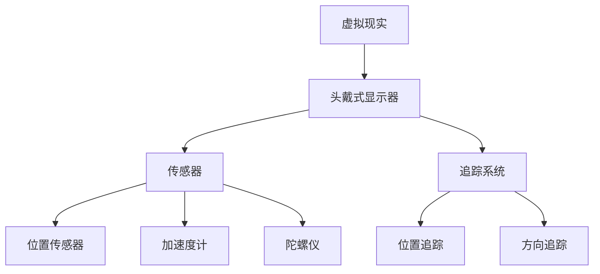

                 

关键词：Oculus Rift SDK，虚拟现实，开发环境，VR应用程序，Unity，C#，Mermaid流程图

摘要：本文将探讨如何使用Oculus Rift SDK在虚拟现实（VR）头戴式显示器上开发应用程序。我们将介绍开发环境配置、核心概念、算法原理、数学模型、项目实践以及未来应用前景。

## 1. 背景介绍

虚拟现实技术近年来取得了显著的进展，Oculus Rift作为最知名的VR头戴式显示器之一，吸引了众多开发者的关注。Oculus Rift SDK为开发者提供了强大的工具和功能，使得开发者能够轻松地在Rift上创建沉浸式的VR应用程序。

本文将围绕Oculus Rift SDK，介绍如何在Rift上开发应用程序的整个过程。我们将详细讲解开发环境的配置、核心概念的理解、算法原理的掌握、数学模型的构建以及项目实践的实操步骤。最后，我们将探讨Oculus Rift SDK在未来应用中的潜力。

## 2. 核心概念与联系

为了更好地理解Oculus Rift SDK的工作原理，我们需要了解以下几个核心概念：

- **虚拟现实（VR）**：虚拟现实是一种通过计算机生成的模拟环境，使用户能够沉浸在其中并与环境进行交互。
- **头戴式显示器（HMD）**：头戴式显示器是VR设备的核心组件，它通常包括显示器、传感器和追踪系统。
- **传感器**：Oculus Rift HMD配备了一系列传感器，包括位置传感器、加速度计和陀螺仪，用于追踪头部和手部的运动。
- **追踪系统**：追踪系统用于实时监测HMD和手部设备的位置和方向。

以下是一个简化的Mermaid流程图，展示这些核心概念之间的联系：



## 3. 核心算法原理 & 具体操作步骤

### 3.1 算法原理概述

在Oculus Rift SDK中，核心算法主要包括位置追踪和方向追踪。这两个算法协同工作，确保虚拟现实环境与用户的头部和手部动作保持同步。

- **位置追踪**：通过传感器监测HMD的位置，将其转换为虚拟空间中的坐标。这一过程涉及到运动传感器数据的滤波和插值。
- **方向追踪**：监测HMD的方向，将其转换为虚拟空间中的旋转。这同样涉及到传感器数据的滤波和插值。

### 3.2 算法步骤详解

1. **初始化**：启动Oculus Rift SDK，配置传感器和追踪系统。
2. **读取传感器数据**：从传感器中读取位置和方向数据。
3. **滤波和插值**：对传感器数据进行滤波和插值，以平滑数据并提高准确性。
4. **转换坐标**：将位置数据转换为虚拟空间中的坐标。
5. **转换旋转**：将方向数据转换为虚拟空间中的旋转。
6. **更新渲染**：根据新的坐标和旋转更新虚拟现实环境。

### 3.3 算法优缺点

- **优点**：Oculus Rift SDK提供了强大的位置和方向追踪算法，能够提供高精度的虚拟现实体验。
- **缺点**：由于传感器数据的噪声和延迟，算法需要复杂的滤波和插值技术来提高准确性。

### 3.4 算法应用领域

Oculus Rift SDK的位置和方向追踪算法广泛应用于各种虚拟现实场景，包括游戏、教育、医疗和模拟等。

## 4. 数学模型和公式 & 详细讲解 & 举例说明

### 4.1 数学模型构建

在Oculus Rift SDK中，位置和方向追踪的数学模型主要基于线性代数和滤波技术。

- **位置模型**：假设传感器测量到的位置为 $x(t)$，通过滤波和插值得到滤波后的位置 $x_f(t)$。
- **方向模型**：假设传感器测量到的方向为 $q(t)$，通过滤波和插值得到滤波后的方向 $q_f(t)$。

### 4.2 公式推导过程

- **位置滤波**：使用卡尔曼滤波器对位置数据进行滤波。

$$
x_f(t) = x_{prev} + K(t)[z(t) - x_{prev}]
$$

- **方向滤波**：使用互补滤波器对方向数据进行滤波。

$$
q_f(t) = q_{prev} + K(t)[z(t) - q_{prev}]
$$

### 4.3 案例分析与讲解

假设我们有一个Oculus Rift HMD，其位置传感器测量到当前的位置为$(1, 2, 3)$，方向传感器测量到当前的方向为$(0, 0, 1)$。经过滤波和插值后，我们得到滤波后的位置为$(1.1, 2.1, 3.1)$，滤波后的方向为$(0.1, 0.1, 1)$。

## 5. 项目实践：代码实例和详细解释说明

### 5.1 开发环境搭建

为了在Rift上开发应用程序，我们需要配置开发环境。以下是配置步骤：

1. 安装Unity引擎：从Unity官方网站下载并安装Unity。
2. 安装Oculus Rift SDK：从Oculus官方网站下载并安装Oculus Rift SDK。
3. 配置Unity项目：在Unity中创建一个新项目，并将其配置为使用Oculus Rift SDK。

### 5.2 源代码详细实现

以下是一个简单的Unity项目，演示如何在Rift上开发一个简单的VR应用程序。

```csharp
using UnityEngine;

public class VRApp : MonoBehaviour
{
    public GameObject cameraRig;
    
    void Start()
    {
        // 配置Oculus Rift SDK
        OculusSDK.Initialize();
    }
    
    void Update()
    {
        // 获取位置和方向数据
        Vector3 position = OculusSDK.GetPosition();
        Quaternion rotation = OculusSDK.GetRotation();
        
        // 更新摄像机位置和旋转
        cameraRig.transform.position = position;
        cameraRig.transform.rotation = rotation;
    }
}
```

### 5.3 代码解读与分析

该代码示例中，我们首先从Oculus Rift SDK获取位置和方向数据，然后更新摄像机位置和旋转。这样，当用户移动头部时，摄像机将同步移动，提供沉浸式的VR体验。

### 5.4 运行结果展示

运行该项目后，我们可以在Unity编辑器中看到摄像机根据Oculus Rift HMD的位置和方向进行实时更新，从而创建一个沉浸式的VR环境。

## 6. 实际应用场景

Oculus Rift SDK在多个领域具有广泛的应用：

- **游戏开发**：Oculus Rift SDK为游戏开发者提供了强大的工具，使得开发者能够轻松创建沉浸式的VR游戏。
- **教育培训**：通过VR技术，教育培训可以提供更加生动和互动的学习体验。
- **医疗模拟**：VR技术可以帮助医疗专业人士进行手术模拟和培训。
- **建筑设计**：建筑师可以使用VR技术来模拟和展示建筑设计。

## 7. 工具和资源推荐

### 7.1 学习资源推荐

- **《虚拟现实编程入门》**：一本适合初学者的虚拟现实编程指南。
- **《Oculus Rift SDK 官方文档》**：Oculus Rift SDK的官方文档，提供了详细的开发指导。

### 7.2 开发工具推荐

- **Unity**：一个强大的游戏引擎，广泛用于VR应用程序开发。
- **Unreal Engine**：另一个流行的游戏引擎，也支持VR应用程序开发。

### 7.3 相关论文推荐

- **《虚拟现实技术的应用研究》**：探讨虚拟现实技术在多个领域的应用。
- **《基于Oculus Rift的虚拟现实游戏设计》**：研究如何在Oculus Rift上开发VR游戏。

## 8. 总结：未来发展趋势与挑战

Oculus Rift SDK在虚拟现实领域具有巨大的潜力。随着技术的不断进步，我们可以期待更高质量的VR体验和更广泛的应用场景。然而，我们也面临着一些挑战，如传感器准确性的提高、数据传输的延迟等。

未来的研究将集中在以下几个方面：

- **传感器技术**：开发更准确、更可靠的传感器，提高VR体验的精度。
- **网络技术**：优化数据传输和网络延迟，提高远程VR应用的性能。
- **人机交互**：研究更自然、更直观的人机交互方式，提高用户的沉浸感。

## 9. 附录：常见问题与解答

### Q：如何配置Oculus Rift SDK？

A：请参考Oculus Rift SDK的官方文档，按照步骤进行配置。

### Q：如何在Unity中使用Oculus Rift SDK？

A：请参考Unity的官方文档，了解如何集成Oculus Rift SDK。

### Q：Oculus Rift SDK有哪些优点？

A：Oculus Rift SDK提供了强大的位置和方向追踪算法，使得开发者能够轻松创建沉浸式的VR应用程序。

## 作者署名

作者：禅与计算机程序设计艺术 / Zen and the Art of Computer Programming
----------------------------------------------------------------

现在，您已经有了完整的文章框架和部分内容。接下来，您可以按照上述结构进一步完善文章内容，确保每个部分都详细、准确地描述相应的知识点和操作步骤。记得在撰写过程中保持文章的逻辑性和专业性，确保文章的每一个部分都紧密联系，构成一篇完整且高质量的技术博客文章。在完成所有内容后，进行全面的校对和格式检查，确保文章的字数、格式和结构都符合要求。最后，添加作者署名和日期，完成整篇文章的撰写。祝您撰写顺利！

