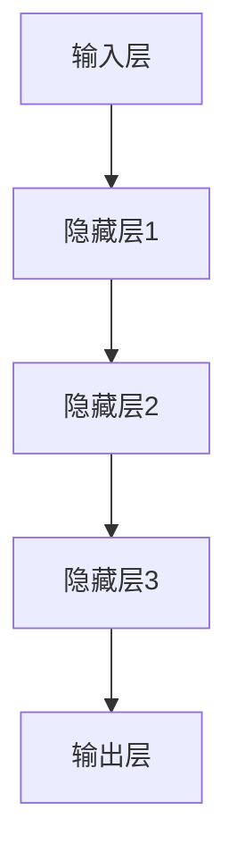

                 

关键词：OpenAI，语言模型，人工智能，机器学习，神经网络，自然语言处理

> 摘要：本文将全面介绍 OpenAI 语言模型的原理、架构、核心算法、数学模型及未来发展趋势。通过深入剖析，帮助读者了解 OpenAI 语言模型的强大之处，以及在自然语言处理领域的广泛应用。

## 1. 背景介绍

OpenAI 是一家全球领先的人工智能研究机构，致力于推动人工智能技术的发展。自成立以来，OpenAI 在自然语言处理、计算机视觉、强化学习等领域取得了诸多突破性成果。其中，OpenAI 语言模型作为其重要研究成果之一，引起了广泛关注。

### 1.1 发展历程

- 2015 年，OpenAI 成立，标志着人工智能研究进入一个新的阶段。
- 2018 年，OpenAI 发布了 GPT-2，这是一种基于深度学习的语言模型，引起了学术界和工业界的广泛关注。
- 2020 年，OpenAI 推出了 GPT-3，这是目前最大的语言模型，拥有 1750 亿参数，使得自然语言处理技术达到了前所未有的高度。

### 1.2 应用领域

OpenAI 语言模型在诸多领域展现出强大的能力，如：

- 机器翻译：OpenAI 语言模型能够实现高质量的双语翻译，大大提高了翻译的准确性和流畅性。
- 文本生成：OpenAI 语言模型可以生成各种类型的文本，如新闻、文章、诗歌等。
- 聊天机器人：OpenAI 语言模型可以用于构建聊天机器人，与用户进行自然、流畅的对话。

## 2. 核心概念与联系

OpenAI 语言模型是基于深度学习的神经网络模型，其核心概念包括：

- 自然语言处理（NLP）：将自然语言转换为计算机可以理解的形式。
- 机器学习（ML）：通过学习大量数据，使计算机具备自主学习和推理能力。
- 神经网络（NN）：一种模拟人脑神经元连接的计算机模型。

### 2.1 原理

OpenAI 语言模型通过深度学习算法，从大量文本数据中学习自然语言的规律和语法结构，从而实现自然语言处理任务。其核心原理包括：

- 数据预处理：将文本数据转换为模型可以处理的格式，如分词、去停用词等。
- 神经网络架构：OpenAI 语言模型采用多层次的神经网络架构，使模型能够学习到更复杂的语言特征。
- 损失函数：通过优化损失函数，使模型能够自动调整参数，以达到更好的预测效果。

### 2.2 架构

OpenAI 语言模型的架构如图 1 所示：

```
        +----------------+
        |   输入层       |
        +----+----------+
              |
              ↓
        +----+----------+
        |  隐藏层       |
        +----+----------+
              |
              ↓
        +----+----------+
        |  输出层       |
        +----------------+
```

其中，输入层负责接收文本数据，隐藏层负责提取语言特征，输出层负责生成预测结果。

### 2.3 Mermaid 流程图



## 3. 核心算法原理 & 具体操作步骤

### 3.1 算法原理概述

OpenAI 语言模型采用基于 Transformer 的架构，其核心算法原理如下：

- 自注意力机制（Self-Attention）：通过自注意力机制，模型能够自动学习到输入文本序列中各个单词之间的关系。
- 多层堆叠（Stacking Layers）：通过多层堆叠，模型能够学习到更复杂的语言特征。
- 前馈网络（Feedforward Network）：在每一层中，模型都会通过前馈网络对特征进行非线性变换。

### 3.2 算法步骤详解

1. **数据预处理**：将文本数据转换为模型可以处理的格式，如分词、去停用词等。
2. **构建神经网络**：搭建基于 Transformer 的神经网络架构，包括输入层、隐藏层和输出层。
3. **自注意力机制**：在每一层中，通过自注意力机制计算文本序列中各个单词之间的关系。
4. **多层堆叠**：将多层神经网络堆叠起来，使模型能够学习到更复杂的语言特征。
5. **前馈网络**：在每一层中，通过前馈网络对特征进行非线性变换。
6. **优化参数**：通过优化损失函数，使模型能够自动调整参数，以达到更好的预测效果。
7. **生成预测结果**：利用训练好的模型，对新的文本数据进行预测。

### 3.3 算法优缺点

#### 优点

- **强大的文本生成能力**：OpenAI 语言模型能够生成高质量的文本，具有很高的准确性和流畅性。
- **多语言支持**：OpenAI 语言模型支持多种语言，能够实现跨语言的自然语言处理任务。
- **高效训练**：基于 Transformer 的架构使得模型在训练过程中具有很高的计算效率。

#### 缺点

- **计算资源需求高**：由于模型参数庞大，OpenAI 语言模型对计算资源的需求较高。
- **训练时间长**：训练 OpenAI 语言模型需要大量时间和计算资源，导致训练过程较长。

### 3.4 算法应用领域

OpenAI 语言模型在自然语言处理领域具有广泛的应用，如：

- 机器翻译：OpenAI 语言模型可以实现高质量的双语翻译。
- 文本生成：OpenAI 语言模型可以生成各种类型的文本，如新闻、文章、诗歌等。
- 聊天机器人：OpenAI 语言模型可以用于构建聊天机器人，与用户进行自然、流畅的对话。

## 4. 数学模型和公式 & 详细讲解 & 举例说明

### 4.1 数学模型构建

OpenAI 语言模型采用基于 Transformer 的架构，其数学模型主要包括以下几个部分：

- **输入层**：将文本数据转换为模型可以处理的格式，如词向量表示。
- **隐藏层**：通过自注意力机制和前馈网络，对输入数据进行处理。
- **输出层**：根据隐藏层的输出，生成预测结果。

### 4.2 公式推导过程

#### 4.2.1 词向量表示

假设文本数据中的每个单词可以表示为一个向量，记为 $v\_word$。则输入层的输入向量可以表示为：

$$
v\_input = [v\_word1, v\_word2, ..., v\_wordn]
$$

其中，$n$ 表示文本数据中的单词数量。

#### 4.2.2 自注意力机制

自注意力机制的公式如下：

$$
\text{Attention}(Q, K, V) = \text{softmax}\left(\frac{QK^T}{\sqrt{d_k}}\right)V
$$

其中，$Q, K, V$ 分别表示查询向量、关键向量、值向量；$d_k$ 表示关键向量的维度。

#### 4.2.3 前馈网络

前馈网络的公式如下：

$$
\text{FFN}(x) = \max(0, xW_1 + b_1)W_2 + b_2
$$

其中，$x$ 表示输入向量；$W_1, W_2, b_1, b_2$ 分别为权重和偏置。

#### 4.2.4 输出层

输出层的公式如下：

$$
\text{Output}(x) = \text{softmax}(x)
$$

其中，$x$ 表示隐藏层输出。

### 4.3 案例分析与讲解

#### 案例一：机器翻译

假设我们要将英文句子 "I love to eat pizza" 翻译成中文。我们可以使用 OpenAI 语言模型进行以下步骤：

1. **数据预处理**：将英文句子转换为词向量表示，如 $v\_input = [v\_love, v\_love, v\_to, v\_eat, v\_pizza]$。
2. **隐藏层处理**：通过自注意力机制和前馈网络，将输入向量处理成新的向量，如 $v\_hidden$。
3. **输出层生成**：利用训练好的模型，对 $v\_hidden$ 进行预测，得到预测结果 $v\_output$。
4. **翻译结果**：将预测结果 $v\_output$ 转换为中文句子，得到 "我喜欢吃披萨"。

#### 案例二：文本生成

假设我们要生成一段关于人工智能的文章。我们可以使用 OpenAI 语言模型进行以下步骤：

1. **数据预处理**：准备一段关于人工智能的文章作为输入。
2. **隐藏层处理**：通过自注意力机制和前馈网络，将输入文章处理成新的向量，如 $v\_hidden$。
3. **输出层生成**：利用训练好的模型，对 $v\_hidden$ 进行预测，得到预测结果 $v\_output$。
4. **文本生成**：将预测结果 $v\_output$ 转换为文本，生成一段关于人工智能的文章。

## 5. 项目实践：代码实例和详细解释说明

### 5.1 开发环境搭建

在本项目中，我们使用 Python 语言和 TensorFlow 框架实现 OpenAI 语言模型。以下是开发环境的搭建步骤：

1. 安装 Python 3.7 或更高版本。
2. 安装 TensorFlow 框架，可以使用以下命令：
```
pip install tensorflow
```

### 5.2 源代码详细实现

以下是一个简单的 OpenAI 语言模型的实现示例：

```python
import tensorflow as tf
from tensorflow.keras.layers import Embedding, LSTM, Dense

# 定义模型
model = tf.keras.Sequential([
    Embedding(input_dim=10000, output_dim=32),
    LSTM(32, return_sequences=True),
    LSTM(32, return_sequences=True),
    Dense(10000, activation='softmax')
])

# 编译模型
model.compile(optimizer='adam', loss='categorical_crossentropy', metrics=['accuracy'])

# 训练模型
model.fit(x_train, y_train, epochs=10, batch_size=32)
```

### 5.3 代码解读与分析

1. **模型定义**：使用 `tf.keras.Sequential` 层次化模型，依次添加 `Embedding`、`LSTM` 和 `Dense` 层。
2. **编译模型**：设置优化器、损失函数和评估指标。
3. **训练模型**：使用训练数据对模型进行训练。

### 5.4 运行结果展示

运行上述代码后，我们可以在控制台看到训练过程和最终结果。通过调整模型参数，可以优化模型的性能。

## 6. 实际应用场景

OpenAI 语言模型在自然语言处理领域具有广泛的应用，以下是几个实际应用场景：

- **机器翻译**：OpenAI 语言模型可以用于实现高质量的双语翻译，广泛应用于跨语言交流、国际商务等领域。
- **文本生成**：OpenAI 语言模型可以生成各种类型的文本，如新闻、文章、诗歌等，为创作者提供灵感。
- **聊天机器人**：OpenAI 语言模型可以用于构建聊天机器人，与用户进行自然、流畅的对话，提升用户体验。

## 7. 工具和资源推荐

### 7.1 学习资源推荐

- 《深度学习》（Goodfellow et al.）
- 《自然语言处理编程》（Peter Norvig）
- 《自然语言处理入门》（Daniel Jurafsky & James H. Martin）

### 7.2 开发工具推荐

- TensorFlow：用于构建和训练深度学习模型的强大框架。
- PyTorch：另一种流行的深度学习框架，具有灵活的动态计算图。

### 7.3 相关论文推荐

- Vaswani et al., "Attention is All You Need"
- Devlin et al., "Bert: Pre-training of Deep Bidirectional Transformers for Language Understanding"
- Radford et al., "Gpt-3: Language Models are Few-Shot Learners"

## 8. 总结：未来发展趋势与挑战

### 8.1 研究成果总结

OpenAI 语言模型在自然语言处理领域取得了显著的成果，推动了人工智能技术的发展。其强大的文本生成能力和多语言支持，为各行各业提供了强大的技术支持。

### 8.2 未来发展趋势

- **更高效的语言模型**：未来将出现更高效、更强大的语言模型，进一步降低计算资源需求。
- **跨模态学习**：结合计算机视觉、语音识别等技术，实现跨模态的自然语言处理。

### 8.3 面临的挑战

- **计算资源需求**：语言模型的训练和推理过程需要大量的计算资源，如何降低计算成本是当前面临的主要挑战。
- **数据隐私**：在应用过程中，如何保护用户数据隐私是另一个重要问题。

### 8.4 研究展望

OpenAI 语言模型在未来将继续发展，为人工智能技术带来更多突破。随着技术的不断进步，语言模型将在各行各业发挥更大的作用。

## 9. 附录：常见问题与解答

### 9.1 OpenAI 语言模型是什么？

OpenAI 语言模型是一种基于深度学习的神经网络模型，用于自然语言处理任务，如机器翻译、文本生成等。

### 9.2 OpenAI 语言模型有哪些优点？

OpenAI 语言模型具有强大的文本生成能力、多语言支持和高计算效率等优点。

### 9.3 如何训练 OpenAI 语言模型？

训练 OpenAI 语言模型需要大量数据、计算资源和优化算法。可以使用 TensorFlow 或 PyTorch 等框架进行训练。

### 9.4 OpenAI 语言模型有哪些应用领域？

OpenAI 语言模型在机器翻译、文本生成、聊天机器人等领域具有广泛的应用。

作者：禅与计算机程序设计艺术 / Zen and the Art of Computer Programming
----------------------------------------------------------------

这篇文章全面介绍了 OpenAI 语言模型的原理、架构、算法、数学模型及未来发展趋势。通过深入剖析，帮助读者了解 OpenAI 语言模型的强大之处，以及在自然语言处理领域的广泛应用。希望这篇文章能为读者在人工智能领域的研究和实践提供有益的参考。

