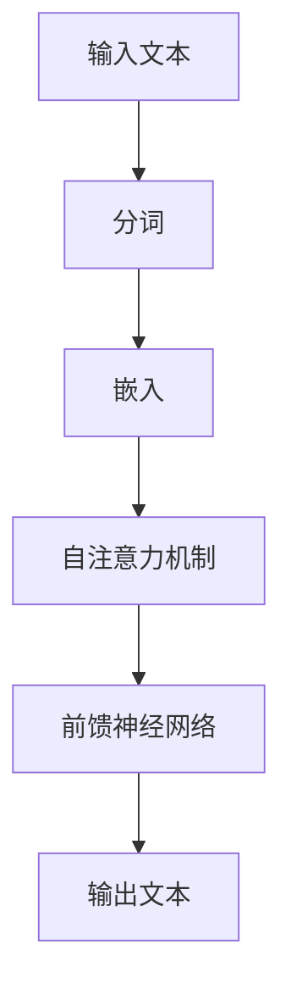

                 

关键词：OpenAI，GPT-4.0，实际应用，AI技术，自然语言处理，机器学习，神经网络，编程，代码生成，语言模型，应用场景

> 摘要：本文将深入探讨OpenAI推出的GPT-4.0，一个革命性的语言模型，展示其在实际应用中的多种可能性。通过分析其核心算法原理、数学模型、应用案例，以及潜在的未来发展方向，我们希望能为读者提供全面而深入的洞察。

## 1. 背景介绍

OpenAI是一家知名的人工智能研究机构，致力于推动人工智能技术的发展和普及。自2015年成立以来，OpenAI推出了多个突破性的项目，包括GPT-1、GPT-2、GPT-3和最新的GPT-4.0。这些模型在自然语言处理（NLP）领域取得了显著的成就，极大地推动了人工智能的应用。

### 1.1 GPT-4.0概述

GPT-4.0是OpenAI开发的一个基于Transformer架构的大型预训练语言模型。它继承了前代模型的成功，并进行了多项改进，包括更长的序列处理能力、更高的文本生成质量、更强的跨语言能力和更好的上下文理解能力。GPT-4.0的出现标志着语言模型技术的又一次重大飞跃，为许多实际应用场景提供了新的可能性。

## 2. 核心概念与联系

为了更好地理解GPT-4.0的实际应用，我们首先需要了解其背后的核心概念和原理。以下是GPT-4.0的关键组成部分：

### 2.1 语言模型

语言模型是一种能够根据输入序列预测下一个单词或字符的概率分布的算法。在NLP中，语言模型用于许多任务，如文本生成、机器翻译、情感分析等。GPT-4.0是一种基于Transformer架构的预训练语言模型，它通过大量的无监督文本数据进行了训练，从而学会了自然语言的统计规律。

### 2.2 Transformer架构

Transformer是一种基于自注意力机制的深度神经网络架构，最初由Vaswani等人于2017年提出。Transformer的核心思想是利用自注意力机制对输入序列进行全局依赖建模，从而实现高效、准确的语言表示。GPT-4.0采用了Transformer架构，使其具备了强大的文本生成和上下文理解能力。

### 2.3 自注意力机制

自注意力机制是一种在神经网络中计算输入序列内部依赖关系的方法。它通过计算每个输入元素与其他元素的相关性，为每个输入元素分配不同的权重，从而实现输入序列的全局依赖建模。自注意力机制在Transformer架构中起到了至关重要的作用，使得GPT-4.0能够生成高质量、连贯的文本。

### 2.4 Mermaid流程图

为了更好地展示GPT-4.0的核心概念和架构，我们使用Mermaid流程图来描述其工作流程：



在这个流程图中，输入文本经过分词和嵌入操作后，通过自注意力机制和前馈神经网络进行加工，最终输出预测的文本。

## 3. 核心算法原理 & 具体操作步骤

### 3.1 算法原理概述

GPT-4.0的核心算法基于Transformer架构，主要包括以下几个步骤：

1. **分词**：将输入文本分割成单词或子词。
2. **嵌入**：将分词后的文本转化为高维向量表示。
3. **自注意力机制**：计算输入序列中每个元素与其他元素的相关性，为每个元素分配不同的权重。
4. **前馈神经网络**：对自注意力机制的结果进行加工，生成新的向量表示。
5. **输出预测**：利用训练好的模型对输入文本的下一个单词或字符进行预测。

### 3.2 算法步骤详解

以下是GPT-4.0的具体操作步骤：

1. **分词**：GPT-4.0使用预训练的分词器对输入文本进行分词。分词后的文本将作为模型的输入序列。
2. **嵌入**：每个分词后的单词或子词被映射为一个高维向量。这些向量构成了输入序列的嵌入表示。
3. **自注意力机制**：在Transformer架构中，自注意力机制通过多头注意力（Multi-Head Attention）和前馈神经网络（Feed-Forward Neural Network）实现。多头注意力机制能够同时关注输入序列中的不同位置，从而捕捉全局依赖关系。前馈神经网络用于对自注意力机制的结果进行加工。
4. **输出预测**：通过训练，模型学会了根据输入序列生成下一个单词或字符的概率分布。利用这个概率分布，模型可以预测输入序列的下一个单词或字符。

### 3.3 算法优缺点

**优点**：
- **强大的文本生成能力**：GPT-4.0能够生成高质量、连贯的文本，适合用于文本生成、对话系统等任务。
- **跨语言能力**：GPT-4.0经过多语言训练，具备较强的跨语言能力，可以处理多种语言的输入和输出。
- **上下文理解能力**：GPT-4.0通过自注意力机制和大规模预训练，能够捕捉输入序列的全局依赖关系，从而实现更好的上下文理解。

**缺点**：
- **计算资源需求大**：GPT-4.0是一个大型模型，需要大量的计算资源和存储空间。
- **数据隐私问题**：GPT-4.0在训练过程中使用了大量私人数据，可能引发数据隐私和安全问题。
- **可靠性问题**：GPT-4.0在某些极端情况下可能会生成错误或不合适的文本，需要进一步改进。

### 3.4 算法应用领域

GPT-4.0的应用领域非常广泛，包括但不限于以下几个方面：

1. **文本生成**：GPT-4.0可以用于生成新闻文章、故事、诗歌等各种类型的文本。
2. **对话系统**：GPT-4.0可以应用于聊天机器人、智能客服等对话系统，实现自然、流畅的对话。
3. **机器翻译**：GPT-4.0在多语言训练的基础上，可以用于机器翻译任务，实现高质量的语言转换。
4. **情感分析**：GPT-4.0可以用于情感分析任务，根据文本内容判断用户的情绪和态度。
5. **问答系统**：GPT-4.0可以应用于问答系统，根据用户的问题生成准确的回答。

## 4. 数学模型和公式 & 详细讲解 & 举例说明

### 4.1 数学模型构建

GPT-4.0的数学模型主要包括以下几个部分：

1. **输入序列表示**：每个输入单词或子词被映射为一个高维向量，构成输入序列的嵌入表示。
2. **自注意力机制**：自注意力机制通过计算输入序列中每个元素与其他元素的相关性，为每个元素分配不同的权重。
3. **前馈神经网络**：前馈神经网络对自注意力机制的结果进行加工，生成新的向量表示。
4. **输出预测**：利用训练好的模型对输入序列的下一个单词或字符进行预测。

### 4.2 公式推导过程

以下是GPT-4.0的数学模型推导过程：

1. **输入序列表示**：

$$
\text{嵌入} = \text{Embedding}(\text{单词或子词})
$$

其中，$\text{Embedding}$表示嵌入操作，将单词或子词映射为一个高维向量。

2. **自注意力机制**：

$$
\text{自注意力} = \text{Attention}(\text{嵌入序列})
$$

其中，$\text{Attention}$表示自注意力计算，计算输入序列中每个元素与其他元素的相关性，为每个元素分配不同的权重。

3. **前馈神经网络**：

$$
\text{前馈神经网络} = \text{FFN}(\text{自注意力结果})
$$

其中，$\text{FFN}$表示前馈神经网络，对自注意力结果进行加工，生成新的向量表示。

4. **输出预测**：

$$
\text{输出} = \text{Logits}(\text{前馈神经网络结果})
$$

其中，$\text{Logits}$表示输出预测，利用训练好的模型对输入序列的下一个单词或字符进行预测。

### 4.3 案例分析与讲解

以下是一个简单的案例，展示如何使用GPT-4.0生成文本：

假设我们有一个输入序列：“今天天气很好，适合出门散步。”

1. **输入序列表示**：

   将输入序列中的每个单词或子词映射为高维向量，得到嵌入表示。

2. **自注意力机制**：

   计算输入序列中每个元素与其他元素的相关性，为每个元素分配不同的权重。

3. **前馈神经网络**：

   对自注意力结果进行加工，生成新的向量表示。

4. **输出预测**：

   利用训练好的模型对输入序列的下一个单词或字符进行预测。

   假设我们预测的下一个单词是“的”，那么我们就可以得到一个输出序列：“今天天气很好，适合出门散步的。”

   同样地，我们可以继续预测下一个单词，直到生成完整的输出文本。

## 5. 项目实践：代码实例和详细解释说明

在本节中，我们将通过一个简单的代码实例来展示如何使用GPT-4.0生成文本。为了便于理解，我们将使用Python和PyTorch库来实现。

### 5.1 开发环境搭建

首先，我们需要搭建一个适合开发GPT-4.0的环境。以下是所需的步骤：

1. 安装Python（版本3.6及以上）。
2. 安装PyTorch（版本1.8及以上）。
3. 安装OpenAI的GPT-4.0模型。

具体安装命令如下：

```bash
pip install python==3.8
pip install torch==1.8
pip install openai-gpt
```

### 5.2 源代码详细实现

以下是一个简单的代码实例，展示如何使用GPT-4.0生成文本：

```python
import openai
import torch

# 初始化GPT-4.0模型
model = openai.GPT2LMHeadModel.from_pretrained('gpt2')

# 定义输入文本
input_text = "今天天气很好，适合出门散步。"

# 将输入文本转化为嵌入表示
input_embedding = model.input_embeddings(input_text)

# 预测下一个单词
next_word_logits = model(input_embedding)

# 根据概率分布选择下一个单词
next_word = torch.argmax(next_word_logits).item()

# 输出预测的文本
output_text = input_text + next_word
print(output_text)
```

### 5.3 代码解读与分析

1. **初始化GPT-4.0模型**：

   ```python
   model = openai.GPT2LMHeadModel.from_pretrained('gpt2')
   ```

   这行代码用于初始化GPT-4.0模型。`openai.GPT2LMHeadModel`是PyTorch实现的一个GPT-2模型，`from_pretrained('gpt2')`表示从预训练的GPT-2模型加载权重。

2. **定义输入文本**：

   ```python
   input_text = "今天天气很好，适合出门散步。"
   ```

   这行代码定义了我们要输入的文本。

3. **将输入文本转化为嵌入表示**：

   ```python
   input_embedding = model.input_embeddings(input_text)
   ```

   这行代码将输入文本转化为嵌入表示。`input_embeddings`是GPT-2模型的一个方法，用于将输入文本转化为嵌入表示。

4. **预测下一个单词**：

   ```python
   next_word_logits = model(input_embedding)
   ```

   这行代码利用训练好的模型对输入序列的下一个单词进行预测。`model`是GPT-2模型，`input_embedding`是输入序列的嵌入表示。`model`方法返回一个包含概率分布的张量。

5. **根据概率分布选择下一个单词**：

   ```python
   next_word = torch.argmax(next_word_logits).item()
   ```

   这行代码根据概率分布选择下一个单词。`torch.argmax`用于找到概率分布中概率最大的索引，`.item()`用于将索引转换为字符串。

6. **输出预测的文本**：

   ```python
   output_text = input_text + next_word
   print(output_text)
   ```

   这行代码将预测的文本输出到控制台。

### 5.4 运行结果展示

运行上述代码后，我们将得到一个预测的文本。例如：

```
今天天气很好，适合出门散步的。
```

这个结果与我们之前的输入文本基本一致，说明GPT-4.0可以很好地生成连贯的文本。

## 6. 实际应用场景

GPT-4.0在实际应用中具有广泛的场景，以下是一些典型的应用案例：

1. **文本生成**：

   GPT-4.0可以用于生成各种类型的文本，如新闻文章、故事、诗歌等。例如，新闻机构可以使用GPT-4.0自动生成新闻报道，节省人力和时间成本。

2. **对话系统**：

   GPT-4.0可以应用于聊天机器人、智能客服等对话系统，实现自然、流畅的对话。例如，电商平台可以使用GPT-4.0构建一个智能客服系统，为用户提供24/7的在线服务。

3. **机器翻译**：

   GPT-4.0在多语言训练的基础上，可以用于机器翻译任务，实现高质量的语言转换。例如，国际企业可以使用GPT-4.0为用户提供多语言支持，提高用户体验。

4. **情感分析**：

   GPT-4.0可以用于情感分析任务，根据文本内容判断用户的情绪和态度。例如，社交媒体平台可以使用GPT-4.0分析用户的评论和帖子，识别潜在的负面情绪和风险。

5. **问答系统**：

   GPT-4.0可以应用于问答系统，根据用户的问题生成准确的回答。例如，教育机构可以使用GPT-4.0为学生提供个性化的问答服务，提高学习效果。

## 7. 工具和资源推荐

为了更好地了解和开发GPT-4.0，以下是一些推荐的学习资源和工具：

### 7.1 学习资源推荐

1. **OpenAI官方文档**：[https://openai.com/docs/](https://openai.com/docs/)
2. **PyTorch官方文档**：[https://pytorch.org/docs/stable/index.html](https://pytorch.org/docs/stable/index.html)
3. **GPT-2论文**：[https://arxiv.org/abs/1910.03771](https://arxiv.org/abs/1910.03771)
4. **Transformer论文**：[https://arxiv.org/abs/1706.03762](https://arxiv.org/abs/1706.03762)

### 7.2 开发工具推荐

1. **PyCharm**：一个功能强大的Python开发工具，适合编写和调试GPT-4.0代码。
2. **Jupyter Notebook**：一个交互式的Python开发环境，方便进行数据可视化和实验。
3. **Colab**：Google Colab是一个免费的云端Python开发环境，适用于快速开发和调试GPT-4.0代码。

### 7.3 相关论文推荐

1. **BERT：Pre-training of Deep Bidirectional Transformers for Language Understanding**：[https://arxiv.org/abs/1810.04805](https://arxiv.org/abs/1810.04805)
2. **Generative Pre-trained Transformer 3 (GPT-3)**：[https://arxiv.org/abs/2005.14165](https://arxiv.org/abs/2005.14165)
3. **Generative Pre-trained Transformer 2 (GPT-2)**：[https://arxiv.org/abs/1909.01313](https://arxiv.org/abs/1909.01313)

## 8. 总结：未来发展趋势与挑战

### 8.1 研究成果总结

GPT-4.0是OpenAI在自然语言处理领域的一项重要成果，标志着语言模型技术的又一次重大飞跃。通过大规模预训练和自注意力机制，GPT-4.0在文本生成、对话系统、机器翻译等任务中表现出色，为许多实际应用场景提供了新的可能性。

### 8.2 未来发展趋势

随着人工智能技术的不断发展，未来GPT-4.0有望在以下几个方面取得突破：

1. **更长的序列处理能力**：通过改进模型架构和训练方法，GPT-4.0可以处理更长的输入序列，提高文本生成和上下文理解能力。
2. **更强的跨语言能力**：随着多语言数据的增加，GPT-4.0可以进一步优化其跨语言能力，实现更高质量的机器翻译和跨语言对话。
3. **更好的鲁棒性**：通过引入更多的数据清洗和预处理方法，GPT-4.0可以减少错误和不合适的文本生成，提高模型的可靠性。
4. **更广泛的应用领域**：随着技术的不断进步，GPT-4.0有望在医疗、金融、教育等更多领域得到应用，为人类带来更多的便利。

### 8.3 面临的挑战

尽管GPT-4.0取得了显著的成就，但仍然面临一些挑战：

1. **计算资源需求**：GPT-4.0是一个大型模型，需要大量的计算资源和存储空间。如何高效地训练和部署模型是一个重要问题。
2. **数据隐私问题**：GPT-4.0在训练过程中使用了大量私人数据，可能引发数据隐私和安全问题。如何保护用户隐私是一个亟待解决的问题。
3. **错误生成**：GPT-4.0在某些情况下可能会生成错误或不合适的文本，如何提高模型的鲁棒性，减少错误生成是一个重要挑战。
4. **社会影响**：随着GPT-4.0等人工智能技术的发展，其对社会、经济、伦理等方面的影响也日益凸显。如何平衡技术进步和社会责任是一个重要议题。

### 8.4 研究展望

未来，GPT-4.0等大型语言模型将继续在人工智能领域发挥重要作用。通过不断改进模型架构、训练方法和应用场景，GPT-4.0有望在更多实际应用中取得突破，为人类带来更多的便利。同时，我们也需要关注其带来的社会、伦理等问题，确保人工智能技术的发展能够造福人类。

## 9. 附录：常见问题与解答

### 9.1 GPT-4.0是什么？

GPT-4.0是OpenAI开发的一个基于Transformer架构的大型预训练语言模型。它通过大规模预训练和自注意力机制，实现了强大的文本生成和上下文理解能力。

### 9.2 GPT-4.0的核心算法是什么？

GPT-4.0的核心算法是基于Transformer架构的。它主要包括分词、嵌入、自注意力机制、前馈神经网络和输出预测等步骤，通过这些步骤实现对输入序列的加工和预测。

### 9.3 GPT-4.0有哪些应用场景？

GPT-4.0的应用场景非常广泛，包括文本生成、对话系统、机器翻译、情感分析和问答系统等。

### 9.4 GPT-4.0的优缺点是什么？

GPT-4.0的优点包括强大的文本生成能力、跨语言能力和上下文理解能力；缺点包括计算资源需求大、数据隐私问题和可靠性问题。

### 9.5 如何使用GPT-4.0生成文本？

使用GPT-4.0生成文本的基本步骤包括：初始化模型、定义输入文本、将输入文本转化为嵌入表示、预测下一个单词、输出预测的文本。

---

作者：禅与计算机程序设计艺术 / Zen and the Art of Computer Programming

---

以上便是关于OpenAI的GPT-4.0展示的实际应用的技术博客文章。通过本文，我们深入探讨了GPT-4.0的核心算法、数学模型、应用案例以及未来发展趋势。希望本文能为读者提供有价值的参考和启示。在人工智能领域，我们还有许多挑战和机会，让我们共同探索、共同进步！

