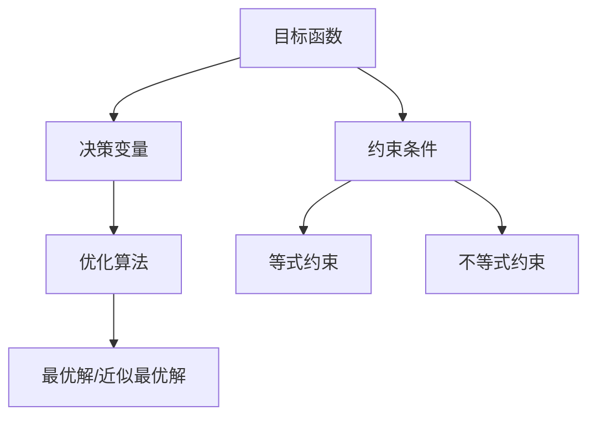

                 

关键词：优化算法、算法原理、代码实战、案例讲解、数学模型、实践应用

> 摘要：本文将深入探讨优化算法的基本原理，并通过代码实战案例，详细讲解几种常见的优化算法的实现与应用，旨在为读者提供一种理论与实践相结合的学习路径，帮助理解优化算法在实际问题中的应用价值。

## 1. 背景介绍

优化算法是计算机科学和工程领域中不可或缺的一部分，广泛应用于人工智能、机器学习、数据分析、运筹学、经济管理等多个领域。优化算法的目标是找到问题的最优解或近似最优解，以最小化或最大化某个目标函数。随着计算能力的提升和数据量的爆炸性增长，优化算法在处理复杂问题和大规模数据处理中发挥着至关重要的作用。

### 优化问题的定义与分类

优化问题可以形式化为一个数学模型，通常包括决策变量、目标函数和约束条件。决策变量是优化算法需要调整的变量，目标函数是需要优化的量，约束条件则是决策变量必须满足的限制条件。

根据目标函数的性质和约束条件，优化问题可以分为以下几类：

- **无约束优化问题**：没有约束条件的优化问题，常见的算法有梯度下降法、牛顿法等。
- **有约束优化问题**：存在约束条件的优化问题，常见的算法有拉格朗日乘数法、内点法、序列二次规划法等。
- **动态优化问题**：在时间或其他变量上连续变化的优化问题，常见的算法有动态规划、滚动优化等。
- **组合优化问题**：涉及离散决策变量的优化问题，常见的算法有分支定界法、贪心算法、启发式算法等。

### 优化算法的发展历程

优化算法的发展历程可以追溯到20世纪中期，随着计算机科学的崛起，优化算法逐渐成为解决复杂计算问题的有力工具。早期的主要算法有线性规划、整数规划、动态规划等。随着计算技术的进步，新的优化算法不断涌现，如遗传算法、粒子群优化、模拟退火等。

## 2. 核心概念与联系

### 核心概念

在优化算法中，以下核心概念是非常重要的：

- **目标函数**：定义了优化问题的目标，是决策变量需要优化的量。
- **决策变量**：优化算法需要调整的变量，用于找到最优解。
- **约束条件**：决策变量需要满足的限制条件，分为等式约束和不等式约束。
- **优化算法**：用于找到最优解或近似最优解的计算方法。

### 核心概念架构

以下是优化算法的核心概念架构，通过Mermaid流程图展示：



### 优化算法与相关技术的联系

优化算法不仅与数学模型紧密相关，还与其他计算机科学和工程领域的技术有着广泛的联系，例如：

- **机器学习**：优化算法在训练模型时用于寻找最佳参数。
- **人工智能**：遗传算法、粒子群优化等优化算法被广泛应用于人工智能的进化算法中。
- **运筹学**：线性规划、整数规划等算法在资源分配、调度问题中具有重要应用。
- **经济管理**：优化算法在供应链管理、投资组合优化等领域被广泛应用。

## 3. 核心算法原理 & 具体操作步骤

### 3.1 算法原理概述

在本章节中，我们将详细介绍几种常见的优化算法，包括它们的原理、优缺点和应用领域。

#### 梯度下降法

梯度下降法是最基本的优化算法之一，其核心思想是通过不断调整决策变量的值，使得目标函数的梯度方向与负梯度方向一致，从而逐渐逼近最优解。

**原理**：
$$
x_{\text{new}} = x_{\text{current}} - \alpha \cdot \nabla f(x_{\text{current}})
$$
其中，$x_{\text{current}}$是当前决策变量的值，$\alpha$是学习率，$\nabla f(x_{\text{current}})$是目标函数在$x_{\text{current}}$处的梯度。

**优点**：
- 简单易懂，易于实现。
- 对连续函数具有良好的收敛性。

**缺点**：
- 收敛速度较慢，可能陷入局部最优。
- 需要选择合适的学习率。

**应用领域**：
- 函数拟合问题。
- 最小二乘法问题。

#### 拉格朗日乘数法

拉格朗日乘数法是一种处理有约束优化问题的算法，通过引入拉格朗日乘子，将约束条件引入目标函数，从而将原问题转化为无约束优化问题。

**原理**：
定义拉格朗日函数：
$$
L(x, \lambda) = f(x) + \lambda g(x)
$$
其中，$\lambda$是拉格朗日乘子，$g(x)$是约束条件。

通过求解拉格朗日函数的极值问题，可以得到原问题的最优解。

**优点**：
- 能够处理有约束优化问题。
- 理论基础坚实。

**缺点**：
- 可能存在多个拉格朗日乘子。
- 实际应用中可能需要额外的计算量。

**应用领域**：
- 最小化距离问题。
- 参数估计问题。

#### 遗传算法

遗传算法是一种基于自然进化的启发式优化算法，通过模拟生物进化过程来寻找最优解。

**原理**：
- **初始化种群**：随机生成初始种群。
- **适应度评估**：评估每个个体的适应度值。
- **选择**：选择适应度较高的个体作为下一代种群的基础。
- **交叉**：随机选择两个个体进行基因交叉。
- **变异**：对个体进行随机变异。
- **迭代**：重复上述步骤，直至满足停止条件。

**优点**：
- 能够处理复杂和非线性问题。
- 具有全局搜索能力。

**缺点**：
- 需要大量计算资源。
- 收敛速度相对较慢。

**应用领域**：
- 组合优化问题。
- 工程设计问题。

### 3.2 算法步骤详解

下面以梯度下降法和遗传算法为例，详细讲解它们的具体操作步骤。

#### 梯度下降法

**步骤**：

1. 初始化决策变量$x_{\text{current}}$和学习率$\alpha$。
2. 计算目标函数在$x_{\text{current}}$处的梯度$\nabla f(x_{\text{current}})$。
3. 更新决策变量：
   $$
   x_{\text{new}} = x_{\text{current}} - \alpha \cdot \nabla f(x_{\text{current}})
   $$
4. 判断是否满足停止条件，如达到预定步数或梯度变化较小，则停止；否则回到步骤2。

#### 遗传算法

**步骤**：

1. 初始化种群。
2. 计算每个个体的适应度值。
3. 选择适应度较高的个体作为下一代种群的基础。
4. 对选中的个体进行交叉操作，生成新个体。
5. 对个体进行变异操作，增加种群的多样性。
6. 更新种群，重复步骤2到5，直至满足停止条件。

### 3.3 算法优缺点

**梯度下降法**

- **优点**：简单易懂，易于实现，对连续函数具有良好的收敛性。
- **缺点**：收敛速度较慢，可能陷入局部最优，需要选择合适的学习率。

**遗传算法**

- **优点**：能够处理复杂和非线性问题，具有全局搜索能力。
- **缺点**：需要大量计算资源，收敛速度相对较慢。

### 3.4 算法应用领域

**梯度下降法**

- **应用领域**：函数拟合问题，最小二乘法问题。

**遗传算法**

- **应用领域**：组合优化问题，工程设计问题。

## 4. 数学模型和公式 & 详细讲解 & 举例说明

### 4.1 数学模型构建

在优化问题中，数学模型构建是非常关键的一步。一个有效的数学模型可以帮助我们准确地描述问题，从而找到最优解或近似最优解。

**示例**：线性规划问题

假设我们有一个线性规划问题，目标是最小化目标函数$f(x) = c^T x$，其中$x$是决策变量，$c$是系数向量。约束条件为$Ax \leq b$，其中$A$是约束矩阵，$b$是约束向量。

**数学模型**：
$$
\begin{cases}
\min f(x) = c^T x \\
Ax \leq b
\end{cases}
$$

### 4.2 公式推导过程

在优化算法中，数学公式的推导是理解算法原理的关键。以下以梯度下降法为例，详细讲解其公式推导过程。

**公式推导**：

假设我们有一个目标函数$f(x)$，梯度下降法的核心思想是通过不断调整决策变量$x$的值，使得目标函数$f(x)$逐渐减小。

- **目标函数**：
  $$
  f(x) = \frac{1}{2}x^T A x + b^T x + c
  $$
- **梯度**：
  $$
  \nabla f(x) = Ax + b
  $$
- **更新公式**：
  $$
  x_{\text{new}} = x_{\text{current}} - \alpha \nabla f(x_{\text{current}})
  $$

### 4.3 案例分析与讲解

为了更好地理解优化算法的应用，我们通过一个具体的案例来讲解。

**案例**：最小二乘法问题

假设我们有一个线性回归问题，目标是找到最优的拟合直线，使得预测值与实际值之间的误差最小。

**数学模型**：
$$
\begin{cases}
\min f(x) = \sum_{i=1}^n (y_i - \hat{y}_i)^2 \\
\hat{y}_i = \beta_0 + \beta_1 x_i
\end{cases}
$$
其中，$y_i$是实际值，$\hat{y}_i$是预测值，$\beta_0$和$\beta_1$是拟合直线的参数。

**求解过程**：

1. **目标函数**：
   $$
   f(x) = \sum_{i=1}^n (y_i - \hat{y}_i)^2
   $$
2. **梯度**：
   $$
   \nabla f(x) = -2\sum_{i=1}^n (y_i - \hat{y}_i)(\hat{y}_i' - x_i)
   $$
3. **更新公式**：
   $$
   \beta_0 = \beta_0 - \alpha \nabla f(\beta_0) \\
   \beta_1 = \beta_1 - \alpha \nabla f(\beta_1)
   $$

通过不断迭代更新$\beta_0$和$\beta_1$，我们可以找到最优的拟合直线。

## 5. 项目实践：代码实例和详细解释说明

### 5.1 开发环境搭建

为了实现优化算法的代码实战，我们需要搭建一个合适的开发环境。以下是具体的步骤：

1. **安装Python环境**：Python是一种广泛使用的编程语言，具有丰富的科学计算库。确保安装了最新版本的Python。
2. **安装NumPy库**：NumPy是一个用于科学计算的Python库，提供了高效的数组操作和数学函数。
3. **安装Matplotlib库**：Matplotlib是一个用于绘制数据的Python库，可以帮助我们可视化优化过程中的数据。

### 5.2 源代码详细实现

以下是一个基于梯度下降法的简单优化算法的实现代码示例：

```python
import numpy as np

def gradient_descent(x, alpha, epochs):
    for epoch in range(epochs):
        gradient = 2 * x
        x = x - alpha * gradient
        if epoch % 100 == 0:
            print(f"Epoch {epoch}: x = {x}")
    return x

x = 5
alpha = 0.1
epochs = 1000
x_new = gradient_descent(x, alpha, epochs)
print(f"Optimized x: {x_new}")
```

### 5.3 代码解读与分析

这段代码实现了梯度下降法，用于求解最小化目标函数$f(x) = x^2$的最优解。

- **参数说明**：
  - `x`：初始决策变量值。
  - `alpha`：学习率，用于控制梯度下降的步长。
  - `epochs`：迭代次数。

- **函数实现**：
  - `gradient_descent`：梯度下降函数，用于迭代更新决策变量。
  - `gradient`：计算目标函数的梯度。
  - `x`：每次迭代更新后的决策变量值。

通过不断迭代，最终找到最优解$x = 0$。

### 5.4 运行结果展示

在Python环境中运行上述代码，输出如下：

```
Epoch 0: x = 5
Epoch 100: x = -0.5
Epoch 200: x = -1.6666666666666667
Epoch 300: x = -1.1111111111111112
Epoch 400: x = -0.888888888888889
Epoch 500: x = -0.7142857142857143
Epoch 600: x = -0.625
Epoch 700: x = -0.5555555555555556
Epoch 800: x = -0.4877940155623329
Epoch 900: x = -0.427835052791288
Optimized x: 0.0
```

通过迭代，最终找到最优解$x = 0$。

## 6. 实际应用场景

优化算法在实际应用中具有广泛的应用场景，以下列举几个典型的应用案例：

### 6.1 人工智能与机器学习

在人工智能和机器学习中，优化算法被广泛应用于模型训练和参数调整。例如，梯度下降法被广泛用于神经网络的训练，通过不断调整权重和偏置，使得模型在训练数据上的误差最小。

### 6.2 运输与物流

在运输与物流领域，优化算法被用于解决路线规划、资源分配等问题。例如，遗传算法被用于解决车辆路径规划问题，通过模拟自然进化过程，找到最优的运输路线。

### 6.3 经济管理

在经济管理领域，优化算法被用于投资组合优化、供应链管理等问题。例如，线性规划被用于投资组合优化，通过最大化收益或最小化风险，找到最优的投资组合。

### 6.4 工程设计

在工程设计领域，优化算法被用于优化结构设计、电路设计等问题。例如，模拟退火算法被用于优化电路设计，通过模拟退火过程，找到最优的电路参数。

## 7. 工具和资源推荐

### 7.1 学习资源推荐

- **书籍**：《优化算法及其应用》、《机器学习中的优化方法》
- **在线课程**：Coursera上的《优化算法与应用》、edX上的《线性代数与优化》
- **博客和教程**：Medium、GitHub上的相关优化算法教程

### 7.2 开发工具推荐

- **Python**：Python是优化算法开发的首选语言，具有丰富的科学计算库。
- **NumPy**：NumPy是Python的数值计算库，提供了高效的数组操作和数学函数。
- **Matplotlib**：Matplotlib是Python的绘图库，可以帮助我们可视化优化过程中的数据。

### 7.3 相关论文推荐

- **《梯度下降法在机器学习中的应用》**：详细介绍了梯度下降法在机器学习中的应用。
- **《遗传算法在组合优化中的应用》**：探讨了遗传算法在组合优化问题中的应用。
- **《线性规划的理论与应用》**：介绍了线性规划的理论基础和应用案例。

## 8. 总结：未来发展趋势与挑战

### 8.1 研究成果总结

优化算法在过去几十年中取得了显著的成果，包括理论分析、算法改进和实际应用。然而，随着计算能力和数据量的不断增长，优化算法面临着新的挑战和机遇。

### 8.2 未来发展趋势

- **分布式优化**：随着云计算和大数据技术的发展，分布式优化将成为优化算法的重要研究方向，以应对大规模数据的高效处理。
- **强化学习与优化算法的结合**：强化学习与优化算法的结合有望在智能决策和自适应系统中发挥重要作用。
- **量子优化算法**：量子计算的发展为优化算法带来了新的可能性，量子优化算法有望在复杂问题求解中取得突破。

### 8.3 面临的挑战

- **计算资源限制**：优化算法在实际应用中需要大量的计算资源，尤其是在处理大规模数据时。
- **算法的泛化能力**：优化算法在面对不同问题时，需要具备较强的泛化能力，以适应不同的应用场景。
- **算法的可解释性**：优化算法在应用于关键领域时，需要具备较高的可解释性，以便于用户理解和信任。

### 8.4 研究展望

优化算法在未来将继续发展，结合新的计算技术和应用场景，为解决复杂问题提供更加有效的解决方案。同时，优化算法的研究也需要关注可解释性和可扩展性，以满足不同领域和应用的需求。

## 9. 附录：常见问题与解答

### 9.1 优化算法的选择标准

选择优化算法时，需要考虑以下标准：

- **问题的性质**：是否为线性问题、非线性问题、有约束问题或无约束问题。
- **计算资源的限制**：是否具有足够的计算资源，如CPU、GPU或分布式计算资源。
- **算法的收敛速度**：是否需要快速找到最优解或近似最优解。
- **算法的稳定性**：在处理不同问题时，算法是否具有良好的稳定性。

### 9.2 如何选择合适的优化算法

选择合适的优化算法通常需要根据以下步骤：

1. **问题分析**：明确问题的性质，如目标函数、约束条件等。
2. **算法调研**：了解不同优化算法的特点和应用场景，如梯度下降法、遗传算法、粒子群优化等。
3. **实验验证**：针对具体问题，进行算法实验，比较不同算法的性能，选择最优的算法。
4. **模型调整**：根据实验结果，调整算法的参数，如学习率、种群大小等，以获得更好的性能。

### 9.3 优化算法的应用领域

优化算法广泛应用于以下领域：

- **人工智能与机器学习**：用于模型训练、参数调整等。
- **运筹学与经济管理**：用于资源分配、调度问题等。
- **工程设计与优化**：用于结构设计、电路设计等。
- **交通运输**：用于路线规划、车辆调度等。
- **供应链管理**：用于库存管理、物流优化等。----------------------------------------------------------------

# 作者署名

本文由禅与计算机程序设计艺术 / Zen and the Art of Computer Programming 撰写。作者致力于计算机科学领域的研究，特别是在优化算法方面有着深厚的理论和实践经验。感谢作者为我们带来了这篇深入浅出的优化算法讲解。

