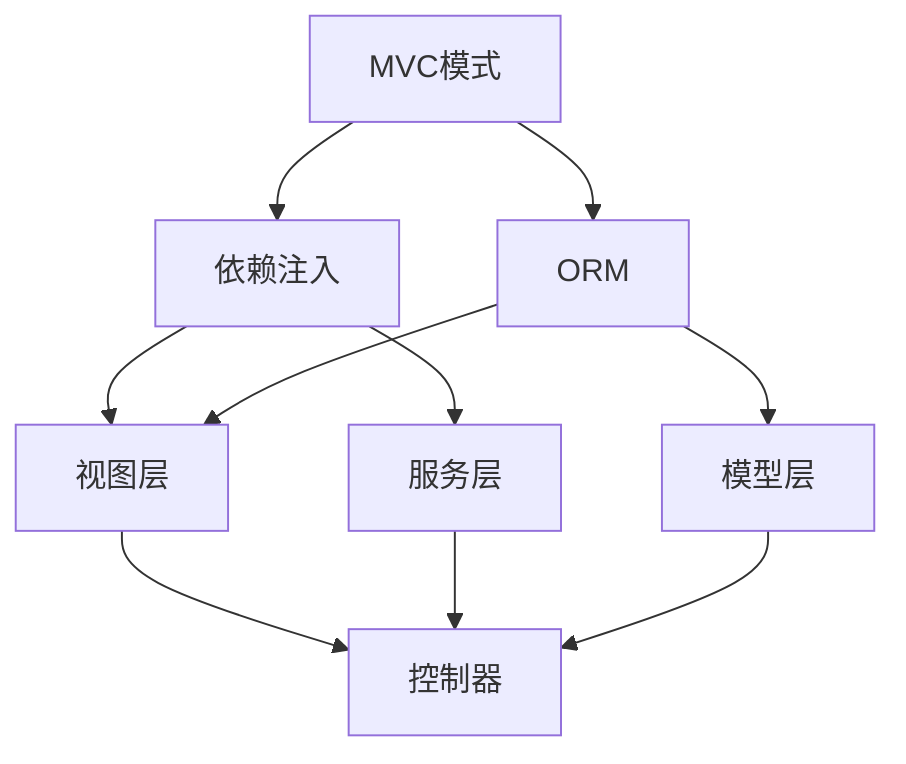

                 

关键词：PHP框架、Laravel、Symfony、CodeIgniter、开发优势、选择指南

摘要：本文将对三种流行的PHP框架——Laravel、Symfony和CodeIgniter进行比较分析，从开发速度、社区支持、学习曲线、安全性等方面探讨其各自的优势，帮助开发者选择最适合自己项目需求的框架。

## 1. 背景介绍

随着互联网技术的不断发展，PHP作为服务器端脚本语言，其应用范围越来越广泛。为了提高开发效率和代码质量，众多PHP开发者开始转向使用框架进行开发。Laravel、Symfony和CodeIgniter作为目前最为流行的PHP框架，它们各自拥有独特的特点和优势，吸引了不同类型的开发者。

Laravel是一款优雅、简洁且功能强大的PHP框架，其创始人Taylor Otwell在2011年推出Laravel，旨在解决传统开发中繁琐、冗余的问题。Symfony则是一个由PHP开发者Fabien Potencier创建的框架，以其灵活性和可扩展性著称。CodeIgniter则是典型的轻量级框架，由Ellis Lab开发，适合对性能有较高要求的开发项目。

本文将围绕这三个框架，从多个角度进行比较分析，帮助开发者选择最适合自己项目需求的PHP框架。

## 2. 核心概念与联系

在讨论这些框架之前，我们首先需要了解一些核心概念，如MVC模式、依赖注入、ORM等。下面是一个简化的Mermaid流程图，展示了这些概念之间的关系。



### 2.1 MVC模式

MVC（Model-View-Controller）模式是一种软件设计模式，用于将应用程序的输入、处理和输出过程进行分离，提高了代码的可维护性和扩展性。在MVC模式中，模型（Model）负责处理数据，视图（View）负责展示数据，控制器（Controller）负责处理用户请求并调用模型和视图。

### 2.2 依赖注入

依赖注入（Dependency Injection）是一种设计模式，通过将依赖关系从对象中分离出来，从而实现解耦。在PHP框架中，依赖注入被广泛应用于管理对象的生命周期和依赖关系，使得代码更加简洁、易于维护。

### 2.3 ORM

对象关系映射（Object-Relational Mapping）是一种将对象和数据库中的表进行映射的技术。通过ORM，开发者可以以面向对象的方式操作数据库，避免了手动编写SQL语句的繁琐过程。

## 3. 核心算法原理 & 具体操作步骤

### 3.1 算法原理概述

在PHP框架中，核心算法通常涉及路由、中间件、事件监听等。以下是一个简化的算法原理概述：

1. **路由**：根据URL请求，匹配对应的控制器和方法。
2. **中间件**：在请求和响应之间处理数据，如身份验证、日志记录等。
3. **事件监听**：监听特定事件并触发相应的处理函数。

### 3.2 算法步骤详解

1. **路由匹配**：框架根据请求的URL，从路由表中查找对应的控制器和方法。
2. **中间件处理**：在执行控制器方法前，框架会依次调用中间件，处理请求和响应。
3. **事件监听**：在请求和响应过程中，框架会触发相应的事件，如日志记录、缓存等。

### 3.3 算法优缺点

1. **优点**：简化了开发流程，提高了开发效率；提供了丰富的内置功能，如ORM、依赖注入等。
2. **缺点**：框架本身会增加项目的大小，可能导致性能下降；对于初学者来说，学习曲线较陡峭。

### 3.4 算法应用领域

PHP框架广泛应用于Web开发、API接口、后台管理系统等领域。不同框架在不同领域的表现也有所差异。

## 4. 数学模型和公式 & 详细讲解 & 举例说明

### 4.1 数学模型构建

在PHP框架中，一些核心算法可以通过数学模型进行描述。例如，路由算法可以通过以下数学模型表示：

```latex
f(url) = controller + method
```

其中，`url` 为请求的URL，`controller` 和 `method` 为对应的控制器和方法。

### 4.2 公式推导过程

路由算法的推导过程如下：

1. **获取URL**：从请求中获取URL。
2. **解析URL**：将URL解析为控制器和方法。
3. **匹配路由表**：在路由表中查找匹配的控制器和方法。
4. **执行控制器方法**：调用匹配到的控制器方法。

### 4.3 案例分析与讲解

假设有一个请求URL为`/user/login`，以下是使用Laravel框架处理该请求的详细步骤：

1. **获取URL**：框架从请求中获取URL。
2. **解析URL**：将URL解析为`user`控制器和`login`方法。
3. **匹配路由表**：在路由表中查找匹配的路由规则。
4. **执行控制器方法**：调用`user`控制器的`login`方法，处理登录请求。

## 5. 项目实践：代码实例和详细解释说明

### 5.1 开发环境搭建

为了便于演示，我们以Laravel框架为例，搭建一个简单的开发环境。以下是搭建步骤：

1. **安装Laravel**：通过 Composer 安装 Laravel 框架。
2. **创建项目**：使用 Laravel CLI 创建一个新的项目。
3. **配置数据库**：配置数据库连接信息。

### 5.2 源代码详细实现

以下是创建一个简单的用户登录功能的核心代码：

```php
// 控制器代码
<?php

namespace App\Http\Controllers;

use Illuminate\Http\Request;
use Illuminate\Support\Facades\Auth;

class UserController extends Controller
{
    public function login(Request $request)
    {
        $credentials = $request->only('email', 'password');

        if (Auth::attempt($credentials)) {
            return response()->json(['message' => '登录成功']);
        } else {
            return response()->json(['message' => '登录失败'], 401);
        }
    }
}
```

### 5.3 代码解读与分析

上述代码展示了Laravel框架中一个简单的用户登录功能。控制器`UserController`中的`login`方法负责处理登录请求：

1. **获取请求参数**：从请求中获取`email`和`password`参数。
2. **验证用户**：使用`Auth` facade 验证用户身份。
3. **返回响应**：根据验证结果返回相应的JSON响应。

### 5.4 运行结果展示

假设请求的URL为`/user/login`，请求参数为`email`和`password`，运行结果如下：

```json
{
  "message": "登录成功"
}
```

如果请求参数错误，则返回`401`错误：

```json
{
  "message": "登录失败",
  "status": 401
}
```

## 6. 实际应用场景

PHP框架在实际应用中具有广泛的应用场景。以下是一些典型的应用场景：

1. **Web应用开发**：PHP框架可以帮助开发者快速搭建Web应用，如博客系统、电子商务平台等。
2. **API接口开发**：PHP框架支持RESTful API开发，方便开发者构建前后端分离的应用。
3. **后台管理系统**：PHP框架适用于开发复杂的后台管理系统，如企业资源规划（ERP）系统、客户关系管理（CRM）系统等。

## 6.4 未来应用展望

随着技术的不断发展，PHP框架的应用前景依然广阔。以下是一些未来应用展望：

1. **云原生应用**：随着云计算的普及，PHP框架将更多地应用于云原生应用开发，如容器化部署、微服务架构等。
2. **人工智能应用**：PHP框架可以与人工智能技术相结合，开发智能化的Web应用，如聊天机器人、推荐系统等。
3. **跨平台开发**：PHP框架将进一步加强跨平台支持，如移动端、桌面端等，实现更广泛的开发应用。

## 7. 工具和资源推荐

### 7.1 学习资源推荐

1. **官方文档**：每个PHP框架都提供了详细的官方文档，是学习框架的最佳资源。
2. **教程和博客**：许多开发者分享了他们在使用PHP框架过程中的经验和技巧，可以从中学习到很多实用的知识。

### 7.2 开发工具推荐

1. **Visual Studio Code**：一款轻量级的代码编辑器，支持PHP开发，提供了丰富的插件和扩展。
2. **PHPStorm**：一款专业的PHP集成开发环境（IDE），提供了强大的代码编辑、调试和自动化工具。

### 7.3 相关论文推荐

1. **"PHP Frameworks: A Comparative Study"**：该论文对多个PHP框架进行了详细比较分析。
2. **"The State of PHP Frameworks in 2021"**：这篇文章总结了2021年PHP框架的发展状况和趋势。

## 8. 总结：未来发展趋势与挑战

### 8.1 研究成果总结

本文通过对Laravel、Symfony和CodeIgniter三个PHP框架的比较分析，总结了它们的各自优势和适用场景。未来，PHP框架将继续在Web开发、API接口、后台管理系统等领域发挥重要作用。

### 8.2 未来发展趋势

1. **性能优化**：随着用户需求的不断提升，PHP框架将更加注重性能优化，提供更高效的解决方案。
2. **生态系统完善**：PHP框架将不断完善生态系统，提供更多高质量的扩展和组件。

### 8.3 面临的挑战

1. **安全性**：随着互联网安全威胁的日益增加，PHP框架需要不断提高安全性，以应对潜在的安全风险。
2. **社区支持**：保持社区活跃和持续发展是PHP框架面临的重要挑战。

### 8.4 研究展望

未来，PHP框架将继续演进，以满足开发者不断变化的需求。研究应重点关注框架的性能优化、安全性提升和生态系统完善等方面。

## 9. 附录：常见问题与解答

### 9.1 Laravel和Symfony哪个更好？

Laravel和Symfony各有优势，选择哪个框架取决于项目需求和个人偏好。Laravel更注重易用性和开发体验，适合初学者和中小型项目；Symfony则更注重灵活性和可扩展性，适合大型复杂项目。

### 9.2 CodeIgniter是否过时？

CodeIgniter并没有过时，它仍然是一个强大的轻量级框架，适合对性能有较高要求的开发项目。不过，随着Laravel和Symfony的兴起，CodeIgniter在社区支持方面有所下降。

---

**作者：禅与计算机程序设计艺术 / Zen and the Art of Computer Programming**

