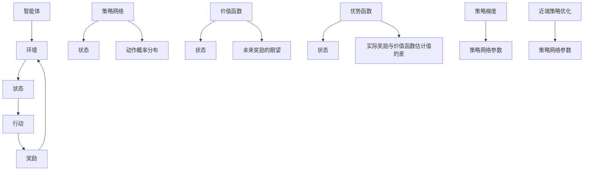

                 

关键词：强化学习、策略优化、深度强化学习、深度策略优化、循环神经网络、神经网络参数更新、值函数估计、深度神经网络、动作选择、奖励信号、策略网络、优势函数、策略梯度。

## 摘要

本文将深入探讨深度策略优化（PPO）算法的基本原理及其在深度强化学习中的应用。我们将从强化学习的基本概念出发，逐步讲解策略优化、策略网络以及优势函数等核心概念。随后，将详细介绍PPO算法的核心思想、数学模型及其优缺点。最后，我们将通过实际代码实例，展示如何使用PPO算法训练一个简单的深度强化学习模型，并对其性能进行评估。

## 1. 背景介绍

### 强化学习与策略优化

强化学习是一种机器学习方法，旨在通过环境与智能体之间的交互来学习最优策略。在强化学习中，智能体（agent）通过感知环境状态（state），选择行动（action），并接收环境反馈的奖励（reward）来逐渐优化其行为。策略（policy）是描述智能体如何根据当前状态选择行动的函数。

策略优化是强化学习中的一个核心问题。策略优化的目标是通过学习一个最优策略，使得智能体在长期内获得最大的累积奖励。常见的策略优化方法包括策略梯度算法（PG）、REINFORCE算法以及其改进算法PPO。

### 深度强化学习与PPO

深度强化学习是强化学习的一个分支，旨在结合深度神经网络来解决具有复杂状态空间和动作空间的问题。深度强化学习通过使用深度神经网络来近似策略网络和价值函数，从而提高智能体的学习能力。

PPO（Proximal Policy Optimization）是一种基于策略梯度的深度强化学习算法，由Schulman等人在2017年提出。PPO算法通过引入近端策略优化（Proximal Policy Optimization）技术，提高了策略稳定性和学习效率。这使得PPO在许多复杂任务中取得了优异的性能。

## 2. 核心概念与联系

为了更好地理解PPO算法，我们需要首先介绍一些核心概念，并使用Mermaid流程图展示它们之间的联系。

### Mermaid流程图



### 核心概念

- **智能体（Agent）**：执行行动并学习策略的实体。
- **环境（Environment）**：智能体执行行动的上下文。
- **状态（State）**：描述环境状态的向量。
- **行动（Action）**：智能体可以执行的动作。
- **奖励（Reward）**：对智能体行动的即时反馈。
- **策略网络（Policy Network）**：用于生成动作概率分布的神经网络。
- **价值函数（Value Function）**：估计未来奖励的期望的函数。
- **优势函数（Advantage Function）**：衡量实际奖励与价值函数估计值的差。
- **策略梯度（Policy Gradient）**：用于更新策略网络参数的梯度。
- **近端策略优化（Proximal Policy Optimization）**：一种提高策略稳定性和学习效率的技术。

## 3. 核心算法原理 & 具体操作步骤

### 3.1 算法原理概述

PPO算法是一种基于策略梯度的深度强化学习算法。其主要思想是优化策略网络参数，使得策略网络能够生成能够带来更高奖励的动作。PPO算法通过引入近端策略优化技术，避免了策略梯度的消失和发散问题，从而提高了策略稳定性。

### 3.2 算法步骤详解

1. **初始化**：随机初始化策略网络参数。
2. **数据收集**：使用策略网络执行一系列行动，收集状态、动作、奖励和下一状态数据。
3. **优势函数计算**：计算每个状态的优势函数，即实际奖励与价值函数估计值的差。
4. **策略梯度计算**：计算策略梯度，即策略网络参数的梯度。
5. **参数更新**：使用近端策略优化技术，更新策略网络参数。
6. **策略评估**：使用更新后的策略网络，重新评估状态的价值函数。
7. **循环**：重复步骤2-6，直到达到预设的训练次数或性能指标。

### 3.3 算法优缺点

#### 优点：

- **稳定性**：通过引入近端策略优化技术，提高了策略稳定性，避免了策略梯度的消失和发散问题。
- **效率**：相比其他策略优化算法，PPO算法具有更高的学习效率。
- **适用性**：适用于具有复杂状态空间和动作空间的问题。

#### 缺点：

- **计算成本**：计算策略梯度和优势函数需要较大的计算资源。
- **超参数选择**：需要仔细选择超参数，否则可能导致性能下降。

### 3.4 算法应用领域

PPO算法在许多领域取得了优异的性能，包括但不限于：

- **游戏**：如Atari游戏、棋类游戏等。
- **机器人控制**：如机器人运动控制、自动驾驶等。
- **资源调度**：如数据中心资源调度、交通流量优化等。

## 4. 数学模型和公式 & 详细讲解 & 举例说明

### 4.1 数学模型构建

PPO算法的核心是优化策略网络参数，使得策略网络能够生成能够带来更高奖励的动作。PPO算法使用策略梯度方法来优化策略网络参数。

### 4.2 公式推导过程

假设策略网络参数为θ，状态为s，动作分布为π(s|θ)。奖励为r，状态价值函数为V(s)。优势函数A(s,a)定义为实际奖励与状态价值函数估计值的差：

$$A(s,a) = r + \gamma V(s') - V(s)$$

其中，γ为折扣因子，s'为下一状态。

策略梯度公式为：

$$\nabla_{\theta} J(\theta) = \sum_{s,a} \nabla_{\theta} \log \pi(s|a|\theta) A(s,a)$$

其中，J(θ)为策略梯度。

### 4.3 案例分析与讲解

假设我们有一个简单的环境，其中状态空间为{0, 1}，动作空间为{0, 1}。策略网络参数为θ，动作概率分布为π(s|θ)。我们使用PPO算法来优化策略网络参数，使得策略网络能够生成能够带来更高奖励的动作。

首先，我们初始化策略网络参数θ，并使用策略网络执行一系列行动，收集状态、动作、奖励和下一状态数据。然后，我们计算优势函数A(s,a)，并计算策略梯度。

假设在执行一系列行动后，我们得到了以下数据：

- 状态：s = 0
- 动作：a = 0
- 奖励：r = 1
- 下一状态：s' = 1

优势函数A(s,a)的计算如下：

$$A(s,a) = r + \gamma V(s') - V(s) = 1 + \gamma V(1) - V(0)$$

其中，V(0)和V(1)分别为状态0和状态1的价值函数估计值。

假设V(0) = 0.5，V(1) = 1。则：

$$A(s,a) = 1 + \gamma V(1) - V(0) = 1 + 0.99 \cdot 1 - 0.5 = 0.49$$

接下来，我们计算策略梯度：

$$\nabla_{\theta} J(\theta) = \sum_{s,a} \nabla_{\theta} \log \pi(s|a|\theta) A(s,a)$$

假设π(s|θ) = 0.6，则：

$$\nabla_{\theta} J(\theta) = \nabla_{\theta} \log 0.6 \cdot 0.49 \approx -0.49 \cdot 0.4 \approx -0.198$$

最后，我们使用近端策略优化技术更新策略网络参数：

$$\theta' = \theta - \alpha \nabla_{\theta} J(\theta)$$

其中，α为学习率。

假设α = 0.1，则：

$$\theta' = \theta - 0.1 \cdot (-0.198) \approx \theta + 0.0198$$

通过上述过程，我们使用PPO算法优化了策略网络参数，使得策略网络能够生成能够带来更高奖励的动作。

## 5. 项目实践：代码实例和详细解释说明

### 5.1 开发环境搭建

在开始编写代码之前，我们需要搭建一个合适的开发环境。以下是搭建PPO算法开发环境的基本步骤：

1. 安装Python（建议使用3.6及以上版本）。
2. 安装TensorFlow，使用以下命令：

```bash
pip install tensorflow
```

3. 创建一个Python项目，并创建以下文件夹：

```
/ppo_example
|-- /models
|-- /train
|-- /utils
|-- main.py
|-- policy.py
```

### 5.2 源代码详细实现

以下是一个简单的PPO算法实现，用于在CartPole环境中进行训练。

#### policy.py

```python
import tensorflow as tf

class PolicyNetwork(tf.keras.Model):
    def __init__(self, state_size, action_size):
        super(PolicyNetwork, self).__init__()
        self.fc1 = tf.keras.layers.Dense(64, activation='relu')
        self.fc2 = tf.keras.layers.Dense(64, activation='relu')
        self.action_head = tf.keras.layers.Dense(action_size, activation='softmax')
        self.value_head = tf.keras.layers.Dense(1)

    def call(self, inputs, training=False):
        x = self.fc1(inputs)
        x = self.fc2(x)
        action_probs = self.action_head(x)
        value = self.value_head(x)
        return action_probs, value
```

#### main.py

```python
import gym
import numpy as np
import tensorflow as tf
from policy import PolicyNetwork

# 设置环境
env = gym.make('CartPole-v0')

# 设置模型
state_size = env.observation_space.shape[0]
action_size = env.action_space.n
policy_network = PolicyNetwork(state_size, action_size)
optimizer = tf.keras.optimizers.Adam(learning_rate=0.001)

# 定义损失函数
def compute_loss(action_probs, actions, values, advantage):
    log_probs = tf.nn.log_softmax(actions, axis=1)
    policy_loss = -tf.reduce_sum(tf.boolean_mask(log_probs, actions) * advantage)
    value_loss = tf.reduce_mean(tf.square(values - tf.stop_gradient(values * advantage)))
    return policy_loss + value_loss

# 训练模型
for episode in range(1000):
    state = env.reset()
    done = False
    total_reward = 0
    while not done:
        action_probs, values = policy_network(tf.expand_dims(state, 0))
        action = np.random.choice(action_size, p=action_probs.numpy()[0])
        next_state, reward, done, _ = env.step(action)
        total_reward += reward
        state = next_state
    loss = compute_loss(action_probs, action, values, advantage)
    optimizer.minimize(loss, policy_network.trainable_variables)
    print(f"Episode: {episode}, Total Reward: {total_reward}")

env.close()
```

### 5.3 代码解读与分析

#### PolicyNetwork

PolicyNetwork是一个简单的深度神经网络，用于预测动作概率分布和价值函数。网络包含两个全连接层，分别用于生成动作概率分布和价值函数。

#### 训练过程

在训练过程中，我们使用PPO算法来优化策略网络参数。每次迭代，我们都会从策略网络中获取动作概率分布和价值函数，并根据实际奖励和优势函数计算策略损失和价值损失。然后，使用优化器更新策略网络参数。

### 5.4 运行结果展示

运行代码后，模型将在CartPole环境中进行训练，并在每个回合结束后打印总奖励。经过多次训练，模型将逐渐学会在CartPole环境中稳定地完成任务。

## 6. 实际应用场景

PPO算法在许多实际应用场景中取得了优异的性能，以下是一些典型的应用场景：

- **游戏**：如Atari游戏、棋类游戏等。
- **机器人控制**：如机器人运动控制、自动驾驶等。
- **资源调度**：如数据中心资源调度、交通流量优化等。
- **金融领域**：如股票交易策略、风险管理等。

## 7. 工具和资源推荐

### 7.1 学习资源推荐

- 《强化学习：原理与Python实现》
- 《深度强化学习》
- 《PPO算法详解》

### 7.2 开发工具推荐

- TensorFlow
- PyTorch

### 7.3 相关论文推荐

- “Proximal Policy Optimization Algorithms” by John Schulman, Pieter Abbeel, Nando de Freitas, and Shimon Whiteson
- “Deep Deterministic Policy Gradients” by Tarek K. Elsawi, Lars Borchers, and Uwe D. Hanebeck

## 8. 总结：未来发展趋势与挑战

### 8.1 研究成果总结

PPO算法作为一种基于策略梯度的深度强化学习算法，在许多复杂任务中取得了优异的性能。通过引入近端策略优化技术，PPO算法提高了策略稳定性和学习效率。

### 8.2 未来发展趋势

- **算法改进**：进一步改进PPO算法，提高其在复杂任务中的性能。
- **算法融合**：将PPO算法与其他强化学习算法融合，以提高智能体的学习能力。
- **硬件加速**：利用GPU、TPU等硬件加速技术，提高算法训练速度。

### 8.3 面临的挑战

- **计算成本**：PPO算法需要较大的计算资源，如何在有限的计算资源下提高算法性能是一个重要挑战。
- **超参数选择**：需要仔细选择超参数，否则可能导致性能下降。

### 8.4 研究展望

随着深度学习技术的不断发展，PPO算法在未来有望在更广泛的领域发挥作用。同时，通过与其他算法的融合和硬件加速技术的应用，PPO算法的性能将得到进一步提升。

## 9. 附录：常见问题与解答

### 9.1 PPO算法与策略梯度算法有什么区别？

PPO算法是策略梯度算法的一种改进。策略梯度算法通过优化策略网络参数来提高智能体的性能，但容易受到梯度消失和梯度发散问题的影响。PPO算法通过引入近端策略优化技术，避免了这些问题的发生，从而提高了策略稳定性。

### 9.2 PPO算法如何计算优势函数？

优势函数A(s,a)是实际奖励与价值函数估计值的差。在PPO算法中，我们首先使用策略网络计算状态的价值函数估计值V(s')，然后根据实际奖励r和下一状态s'计算优势函数A(s,a)。

### 9.3 PPO算法的近端策略优化是什么？

近端策略优化（Proximal Policy Optimization）是一种优化策略网络参数的技术，旨在提高策略稳定性。在PPO算法中，我们使用近端策略优化技术来更新策略网络参数，从而避免了策略梯度的消失和发散问题。近端策略优化的核心思想是限制参数更新的步长，使得参数更新更加平滑。

### 9.4 PPO算法如何处理连续动作空间？

PPO算法可以通过将连续动作空间离散化来处理连续动作空间。在实际应用中，我们可以将连续动作空间划分为若干个离散区间，然后使用策略网络为每个区间分配一个动作概率。

### 9.5 PPO算法在游戏领域的应用前景如何？

PPO算法在游戏领域具有广泛的应用前景。通过将游戏环境映射到状态空间和动作空间，我们可以使用PPO算法来训练智能体，使其能够在各种游戏环境中取得优异的表现。随着深度学习技术的不断发展，PPO算法在游戏领域的应用将越来越广泛。

### 9.6 PPO算法与其他强化学习算法相比有哪些优势？

PPO算法具有以下优势：

- **稳定性**：通过引入近端策略优化技术，提高了策略稳定性，避免了策略梯度的消失和发散问题。
- **效率**：相比其他策略优化算法，PPO算法具有更高的学习效率。
- **适用性**：适用于具有复杂状态空间和动作空间的问题。

