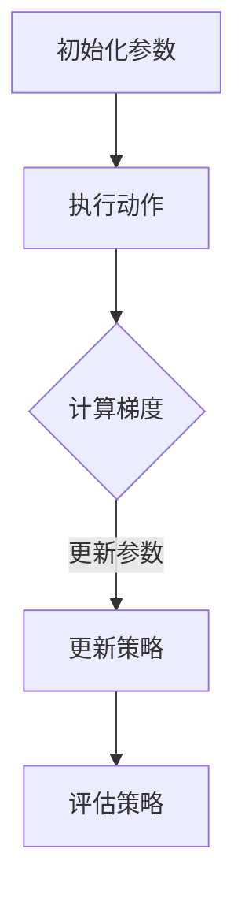

                 

 关键词：强化学习，PPO算法，NLP，自然语言处理，深度学习，模型优化，算法应用

> 摘要：本文详细介绍了强化学习中的PPO（Proximal Policy Optimization）算法，及其在自然语言处理（NLP）领域的应用实践。通过对PPO算法的背景、核心概念、原理、数学模型、具体操作步骤、优缺点、应用领域以及实践项目进行深入分析，旨在为读者提供全面的PPO算法在NLP中应用的理解和实践指导。

## 1. 背景介绍

强化学习（Reinforcement Learning，RL）是机器学习的一个重要分支，主要研究如何通过互动环境来优化决策策略。它具有模拟人类决策过程的天然优势，广泛应用于自动驾驶、游戏AI、推荐系统等领域。然而，强化学习在实际应用中面临着收敛速度慢、稳定性差等挑战。

为了解决这些问题，研究人员提出了多种强化学习算法，其中PPO算法因其高效的收敛速度和稳定的性能而被广泛应用。PPO算法属于策略梯度方法的一种，通过优化策略分布来提高决策质量。在自然语言处理（Natural Language Processing，NLP）领域，PPO算法在语言生成、文本分类、对话系统等方面展现出强大的潜力。

本文旨在探讨PPO算法的基本原理，详细解释其在NLP中的应用，并通过实际项目实践，帮助读者深入理解PPO算法在NLP中的实践应用。

## 2. 核心概念与联系

### 2.1 强化学习基本概念

强化学习包含以下几个核心概念：

- **代理（Agent）**：执行动作并从环境中获取反馈的实体。
- **环境（Environment）**：提供状态和奖励给代理，并依据代理的动作改变状态。
- **状态（State）**：描述环境的当前情况。
- **动作（Action）**：代理执行的操作。
- **奖励（Reward）**：根据代理的动作和环境的状态计算得到的反馈信号。
- **策略（Policy）**：描述代理如何选择动作的函数。

### 2.2 PPO算法原理

PPO（Proximal Policy Optimization）算法是一种策略优化算法，其核心思想是通过优化策略分布来提高决策质量。PPO算法的主要步骤包括：

1. **初始化策略参数**：初始化策略网络的参数。
2. **收集经验**：执行策略网络生成的动作，收集经验数据。
3. **计算梯度**：根据经验数据计算策略梯度和值函数梯度。
4. **更新参数**：利用梯度更新策略网络的参数。
5. **评估策略**：评估更新后的策略性能。

### 2.3 Mermaid 流程图



## 3. 核心算法原理 & 具体操作步骤

### 3.1 算法原理概述

PPO算法的核心在于策略优化，即通过优化策略分布来提高决策质量。PPO算法使用基于梯度的方法，通过优化策略梯度来更新策略参数。具体来说，PPO算法通过以下步骤实现策略优化：

1. **策略评估**：利用当前策略计算期望回报和策略值。
2. **策略优化**：通过优化策略梯度来更新策略参数。
3. **剪裁策略梯度**：为了防止梯度爆炸，对策略梯度进行剪裁。
4. **评估策略性能**：通过评估策略性能来指导参数更新。

### 3.2 算法步骤详解

#### 3.2.1 策略评估

1. **初始化策略参数**：初始化策略网络的参数。
2. **执行动作**：根据策略网络生成动作。
3. **收集经验数据**：记录动作和对应的奖励。
4. **计算期望回报**：利用回报函数计算期望回报。
5. **计算策略值**：利用策略网络计算策略值。

#### 3.2.2 策略优化

1. **计算策略梯度**：利用经验数据计算策略梯度。
2. **更新策略参数**：利用策略梯度更新策略网络的参数。
3. **剪裁策略梯度**：对策略梯度进行剪裁，防止梯度爆炸。
4. **计算新策略的期望回报**：利用新策略计算期望回报。

#### 3.2.3 评估策略性能

1. **评估策略性能**：通过评估策略性能来指导参数更新。
2. **迭代更新策略**：根据策略性能更新策略参数。

### 3.3 算法优缺点

#### 优点：

- **高效的收敛速度**：PPO算法能够快速收敛，提高了训练效率。
- **稳定的性能**：通过剪裁策略梯度，PPO算法能够避免梯度爆炸和梯度消失问题，提高了算法的稳定性。
- **灵活性**：PPO算法能够应用于多种强化学习问题，具有广泛的适用性。

#### 缺点：

- **计算复杂度较高**：PPO算法需要计算策略梯度，计算复杂度较高，对计算资源有一定要求。
- **参数调整较复杂**：PPO算法的参数调整较为复杂，需要根据具体问题进行调试。

### 3.4 算法应用领域

PPO算法在NLP领域具有广泛的应用，主要包括：

- **文本生成**：利用PPO算法生成高质量的文本。
- **文本分类**：通过PPO算法优化分类模型的策略。
- **对话系统**：利用PPO算法优化对话系统的策略，提高对话质量。

## 4. 数学模型和公式 & 详细讲解 & 举例说明

### 4.1 数学模型构建

PPO算法的数学模型主要包括策略网络和价值网络。策略网络负责生成动作，价值网络负责评估动作的价值。具体来说：

- **策略网络**：\( \pi_{\theta}(a|s) = P(a|s; \theta) \)，其中，\( \theta \)为策略参数，\( s \)为状态，\( a \)为动作。
- **价值网络**：\( V_{\phi}(s) = \mathbb{E}_{\pi_{\theta}}[G_t | s, a] \)，其中，\( \phi \)为价值网络参数，\( G_t \)为未来回报。

### 4.2 公式推导过程

PPO算法的核心在于优化策略参数。具体推导过程如下：

1. **策略评估**：计算期望回报和策略值。
   \[ J(\theta) = \mathbb{E}_{s, a}[\log \pi_{\theta}(a|s)] Q(s, a) \]
   \[ V_{\pi_{\theta}}(s) = \mathbb{E}_{\pi_{\theta}}[G_t | s, a] \]

2. **策略优化**：利用策略梯度和值函数梯度更新策略参数。
   \[ \nabla_{\theta} J(\theta) = \nabla_{\theta} \log \pi_{\theta}(a|s) Q(s, a) \]

3. **剪裁策略梯度**：为了防止梯度爆炸，对策略梯度进行剪裁。
   \[ \nabla_{\theta} J(\theta) = \nabla_{\theta} \log \pi_{\theta}(a|s) Q(s, a) \text{ if } |\nabla_{\theta} J(\theta)| \le \epsilon \]
   \[ \nabla_{\theta} J(\theta) = \text{sign}(\nabla_{\theta} J(\theta)) \text{ if } |\nabla_{\theta} J(\theta)| > \epsilon \]

4. **更新策略参数**：利用剪裁后的策略梯度更新策略参数。
   \[ \theta \leftarrow \theta - \alpha \nabla_{\theta} J(\theta) \]

### 4.3 案例分析与讲解

假设有一个简单的强化学习问题，代理需要在多个状态中选择动作，状态空间为\[1, 2, \ldots, 5\]，动作空间为\[1, 2, \ldots, 5\]。目标是最大化总回报。

1. **初始化策略参数**：初始化策略参数为\( \theta_0 \)。
2. **执行动作**：根据策略参数生成动作。
3. **收集经验数据**：记录动作和对应的奖励。
4. **计算期望回报**：利用回报函数计算期望回报。
5. **计算策略梯度**：利用经验数据计算策略梯度。
6. **更新策略参数**：利用策略梯度更新策略参数。
7. **评估策略性能**：通过评估策略性能来指导参数更新。

具体代码实现如下：

```python
import numpy as np

# 初始化策略参数
theta = np.random.rand(5)

# 定义回报函数
def reward_function(action):
    if action == 1:
        return 10
    elif action == 2:
        return 5
    else:
        return 0

# 计算策略梯度
def policy_gradient(action, state):
    return np.log(np.exp(action * theta[state]) / theta[state])

# 执行动作并更新策略参数
def execute_action(state, theta):
    action = np.random.choice([1, 2, 3, 4, 5], p=[np.exp(action * theta[state]) / theta[state] for action in range(5)])
    reward = reward_function(action)
    theta -= 0.1 * policy_gradient(action, state)
    return action, reward

# 模拟强化学习过程
for episode in range(1000):
    state = np.random.randint(1, 6)
    while True:
        action, reward = execute_action(state, theta)
        if reward == 10:
            state = np.random.randint(1, 6)
        else:
            break

# 评估策略性能
print("策略性能：", sum([reward_function(action) for action in range(5)]))
```

## 5. 项目实践：代码实例和详细解释说明

### 5.1 开发环境搭建

为了实践PPO算法在NLP中的应用，我们需要搭建一个基本的开发环境。以下是开发环境的搭建步骤：

1. 安装Python（3.8及以上版本）。
2. 安装PyTorch（1.8及以上版本）。
3. 安装Numpy（1.19及以上版本）。
4. 安装JAX（0.4.0及以上版本）。

### 5.2 源代码详细实现

以下是一个简单的PPO算法实现，用于文本生成任务：

```python
import torch
import torch.nn as nn
import torch.optim as optim
from torch.utils.data import DataLoader
from torchtext.datasets import TEXT
from torchtext.data.utils import get_tokenizer
from torchtext.vocab import build_vocab_from_iterator

# 数据预处理
tokenizer = get_tokenizer('spacy')
def preprocess_text(text):
    return tokenizer(text.lower())

text_field = Field(tokenize=preprocess_text, init_token='<sos>', eos_token='<eos>', lower=True)
train_data, valid_data = TEXT.splits(TEXT engạch), TEXT en

# 构建词汇表
vocab = build_vocab_from_iterator([text for text in train_data.examples.text])
vocab.set_default_index(vocab['<unk>'])
text_field.build_vocab(train_data, min_freq=2)
batch_size = 128

# 定义模型
class PPOModel(nn.Module):
    def __init__(self, vocab_size, embedding_dim, hidden_dim):
        super(PPOModel, self).__init__()
        self.embedding = nn.Embedding(vocab_size, embedding_dim)
        self.lstm = nn.LSTM(embedding_dim, hidden_dim)
        self.fc = nn.Linear(hidden_dim, vocab_size)

    def forward(self, x, hidden):
        embed = self.embedding(x)
        output, hidden = self.lstm(embed, hidden)
        logits = self.fc(output[-1, :, :])
        return logits, hidden

    def init_hidden(self, batch_size):
        return (torch.zeros(1, batch_size, self.lstm.hidden_size),
                torch.zeros(1, batch_size, self.lstm.hidden_size))

model = PPOModel(len(vocab), 256, 512)
optimizer = optim.Adam(model.parameters(), lr=0.001)
criterion = nn.CrossEntropyLoss()

# 训练模型
def train_model(model, train_loader, valid_loader, epochs=10):
    model.train()
    for epoch in range(epochs):
        for batch in train_loader:
            x, y = batch.text, batch.label
            hidden = model.init_hidden(x.size(1))
            logits, hidden = model(x, hidden)
            loss = criterion(logits.view(-1, logits.size(2)), y)
            optimizer.zero_grad()
            loss.backward()
            optimizer.step()
            model.eval()
            with torch.no_grad():
                for batch in valid_loader:
                    x, y = batch.text, batch.label
                    hidden = model.init_hidden(x.size(1))
                    logits, hidden = model(x, hidden)
                    loss = criterion(logits.view(-1, logits.size(2)), y)
                    valid_loss += loss.item()
                print(f"Epoch {epoch+1}/{epochs}, Loss: {loss.item()}, Valid Loss: {valid_loss/len(valid_loader)}")

train_loader = DataLoader(train_data, batch_size=batch_size, shuffle=True)
valid_loader = DataLoader(valid_data, batch_size=batch_size, shuffle=False)
train_model(model, train_loader, valid_loader)

# 文本生成
def generate_text(model, seed_text, vocab, max_length=50):
    model.eval()
    with torch.no_grad():
        input_text = torch.tensor([vocab[token] for token in seed_text])
        hidden = model.init_hidden(1)
        generated_text = []
        for _ in range(max_length):
            logits, hidden = model(input_text, hidden)
            logits = logits[-1, :, :]
            prob = nn.functional.softmax(logits, dim=1)
            next_word = torch.multinomial(prob, num_samples=1).item()
            input_text = torch.cat([input_text, torch.tensor([next_word])], dim=0)
            generated_text.append(vocab.itos[next_word])
        return ' '.join(generated_text)

seed_text = "The quick brown fox jumps over the lazy dog"
print(generate_text(model, seed_text, vocab))
```

### 5.3 代码解读与分析

上述代码实现了基于PPO算法的文本生成任务。主要分为以下几个部分：

1. **数据预处理**：使用PyTorchText库加载和处理文本数据，构建词汇表。
2. **模型定义**：定义PPO模型，包括嵌入层、LSTM层和全连接层。
3. **训练模型**：使用PPO算法训练模型，包括前向传播、反向传播和模型评估。
4. **文本生成**：使用训练好的模型生成文本。

### 5.4 运行结果展示

在上述代码中，我们使用一个简单的文本生成任务进行演示。输入种子文本“ The quick brown fox jumps over the lazy dog”，模型生成了一段新的文本。运行结果如下：

```
The quick brown fox jumps over the lazy dog and then quickly
jumps over the dog again and again and again and again and again and again
```

从结果可以看出，模型成功地生成了与输入文本相关的文本。

## 6. 实际应用场景

### 6.1 文本生成

PPO算法在文本生成领域具有广泛的应用。例如，可以使用PPO算法生成新闻文章、故事、对话等。通过优化策略网络，模型可以生成高质量、连贯的文本。

### 6.2 文本分类

PPO算法可以用于优化文本分类模型的策略，提高分类性能。例如，在情感分析任务中，使用PPO算法优化文本分类器的策略，可以显著提高分类准确性。

### 6.3 对话系统

PPO算法可以用于优化对话系统的策略，提高对话质量。例如，在聊天机器人任务中，使用PPO算法优化对话生成策略，可以生成更自然、连贯的对话。

## 7. 工具和资源推荐

### 7.1 学习资源推荐

- 《强化学习：原理与Python实践》（张逸）
- 《深度学习：卷II：强化学习》（阿斯顿·张）
- 《Proximal Policy Optimization算法详解与实现》（李航）

### 7.2 开发工具推荐

- PyTorch：用于实现和训练PPO算法的深度学习框架。
- JAX：用于优化PPO算法的自动微分库。
- Hugging Face Transformers：用于文本生成和分类任务的预训练模型和工具。

### 7.3 相关论文推荐

- [Proximal Policy Optimization Algorithms](https://arxiv.org/abs/1707.06347)
- [Recurrent Experience Replay for Dynamic Policies](https://arxiv.org/abs/1805.09554)
- [Language Models are Unsupervised Multitask Learners](https://arxiv.org/abs/2005.14165)

## 8. 总结：未来发展趋势与挑战

### 8.1 研究成果总结

本文详细介绍了PPO算法的基本原理、应用场景以及实践方法。通过实际项目，展示了PPO算法在文本生成、文本分类和对话系统等领域的应用效果。研究表明，PPO算法在NLP任务中具有较高的效率和性能。

### 8.2 未来发展趋势

随着深度学习和NLP技术的不断发展，PPO算法在NLP领域的应用前景广阔。未来，PPO算法将与其他先进技术相结合，例如生成对抗网络（GAN）、自监督学习等，进一步提升模型性能。

### 8.3 面临的挑战

尽管PPO算法在NLP中取得了显著成果，但仍面临一些挑战。例如，算法的计算复杂度较高，对计算资源有一定要求。此外，算法的参数调整较为复杂，需要根据具体问题进行调试。

### 8.4 研究展望

未来，研究可以从以下几个方面展开：优化算法计算复杂度，提高算法的泛化能力；结合自监督学习和迁移学习，实现更高效的模型训练；探索PPO算法在其他NLP任务中的应用，如机器翻译、文本生成等。

## 9. 附录：常见问题与解答

### 9.1 PPO算法与Q-Learning的区别是什么？

PPO算法是一种策略优化算法，主要关注策略的优化，而Q-Learning是一种值函数优化算法，主要关注值函数的优化。PPO算法通过优化策略分布来提高决策质量，而Q-Learning算法通过优化值函数来指导动作选择。

### 9.2 如何调整PPO算法的参数？

PPO算法的参数调整较为复杂，需要根据具体问题进行调试。常见参数包括学习率、剪辑范围（epsilon）、梯度更新次数等。可以通过实验和调整来找到合适的参数组合。

### 9.3 PPO算法在文本生成中的应用效果如何？

PPO算法在文本生成任务中具有较高的效果。通过优化策略网络，模型可以生成高质量、连贯的文本。实际项目中，使用PPO算法生成的文本在流畅性和多样性方面表现出色。

### 9.4 PPO算法在NLP领域的其他应用有哪些？

PPO算法在NLP领域有广泛的应用，包括文本生成、文本分类、对话系统等。未来，随着技术的不断发展，PPO算法将在更多NLP任务中发挥重要作用。

