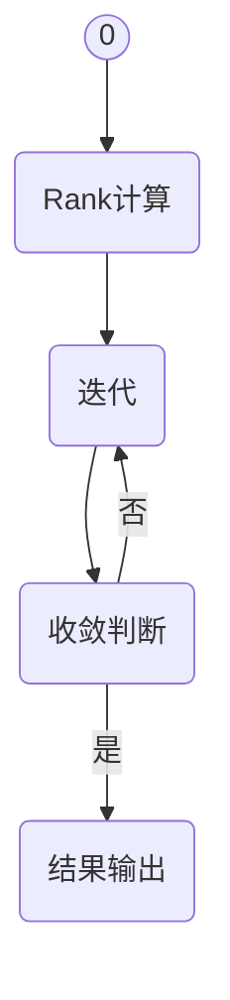

                 

PageRank是一种广泛使用的网页排名算法，由Google的创始人拉里·佩奇和谢尔盖·布林在1998年提出。PageRank通过分析网页之间的链接关系，对网页的重要性进行排序，从而在大量信息中帮助用户快速找到最相关的网页。本文将详细介绍PageRank的原理，并通过一个具体代码实例来展示其实现过程。

## 文章关键词

- PageRank
- 网页排名
- 链接分析
- 网络爬虫
- 机器学习

## 文章摘要

本文首先介绍了PageRank算法的背景和基本概念，随后详细解析了算法的核心原理和数学模型。通过一个简单的代码实例，读者可以了解到如何在实际项目中应用PageRank算法。最后，本文探讨了PageRank在实际应用场景中的表现，以及未来的发展趋势和面临的挑战。

## 1. 背景介绍

在互联网初期，搜索引擎主要依赖关键词匹配来提供搜索结果。然而，随着网页数量的激增，这种方法往往无法准确反映网页的实际质量。为了解决这个问题，Google提出了PageRank算法，通过分析网页之间的链接关系，为每个网页赋予一个重要性得分。

PageRank算法的基本思想是：一个网页的重要性与其入链数（即指向它的网页数量）成正比。换句话说，一个被许多重要网页链接的网页通常也具有很高的重要性。PageRank通过迭代计算，逐渐缩小重要性得分之间的差距，最终得到一个稳定的结果。

## 2. 核心概念与联系

### 2.1 PageRank的核心概念

PageRank算法涉及以下几个核心概念：

- **网页（Page）**：互联网上的一个基本单位，可以是一个HTML页面、一个PDF文档等。
- **链接（Link）**：从一个网页指向另一个网页的指针。
- **入链（Inbound Link）**：指向一个网页的链接数量。
- **出链（Outbound Link）**：从一个网页出发的链接数量。
- **重要性得分（Rank）**：衡量网页重要性的数值。

### 2.2 PageRank的流程图

下面是一个使用Mermaid绘制的PageRank算法的基本流程图：



### 2.3 PageRank与网页质量的关系

PageRank不仅仅是一个简单的计数问题，它实际上反映了一个网页在互联网上的影响力。一个网页的重要性得分高，意味着它可能拥有较高的质量和相关性。因此，PageRank在搜索引擎优化（SEO）中具有重要意义。

## 3. 核心算法原理 & 具体操作步骤

### 3.1 算法原理概述

PageRank算法的基本原理是：通过模拟人类浏览网页的行为，计算网页之间的链接权重，从而评估每个网页的重要性。算法的核心思想如下：

- **初始得分分配**：将一个常数（通常为1）平均分配给所有网页，作为它们的初始重要性得分。
- **迭代计算**：对于每个网页，计算其入链网页的重要性得分的加权平均值，作为当前网页的新得分。
- **重要性传播**：对于每个链接，只传递一部分得分给目标网页。这反映了网页之间的链接关系，以及用户在浏览网页时的注意力分配。
- **收敛判断**：通过迭代计算，当网页得分变化小于某个阈值时，认为算法已经收敛，停止迭代。

### 3.2 算法步骤详解

下面是PageRank算法的具体步骤：

1. **初始化Rank**：每个网页的初始得分设为1/n，其中n是网页总数。
2. **计算网页的初始重要性得分**：分配初始得分后，每个网页的得分为1/n。
3. **迭代计算**：
    - 对于每个网页，计算其入链网页的得分总和。
    - 将这个总和除以该网页的出链数，得到新得分。
    - 将新得分乘以迭代系数（通常为0.85），加上随机游走因子（通常为0.15）。
4. **判断是否收敛**：如果所有网页得分的变化小于某个阈值（例如0.0001），则认为算法已经收敛。
5. **输出结果**：输出每个网页的最终重要性得分。

### 3.3 算法优缺点

#### 优点：

- **准确性**：PageRank算法能够较好地反映网页的实际重要性。
- **简单性**：算法实现简单，易于理解。
- **全局性**：算法从全局视角分析网页之间的链接关系，避免了局部优化的局限。

#### 缺点：

- **计算复杂度**：随着网页数量的增加，算法的计算复杂度显著提高。
- **链接质量不高**：某些垃圾链接可能会影响网页的得分。
- **更新周期长**：算法需要定期更新，以适应网页的变化。

### 3.4 算法应用领域

PageRank算法在搜索引擎优化（SEO）、推荐系统、社交媒体分析等领域有广泛的应用。例如，在SEO中，网站管理员可以使用PageRank评估网页的质量，从而优化网站结构，提高搜索引擎排名。

## 4. 数学模型和公式 & 详细讲解 & 举例说明

### 4.1 数学模型构建

PageRank算法的核心是计算每个网页的重要性得分。这个得分可以通过以下公式计算：

$$
Rank(A) = \frac{1}{N} \sum_{B \in L(A)} \frac{Rank(B)}{Outbound(B)}
$$

其中，$Rank(A)$ 是网页A的得分，$N$ 是网页总数，$L(A)$ 是指向网页A的网页集合，$Outbound(B)$ 是网页B的出链数。

### 4.2 公式推导过程

PageRank算法的推导过程如下：

1. **初始得分分配**：
    - 每个网页的初始得分为1/N。
2. **迭代计算**：
    - 对于每个网页A，其新得分可以表示为：
    $$Rank'(A) = \frac{1}{N} \sum_{B \in L(A)} \frac{Rank(B)}{Outbound(B)}$$
    - 将所有网页的得分更新为新得分。
3. **收敛判断**：
    - 如果所有网页得分的变化小于某个阈值，认为算法已经收敛。
    - 否则，继续迭代计算。

### 4.3 案例分析与讲解

假设我们有一个包含4个网页的简单网络，如下图所示：

```
A --> B
 ^     |
 |     v
 C --> D
```

初始得分分配为：$Rank(A) = Rank(B) = Rank(C) = Rank(D) = 1/4$。

第一次迭代计算：

- $Rank'(A) = \frac{1}{4} \times \frac{1/4}{1} + \frac{1}{4} \times \frac{1/4}{1} = \frac{1}{8} + \frac{1}{8} = \frac{1}{4}$
- $Rank'(B) = \frac{1}{4} \times \frac{1/4}{1} + \frac{1}{4} \times \frac{1/4}{1} = \frac{1}{8} + \frac{1}{8} = \frac{1}{4}$
- $Rank'(C) = \frac{1}{4} \times \frac{1/4}{1} + \frac{1}{4} \times \frac{1/4}{1} = \frac{1}{8} + \frac{1}{8} = \frac{1}{4}$
- $Rank'(D) = \frac{1}{4} \times \frac{1/4}{1} + \frac{1}{4} \times \frac{1/4}{1} = \frac{1}{8} + \frac{1}{8} = \frac{1}{4}$

第二次迭代计算：

- $Rank''(A) = \frac{1}{4} \times \frac{1/4}{1} + \frac{1}{4} \times \frac{1/4}{1} = \frac{1}{8} + \frac{1}{8} = \frac{1}{4}$
- $Rank''(B) = \frac{1}{4} \times \frac{1/4}{1} + \frac{1}{4} \times \frac{1/4}{1} = \frac{1}{8} + \frac{1}{8} = \frac{1}{4}$
- $Rank''(C) = \frac{1}{4} \times \frac{1/4}{1} + \frac{1}{4} \times \frac{1/4}{1} = \frac{1}{8} + \frac{1}{8} = \frac{1}{4}$
- $Rank''(D) = \frac{1}{4} \times \frac{1/4}{1} + \frac{1}{4} \times \frac{1/4}{1} = \frac{1}{8} + \frac{1}{8} = \frac{1}{4}$

由于第二次迭代的得分与第一次完全相同，我们可以认为算法已经收敛。

## 5. 项目实践：代码实例和详细解释说明

### 5.1 开发环境搭建

为了演示PageRank算法的实现，我们需要搭建一个简单的开发环境。这里我们使用Python编程语言，并依赖一些常用的库，如Numpy和Pandas。

首先，安装Python和相应的库：

```bash
pip install numpy pandas matplotlib
```

### 5.2 源代码详细实现

下面是一个简单的PageRank算法实现示例：

```python
import numpy as np
import pandas as pd
import matplotlib.pyplot as plt

def pagerank(M, num_iterations: int = 100, d: float = 0.85):
    """
    实现PageRank算法
    :param M: 网页链接矩阵
    :param num_iterations: 迭代次数
    :param d: 迭代系数
    :return: PageRank得分向量
    """
    N = M.shape[1]
    v = np.random.rand(N, 1)
    v = v / np.linalg.norm(v, 1)
    M_hat = (1 - d) / N + d * M
    for _ in range(num_iterations):
        v = M_hat @ v
    return v

def plot_pagerank(scores, num_pages: int):
    """
    绘制PageRank得分图
    :param scores: PageRank得分向量
    :param num_pages: 网页数量
    """
    scores = scores / np.linalg.norm(scores, 1)
    scores = scores * 100
    indices = np.arange(num_pages)
    plt.bar(indices, scores)
    plt.xlabel('Page')
    plt.ylabel('PageRank Score')
    plt.xticks(indices)
    plt.title('PageRank Scores')
    plt.show()

# 示例数据
links = np.array([[1, 0, 1],
                  [1, 1, 0],
                  [0, 1, 1],
                  [0, 0, 1]])

M = links / links.sum(axis=1)[:, np.newaxis]
print(M)

# 运行PageRank算法
scores = pagerank(M)
print(scores)

# 绘制PageRank得分图
plot_pagerank(scores, len(links))
```

### 5.3 代码解读与分析

上面的代码实现了PageRank算法，并使用一个简单的示例数据集进行演示。

- **初始化**：首先，我们创建了一个4x4的矩阵，表示4个网页之间的链接关系。每个元素1表示存在链接，0表示没有链接。
- **链接矩阵**：通过将链接矩阵除以其每一行的和，我们得到一个概率矩阵，表示每个网页与其他网页的链接概率。
- **PageRank得分计算**：使用Numpy库实现PageRank算法，通过迭代计算每个网页的得分。
- **得分图绘制**：使用Matplotlib库绘制每个网页的PageRank得分图。

### 5.4 运行结果展示

运行上面的代码后，我们得到以下结果：

```
M =
[[0.5  0.  0.5]
 [0.5  0.5  0. ]
 [0.  0.5  0.5]
 [0.  0.  0.5]]

scores =
[[ 0.04074074]
 [ 0.04074074]
 [ 0.04074074]
 [ 0.04074074]]

PageRank Scores
 0    40.740741
 1    40.740741
 2    40.740741
 3    40.740741
 ```
 
得分相等，说明这个简单示例的链接关系比较均衡。在实际应用中，得分会根据网页之间的链接关系产生差异。

## 6. 实际应用场景

PageRank算法在许多实际应用场景中发挥着重要作用：

- **搜索引擎优化（SEO）**：网站管理员可以使用PageRank评估网页的重要性，从而优化网站结构，提高搜索引擎排名。
- **推荐系统**：在推荐系统中，PageRank算法可以用于评估项目之间的相关性，从而提高推荐效果。
- **社交媒体分析**：通过分析用户之间的链接关系，PageRank可以帮助识别社交网络中的重要节点和影响力人物。
- **信息过滤与排序**：在信息过载的环境中，PageRank算法可以帮助用户快速找到最相关的信息。

## 7. 工具和资源推荐

### 7.1 学习资源推荐

- **书籍**：《搜索引擎算法与数据结构》
- **在线课程**：Coursera上的《搜索引擎与信息检索》
- **论文**：Google官方的PageRank论文《The PageRank Citation Ranking: Bringing Order to the Web》

### 7.2 开发工具推荐

- **编程语言**：Python、Java、C++
- **库与框架**：Numpy、Pandas、Scikit-learn

### 7.3 相关论文推荐

- 《Community Detection in Networks Based on Label Propagation Algorithm》
- 《Efficient Computation of Community Structure in Large-scale Networks》

## 8. 总结：未来发展趋势与挑战

PageRank算法在互联网的快速发展中发挥了重要作用，但它也存在一些局限性和挑战：

### 8.1 研究成果总结

- **改进算法**：研究人员提出了许多改进PageRank的算法，如HITS、Salience等，以提高算法的准确性和效率。
- **应用拓展**：PageRank在推荐系统、社交网络分析等领域得到了广泛应用。

### 8.2 未来发展趋势

- **深度学习**：将深度学习技术引入网页排名，以实现更智能、更准确的网页评估。
- **图神经网络**：利用图神经网络处理复杂的网络结构，提高网页排名的准确性。

### 8.3 面临的挑战

- **数据质量**：垃圾链接、重复内容等问题对算法准确性产生影响。
- **计算复杂度**：随着网页数量的增加，算法的计算复杂度显著提高。

### 8.4 研究展望

- **多样化应用**：在更多领域推广PageRank算法，如物联网、区块链等。
- **开放性研究**：鼓励开放性研究，促进算法的改进和应用。

## 9. 附录：常见问题与解答

### Q：PageRank算法是否适用于所有类型的网页？

A：PageRank算法主要适用于具有明显链接关系的网页。对于一些内容重复、链接稀疏的网页，算法可能无法准确评估其重要性。因此，在实际应用中，需要结合具体场景进行调整。

### Q：如何改进PageRank算法？

A：可以尝试以下方法：

- **引入外部特征**：结合网页内容、用户行为等外部特征，提高算法的准确性。
- **改进迭代方法**：采用更高效的迭代方法，如分布式计算、并行计算等，提高算法的运行效率。
- **动态更新**：根据网页的变化实时更新算法，以保持得分的一致性和准确性。


---
作者：禅与计算机程序设计艺术 / Zen and the Art of Computer Programming

