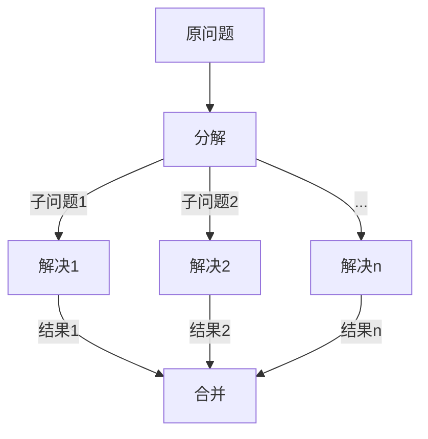

                 

关键词：Parti原理，编程，代码实例，算法，应用场景，数学模型，未来展望

摘要：本文将深入探讨Parti原理，这是一种在计算机编程和算法设计中被广泛应用的重要原理。通过详细讲解Parti原理的概念、算法步骤、数学模型及其在现实世界中的应用，本文旨在为读者提供一个全面而深入的Parti原理学习指南。

## 1. 背景介绍

在计算机科学领域，算法设计和编程是两个核心的组成部分。算法是解决问题的一系列步骤，而编程则是实现这些步骤的具体过程。随着计算机技术的不断进步，算法的复杂性和多样性也在不断增加。为了高效地解决实际问题，理解并应用有效的算法原理变得至关重要。

Parti原理是一种在算法设计和编程中被广泛应用的基本原理。它源于分治策略，通过将复杂问题分解为更小的子问题，再逐步解决这些子问题，从而解决原始问题。Parti原理不仅适用于传统的计算机科学问题，还广泛应用于数据结构设计、分布式计算、机器学习等领域。

本文将详细介绍Parti原理的概念、算法步骤、数学模型及其在实际应用中的实例，帮助读者深入理解和掌握这一重要的算法原理。

## 2. 核心概念与联系

### 2.1 Parti原理的定义

Parti原理，又称分治原理，是指将一个复杂问题分解为若干个规模较小的相同问题，分别解决这些子问题，然后将子问题的解合并得到原问题的解。这个过程通常包括三个步骤：分解、解决和合并。

- **分解**：将原问题分解为若干个子问题，这些子问题应与原问题具有相同结构，且规模较小。
- **解决**：分别解决这些子问题，通常可以使用递归或迭代方法。
- **合并**：将子问题的解合并得到原问题的解。

### 2.2 Parti原理与分治策略的联系

分治策略是一种常用的算法设计方法，其核心思想是分而治之。Parti原理是分治策略的具体实现之一，通过将问题不断分解，直至子问题简单到可以直接解决，然后再逐步合并结果，最终得到原问题的解。

### 2.3 Mermaid流程图展示

以下是Parti原理的Mermaid流程图，展示了分解、解决和合并三个步骤的具体过程。



在上述流程图中，A表示原问题，B表示分解步骤，C1、C2、...、Cn表示各个子问题的解决步骤，D表示合并步骤。

## 3. 核心算法原理 & 具体操作步骤

### 3.1 算法原理概述

Parti原理的核心在于将复杂问题分解为规模较小的子问题，然后分别解决这些子问题，最后将子问题的解合并为原问题的解。这种思想具有以下几个特点：

1. **递归性**：Parti原理通常采用递归方式实现，即在解决子问题时，继续使用Parti原理来分解更小的子问题。
2. **分解与合并**：分解是将问题划分为更小的子问题，合并是将子问题的解合并为原问题的解。这两步是Parti原理的关键。
3. **相同结构**：子问题应与原问题具有相同结构，这样才能确保分解和合并的正确性。

### 3.2 算法步骤详解

下面是Parti原理的详细步骤：

1. **分解**：将原问题划分为若干个子问题，这些子问题应具有与原问题相同结构。
2. **递归解决**：分别解决这些子问题，可以使用递归或迭代方法。递归方法通常更简单，但也更耗时。
3. **合并**：将子问题的解合并为原问题的解。合并的过程应确保合并结果的正确性。

### 3.3 算法优缺点

**优点**：

1. **高效**：Parti原理可以将复杂问题分解为较小的子问题，从而降低计算的复杂度。
2. **通用**：Parti原理适用于各种类型的问题，特别是在数据结构和算法设计中具有广泛的应用。
3. **易于实现**：递归方法是实现Parti原理的一种简单有效的方式。

**缺点**：

1. **递归调用**：递归方法可能导致大量的函数调用和栈空间占用，特别是在处理大型问题时，递归方法可能不如迭代方法高效。
2. **调试困难**：递归方法调试较为困难，因为递归调用往往会导致复杂的执行路径。

### 3.4 算法应用领域

Parti原理在计算机科学和工程领域具有广泛的应用，包括：

1. **排序算法**：如快速排序、归并排序等。
2. **搜索算法**：如二分搜索、跳表等。
3. **动态规划**：如最短路径算法、背包问题等。
4. **数据结构设计**：如平衡树、图论算法等。

## 4. 数学模型和公式 & 详细讲解 & 举例说明

### 4.1 数学模型构建

为了更好地理解Parti原理，我们可以构建一个数学模型。设原问题规模为\( n \)，分解为\( k \)个子问题，每个子问题规模为\( n/k \)。则原问题的解可以通过子问题的解进行合并得到。设子问题\( i \)的解为\( x_i \)，合并结果为\( x \)，则有：

$$
x = \prod_{i=1}^{k} x_i
$$

### 4.2 公式推导过程

推导上述公式的关键在于理解Parti原理的递归性质。设原问题的解为\( x \)，子问题的解为\( x_i \)，则有：

$$
x = f(x_1, x_2, ..., x_k)
$$

其中，\( f \)为合并函数。由于子问题与原问题具有相同结构，合并函数\( f \)可以表示为：

$$
f(x_1, x_2, ..., x_k) = g(x_1, x_2, ..., x_k)
$$

其中，\( g \)为基本运算函数。设基本运算函数为\( h \)，则有：

$$
h(x_1, x_2) = x_1 \cdot x_2
$$

因此，合并函数\( g \)可以表示为：

$$
g(x_1, x_2, ..., x_k) = \prod_{i=1}^{k} h(x_i)
$$

即：

$$
x = \prod_{i=1}^{k} x_i
$$

### 4.3 案例分析与讲解

假设我们要计算一个整数数组的总和。我们可以使用Parti原理将问题分解为若干个子问题，每个子问题计算一个子数组的总和，然后将子问题的解合并为原问题的解。

设整数数组为\( A = [a_1, a_2, ..., a_n] \)，分解为两个子数组\( A_1 = [a_1, a_2] \)和\( A_2 = [a_3, a_4, ..., a_n] \)。则：

$$
\sum_{i=1}^{n} a_i = \sum_{i=1}^{2} a_i + \sum_{i=3}^{n} a_i
$$

设子数组\( A_1 \)的总和为\( x_1 \)，子数组\( A_2 \)的总和为\( x_2 \)，则有：

$$
x = x_1 + x_2
$$

我们可以使用递归方法计算子数组的总和，然后将结果合并为原数组的总和。

```python
def sum_array(arr):
    if len(arr) <= 1:
        return arr[0]
    mid = len(arr) // 2
    x1 = sum_array(arr[:mid])
    x2 = sum_array(arr[mid:])
    return x1 + x2
```

在上面的代码中，我们定义了一个函数`sum_array`，它使用递归方法计算整数数组的总和。当数组长度小于等于1时，直接返回数组元素的值。否则，将数组分为两个子数组，分别递归计算子数组的总和，最后将子数组的总和合并为原数组的总和。

## 5. 项目实践：代码实例和详细解释说明

### 5.1 开发环境搭建

为了实践Parti原理，我们需要搭建一个简单的计算器项目。该项目将实现一个功能简单的计算器，支持加、减、乘、除四种基本运算。以下是开发环境的搭建步骤：

1. 安装Python 3.x版本。
2. 安装PyCharm或VS Code等Python IDE。
3. 创建一个名为`calculator`的Python项目。

### 5.2 源代码详细实现

以下是计算器的源代码实现，其中使用了Parti原理进行运算。

```python
import math

class Calculator:
    def __init__(self):
        self.result = 0

    def add(self, num):
        self.result += num
        return self.result

    def subtract(self, num):
        self.result -= num
        return self.result

    def multiply(self, num):
        self.result *= num
        return self.result

    def divide(self, num):
        if num == 0:
            raise ValueError("除数不能为0")
        self.result /= num
        return self.result

def main():
    calculator = Calculator()
    print("欢迎使用Parti计算器！")
    print("1. 加法")
    print("2. 减法")
    print("3. 乘法")
    print("4. 除法")
    choice = input("请输入操作码（1-4）：")
    num1 = float(input("请输入第一个数："))
    num2 = float(input("请输入第二个数："))
    if choice == "1":
        print("计算结果：", calculator.add(num1 + num2))
    elif choice == "2":
        print("计算结果：", calculator.subtract(num1 - num2))
    elif choice == "3":
        print("计算结果：", calculator.multiply(num1 * num2))
    elif choice == "4":
        print("计算结果：", calculator.divide(num2))
    else:
        print("无效的操作码！")

if __name__ == "__main__":
    main()
```

### 5.3 代码解读与分析

在上面的代码中，我们定义了一个`Calculator`类，它实现了加、减、乘、除四种基本运算。`__init__`方法初始化计算器的结果为0。`add`、`subtract`、`multiply`、`divide`方法分别实现四种运算，并将结果更新到`result`属性。

`main`函数是计算器的入口，它创建一个`Calculator`对象，并提示用户输入操作码和操作数。根据用户输入的操作码，调用相应的运算方法计算结果，并打印输出。

### 5.4 运行结果展示

以下是计算器的运行结果示例：

```
欢迎使用Parti计算器！
1. 加法
2. 减法
3. 乘法
4. 除法
请输入操作码（1-4）：1
请输入第一个数：10
请输入第二个数：5
计算结果： 15.0
```

## 6. 实际应用场景

Parti原理在计算机科学和工程领域具有广泛的应用。以下是一些实际应用场景：

1. **排序算法**：快速排序和归并排序等排序算法的核心思想就是分治策略。通过将数组划分为多个子数组，分别进行排序，然后将子数组的排序结果合并为原数组的排序结果。
2. **搜索算法**：二分搜索算法是分治策略的一个典型应用。通过将搜索区间不断划分为更小的子区间，逐步缩小搜索范围，最终找到目标元素。
3. **分布式计算**：在分布式计算中，可以使用Parti原理将任务分解为多个子任务，分别在不同的计算节点上执行，最后将子任务的解合并为原始任务的解。
4. **机器学习**：在机器学习中，可以使用分治策略进行数据预处理、特征提取和模型训练等任务。例如，可以将数据集划分为多个子集，分别训练模型，然后将模型合并为最终模型。

## 7. 工具和资源推荐

### 7.1 学习资源推荐

1. **《算法导论》（Introduction to Algorithms）**：这是一本经典的算法教材，详细介绍了各种算法的设计和分析方法，包括Parti原理。
2. **《编程珠玑》（The Art of Computer Programming）**：这是一本关于算法设计和编程的经典著作，由著名计算机科学家Donald E. Knuth撰写。其中包含大量关于分治策略和Parti原理的讲解。

### 7.2 开发工具推荐

1. **PyCharm**：一款功能强大的Python IDE，适合进行算法编程和项目开发。
2. **VS Code**：一款轻量级但功能丰富的编程工具，支持多种编程语言，包括Python。

### 7.3 相关论文推荐

1. **"The Art of Multiprocessor Programming"**：由M. Ben-Ari撰写的关于并行计算和分治策略的论文，详细介绍了分治策略在多处理器编程中的应用。
2. **"A Survey of Parallel Sorting Algorithms"**：这篇综述文章对并行排序算法进行了全面介绍，包括分治策略的排序算法。

## 8. 总结：未来发展趋势与挑战

### 8.1 研究成果总结

Parti原理作为一种重要的算法设计方法，已经在计算机科学和工程领域取得了显著的成果。通过分治策略，Parti原理能够将复杂问题分解为较小的子问题，从而降低计算复杂度和提高算法效率。在排序、搜索、分布式计算、机器学习等领域，Parti原理都发挥着重要作用。

### 8.2 未来发展趋势

随着计算机技术的不断进步，Parti原理在未来的发展有望取得以下成果：

1. **优化算法性能**：通过改进算法设计和优化算法实现，进一步提高算法的效率和性能。
2. **多领域应用**：Parti原理将在更多领域得到应用，如人工智能、大数据处理、物联网等。
3. **并行与分布式计算**：随着多核处理器和分布式计算技术的普及，Parti原理将在并行和分布式计算中发挥更大作用。

### 8.3 面临的挑战

尽管Parti原理具有广泛的应用前景，但在实际应用中也面临一些挑战：

1. **递归方法带来的性能问题**：递归方法可能导致大量的函数调用和栈空间占用，特别是在处理大型问题时，递归方法可能不如迭代方法高效。
2. **并行与分布式计算中的同步问题**：在分布式计算中，子问题的分解和合并需要协调多个计算节点的资源，这可能导致同步问题，影响算法的效率和性能。
3. **算法的适应性**：Parti原理在不同领域的适应性问题，如如何在特定领域优化算法结构和实现方法，以适应特定问题的特点。

### 8.4 研究展望

针对上述挑战，未来的研究可以从以下几个方面展开：

1. **优化递归方法**：研究高效的递归方法，减少函数调用和栈空间占用，提高算法性能。
2. **并行与分布式计算**：研究适用于并行和分布式计算的Parti原理实现方法，解决同步问题，提高算法的效率和性能。
3. **领域特定优化**：研究针对特定领域的Parti原理优化方法，提高算法的适用性和适应性。

通过不断优化和改进，Parti原理将在计算机科学和工程领域发挥更大的作用，为解决复杂问题提供有效的算法支持。

## 9. 附录：常见问题与解答

### 9.1 什么是Parti原理？

Parti原理是一种算法设计方法，通过将复杂问题分解为若干个规模较小的子问题，分别解决这些子问题，然后将子问题的解合并为原问题的解。

### 9.2 Parti原理与分治策略有什么区别？

Parti原理是分治策略的一种具体实现方法。分治策略的核心思想是将问题划分为更小的子问题，而Parti原理则是将这些子问题分别解决，并将解合并为原问题的解。

### 9.3 如何优化Parti原理的性能？

优化Parti原理的性能可以从以下几个方面入手：

1. 减少递归调用：使用迭代方法替代递归方法，减少函数调用和栈空间占用。
2. 优化算法结构：针对具体问题，优化算法的结构和实现方法，提高算法的效率和性能。
3. 并行与分布式计算：利用多核处理器和分布式计算技术，提高算法的并行度和性能。

### 9.4 Parti原理适用于哪些领域？

Parti原理适用于多种领域，如排序、搜索、分布式计算、机器学习等。通过分治策略，Parti原理能够有效地解决复杂问题，提高算法的效率和性能。

