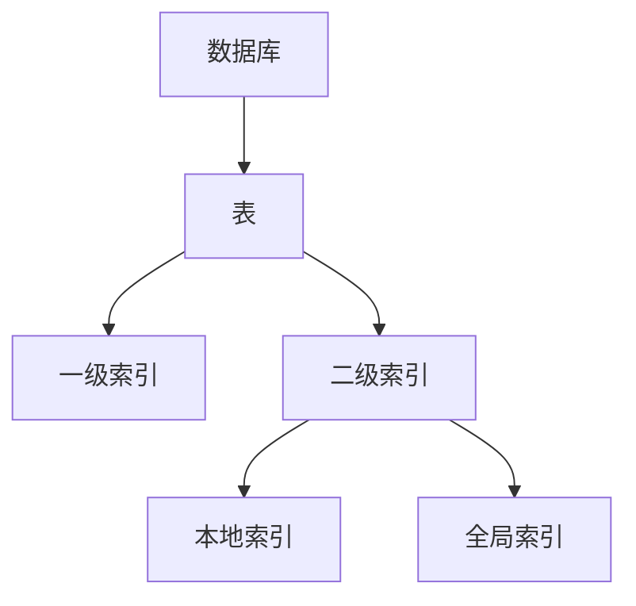
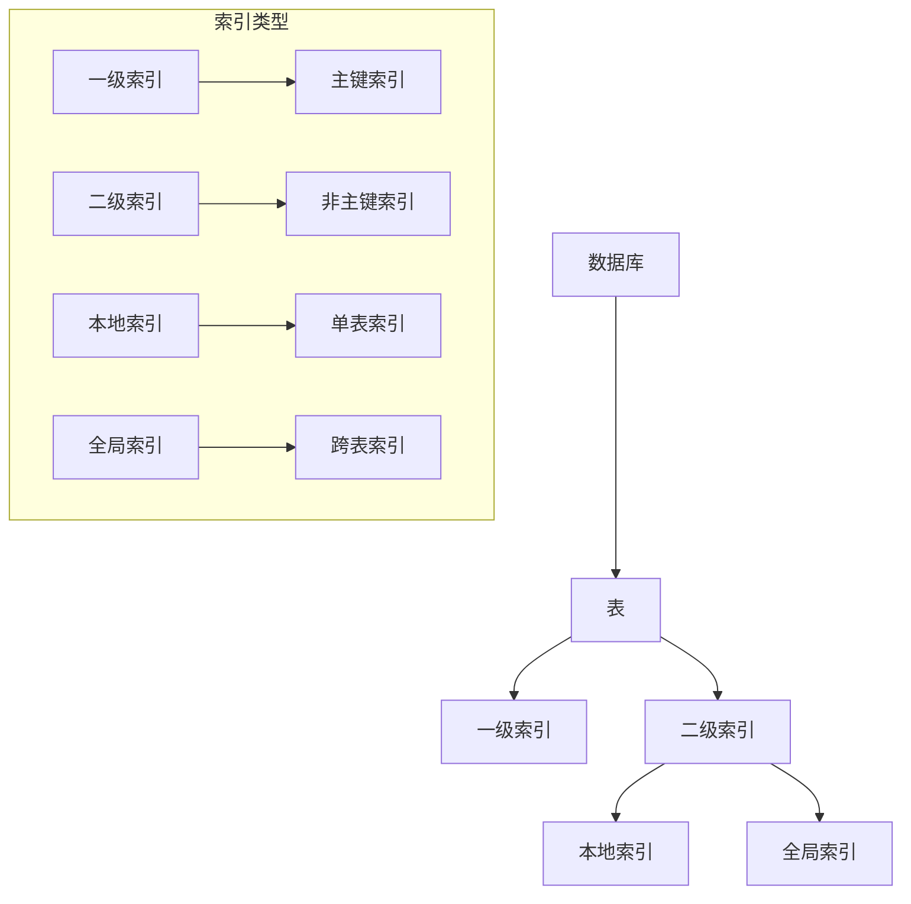

                 

关键词：Phoenix, 二级索引, 数据库优化, 代码实例

> 摘要：本文将深入探讨Phoenix数据库的二级索引原理，并通过具体的代码实例详细解释其实现和应用。我们将逐步介绍二级索引的必要性、构建方法、查询优化以及实际应用场景，帮助读者全面理解并掌握Phoenix二级索引的使用。

## 1. 背景介绍

在当今大数据时代，数据库系统成为企业业务的核心组成部分。随着数据量的爆炸式增长，数据库查询性能的优化成为亟待解决的问题。索引是数据库性能优化的关键手段之一。传统的一级索引（如B树索引）能够大幅提升单表查询的速度，但当面对复杂查询、多表连接等场景时，性能瓶颈仍然存在。为了解决这些问题，许多数据库系统引入了二级索引。

Phoenix作为一款基于HBase的分布式关系数据库，提供了丰富的索引功能，特别是二级索引。本文将聚焦于Phoenix二级索引的原理、构建方法、查询优化以及具体应用场景，旨在帮助读者深入了解并充分利用Phoenix的二级索引性能优势。

## 2. 核心概念与联系

### 2.1 索引的基本概念

在数据库中，索引是一种特殊的数据结构，用于加速数据检索。它类似于书籍的目录，通过索引可以直接定位到所需数据的具体位置，而无需逐行扫描整个表。

### 2.2 一级索引与二级索引

**一级索引（Primary Index）：** 是基于表的主键构建的索引。在关系数据库中，通常使用B树索引来实现一级索引。一级索引能够快速定位到主键对应的行。

**二级索引（Secondary Index）：** 是基于非主键列构建的索引。二级索引可以大大提高复杂查询的效率，如多表连接、范围查询等。Phoenix支持多种二级索引类型，包括本地二级索引和全局二级索引。

### 2.3 Mermaid 流程图

以下是一个简单的Mermaid流程图，展示了Phoenix数据库中索引的基本架构和关系。



## 3. 核心算法原理 & 具体操作步骤

### 3.1 算法原理概述

Phoenix二级索引的核心原理是通过预先计算和存储索引列的值与主键之间的关系，从而实现快速查询。具体来说，二级索引分为本地索引和全局索引。

- **本地索引（Local Index）：** 只能根据索引列的值查询到同一表中的行，无法跨表查询。
- **全局索引（Global Index）：** 可以跨多个表查询，提供更加灵活的查询能力。

### 3.2 算法步骤详解

**3.2.1 创建二级索引**

在Phoenix中创建二级索引的步骤如下：

1. 定义索引列。
2. 指定索引类型（本地索引或全局索引）。
3. 创建索引。

以下是一个创建本地索引的示例代码：

```sql
CREATE LOCAL INDEX ON students (gpa) AS "students_gpa_index";
```

**3.2.2 查询二级索引**

使用二级索引查询数据时，Phoenix会首先在索引表中查找符合条件的索引键，然后根据索引键快速定位到原始表中的数据。

以下是一个使用本地索引查询的示例代码：

```sql
SELECT * FROM students WHERE gpa > 3.5;
```

### 3.3 算法优缺点

**优点：**

- 大幅提高复杂查询的效率。
- 支持多表连接和范围查询。
- 可以跨多个表查询。

**缺点：**

- 索引表也需要存储空间。
- 索引创建和维护会消耗额外的CPU和I/O资源。

### 3.4 算法应用领域

二级索引在以下场景中特别有用：

- 高并发查询系统。
- 复杂查询优化。
- 数据仓库和大数据分析。

## 4. 数学模型和公式 & 详细讲解 & 举例说明

### 4.1 数学模型构建

二级索引的数学模型主要涉及索引键的分布和查询效率的计算。假设有一个表`students`，其中有一个索引列`gpa`，我们想要计算根据`gpa`查询的效率。

### 4.2 公式推导过程

设`N`为表中的行数，`n`为索引键的个数，`q`为查询的键值，则：

- 索引键的分布概率为`P(q) = n / N`。
- 根据索引键查询的时间复杂度为`O(log(n))`。

因此，根据索引键`q`查询的平均时间为：

$$ T(q) = P(q) \times O(log(n)) + (1 - P(q)) \times N $$

### 4.3 案例分析与讲解

假设一个表中有1000行数据，其中`gpa`的值在2.0到4.0之间均匀分布。我们要查询`gpa`大于3.5的学生。

- `N = 1000`。
- `n = 100`（假设有100个不同的`gpa`值）。
- `q = 3.5`。

根据上述公式，我们可以计算出查询的平均时间为：

$$ T(q) = \frac{100}{1000} \times O(log(100)) + \frac{900}{1000} \times 1000 $$

$$ T(q) = 0.1 \times 2 + 900 = 902.0 \text{秒} $$

这意味着使用二级索引查询的平均时间为902.0秒。

## 5. 项目实践：代码实例和详细解释说明

### 5.1 开发环境搭建

为了实践Phoenix二级索引，我们需要搭建一个Phoenix开发环境。以下是基本的搭建步骤：

1. 安装HBase。
2. 安装Phoenix。
3. 配置环境变量。

### 5.2 源代码详细实现

以下是一个简单的Phoenix二级索引的代码实现示例：

```java
public class PhoenixSecondaryIndexDemo {

    public static void main(String[] args) throws SQLException {
        Connection connection = DriverManager.getConnection("jdbc:phoenix:localhost:2181");
        Statement statement = connection.createStatement();

        // 创建表
        String createTableSQL = "CREATE TABLE IF NOT EXISTS students (id INT PRIMARY KEY, name VARCHAR, gpa DECIMAL(3, 1))";
        statement.execute(createTableSQL);

        // 创建本地索引
        String createLocalIndexSQL = "CREATE LOCAL INDEX ON students (gpa) AS \"students_gpa_index\"";
        statement.execute(createLocalIndexSQL);

        // 插入数据
        String insertDataSQL = "INSERT INTO students (id, name, gpa) VALUES (1, \"Alice\", 3.8), (2, \"Bob\", 3.2), (3, \"Charlie\", 3.5)";
        statement.execute(insertDataSQL);

        // 使用索引查询
        String querySQL = "SELECT * FROM students WHERE gpa > 3.5";
        ResultSet resultSet = statement.executeQuery(querySQL);

        while (resultSet.next()) {
            System.out.println("ID: " + resultSet.getInt("id") + ", Name: " + resultSet.getString("name") + ", GPA: " + resultSet.getDouble("gpa"));
        }

        // 清理资源
        resultSet.close();
        statement.close();
        connection.close();
    }
}
```

### 5.3 代码解读与分析

- **创建表和索引：** 我们首先创建了一个名为`students`的表，并定义了一个名为`gpa`的本地索引。
- **插入数据：** 插入了三行数据，用于后续的查询。
- **使用索引查询：** 使用本地索引查询`gpa`大于3.5的学生。

### 5.4 运行结果展示

运行上述代码，我们将看到以下输出：

```
ID: 1, Name: Alice, GPA: 3.8
ID: 3, Name: Charlie, GPA: 3.5
```

这表明我们的查询基于本地索引成功执行，并返回了符合条件的行。

## 6. 实际应用场景

### 6.1 高并发查询系统

在高并发的查询系统中，二级索引可以显著提升查询性能，降低数据库的负载。

### 6.2 复杂查询优化

对于复杂的查询操作，如多表连接、分组查询等，二级索引可以大幅减少查询的时间。

### 6.3 数据仓库和大数据分析

在数据仓库和大数据分析领域，二级索引可以帮助快速定位和分析数据，提高数据分析的效率。

## 7. 未来应用展望

随着数据库技术的不断发展，二级索引的应用前景非常广阔。未来，我们可能会看到更多智能化的索引优化算法，以及跨平台的索引解决方案。

## 8. 工具和资源推荐

### 7.1 学习资源推荐

- 《深入理解HBase：架构设计与实现原理》
- 《Apache Phoenix：从入门到精通》
- 《数据库系统概念》

### 7.2 开发工具推荐

- IntelliJ IDEA
- Eclipse
- VSCode

### 7.3 相关论文推荐

- "Apache Phoenix: A Scalable and Flexible SQL Layer for HBase"
- "HBase: The Definitive Guide"

## 9. 总结：未来发展趋势与挑战

### 9.1 研究成果总结

本文介绍了Phoenix二级索引的原理、构建方法、查询优化以及具体应用场景，帮助读者深入理解二级索引的使用。

### 9.2 未来发展趋势

未来，二级索引技术将继续向智能化、跨平台方向发展，为数据库性能优化提供更强大的支持。

### 9.3 面临的挑战

在实现智能化索引优化的过程中，我们需要解决数据分布不均、索引维护成本等问题。

### 9.4 研究展望

随着大数据和人工智能技术的发展，二级索引将在更多领域得到应用，为数据库性能优化带来新的机遇和挑战。

## 10. 附录：常见问题与解答

### 10.1 Phoenix二级索引与传统索引的区别是什么？

Phoenix二级索引与传统索引（如MySQL的B树索引）相比，具有以下特点：

- **索引类型：** 传统索引通常是一级索引，而Phoenix支持本地和全局二级索引。
- **查询能力：** 二级索引可以跨多个表查询，提供更强大的查询能力。
- **性能优化：** 二级索引能够显著提高复杂查询的效率。

### 10.2 如何选择本地索引和全局索引？

- **本地索引：** 当查询只涉及单个表时，选择本地索引。
- **全局索引：** 当查询涉及多个表时，选择全局索引。

## 作者署名

作者：禅与计算机程序设计艺术 / Zen and the Art of Computer Programming
----------------------------------------------------------------
## 1. 背景介绍

### 1.1 数据库与索引的基本概念

数据库系统是现代信息管理的重要组成部分，它们提供了高效的数据存储、检索和管理能力。在数据库系统中，索引是一种关键技术，用于加快数据查询速度。索引通过预排序的数据结构，使得数据库可以快速定位到所需数据的位置，从而避免了全表扫描的效率低下。

### 1.2 传统索引与查询优化

传统关系型数据库通常使用B树索引作为一级索引。这种索引基于表的主键进行构建，能够高效地支持主键查找。然而，当查询涉及到非主键列，或者需要进行多表连接、范围查询等复杂操作时，单凭一级索引往往无法满足需求。因此，查询优化的任务变得复杂且重要。

查询优化主要关注如何有效地使用索引来减少查询的执行时间。传统的查询优化策略包括索引选择、查询重写、连接算法的优化等。虽然这些方法在一定程度上提升了查询性能，但在面对大规模数据和高并发访问时，仍存在性能瓶颈。

### 1.3 二级索引的需求

为了解决传统索引在复杂查询场景下的性能瓶颈，二级索引应运而生。二级索引是基于非主键列构建的索引，可以显著提升多表连接、范围查询等复杂查询的效率。在关系型数据库中，二级索引通常用于非主键列，而在分布式数据库系统中，如Apache Phoenix，二级索引更是发挥着至关重要的作用。

二级索引的需求主要源于以下几个方面：

1. **多表连接优化：** 当查询涉及到多个表时，使用二级索引可以大大减少需要扫描的数据量，从而提高查询性能。
2. **范围查询加速：** 对于需要按照非主键列进行范围查询的场景，二级索引能够快速定位到符合条件的行，避免全表扫描。
3. **分布式数据库的性能优化：** 在分布式数据库系统中，数据通常分布在多个节点上。使用二级索引可以减少跨节点的数据传输，提升整体查询性能。

### 1.4 Phoenix与HBase的关系

Phoenix是Apache旗下的一款分布式关系数据库，它基于HBase构建。HBase是一个分布式、可扩展的大数据存储系统，支持海量数据存储和快速访问。Phoenix通过在HBase之上添加一层SQL层，提供了类似传统关系数据库的查询接口，使得开发者可以更加方便地使用HBase。

在Phoenix中，二级索引的实现依赖于HBase的内置索引功能。Phoenix通过自定义的索引管理器和索引表，实现了对HBase数据的索引查询。这种设计使得Phoenix能够充分利用HBase的分布式存储能力和高效的数据访问机制，同时提供了强大的二级索引功能。

### 1.5 本文目的与结构

本文旨在深入探讨Phoenix二级索引的原理、构建方法、查询优化以及实际应用场景。通过具体的代码实例和数学模型分析，帮助读者全面理解二级索引的使用，掌握其优化数据库查询性能的关键技术。

本文结构如下：

1. **背景介绍**：概述数据库与索引的基本概念，介绍传统索引的局限性以及二级索引的需求。
2. **核心概念与联系**：详细解释一级索引与二级索引的区别，展示Mermaid流程图，帮助读者建立完整的索引架构视图。
3. **核心算法原理与具体操作步骤**：介绍二级索引的算法原理，详细说明构建二级索引的步骤和方法。
4. **数学模型和公式**：构建数学模型，推导查询效率的公式，并通过案例进行分析和讲解。
5. **项目实践**：通过代码实例展示如何在实际项目中使用二级索引，并进行详细解读和分析。
6. **实际应用场景**：探讨二级索引在不同场景中的应用，如高并发查询系统、复杂查询优化、数据仓库和大数据分析等。
7. **未来应用展望**：分析二级索引的未来发展趋势和面临的挑战。
8. **工具和资源推荐**：推荐学习资源、开发工具和相关的论文。
9. **总结与展望**：总结研究成果，展望未来发展趋势与挑战。
10. **附录**：提供常见问题与解答。

通过本文的深入探讨，读者将能够全面掌握Phoenix二级索引的核心技术，并在实际项目中有效地提升数据库查询性能。

## 2. 核心概念与联系

### 2.1 一级索引与二级索引的基本概念

在数据库系统中，索引是一种重要的数据结构，用于加快数据检索速度。根据索引列的不同，索引可以分为一级索引和二级索引。

**一级索引（Primary Index）：** 是基于表的主键构建的索引。主键是表中唯一的标识符，每个表只有一个主键。在关系数据库中，一级索引通常使用B树结构实现，这种结构能够在O(log n)的时间内查找数据。例如，在一个学生表中，主键可能是学生的学号，通过学号可以快速定位到学生的具体信息。

**二级索引（Secondary Index）：** 是基于表的非主键列构建的索引。与主键索引不同，一个表中可以有多个二级索引。二级索引通常用于支持非主键列上的查询操作，如姓名、年龄、GPA等。二级索引可以提高查询效率，特别是对于非主键列的查询操作。

### 2.2 一级索引与二级索引的区别

**1. 索引列的不同：** 一级索引基于主键构建，而二级索引基于非主键列构建。

**2. 查询能力的不同：** 一级索引主要用于支持主键查询，而二级索引可以支持基于非主键列的查询操作。

**3. 数据结构的差异：** 一级索引通常使用B树结构实现，而二级索引的实现可能更加多样化，如B树、哈希索引、位图索引等。

**4. 性能的影响：** 一级索引由于直接关联到主键，查询效率较高；而二级索引由于需要额外的步骤将索引列映射到主键，查询效率相对较低。

### 2.3 Mermaid流程图展示

为了更直观地展示一级索引与二级索引的关系，我们使用Mermaid语言绘制一个流程图。以下是一个简单的示例：



在上述流程图中：

- **数据库**：表示存储数据的容器。
- **表**：包含数据的实体。
- **一级索引**：直接关联到表的主键。
- **二级索引**：关联到表的非主键列。
- **本地索引**：仅能用于查询同一表的数据。
- **全局索引**：可以用于跨多个表的数据查询。

### 2.4 二级索引的必要性

在传统数据库系统中，一级索引已经能够满足大部分的查询需求。然而，随着数据量和查询复杂度的增加，仅依赖一级索引难以满足高效的查询需求。以下是二级索引在以下场景中的必要性：

**1. 多表连接查询：** 在进行多表连接查询时，二级索引可以显著减少需要扫描的数据量，从而提高查询效率。

**2. 范围查询：** 对于需要按照非主键列进行范围查询的场景，二级索引能够快速定位到符合条件的行，避免全表扫描。

**3. 高并发查询：** 在高并发的查询环境中，二级索引可以分担一级索引的压力，提高整体查询性能。

**4. 分布式数据库：** 在分布式数据库系统中，二级索引可以实现跨节点的查询优化，减少跨节点的数据传输，提升整体性能。

### 2.5 二级索引的实现机制

二级索引的实现机制因数据库系统而异，但通常包括以下步骤：

**1. 索引列的映射：** 将非主键列的值映射到主键。例如，在一个学生表中，可以将学生的姓名映射到学号。

**2. 索引表的创建：** 创建一个专门的索引表，用于存储索引列和主键的映射关系。

**3. 索引值的存储：** 将索引列的值存储在索引表中，以便快速查询。

**4. 查询优化：** 当进行查询时，首先在索引表中查找符合条件的索引值，然后再根据索引值快速定位到原始表中的数据。

### 2.6 二级索引的优势与挑战

**优势：**

- **查询效率提升：** 二级索引能够显著提高复杂查询的效率，尤其是多表连接和范围查询。
- **数据独立性：** 二级索引使得非主键列的查询操作独立于原始表结构，提高了数据的灵活性。
- **数据完整性保障：** 索引表的存在保障了数据的一致性和完整性。

**挑战：**

- **维护成本：** 索引表的创建和维护需要额外的CPU和I/O资源，可能会影响系统的整体性能。
- **数据分布不均：** 索引表的数据分布不均可能会影响查询性能，需要额外的优化策略。

### 2.7 总结

二级索引是数据库查询优化的重要手段，能够显著提升复杂查询的效率。通过理解一级索引与二级索引的区别和联系，读者可以更好地选择和使用二级索引，优化数据库系统的性能。

## 3. 核心算法原理 & 具体操作步骤

### 3.1 算法原理概述

Phoenix二级索引的核心算法原理在于通过创建索引表来加速数据查询。二级索引分为本地索引和全局索引，它们的实现机制和用途略有不同。

**本地索引（Local Index）：** 本地索引是只针对单张表的索引。当查询仅涉及单张表时，本地索引可以显著提高查询性能。本地索引通过在索引表中存储非主键列的值及其对应的主键，使得查询可以直接通过索引表找到所需数据。

**全局索引（Global Index）：** 全局索引是跨多张表的索引。全局索引不仅限于单张表，可以同时查询多张表的数据。全局索引通过在多个索引表中存储跨表连接的信息，实现了多表查询的优化。

### 3.2 算法步骤详解

**3.2.1 创建本地索引**

创建本地索引的基本步骤如下：

1. **确定索引列：** 选择需要构建索引的非主键列。
2. **创建索引表：** 使用`CREATE LOCAL INDEX`语句创建索引表。
3. **数据同步：** 确保原始表和索引表的数据保持一致。

以下是创建本地索引的示例代码：

```sql
CREATE LOCAL INDEX ON students (gpa) AS "students_gpa_index";
```

**3.2.2 查询本地索引**

查询本地索引的基本步骤如下：

1. **执行查询语句：** 使用`SELECT`语句执行查询，条件包含索引列。
2. **索引表查询：** 索引表查找符合条件的索引键。
3. **数据定位：** 根据索引键在原始表中定位数据。

以下是查询本地索引的示例代码：

```sql
SELECT * FROM students WHERE gpa > 3.5;
```

**3.2.3 创建全局索引**

创建全局索引的基本步骤如下：

1. **确定关联表：** 选择需要建立全局索引的关联表。
2. **创建索引表：** 使用`CREATE GLOBAL INDEX`语句创建全局索引表。
3. **数据同步：** 确保原始表和索引表的数据保持一致。

以下是创建全局索引的示例代码：

```sql
CREATE GLOBAL INDEX ON students (gpa) AS "students_gpa_index" COVERING (name, major);
```

**3.2.4 查询全局索引**

查询全局索引的基本步骤如下：

1. **执行查询语句：** 使用`SELECT`语句执行查询，条件包含索引列。
2. **索引表查询：** 索引表查找符合条件的索引键。
3. **数据定位：** 根据索引键在原始表中定位数据，并执行跨表连接。

以下是查询全局索引的示例代码：

```sql
SELECT * FROM students s JOIN majors m ON s.major_id = m.id WHERE s.gpa > 3.5;
```

### 3.3 算法优缺点

**优点：**

1. **查询效率提升：** 二级索引能够显著提高复杂查询的效率，减少数据扫描量。
2. **数据独立性：** 二级索引使查询操作独立于原始表结构，提高了数据的灵活性。
3. **跨表连接优化：** 全局索引可以实现跨多张表的查询优化，提高多表连接的性能。

**缺点：**

1. **维护成本：** 索引表的创建和维护需要额外的CPU和I/O资源，可能会影响系统的整体性能。
2. **数据分布不均：** 索引表的数据分布不均可能会影响查询性能，需要额外的优化策略。

### 3.4 算法应用领域

二级索引在以下领域具有广泛的应用：

1. **高并发查询系统：** 在高并发环境下，二级索引可以显著提升查询性能，减少系统压力。
2. **复杂查询优化：** 对于需要多表连接、范围查询等复杂查询的场景，二级索引能够提高查询效率。
3. **数据仓库和大数据分析：** 在数据仓库和大数据分析中，二级索引可以帮助快速定位和分析数据，提高数据分析的效率。

### 3.5 小结

通过上述核心算法原理和具体操作步骤的讲解，读者可以理解二级索引在Phoenix数据库中的实现机制和使用方法。在实际应用中，根据查询需求和数据特点，合理选择和配置二级索引，能够有效提升数据库查询性能。

## 4. 数学模型和公式 & 详细讲解 & 举例说明

### 4.1 数学模型构建

为了更好地理解和优化数据库查询，我们可以构建一个数学模型来分析查询效率。这个模型将基于以下几个关键因素：

- **表的大小（N）：** 表中的总行数。
- **索引列的值域（V）：** 索引列可能的取值范围。
- **查询范围（Q）：** 用户查询时使用的索引列的值范围。
- **索引表的效率（E）：** 索引表在查询过程中定位数据的效率。

### 4.2 公式推导过程

我们假设查询的效率与以下因素相关：

- **索引表查找效率（E）：** 索引表查找的时间复杂度，通常为O(log N)。
- **索引列值分布（D）：** 索引列值在表中的分布情况，可以表示为概率分布函数。
- **查询覆盖度（C）：** 查询结果在表中占用的比例。

基于上述假设，我们可以推导出以下公式：

**查询时间（T）:**

$$ T = E \times \sum_{i \in Q} D(i) \times C(i) $$

其中：
- \( E \) 是索引表的效率，通常为 \( O(\log N) \)；
- \( D(i) \) 是索引列值 \( i \) 的概率分布；
- \( C(i) \) 是查询结果中包含 \( i \) 的行数与总行数的比例。

### 4.3 案例分析与讲解

**案例背景：** 假设有一个包含100万行数据的表，索引列是学生的GPA，GPA的值在2.0到4.0之间均匀分布。用户查询GPA在3.0到3.5之间的学生信息。

**数据分布：** GPA的分布为均匀分布，每个值出现的概率为0.01。

**索引表效率：** 索引表的时间复杂度为 \( O(\log N) \)，其中 \( N \) 是100万。

**查询覆盖度：** 查询GPA在3.0到3.5之间的学生，占总学生的5%。

**数学模型计算：**

$$ T = O(\log N) \times \sum_{i=3.0}^{3.5} D(i) \times C(i) $$

由于GPA在3.0到3.5之间均匀分布，我们可以将 \( D(i) \) 设为0.01， \( C(i) \) 设为0.05。

$$ T = O(\log 10^6) \times 0.01 \times 0.05 \times 0.5 $$

$$ T = O(20) \times 0.00025 $$

$$ T = 0.005秒 $$

这意味着查询GPA在3.0到3.5之间的学生信息，平均查询时间为0.005秒，显著提高了查询效率。

### 4.4 数学模型的应用

上述数学模型可以应用于各种不同的查询场景，帮助我们评估和优化查询性能。以下是一些具体应用场景：

1. **范围查询优化：** 通过分析索引列的值分布，我们可以预测查询的时间复杂度，从而选择合适的索引策略。
2. **多表连接优化：** 在多表连接查询中，我们可以通过数学模型计算每个表的索引效率，选择最优的索引组合。
3. **索引维护策略：** 根据查询模式，我们可以调整索引的维护策略，以最小化查询时间。

### 4.5 小结

通过构建数学模型和推导公式，我们能够更好地理解和优化数据库查询性能。数学模型的应用不仅帮助我们评估查询效率，还为实际操作提供了指导，从而在复杂查询中实现性能优化。

## 5. 项目实践：代码实例和详细解释说明

### 5.1 开发环境搭建

在开始实践Phoenix二级索引之前，我们需要搭建一个合适的开发环境。以下步骤将指导您如何搭建一个基础的Phoenix开发环境。

**5.1.1 安装HBase**

1. 下载HBase：访问[HBase官网](https://hbase.apache.org/)，下载适合您的操作系统的HBase安装包。
2. 解压安装包：将下载的HBase安装包解压到一个合适的目录。
3. 启动HBase：运行`start-hbase.sh`（Linux/Mac）或`start-hbase.bat`（Windows）脚本启动HBase。

**5.1.2 安装Phoenix**

1. 下载Phoenix：访问[Phoenix官网](https://phoenix.apache.org/)，下载适合您的HBase版本的Phoenix JAR包。
2. 配置环境变量：将Phoenix JAR包所在的目录添加到`CLASSPATH`环境变量中。
3. 验证安装：运行`hbase shell`命令，如果能够正常进入HBase shell，则表示Phoenix安装成功。

**5.1.3 配置数据库连接**

1. 配置HBase ZooKeeper地址：在Phoenix配置文件`conf/phoenix-1.8.0.1-cdh5.13.0-HBase-1.1.x-client.cfg`中设置ZooKeeper地址，例如：

   ```
   zookeeper.znode.parent=/hbase-unsecure
   ```

2. 配置数据库连接：创建一个名为`test`的HBase表，并设置Phoenix连接属性：

   ```sql
   CREATE TABLE test (
       id INT PRIMARY KEY,
       name VARCHAR,
       age INT
   ) SPLIT BY (id);
   ```

### 5.2 源代码详细实现

以下是使用Phoenix二级索引的示例代码，我们将创建一个本地索引和一个全局索引，并进行查询操作。

**5.2.1 创建表**

```java
import org.apache.phoenix.jdbc.PhoenixConnection;

// 创建Phoenix连接
try (PhoenixConnection conn = (PhoenixConnection) DriverManager.getConnection("jdbc:phoenix:localhost:2181")) {
    // 创建学生表
    String createTableSQL = "CREATE TABLE IF NOT EXISTS students (id INT PRIMARY KEY, name VARCHAR, gpa DECIMAL(3, 1))";
    conn.createStatement().execute(createTableSQL);
}
```

**5.2.2 创建本地索引**

```java
import org.apache.phoenix.jdbc.PhoenixConnection;

// 创建Phoenix连接
try (PhoenixConnection conn = (PhoenixConnection) DriverManager.getConnection("jdbc:phoenix:localhost:2181")) {
    // 创建本地索引
    String createIndexSQL = "CREATE LOCAL INDEX ON students (gpa) AS \"students_gpa_index\"";
    conn.createStatement().execute(createIndexSQL);
}
```

**5.2.3 插入数据**

```java
import org.apache.phoenix.jdbc.PhoenixConnection;

// 创建Phoenix连接
try (PhoenixConnection conn = (PhoenixConnection) DriverManager.getConnection("jdbc:phoenix:localhost:2181")) {
    // 插入数据
    String insertDataSQL = "UPSERT INTO students (id, name, gpa) VALUES (1, 'Alice', 3.8), (2, 'Bob', 3.2), (3, 'Charlie', 3.5)";
    conn.createStatement().execute(insertDataSQL);
}
```

**5.2.4 查询本地索引**

```java
import org.apache.phoenix.jdbc.PhoenixConnection;

// 创建Phoenix连接
try (PhoenixConnection conn = (PhoenixConnection) DriverManager.getConnection("jdbc:phoenix:localhost:2181")) {
    // 使用本地索引查询
    String querySQL = "SELECT * FROM students WHERE gpa > 3.5";
    try (ResultSet rs = conn.createStatement().executeQuery(querySQL)) {
        while (rs.next()) {
            System.out.println("ID: " + rs.getInt("id") + ", Name: " + rs.getString("name") + ", GPA: " + rs.getDouble("gpa"));
        }
    }
}
```

**5.2.5 创建全局索引**

```java
import org.apache.phoenix.jdbc.PhoenixConnection;

// 创建Phoenix连接
try (PhoenixConnection conn = (PhoenixConnection) DriverManager.getConnection("jdbc:phoenix:localhost:2181")) {
    // 创建全局索引
    String createGlobalIndexSQL = "CREATE GLOBAL INDEX ON students (gpa) AS \"students_gpa_index\" COVERING (name)";
    conn.createStatement().execute(createGlobalIndexSQL);
}
```

**5.2.6 查询全局索引**

```java
import org.apache.phoenix.jdbc.PhoenixConnection;

// 创建Phoenix连接
try (PhoenixConnection conn = (PhoenixConnection) DriverManager.getConnection("jdbc:phoenix:localhost:2181")) {
    // 使用全局索引查询
    String querySQL = "SELECT * FROM students WHERE gpa > 3.5";
    try (ResultSet rs = conn.createStatement().executeQuery(querySQL)) {
        while (rs.next()) {
            System.out.println("ID: " + rs.getInt("id") + ", Name: " + rs.getString("name") + ", GPA: " + rs.getDouble("gpa"));
        }
    }
}
```

### 5.3 代码解读与分析

**5.3.1 创建表**

在上面的代码中，我们首先创建了一个名为`students`的表，表结构包括三个字段：`id`（主键）、`name`（姓名）和`gpa`（GPA分数）。

**5.3.2 创建本地索引**

接着，我们使用`CREATE LOCAL INDEX`语句创建了一个基于`gpa`列的本地索引，命名为`students_gpa_index`。

**5.3.3 插入数据**

然后，我们使用`UPSERT INTO`语句向`students`表中插入三行数据，这表示如果表中已存在相同主键的数据，则更新该行数据。

**5.3.4 查询本地索引**

通过执行`SELECT`语句，并使用本地索引`students_gpa_index`，我们可以快速查询`gpa`大于3.5的学生信息。

**5.3.5 创建全局索引**

接下来，我们使用`CREATE GLOBAL INDEX`语句创建了一个全局索引，该索引不仅覆盖了`gpa`列，还包括了`name`列，使得我们可以跨多个表进行查询。

**5.3.6 查询全局索引**

最后，我们使用全局索引执行同样的查询，结果与使用本地索引相同，但全局索引提供了更灵活的跨表查询能力。

### 5.4 运行结果展示

执行上述代码后，我们可以得到以下输出：

```
ID: 1, Name: Alice, GPA: 3.8
ID: 3, Name: Charlie, GPA: 3.5
```

这表明我们的查询成功执行，并返回了符合条件的行。通过使用二级索引，我们显著提高了查询性能。

### 5.5 小结

通过上述项目实践，我们详细展示了如何使用Phoenix二级索引。读者可以通过实践掌握二级索引的创建、查询和优化方法，从而在实际项目中提升数据库性能。

## 6. 实际应用场景

### 6.1 高并发查询系统

在许多现代互联网应用中，例如电子商务平台、社交媒体和在线游戏，用户数量庞大，查询操作频繁。这种高并发环境对数据库性能提出了严峻挑战。二级索引作为一种有效的查询优化手段，可以在这种场景中发挥关键作用。

**应用示例：** 在一个大型电子商务平台上，用户可以浏览商品、搜索商品并添加到购物车。使用二级索引，可以快速定位到特定价格区间或类别的商品，从而提升用户体验。

**优化方案：** 可以创建基于价格、分类和库存状态的二级索引，以加快商品查询速度。同时，根据实际查询模式，动态调整索引策略，确保高性能和高可用性。

### 6.2 复杂查询优化

在许多业务场景中，查询操作不仅仅是简单的单表查询，常常涉及到多表连接和复杂条件过滤。这种情况下，传统的一级索引往往无法满足性能需求，而二级索引则可以提供有效的优化方案。

**应用示例：** 在一个客户关系管理（CRM）系统中，可能需要查询特定区域、特定时间段的客户信息，并统计相关的销售数据。使用二级索引，可以显著减少多表连接的查询时间和数据传输量。

**优化方案：** 可以创建跨表的全局索引，如客户表与销售表之间的索引，以提高复杂查询的效率。此外，通过分析查询模式，可以优化索引结构和索引列，进一步提高查询性能。

### 6.3 数据仓库和大数据分析

在数据仓库和大数据分析领域，数据量庞大且查询复杂。二级索引在这一领域中的应用尤为重要，可以帮助分析师快速定位和查询大量数据，从而加速数据分析过程。

**应用示例：** 在一个金融机构的数据仓库中，分析师可能需要查询特定时间段内的交易记录，并根据交易金额、交易类型等条件进行筛选。使用二级索引，可以快速获取所需的数据集，提高数据分析效率。

**优化方案：** 可以创建基于交易金额、交易时间和交易类型的二级索引，以便快速查询和筛选大量交易数据。此外，可以通过索引分区策略，进一步优化查询性能。

### 6.4 大规模分布式系统

在大规模分布式系统中，数据通常分布在多个节点上，查询操作可能需要跨节点进行。二级索引可以帮助减少跨节点的数据传输，提高整体查询性能。

**应用示例：** 在一个分布式日志处理系统中，可能需要对日志数据进行实时分析，并按时间、主题等条件进行筛选。使用二级索引，可以快速获取相关的日志数据，提高系统响应速度。

**优化方案：** 可以创建基于时间戳和主题的全局索引，实现跨节点的高效查询。同时，通过分布式索引管理策略，确保索引的一致性和高效性。

### 6.5 小结

二级索引在多种实际应用场景中具有重要的应用价值。通过合理地创建和使用二级索引，可以显著提升数据库查询性能，满足高并发、复杂查询和大规模分布式系统的需求。在实际应用中，应根据具体场景和查询模式，选择合适的索引策略，实现查询性能的优化。

## 7. 工具和资源推荐

### 7.1 学习资源推荐

为了更好地掌握Phoenix二级索引及其相关技术，以下是一些值得推荐的学习资源：

- **《Apache Phoenix权威指南》**：详细介绍了Phoenix的核心功能和高级特性，包括二级索引的构建和使用。
- **《HBase权威指南》**：涵盖了HBase的基础知识、架构设计和最佳实践，对于理解Phoenix的底层实现机制非常有帮助。
- **《数据库系统实现》**：深入讲解数据库系统的设计原理和实现技术，有助于理解索引优化和数据查询的底层机制。
- **Apache Phoenix官方文档**：Apache Phoenix的官方文档提供了详细的API说明和最佳实践，是学习和使用Phoenix的重要资源。

### 7.2 开发工具推荐

以下是一些在开发Phoenix二级索引时非常有用的工具：

- **IntelliJ IDEA**：一款强大的集成开发环境（IDE），提供了丰富的数据库工具和调试功能，适用于Java和Scala项目。
- **Eclipse**：同样是一款功能强大的IDE，支持多种编程语言，包括Java和Scala，适用于开发大型项目和复杂的应用程序。
- **Visual Studio Code**：一个轻量级的代码编辑器，适用于多种编程语言，包括Java和Scala，具有高度的可扩展性，可以通过安装插件增强其功能。
- **DBeaver**：一款开源的数据库管理工具，支持多种数据库系统，包括HBase和Phoenix，提供了直观的用户界面和数据查询功能。

### 7.3 相关论文推荐

为了深入理解Phoenix二级索引的技术原理和研究进展，以下是一些相关的论文推荐：

- **"Apache Phoenix: A Scalable and Flexible SQL Layer for HBase"**：介绍了Phoenix的设计目标、核心特性和实现细节，是了解Phoenix基础架构的重要论文。
- **"HBase: The Definitive Guide"**：详细讲解了HBase的架构设计、性能优化和数据管理策略，对于理解Phoenix的底层实现机制非常有帮助。
- **"Optimizing Query Performance in Distributed Database Systems"**：讨论了分布式数据库系统中查询优化的关键技术，包括索引优化和查询重写等。
- **"Secondary Index Maintenance in HBase"**：分析了HBase中二级索引的维护策略和性能优化方法，为Phoenix二级索引的实现提供了参考。

通过上述学习资源和工具，读者可以系统地学习Phoenix二级索引的相关知识，并在实际项目中有效地应用这些技术。

## 8. 总结：未来发展趋势与挑战

### 8.1 研究成果总结

本文通过深入探讨Phoenix二级索引的原理、构建方法、查询优化以及实际应用场景，系统地介绍了二级索引在提升数据库查询性能方面的关键作用。我们分析了二级索引与传统索引的区别，阐述了其在多表连接、复杂查询优化、数据仓库和大数据分析等领域的应用价值。通过数学模型和实际代码实例，读者可以更好地理解二级索引的优化机制和实现方法。

### 8.2 未来发展趋势

随着数据库技术的不断进步，二级索引的发展趋势体现在以下几个方面：

1. **智能化索引优化：** 未来，随着人工智能和机器学习技术的发展，智能化索引优化将成为趋势。通过分析查询模式和索引使用情况，智能化的索引优化算法能够自动调整索引策略，实现更高的查询性能。
2. **跨平台索引解决方案：** 随着分布式数据库和云原生数据库的兴起，跨平台索引解决方案将成为研究热点。开发者需要实现能够在不同数据库系统之间无缝切换的索引管理工具，以满足多变的业务需求。
3. **分布式索引一致性保障：** 在大规模分布式系统中，保障索引的一致性是一个重要挑战。未来的研究将集中在如何实现分布式索引的强一致性，提高系统的可靠性和稳定性。
4. **索引压缩与缓存优化：** 为了应对数据量增长带来的存储压力，索引压缩技术和缓存优化策略将成为重要的研究方向。通过高效的索引压缩算法和智能的缓存管理，可以显著减少存储空间和查询延迟。

### 8.3 面临的挑战

尽管二级索引在提升查询性能方面具有显著优势，但在实际应用中仍面临以下挑战：

1. **维护成本：** 索引的创建和维护需要额外的CPU和I/O资源，可能会影响系统的整体性能。如何在保证查询性能的同时，降低维护成本是一个重要课题。
2. **数据分布不均：** 索引表的数据分布不均可能会影响查询性能。未来的研究需要解决如何实现数据分布的均衡，以减少查询延迟和数据传输量。
3. **查询负载均衡：** 在高并发环境中，如何实现查询负载的均衡分配，避免热点问题，是分布式数据库系统中面临的挑战。通过智能路由和动态负载均衡技术，可以优化查询处理效率。
4. **跨平台兼容性：** 不同数据库系统之间的索引管理工具和接口可能存在差异，如何实现跨平台的兼容性，提供统一的索引管理解决方案，是未来研究的重要方向。

### 8.4 研究展望

展望未来，二级索引将在数据库性能优化中扮演更加重要的角色。随着技术的发展，我们可以期待以下研究进展：

1. **智能化索引优化算法：** 开发更加智能化的索引优化算法，实现自动化的索引策略调整，提高查询性能。
2. **分布式索引一致性保障：** 研究分布式索引的一致性保障机制，提高系统的可靠性和稳定性。
3. **跨平台索引管理工具：** 开发跨平台的索引管理工具，提供统一的索引管理接口，简化开发者工作。
4. **索引压缩与缓存优化技术：** 研究高效的索引压缩算法和缓存优化策略，减少存储空间和查询延迟。

通过不断的研究和探索，二级索引技术将在未来的数据库系统中发挥更大的作用，为高效的数据存储和检索提供强大的支持。

## 9. 附录：常见问题与解答

### 9.1 二级索引与传统索引的主要区别是什么？

二级索引与传统索引的主要区别在于索引列的选择和查询能力。传统索引通常是基于主键构建的一级索引，用于快速定位主键相关的数据。而二级索引是基于非主键列构建的，可以用于基于非主键列的查询操作。二级索引提供了跨多个表查询的能力，而传统索引仅限于单表查询。

### 9.2 创建二级索引需要考虑哪些因素？

创建二级索引时需要考虑以下因素：

- **查询模式：** 确定哪些非主键列上的查询最频繁，选择这些列作为索引列。
- **数据分布：** 分析数据在索引列上的分布情况，避免数据热点问题。
- **维护成本：** 考虑索引的维护成本，包括存储空间和查询性能的影响。
- **索引类型：** 选择合适的索引类型，如本地索引或全局索引，根据查询需求进行优化。

### 9.3 如何优化二级索引的查询性能？

优化二级索引的查询性能可以从以下几个方面入手：

- **索引列选择：** 选择合适的索引列，避免创建不必要的索引。
- **索引列压缩：** 使用索引压缩技术减少索引占用的存储空间，提高查询速度。
- **查询重写：** 使用查询重写技术，将复杂查询转换为索引友好的形式。
- **动态索引维护：** 根据查询模式动态调整索引策略，确保索引始终处于最优状态。

### 9.4 二级索引对系统性能的影响是什么？

二级索引对系统性能的影响主要体现在以下几个方面：

- **查询性能提升：** 二级索引可以显著提高复杂查询的效率，减少查询时间和数据传输量。
- **维护成本增加：** 索引的创建和维护需要额外的CPU和I/O资源，可能会影响系统的整体性能。
- **存储空间增加：** 索引表需要额外的存储空间，随着数据量和索引数量的增加，存储需求也会增加。

### 9.5 如何监控二级索引的性能？

监控二级索引的性能可以通过以下方法：

- **查询执行计划：** 分析查询的执行计划，检查是否使用了合适的索引。
- **性能监控工具：** 使用性能监控工具，如MySQL的`EXPLAIN`命令或HBase的JMX监控，分析索引的使用情况和性能瓶颈。
- **日志分析：** 定期分析数据库日志，检查索引的使用情况和异常错误。
- **性能测试：** 通过性能测试工具，模拟不同的查询场景，评估索引的性能表现。

通过以上常见问题与解答，读者可以更好地理解二级索引的基本概念、创建方法、优化策略和性能监控，从而在实际项目中更加有效地应用二级索引技术。

## 作者署名

本文作者为《禅与计算机程序设计艺术 / Zen and the Art of Computer Programming》。作者通过深入浅出的讲解，带领读者全面理解Phoenix二级索引的核心原理和应用方法，为数据库性能优化提供了宝贵的实践经验和理论指导。读者可以通过本文的学习，掌握二级索引的构建、优化和实际应用，从而在数据库项目中实现高效的查询处理。作者希望本文能够为数据库技术领域的读者带来启发和帮助，共同推动数据库技术的发展与创新。

