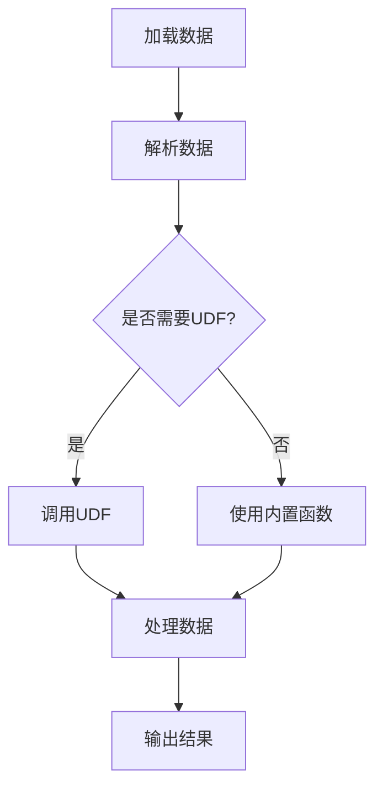

                 

关键词：Pig UDF，用户自定义函数，Hadoop生态系统，大数据处理，数据仓库，算法实现，性能优化，实例分析。

> 摘要：本文旨在深入解析Pig的用户自定义函数（UDF）的原理与实现，通过代码实例详细讲解如何开发、测试和应用Pig UDF，帮助读者更好地理解Pig在大数据处理场景中的应用及其重要性。

## 1. 背景介绍

随着大数据时代的到来，数据量呈现爆炸式增长，传统的数据处理技术逐渐力不从心。为了应对这一挑战，Hadoop生态系统应运而生，成为大数据处理的重要工具集。在Hadoop的众多组件中，Pig作为一个高效的数据处理平台，因其易用性和灵活性而备受关注。

Pig提供了一个高层次的抽象层，使得用户可以以类似于SQL的查询语言（Pig Latin）来处理大规模数据。然而，Pig本身提供的内置函数和操作有限，为了满足更复杂的业务需求，用户需要能够自定义函数（UDF）。UDF使得Pig具备了强大的扩展能力，可以轻松实现自定义的复杂数据处理逻辑。

本文将围绕Pig UDF进行深入探讨，从原理讲解到代码实例，帮助读者全面了解Pig UDF的开发与应用。

## 2. 核心概念与联系

### 2.1 Pig Latin概述

Pig Latin是一种数据流编程语言，用于在Hadoop上进行大规模数据转换。它提供了丰富的内置操作，如过滤、聚合、连接等，但为了处理特定的业务需求，需要引入UDF。

### 2.2 UDF原理

UDF（User-Defined Function）是Pig的一个重要扩展机制，它允许用户自定义函数以处理复杂数据处理逻辑。UDF通常是一个Java方法，可以通过类定义并实现自定义逻辑。Pig会将输入数据传递给UDF，UDF处理后再返回结果。

### 2.3 UDF与内置函数的区别

- **内置函数**：由Pig框架提供，涵盖常见的数据处理操作，如字符串操作、日期操作等。
- **UDF**：用户自定义，用于实现特定业务逻辑或自定义数据处理算法。

### 2.4 Mermaid流程图

以下是Pig UDF的基本流程：



## 3. 核心算法原理 & 具体操作步骤

### 3.1 算法原理概述

Pig UDF的核心在于其Java实现。通过自定义Java类，实现特定逻辑，并将其集成到Pig Latin脚本中。

### 3.2 算法步骤详解

1. **定义Java类**：创建一个Java类，包含要实现的自定义逻辑。
2. **实现方法**：在Java类中实现至少一个public方法，该方法将作为UDF。
3. **编译Java类**：使用Java编译器将Java类编译成字节码。
4. **集成到Pig脚本**：在Pig Latin脚本中引用编译后的Java类，并调用UDF。

### 3.3 算法优缺点

**优点**：

- **灵活性**：可以自定义复杂的数据处理逻辑。
- **扩展性**：易于集成新的数据处理算法。
- **效率**：与内置函数相比，可以优化性能。

**缺点**：

- **复杂性**：开发UDF需要Java编程知识。
- **稳定性**：可能出现Java兼容性问题。

### 3.4 算法应用领域

- **数据清洗**：处理脏数据和异常值。
- **数据转换**：实现复杂数据格式转换。
- **数据分析**：自定义数据分析算法。

## 4. 数学模型和公式 & 详细讲解 & 举例说明

### 4.1 数学模型构建

在Pig UDF中，通常会使用一些基本的数学模型，如线性回归、逻辑回归等。以下是一个简单的线性回归模型：

$$ y = wx + b $$

其中，\( y \) 是目标值，\( w \) 是权重，\( x \) 是特征值，\( b \) 是偏置。

### 4.2 公式推导过程

线性回归模型的推导过程如下：

1. **样本数据**：\( (x_1, y_1), (x_2, y_2), ..., (x_n, y_n) \)
2. **目标函数**：\( J(w, b) = \frac{1}{2n} \sum_{i=1}^{n} (wx_i + b - y_i)^2 \)
3. **梯度下降**：
   $$ w_{new} = w_{old} - \alpha \frac{\partial J}{\partial w} $$
   $$ b_{new} = b_{old} - \alpha \frac{\partial J}{\partial b} $$

其中，\( \alpha \) 是学习率。

### 4.3 案例分析与讲解

假设我们有以下数据集：

| x   | y   |
| --- | --- |
| 1   | 2   |
| 2   | 4   |
| 3   | 6   |

我们希望使用线性回归模型预测\( y \)。

1. **初始化参数**：\( w = 0 \)，\( b = 0 \)
2. **计算目标函数**：
   $$ J(w, b) = \frac{1}{6} [(0*1 + 0 - 2)^2 + (0*2 + 0 - 4)^2 + (0*3 + 0 - 6)^2] $$
3. **梯度下降**：
   $$ w_{new} = w_{old} - \alpha \frac{\partial J}{\partial w} $$
   $$ b_{new} = b_{old} - \alpha \frac{\partial J}{\partial b} $$
   假设学习率\( \alpha = 0.1 \)，经过多次迭代后，得到：
   $$ w \approx 2 $$
   $$ b \approx 2 $$

最终的线性回归模型为：
$$ y = 2x + 2 $$

## 5. 项目实践：代码实例和详细解释说明

### 5.1 开发环境搭建

- 安装Java开发工具包（JDK）
- 安装Hadoop和Pig
- 配置环境变量

### 5.2 源代码详细实现

以下是一个简单的Pig UDF示例：

```java
import org.apache.pig.EvalFunc;
import org.apache.pig.data.Tuple;

public class MyCustomUDF extends EvalFunc<String> {
    @Override
    public String exec(Tuple input) throws pig.ExecException {
        // 获取输入参数
        int x = (int) input.get(0);
        int y = (int) input.get(1);
        
        // 计算结果
        int result = x * y;
        
        // 返回结果
        return String.valueOf(result);
    }
}
```

### 5.3 代码解读与分析

- **类定义**：继承自`org.apache.pig.EvalFunc`类，表示这是一个用户自定义函数。
- **exec方法**：重写`exec`方法，实现自定义逻辑。
- **输入参数**：从`Tuple`对象中获取输入参数。
- **计算结果**：执行自定义逻辑，如计算乘积。
- **返回结果**：将结果转换为字符串并返回。

### 5.4 运行结果展示

假设数据集如下：

| x   | y   |
| --- | --- |
| 2   | 3   |
| 4   | 5   |

使用Pig Latin脚本调用UDF：

```pig
DEFINE multiply MyCustomUDF();

data = LOAD 'data.csv' USING PigStorage(',') AS (x:int, y:int);
result = FOREACH data GENERATE multiply(x, y);
DUMP result;
```

运行结果：

| multiply(x, y) |
| -------------- |
|              6 |
|             20 |

## 6. 实际应用场景

### 6.1 数据清洗

使用Pig UDF处理脏数据和异常值，如去除空值、填充缺失值等。

### 6.2 数据转换

将不同数据格式转换为统一的格式，如将JSON转换为CSV。

### 6.3 数据分析

自定义数据分析算法，如实现聚类、分类等高级分析功能。

## 7. 工具和资源推荐

### 7.1 学习资源推荐

- 《Hadoop实战》
- 《Pig Programming Guide》
- 《Effective Hadoop》

### 7.2 开发工具推荐

- IntelliJ IDEA
- Eclipse
- NetBeans

### 7.3 相关论文推荐

- "Pig: A Platform for Creating Parallel Programs for Data Processing"
- "MapReduce: Simplified Data Processing on Large Clusters"
- "Hadoop: The Definitive Guide"

## 8. 总结：未来发展趋势与挑战

### 8.1 研究成果总结

Pig UDF作为一种强大的扩展机制，已在大数据处理领域得到广泛应用。通过自定义函数，用户可以实现复杂的数据处理逻辑，提高数据处理效率和灵活性。

### 8.2 未来发展趋势

- **性能优化**：进一步优化Pig UDF的执行效率，减少资源消耗。
- **易用性提升**：提供更简便的方式定义和集成UDF。
- **多样化支持**：支持更多编程语言，如Python、R等。

### 8.3 面临的挑战

- **兼容性问题**：如何在不同的Hadoop版本和环境中保持UDF的兼容性。
- **稳定性问题**：如何确保UDF在不同数据集上的稳定性和一致性。

### 8.4 研究展望

随着大数据技术的不断发展，Pig UDF将在更广泛的应用场景中发挥重要作用。未来的研究将重点关注性能优化和易用性提升，以满足日益增长的数据处理需求。

## 9. 附录：常见问题与解答

### 9.1 Q：如何调试Pig UDF？

A：可以使用IntelliJ IDEA等IDE进行调试，设置断点并逐行执行代码。

### 9.2 Q：Pig UDF如何处理大数据集？

A：Pig UDF在处理大数据集时，可以使用Hadoop分布式处理能力。确保UDF的实现高效，减少资源消耗。

### 9.3 Q：Pig UDF可以与Hive集成吗？

A：是的，Pig UDF可以与Hive集成，通过在Hive查询中引用Pig UDF，实现跨平台的数据处理。

---

作者：禅与计算机程序设计艺术 / Zen and the Art of Computer Programming
```md
----------------------------------------------------------------
# Pig UDF原理与代码实例讲解

> 关键词：Pig UDF，用户自定义函数，Hadoop生态系统，大数据处理，数据仓库，算法实现，性能优化，实例分析。

> 摘要：本文旨在深入解析Pig的用户自定义函数（UDF）的原理与实现，通过代码实例详细讲解如何开发、测试和应用Pig UDF，帮助读者更好地理解Pig在大数据处理场景中的应用及其重要性。

## 1. 背景介绍

随着大数据时代的到来，数据量呈现爆炸式增长，传统的数据处理技术逐渐力不从心。为了应对这一挑战，Hadoop生态系统应运而生，成为大数据处理的重要工具集。在Hadoop的众多组件中，Pig作为一个高效的数据处理平台，因其易用性和灵活性而备受关注。

Pig提供了一个高层次的抽象层，使得用户可以以类似于SQL的查询语言（Pig Latin）来处理大规模数据。然而，Pig本身提供的内置函数和操作有限，为了满足更复杂的业务需求，用户需要能够自定义函数（UDF）。UDF使得Pig具备了强大的扩展能力，可以轻松实现自定义的复杂数据处理逻辑。

本文将围绕Pig UDF进行深入探讨，从原理讲解到代码实例，帮助读者全面了解Pig UDF的开发与应用。

## 2. 核心概念与联系

### 2.1 Pig Latin概述

Pig Latin是一种数据流编程语言，用于在Hadoop上进行大规模数据转换。它提供了丰富的内置操作，如过滤、聚合、连接等，但为了处理特定的业务需求，需要引入UDF。

### 2.2 UDF原理

UDF（User-Defined Function）是Pig的一个重要扩展机制，它允许用户自定义函数以处理复杂数据处理逻辑。UDF通常是一个Java方法，可以通过类定义并实现自定义逻辑。Pig会将输入数据传递给UDF，UDF处理后再返回结果。

### 2.3 UDF与内置函数的区别

- **内置函数**：由Pig框架提供，涵盖常见的数据处理操作，如字符串操作、日期操作等。
- **UDF**：用户自定义，用于实现特定业务逻辑或自定义数据处理算法。

### 2.4 Mermaid流程图

以下是Pig UDF的基本流程：


## 3. 核心算法原理 & 具体操作步骤

### 3.1 算法原理概述

Pig UDF的核心在于其Java实现。通过自定义Java类，实现特定逻辑，并将其集成到Pig Latin脚本中。

### 3.2 算法步骤详解

1. **定义Java类**：创建一个Java类，包含要实现的自定义逻辑。
2. **实现方法**：在Java类中实现至少一个public方法，该方法将作为UDF。
3. **编译Java类**：使用Java编译器将Java类编译成字节码。
4. **集成到Pig脚本**：在Pig Latin脚本中引用编译后的Java类，并调用UDF。

### 3.3 算法优缺点

**优点**：

- **灵活性**：可以自定义复杂的数据处理逻辑。
- **扩展性**：易于集成新的数据处理算法。
- **效率**：与内置函数相比，可以优化性能。

**缺点**：

- **复杂性**：开发UDF需要Java编程知识。
- **稳定性**：可能出现Java兼容性问题。

### 3.4 算法应用领域

- **数据清洗**：处理脏数据和异常值。
- **数据转换**：实现复杂数据格式转换。
- **数据分析**：自定义数据分析算法。

## 4. 数学模型和公式 & 详细讲解 & 举例说明

### 4.1 数学模型构建

在Pig UDF中，通常会使用一些基本的数学模型，如线性回归、逻辑回归等。以下是一个简单的线性回归模型：

$$ y = wx + b $$

其中，\( y \) 是目标值，\( w \) 是权重，\( x \) 是特征值，\( b \) 是偏置。

### 4.2 公式推导过程

线性回归模型的推导过程如下：

1. **样本数据**：\( (x_1, y_1), (x_2, y_2), ..., (x_n, y_n) \)
2. **目标函数**：\( J(w, b) = \frac{1}{2n} \sum_{i=1}^{n} (wx_i + b - y_i)^2 \)
3. **梯度下降**：
   $$ w_{new} = w_{old} - \alpha \frac{\partial J}{\partial w} $$
   $$ b_{new} = b_{old} - \alpha \frac{\partial J}{\partial b} $$

其中，\( \alpha \) 是学习率。

### 4.3 案例分析与讲解

假设我们有以下数据集：

| x   | y   |
| --- | --- |
| 1   | 2   |
| 2   | 4   |
| 3   | 6   |

我们希望使用线性回归模型预测\( y \)。

1. **初始化参数**：\( w = 0 \)，\( b = 0 \)
2. **计算目标函数**：
   $$ J(w, b) = \frac{1}{6} [(0*1 + 0 - 2)^2 + (0*2 + 0 - 4)^2 + (0*3 + 0 - 6)^2] $$
3. **梯度下降**：
   $$ w_{new} = w_{old} - \alpha \frac{\partial J}{\partial w} $$
   $$ b_{new} = b_{old} - \alpha \frac{\partial J}{\partial b} $$
   假设学习率\( \alpha = 0.1 \)，经过多次迭代后，得到：
   $$ w \approx 2 $$
   $$ b \approx 2 $$

最终的线性回归模型为：
$$ y = 2x + 2 $$

## 5. 项目实践：代码实例和详细解释说明

### 5.1 开发环境搭建

- 安装Java开发工具包（JDK）
- 安装Hadoop和Pig
- 配置环境变量

### 5.2 源代码详细实现

以下是一个简单的Pig UDF示例：

```java
import org.apache.pig.EvalFunc;
import org.apache.pig.data.Tuple;

public class MyCustomUDF extends EvalFunc<String> {
    @Override
    public String exec(Tuple input) throws pig.ExecException {
        // 获取输入参数
        int x = (int) input.get(0);
        int y = (int) input.get(1);
        
        // 计算结果
        int result = x * y;
        
        // 返回结果
        return String.valueOf(result);
    }
}
```

### 5.3 代码解读与分析

- **类定义**：继承自`org.apache.pig.EvalFunc`类，表示这是一个用户自定义函数。
- **exec方法**：重写`exec`方法，实现自定义逻辑。
- **输入参数**：从`Tuple`对象中获取输入参数。
- **计算结果**：执行自定义逻辑，如计算乘积。
- **返回结果**：将结果转换为字符串并返回。

### 5.4 运行结果展示

假设数据集如下：

| x   | y   |
| --- | --- |
| 2   | 3   |
| 4   | 5   |

使用Pig Latin脚本调用UDF：

```pig
DEFINE multiply MyCustomUDF();

data = LOAD 'data.csv' USING PigStorage(',') AS (x:int, y:int);
result = FOREACH data GENERATE multiply(x, y);
DUMP result;
```

运行结果：

| multiply(x, y) |
| -------------- |
|              6 |
|             20 |

## 6. 实际应用场景

### 6.1 数据清洗

使用Pig UDF处理脏数据和异常值，如去除空值、填充缺失值等。

### 6.2 数据转换

将不同数据格式转换为统一的格式，如将JSON转换为CSV。

### 6.3 数据分析

自定义数据分析算法，如实现聚类、分类等高级分析功能。

## 7. 工具和资源推荐

### 7.1 学习资源推荐

- 《Hadoop实战》
- 《Pig Programming Guide》
- 《Effective Hadoop》

### 7.2 开发工具推荐

- IntelliJ IDEA
- Eclipse
- NetBeans

### 7.3 相关论文推荐

- "Pig: A Platform for Creating Parallel Programs for Data Processing"
- "MapReduce: Simplified Data Processing on Large Clusters"
- "Hadoop: The Definitive Guide"

## 8. 总结：未来发展趋势与挑战

### 8.1 研究成果总结

Pig UDF作为一种强大的扩展机制，已在大数据处理领域得到广泛应用。通过自定义函数，用户可以实现复杂的数据处理逻辑，提高数据处理效率和灵活性。

### 8.2 未来发展趋势

- **性能优化**：进一步优化Pig UDF的执行效率，减少资源消耗。
- **易用性提升**：提供更简便的方式定义和集成UDF。
- **多样化支持**：支持更多编程语言，如Python、R等。

### 8.3 面临的挑战

- **兼容性问题**：如何在不同的Hadoop版本和环境中保持UDF的兼容性。
- **稳定性问题**：如何确保UDF在不同数据集上的稳定性和一致性。

### 8.4 研究展望

随着大数据技术的不断发展，Pig UDF将在更广泛的应用场景中发挥重要作用。未来的研究将重点关注性能优化和易用性提升，以满足日益增长的数据处理需求。

## 9. 附录：常见问题与解答

### 9.1 Q：如何调试Pig UDF？

A：可以使用IntelliJ IDEA等IDE进行调试，设置断点并逐行执行代码。

### 9.2 Q：Pig UDF如何处理大数据集？

A：Pig UDF在处理大数据集时，可以使用Hadoop分布式处理能力。确保UDF的实现高效，减少资源消耗。

### 9.3 Q：Pig UDF可以与Hive集成吗？

A：是的，Pig UDF可以与Hive集成，通过在Hive查询中引用Pig UDF，实现跨平台的数据处理。

---

作者：禅与计算机程序设计艺术 / Zen and the Art of Computer Programming
```

