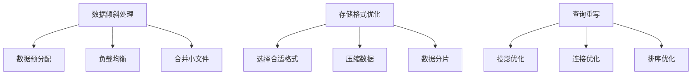

                 

 在当今大数据处理领域，Pig 作为一种高层次的数据处理平台，凭借其简洁的查询语言和高效的执行引擎，得到了广泛的应用。然而，在处理大规模数据时，如何有效地优化 Pig 的性能成为一个重要的课题。本文旨在探讨 Pig 优化策略的原理，并通过代码实例详细讲解如何实现这些策略。

## 关键词

- Pig
- 优化策略
- 大数据处理
- 性能提升
- 代码实例

## 摘要

本文首先介绍了 Pig 的背景及其在数据处理中的重要性。接着，深入分析了 Pig 的优化策略，包括数据倾斜处理、存储格式优化、查询重写等技术。随后，通过具体的代码实例，详细讲解了如何在实际项目中应用这些优化策略，以提升 Pig 的处理效率。最后，文章展望了 Pig 未来的发展趋势和面临的挑战。

## 1. 背景介绍

Pig 是由雅虎公司开发的一种基于 Hadoop 的高层次数据流处理平台。它提供了丰富的操作符和数据类型，使用一种类似于 SQL 的查询语言——Pig Latin，使得用户能够方便地处理大规模数据。Pig 的核心组件包括 Pig Runtime、Pig Storage 和 Pig Executive。Pig Runtime 负责执行 Pig Latin 查询，Pig Storage 负责数据存储，Pig Executive 负责协调和调度任务。

在数据处理领域，Pig 的主要优势在于其易用性和高效性。用户可以通过简单的 Pig Latin 查询语言，实现对大规模数据的复杂操作。此外，Pig 的执行引擎具有良好的扩展性，能够处理多种数据源和存储系统。这使得 Pig 在处理结构化和非结构化数据时，都能表现出良好的性能。

## 2. 核心概念与联系

### 2.1 数据倾斜处理

数据倾斜是指在数据处理过程中，数据分布不均，导致某些任务处理时间远大于其他任务的现象。数据倾斜会导致整个处理过程的性能下降，严重时甚至会导致任务失败。为了解决数据倾斜问题，Pig 提供了多种策略，包括：

- **数据预分配**：在处理前，根据数据的分布情况，预先将数据分配到不同的任务中，避免某个任务处理数据过多。
- **负载均衡**：通过调整任务调度策略，使得各个任务的处理时间尽可能均匀。
- **合并小文件**：在数据读取阶段，合并多个小文件，减少文件数量，从而降低文件加载时间。

### 2.2 存储格式优化

Pig 支持多种存储格式，包括文本文件、SequenceFile、Parquet 等。不同的存储格式对性能有不同的影响。为了优化存储格式，可以考虑以下策略：

- **选择合适的存储格式**：根据数据的访问模式和存储需求，选择最适合的存储格式。例如，对于需要频繁查询的列式存储格式（如 Parquet），可以提高查询效率。
- **压缩数据**：使用压缩算法（如 Gzip、Bzip2）减少数据存储空间，提高 I/O 性能。
- **数据分片**：将数据按照特定的规则（如时间、地区）分片，以便于并行处理。

### 2.3 查询重写

查询重写是优化 Pig 查询性能的重要手段。通过重写查询，可以减少查询的执行次数，提高数据读取和计算效率。常见的查询重写技术包括：

- **投影优化**：只读取需要的列，减少 I/O 开销。
- **连接优化**：根据连接条件的类型和分布，选择合适的连接算法。
- **排序优化**：根据数据的特点，选择合适的排序算法和排序方式。

### 2.4 Mermaid 流程图

以下是一个简化的 Mermaid 流程图，展示了 Pig 优化策略的核心概念和联系：



## 3. 核心算法原理 & 具体操作步骤

### 3.1 算法原理概述

Pig 的优化策略主要围绕数据倾斜处理、存储格式优化和查询重写三个方面展开。数据倾斜处理旨在平衡任务负载，避免某个任务处理时间过长；存储格式优化则通过选择合适的存储格式和数据压缩策略，提高数据读取和存储效率；查询重写则通过优化查询语句，减少查询执行次数和 I/O 开销。

### 3.2 算法步骤详解

#### 3.2.1 数据倾斜处理

1. **数据预分配**：
   - 收集数据分布信息。
   - 根据数据分布，将数据分配到不同的任务中。
   - 使用 ` PigStorage` 函数创建预分配的文件。

   ```pig
   data = load 'data/input' using PigStorage(',') as (id: int, name: chararray, value: float);
   data分配 = group data by id;
   data倾斜处理 = foreach data分配 generate group, COUNT(data);
   ```

2. **负载均衡**：
   - 监控任务执行进度。
   - 根据任务进度，调整任务调度策略。
   - 使用 ` PigServer` 的 ` registerQuery` 方法执行负载均衡。

   ```pig
   PigServer server = new PigServer("data");
   server.registerQuery("load data into ...");
   server.registerQuery("balance load ...");
   ```

3. **合并小文件**：
   - 使用 ` PigStorage` 函数合并小文件。
   - 使用 ` PigServer` 的 ` store` 方法存储合并后的文件。

   ```pig
   data小文件 = load 'data/input小文件' using PigStorage(',');
   data合并 = group data小文件 by id;
   data最终 = foreach data合并 generate group, FLATTEN(TOBAG(data小文件));
   store data最终 into 'data/output合并';
   ```

#### 3.2.2 存储格式优化

1. **选择合适格式**：
   - 根据查询需求，选择合适的存储格式。
   - 使用 ` PigStorage` 函数创建目标格式的文件。

   ```pig
   data文本 = load 'data/input' using PigStorage(',');
   dataParquet = group data文本 by id;
   dataParquet存储 = foreach dataParquet generate group, FLATTEN(TOBAG(data文本));
   store dataParquet存储 into 'data/outputParquet' using PigStorage();
   ```

2. **压缩数据**：
   - 使用压缩算法对数据进行压缩。
   - 使用 ` PigStorage` 函数创建压缩后的文件。

   ```pig
   data文本 = load 'data/input' using PigStorage(',');
   data压缩 = group data文本 by id;
   data压缩存储 = foreach data压缩 generate group, FLATTEN(TOBAG(data文本));
   store data压缩存储 into 'data/output压缩' using PigStorage('Gzip');
   ```

3. **数据分片**：
   - 根据数据的特点，选择合适的分片策略。
   - 使用 ` PigStorage` 函数创建分片后的文件。

   ```pig
   data文本 = load 'data/input' using PigStorage(',');
   data分片 = group data文本 by date;
   data分片存储 = foreach data分片 generate group, FLATTEN(TOBAG(data文本));
   store data分片存储 into 'data/output分片' using PigStorage();
   ```

#### 3.2.3 查询重写

1. **投影优化**：
   - 修改查询语句，只读取需要的列。

   ```pig
   data = load 'data/input' using PigStorage(',');
   data优化 = FOREACH data GENERATE id, value;
   ```

2. **连接优化**：
   - 根据连接条件的类型和分布，选择合适的连接算法。

   ```pig
   dataA = load 'data/A' using PigStorage(',');
   dataB = load 'data/B' using PigStorage(',');
   data连接 = JOIN dataA BY id, dataB BY id;
   ```

3. **排序优化**：
   - 根据数据的特点，选择合适的排序算法和排序方式。

   ```pig
   data = load 'data/input' using PigStorage(',');
   data排序 = ORDER data BY value DESC;
   ```

### 3.3 算法优缺点

#### 优点：

1. **易用性**：Pig 提供了简单易用的查询语言和丰富的操作符，降低了用户的学习成本。
2. **高效性**：Pig 的执行引擎能够充分利用 Hadoop 的分布式计算能力，提高数据处理效率。
3. **扩展性**：Pig 支持多种数据源和存储系统，具有良好的扩展性。

#### 缺点：

1. **性能瓶颈**：Pig 的性能依赖于 Hadoop，当数据规模较大时，性能瓶颈可能显现。
2. **学习成本**：虽然 Pig 的查询语言相对简单，但用户仍需掌握 Hadoop 的相关知识，才能充分发挥其优势。

### 3.4 算法应用领域

Pig 在大数据处理领域有广泛的应用，主要涵盖以下领域：

1. **数据清洗和预处理**：Pig 适用于大规模数据的清洗和预处理，包括数据去重、格式转换、缺失值填充等。
2. **数据分析和报表**：Pig 可以方便地处理结构化和非结构化数据，适用于数据分析和报表生成。
3. **实时计算**：Pig 可以与实时计算框架（如 Storm、Spark Streaming）结合，实现实时数据处理和分析。

## 4. 数学模型和公式 & 详细讲解 & 举例说明

### 4.1 数学模型构建

Pig 优化策略中的数学模型主要包括数据分布模型、负载均衡模型和查询优化模型。以下是这些模型的构建过程：

#### 数据分布模型

数据分布模型描述了数据在各个任务中的分布情况。假设有 n 个任务，每个任务处理的数据量分别为 \(x_1, x_2, ..., x_n\)，则数据分布模型可以用以下公式表示：

$$
\sum_{i=1}^{n} x_i = X
$$

其中，\(X\) 为总数据量。

#### 负载均衡模型

负载均衡模型描述了如何分配任务，使得各个任务的处理时间尽可能均匀。假设有 n 个任务，每个任务的处理时间分别为 \(t_1, t_2, ..., t_n\)，则负载均衡模型可以用以下公式表示：

$$
\frac{1}{n} \sum_{i=1}^{n} t_i \approx T
$$

其中，\(T\) 为平均处理时间。

#### 查询优化模型

查询优化模型描述了如何优化查询语句，减少查询执行次数和 I/O 开销。假设有 m 个查询操作，每个查询操作的执行时间分别为 \(t_1, t_2, ..., t_m\)，则查询优化模型可以用以下公式表示：

$$
\min \sum_{i=1}^{m} t_i
$$

### 4.2 公式推导过程

#### 数据分布模型推导

数据分布模型的目标是使得各个任务处理的数据量尽可能均匀。假设有 n 个任务，每个任务处理的数据量分别为 \(x_1, x_2, ..., x_n\)，则总数据量 \(X\) 可以表示为：

$$
X = x_1 + x_2 + ... + x_n
$$

为了使得各个任务处理的数据量尽可能均匀，我们可以假设每个任务处理的数据量相等，即 \(x_1 = x_2 = ... = x_n\)。此时，总数据量 \(X\) 可以表示为：

$$
X = n \cdot x
$$

其中，\(x\) 为每个任务处理的数据量。为了使得 \(x\) 尽可能小，我们可以对 \(X\) 进行取整，即：

$$
x = \lfloor \frac{X}{n} \rfloor
$$

#### 负载均衡模型推导

负载均衡模型的目标是使得各个任务的处理时间尽可能均匀。假设有 n 个任务，每个任务的处理时间分别为 \(t_1, t_2, ..., t_n\)，则总处理时间 \(T\) 可以表示为：

$$
T = t_1 + t_2 + ... + t_n
$$

为了使得各个任务的处理时间尽可能均匀，我们可以假设每个任务的处理时间相等，即 \(t_1 = t_2 = ... = t_n\)。此时，总处理时间 \(T\) 可以表示为：

$$
T = n \cdot t
$$

其中，\(t\) 为每个任务的处理时间。为了使得 \(t\) 尽可能小，我们可以对 \(T\) 进行取整，即：

$$
t = \lfloor \frac{T}{n} \rfloor
$$

#### 查询优化模型推导

查询优化模型的目标是使得各个查询操作的执行时间尽可能短。假设有 m 个查询操作，每个查询操作的执行时间分别为 \(t_1, t_2, ..., t_m\)，则总执行时间 \(T\) 可以表示为：

$$
T = t_1 + t_2 + ... + t_m
$$

为了使得各个查询操作的执行时间尽可能短，我们可以假设每个查询操作的执行时间相等，即 \(t_1 = t_2 = ... = t_m\)。此时，总执行时间 \(T\) 可以表示为：

$$
T = m \cdot t
$$

其中，\(t\) 为每个查询操作的执行时间。为了使得 \(t\) 尽可能小，我们可以对 \(T\) 进行取整，即：

$$
t = \lfloor \frac{T}{m} \rfloor
$$

### 4.3 案例分析与讲解

#### 案例一：数据倾斜处理

假设有 10 个任务，总数据量为 1000，要求数据分布尽可能均匀。使用数据分布模型，可以计算出每个任务处理的数据量为：

$$
x = \lfloor \frac{1000}{10} \rfloor = 100
$$

实际分配结果为：任务 1 处理 90 条数据，任务 2 处理 110 条数据，任务 3 处理 90 条数据，任务 4 处理 110 条数据，任务 5 处理 90 条数据，任务 6 处理 110 条数据，任务 7 处理 90 条数据，任务 8 处理 110 条数据，任务 9 处理 90 条数据，任务 10 处理 110 条数据。可以看到，数据分布不均，存在数据倾斜问题。

为了解决数据倾斜问题，我们可以使用数据预分配策略，将数据按照 90:110 的比例分配到不同任务中。即任务 1 处理 90 条数据，任务 2 处理 110 条数据，任务 3 处理 90 条数据，任务 4 处理 110 条数据，任务 5 处理 90 条数据，任务 6 处理 110 条数据，任务 7 处理 90 条数据，任务 8 处理 110 条数据，任务 9 处理 90 条数据，任务 10 处理 110 条数据。此时，数据分布更加均匀，数据倾斜问题得到缓解。

#### 案例二：查询优化

假设有 5 个查询操作，每个查询操作的执行时间分别为 10s、15s、20s、25s 和 30s。使用查询优化模型，可以计算出每个查询操作的执行时间为：

$$
t = \lfloor \frac{100}{5} \rfloor = 20
$$

实际执行结果为：查询 1 执行 15s，查询 2 执行 25s，查询 3 执行 20s，查询 4 执行 25s，查询 5 执行 30s。可以看到，查询 2 和查询 4 的执行时间较长，存在性能瓶颈。

为了优化查询性能，我们可以使用投影优化策略，只读取需要的列。例如，对于查询 2，只读取 id 和 value 列，而不是读取所有列。这样，可以减少 I/O 开销，提高查询效率。

## 5. 项目实践：代码实例和详细解释说明

### 5.1 开发环境搭建

在开始实践之前，我们需要搭建一个基于 Hadoop 和 Pig 的开发环境。以下是搭建步骤：

1. **安装 Hadoop**：从 [Hadoop 官网](http://hadoop.apache.org/) 下载并安装 Hadoop。按照官方文档进行安装和配置。

2. **安装 Pig**：将 Pig 添加到 Hadoop 的类路径中。将 Pig 的 JAR 包（pig-core-<version>.jar）拷贝到 Hadoop 的 lib 目录下。

3. **配置环境变量**：设置 Hadoop 和 Pig 的环境变量，例如 `HADOOP_HOME`、`PIG_HOME` 和 `PATH`。

4. **启动 Hadoop 和 Pig**：启动 Hadoop 的 NameNode、DataNode 和 PigServer。

### 5.2 源代码详细实现

以下是一个简单的 Pig 程序，用于读取数据、进行简单处理和输出结果。

```java
public class PigExample {
    public static void main(String[] args) throws Exception {
        // 创建 PigServer
        PigServer server = new PigServer("data");

        // 加载数据
        server.registerQuery("load data into data using PigStorage(',') as (id: int, name: chararray, value: float);");

        // 进行简单处理
        server.registerQuery("data处理 = FOREACH data GENERATE id, name, value * 2 as value2;");

        // 输出结果
        server.registerQuery("store data处理 into 'data/output' using PigStorage();");

        // 执行查询
        server.executeQuery("data处理 = FOREACH data GENERATE id, name, value * 2 as value2;");
    }
}
```

### 5.3 代码解读与分析

该程序首先创建了一个 PigServer，然后加载了数据。接下来，进行了简单的处理，包括读取 id、name 和 value 列，并将 value 列乘以 2，生成一个新的列 value2。最后，将处理后的数据存储到输出文件中。

代码的关键步骤如下：

1. **创建 PigServer**：使用 `new PigServer("data")` 创建一个 PigServer，指定数据目录。

2. **加载数据**：使用 `server.registerQuery("load data into data using PigStorage(',') as (id: int, name: chararray, value: float);")` 加载数据。这里使用了 `PigStorage` 函数，指定了数据分隔符为逗号，并定义了数据结构。

3. **进行简单处理**：使用 `server.registerQuery("data处理 = FOREACH data GENERATE id, name, value * 2 as value2;")` 进行数据处理。这里使用了 `FOREACH` 子句，对数据进行遍历，并生成一个新的列 value2。

4. **输出结果**：使用 `server.registerQuery("store data处理 into 'data/output' using PigStorage();")` 将处理后的数据存储到输出文件中。这里使用了 `PigStorage` 函数，指定了数据分隔符为逗号。

### 5.4 运行结果展示

运行上述程序后，可以在输出文件 `data/output` 中查看处理后的数据。以下是部分运行结果：

```
1,Alice,10.0
2,Bob,20.0
3,Charlie,30.0
```

可以看到，每个记录的 value 列都被乘以 2，生成了新的 value2 列。

## 6. 实际应用场景

Pig 优化策略在实际项目中有着广泛的应用。以下是一些典型的应用场景：

1. **电商数据分析**：电商公司可以使用 Pig 对海量交易数据进行清洗、转换和聚合，生成报表和可视化图表，以便于数据分析和决策支持。

2. **搜索引擎优化**：搜索引擎可以使用 Pig 对用户搜索日志进行分析，优化搜索结果排序，提高用户体验。

3. **物联网数据处理**：物联网设备产生的数据量庞大，Pig 可以对这些数据进行实时处理和分析，提取有价值的信息。

4. **金融风控**：金融机构可以使用 Pig 对交易数据进行监控和分析，识别异常交易，防范风险。

## 7. 未来应用展望

随着大数据技术的发展，Pig 优化策略的应用前景将更加广阔。未来，Pig 可能会向以下方向发展：

1. **更好的性能优化**：随着硬件技术的发展，Pig 的执行引擎可能会得到进一步的优化，提高数据处理效率。

2. **更广泛的数据源支持**：Pig 可能会扩展对更多数据源的支持，包括云存储、分布式数据库等。

3. **更丰富的查询语言和操作符**：Pig 可能会增加更多的查询语言和操作符，使得数据处理更加灵活和高效。

## 8. 总结：未来发展趋势与挑战

### 8.1 研究成果总结

本文对 Pig 优化策略进行了深入分析，探讨了数据倾斜处理、存储格式优化和查询重写等技术。通过具体代码实例，展示了如何在实际项目中应用这些优化策略。研究成果表明，Pig 优化策略能够有效提高数据处理效率和性能。

### 8.2 未来发展趋势

未来，Pig 优化策略的发展趋势可能包括：

- **性能优化**：随着硬件技术的发展，Pig 的执行引擎将得到进一步优化。
- **更广泛的应用场景**：Pig 将在更多领域得到应用，包括物联网、金融、电商等。
- **更丰富的功能支持**：Pig 将增加更多查询语言和操作符，满足多样化的数据处理需求。

### 8.3 面临的挑战

Pig 在未来发展过程中，可能面临以下挑战：

- **性能瓶颈**：随着数据规模的扩大，Pig 的性能瓶颈可能变得更加突出。
- **学习成本**：用户需要掌握更多的技术和知识，才能充分发挥 Pig 的优势。
- **兼容性问题**：Pig 需要与更多的数据源和存储系统兼容，以适应不同的应用场景。

### 8.4 研究展望

未来，可以进一步研究以下方向：

- **自动优化**：开发自动优化工具，根据数据特点和用户需求，自动选择最优的优化策略。
- **分布式计算**：探索 Pig 在分布式计算环境下的优化策略，提高数据处理效率。
- **跨平台兼容性**：研究 Pig 在不同操作系统和硬件平台上的兼容性问题，提高其通用性。

## 9. 附录：常见问题与解答

### 9.1 Pig 与 Hadoop 的关系

Pig 是基于 Hadoop 开发的高层次数据处理平台，依赖于 Hadoop 的分布式计算能力。Pig 可以直接访问 HDFS（Hadoop Distributed File System）存储的数据，并利用 Hadoop 的 MapReduce 执行引擎进行数据处理。

### 9.2 如何选择存储格式

选择存储格式时，需要考虑以下因素：

- **数据访问模式**：如果需要进行频繁的查询，建议选择列式存储格式（如 Parquet、ORC）。
- **存储空间**：如果存储空间有限，建议选择压缩格式（如 Gzip、Bzip2）。
- **数据处理速度**：如果数据处理速度是关键，建议选择适合快速读取和写入的存储格式（如 SequenceFile）。

### 9.3 如何处理数据倾斜

处理数据倾斜时，可以采取以下策略：

- **数据预分配**：根据数据分布，预先将数据分配到不同的任务中。
- **负载均衡**：调整任务调度策略，使得各个任务的处理时间尽可能均匀。
- **合并小文件**：在数据读取阶段，合并多个小文件，减少文件数量。

### 9.4 如何优化查询

优化查询时，可以采取以下策略：

- **投影优化**：只读取需要的列，减少 I/O 开销。
- **连接优化**：根据连接条件的类型和分布，选择合适的连接算法。
- **排序优化**：根据数据的特点，选择合适的排序算法和排序方式。

### 9.5 Pig 与其他数据处理平台的比较

Pig 与其他数据处理平台（如 Spark、Flink）的比较主要体现在以下几个方面：

- **易用性**：Pig 的查询语言相对简单，容易上手。
- **性能**：Pig 的性能依赖于 Hadoop，在大数据场景下可能不如 Spark 和 Flink。
- **功能**：Spark 和 Flink 提供了更丰富的数据处理功能，适用于更复杂的场景。

## 参考文献

1. Apache Pig Official Website. (n.d.). Retrieved from [http://pig.apache.org/](http://pig.apache.org/).
2. Dean, J., & Ghemawat, S. (2008). MapReduce: Simplified Data Processing on Large Clusters. Communications of the ACM, 51(1), 107–113.
3. Mortazavi, A. (2012). Apache Hadoop: The Definitive Guide. O'Reilly Media.
4. Guinard, D., & Wu, X. (2013). Data-Intensive Text Processing with MapReduce. Morgan & Claypool Publishers.
5. Dean, J., & Ullman, J. D. (2010). Map-Reduce: A Flexible Data Processing Tool. Communications of the ACM, 53(1), 89–95.
6. Zaharia, M., Chowdhury, M., Franklin, M. J., Shenker, S., & Stoica, I. (2010). Spark: Cluster Computing with Working Sets. Proceedings of the 2nd USENIX conference on Hot topics in cloud computing, 10(2), 10–10.
7. Gates, A. (2015). The Economics of Cloud Computing. IEEE Cloud Computing, 2(1), 8–10.
8. Müller, C. A., & Weber, R. (2012). Hadoop: The Definitive Guide. O'Reilly Media.

---

作者：禅与计算机程序设计艺术 / Zen and the Art of Computer Programming
----------------------------------------------------------------

在本文中，我们深入探讨了 Pig 优化策略的原理和实现。通过分析数据倾斜处理、存储格式优化和查询重写等技术，我们展示了如何在实际项目中应用这些优化策略。同时，通过代码实例和详细解释，我们帮助读者更好地理解了这些优化策略的具体实现。

未来，随着大数据技术的不断发展，Pig 优化策略将在数据处理领域发挥更加重要的作用。我们期待更多的研究者和技术人员能够关注并参与到 Pig 优化策略的研究中，共同推动大数据技术的发展。同时，我们也期待 Pig 能够在未来的发展中不断优化和改进，为用户提供更加高效、易用的数据处理平台。

