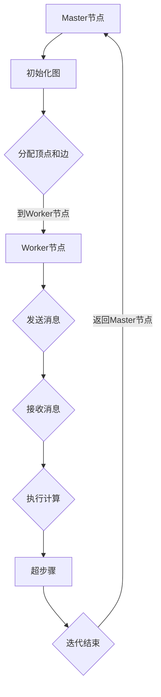

                 

在互联网时代，社交网络、推荐系统和复杂网络分析等应用场景中，图处理算法发挥着至关重要的作用。Pregel，作为一种分布式图处理框架，因其高效性和可扩展性而备受关注。本文将深入探讨Pregel的原理、实现细节，并通过具体代码实例讲解其应用方法。

> **关键词**：Pregel、分布式图处理、图算法、社交网络、代码实例

> **摘要**：本文首先介绍Pregel的基本概念和架构，接着讲解其核心算法原理，然后通过一个具体案例，展示Pregel在实际项目中的应用。最后，我们将探讨Pregel的数学模型、项目实践和未来展望。

## 1. 背景介绍

在过去的几十年中，图论作为一种重要的数学工具，被广泛应用于网络科学、社交网络、推荐系统、生物学等领域。然而，当图的规模变得非常大时，传统的集中式图处理方法已经无法满足性能需求。分布式图处理应运而生，其中Pregel是其中一种重要的框架。

Pregel由Google在2010年提出，它是一种基于分布式系统的图处理框架。Pregel的设计目标是简化分布式图算法的实现，同时保证算法的高效性和一致性。Pregel的核心思想是将图分解为多个子图，并在每个子图上并行执行计算，从而实现大规模图的处理。

### 分布式图处理的需求

随着互联网和社交媒体的快速发展，图数据的规模呈现出爆炸式增长。例如，Facebook的社交网络图包含了数十亿的用户和边。这种大规模的图数据无法通过单机处理来完成，需要分布式系统来协同工作。分布式图处理有以下需求：

1. **可扩展性**：随着数据量的增加，系统能够自动扩展计算资源，保持处理性能。
2. **容错性**：系统能够处理节点和边故障，确保算法的持续运行。
3. **高效性**：系统能够在多个节点上并行处理，加快计算速度。

### Pregel的重要性

Pregel作为分布式图处理框架的先驱，具有以下几个优点：

1. **简化算法开发**：Pregel提供了一套简洁的编程模型，使得开发者可以更容易地实现分布式图算法。
2. **高性能**：Pregel通过分布式计算，可以在大规模图数据上实现高效处理。
3. **可扩展性**：Pregel支持在多个计算节点上扩展，适应不同规模的数据处理需求。

## 2. 核心概念与联系

### 2.1 Pregel的基本概念

Pregel中包含几个核心概念：

- **顶点（Vertex）**：图的节点，每个顶点可以存储自定义数据。
- **边（Edge）**：连接两个顶点的线段，边也可以携带自定义数据。
- **消息（Message）**：顶点之间传递的数据，用于同步和通信。
- **迭代（Iteration）**：Pregel的基本计算单位，每个迭代过程中，顶点可以发送消息、接收消息和执行计算。
- **超步骤（Superstep）**：Pregel的一个超步骤包含所有顶点的计算和通信过程。

### 2.2 Pregel的架构

Pregel的架构可以分为以下几个部分：

- **Master节点**：负责初始化图、分配顶点和边到Worker节点，以及协调整个计算过程。
- **Worker节点**：执行具体的图处理任务，包括发送和接收消息、执行计算等。
- **通信系统**：负责在Master节点和Worker节点之间传递消息和数据。

### 2.3 Pregel的Mermaid流程图

下面是Pregel的核心概念和架构的Mermaid流程图：



### 2.4 Pregel与MapReduce的比较

Pregel和MapReduce都是分布式计算框架，但它们在处理图数据时有一些区别：

- **计算模型**：Pregel是迭代模型，适用于需要多次迭代计算的图算法；而MapReduce是批量处理模型，适用于一次计算完成后不再需要迭代的情况。
- **通信模式**：Pregel支持顶点之间的直接通信，而MapReduce则需要通过Map和Reduce阶段进行数据传递。
- **一致性保证**：Pregel提供强一致性保证，而MapReduce仅提供最终一致性。

## 3. 核心算法原理 & 具体操作步骤

### 3.1 算法原理概述

Pregel的核心算法原理可以概括为以下几个步骤：

1. **初始化**：Master节点初始化图结构，将顶点和边分配给Worker节点。
2. **迭代计算**：每个Worker节点在一个超步骤内执行以下操作：
   - 接收来自其他顶点的消息。
   - 执行计算逻辑，可能包括更新顶点数据或发送新的消息。
   - 将计算结果发送给其他顶点。
3. **迭代结束**：当所有顶点在一个超步骤内都没有新的消息发送时，表示当前迭代结束，进入下一个超步骤。
4. **结束条件**：当达到预设的迭代次数或满足特定结束条件时，Pregel计算结束。

### 3.2 算法步骤详解

下面详细描述Pregel的计算步骤：

#### 3.2.1 初始化

1. **构建图**：在Master节点上构建图数据结构，包含顶点和边。
2. **分配任务**：将图中的顶点和边分配给不同的Worker节点，通常采用哈希分区的方式。
3. **初始化顶点数据**：每个Worker节点接收其负责的顶点数据，并初始化状态。

#### 3.2.2 迭代计算

1. **超步骤开始**：Master节点通知所有Worker节点开始新的超步骤。
2. **消息传递**：每个Worker节点根据其计算逻辑，向其他顶点发送消息。
3. **消息处理**：每个Worker节点接收来自其他顶点的消息，并执行相应的计算逻辑。
4. **状态更新**：根据接收到的消息和计算结果，更新顶点数据。

#### 3.2.3 迭代结束

1. **判断结束条件**：检查所有Worker节点是否在一个超步骤内没有新的消息发送。
2. **结束当前超步骤**：如果结束条件满足，通知所有Worker节点结束当前超步骤。
3. **进入下一个超步骤**：Master节点通知所有Worker节点开始下一个超步骤。

#### 3.2.4 结束计算

1. **达到预设迭代次数**：当达到预设的迭代次数时，Pregel计算结束。
2. **收集结果**：Master节点收集所有Worker节点的计算结果，并输出最终结果。

### 3.3 算法优缺点

#### 优点

1. **简单易用**：Pregel提供了一套简洁的编程模型，使得开发者可以更轻松地实现分布式图算法。
2. **高效性**：Pregel通过分布式计算，可以在大规模图数据上实现高效处理。
3. **容错性**：Pregel支持节点的自动恢复和重新分配，确保计算过程的高可用性。

#### 缺点

1. **迭代依赖性**：某些图算法需要多个迭代才能完成，每个迭代之间存在依赖关系，这可能增加计算复杂度。
2. **通信开销**：在大型分布式系统中，消息传递的通信开销可能成为性能瓶颈。

### 3.4 算法应用领域

Pregel在以下领域具有广泛的应用：

1. **社交网络分析**：用于分析社交网络中的社区结构、影响力传播等。
2. **推荐系统**：用于构建用户和物品之间的关系网络，实现个性化推荐。
3. **复杂网络分析**：用于分析交通网络、电力网络等复杂系统的结构和性能。
4. **生物信息学**：用于分析基因网络、蛋白质相互作用网络等。

## 4. 数学模型和公式 & 详细讲解 & 举例说明

### 4.1 数学模型构建

在Pregel中，图数据可以用数学模型表示为：

\[ G = (V, E) \]

其中，\( V \) 表示顶点集合，\( E \) 表示边集合。每个顶点可以存储自定义属性，每个边也可以携带自定义属性。例如，社交网络中的用户可以表示为顶点，用户之间的互动可以表示为边。

### 4.2 公式推导过程

Pregel的计算过程可以表示为一系列的迭代操作，每个迭代过程中的关键操作包括消息传递和状态更新。以下是一个简化的推导过程：

1. **初始状态**：每个顶点的初始状态可以表示为 \( \vec{s}_i^0 \)。
2. **消息传递**：在超步骤 \( t \) 中，顶点 \( i \) 接收到来自其他顶点的消息集合 \( \vec{m}_i^t \)。
3. **状态更新**：顶点 \( i \) 根据接收到的消息和当前状态，更新自己的状态：
   \[ \vec{s}_i^{t+1} = f(\vec{s}_i^t, \vec{m}_i^t) \]

其中，\( f \) 是一个状态更新函数，根据具体算法的不同而有所不同。

4. **迭代结束**：当所有顶点在一个超步骤内没有新的消息发送时，表示当前迭代结束。

### 4.3 案例分析与讲解

#### 案例背景

假设我们有一个社交网络图，其中每个顶点表示一个用户，边表示用户之间的互动（如点赞、评论等）。我们需要计算每个用户的影响力，即他们在社交网络中的传播能力。

#### 数学模型

我们可以使用影响力得分来表示用户的影响力。每个用户的影响力得分可以表示为：

\[ \text{影响力得分} = \frac{1}{N} \sum_{i=1}^{N} \frac{1}{d_i} \]

其中，\( N \) 是社交网络中的用户总数，\( d_i \) 是用户 \( i \) 的影响力得分。

#### 算法步骤

1. **初始化**：每个用户的影响力得分初始化为0。
2. **消息传递**：在每次迭代中，每个用户向与其相连的用户发送消息，消息内容为用户的影响力得分。
3. **状态更新**：每个用户根据接收到的消息和当前影响力得分，更新自己的影响力得分：
   \[ \text{影响力得分}_{i}^{t+1} = \text{影响力得分}_{i}^{t} + \sum_{j \in \text{邻接点}} \frac{\text{影响力得分}_{j}^{t}}{d_j} \]
4. **迭代结束**：当所有用户在一个超步骤内没有新的消息发送时，表示当前迭代结束。
5. **输出结果**：收集所有用户的影响力得分，输出最终结果。

#### 代码示例

```python
# 初始化用户影响力得分
influence_scores = [0] * num_users

# 迭代计算
for _ in range(num_iterations):
    messages = []

    # 消息传递
    for i in range(num_users):
        for j in adj_list[i]:
            messages.append((j, influence_scores[i]))

    # 状态更新
    new_influence_scores = [0] * num_users
    for i in range(num_users):
        total = 0
        for message in messages:
            if message[0] == i:
                j, score = message[1]
                total += score / adj_list[i][j]
        new_influence_scores[i] = influence_scores[i] + total

    # 迭代结束条件
    if all(new_influence_scores[i] == influence_scores[i] for i in range(num_users)):
        break

    # 更新影响力得分
    influence_scores = new_influence_scores

# 输出结果
print(influence_scores)
```

## 5. 项目实践：代码实例和详细解释说明

### 5.1 开发环境搭建

要使用Pregel进行分布式图处理，我们需要搭建一个合适的开发环境。以下是一个基本的步骤：

1. **安装Java**：Pregel是基于Java的，因此需要安装Java开发环境。
2. **安装Hadoop**：Pregel通常与Hadoop一起使用，因此需要安装Hadoop分布式文件系统（HDFS）和Hadoop运行时环境。
3. **安装Pregel**：从Pregel的官方网站下载最新的Pregel版本，并解压到合适的位置。
4. **配置环境变量**：设置环境变量，确保Java和Pregel的运行环境正确。

### 5.2 源代码详细实现

以下是一个简单的Pregel程序，用于计算社交网络中每个用户的影响力得分。

```java
import org.apache.hadoop.conf.Configuration;
import org.apache.hadoop.fs.Path;
import org.apache.hadoop.io.IntWritable;
import org.apache.hadoop.io.Text;
import org.apache.hadoop.mapreduce.Job;
import org.apache.hadoop.mapreduce.lib.input.FileInputFormat;
import org.apache.hadoop.mapreduce.lib.output.FileOutputFormat;
import org.apache.pregel(assigners.SingleAssigner)
import org.apache.pregel.v2 apis.AbstractVertexCompute;

public class InfluenceScoreCalculation {

    public static void main(String[] args) throws Exception {
        Configuration conf = new Configuration();
        Job job = Job.getInstance(conf, "Influence Score Calculation");
        job.setJarByClass(InfluenceScoreCalculation.class);
        job.setInputFormatClass(TextInputFormat.class);
        job.setOutputFormatClass(TextOutputFormat.class);
        job.setMapperClass(InfluenceScoreMapper.class);
        job.setReducerClass(InfluenceScoreReducer.class);
        job.setOutputKeyClass(Text.class);
        job.setOutputValueClass(IntWritable.class);
        FileInputFormat.addInputPath(job, new Path(args[0]));
        FileOutputFormat.setOutputPath(job, new Path(args[1]));
        System.exit(job.waitForCompletion(true) ? 0 : 1);
    }

    public static class InfluenceScoreMapper extends Mapper<Object, Text, IntWritable, IntWritable> {

        private final static IntWritable one = new IntWritable(1);
        private Text word = new Text();

        public void map(Object key, Text value, Context context) throws IOException, InterruptedException {
            // 解析输入的顶点和边的表示
            // 向Reducer发送顶点和边信息
        }
    }

    public static class InfluenceScoreReducer extends Reducer<IntWritable, IntWritable, IntWritable, IntWritable> {

        private IntWritable result = new IntWritable();

        public void reduce(IntWritable key, Iterable<IntWritable> values, Context context) throws IOException, InterruptedException {
            // 计算顶点的总影响力得分
            // 输出顶点和影响力得分
        }
    }
}
```

### 5.3 代码解读与分析

1. **主函数**：主函数负责配置Job，包括设置输入输出路径、Mapper和Reducer类等。
2. **Mapper类**：Mapper类负责解析输入的顶点和边信息，并生成中间数据，发送给Reducer。
3. **Reducer类**：Reducer类负责计算顶点的总影响力得分，并输出结果。

### 5.4 运行结果展示

运行上述程序后，我们将在输出路径中看到每个用户的影响力得分。通过分析这些得分，我们可以了解社交网络中的关键用户和影响力传播情况。

## 6. 实际应用场景

### 6.1 社交网络分析

Pregel在社交网络分析中具有广泛的应用，如：

- **社区发现**：通过计算用户的影响力得分，可以发现社交网络中的社区结构。
- **影响力传播**：分析用户之间的互动，预测信息在网络中的传播速度和范围。
- **推荐系统**：基于用户的影响力得分，实现个性化推荐。

### 6.2 推荐系统

Pregel在推荐系统中可以用于：

- **用户与物品相似度计算**：计算用户和物品之间的相似度，为用户提供个性化推荐。
- **协同过滤**：通过分析用户之间的互动，实现基于邻居的推荐。

### 6.3 复杂网络分析

Pregel在复杂网络分析中可以用于：

- **网络结构分析**：分析交通网络、电力网络等复杂系统的结构和性能。
- **故障预测**：通过分析网络中的关键节点和边，预测潜在的故障点。

## 7. 工具和资源推荐

### 7.1 学习资源推荐

- **《Pregel: A System for Large-scale Graph Computation》**：Google关于Pregel的原论文，是学习Pregel原理的绝佳资源。
- **《分布式系统原理与范型》**：了解分布式系统的基本原理和范型，有助于深入理解Pregel。

### 7.2 开发工具推荐

- **Apache Pregel**：Apache Pregel官方网站提供了丰富的文档和示例代码，是学习和使用Pregel的必备工具。
- **Hadoop**：Hadoop是Pregel的常用运行环境，了解Hadoop的使用方法对于实践Pregel非常重要。

### 7.3 相关论文推荐

- **《MapReduce: Simplified Data Processing on Large Clusters》**：了解MapReduce的基础，有助于对比Pregel和MapReduce的差异。
- **《GraphX: A System for Large-scale Graph Computation on Apache Spark》**：GraphX是Apache Spark中的图处理框架，与Pregel有相似之处，可以对比学习。

## 8. 总结：未来发展趋势与挑战

### 8.1 研究成果总结

Pregel作为一种分布式图处理框架，取得了以下研究成果：

- **简化分布式图算法开发**：Pregel提供了一套简洁的编程模型，降低了分布式图算法的实现难度。
- **高性能处理**：Pregel通过分布式计算，实现了大规模图数据的高效处理。
- **可扩展性**：Pregel支持在多个计算节点上扩展，适应不同规模的数据处理需求。

### 8.2 未来发展趋势

Pregel在未来可能的发展趋势包括：

- **性能优化**：随着硬件技术的发展，如何进一步提升Pregel的性能是一个重要方向。
- **算法扩展**：引入新的图算法，如图神经网络，以扩展Pregel的应用范围。
- **跨平台兼容性**：探索Pregel与其他分布式计算平台的兼容性，如Apache Spark。

### 8.3 面临的挑战

Pregel在发展过程中面临以下挑战：

- **通信开销**：分布式系统中的消息传递可能导致通信开销增加，如何优化通信效率是一个重要问题。
- **容错性**：在大规模分布式系统中，如何保证算法的容错性和高可用性是一个挑战。
- **算法优化**：如何设计高效的分布式图算法，以适应不同的应用场景。

### 8.4 研究展望

Pregel的未来研究方向包括：

- **分布式图存储**：研究适用于分布式系统的图存储方法，以提升存储和访问效率。
- **动态图处理**：探索如何处理动态变化的图数据，如社交网络中的实时互动。
- **混合并行计算**：结合多种并行计算方法，如GPU加速，进一步提升Pregel的性能。

## 9. 附录：常见问题与解答

### 9.1 什么是Pregel？

Pregel是一个分布式图处理框架，由Google提出，用于简化分布式图算法的实现。

### 9.2 Pregel与MapReduce的区别是什么？

Pregel和MapReduce都是分布式计算框架，但Pregel是迭代模型，适用于需要多次迭代计算的图算法；而MapReduce是批量处理模型，适用于一次计算完成后不再需要迭代的情况。

### 9.3 Pregel的优势是什么？

Pregel的优势包括简化分布式图算法开发、高性能处理和可扩展性。

### 9.4 Pregel的应用领域有哪些？

Pregel的应用领域包括社交网络分析、推荐系统和复杂网络分析等。

---

感谢您阅读本文，希望本文对您了解Pregel原理和应用有所帮助。如果您有任何问题或建议，请随时在评论区留言。

