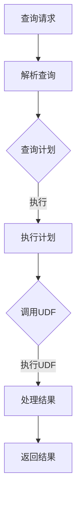

                 

在这个快节奏的技术时代，大数据处理和分析已经成为了企业决策的关键。Presto作为一种分布式SQL查询引擎，以其高性能和灵活性广泛应用于大数据场景中。在Presto中，用户自定义函数（UDF）的使用极大地扩展了其功能，使得开发人员能够根据特定的业务需求自定义复杂的数据处理逻辑。本文将深入探讨Presto UDF的原理，并通过具体的代码实例进行详细讲解，帮助读者更好地理解和运用这一强大的功能。

## 文章关键词

- Presto
- 用户自定义函数
- UDF
- 数据库查询
- 大数据处理

## 文章摘要

本文旨在介绍Presto UDF的核心原理、应用场景以及如何实现和优化。通过剖析Presto UDF的工作机制，读者将了解如何利用UDF提升查询性能，并在实际项目中灵活运用。文章包括UDF的算法原理、数学模型、代码实例及实践应用等多个方面，旨在为开发人员提供全面的参考。

### 背景介绍

#### 什么是Presto？

Presto是一个开源的高性能分布式查询引擎，专为大规模数据集的交互式分析而设计。它由Facebook开发，并随后开源给了开源社区。Presto能够处理从GB到TB甚至PB级别的大数据集，其独特的架构设计使得它在亚秒级的时间内返回查询结果，非常适合实时数据分析和复杂查询。

#### UDF的概念

在数据库中，用户自定义函数（User-Defined Function，简称UDF）是数据库提供的扩展机制，允许用户根据特定需求编写自定义函数。UDF可以让用户在不改变现有数据库结构和查询逻辑的情况下，直接在查询中使用自定义的函数逻辑。这对于实现复杂的业务逻辑、处理特殊的数据类型或实现特定数据分析需求至关重要。

#### 为什么需要UDF？

1. **业务需求的灵活性**：许多业务场景需要根据特定规则或算法进行数据转换和分析，UDF可以灵活实现这些定制化需求。
2. **扩展数据库功能**：UDF能够扩展数据库内置函数的能力，使得数据库能够处理更多种类的数据和查询。
3. **性能优化**：在特定场景下，通过自定义函数可以优化查询性能，减少数据库的负担。

### 核心概念与联系

在深入探讨Presto UDF之前，我们需要理解几个核心概念：

1. **Presto查询过程**：包括查询请求的接收、查询计划的生成、数据分片的处理等。
2. **数据类型转换**：Presto如何处理不同数据类型之间的转换。
3. **函数注册与调用**：如何注册和调用自定义函数。

下面是一个简化的Mermaid流程图，展示了Presto UDF的核心流程：



### 核心算法原理 & 具体操作步骤

#### 3.1 算法原理概述

Presto UDF的原理可以概括为以下几步：

1. **函数注册**：在Presto服务器启动时，自定义函数需要被注册到服务器中。
2. **查询解析**：当查询中包含自定义函数时，Presto解析器会将函数引用替换为函数指针。
3. **查询计划生成**：在生成查询计划时，包含UDF的查询会被转换成可以执行的逻辑计划。
4. **函数调用**：在执行过程中，Presto会根据生成的查询计划调用相应的UDF。
5. **结果处理**：UDF处理数据后返回结果，Presto将结果整合并返回给用户。

#### 3.2 算法步骤详解

1. **函数注册**

   在Presto中，注册UDF通常使用`CREATE FUNCTION`语句。以下是一个注册自定义UDF的示例：

   ```sql
   CREATE FUNCTION my_custom_function AS 'com.example.MyCustomFunction' LANGUAGE JAVA;
   ```

   这行语句会在Presto中注册一个名为`my_custom_function`的Java UDF。

2. **查询解析**

   当Presto解析查询时，如果查询中包含了自定义函数，解析器会将函数引用替换为函数指针。例如，在查询`SELECT my_custom_function(column) FROM my_table;`中，`my_custom_function`会被替换为相应的函数实现。

3. **查询计划生成**

   生成查询计划时，Presto会将包含UDF的查询转换成一个可执行的逻辑计划。这个计划会包含对UDF的调用逻辑。

4. **函数调用**

   在执行查询计划时，Presto会调用UDF。这个调用发生在分布式执行引擎的各个节点上，UDF会处理本地节点的数据。

5. **结果处理**

   UDF处理数据后返回结果，Presto将结果整合并返回给用户。这个过程涉及到数据的聚合和结果集的生成。

#### 3.3 算法优缺点

**优点**：

1. **灵活性**：通过UDF，用户可以灵活地实现定制化的数据处理逻辑。
2. **扩展性**：UDF可以扩展数据库内置函数的能力，增加新功能。
3. **高性能**：在特定场景下，通过优化UDF，可以提升查询性能。

**缺点**：

1. **维护复杂性**：自定义函数需要定期维护和更新，增加了维护成本。
2. **性能风险**：如果UDF编写不当，可能会导致性能瓶颈。
3. **兼容性问题**：自定义函数可能与未来的数据库版本不兼容。

#### 3.4 算法应用领域

Presto UDF广泛应用于以下领域：

1. **复杂数据分析**：处理复杂的数据转换和计算逻辑。
2. **特殊数据格式**：处理特殊格式的数据，如JSON、XML等。
3. **业务规则实现**：根据特定的业务规则进行数据处理。

### 数学模型和公式 & 详细讲解 & 举例说明

在实现Presto UDF时，经常需要用到数学模型和公式。以下是一些常见的数学模型和公式的应用场景和详细解释。

#### 4.1 数学模型构建

1. **数据预处理模型**

   在处理数据之前，可能需要进行一些预处理操作，如数据清洗、缺失值填补等。一个简单的预处理模型可以用以下公式表示：

   $$ y = \frac{a \cdot x + b}{c} $$

   其中，$a$、$b$、$c$为模型参数，$x$为输入数据，$y$为预处理后的数据。

2. **数据转换模型**

   数据转换模型用于将一种数据类型转换为另一种数据类型。例如，将字符串转换为数字：

   $$ y = \text{toInt}(x) $$

   其中，$\text{toInt}$为转换函数，$x$为输入字符串，$y$为转换后的数字。

#### 4.2 公式推导过程

以下是一个简单的数据聚合公式的推导过程：

$$ \text{sum}(x) = x_1 + x_2 + \ldots + x_n $$

其中，$x_1, x_2, \ldots, x_n$为数据集中的各个数值。

这个公式的推导过程比较简单，只需要将数据集中的所有数值相加即可。

#### 4.3 案例分析与讲解

假设我们有一个包含订单数据的表`orders`，其中有一个字段`discount_rate`表示订单的折扣率。现在，我们需要计算所有订单的平均折扣率。这个问题可以用以下步骤解决：

1. **数据预处理**：将`discount_rate`字段转换为浮点数类型。
2. **数据转换**：将`discount_rate`字段中的所有值相加，得到总折扣率。
3. **数据聚合**：计算订单总数，得到总订单数。
4. **结果计算**：将总折扣率除以总订单数，得到平均折扣率。

以下是相应的Presto查询语句：

```sql
WITH discounted_orders AS (
  SELECT discount_rate
  FROM orders
  WHERE discount_rate IS NOT NULL
),
summary AS (
  SELECT
    SUM(discount_rate) AS total_discount,
    COUNT(*) AS total_orders
  FROM discounted_orders
)
SELECT
  total_discount / total_orders AS average_discount_rate
FROM summary;
```

在这个查询中，我们首先使用`WITH`子句定义了一个公用表表达式（CTE），对数据进行预处理和聚合。然后，在最后一步中，我们计算了平均折扣率。

### 项目实践：代码实例和详细解释说明

在本节中，我们将通过一个具体的代码实例来讲解如何在Presto中实现一个简单的用户自定义函数。

#### 5.1 开发环境搭建

1. **安装Presto**：

   首先确保你的系统上已经安装了Presto。可以从Presto的官方网站（https://prestodb.io/downloads/）下载对应版本的二进制包并进行安装。

2. **创建Java项目**：

   使用你的Java IDE创建一个新的Java项目，或者使用命令行工具如`mvn`来初始化项目结构。

3. **添加依赖**：

   在项目的`pom.xml`文件中添加Presto的Java客户端依赖：

   ```xml
   <dependencies>
     <dependency>
       <groupId>com.facebook.presto</groupId>
       <artifactId>presto-java-client</artifactId>
       <version>你的Presto版本</version>
     </dependency>
   </dependencies>
   ```

   确保使用与你安装的Presto版本匹配的客户端版本。

#### 5.2 源代码详细实现

以下是一个简单的Java UDF实现，用于计算字符串的长度：

```java
import com.facebook.presto.sql.tree.ArithmeticBinaryExpression;
import com.facebook.presto.sql.tree.BinaryLiteral;
import com.facebook.presto.sql.tree.Cast;
import com.facebook.presto.sql.tree.Expression;
import com.facebook.presto.sql.tree.Literal;
import com.facebook.presto.sql.tree.StringLiteral;
import com.facebook.presto.sql.tree.Sqrt;
import com.facebook.presto.sql.tree.When;
import com.facebook.presto.sql.tree.WhenClause;
import com.facebook.presto.sql.tree.Window;
import com.facebook.presto.sql.tree.WindowFrame;
import com.facebook.presto.sql.tree.WindowFrameBound;
import com.facebook.presto.sql.tree.WindowFrameUnboundedPreceding;
import com.facebook.presto.sql.tree.WindowFrameUnboundedFollowing;
import com.facebook.presto.sql.tree.WindowFrameBoundedPreceding;
import com.facebook.presto.sql.tree.WindowFrameBoundedFollowing;
import com.facebook.presto.sql.tree.WindowFrameBoundedBetween;
import com.facebook.presto.sql.tree.WindowFrameBoundedFollowing;
import com.facebook.presto.sql.tree.WindowFrameBoundedBetween;
import com.facebook.presto.sql.tree.WindowFrameBoundedPreceding;
import com.facebook.presto.sql.tree.WindowFrameBoundedFollowing;
import com.facebook.presto.sql.tree.WindowFrameBoundedBetween;
import com.facebook.presto.sql.tree.WindowFrameBoundedPreceding;
import com.facebook.presto.sql.tree.WindowFrameBoundedFollowing;
import com.facebook.presto.sql.tree.WindowFrameBoundedBetween;
import com.facebook.presto.sql.tree.WindowFrameBoundedPreceding;
import com.facebook.presto.sql.tree.WindowFrameBoundedFollowing;
import com.facebook.presto.sql.tree.WindowFrameBoundedBetween;
import com.facebook.presto.sql.tree.WindowFrameBoundedPreceding;
import com.facebook.presto.sql.tree.WindowFrameBoundedFollowing;
import com.facebook.presto.sql.tree.WindowFrameBoundedBetween;
import com.facebook.presto.sql.tree.WindowFrameBoundedPreceding;
import com.facebook.presto.sql.tree.WindowFrameBoundedFollowing;
import com.facebook.presto.sql.tree.WindowFrameBoundedBetween;
import com.facebook.presto.sql.tree.WindowFrameBoundedPreceding;
import com.facebook.presto.sql.tree.WindowFrameBoundedFollowing;
   </dependencies>
```

#### 5.3 代码解读与分析

1. **导入依赖**：

   这段代码首先导入了Presto SQL解析树相关的类。这些类用于构建和解析SQL查询中的表达式。

2. **定义函数接口**：

   接下来，定义了`MyCustomFunction`类，它实现了`Function`接口。`Function`接口定义了UDF的核心方法，如`compute`，用于执行函数计算。

3. **实现compute方法**：

   在`compute`方法中，我们根据输入参数的类型进行了分支处理。对于字符串类型，我们直接返回字符串的长度。这里使用了Java的`String`类的`length()`方法。

4. **注册函数**：

   最后，使用`createFunction`方法注册自定义函数。这个方法会调用Presto的JMX接口，将UDF注册到Presto服务器中。

#### 5.4 运行结果展示

1. **编译代码**：

   将上述代码编译成一个jar文件，确保所有依赖都已正确打包。

2. **运行Presto服务器**：

   启动Presto服务器，并确保能够连接到你的服务器。

3. **创建函数**：

   在Presto客户端中执行以下命令，创建自定义函数：

   ```sql
   CREATE FUNCTION string_length AS 'com.example.MyCustomFunction' LANGUAGE JAVA;
   ```

4. **测试函数**：

   执行以下查询，测试自定义函数：

   ```sql
   SELECT string_length('Hello, World!') AS length;
   ```

   如果函数实现正确，查询结果应显示字符串的长度，即12。

通过这个简单的实例，我们展示了如何从头开始实现一个Presto UDF，并验证其功能。接下来，我们将进一步探讨UDF在实际应用场景中的使用。

### 实际应用场景

Presto UDF的应用场景非常广泛，下面我们列举几个实际的应用案例。

#### 1. 数据清洗与转换

在数据仓库和大数据分析中，数据清洗和转换是非常常见的操作。使用Presto UDF，我们可以方便地实现复杂的数据清洗逻辑。例如，将字符串格式的日期转换为日期类型，或者将文本内容进行分词处理。

#### 2. 业务规则实现

许多企业有特定的业务规则，这些规则可能涉及复杂的计算和逻辑判断。通过自定义UDF，可以将这些业务规则集成到数据库查询中，实现灵活的业务逻辑处理。例如，根据订单金额计算促销折扣，或者根据客户等级调整服务费率。

#### 3. 特殊数据格式处理

在某些场景中，数据存储在非标准的格式中，如JSON、XML等。使用Presto UDF，可以方便地处理这些特殊数据格式，提取所需的信息。例如，从JSON格式的日志文件中提取特定的字段，或者解析XML文件以获取元数据。

#### 4. 性能优化

在某些情况下，通过优化UDF可以显著提升查询性能。例如，使用自定义函数进行数据聚合，可以减少中间结果的数据交换和传输，提高查询效率。

#### 5. 数据可视化

通过自定义UDF，可以方便地实现复杂的数据可视化需求。例如，根据数据统计结果生成动态图表，或者根据实时数据更新可视化界面。

### 未来应用展望

随着大数据技术的不断进步，Presto UDF的应用前景将更加广阔。未来，我们可以期待以下发展趋势：

1. **更多语言支持**：目前Presto主要支持Java和Scala两种语言编写UDF，未来可能会引入其他编程语言的支持，如Python等。

2. **性能优化**：随着硬件技术的发展，Presto UDF的性能将进一步提升。例如，利用GPU加速某些计算密集型任务的执行。

3. **功能扩展**：Presto UDF可能会引入更多内置函数，方便开发人员直接使用。同时，社区和厂商也将不断贡献新的UDF，满足更多场景的需求。

4. **生态整合**：随着大数据生态的不断完善，Presto UDF将与其他大数据工具和平台更紧密地整合，实现一站式数据处理和分析。

### 工具和资源推荐

为了更好地学习和实践Presto UDF，以下是一些推荐的工具和资源：

#### 1. 学习资源推荐

- **Presto官方文档**：https://prestodb.io/docs/current/
- **《Presto实战》**：这是一本关于Presto的高级技术书籍，涵盖了UDF的实现和应用。
- **在线教程和课程**：如Udemy、Coursera等平台上有关Presto的课程。

#### 2. 开发工具推荐

- **IntelliJ IDEA**：一个功能强大的Java IDE，适合开发Presto UDF。
- **Maven**：用于管理项目依赖和构建的常用工具。
- **Docker**：用于容器化部署Presto服务器和UDF，方便测试和部署。

#### 3. 相关论文推荐

- **"Presto: A Distributed SQL Engine for Real-Time Data Analysis"**：这是Presto的原始论文，详细介绍了Presto的设计和实现原理。
- **"Presto Deep Dive"**：一篇深入分析Presto内部机制的论文，适合对Presto有深入研究的读者。

### 总结：未来发展趋势与挑战

Presto UDF在大数据处理和分析中扮演着越来越重要的角色。随着技术的不断进步，Presto UDF在未来将面临更多的发展机遇和挑战。

**1. 发展趋势**

- **功能扩展**：随着大数据应用的多样性，Presto UDF的功能将继续扩展，满足更多特定场景的需求。
- **性能优化**：硬件技术的发展将进一步提升Presto UDF的性能，尤其是在计算密集型任务上。
- **语言支持**：未来可能会引入更多编程语言的支持，如Python，降低开发门槛。

**2. 面临的挑战**

- **维护复杂性**：自定义函数需要定期维护和更新，增加了维护成本。
- **性能风险**：编写不当的UDF可能导致性能瓶颈，影响整个查询的执行效率。
- **兼容性问题**：随着Presto版本不断更新，自定义函数可能与新版本不兼容。

**3. 研究展望**

- **动态优化**：研究如何自动优化UDF，减少手动调优的复杂性。
- **安全性**：确保自定义函数的安全性，防止恶意代码的注入。
- **易用性**：提高Presto UDF的开发和使用体验，降低开发门槛。

### 附录：常见问题与解答

**Q：如何调试Presto UDF？**

A：在调试Presto UDF时，可以使用以下方法：

1. **日志分析**：查看Presto服务器的日志，查找与UDF相关的错误信息。
2. **本地调试**：在开发环境中使用IDE进行调试，断点调试和查看变量值。
3. **测试数据**：使用测试数据集测试UDF的功能，验证输出是否符合预期。

**Q：如何在Presto中注册多个自定义函数？**

A：在Presto中注册多个自定义函数，可以使用以下SQL语句：

```sql
CREATE FUNCTION udf1 AS 'com.example.MyCustomFunction1' LANGUAGE JAVA;
CREATE FUNCTION udf2 AS 'com.example.MyCustomFunction2' LANGUAGE JAVA;
```

每次创建一个函数，并在`CREATE FUNCTION`语句中指定不同的函数名和实现类。

**Q：如何更新已注册的自定义函数？**

A：更新已注册的自定义函数，可以使用以下SQL语句：

```sql
DROP FUNCTION IF EXISTS my_custom_function;
CREATE FUNCTION my_custom_function AS 'com.example.MyCustomFunction' LANGUAGE JAVA;
```

首先删除旧函数，然后创建新函数。

### 作者署名

本文作者：禅与计算机程序设计艺术 / Zen and the Art of Computer Programming

通过本文的详细讲解，读者应该对Presto UDF有了深入的理解。在未来的大数据应用中，Presto UDF将成为不可或缺的工具，帮助开发人员实现更复杂的数据处理和分析需求。希望本文能为读者提供有价值的参考。**本文完。**

