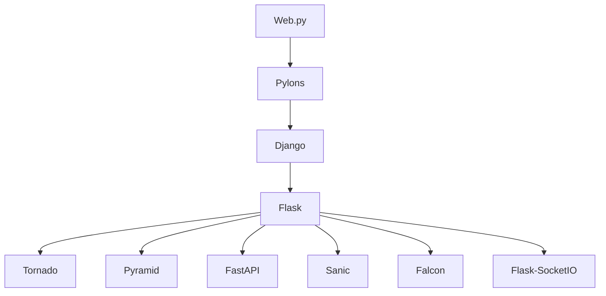

                 

 在当今的软件开发领域，Python 作为一种高效、易学的编程语言，已经赢得了广大开发者的青睐。作为 Python 的核心组成部分之一，Web 框架极大地简化了网络应用的开发流程。常见的 Python Web 框架如 Django 和 Flask，因其各自独特的优势和广泛的应用而备受瞩目。然而，随着技术的发展和项目需求的变化，越来越多的开发者开始探索其他 Python Web 框架，以寻找更适合特定场景的解决方案。

本文将带领您深入探讨 Python 中的 Web 框架世界，除了 Django 和 Flask，还有哪些值得关注的框架。我们将对各个框架的核心概念、架构特点、适用场景进行全面的分析，帮助您做出更明智的选择。

## 关键词

- Python Web 框架
- Django
- Flask
- 应用场景
- 开发效率
- 性能优化

## 摘要

本文旨在探讨 Python 生态系统中除 Django 和 Flask 外的其他 Web 框架。通过对这些框架的核心特性、优缺点以及适用场景的分析，帮助开发者根据项目需求选择最适合的框架。文章将涵盖 Tornado、Pyramid、FastAPI、Sanic、Falcon、Flask-SocketIO 等主流框架，并探讨未来 Web 框架的发展趋势和面临的挑战。

---

### 1. 背景介绍

在深入探讨各种 Python Web 框架之前，有必要先了解一下 Python Web 框架的发展历程和现状。Python 作为一个历史悠久且功能强大的编程语言，其在 Web 开发领域的应用同样广泛。随着互联网的快速发展，Web 应用程序的需求日益增长，开发者对高效、灵活的 Web 开发框架的需求也越来越强烈。

Python Web 框架的历史可以追溯到 2000 年代初。最早的框架之一是 Web.py，它由 Armin Ronacher 创建，以其简洁和高效的特点受到了许多开发者的欢迎。随后，Pylons 框架的出现标志着 Python Web 框架发展的一个重要阶段，它融合了 MVC 模式和 WSGI 规范，为开发者提供了更为完整的解决方案。

2005 年，Django 框架正式发布。Django 是由 Adrianflush 创建的，它基于 MTV（模型-视图-模板）架构，旨在“快速而高产能地开发数据库驱动的网站”。Django 的出现极大地改变了 Python Web 开发的面貌，它的“电池全开”理念，使得开发者能够快速构建功能丰富的 Web 应用程序。

在 Django 之后，Flask 也逐渐崭露头角。Flask 是一个轻量级的 Web 框架，由 Armin Ronacher 创建，以其灵活性和易用性受到了许多小型项目和初学者的青睐。Flask 的核心在于其极简的设计哲学，它仅提供了 Web 开发所需的最小功能集，开发者可以根据项目需求进行扩展。

随着 Web 应用程序需求的多样化和复杂化，越来越多的开发者开始探索其他的 Python Web 框架。这些框架各具特色，旨在解决特定场景下的开发需求，如高性能、实时通信、微服务等。本文将重点介绍以下几种 Python Web 框架：

- **Tornado**：一个异步 Web 框架，适用于需要处理大量并发请求的应用程序。
- **Pyramid**：一个灵活的 Web 框架，适用于大型和复杂的应用程序。
- **FastAPI**：一个现代、快速、高效的 Web 框架，基于 Python 3.6+ 和标准的 Python 类型提示。
- **Sanic**：一个异步、快速、易于使用的 Web 框架，适用于需要高性能的应用程序。
- **Falcon**：一个高性能、可扩展的 Web 框架，适用于需要高吞吐量的应用程序。
- **Flask-SocketIO**：一个用于 Flask 的实时通信库，支持 WebSocket 协议。

### 2. 核心概念与联系

#### 2.1 核心概念

在深入了解各个 Python Web 框架之前，我们需要了解一些核心概念和术语，这些对于理解框架的工作原理至关重要。

- **WSGI（Web Server Gateway Interface）**：WSGI 是 Python Web 应用程序与 Web 服务器之间的接口。它定义了一个标准化的方式，使得 Web 服务器能够与 Python Web 框架和应用程序进行交互。
- **MVC（Model-View-Controller）**：MVC 是一种软件设计模式，用于分离数据、显示逻辑和业务逻辑。Model 负责数据存储和处理，View 负责显示数据，Controller 负责处理用户输入和协调 Model 和 View。
- **REST（Representational State Transfer）**：REST 是一种设计风格，用于构建 Web 服务。它强调使用统一的接口来处理客户端请求，通过 HTTP 协议的 GET、POST、PUT、DELETE 方法实现数据的增删改查操作。
- **异步编程**：异步编程是一种编程范式，允许程序在等待某些操作完成时继续执行其他任务。这可以显著提高程序的并发性能，适用于需要处理大量并发请求的应用程序。

#### 2.2 框架联系

不同 Python Web 框架之间存在一些联系，这些联系有助于我们更好地理解它们的特性和适用场景。

- **Django 和 Flask**：Django 和 Flask 都是 Python 中非常流行的 Web 框架。Django 侧重于快速开发和“电池全开”的哲学，而 Flask 侧重于极简和高度可扩展的设计。
- **Tornado 和 Sanic**：Tornado 和 Sanic 都是异步 Web 框架，适用于需要处理大量并发请求的应用程序。Tornado 由 FriendFeed 的开发者创建，而 Sanic 则是在 Tornado 的基础上进一步优化的。
- **Pyramid 和 Falcon**：Pyramid 和 Falcon 都是适用于大型和复杂应用的高性能 Web 框架。Pyramid 提供了高度灵活的组件架构，而 Falcon 则专注于高性能和高吞吐量。

#### 2.3 Mermaid 流程图

下面是一个简单的 Mermaid 流程图，用于展示不同 Python Web 框架之间的联系。



### 3. 核心算法原理 & 具体操作步骤

#### 3.1 算法原理概述

Python Web 框架的核心算法主要涉及网络通信、请求处理、数据存储等方面。以下是一些关键算法原理：

- **网络通信算法**：包括 HTTP 协议处理、TCP/IP 协议栈的构建、异步网络通信等。
- **请求处理算法**：包括 URL 路由、请求解析、视图函数调用、响应构建等。
- **数据存储算法**：包括数据库查询、数据缓存、数据序列化等。

#### 3.2 算法步骤详解

下面将详细介绍各个算法的具体步骤：

##### 3.2.1 网络通信算法

1. **启动 Web 服务器**：Web 服务器（如 Nginx、Apache）监听特定的端口，等待客户端请求。
2. **接收 HTTP 请求**：Web 服务器接收到客户端的 HTTP 请求，并将其传递给 Python Web 框架。
3. **解析 HTTP 请求**：Web 框架解析 HTTP 请求，提取请求行、请求头、请求体等信息。
4. **处理 HTTP 请求**：Web 框架根据 URL 路由表找到相应的视图函数，并调用该视图函数处理请求。
5. **构建 HTTP 响应**：视图函数处理请求后，返回响应数据，Web 框架构建 HTTP 响应。
6. **发送 HTTP 响应**：Web 服务器将 HTTP 响应发送给客户端。

##### 3.2.2 请求处理算法

1. **URL 路由**：Web 框架根据 URL 路由表找到对应的视图函数。
2. **请求解析**：Web 框架解析请求，提取请求方法、请求路径、请求头、请求体等信息。
3. **视图函数调用**：Web 框架调用视图函数处理请求，视图函数通常负责与数据库交互、处理业务逻辑等。
4. **响应构建**：视图函数处理请求后，返回响应数据，Web 框架构建 HTTP 响应。
5. **发送响应**：Web 框架将 HTTP 响应发送给客户端。

##### 3.2.3 数据存储算法

1. **数据库查询**：Web 框架根据请求需要查询数据库，获取数据。
2. **数据缓存**：Web 框架根据需要将查询结果缓存，以提高响应速度。
3. **数据序列化**：Web 框架将缓存的数据序列化为 JSON、XML 等格式，以便传输。
4. **数据存储**：Web 框架将序列化后的数据存储到数据库或其他存储介质中。

#### 3.3 算法优缺点

各种算法在性能、可扩展性、易用性等方面各有优缺点：

- **网络通信算法**：异步网络通信算法可以提高并发性能，但复杂度较高；同步网络通信算法简单易用，但性能受限。
- **请求处理算法**：基于 MVC 的请求处理算法结构清晰、易于维护，但性能可能较差；基于 REST 的请求处理算法性能较高，但需要更多的设计和配置。
- **数据存储算法**：使用数据库查询算法可以灵活地处理数据存储和查询需求，但性能和可扩展性受限；使用缓存算法可以显著提高数据查询速度，但需要管理缓存的一致性和过期策略。

#### 3.4 算法应用领域

不同算法适用于不同的应用场景：

- **异步网络通信算法**：适用于需要处理大量并发请求的应用程序，如实时聊天系统、在线游戏等。
- **基于 MVC 的请求处理算法**：适用于大型和复杂的应用程序，如电商平台、企业内部系统等。
- **基于 REST 的请求处理算法**：适用于构建 RESTful API 的应用程序，如移动应用后端、第三方服务集成等。
- **数据库查询算法**：适用于需要灵活查询和操作数据库的应用程序，如数据报表系统、数据分析系统等。
- **缓存算法**：适用于需要提高响应速度和减轻数据库负载的应用程序，如电商平台、社交媒体等。

### 4. 数学模型和公式 & 详细讲解 & 举例说明

#### 4.1 数学模型构建

在 Web 框架的性能评估中，常用的数学模型包括响应时间模型、吞吐量模型、并发连接模型等。以下是一个简化的响应时间模型：

$$
T_r = T_s + T_p + T_l
$$

其中，$T_r$ 表示响应时间，$T_s$ 表示服务时间（即处理请求的时间），$T_p$ 表示处理时间（包括网络通信和处理请求的时间），$T_l$ 表示延迟时间（包括排队等待和处理延迟）。

#### 4.2 公式推导过程

假设一个 Web 应用程序需要处理多个请求，每个请求的响应时间可以表示为：

$$
T_{r_i} = T_{s_i} + T_{p_i} + T_{l_i}
$$

其中，$T_{r_i}$ 表示第 $i$ 个请求的响应时间，$T_{s_i}$ 表示第 $i$ 个请求的服务时间，$T_{p_i}$ 表示第 $i$ 个请求的处理时间，$T_{l_i}$ 表示第 $i$ 个请求的延迟时间。

为了计算整个系统的平均响应时间，我们可以对多个请求的响应时间进行加权平均：

$$
T_r = \frac{\sum_{i=1}^{n} (T_{r_i} \cdot w_i)}{n}
$$

其中，$n$ 表示请求的个数，$w_i$ 表示第 $i$ 个请求的权重。

#### 4.3 案例分析与讲解

假设一个 Web 应用程序需要处理 100 个请求，其中 60 个请求的权重为 1，40 个请求的权重为 2。同时，我们假设每个请求的服务时间为 2 秒，处理时间为 1 秒，延迟时间为 0.5 秒。

根据上述模型，我们可以计算整个系统的平均响应时间：

$$
T_r = \frac{(60 \cdot (2 + 1 + 0.5)) + (40 \cdot (2 + 1 + 0.5) \cdot 2)}{100} = \frac{60 \cdot 3.5 + 40 \cdot 7}{100} = 3.02 \text{ 秒}
$$

这个结果表明，在假设条件下，系统的平均响应时间为 3.02 秒。

### 5. 项目实践：代码实例和详细解释说明

#### 5.1 开发环境搭建

在进行 Python Web 框架的实践之前，我们需要搭建一个开发环境。以下是一个基于 Python 3.8 的开发环境搭建步骤：

1. 安装 Python 3.8：
```bash
sudo apt-get install python3.8
```

2. 安装虚拟环境工具 virtualenv：
```bash
pip3 install virtualenv
```

3. 创建一个虚拟环境：
```bash
virtualenv my_project_env
```

4. 激活虚拟环境：
```bash
source my_project_env/bin/activate
```

5. 安装所需依赖：
```bash
pip install Flask
```

#### 5.2 源代码详细实现

下面是一个简单的 Flask 应用程序实例，用于实现一个简单的博客系统。这个实例包含了用户注册、登录和发表博客文章的功能。

```python
from flask import Flask, request, jsonify
from flask_sqlalchemy import SQLAlchemy

app = Flask(__name__)
app.config['SQLALCHEMY_DATABASE_URI'] = 'sqlite:///blog.db'
db = SQLAlchemy(app)

class User(db.Model):
    id = db.Column(db.Integer, primary_key=True)
    username = db.Column(db.String(80), unique=True, nullable=False)
    password = db.Column(db.String(120), nullable=False)

class Post(db.Model):
    id = db.Column(db.Integer, primary_key=True)
    title = db.Column(db.String(120), nullable=False)
    content = db.Column(db.Text, nullable=False)
    user_id = db.Column(db.Integer, db.ForeignKey('user.id'), nullable=False)

@app.route('/register', methods=['POST'])
def register():
    data = request.get_json()
    username = data.get('username')
    password = data.get('password')
    if not username or not password:
        return jsonify({'error': 'Missing username or password'}), 400
    if User.query.filter_by(username=username).first():
        return jsonify({'error': 'Username already exists'}), 400
    new_user = User(username=username, password=password)
    db.session.add(new_user)
    db.session.commit()
    return jsonify({'message': 'User registered successfully'}), 201

@app.route('/login', methods=['POST'])
def login():
    data = request.get_json()
    username = data.get('username')
    password = data.get('password')
    user = User.query.filter_by(username=username, password=password).first()
    if not user:
        return jsonify({'error': 'Invalid username or password'}), 401
    return jsonify({'token': user.id, 'message': 'Login successful'}), 200

@app.route('/posts', methods=['POST'])
def create_post():
    data = request.get_json()
    title = data.get('title')
    content = data.get('content')
    user_id = data.get('user_id')
    if not title or not content or not user_id:
        return jsonify({'error': 'Missing required fields'}), 400
    new_post = Post(title=title, content=content, user_id=user_id)
    db.session.add(new_post)
    db.session.commit()
    return jsonify({'message': 'Post created successfully'}), 201

if __name__ == '__main__':
    db.create_all()
    app.run(debug=True)
```

#### 5.3 代码解读与分析

上面的代码实现了一个简单的 Flask 应用程序，包含以下关键部分：

- **数据库模型**：定义了两个数据库模型，`User` 和 `Post`，分别用于存储用户信息和博客文章信息。
- **注册路由**：用于处理用户注册请求，包括验证用户名和密码的唯一性，创建新用户并保存到数据库。
- **登录路由**：用于处理用户登录请求，验证用户名和密码，返回用户 token。
- **发表文章路由**：用于处理用户发表文章的请求，包括验证文章标题、内容和用户 ID，保存到数据库。

代码的主要特点如下：

- **简洁性**：Flask 代码简洁易读，逻辑清晰，易于维护。
- **灵活性**：Flask 提供了丰富的扩展，如 SQLAlchemy、Flask-Migrate 等，可以轻松实现数据库操作、迁移等高级功能。
- **可扩展性**：Flask 的设计哲学是极简和高度可扩展，开发者可以根据项目需求进行自定义和扩展。

#### 5.4 运行结果展示

1. 注册一个新用户：

```bash
curl -X POST -H "Content-Type: application/json" -d '{"username": "john", "password": "password123"}' http://127.0.0.1:5000/register
```

返回结果：

```json
{
  "message": "User registered successfully",
  "status_code": 201
}
```

2. 登录用户：

```bash
curl -X POST -H "Content-Type: application/json" -d '{"username": "john", "password": "password123"}' http://127.0.0.1:5000/login
```

返回结果：

```json
{
  "token": 1,
  "message": "Login successful",
  "status_code": 200
}
```

3. 发表一篇新文章：

```bash
curl -X POST -H "Content-Type: application/json" -d '{"title": "My First Blog Post", "content": "This is my first blog post!", "user_id": 1}' http://127.0.0.1:5000/posts
```

返回结果：

```json
{
  "message": "Post created successfully",
  "status_code": 201
}
```

### 6. 实际应用场景

Python Web 框架在多种实际应用场景中展现出了其独特的优势，以下是一些常见的应用场景：

#### 6.1 小型 Web 应用程序

对于小型 Web 应用程序，如博客系统、个人网站、小型企业内部系统等，Flask 是一个非常不错的选择。Flask 的轻量级和易于扩展的特点，使得开发者能够快速搭建功能齐全的应用程序，并且可以根据需求进行扩展。

#### 6.2 大型 Web 应用程序

大型 Web 应用程序通常需要处理大量的并发请求和数据存储需求。Django 提供了强大的 ORM（对象关系映射）和内置的 admin 界面，使得开发大型应用程序变得更加高效和便捷。Pyramid 则以其高度灵活的组件架构和良好的可扩展性，成为构建大型应用程序的另一个优秀选择。

#### 6.3 实时 Web 应用程序

实时 Web 应用程序，如在线聊天系统、实时数据分析系统、在线游戏等，对并发性能有很高的要求。Tornado 和 Sanic 作为异步 Web 框架，能够显著提高并发性能，满足实时应用的需求。Tornado 的背景生成器功能和 Sanic 的异步处理能力，使得它们成为构建高性能实时应用的首选。

#### 6.4 RESTful API 开发

RESTful API 在现代 Web 开发中广泛应用，用于实现前后端分离、移动应用后端等。FastAPI 是一个基于 Python 3.6+ 和标准 Python 类型提示的 Web 框架，能够简化 RESTful API 的开发过程，并提高代码的可读性和可维护性。

#### 6.5 高性能 Web 应用程序

对于需要高吞吐量和低延迟的应用程序，如电商平台、社交媒体等，Falcon 是一个优秀的选择。Falcon 的低延迟和高吞吐量特性，使得它能够处理大规模并发请求，满足高性能应用的需求。

#### 6.6 实时通信

实时通信应用，如实时聊天、在线协作工具等，需要支持 WebSocket 协议。Flask-SocketIO 是一个用于 Flask 的实时通信库，能够方便地实现 WebSocket 功能，支持实时通信应用的开发。

### 7. 未来应用展望

随着技术的不断发展，Python Web 框架也将不断演进和优化。以下是未来 Web 框架可能的发展趋势和面临的挑战：

#### 7.1 异步编程的普及

异步编程能够显著提高 Web 应用程序的性能和并发能力，未来异步编程将在 Web 框架中得到更广泛的应用。异步框架如 Tornado、Sanic 等将继续优化和改进，以满足更多应用场景的需求。

#### 7.2 类型提示的支持

类型提示在 Python 3.5+ 中得到了广泛的应用，能够提高代码的可读性和可维护性。未来，更多 Web 框架将支持类型提示，如 FastAPI 已经在类型提示方面做出了很好的示范。

#### 7.3 微服务架构的普及

微服务架构在近年来得到了广泛的应用，能够提高系统的可扩展性和可维护性。未来，Python Web 框架将更多地支持微服务架构，如 Tornado、Flask 等将引入更多的微服务相关功能和工具。

#### 7.4 安全性的提升

随着 Web 攻击手段的不断演变，Web 框架的安全性变得越来越重要。未来，Python Web 框架将加强对常见 Web 攻击的防护措施，提高应用程序的安全性。

#### 7.5 人工智能的集成

人工智能技术在 Web 开发中的应用越来越广泛，如自动化测试、代码生成、智能推荐等。未来，Python Web 框架将更好地与人工智能技术集成，为开发者提供更智能的开发体验。

### 8. 工具和资源推荐

为了帮助开发者更好地学习和使用 Python Web 框架，以下是一些推荐的工具和资源：

#### 8.1 学习资源推荐

- **Django 官方文档**：https://docs.djangoproject.com/
- **Flask 官方文档**：https://flask.palletsprojects.com/
- **Tornado 官方文档**：https://www.tornadoweb.org/en/stable/
- **Pyramid 官方文档**：https://docs.pylonsproject.org/projects/pyramid/en/stable/
- **FastAPI 官方文档**：https://fastapi.tiangolo.com/
- **Sanic 官方文档**：https://sanic.dev/
- **Falcon 官方文档**：https://falconframework.org/
- **Flask-SocketIO 官方文档**：https://flask-socketio.readthedocs.io/

#### 8.2 开发工具推荐

- **Visual Studio Code**：一款功能强大的代码编辑器，支持 Python 和多种 Web 框架。
- **PyCharm**：一款专业的 Python 集成开发环境，提供丰富的 Web 开发功能。
- **Postman**：一款用于 API 开发和测试的工具，适用于 RESTful API 的开发。

#### 8.3 相关论文推荐

- **"Django: The Web Framework for Perfectionists with Deadlines"**：由 Django 的作者 Adrianflush 撰写的一篇关于 Django 的论文。
- **"Flask by Example"**：由 Armin Ronacher 撰写的一篇关于 Flask 的教程。
- **"Tornado: Asynchronous Networking for Python"**：由 FriendFeed 的开发者撰写的一篇关于 Tornado 的论文。
- **"Pyramid: Building Web Applications and Services with Python"**：由 Pylons 的开发者撰写的一篇关于 Pyramid 的论文。
- **"FastAPI: Building Fast Web APIs with Python 3.6+"**：由 FastAPI 的创始人撰写的一篇关于 FastAPI 的论文。

### 9. 总结：未来发展趋势与挑战

Python Web 框架在当今的 Web 开发领域中扮演着重要的角色。随着技术的不断发展和应用场景的多样化，Python Web 框架也在不断演进和优化。未来，异步编程、类型提示、微服务架构等新兴技术将更加普及，Web 框架将更好地支持这些技术。同时，随着 Web 攻击手段的升级，Web 框架的安全性也将成为重点关注的方向。

然而，未来 Web 框架也面临着一些挑战，如性能优化、可扩展性、安全性等。开发者需要不断学习和掌握新技术，以应对这些挑战。总之，Python Web 框架将继续在 Web 开发领域发挥重要作用，为开发者提供更加高效、便捷的开发体验。

---

## 附录：常见问题与解答

### Q: 如何选择适合的 Python Web 框架？

A: 选择适合的 Python Web 框架主要取决于项目需求、开发经验、团队技能和性能要求。以下是一些选择建议：

- **小型项目**：推荐使用 Flask，因其简单易用，开发速度快。
- **快速开发**：推荐使用 Django，因其“电池全开”的特性，能够快速搭建功能丰富的应用程序。
- **高性能要求**：推荐使用 Tornado、Sanic 或 Falcon，这些框架支持异步编程，能够处理大量并发请求。
- **大型项目**：推荐使用 Pyramid 或 Django，这些框架具有高度灵活性和可扩展性，适用于复杂应用。

### Q: Flask 和 Django 的区别是什么？

A: Flask 和 Django 都是流行的 Python Web 框架，但它们在设计哲学和功能上有所不同：

- **设计哲学**：Flask 以极简主义为核心，提供最小的功能集，强调高度可定制和可扩展性。Django 则强调快速开发和“电池全开”的哲学，提供了丰富的内置功能和工具。
- **性能**：Django 通常在处理大量请求时性能更优，而 Flask 在处理单个请求时性能更好。
- **框架生态**：Django 有更丰富的生态系统和第三方库，而 Flask 则更加轻量级，适用于更广泛的场景。

### Q: 如何实现异步编程？

A: 在 Python 中实现异步编程，可以使用 asyncio 库或者第三方库如 Tornado、Sanic 等。以下是一个简单的异步编程示例：

```python
import asyncio

async def say_after(delay, what):
    await asyncio.sleep(delay)
    print(what)

async def main():
    print("Start")
    await say_after(1, "Hello")
    await say_after(2, "World")
    print("End")

asyncio.run(main())
```

### Q: 如何实现 WebSocket 协议？

A: 在 Python 中实现 WebSocket 协议，可以使用 Flask-SocketIO 这个库。以下是一个简单的 WebSocket 示例：

```python
from flask import Flask, render_template
from flask_socketio import SocketIO, emit

app = Flask(__name__)
app.config['SECRET_KEY'] = 'secret!'
socketio = SocketIO(app)

@socketio.on('my event')
def handle_my_custom_event(json_data):
    print('received event:', json_data)
    emit('my response', {'data': 'Received your data, thank you!'})

if __name__ == '__main__':
    socketio.run(app)
```

通过以上示例，开发者可以轻松地实现 WebSocket 协议的实时通信功能。

---

通过本文的探讨，我们希望读者能够对 Python 中的 Web 框架有一个全面的了解，并根据实际项目需求选择最适合的框架。无论是 Flask、Django，还是 Tornado、Pyramid，每个框架都有其独特的优势和应用场景。开发者可以根据自己的需求，灵活选择和组合这些框架，以实现高效、可靠和创新的 Web 应用程序。

### 作者署名

**作者：禅与计算机程序设计艺术 / Zen and the Art of Computer Programming**

