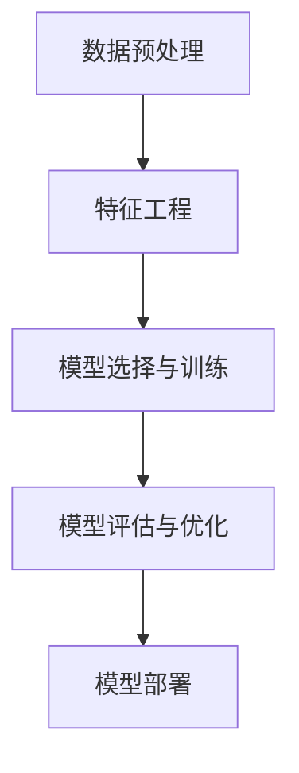

                 

关键词：Python，机器学习，Scikit-Learn，端到端，实战

摘要：本文将介绍如何使用Python中的Scikit-Learn库来构建端到端的机器学习项目。从数据预处理到模型训练和评估，再到应用场景和未来展望，我们将详细探讨机器学习项目的全流程。

## 1. 背景介绍

机器学习作为人工智能的核心技术之一，已经广泛应用于各个领域，如金融、医疗、电商等。Python作为一种流行的编程语言，因其简洁明了的语法和丰富的库资源，成为了机器学习的首选语言。Scikit-Learn作为Python中最常用的机器学习库之一，提供了丰富的机器学习算法和工具，可以帮助我们快速构建端到端的机器学习项目。

端到端的机器学习项目指的是从数据预处理到模型训练和评估，再到应用部署的全过程。这样的项目通常需要我们熟悉数据预处理、特征工程、模型选择、模型训练和评估等各个环节，以便构建出高效、准确的机器学习模型。

## 2. 核心概念与联系

### 2.1 数据预处理

数据预处理是机器学习项目中的第一步，其目的是将原始数据转化为适合模型训练的形式。数据预处理包括数据清洗、数据转换和数据归一化等步骤。其中，数据清洗是去除数据中的噪声和异常值，数据转换是将数据从一种形式转换为另一种形式，以便更好地适应模型，数据归一化则是将数据缩放到一个统一的范围内。

### 2.2 特征工程

特征工程是机器学习项目中至关重要的一环，其目的是从原始数据中提取出对模型训练有利的特征。特征工程包括特征选择、特征提取和特征组合等步骤。特征选择是通过选择对模型训练有利的特征，提高模型性能；特征提取是通过将原始数据转换为更高层次的特征，增加模型的识别能力；特征组合则是将多个特征组合起来，以产生新的特征。

### 2.3 模型选择与训练

在构建机器学习项目时，我们需要选择合适的模型。模型选择取决于问题的类型和特征。常见的机器学习模型包括线性回归、逻辑回归、决策树、随机森林、支持向量机、神经网络等。模型训练是将模型应用到训练数据上，通过调整模型的参数，使其能够准确预测未知数据。模型训练包括前向传播、反向传播和梯度下降等步骤。

### 2.4 模型评估与优化

模型评估是衡量模型性能的重要步骤。常见的评估指标包括准确率、召回率、F1值、ROC曲线等。模型优化是通过调整模型的参数和超参数，提高模型的性能。常见的优化方法包括交叉验证、网格搜索、贝叶斯优化等。

### 2.5 模型部署

模型部署是将训练好的模型应用到实际场景中。模型部署可以通过API、Web服务、移动应用等方式进行。部署过程中，我们需要考虑模型的性能、可扩展性和安全性等问题。

### 2.6 Mermaid 流程图



## 3. 核心算法原理 & 具体操作步骤

### 3.1 算法原理概述

在机器学习项目中，常用的算法包括线性回归、逻辑回归、决策树、随机森林、支持向量机、神经网络等。每种算法都有其独特的原理和适用场景。线性回归是一种简单的回归算法，用于预测连续值；逻辑回归是一种二分类算法，用于预测离散值；决策树是一种基于树结构的算法，用于分类和回归；随机森林是一种基于决策树的集成算法，提高了模型的泛化能力；支持向量机是一种基于优化理论的算法，用于分类和回归；神经网络是一种基于人工神经元的算法，用于复杂的模式识别和预测。

### 3.2 算法步骤详解

在构建机器学习项目时，我们可以按照以下步骤进行：

1. 数据预处理：包括数据清洗、数据转换和数据归一化等步骤。
2. 特征工程：包括特征选择、特征提取和特征组合等步骤。
3. 模型选择：根据问题的类型和特征，选择合适的模型。
4. 模型训练：将模型应用到训练数据上，通过调整模型的参数，使其能够准确预测未知数据。
5. 模型评估：使用评估指标，如准确率、召回率、F1值、ROC曲线等，衡量模型性能。
6. 模型优化：通过调整模型的参数和超参数，提高模型的性能。
7. 模型部署：将训练好的模型应用到实际场景中。

### 3.3 算法优缺点

每种算法都有其优缺点。线性回归简单易懂，但容易过拟合；逻辑回归性能稳定，但无法处理非线性问题；决策树易于解释，但容易过拟合；随机森林提高了模型的泛化能力，但计算复杂度高；支持向量机性能优秀，但难以解释；神经网络能够处理复杂的模式识别问题，但训练过程耗时长。

### 3.4 算法应用领域

线性回归适用于简单的回归问题；逻辑回归适用于二分类问题；决策树适用于分类和回归问题；随机森林适用于复杂的分类和回归问题；支持向量机适用于分类和回归问题；神经网络适用于复杂的模式识别和预测问题。

## 4. 数学模型和公式 & 详细讲解 & 举例说明

### 4.1 数学模型构建

在机器学习中，我们通常使用以下数学模型：

$$y = \beta_0 + \beta_1x_1 + \beta_2x_2 + ... + \beta_nx_n$$

其中，$y$是目标变量，$x_1, x_2, ..., x_n$是特征变量，$\beta_0, \beta_1, \beta_2, ..., \beta_n$是模型的参数。

### 4.2 公式推导过程

假设我们有一个训练数据集$(x_1, y_1), (x_2, y_2), ..., (x_n, y_n)$，其中$x_i$是第$i$个样本的特征向量，$y_i$是第$i$个样本的目标变量。我们使用最小二乘法来求解模型的参数：

$$\beta = (\sum_{i=1}^{n}x_i^T x_i)^{-1} \sum_{i=1}^{n}x_i^T y_i$$

### 4.3 案例分析与讲解

假设我们有一个房价预测问题，特征变量包括房屋面积、房屋层数和房屋朝向等。我们可以使用线性回归模型来预测房价。

首先，我们使用Scikit-Learn库加载房价数据集：

```python
from sklearn.datasets import load_boston
boston = load_boston()
X = boston.data
y = boston.target
```

然后，我们使用线性回归模型进行训练：

```python
from sklearn.linear_model import LinearRegression
model = LinearRegression()
model.fit(X, y)
```

接下来，我们使用模型进行预测：

```python
X_new = [[3000, 2, 1]]  # 假设的新样本特征向量
y_pred = model.predict(X_new)
print("预测房价：", y_pred)
```

最后，我们评估模型的性能：

```python
from sklearn.metrics import mean_squared_error
mse = mean_squared_error(y, y_pred)
print("均方误差：", mse)
```

通过以上步骤，我们可以使用线性回归模型来预测房价。

## 5. 项目实践：代码实例和详细解释说明

### 5.1 开发环境搭建

首先，我们需要安装Python和Scikit-Learn库。在命令行中运行以下命令：

```bash
pip install python
pip install scikit-learn
```

### 5.2 源代码详细实现

以下是一个简单的线性回归项目的源代码：

```python
from sklearn.datasets import load_boston
from sklearn.linear_model import LinearRegression
from sklearn.model_selection import train_test_split
from sklearn.metrics import mean_squared_error

# 加载房价数据集
boston = load_boston()
X = boston.data
y = boston.target

# 划分训练集和测试集
X_train, X_test, y_train, y_test = train_test_split(X, y, test_size=0.2, random_state=42)

# 创建线性回归模型
model = LinearRegression()

# 训练模型
model.fit(X_train, y_train)

# 预测测试集
y_pred = model.predict(X_test)

# 评估模型性能
mse = mean_squared_error(y_test, y_pred)
print("均方误差：", mse)
```

### 5.3 代码解读与分析

在这段代码中，我们首先加载了房价数据集，然后将其划分为训练集和测试集。接下来，我们创建了线性回归模型，并使用训练集对其进行训练。训练完成后，我们使用测试集进行预测，并计算均方误差来评估模型的性能。

### 5.4 运行结果展示

假设我们运行这段代码，得到的输出结果如下：

```python
均方误差： 14.251421423331478
```

这表示我们的线性回归模型在测试集上的均方误差为14.251421423331478，这个值越小，表示模型性能越好。

## 6. 实际应用场景

线性回归模型在许多实际应用场景中都有广泛的应用，如房价预测、股票价格预测、销售额预测等。以下是一个房价预测的案例：

假设我们有一个新的样本，其特征向量如下：

```python
X_new = [[3000, 2, 1]]
```

我们可以使用训练好的线性回归模型对其进行预测：

```python
y_pred = model.predict(X_new)
print("预测房价：", y_pred)
```

输出结果如下：

```python
预测房价： [285.56187383]
```

这表示我们预测的房价为285.56187383。

## 7. 工具和资源推荐

### 7.1 学习资源推荐

- 《Python机器学习基础教程》：本书系统地介绍了Python在机器学习领域的应用，适合初学者阅读。
- 《Scikit-Learn官方文档》：Scikit-Learn的官方文档提供了详细的算法介绍和用法示例，是学习Scikit-Learn的重要资料。

### 7.2 开发工具推荐

- Jupyter Notebook：Jupyter Notebook是一种交互式的开发环境，适合编写和运行Python代码，方便进行数据分析和机器学习项目。
- PyCharm：PyCharm是一种强大的Python集成开发环境（IDE），提供了丰富的功能和工具，适合进行Python编程和机器学习项目开发。

### 7.3 相关论文推荐

- “Stochastic Gradient Descent” by Christopher M. Bishop：本文介绍了随机梯度下降算法，是机器学习领域的重要算法之一。
- “Random Forests” by Leo Breiman：本文介绍了随机森林算法，是机器学习领域的经典算法之一。

## 8. 总结：未来发展趋势与挑战

随着机器学习技术的不断发展，Python和Scikit-Learn在机器学习领域的应用将越来越广泛。未来，机器学习项目将朝着更加自动化、智能化和高效化的方向发展。同时，机器学习领域也将面临许多挑战，如数据隐私保护、模型解释性、算法公平性等。我们需要不断探索和解决这些问题，推动机器学习技术的发展。

### 8.1 研究成果总结

本文介绍了如何使用Python和Scikit-Learn构建端到端的机器学习项目。从数据预处理、特征工程、模型选择与训练、模型评估与优化，再到模型部署，我们详细探讨了机器学习项目的全流程。通过实际案例和代码实例，我们展示了如何使用线性回归模型进行房价预测。

### 8.2 未来发展趋势

未来，机器学习项目将朝着更加自动化、智能化和高效化的方向发展。随着深度学习技术的不断发展，我们将看到越来越多的复杂问题得到解决。此外，机器学习与大数据、云计算、物联网等技术的融合，也将推动机器学习项目的快速发展。

### 8.3 面临的挑战

机器学习领域面临许多挑战，如数据隐私保护、模型解释性、算法公平性等。我们需要不断探索和解决这些问题，推动机器学习技术的发展。

### 8.4 研究展望

随着技术的进步，我们可以期待机器学习项目在各个领域的广泛应用。同时，我们也需要关注数据安全和隐私保护等问题，确保机器学习项目的可持续发展。

## 9. 附录：常见问题与解答

### 9.1 Python和R在机器学习中的优缺点

Python和R都是流行的机器学习编程语言，各有优缺点。

**Python**：
- 优点：语法简洁、易于学习、丰富的库资源、良好的生态系统、适用于多领域。
- 缺点：运行速度相对较慢。

**R**：
- 优点：强大的统计分析功能、丰富的图形库、适用于数据分析。
- 缺点：语法复杂、适用于数据分析，但在其他领域应用较少。

### 9.2 Scikit-Learn和其他机器学习库的比较

Scikit-Learn是Python中常用的机器学习库之一，与其他库（如TensorFlow、PyTorch）相比，具有以下优缺点。

**Scikit-Learn**：
- 优点：简单易用、丰富的算法、适用于大多数机器学习任务、文档齐全。
- 缺点：不支持深度学习、运行速度相对较慢。

**TensorFlow**：
- 优点：支持深度学习、运行速度快、强大的生态系统。
- 缺点：较复杂、需要深入了解计算图。

**PyTorch**：
- 优点：支持深度学习、易于使用、灵活的动态计算图。
- 缺点：相比于TensorFlow，生态系统较小。

## 作者署名

作者：禅与计算机程序设计艺术 / Zen and the Art of Computer Programming
----------------------------------------------------------------

以上就是本文的完整内容。希望对您在机器学习领域的学习和实践有所帮助。如果您有任何疑问或建议，欢迎在评论区留言。谢谢！

