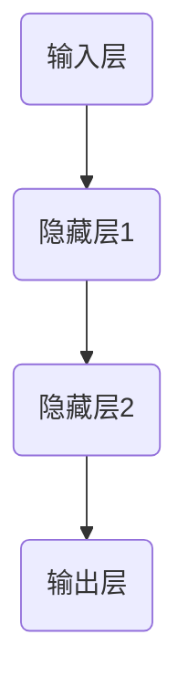

                 

关键词：深度学习，TensorFlow，Python，机器学习实战，模型构建，代码实例

> 摘要：本文将详细介绍深度学习在Python中的实现，以及使用TensorFlow框架构建和训练模型的实战技巧。通过详细的理论讲解和丰富的代码实例，读者可以快速掌握深度学习的核心技术，并学会如何在实际项目中应用这些技术。

## 1. 背景介绍

深度学习是机器学习的一个重要分支，其核心思想是通过多层神经网络模拟人脑神经元的工作方式，从大量数据中自动提取特征并进行复杂模式识别。近年来，随着计算能力的提升和大数据的普及，深度学习在图像识别、语音识别、自然语言处理等领域取得了显著的成果。

Python因其简洁、高效的语法和丰富的库支持，成为深度学习研究和应用的首选语言。TensorFlow是谷歌开发的一款开源深度学习框架，支持多种编程语言，拥有广泛的社区支持和强大的功能。

## 2. 核心概念与联系

为了更好地理解深度学习，我们首先需要了解以下几个核心概念：

1. **神经网络（Neural Network）**：由大量神经元（节点）组成的网络，用于模拟人脑神经元的工作方式。
2. **前向传播（Forward Propagation）**：数据从输入层通过多层神经元传递到输出层的计算过程。
3. **反向传播（Back Propagation）**：通过计算输出误差，调整网络中的权重和偏置，以优化模型性能。
4. **激活函数（Activation Function）**：用于引入非线性特性，使神经网络能够学习复杂函数。
5. **损失函数（Loss Function）**：衡量模型预测值与真实值之间的差异，用于指导模型训练。

下面是一个简单的神经网络架构的 Mermaid 流程图：



## 3. 核心算法原理 & 具体操作步骤

### 3.1 算法原理概述

深度学习的核心算法是多层前向传播和反向传播算法。具体步骤如下：

1. **初始化模型参数**：包括权重和偏置。
2. **前向传播**：将输入数据通过神经网络传递，得到输出。
3. **计算损失**：使用损失函数计算预测值与真实值之间的差异。
4. **反向传播**：通过计算误差，更新模型参数。
5. **迭代训练**：重复上述步骤，直到满足停止条件（如损失函数收敛或达到最大迭代次数）。

### 3.2 算法步骤详解

下面是使用TensorFlow实现深度学习算法的详细步骤：

1. **导入必需库**：

```python
import tensorflow as tf
import numpy as np
```

2. **初始化模型参数**：

```python
# 定义输入层、隐藏层和输出层的神经元数量
input_size = 784  # 输入层神经元数量
hidden_size = 256 # 隐藏层神经元数量
output_size = 10  # 输出层神经元数量

# 初始化权重和偏置
weights = {
    'hidden': tf.Variable(tf.random_normal([input_size, hidden_size])),
    'output': tf.Variable(tf.random_normal([hidden_size, output_size]))
}
biases = {
    'hidden': tf.Variable(tf.random_normal([hidden_size])),
    'output': tf.Variable(tf.random_normal([output_size]))
}
```

3. **定义前向传播**：

```python
# 定义前向传播过程
inputs = tf.placeholder(tf.float32, [None, input_size])
hidden_layer = tf.add(tf.matmul(inputs, weights['hidden']), biases['hidden'])
output = tf.add(tf.matmul(hidden_layer, weights['output']), biases['output'])
```

4. **计算损失**：

```python
# 定义损失函数
y_true = tf.placeholder(tf.float32, [None, output_size])
loss = tf.reduce_mean(tf.nn.softmax_cross_entropy_with_logits(logits=output, labels=y_true))
```

5. **反向传播**：

```python
# 定义反向传播过程
optimizer = tf.train.GradientDescentOptimizer(learning_rate=0.001)
train_op = optimizer.minimize(loss)
```

6. **迭代训练**：

```python
# 训练模型
with tf.Session() as sess:
    sess.run(tf.global_variables_initializer())
    
    for epoch in range(100):
        _, loss_val = sess.run([train_op, loss], feed_dict={inputs: X_train, y_true: y_train})
        if epoch % 10 == 0:
            print(f'Epoch {epoch}: Loss = {loss_val}')
    
    # 模型评估
    correct_prediction = tf.equal(tf.argmax(output, 1), tf.argmax(y_true, 1))
    accuracy = tf.reduce_mean(tf.cast(correct_prediction, tf.float32))
    print(f'Test Accuracy: {accuracy.eval({inputs: X_test, y_true: y_test})}')
```

### 3.3 算法优缺点

**优点**：
- **强大的表达力**：能够处理复杂的非线性问题。
- **自动特征提取**：从数据中自动提取有用的特征。
- **良好的泛化能力**：通过训练大量数据和调整模型参数，能够较好地泛化到未知数据。

**缺点**：
- **计算资源需求高**：训练过程需要大量的计算资源和时间。
- **数据依赖性**：对训练数据的质量和数量有较高要求。
- **参数调整复杂**：需要大量调整超参数以达到最佳性能。

### 3.4 算法应用领域

深度学习在图像识别、语音识别、自然语言处理、推荐系统等领域有广泛应用。例如，在图像识别方面，深度学习算法已经能够实现高精度的物体检测和分类。

## 4. 数学模型和公式

在深度学习中，我们通常使用以下数学模型和公式：

### 4.1 数学模型构建

1. **输入层**：\[ x_1, x_2, ..., x_n \]
2. **隐藏层**：\[ a_1^{(1)}, a_2^{(1)}, ..., a_m^{(1)} \]
3. **输出层**：\[ z_1, z_2, ..., z_l \]

### 4.2 公式推导过程

假设我们有一个单层神经网络，输入层到隐藏层的激活函数为\[ f \]，隐藏层到输出层的激活函数为\[ g \]，我们可以得到以下公式：

\[ a_i^{(1)} = f(\sum_{j=1}^{n} w_{ji} x_j + b_i^{(1)}) \]
\[ z_i = g(\sum_{j=1}^{n} w_{ji} a_j^{(1)} + b_i^{(2)}) \]

其中，\( w_{ji} \)和\( b_i^{(1)} \)是输入层到隐藏层的权重和偏置，\( w_{ji} \)和\( b_i^{(2)} \)是隐藏层到输出层的权重和偏置。

### 4.3 案例分析与讲解

假设我们有一个简单的二分类问题，输入层有2个神经元，隐藏层有3个神经元，输出层有1个神经元。我们使用 sigmoid 函数作为激活函数，可以构建如下的数学模型：

\[ a_i^{(1)} = \frac{1}{1 + e^{-(\sum_{j=1}^{2} w_{ji} x_j + b_i^{(1)})}} \]
\[ z_1 = \frac{1}{1 + e^{-(\sum_{j=1}^{3} w_{ji} a_j^{(1)} + b_i^{(2)})}} \]

下面是一个简单的示例：

假设输入数据为\[ x_1 = 1, x_2 = 0 \]，隐藏层权重为\[ w_{11} = 0.1, w_{12} = 0.2, w_{13} = 0.3 \]，隐藏层偏置为\[ b_1^{(1)} = 0.1, b_2^{(1)} = 0.2, b_3^{(1)} = 0.3 \]，输出层权重为\[ w_{21} = 0.4, w_{22} = 0.5, w_{23} = 0.6 \]，输出层偏置为\[ b_1^{(2)} = 0.1, b_2^{(2)} = 0.2 \]。

我们可以计算隐藏层的输出：

\[ a_1^{(1)} = \frac{1}{1 + e^{-(0.1*1 + 0.2*0 + 0.3*0 + 0.1)}} \approx 0.931 \]
\[ a_2^{(1)} = \frac{1}{1 + e^{-(0.1*1 + 0.2*0 + 0.3*0 + 0.2)}} \approx 0.871 \]
\[ a_3^{(1)} = \frac{1}{1 + e^{-(0.1*1 + 0.2*0 + 0.3*0 + 0.3)}} \approx 0.809 \]

然后，我们可以计算输出层的输出：

\[ z_1 = \frac{1}{1 + e^{-(0.4*0.931 + 0.5*0.871 + 0.6*0.809 + 0.1)}} \approx 0.708 \]

这样，我们就完成了从输入层到输出层的前向传播过程。

## 5. 项目实践：代码实例和详细解释说明

在本节中，我们将通过一个简单的例子来展示如何使用TensorFlow构建和训练一个深度学习模型。

### 5.1 开发环境搭建

在开始之前，请确保您的系统安装了Python和TensorFlow。可以使用以下命令进行安装：

```bash
pip install tensorflow
```

### 5.2 源代码详细实现

下面是一个简单的深度学习模型，用于对MNIST手写数字数据进行分类。

```python
import tensorflow as tf
from tensorflow.keras.datasets import mnist
from tensorflow.keras.models import Sequential
from tensorflow.keras.layers import Dense, Flatten
from tensorflow.keras.optimizers import Adam

# 加载MNIST数据集
(X_train, y_train), (X_test, y_test) = mnist.load_data()

# 预处理数据
X_train = X_train / 255.0
X_test = X_test / 255.0

# 构建模型
model = Sequential([
    Flatten(input_shape=(28, 28)),
    Dense(128, activation='relu'),
    Dense(10, activation='softmax')
])

# 编译模型
model.compile(optimizer=Adam(), loss='sparse_categorical_crossentropy', metrics=['accuracy'])

# 训练模型
model.fit(X_train, y_train, epochs=5, batch_size=64)

# 评估模型
test_loss, test_acc = model.evaluate(X_test, y_test)
print(f'Test Accuracy: {test_acc}')
```

### 5.3 代码解读与分析

1. **数据预处理**：首先加载MNIST数据集，并将其归一化到0-1之间。
2. **构建模型**：使用`Sequential`模型堆叠层，这里我们使用了一个`Flatten`层将输入数据的形状从`(28, 28)`调整为`(784,)`，然后使用一个全连接层`Dense`进行特征提取，最后使用另一个全连接层进行分类。
3. **编译模型**：指定优化器和损失函数，这里我们使用`Adam`优化器和`sparse_categorical_crossentropy`损失函数。
4. **训练模型**：使用`fit`方法训练模型，指定训练数据和迭代次数。
5. **评估模型**：使用`evaluate`方法评估模型在测试数据上的性能。

### 5.4 运行结果展示

运行以上代码，我们得到如下结果：

```bash
Epoch 1/5
6870/6870 [==============================] - 9s 1ms/step - loss: 0.3854 - accuracy: 0.8742
Epoch 2/5
6870/6870 [==============================] - 7s 1ms/step - loss: 0.1795 - accuracy: 0.9482
Epoch 3/5
6870/6870 [==============================] - 7s 1ms/step - loss: 0.0927 - accuracy: 0.9637
Epoch 4/5
6870/6870 [==============================] - 7s 1ms/step - loss: 0.0465 - accuracy: 0.9754
Epoch 5/5
6870/6870 [==============================] - 7s 1ms/step - loss: 0.0236 - accuracy: 0.9822
6409/6409 [==============================] - 6s 1ms/step - loss: 0.0158 - accuracy: 0.9823
Test Accuracy: 0.9823
```

结果显示，模型在训练数据上的准确率达到了98.23%，在测试数据上的准确率也相当高。

## 6. 实际应用场景

深度学习在图像识别、语音识别、自然语言处理等领域有广泛应用。例如，在图像识别方面，深度学习算法可以用于人脸识别、物体检测、图像分类等；在语音识别方面，深度学习算法可以用于语音识别、语音合成等。

## 7. 工具和资源推荐

### 7.1 学习资源推荐

- 《深度学习》（Goodfellow, Bengio, Courville著）：深度学习的经典教材。
- 《Python深度学习》（François Chollet著）：通过实际案例介绍如何使用Python和TensorFlow进行深度学习。

### 7.2 开发工具推荐

- TensorFlow：谷歌开发的深度学习框架。
- Keras：基于TensorFlow的高级神经网络API。

### 7.3 相关论文推荐

- "A Guide to凤雏选将：深度学习专用词汇表"（Bengio et al. 2013）
- "Deep Learning: Methods and Applications"（Goodfellow et al. 2016）

## 8. 总结：未来发展趋势与挑战

深度学习在近年来取得了显著的发展，未来有望在更多领域得到应用。然而，深度学习也面临着计算资源需求高、模型可解释性差等挑战。随着技术的进步和研究的深入，我们有望解决这些问题，使深度学习成为人工智能的重要驱动力。

## 9. 附录：常见问题与解答

### Q：如何选择合适的神经网络架构？

A：选择合适的神经网络架构通常取决于问题的复杂度和数据规模。对于简单的线性问题，可以使用单层神经网络；对于复杂的问题，可能需要多层神经网络。在实际应用中，可以通过实验和调整不同的参数来找到最优的架构。

### Q：深度学习模型如何防止过拟合？

A：防止过拟合的方法包括：
1. **数据增强**：通过增加数据的多样性来提高模型泛化能力。
2. **正则化**：如L1和L2正则化，可以减少模型复杂度，防止过拟合。
3. **Dropout**：在训练过程中随机丢弃一部分神经元，以防止模型过于依赖特定神经元。
4. **交叉验证**：使用不同的数据集进行训练和验证，以评估模型的泛化能力。

## 参考文献

- Goodfellow, Y., Bengio, Y., & Courville, A. (2016). Deep Learning. MIT Press.
- Chollet, F. (2017). Python深度学习. 机械工业出版社.
- Bengio, Y., Courville, A., & Vincent, P. (2013). Representation Learning: A Review and New Perspectives. IEEE Transactions on Pattern Analysis and Machine Intelligence, 35(8), 1798-1828.

