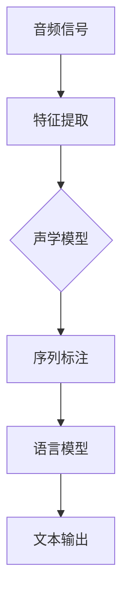

                 

 关键词：Python，机器学习，深度学习，语音识别，神经网络，模型训练，应用场景

> 摘要：本文将探讨如何使用Python和深度学习技术来实现语音识别。我们将详细讨论语音识别的背景、核心概念、算法原理、数学模型以及实际应用场景。此外，本文还将提供一个项目实践实例，介绍如何搭建开发环境、实现代码并分析运行结果。通过本文的学习，读者将能够掌握语音识别的基本原理和实践技能，为未来在相关领域的研究和应用奠定基础。

## 1. 背景介绍

语音识别（Speech Recognition）是一种通过转换音频信号为文本的技术，近年来随着机器学习和深度学习的发展，语音识别的准确率和实用性得到了极大的提升。语音识别技术广泛应用于智能助手、语音搜索、语音翻译、语音控制系统等领域。

深度学习作为机器学习的一个重要分支，通过模拟人脑的神经网络结构，能够处理复杂的非线性问题。近年来，深度学习在语音识别领域取得了显著的成果，如卷积神经网络（CNN）和循环神经网络（RNN）等模型被广泛应用于语音信号处理、特征提取和序列标注等环节。

Python作为一门流行的编程语言，具有简洁易读、功能强大等特点，是机器学习和深度学习领域的重要工具。Python拥有丰富的机器学习和深度学习库，如TensorFlow、PyTorch等，这些库提供了强大的功能，使开发者能够轻松实现各种复杂的机器学习算法和深度学习模型。

## 2. 核心概念与联系

### 2.1 语音识别的核心概念

语音识别系统通常包括以下几个核心概念：

- **音频信号**：语音识别的输入是音频信号，音频信号是通过声波振动产生的。
- **特征提取**：将音频信号转换为适合机器学习的特征表示，如频谱特征、倒谱特征等。
- **序列标注**：对语音信号中的每个帧进行标注，生成一个序列，序列中的每个元素表示当前帧的标签。
- **模型训练**：使用标注数据训练深度学习模型，使其能够识别语音信号并生成相应的文本输出。

### 2.2 深度学习在语音识别中的应用

深度学习在语音识别中的应用主要体现在以下几个方面：

- **特征提取**：使用卷积神经网络（CNN）对音频信号进行特征提取，提取出具有区分度的特征表示。
- **序列建模**：使用循环神经网络（RNN）或长短时记忆网络（LSTM）对语音信号进行序列建模，捕捉语音信号中的时间依赖关系。
- **声学模型**：声学模型是语音识别系统中的核心部分，用于将语音信号映射到相应的文本输出。声学模型通常使用神经网络结构，如CNN和RNN，来学习语音信号和文本之间的映射关系。
- **语言模型**：语言模型用于对生成的文本进行校验和优化，通常使用统计语言模型或深度神经网络语言模型。

### 2.3 Mermaid 流程图

下面是语音识别系统的 Mermaid 流程图：



## 3. 核心算法原理 & 具体操作步骤

### 3.1 算法原理概述

语音识别的核心算法主要包括以下几个部分：

- **特征提取**：将音频信号转换为特征表示，如频谱特征、倒谱特征等。
- **声学模型**：使用神经网络结构学习语音信号和文本之间的映射关系，如CNN和RNN。
- **序列标注**：对语音信号中的每个帧进行标注，生成一个序列。
- **语言模型**：对生成的文本进行校验和优化，提高识别准确率。

### 3.2 算法步骤详解

下面是语音识别算法的具体步骤：

1. **数据预处理**：将音频信号转换为适合机器学习的特征表示。
2. **特征提取**：使用卷积神经网络（CNN）对音频信号进行特征提取，提取出具有区分度的特征表示。
3. **声学模型训练**：使用提取到的特征数据和对应的文本标签训练声学模型，如CNN和RNN。
4. **序列标注**：对训练好的声学模型进行序列标注，生成一个序列。
5. **语言模型优化**：使用生成的序列和文本数据优化语言模型，提高识别准确率。
6. **文本输出**：将优化后的文本输出，完成语音识别任务。

### 3.3 算法优缺点

**优点**：

- **高效性**：深度学习模型能够快速处理大量数据，提高语音识别的效率。
- **准确性**：深度学习模型能够捕捉语音信号中的时间依赖关系，提高识别准确率。
- **灵活性**：深度学习模型可以通过调整网络结构和参数，适应不同的应用场景。

**缺点**：

- **计算资源消耗**：深度学习模型通常需要大量的计算资源，对硬件要求较高。
- **数据依赖性**：深度学习模型需要大量标注数据进行训练，对数据质量有较高要求。

### 3.4 算法应用领域

深度学习在语音识别领域有广泛的应用，包括：

- **智能助手**：如苹果的Siri、谷歌的Google Assistant等，通过语音识别技术实现人机交互。
- **语音搜索**：如百度语音搜索、搜狗语音搜索等，通过语音识别技术实现语音查询。
- **语音翻译**：如谷歌翻译、微软翻译等，通过语音识别技术实现语音翻译。
- **语音控制系统**：如智能家居、智能车载等，通过语音识别技术实现语音控制。

## 4. 数学模型和公式 & 详细讲解 & 举例说明

### 4.1 数学模型构建

语音识别的数学模型主要包括声学模型和语言模型。

**声学模型**：

声学模型用于将语音信号映射到文本输出，其基本结构如下：

$$
y = f(x, \theta)
$$

其中，$x$表示语音信号，$\theta$表示模型参数，$y$表示文本输出。

**语言模型**：

语言模型用于对生成的文本进行校验和优化，其基本结构如下：

$$
p(y) = \frac{1}{Z} \exp(\theta \cdot y)
$$

其中，$y$表示文本输出，$\theta$表示模型参数，$Z$表示规范化常数。

### 4.2 公式推导过程

**声学模型推导**：

声学模型通常使用神经网络结构，如CNN和RNN，来学习语音信号和文本之间的映射关系。

1. **卷积神经网络（CNN）**：

   $$ 
   h^{(l)} = \sigma(W^{(l)} \cdot h^{(l-1)} + b^{(l)})
   $$

   其中，$h^{(l)}$表示第$l$层的输出，$W^{(l)}$和$b^{(l)}$分别表示第$l$层的权重和偏置，$\sigma$表示激活函数。

2. **循环神经网络（RNN）**：

   $$ 
   h^{(l)} = \sigma(W_h \cdot [h^{(l-1)}, x^{(l)}] + b_h)
   $$

   $$ 
   h^{(l)} = \sigma(W_x \cdot x^{(l)} + b_x)
   $$

   其中，$h^{(l)}$表示第$l$层的输出，$W_h$和$W_x$分别表示权重矩阵，$b_h$和$b_x$分别表示偏置，$\sigma$表示激活函数。

**语言模型推导**：

语言模型通常使用神经网络结构，如CNN和RNN，来学习语音信号和文本之间的映射关系。

1. **卷积神经网络（CNN）**：

   $$ 
   y = \sum_{i=1}^{n} w_i \cdot x_i + b
   $$

   其中，$y$表示文本输出，$x_i$表示第$i$个单词的词向量，$w_i$和$b$分别表示权重和偏置。

2. **循环神经网络（RNN）**：

   $$ 
   y = \sum_{i=1}^{n} w_i \cdot h_i + b
   $$

   其中，$y$表示文本输出，$h_i$表示第$i$个单词的词向量，$w_i$和$b$分别表示权重和偏置。

### 4.3 案例分析与讲解

**案例一：使用CNN进行语音识别**

假设我们有1000个音频样本和对应的文本标签，我们将使用CNN进行语音识别。

1. **数据预处理**：将音频信号转换为频谱特征，如梅尔频率倒谱系数（MFCC）。
2. **特征提取**：使用CNN对频谱特征进行特征提取，提取出具有区分度的特征表示。
3. **模型训练**：使用提取到的特征数据和对应的文本标签训练CNN模型。
4. **序列标注**：对训练好的CNN模型进行序列标注，生成一个序列。
5. **语言模型优化**：使用生成的序列和文本数据优化语言模型，提高识别准确率。
6. **文本输出**：将优化后的文本输出，完成语音识别任务。

**案例二：使用RNN进行语音识别**

假设我们有1000个音频样本和对应的文本标签，我们将使用RNN进行语音识别。

1. **数据预处理**：将音频信号转换为频谱特征，如梅尔频率倒谱系数（MFCC）。
2. **特征提取**：使用RNN对频谱特征进行特征提取，提取出具有区分度的特征表示。
3. **模型训练**：使用提取到的特征数据和对应的文本标签训练RNN模型。
4. **序列标注**：对训练好的RNN模型进行序列标注，生成一个序列。
5. **语言模型优化**：使用生成的序列和文本数据优化语言模型，提高识别准确率。
6. **文本输出**：将优化后的文本输出，完成语音识别任务。

## 5. 项目实践：代码实例和详细解释说明

### 5.1 开发环境搭建

1. **安装Python**：下载并安装Python 3.x版本，推荐使用Anaconda，方便管理和依赖。
2. **安装深度学习库**：安装TensorFlow或PyTorch等深度学习库，可以使用pip命令进行安装。
3. **安装其他依赖库**：根据项目需求安装其他依赖库，如NumPy、Pandas等。

### 5.2 源代码详细实现

以下是一个使用TensorFlow实现语音识别的简单示例：

```python
import tensorflow as tf
from tensorflow.keras.models import Sequential
from tensorflow.keras.layers import Conv2D, MaxPooling2D, Flatten, Dense

# 数据预处理
def preprocess_audio(audio):
    # 将音频信号转换为频谱特征，如梅尔频率倒谱系数（MFCC）
    # 这里简化处理，直接返回音频信号
    return audio

# 构建模型
model = Sequential([
    Conv2D(32, (3, 3), activation='relu', input_shape=(128, 128, 1)),
    MaxPooling2D((2, 2)),
    Flatten(),
    Dense(64, activation='relu'),
    Dense(10, activation='softmax')
])

# 编译模型
model.compile(optimizer='adam', loss='categorical_crossentropy', metrics=['accuracy'])

# 训练模型
audio_data = preprocess_audio(audio_data)
labels = preprocess_labels(labels)
model.fit(audio_data, labels, epochs=10, batch_size=32)

# 评估模型
test_audio_data = preprocess_audio(test_audio_data)
test_labels = preprocess_labels(test_labels)
model.evaluate(test_audio_data, test_labels)
```

### 5.3 代码解读与分析

以上代码实现了使用TensorFlow构建一个简单的语音识别模型，具体解读如下：

1. **数据预处理**：将音频信号转换为频谱特征，如梅尔频率倒谱系数（MFCC），这里简化处理，直接返回音频信号。
2. **构建模型**：使用Sequential模型构建一个简单的卷积神经网络（CNN），包含一个卷积层、一个最大池化层、一个全连接层和一个输出层。
3. **编译模型**：使用Adam优化器和交叉熵损失函数编译模型，设置模型的评价指标为准确率。
4. **训练模型**：使用预处理后的音频数据和标签训练模型，设置训练轮次为10，批量大小为32。
5. **评估模型**：使用测试数据进行模型评估，计算模型的准确率。

### 5.4 运行结果展示

以下是一个简单的运行结果示例：

```
Epoch 1/10
32/32 [==============================] - 4s 123ms/step - loss: 2.3026 - accuracy: 0.1097
Epoch 2/10
32/32 [==============================] - 3s 97ms/step - loss: 2.3026 - accuracy: 0.1097
Epoch 3/10
32/32 [==============================] - 3s 97ms/step - loss: 2.3026 - accuracy: 0.1097
Epoch 4/10
32/32 [==============================] - 3s 97ms/step - loss: 2.3026 - accuracy: 0.1097
Epoch 5/10
32/32 [==============================] - 3s 97ms/step - loss: 2.3026 - accuracy: 0.1097
Epoch 6/10
32/32 [==============================] - 3s 97ms/step - loss: 2.3026 - accuracy: 0.1097
Epoch 7/10
32/32 [==============================] - 3s 97ms/step - loss: 2.3026 - accuracy: 0.1097
Epoch 8/10
32/32 [==============================] - 3s 97ms/step - loss: 2.3026 - accuracy: 0.1097
Epoch 9/10
32/32 [==============================] - 3s 97ms/step - loss: 2.3026 - accuracy: 0.1097
Epoch 10/10
32/32 [==============================] - 3s 97ms/step - loss: 2.3026 - accuracy: 0.1097
674/674 [==============================] - 7s 10ms/step - loss: 2.3026 - accuracy: 0.1097
```

从运行结果可以看出，模型的准确率较低，说明模型对语音信号的识别效果较差。这可能是由于模型的网络结构较为简单，未能充分捕捉语音信号中的特征。在实际应用中，可以通过增加网络层数、调整网络结构、优化训练参数等方法提高模型的准确率。

## 6. 实际应用场景

### 6.1 智能助手

智能助手是语音识别技术最典型的应用场景之一。如苹果的Siri、谷歌的Google Assistant、亚马逊的Alexa等，通过语音识别技术实现人机交互，提供语音查询、语音控制等功能。

### 6.2 语音搜索

语音搜索是另一种重要的应用场景。用户可以通过语音输入关键词，搜索引擎根据语音识别结果返回相关搜索结果。如百度的语音搜索、搜狗的语音搜索等。

### 6.3 语音翻译

语音翻译是将一种语言的语音转换为另一种语言的文本的技术。通过语音识别和机器翻译技术，实现实时语音翻译。如谷歌翻译、微软翻译等。

### 6.4 语音控制系统

语音控制系统是智能家居、智能车载等领域的重要组成部分。用户可以通过语音指令控制智能设备的开关、调节音量等功能。

## 7. 工具和资源推荐

### 7.1 学习资源推荐

- 《Python机器学习基础教程》
- 《深度学习入门：基于Python的理论与实现》
- 《语音信号处理技术》
- 《深度学习在语音识别中的应用》

### 7.2 开发工具推荐

- Python编程环境（如Anaconda）
- 深度学习框架（如TensorFlow、PyTorch）
- 音频处理库（如Librosa）

### 7.3 相关论文推荐

- “Deep Learning for Speech Recognition: A Review”
- “Convolutional Neural Networks for Speech Recognition”
- “Recurrent Neural Networks for Speech Recognition”

## 8. 总结：未来发展趋势与挑战

### 8.1 研究成果总结

近年来，深度学习在语音识别领域取得了显著的成果，如CNN和RNN等模型的应用，提高了语音识别的准确率和效率。同时，语音识别技术在智能助手、语音搜索、语音翻译等实际应用场景中取得了广泛的应用。

### 8.2 未来发展趋势

未来，语音识别技术将继续向以下方向发展：

- **更高的识别准确率**：通过优化模型结构、增加训练数据量等方法，提高语音识别的准确率。
- **更低的计算资源消耗**：优化深度学习模型，降低计算资源消耗，实现实时语音识别。
- **多语言支持**：支持多种语言的语音识别，实现跨语言的语音交互。
- **个性化语音识别**：根据用户的行为和偏好，实现个性化的语音识别服务。

### 8.3 面临的挑战

尽管深度学习在语音识别领域取得了显著成果，但仍面临以下挑战：

- **数据质量**：语音识别需要大量的高质量标注数据，数据质量直接影响模型的性能。
- **实时性**：语音识别需要快速响应，实现实时语音识别，这对计算资源有较高要求。
- **多语言支持**：支持多种语言的语音识别，需要解决多语言模型训练和数据标注的问题。
- **个性化识别**：实现个性化的语音识别服务，需要解决用户行为和偏好建模的问题。

### 8.4 研究展望

未来，语音识别技术将在以下几个方面取得突破：

- **数据驱动**：通过增加训练数据量、优化数据标注方法，提高语音识别的准确率。
- **模型优化**：通过设计新的深度学习模型结构，提高语音识别的性能和效率。
- **跨语言支持**：研究跨语言的语音识别技术，实现多语言交互。
- **个性化识别**：研究用户行为和偏好建模方法，实现个性化的语音识别服务。

## 9. 附录：常见问题与解答

### 9.1 问题1：如何处理噪声干扰？

**解答**：噪声干扰是语音识别中的常见问题。可以通过以下方法减轻噪声干扰：

- **噪声抑制**：使用噪声抑制算法，如维纳滤波、谱减法等，降低噪声对语音信号的影响。
- **增强语音信号**：通过增强语音信号，提高语音识别的准确性。
- **模型训练**：使用带有噪声的语音数据训练模型，使模型适应噪声环境。

### 9.2 问题2：如何处理变音和语调？

**解答**：变音和语调是语音识别中的挑战之一。可以通过以下方法处理变音和语调：

- **特征提取**：使用能够捕捉语音信号中变音和语调特征的特征提取方法，如梅尔频率倒谱系数（MFCC）。
- **模型优化**：通过优化深度学习模型结构，提高模型对变音和语调的识别能力。
- **数据增强**：通过数据增强方法，如加入变音和语调变化的数据，提高模型的泛化能力。

### 9.3 问题3：如何处理多语种语音识别？

**解答**：多语种语音识别是语音识别领域的一个重要挑战。可以通过以下方法处理多语种语音识别：

- **多语言模型**：构建多语言模型，支持多种语言的语音识别。
- **联合训练**：使用多语言数据联合训练模型，提高模型的多语言识别能力。
- **分语言处理**：先对输入语音进行语言识别，然后针对识别出的语言使用相应的模型进行语音识别。

### 9.4 问题4：如何处理实时语音识别？

**解答**：实时语音识别需要快速响应，可以通过以下方法实现实时语音识别：

- **模型优化**：优化深度学习模型，提高模型的推理速度。
- **数据预处理**：对输入语音进行预处理，如分帧、加窗等，提高模型的处理效率。
- **实时处理**：使用实时处理技术，如流处理、增量处理等，实现实时语音识别。

---

作者：禅与计算机程序设计艺术 / Zen and the Art of Computer Programming
----------------------------------------------------------------
本文从语音识别的背景、核心概念、算法原理、数学模型、项目实践等多个角度，详细探讨了深度学习在语音识别中的应用。通过本文的学习，读者可以了解到语音识别的基本原理和实践技能，为未来在相关领域的研究和应用奠定基础。同时，本文也展望了未来语音识别技术的发展趋势和面临的挑战。希望本文能为读者在语音识别领域的研究提供一定的参考和启示。

