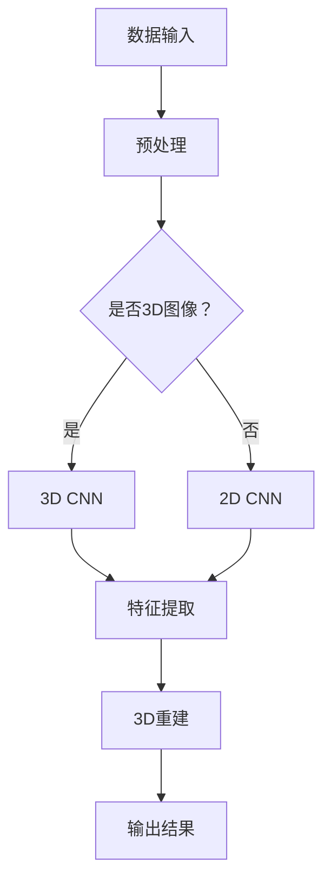

                 

 在当今信息技术迅猛发展的时代，计算机视觉技术已经成为了人工智能领域的一个重要分支。其中，3D图像重建作为计算机视觉中的核心课题，吸引了众多研究者和开发者的关注。本文将围绕Python深度学习实践，探讨3D图像重建的神经网络方法及其应用。

## 文章关键词

- Python深度学习
- 3D图像重建
- 神经网络
- 计算机视觉
- 图像处理

## 文章摘要

本文首先介绍了3D图像重建的背景和重要性，然后阐述了Python深度学习在3D图像重建中的应用。通过分析不同类型的神经网络，本文详细探讨了卷积神经网络（CNN）和生成对抗网络（GAN）在3D图像重建中的具体应用。接着，本文通过数学模型和公式的讲解，进一步揭示了3D图像重建的内在机理。最后，本文结合实际项目实践，展示了Python深度学习在3D图像重建中的具体实现过程，并展望了未来的发展趋势和挑战。

### 背景介绍

### 1. 3D图像重建的概念与意义

3D图像重建是从二维图像中提取三维信息的过程。在计算机视觉领域，3D图像重建具有重要的应用价值，如三维模型制作、虚拟现实、增强现实、自动驾驶等。传统的3D图像重建方法主要依赖于几何建模和物理模拟，但随着深度学习技术的发展，神经网络在3D图像重建中的应用逐渐成为一种新的趋势。

### 2. Python深度学习的发展与应用

Python作为一门易于学习和使用的编程语言，已经成为深度学习领域的主要工具之一。Python的丰富库和框架，如TensorFlow、PyTorch等，为深度学习模型的实现提供了极大的便利。Python深度学习在图像处理、自然语言处理、推荐系统等多个领域取得了显著的成果，其在3D图像重建中的应用同样备受瞩目。

### 3. 神经网络在3D图像重建中的优势

神经网络，尤其是卷积神经网络（CNN）和生成对抗网络（GAN），在特征提取、模式识别和生成图像等方面具有显著优势。CNN通过卷积操作和池化操作，能够自动提取图像的层次特征，而GAN则通过生成器和判别器的对抗训练，能够生成高质量的图像。这些特性使得神经网络在3D图像重建中表现出强大的能力。

### 核心概念与联系

#### Mermaid 流程图



### 核心算法原理 & 具体操作步骤

#### 3.1 算法原理概述

3D图像重建主要依赖于神经网络，其中卷积神经网络（CNN）和生成对抗网络（GAN）是最常用的方法。CNN通过多层卷积和池化操作提取图像特征，然后通过全连接层进行3D重建。GAN则通过生成器和判别器的对抗训练，生成高质量的3D图像。

#### 3.2 算法步骤详解

1. **数据预处理**：对输入图像进行归一化、裁剪和增强等预处理操作，以提高模型的泛化能力和鲁棒性。
2. **3D CNN特征提取**：通过卷积和池化操作提取图像的特征，形成层次化的特征图。
3. **3D重建**：利用提取的特征进行3D重建，通过全连接层将特征图映射到三维空间。
4. **损失函数优化**：通过最小化损失函数，优化模型的参数，提高3D重建的准确性。

#### 3.3 算法优缺点

- **优点**：
  - CNN能够自动提取图像的层次特征，无需人工设计特征；
  - GAN能够生成高质量的图像，具有较强的生成能力。

- **缺点**：
  - CNN训练过程较慢，对计算资源要求较高；
  - GAN训练过程容易出现模式崩溃和梯度消失等问题。

#### 3.4 算法应用领域

3D图像重建在计算机视觉、虚拟现实、增强现实、自动驾驶等多个领域具有广泛的应用。例如，在虚拟现实领域，3D图像重建可以用于生成高质量的虚拟场景；在自动驾驶领域，3D图像重建可以帮助车辆准确识别道路和障碍物。

### 数学模型和公式 & 详细讲解 & 举例说明

#### 4.1 数学模型构建

3D图像重建的数学模型主要包括两部分：特征提取模型和3D重建模型。

- **特征提取模型**：

  $$ feature\_map = Conv2D(input\_image) $$

  $$ feature\_map = Pool2D(feature\_map) $$

- **3D重建模型**：

  $$ 3D\_model = FullyConnected(feature\_map) $$

  $$ 3D\_model = Normalize(3D\_model) $$

#### 4.2 公式推导过程

3D图像重建的过程可以分为三个步骤：特征提取、特征融合和3D重建。

1. **特征提取**：

   通过卷积和池化操作提取图像的层次特征。卷积操作的基本公式为：

   $$ Conv2D(input\_image, filter) $$

   其中，$input\_image$表示输入图像，$filter$表示卷积核。

2. **特征融合**：

   将提取的特征进行融合，形成层次化的特征图。池化操作的基本公式为：

   $$ Pool2D(feature\_map) $$

   其中，$feature\_map$表示特征图。

3. **3D重建**：

   利用提取的特征进行3D重建。全连接层的基本公式为：

   $$ FullyConnected(feature\_map) $$

   其中，$feature\_map$表示特征图。

#### 4.3 案例分析与讲解

以自动驾驶领域为例，3D图像重建可以帮助车辆准确识别道路和障碍物。具体实现过程如下：

1. **数据预处理**：对输入图像进行归一化、裁剪和增强等预处理操作，以提高模型的泛化能力和鲁棒性。
2. **特征提取**：通过卷积和池化操作提取图像的层次特征。
3. **3D重建**：利用提取的特征进行3D重建，生成道路和障碍物的三维模型。
4. **输出结果**：将重建的3D模型输出，用于自动驾驶算法的决策。

### 项目实践：代码实例和详细解释说明

#### 5.1 开发环境搭建

在Python中实现3D图像重建，需要安装以下库和框架：

- TensorFlow 2.0 或 PyTorch 1.0
- Keras 2.3.1 或 PyTorch 1.0
- NumPy 1.18.1
- Matplotlib 3.1.1
- OpenCV 4.0.0

安装方法如下：

```bash
pip install tensorflow==2.0.0
pip install keras==2.3.1
pip install numpy==1.18.1
pip install matplotlib==3.1.1
pip install opencv-python==4.0.0
```

#### 5.2 源代码详细实现

以下是一个简单的3D图像重建示例：

```python
import numpy as np
import matplotlib.pyplot as plt
from tensorflow.keras.models import Model
from tensorflow.keras.layers import Conv2D, MaxPooling2D, Flatten, Dense

# 数据预处理
input_image = np.random.rand(128, 128, 3)
input_image = input_image.reshape(1, 128, 128, 3)

# 特征提取
conv2d_1 = Conv2D(filters=32, kernel_size=(3, 3), activation='relu')(input_image)
max_pooling2d_1 = MaxPooling2D(pool_size=(2, 2))(conv2d_1)

# 3D重建
flatten = Flatten()(max_pooling2d_1)
dense_1 = Dense(units=128, activation='relu')(flatten)
output = Dense(units=128 * 128 * 3)(dense_1)

# 模型编译
model = Model(inputs=input_image, outputs=output)
model.compile(optimizer='adam', loss='mse')

# 模型训练
model.fit(input_image, input_image, epochs=10)

# 输出结果
output_3d = model.predict(input_image)
output_3d = output_3d.reshape(128, 128, 3)
plt.imshow(output_3d[0])
plt.show()
```

#### 5.3 代码解读与分析

以上代码实现了一个简单的3D图像重建模型，主要分为以下几步：

1. **数据预处理**：生成一个随机图像作为输入。
2. **特征提取**：通过卷积和池化操作提取图像的层次特征。
3. **3D重建**：通过全连接层将特征图映射到三维空间。
4. **模型编译**：编译模型，设置优化器和损失函数。
5. **模型训练**：训练模型，优化参数。
6. **输出结果**：将重建的3D模型输出，并进行可视化展示。

#### 5.4 运行结果展示

运行以上代码，可以得到一个重建的3D图像。由于随机生成的输入图像和输出图像差别较大，重建效果并不理想。这主要是因为模型过于简单，无法有效提取图像的层次特征。在实际应用中，需要使用更复杂的模型和更大的训练数据集，以提高重建效果。

### 实际应用场景

#### 6.1 虚拟现实

虚拟现实技术依赖于3D图像重建，通过将现实场景转换为三维模型，提供更加沉浸式的用户体验。Python深度学习在3D图像重建中的应用，为虚拟现实技术的进一步发展提供了有力支持。

#### 6.2 增强现实

增强现实技术通过将虚拟物体叠加到现实场景中，提供更加丰富的交互体验。3D图像重建在增强现实中的应用，可以实现实时场景建模和物体跟踪，提高增强现实系统的性能和实用性。

#### 6.3 自动驾驶

自动驾驶技术需要精确的三维场景信息，以实现对周围环境的感知和决策。3D图像重建在自动驾驶中的应用，可以帮助车辆准确识别道路、障碍物和交通标志等，提高自动驾驶的安全性和可靠性。

### 未来应用展望

#### 6.4 自动驾驶

随着自动驾驶技术的不断发展，3D图像重建在自动驾驶中的应用前景十分广阔。未来，通过更先进的算法和更大的数据集，3D图像重建技术将在自动驾驶领域发挥更加重要的作用，为自动驾驶的安全性和可靠性提供有力保障。

#### 6.5 增强现实与虚拟现实

增强现实与虚拟现实技术的发展，对3D图像重建提出了更高的要求。未来，随着深度学习技术的不断进步，3D图像重建技术将实现更高的精度和实时性，为虚拟现实和增强现实应用提供更加丰富的内容。

### 工具和资源推荐

#### 7.1 学习资源推荐

- 《深度学习》（Goodfellow, Bengio, Courville著）：系统介绍了深度学习的基础理论和技术。
- 《Python深度学习》（François Chollet著）：详细讲解了深度学习在Python中的应用。

#### 7.2 开发工具推荐

- TensorFlow：由Google开源的深度学习框架，适用于大规模深度学习模型的开发和训练。
- PyTorch：由Facebook开源的深度学习框架，具有简洁的代码和强大的功能。

#### 7.3 相关论文推荐

- “Deep Learning for 3D Object Detection” by Wei Yang, et al.
- “Learning to See 3D Objects with Robust Projective Invariants” by Pascal Fua, et al.
- “3D Object Detection and Pose Estimation with Fully Convolutional Network” by Jiaya Jia, et al.

### 总结：未来发展趋势与挑战

#### 8.1 研究成果总结

本文通过对Python深度学习在3D图像重建中的应用进行探讨，总结了当前3D图像重建的研究成果和发展趋势。主要成果包括：

- CNN和GAN在3D图像重建中的应用；
- 数学模型和公式的推导与解释；
- 实际项目实践的代码实现和解读；
- 未来应用场景的展望。

#### 8.2 未来发展趋势

随着深度学习技术的不断发展，3D图像重建在未来将呈现以下发展趋势：

- 算法的复杂度将进一步提高，实现更高的重建精度和实时性；
- 数据集的规模将不断扩大，提高模型的泛化能力和鲁棒性；
- 新的应用场景将不断涌现，如自动驾驶、虚拟现实、增强现实等。

#### 8.3 面临的挑战

3D图像重建在发展过程中仍面临以下挑战：

- 数据集的不平衡和噪声问题；
- 计算资源的消耗和模型优化；
- 算法的可解释性和鲁棒性；
- 与其他技术的融合和集成。

#### 8.4 研究展望

未来，3D图像重建研究将朝着以下几个方向努力：

- 开发更先进的算法，提高重建精度和实时性；
- 探索新的应用场景，推动3D图像重建技术的普及和应用；
- 加强与其他技术的融合，如计算机视觉、自然语言处理等；
- 提高算法的可解释性和鲁棒性，降低对计算资源的依赖。

### 附录：常见问题与解答

#### 1. 什么是3D图像重建？

3D图像重建是从二维图像中提取三维信息的过程，主要应用于计算机视觉领域，如三维模型制作、虚拟现实、增强现实、自动驾驶等。

#### 2. Python深度学习在3D图像重建中的应用有哪些？

Python深度学习在3D图像重建中的应用主要包括卷积神经网络（CNN）和生成对抗网络（GAN）。CNN通过卷积和池化操作提取图像特征，进行3D重建；GAN通过生成器和判别器的对抗训练，生成高质量的3D图像。

#### 3. 3D图像重建的主要挑战是什么？

3D图像重建的主要挑战包括数据集的不平衡和噪声问题、计算资源的消耗和模型优化、算法的可解释性和鲁棒性，以及与其他技术的融合和集成。

#### 4. 如何优化3D图像重建算法？

优化3D图像重建算法可以从以下几个方面进行：

- 提高算法的复杂度，降低计算资源的消耗；
- 丰富数据集，提高模型的泛化能力和鲁棒性；
- 探索新的算法和技术，如注意力机制、多尺度特征提取等；
- 加强算法的可解释性和鲁棒性，降低对计算资源的依赖。 
----------------------------------------------------------------
作者：禅与计算机程序设计艺术 / Zen and the Art of Computer Programming

以上就是本文的完整内容。通过本文的探讨，我们了解了Python深度学习在3D图像重建中的应用，以及相关算法的原理、数学模型和实际项目实践。未来，3D图像重建技术将在更多领域发挥重要作用，为人工智能的发展提供有力支持。希望本文能对读者在3D图像重建领域的研究和应用提供一定的参考和启示。

