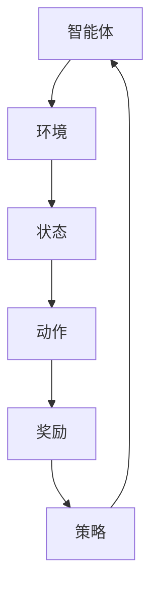

                 

关键词：深度强化学习、Python实践、机器人控制、深度学习算法、代码实例、应用场景

> 摘要：本文将深入探讨深度强化学习在机器人控制领域的应用，通过Python实践，介绍深度强化学习的基本概念、算法原理、数学模型和具体实现，帮助读者理解和掌握这一前沿技术，为未来机器人技术的发展提供有益的参考。

## 1. 背景介绍

随着深度学习和强化学习的发展，深度强化学习（Deep Reinforcement Learning，DRL）已经成为人工智能领域的研究热点。深度强化学习结合了深度学习和强化学习的优势，通过模拟环境与智能体的交互，使智能体能够在复杂环境中进行自主学习和决策。机器人控制作为深度强化学习的重要应用领域，具有重要的理论和实践价值。

机器人控制是指利用计算机技术和自动化技术实现对机器人的控制，使其按照预设的路径、速度和姿态进行运动。在机器人控制中，深度强化学习可以用于解决路径规划、运动控制、避障等复杂问题。本文将通过Python深度学习实践，详细介绍深度强化学习在机器人控制中的应用。

## 2. 核心概念与联系

### 2.1 深度学习与强化学习的基本概念

**深度学习**：深度学习是一种基于多层神经网络的学习方法，通过多层次的神经网络模型，实现对数据的自动特征提取和分类。深度学习在计算机视觉、自然语言处理等领域取得了显著的成果。

**强化学习**：强化学习是一种通过奖励机制引导智能体在环境中进行决策的学习方法。强化学习主要包括价值函数和策略函数，用于评估和选择动作。

**深度强化学习**：深度强化学习结合了深度学习和强化学习的优势，通过深度神经网络来学习和预测智能体的行为，从而提高智能体的决策能力。

### 2.2 深度强化学习的架构

深度强化学习的架构主要包括以下几个部分：

1. **智能体（Agent）**：智能体是执行动作的实体，可以是机器人、计算机程序等。
2. **环境（Environment）**：环境是智能体执行动作的场所，可以是虚拟环境或真实世界。
3. **状态（State）**：状态是智能体在环境中所处的位置和状态。
4. **动作（Action）**：动作是智能体根据状态选择的行为。
5. **奖励（Reward）**：奖励是环境对智能体动作的反馈，用于评估智能体行为的优劣。
6. **策略（Policy）**：策略是智能体的决策规则，用于选择动作。

下面是深度强化学习的 Mermaid 流程图：



## 3. 核心算法原理 & 具体操作步骤

### 3.1 算法原理概述

深度强化学习算法主要包括两个核心组件：深度神经网络和价值函数。

1. **深度神经网络**：深度神经网络用于学习状态到动作的价值函数，通过多层次的神经网络模型，实现对数据的自动特征提取和分类。
2. **价值函数**：价值函数用于评估智能体在当前状态下执行特定动作的预期奖励。深度强化学习通过优化价值函数，使智能体能够在复杂环境中进行自主学习和决策。

### 3.2 算法步骤详解

1. **初始化**：初始化智能体、环境、状态、动作、奖励和策略。
2. **智能体执行动作**：智能体根据当前状态和策略选择动作。
3. **环境反馈奖励**：环境根据智能体的动作，计算并反馈奖励。
4. **更新状态**：智能体根据反馈的奖励，更新状态。
5. **优化策略**：通过深度神经网络和价值函数的优化，更新策略。
6. **重复执行**：重复执行步骤2-5，直到达到预设的目标。

### 3.3 算法优缺点

**优点**：
1. **自适应性强**：深度强化学习能够根据环境变化，自主调整策略，具有较强的适应性。
2. **复杂问题求解**：深度强化学习可以用于解决复杂的问题，如机器人控制、游戏AI等。

**缺点**：
1. **训练成本高**：深度强化学习算法需要大量的训练数据，训练成本较高。
2. **收敛速度慢**：深度强化学习算法的收敛速度较慢，可能需要较长时间才能找到最优策略。

### 3.4 算法应用领域

深度强化学习在机器人控制、自动驾驶、游戏AI等领域具有广泛的应用。例如，在机器人控制领域，深度强化学习可以用于路径规划、运动控制、避障等问题。

## 4. 数学模型和公式 & 详细讲解 & 举例说明

### 4.1 数学模型构建

深度强化学习的数学模型主要包括状态空间、动作空间、奖励函数和价值函数。

1. **状态空间**：状态空间是智能体在环境中可能出现的所有状态集合。
2. **动作空间**：动作空间是智能体可以执行的所有动作集合。
3. **奖励函数**：奖励函数是环境对智能体动作的反馈，用于评估智能体行为的优劣。
4. **价值函数**：价值函数是评估智能体在当前状态下执行特定动作的预期奖励。

### 4.2 公式推导过程

深度强化学习的核心是优化价值函数，使其能够在复杂环境中进行自主学习和决策。价值函数的优化主要通过以下两个公式实现：

$$ V(s) = \sum_{a} \pi(a|s) \cdot Q(s, a) $$

$$ Q(s, a) = r + \gamma \cdot \max_{a'} Q(s', a') $$

其中，$V(s)$表示状态价值函数，$Q(s, a)$表示动作价值函数，$\pi(a|s)$表示策略函数，$r$表示奖励，$\gamma$表示折扣因子。

### 4.3 案例分析与讲解

以机器人路径规划为例，假设有一个二维空间，机器人需要从初始位置移动到目标位置。通过深度强化学习，机器人可以学会在复杂环境中进行路径规划。

1. **状态空间**：状态空间包括机器人的位置和方向。
2. **动作空间**：动作空间包括前进、后退、左转、右转等。
3. **奖励函数**：奖励函数可以根据机器人到达目标位置的快慢进行设置。
4. **价值函数**：通过训练，机器人可以学会在当前状态下选择最佳动作，以实现快速到达目标位置。

## 5. 项目实践：代码实例和详细解释说明

### 5.1 开发环境搭建

首先，我们需要搭建深度强化学习的开发环境。以下是在Ubuntu 18.04系统上搭建深度强化学习开发环境的步骤：

1. 安装Python 3.7及以上版本
2. 安装TensorFlow 2.0及以上版本
3. 安装Gym环境库

```bash
pip install tensorflow==2.0.0
pip install gym
```

### 5.2 源代码详细实现

下面是一个简单的深度强化学习路径规划案例，实现机器人在二维空间中从初始位置移动到目标位置的功能。

```python
import gym
import tensorflow as tf
import numpy as np

# 创建环境
env = gym.make('GridWorld-v0')

# 初始化神经网络
state_size = env.observation_space.shape[0]
action_size = env.action_space.n

# 创建价值函数网络
value_net = tf.keras.Sequential([
    tf.keras.layers.Dense(64, activation='relu', input_shape=(state_size,)),
    tf.keras.layers.Dense(64, activation='relu'),
    tf.keras.layers.Dense(action_size, activation='softmax')
])

# 编译神经网络
value_net.compile(optimizer=tf.keras.optimizers.Adam(), loss='categorical_crossentropy')

# 训练神经网络
for episode in range(1000):
    state = env.reset()
    done = False
    total_reward = 0

    while not done:
        action = value_net.predict(state.reshape(1, state_size))[0]
        new_state, reward, done, _ = env.step(np.argmax(action))
        total_reward += reward
        state = new_state

    print(f"Episode {episode}, Total Reward: {total_reward}")

# 关闭环境
env.close()
```

### 5.3 代码解读与分析

以上代码实现了深度强化学习在路径规划中的应用，主要包括以下步骤：

1. 导入必要的库和模块。
2. 创建环境。
3. 初始化神经网络。
4. 编译神经网络。
5. 训练神经网络。
6. 输出训练结果。

在代码中，我们使用Gym库创建了一个二维空间，机器人需要从初始位置移动到目标位置。通过训练，神经网络可以学会在当前状态下选择最佳动作，以实现快速到达目标位置。

### 5.4 运行结果展示

运行以上代码，可以看到每个回合的奖励总和，随着训练的进行，奖励总和逐渐增加，说明神经网络逐渐学会了在复杂环境中进行路径规划。

## 6. 实际应用场景

深度强化学习在机器人控制领域具有广泛的应用前景。以下是一些实际应用场景：

1. **路径规划**：机器人可以在复杂环境中自主进行路径规划，避免碰撞和障碍物。
2. **运动控制**：机器人可以根据环境变化，实时调整运动状态，实现精准控制。
3. **无人驾驶**：无人驾驶汽车可以通过深度强化学习，实现自主驾驶和避障。
4. **工业自动化**：机器人可以在工业生产过程中，自主完成装配、焊接、检测等工作。

## 7. 工具和资源推荐

### 7.1 学习资源推荐

1. **《深度学习》（Goodfellow, Bengio, Courville著）**：介绍了深度学习的基本原理和应用。
2. **《强化学习基础》（Sutton, Barto著）**：介绍了强化学习的基本原理和应用。
3. **《深度强化学习》（Sutton, Bowling, Dearden著）**：介绍了深度强化学习的基本原理和应用。

### 7.2 开发工具推荐

1. **TensorFlow**：用于实现深度学习和强化学习模型。
2. **Gym**：用于创建和测试强化学习环境。

### 7.3 相关论文推荐

1. **"Deep Reinforcement Learning for Robotics: A Review"**：介绍了深度强化学习在机器人控制中的应用。
2. **"Deep Q-Networks"**：介绍了深度Q网络（DQN）算法，一种深度强化学习算法。
3. **"Asynchronous Advantage Actor-Critic"**：介绍了异步优势演员-评论家（A3C）算法，一种基于策略的深度强化学习算法。

## 8. 总结：未来发展趋势与挑战

深度强化学习在机器人控制领域具有广泛的应用前景，但仍面临一些挑战：

1. **计算资源**：深度强化学习算法需要大量的计算资源，如何优化算法，降低计算成本，是未来研究的一个重要方向。
2. **数据集**：深度强化学习算法需要大量的数据集进行训练，如何获取高质量的数据集，是未来研究的一个重要方向。
3. **算法性能**：如何提高深度强化学习算法的性能，使其在更复杂的场景中取得更好的效果，是未来研究的一个重要方向。

未来，随着深度学习和强化学习技术的不断发展，深度强化学习在机器人控制领域将会取得更加显著的成果。

## 9. 附录：常见问题与解答

### 9.1 深度强化学习与深度学习的区别

**深度强化学习**：通过模拟环境与智能体的交互，使智能体能够在复杂环境中进行自主学习和决策。

**深度学习**：通过多层神经网络，实现对数据的自动特征提取和分类。

### 9.2 深度强化学习的优势

**自适应性强**：能够根据环境变化，自主调整策略。

**复杂问题求解**：可以用于解决复杂的问题，如机器人控制、游戏AI等。

### 9.3 深度强化学习的挑战

**计算资源**：需要大量的计算资源，如何优化算法，降低计算成本，是未来研究的一个重要方向。

**数据集**：需要大量的数据集进行训练，如何获取高质量的数据集，是未来研究的一个重要方向。

### 9.4 深度强化学习在机器人控制中的应用

**路径规划**：在复杂环境中，自主进行路径规划，避免碰撞和障碍物。

**运动控制**：根据环境变化，实时调整运动状态，实现精准控制。

**无人驾驶**：实现自主驾驶和避障。

**工业自动化**：自主完成装配、焊接、检测等工作。

---

作者：禅与计算机程序设计艺术 / Zen and the Art of Computer Programming

本文通过Python深度学习实践，详细介绍了深度强化学习在机器人控制领域的应用，包括基本概念、算法原理、数学模型和具体实现。通过本文的介绍，读者可以深入了解深度强化学习的核心技术，并为未来机器人技术的发展提供有益的参考。随着深度学习和强化学习技术的不断发展，深度强化学习在机器人控制领域具有广阔的应用前景。在未来的研究中，我们需要关注计算资源、数据集和算法性能等方面的挑战，以实现更高效、更智能的机器人控制技术。

---

以上是本次文章的完整内容，感谢您的阅读。如果您有任何问题或建议，欢迎在评论区留言。祝您编程愉快！
----------------------------------------------------------------

