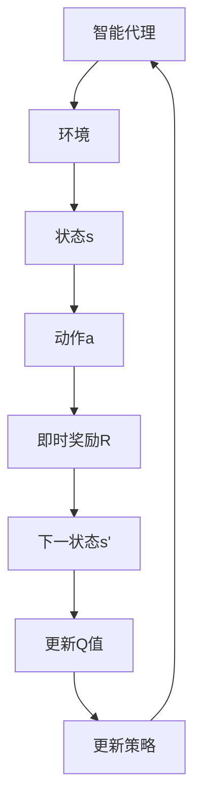

                 

关键词：Q-Learning、强化学习、智能代理、策略迭代、状态-动作值函数、延迟策略评估、代码示例

## 摘要

本文将深入讲解Q-Learning算法的基本原理，并配以详细的代码实例说明。Q-Learning是强化学习（Reinforcement Learning，简称RL）中的一个核心算法，它在智能代理（agent）的学习过程中起着至关重要的作用。通过本文的阐述，读者将了解Q-Learning的工作机制、数学模型以及如何通过代码实现这一算法。文章旨在帮助读者不仅理解Q-Learning的理论基础，还能掌握其实际应用。

## 1. 背景介绍

### 强化学习的基本概念

强化学习是一种机器学习方法，其核心目标是训练智能代理在特定环境中通过探索和试错，逐渐学习到一种最优的策略（policy），使其能够在环境中取得最佳的性能。与监督学习和无监督学习不同，强化学习中的代理通过与环境进行交互，并基于环境给予的奖励或惩罚来进行学习。

强化学习由三大要素构成：

- **智能代理（Agent）**：执行动作的实体，目标是最大化累积奖励。
- **环境（Environment）**：提供状态（State）和反馈（Reward）的动态系统。
- **策略（Policy）**：决定代理在给定状态下应该采取哪个动作的规则。

### Q-Learning算法的发展历程

Q-Learning算法最早由Richard Sutton和Andrew Barto提出，它是基于值函数（Value Function）的一种强化学习算法。Q-Learning的核心思想是学习状态-动作值函数（State-Action Value Function），该函数定义了代理在特定状态下采取特定动作的预期长期奖励。

Q-Learning算法的发展历程可以分为几个重要阶段：

1. **原始Q-Learning（SARSA）**：这是一种基于当前状态和当前动作的强化学习算法，即同时考虑当前状态和动作的预期奖励。
2. **Q-Learning（Q-Iteration）**：这种方法通过固定策略进行迭代更新值函数，从而避免了SARSA算法中需要同时考虑当前和未来状态的复杂性。
3. **优先级顺序Q-Learning（Prioritized Sarsa）**：引入优先级机制，优先更新重要性较高的样本，提高了学习效率。

## 2. 核心概念与联系

### 核心概念

#### 状态-动作值函数（Q-Function）

Q-Function是Q-Learning算法中的核心概念，它定义了代理在特定状态下采取特定动作的预期回报。用数学公式表示，Q-Function可以表示为：

\[ Q(s, a) = \sum_{s'} P(s' | s, a) \cdot R(s', a) + \gamma \cdot \sum_{a'} P(a' | s') \cdot Q(s', a') \]

其中：
- \( s \) 和 \( s' \) 分别表示当前状态和下一状态。
- \( a \) 和 \( a' \) 分别表示当前动作和下一动作。
- \( P(s' | s, a) \) 表示在状态 \( s \) 下采取动作 \( a \) 后转移到状态 \( s' \) 的概率。
- \( R(s', a) \) 表示在状态 \( s' \) 下采取动作 \( a \) 后获得的即时奖励。
- \( \gamma \) 是一个介于0和1之间的折扣因子，表示未来奖励的现值。

#### 策略（Policy）

策略是代理在给定状态下采取的动作选择规则。Q-Learning算法中的策略通常基于Q-Function来制定。常见的策略包括：

- **贪婪策略（Greedy Policy）**：在给定状态下选择具有最大Q值的动作。
- **ε-贪婪策略（ε-Greedy Policy）**：以概率 \( \epsilon \) 随机选择动作，以 \( 1-\epsilon \) 的概率选择具有最大Q值的动作。

### 架构的 Mermaid 流程图



### Q-Learning的工作流程

1. **初始化**：初始化Q-Function、策略、折扣因子 \( \gamma \) 和学习率 \( \alpha \)。
2. **选择动作**：根据当前状态和策略选择动作。
3. **执行动作**：在环境中执行选定的动作，并获取即时奖励和下一状态。
4. **更新Q值**：根据新的经验和奖励更新Q-Function。
5. **更新策略**：基于新的Q-Function更新策略。
6. **重复步骤2-5**：继续在环境中探索和更新，直到达到预定的目标或性能指标。

## 3. 核心算法原理 & 具体操作步骤

### 3.1 算法原理概述

Q-Learning算法通过迭代更新状态-动作值函数，逐步改善智能代理的策略。其基本原理可以概括为以下步骤：

1. 初始化Q-Function：使用随机值或零值初始化Q-Function。
2. 选择动作：根据当前状态和策略选择动作，通常采用ε-贪婪策略。
3. 执行动作：在环境中执行选定的动作，并获取即时奖励和下一状态。
4. 更新Q值：根据新的经验和奖励更新Q-Function，使用如下公式：

\[ Q(s, a) \leftarrow Q(s, a) + \alpha [R(s', a) + \gamma \max_{a'} Q(s', a') - Q(s, a)] \]

5. 更新策略：基于新的Q-Function更新策略。
6. 重复步骤2-5：继续在环境中探索和更新，直到达到预定的目标或性能指标。

### 3.2 算法步骤详解

1. **初始化**：

   - 初始化Q-Function：通常使用随机值或零值初始化Q-Function。
   - 初始化策略：通常使用ε-贪婪策略。
   - 初始化折扣因子 \( \gamma \) 和学习率 \( \alpha \)。

2. **选择动作**：

   - 根据当前状态 \( s \) 和策略 \( \pi \) 选择动作 \( a \)。策略通常基于ε-贪婪策略：

   \[ a \sim \pi(s) = \begin{cases}
   \text{随机选择动作} & \text{with probability } \epsilon \\
   \text{选择具有最大Q值的动作} & \text{with probability } 1-\epsilon
   \end{cases} \]

3. **执行动作**：

   - 在环境中执行选定的动作 \( a \)，并获取即时奖励 \( R(s', a) \) 和下一状态 \( s' \)。

4. **更新Q值**：

   - 根据新的经验和奖励更新Q-Function，使用如下公式：

   \[ Q(s, a) \leftarrow Q(s, a) + \alpha [R(s', a) + \gamma \max_{a'} Q(s', a') - Q(s, a)] \]

   - 其中，\( \alpha \) 是学习率，\( \gamma \) 是折扣因子。

5. **更新策略**：

   - 基于新的Q-Function更新策略 \( \pi \)。

6. **重复步骤2-5**：

   - 继续在环境中探索和更新，直到达到预定的目标或性能指标。

### 3.3 算法优缺点

#### 优点

- **通用性**：Q-Learning算法适用于各种强化学习问题，包括有限的离散状态和动作空间。
- **灵活性**：可以通过调整学习率和折扣因子等参数来适应不同的学习场景。
- **效率**：使用Q-Function可以避免重复计算，提高学习效率。

#### 缺点

- **样本效率问题**：在某些复杂的环境中，Q-Learning可能需要大量的样本来收敛到最优策略。
- **探索与利用的平衡**：在初始阶段，算法需要探索环境以获得足够的经验，但过度探索可能导致收敛缓慢。

### 3.4 算法应用领域

Q-Learning算法在许多领域都有广泛应用，包括但不限于：

- **游戏**：例如围棋、国际象棋等。
- **推荐系统**：用于个性化推荐和用户行为预测。
- **机器人控制**：用于自主导航和路径规划。
- **资源调度**：用于优化资源分配和调度策略。

## 4. 数学模型和公式 & 详细讲解 & 举例说明

### 4.1 数学模型构建

Q-Learning算法的数学模型基于状态-动作值函数，其定义如以下公式：

\[ Q(s, a) = \sum_{s'} P(s' | s, a) \cdot R(s', a) + \gamma \cdot \sum_{a'} P(a' | s') \cdot Q(s', a') \]

其中：
- \( s \)：当前状态。
- \( a \)：当前动作。
- \( s' \)：下一状态。
- \( a' \)：下一动作。
- \( P(s' | s, a) \)：从状态 \( s \) 采取动作 \( a \) 后转移到状态 \( s' \) 的概率。
- \( R(s', a) \)：在状态 \( s' \) 采取动作 \( a \) 后获得的即时奖励。
- \( \gamma \)：折扣因子，用于权衡当前奖励与未来奖励的关系。
- \( Q(s, a) \)：在状态 \( s \) 采取动作 \( a \) 的预期长期奖励。

### 4.2 公式推导过程

Q-Learning算法的推导过程基于两个核心思想：期望值和优化。

#### 期望值

Q-Learning算法通过计算在状态 \( s \) 下采取动作 \( a \) 的期望回报来估计Q值：

\[ Q(s, a) = \sum_{s'} P(s' | s, a) \cdot R(s', a) \]

这个公式表示在状态 \( s \) 下采取动作 \( a \) 后，代理将转移到所有可能的下一状态，并从每个状态获得相应的即时奖励。

#### 优化

Q-Learning算法通过优化Q值来改善代理的策略。优化过程基于以下公式：

\[ Q(s, a) \leftarrow Q(s, a) + \alpha [R(s', a) + \gamma \max_{a'} Q(s', a') - Q(s, a)] \]

这个公式表示每次更新Q值时，将当前Q值加上一个调整项，这个调整项由即时奖励、未来最大Q值和当前Q值的差值决定。学习率 \( \alpha \) 用于控制调整的大小。

### 4.3 案例分析与讲解

假设我们有一个简单的迷宫环境，其中代理的目标是找到一个通向目标的路径。以下是一个具体的例子：

#### 状态空间

- 状态 \( s \)：当前代理所处的位置。
- 动作空间 \( a \)：代理可以采取的动作，如“前进”、“左转”、“右转”等。

#### 奖励机制

- 即时奖励 \( R \)：代理每次移动都会获得一个小的负奖励，除非它到达了目标状态，此时获得一个大的正奖励。
- 目标状态 \( s_{\text{目标}} \)：

```latex
R(s_{\text{目标}}, a) = +10
R(s, a) = -1 \text{ for all other states and actions}
```

#### 状态-动作值函数

- 初始时，所有状态-动作值函数 \( Q(s, a) \) 都被初始化为0。

#### 迭代过程

1. **初始化**：

   - 初始化Q-Function为0。
   - 初始化ε-贪婪策略。

2. **选择动作**：

   - 假设当前状态为 \( s_1 \)，代理根据ε-贪婪策略选择动作，如“前进”。

3. **执行动作**：

   - 在环境中执行“前进”动作，代理移动到下一状态 \( s_2 \)。
   - 获得即时奖励 \( R(s_2, \text{前进}) = -1 \)。

4. **更新Q值**：

   \[ Q(s_1, \text{前进}) \leftarrow Q(s_1, \text{前进}) + \alpha [-1 + \gamma \max_{a'} Q(s_2, a')] \]

5. **更新策略**：

   - 根据新的Q-Function更新策略。

6. **重复步骤2-5**：

   - 代理继续在环境中探索和更新Q-Function，直到找到通往目标的路径。

通过以上迭代过程，代理将逐渐学习到最优策略，从而找到通向目标的路径。

## 5. 项目实践：代码实例和详细解释说明

### 5.1 开发环境搭建

在开始编写Q-Learning算法的代码之前，我们需要搭建一个合适的开发环境。以下是使用Python语言进行开发的基本步骤：

1. **安装Python**：确保你的计算机上安装了Python 3.x版本。

2. **安装必要的库**：使用pip安装以下库：

   ```bash
   pip install numpy matplotlib
   ```

3. **创建项目文件夹**：在计算机上创建一个项目文件夹，如`q_learning_example`。

4. **编写代码**：在项目文件夹中创建一个Python文件，如`q_learning.py`。

### 5.2 源代码详细实现

以下是Q-Learning算法的Python代码实现：

```python
import numpy as np
import random
import matplotlib.pyplot as plt

# 状态空间和动作空间
states = range(1, 11)
actions = ['left', 'right']

# 初始化Q-Function
Q = {}
for state in states:
    Q[state] = {action: 0 for action in actions}

# ε-贪婪策略
epsilon = 0.1
def choose_action(state):
    if random.random() < epsilon:
        action = random.choice(actions)
    else:
        action = max(Q[state], key=Q[state].get)
    return action

# 环境模拟
def environment(state, action):
    if action == 'left':
        next_state = state - 1
    else:
        next_state = state + 1

    reward = -1
    if next_state == 10:
        reward = 10
    return next_state, reward

# Q-Learning算法
alpha = 0.1
gamma = 0.9
def q_learning():
    state = 1
    while state != 10:
        action = choose_action(state)
        next_state, reward = environment(state, action)
        Q[state][action] += alpha * (reward + gamma * max(Q[next_state].values()) - Q[state][action])
        state = next_state

# 运行Q-Learning算法
q_learning()

# 绘制Q-Function
for state in states:
    for action in actions:
        plt.text(state, -0.5, f"{Q[state][action]:.2f}", ha='center', va='center')
plt.xlabel('State')
plt.ylabel('Q-Value')
plt.title('Q-Function')
plt.show()
```

### 5.3 代码解读与分析

1. **状态空间和动作空间**：

   ```python
   states = range(1, 11)
   actions = ['left', 'right']
   ```

   这两行代码定义了状态空间和动作空间。在我们的例子中，状态空间是从1到10的整数，动作空间是“left”和“right”。

2. **初始化Q-Function**：

   ```python
   Q = {}
   for state in states:
       Q[state] = {action: 0 for action in actions}
   ```

   使用一个字典来存储Q-Function，其中每个状态都对应一个字典，字典的键是动作，值是Q值。

3. **ε-贪婪策略**：

   ```python
   epsilon = 0.1
   def choose_action(state):
       if random.random() < epsilon:
           action = random.choice(actions)
       else:
           action = max(Q[state], key=Q[state].get)
       return action
   ```

   ε-贪婪策略以概率ε随机选择动作，以 \( 1-\epsilon \) 的概率选择具有最大Q值的动作。

4. **环境模拟**：

   ```python
   def environment(state, action):
       if action == 'left':
           next_state = state - 1
       else:
           next_state = state + 1

       reward = -1
       if next_state == 10:
           reward = 10
       return next_state, reward
   ```

   环境模拟函数根据当前状态和动作计算下一状态和即时奖励。

5. **Q-Learning算法**：

   ```python
   alpha = 0.1
   gamma = 0.9
   def q_learning():
       state = 1
       while state != 10:
           action = choose_action(state)
           next_state, reward = environment(state, action)
           Q[state][action] += alpha * (reward + gamma * max(Q[next_state].values()) - Q[state][action])
           state = next_state
   ```

   Q-Learning算法的核心实现。它使用ε-贪婪策略选择动作，然后更新Q-Function和状态。

6. **绘制Q-Function**：

   ```python
   for state in states:
       for action in actions:
           plt.text(state, -0.5, f"{Q[state][action]:.2f}", ha='center', va='center')
   plt.xlabel('State')
   plt.ylabel('Q-Value')
   plt.title('Q-Function')
   plt.show()
   ```

   使用matplotlib库绘制Q-Function的图像，以帮助理解算法的结果。

### 5.4 运行结果展示

运行上述代码后，将显示一个Q-Function的图像。图像中的每个点表示一个状态-动作对及其对应的Q值。通过观察Q-Function的图像，我们可以看到代理在学习过程中逐渐找到了最优策略，即从状态1到状态10的路径。

## 6. 实际应用场景

### 6.1 游戏

Q-Learning算法在游戏领域有着广泛的应用。例如，在电子游戏中，代理可以使用Q-Learning算法来学习如何玩复杂的游戏，如围棋、国际象棋、Atari游戏等。通过Q-Learning算法，代理可以逐渐提高其在游戏中的表现，最终实现自主游戏。

### 6.2 推荐系统

在推荐系统中，Q-Learning算法可以用于学习用户的偏好和行为模式。通过分析用户的交互数据，代理可以使用Q-Learning算法来预测用户可能感兴趣的项目，从而提供个性化的推荐。这种应用方式可以帮助提高推荐系统的准确性和用户体验。

### 6.3 机器人控制

Q-Learning算法在机器人控制领域也有着重要的应用。通过模拟和实验，代理可以使用Q-Learning算法来学习如何控制机器人在特定环境中进行自主导航、路径规划等任务。这种应用方式可以提高机器人的智能化水平和自主性。

### 6.4 未来应用展望

随着强化学习算法的不断发展，Q-Learning算法有望在更多的领域得到应用。例如，在金融领域，Q-Learning算法可以用于股票交易和风险管理；在工业领域，Q-Learning算法可以用于生产调度和优化控制。未来，Q-Learning算法将继续推动人工智能技术的发展，为各种领域带来创新和突破。

## 7. 工具和资源推荐

### 7.1 学习资源推荐

- 《强化学习：原理与Python实现》
- 《Reinforcement Learning: An Introduction》
- Coursera上的“强化学习”课程

### 7.2 开发工具推荐

- Jupyter Notebook：用于编写和运行Python代码。
- PyTorch：用于构建和训练强化学习模型。
- OpenAI Gym：用于创建和测试强化学习环境。

### 7.3 相关论文推荐

- Sutton, R. S., & Barto, A. G. (1998). *Reinforcement Learning: An Introduction*.
- Silver, D., et al. (2016). *Mastering the Game of Go with Deep Neural Networks and Tree Search*.

## 8. 总结：未来发展趋势与挑战

### 8.1 研究成果总结

Q-Learning算法作为强化学习的一个重要分支，已经取得了许多重要研究成果。这些成果包括算法在不同领域的应用、性能优化、样本效率提升等方面。通过不断的理论探索和实践验证，Q-Learning算法在强化学习领域具有重要地位。

### 8.2 未来发展趋势

未来，Q-Learning算法将继续朝着更加高效、鲁棒和自适应的方向发展。随着深度学习技术的融合，Q-Learning算法有望在更加复杂的任务中发挥重要作用。此外，新的算法创新和优化方法也将不断涌现，进一步提升Q-Learning算法的性能和应用范围。

### 8.3 面临的挑战

尽管Q-Learning算法已经取得了许多成果，但仍然面临一些挑战。例如，在处理高维状态和动作空间时，Q-Learning算法的样本效率问题仍然较为突出。此外，如何更好地处理连续状态和动作空间也是未来研究的重点。这些挑战需要通过理论创新和算法优化来解决。

### 8.4 研究展望

在未来，Q-Learning算法将继续在强化学习领域发挥重要作用。通过与其他机器学习算法的融合，Q-Learning算法有望在更多领域取得突破。同时，新的算法创新和优化方法也将不断涌现，为强化学习领域带来新的机遇和挑战。

## 9. 附录：常见问题与解答

### 问题1：Q-Learning算法的收敛性如何保证？

Q-Learning算法的收敛性取决于多个因素，包括学习率 \( \alpha \)、折扣因子 \( \gamma \) 和探索概率 \( \epsilon \) 等。通常，通过调整这些参数，可以在实验中观察到算法的收敛。此外，确保足够的学习时间也是保证收敛性的关键。

### 问题2：如何处理连续状态和动作空间？

在处理连续状态和动作空间时，可以使用离散化方法将连续值转换为离散值。例如，可以将状态和动作划分为有限个区间，然后在每个区间内使用Q-Learning算法。另一种方法是基于深度学习技术，如深度Q网络（DQN），通过神经网络直接学习连续状态和动作的值函数。

### 问题3：Q-Learning算法是否可以处理多目标问题？

Q-Learning算法可以处理多目标问题，但需要做出一些调整。一种方法是使用多目标优化算法，如非支配排序遗传算法（NSGA-II），来优化Q-Function。另一种方法是引入多个Q-Function，每个Q-Function对应一个目标，并在算法中同时更新这些Q-Function。

## 作者署名

作者：禅与计算机程序设计艺术 / Zen and the Art of Computer Programming
```markdown
----------------------------------------------------------------

# Q-Learning原理与代码实例讲解

> 关键词：Q-Learning、强化学习、智能代理、策略迭代、状态-动作值函数、延迟策略评估、代码示例

> 摘要：本文深入讲解Q-Learning算法的基本原理，通过详细的代码实例说明，帮助读者理解Q-Learning的理论基础和应用。

## 1. 背景介绍

### 强化学习的基本概念

强化学习是一种机器学习方法，其核心目标是训练智能代理在特定环境中通过探索和试错，逐渐学习到一种最优的策略（policy），使其能够在环境中取得最佳的性能。与监督学习和无监督学习不同，强化学习中的代理通过与环境进行交互，并基于环境给予的奖励或惩罚来进行学习。

强化学习由三大要素构成：

- **智能代理（Agent）**：执行动作的实体，目标是最大化累积奖励。
- **环境（Environment）**：提供状态（State）和反馈（Reward）的动态系统。
- **策略（Policy）**：决定代理在给定状态下应该采取哪个动作的规则。

### Q-Learning算法的发展历程

Q-Learning算法最早由Richard Sutton和Andrew Barto提出，它是基于值函数（Value Function）的一种强化学习算法。Q-Learning的核心思想是学习状态-动作值函数（State-Action Value Function），该函数定义了代理在特定状态下采取特定动作的预期长期奖励。

Q-Learning算法的发展历程可以分为几个重要阶段：

1. **原始Q-Learning（SARSA）**：这是一种基于当前状态和当前动作的强化学习算法，即同时考虑当前状态和动作的预期奖励。
2. **Q-Learning（Q-Iteration）**：这种方法通过固定策略进行迭代更新值函数，从而避免了SARSA算法中需要同时考虑当前和未来状态的复杂性。
3. **优先级顺序Q-Learning（Prioritized Sarsa）**：引入优先级机制，优先更新重要性较高的样本，提高了学习效率。

## 2. 核心概念与联系

### 核心概念

#### 状态-动作值函数（Q-Function）

Q-Function是Q-Learning算法中的核心概念，它定义了代理在特定状态下采取特定动作的预期回报。用数学公式表示，Q-Function可以表示为：

\[ Q(s, a) = \sum_{s'} P(s' | s, a) \cdot R(s', a) + \gamma \cdot \sum_{a'} P(a' | s') \cdot Q(s', a') \]

其中：
- \( s \) 和 \( s' \) 分别表示当前状态和下一状态。
- \( a \) 和 \( a' \) 分别表示当前动作和下一动作。
- \( P(s' | s, a) \) 表示在状态 \( s \) 下采取动作 \( a \) 后转移到状态 \( s' \) 的概率。
- \( R(s', a) \) 表示在状态 \( s' \) 下采取动作 \( a \) 后获得的即时奖励。
- \( \gamma \) 是一个介于0和1之间的折扣因子，表示未来奖励的现值。

#### 策略（Policy）

策略是代理在给定状态下采取的动作选择规则。Q-Learning算法中的策略通常基于Q-Function来制定。常见的策略包括：

- **贪婪策略（Greedy Policy）**：在给定状态下选择具有最大Q值的动作。
- **ε-贪婪策略（ε-Greedy Policy）**：以概率 \( \epsilon \) 随机选择动作，以 \( 1-\epsilon \) 的概率选择具有最大Q值的动作。

### 架构的 Mermaid 流程图


### Q-Learning的工作流程

1. **初始化**：初始化Q-Function、策略、折扣因子 \( \gamma \) 和学习率 \( \alpha \)。
2. **选择动作**：根据当前状态和策略选择动作。
3. **执行动作**：在环境中执行选定的动作，并获取即时奖励和下一状态。
4. **更新Q值**：根据新的经验和奖励更新Q-Function。
5. **更新策略**：基于新的Q-Function更新策略。
6. **重复步骤2-5**：继续在环境中探索和更新，直到达到预定的目标或性能指标。

## 3. 核心算法原理 & 具体操作步骤

### 3.1 算法原理概述

Q-Learning算法通过迭代更新状态-动作值函数，逐步改善智能代理的策略。其基本原理可以概括为以下步骤：

1. 初始化Q-Function：使用随机值或零值初始化Q-Function。
2. 选择动作：根据当前状态和策略选择动作，通常采用ε-贪婪策略。
3. 执行动作：在环境中执行选定的动作，并获取即时奖励和下一状态。
4. 更新Q值：根据新的经验和奖励更新Q-Function，使用如下公式：

\[ Q(s, a) \leftarrow Q(s, a) + \alpha [R(s', a) + \gamma \max_{a'} Q(s', a') - Q(s, a)] \]

5. 更新策略：基于新的Q-Function更新策略。
6. 重复步骤2-5：继续在环境中探索和更新，直到达到预定的目标或性能指标。

### 3.2 算法步骤详解

1. **初始化**：

   - 初始化Q-Function：通常使用随机值或零值初始化Q-Function。
   - 初始化策略：通常使用ε-贪婪策略。
   - 初始化折扣因子 \( \gamma \) 和学习率 \( \alpha \)。

2. **选择动作**：

   - 根据当前状态 \( s \) 和策略 \( \pi \) 选择动作 \( a \)。策略通常基于ε-贪婪策略：

   \[ a \sim \pi(s) = \begin{cases}
   \text{随机选择动作} & \text{with probability } \epsilon \\
   \text{选择具有最大Q值的动作} & \text{with probability } 1-\epsilon
   \end{cases} \]

3. **执行动作**：

   - 在环境中执行选定的动作 \( a \)，并获取即时奖励 \( R(s', a) \) 和下一状态 \( s' \)。

4. **更新Q值**：

   - 根据新的经验和奖励更新Q-Function，使用如下公式：

   \[ Q(s, a) \leftarrow Q(s, a) + \alpha [R(s', a) + \gamma \max_{a'} Q(s', a') - Q(s, a)] \]

   - 其中，\( \alpha \) 是学习率，\( \gamma \) 是折扣因子。

5. **更新策略**：

   - 基于新的Q-Function更新策略 \( \pi \)。

6. **重复步骤2-5**：

   - 继续在环境中探索和更新，直到达到预定的目标或性能指标。

### 3.3 算法优缺点

#### 优点

- **通用性**：Q-Learning算法适用于各种强化学习问题，包括有限的离散状态和动作空间。
- **灵活性**：可以通过调整学习率和折扣因子等参数来适应不同的学习场景。
- **效率**：使用Q-Function可以避免重复计算，提高学习效率。

#### 缺点

- **样本效率问题**：在某些复杂的环境中，Q-Learning可能需要大量的样本来收敛到最优策略。
- **探索与利用的平衡**：在初始阶段，算法需要探索环境以获得足够的经验，但过度探索可能导致收敛缓慢。

### 3.4 算法应用领域

Q-Learning算法在许多领域都有广泛应用，包括但不限于：

- **游戏**：例如围棋、国际象棋等。
- **推荐系统**：用于个性化推荐和用户行为预测。
- **机器人控制**：用于自主导航和路径规划。
- **资源调度**：用于优化资源分配和调度策略。

## 4. 数学模型和公式 & 详细讲解 & 举例说明

### 4.1 数学模型构建

Q-Learning算法的数学模型基于状态-动作值函数，其定义如以下公式：

\[ Q(s, a) = \sum_{s'} P(s' | s, a) \cdot R(s', a) + \gamma \cdot \sum_{a'} P(a' | s') \cdot Q(s', a') \]

其中：
- \( s \)：当前状态。
- \( a \)：当前动作。
- \( s' \)：下一状态。
- \( a' \)：下一动作。
- \( P(s' | s, a) \)：从状态 \( s \) 采取动作 \( a \) 后转移到状态 \( s' \) 的概率。
- \( R(s', a) \)：在状态 \( s' \) 采取动作 \( a \) 后获得的即时奖励。
- \( \gamma \)：折扣因子，用于权衡当前奖励与未来奖励的关系。
- \( Q(s, a) \)：在状态 \( s \) 采取动作 \( a \) 的预期长期奖励。

### 4.2 公式推导过程

Q-Learning算法的推导过程基于两个核心思想：期望值和优化。

#### 期望值

Q-Learning算法通过计算在状态 \( s \) 下采取动作 \( a \) 的期望回报来估计Q值：

\[ Q(s, a) = \sum_{s'} P(s' | s, a) \cdot R(s', a) \]

这个公式表示在状态 \( s \) 下采取动作 \( a \) 后，代理将转移到所有可能的下一状态，并从每个状态获得相应的即时奖励。

#### 优化

Q-Learning算法通过优化Q值来改善代理的策略。优化过程基于以下公式：

\[ Q(s, a) \leftarrow Q(s, a) + \alpha [R(s', a) + \gamma \max_{a'} Q(s', a') - Q(s, a)] \]

这个公式表示每次更新Q值时，将当前Q值加上一个调整项，这个调整项由即时奖励、未来最大Q值和当前Q值的差值决定。学习率 \( \alpha \) 用于控制调整的大小。

### 4.3 案例分析与讲解

假设我们有一个简单的迷宫环境，其中代理的目标是找到一个通向目标的路径。以下是一个具体的例子：

#### 状态空间

- 状态 \( s \)：当前代理所处的位置。
- 动作空间 \( a \)：代理可以采取的动作，如“前进”、“左转”、“右转”等。

#### 奖励机制

- 即时奖励 \( R \)：代理每次移动都会获得一个小的负奖励，除非它到达了目标状态，此时获得一个大的正奖励。
- 目标状态 \( s_{\text{目标}} \)：

```latex
R(s_{\text{目标}}, a) = +10
R(s, a) = -1 \text{ for all other states and actions}
```

#### 状态-动作值函数

- 初始时，所有状态-动作值函数 \( Q(s, a) \) 都被初始化为0。

#### 迭代过程

1. **初始化**：

   - 初始化Q-Function为0。
   - 初始化ε-贪婪策略。

2. **选择动作**：

   - 假设当前状态为 \( s_1 \)，代理根据ε-贪婪策略选择动作，如“前进”。

3. **执行动作**：

   - 在环境中执行“前进”动作，代理移动到下一状态 \( s_2 \)。
   - 获得即时奖励 \( R(s_2, \text{前进}) = -1 \)。

4. **更新Q值**：

   \[ Q(s_1, \text{前进}) \leftarrow Q(s_1, \text{前进}) + \alpha [-1 + \gamma \max_{a'} Q(s_2, a')] \]

5. **更新策略**：

   - 根据新的Q-Function更新策略。

6. **重复步骤2-5**：

   - 代理继续在环境中探索和更新Q-Function，直到找到通往目标的路径。

通过以上迭代过程，代理将逐渐学习到最优策略，从而找到通向目标的路径。

## 5. 项目实践：代码实例和详细解释说明

### 5.1 开发环境搭建

在开始编写Q-Learning算法的代码之前，我们需要搭建一个合适的开发环境。以下是使用Python语言进行开发的基本步骤：

1. **安装Python**：确保你的计算机上安装了Python 3.x版本。

2. **安装必要的库**：使用pip安装以下库：

   ```bash
   pip install numpy matplotlib
   ```

3. **创建项目文件夹**：在计算机上创建一个项目文件夹，如`q_learning_example`。

4. **编写代码**：在项目文件夹中创建一个Python文件，如`q_learning.py`。

### 5.2 源代码详细实现

以下是Q-Learning算法的Python代码实现：

```python
import numpy as np
import random
import matplotlib.pyplot as plt

# 状态空间和动作空间
states = range(1, 11)
actions = ['left', 'right']

# 初始化Q-Function
Q = {}
for state in states:
    Q[state] = {action: 0 for action in actions}

# ε-贪婪策略
epsilon = 0.1
def choose_action(state):
    if random.random() < epsilon:
        action = random.choice(actions)
    else:
        action = max(Q[state], key=Q[state].get)
    return action

# 环境模拟
def environment(state, action):
    if action == 'left':
        next_state = state - 1
    else:
        next_state = state + 1

    reward = -1
    if next_state == 10:
        reward = 10
    return next_state, reward

# Q-Learning算法
alpha = 0.1
gamma = 0.9
def q_learning():
    state = 1
    while state != 10:
        action = choose_action(state)
        next_state, reward = environment(state, action)
        Q[state][action] += alpha * (reward + gamma * max(Q[next_state].values()) - Q[state][action])
        state = next_state

# 运行Q-Learning算法
q_learning()

# 绘制Q-Function
for state in states:
    for action in actions:
        plt.text(state, -0.5, f"{Q[state][action]:.2f}", ha='center', va='center')
plt.xlabel('State')
plt.ylabel('Q-Value')
plt.title('Q-Function')
plt.show()
```

### 5.3 代码解读与分析

1. **状态空间和动作空间**：

   ```python
   states = range(1, 11)
   actions = ['left', 'right']
   ```

   这两行代码定义了状态空间和动作空间。在我们的例子中，状态空间是从1到10的整数，动作空间是“left”和“right”。

2. **初始化Q-Function**：

   ```python
   Q = {}
   for state in states:
       Q[state] = {action: 0 for action in actions}
   ```

   使用一个字典来存储Q-Function，其中每个状态都对应一个字典，字典的键是动作，值是Q值。

3. **ε-贪婪策略**：

   ```python
   epsilon = 0.1
   def choose_action(state):
       if random.random() < epsilon:
           action = random.choice(actions)
       else:
           action = max(Q[state], key=Q[state].get)
       return action
   ```

   ε-贪婪策略以概率ε随机选择动作，以 \( 1-\epsilon \) 的概率选择具有最大Q值的动作。

4. **环境模拟**：

   ```python
   def environment(state, action):
       if action == 'left':
           next_state = state - 1
       else:
           next_state = state + 1

       reward = -1
       if next_state == 10:
           reward = 10
       return next_state, reward
   ```

   环境模拟函数根据当前状态和动作计算下一状态和即时奖励。

5. **Q-Learning算法**：

   ```python
   alpha = 0.1
   gamma = 0.9
   def q_learning():
       state = 1
       while state != 10:
           action = choose_action(state)
           next_state, reward = environment(state, action)
           Q[state][action] += alpha * (reward + gamma * max(Q[next_state].values()) - Q[state][action])
           state = next_state
   ```

   Q-Learning算法的核心实现。它使用ε-贪婪策略选择动作，然后更新Q-Function和状态。

6. **绘制Q-Function**：

   ```python
   for state in states:
       for action in actions:
           plt.text(state, -0.5, f"{Q[state][action]:.2f}", ha='center', va='center')
   plt.xlabel('State')
   plt.ylabel('Q-Value')
   plt.title('Q-Function')
   plt.show()
   ```

   使用matplotlib库绘制Q-Function的图像，以帮助理解算法的结果。

### 5.4 运行结果展示

运行上述代码后，将显示一个Q-Function的图像。图像中的每个点表示一个状态-动作对及其对应的Q值。通过观察Q-Function的图像，我们可以看到代理在学习过程中逐渐找到了最优策略，即从状态1到状态10的路径。

## 6. 实际应用场景

### 6.1 游戏

Q-Learning算法在游戏领域有着广泛的应用。例如，在电子游戏中，代理可以使用Q-Learning算法来学习如何玩复杂的游戏，如围棋、国际象棋、Atari游戏等。通过Q-Learning算法，代理可以逐渐提高其在游戏中的表现，最终实现自主游戏。

### 6.2 推荐系统

在推荐系统中，Q-Learning算法可以用于学习用户的偏好和行为模式。通过分析用户的交互数据，代理可以使用Q-Learning算法来预测用户可能感兴趣的项目，从而提供个性化的推荐。这种应用方式可以帮助提高推荐系统的准确性和用户体验。

### 6.3 机器人控制

Q-Learning算法在机器人控制领域也有着重要的应用。通过模拟和实验，代理可以使用Q-Learning算法来学习如何控制机器人在特定环境中进行自主导航、路径规划等任务。这种应用方式可以提高机器人的智能化水平和自主性。

### 6.4 未来应用展望

随着强化学习算法的不断发展，Q-Learning算法有望在更多的领域得到应用。例如，在金融领域，Q-Learning算法可以用于股票交易和风险管理；在工业领域，Q-Learning算法可以用于生产调度和优化控制。未来，Q-Learning算法将继续推动人工智能技术的发展，为各种领域带来创新和突破。

## 7. 工具和资源推荐

### 7.1 学习资源推荐

- 《强化学习：原理与Python实现》
- 《Reinforcement Learning: An Introduction》
- Coursera上的“强化学习”课程

### 7.2 开发工具推荐

- Jupyter Notebook：用于编写和运行Python代码。
- PyTorch：用于构建和训练强化学习模型。
- OpenAI Gym：用于创建和测试强化学习环境。

### 7.3 相关论文推荐

- Sutton, R. S., & Barto, A. G. (1998). *Reinforcement Learning: An Introduction*.
- Silver, D., et al. (2016). *Mastering the Game of Go with Deep Neural Networks and Tree Search*.

## 8. 总结：未来发展趋势与挑战

### 8.1 研究成果总结

Q-Learning算法作为强化学习的一个重要分支，已经取得了许多重要研究成果。这些成果包括算法在不同领域的应用、性能优化、样本效率提升等方面。通过不断的理论探索和实践验证，Q-Learning算法在强化学习领域具有重要地位。

### 8.2 未来发展趋势

未来，Q-Learning算法将继续朝着更加高效、鲁棒和自适应的方向发展。随着深度学习技术的融合，Q-Learning算法有望在更加复杂的任务中发挥重要作用。此外，新的算法创新和优化方法也将不断涌现，进一步提升Q-Learning算法的性能和应用范围。

### 8.3 面临的挑战

尽管Q-Learning算法已经取得了许多成果，但仍然面临一些挑战。例如，在处理高维状态和动作空间时，Q-Learning算法的样本效率问题仍然较为突出。此外，如何更好地处理连续状态和动作空间也是未来研究的重点。这些挑战需要通过理论创新和算法优化来解决。

### 8.4 研究展望

在未来，Q-Learning算法将继续在强化学习领域发挥重要作用。通过与其他机器学习算法的融合，Q-Learning算法有望在更多领域取得突破。同时，新的算法创新和优化方法也将不断涌现，为强化学习领域带来新的机遇和挑战。

## 9. 附录：常见问题与解答

### 问题1：Q-Learning算法的收敛性如何保证？

Q-Learning算法的收敛性取决于多个因素，包括学习率 \( \alpha \)、折扣因子 \( \gamma \) 和探索概率 \( \epsilon \) 等。通常，通过调整这些参数，可以在实验中观察到算法的收敛。此外，确保足够的学习时间也是保证收敛性的关键。

### 问题2：如何处理连续状态和动作空间？

在处理连续状态和动作空间时，可以使用离散化方法将连续值转换为离散值。例如，可以将状态和动作划分为有限个区间，然后在每个区间内使用Q-Learning算法。另一种方法是基于深度学习技术，如深度Q网络（DQN），通过神经网络直接学习连续状态和动作的值函数。

### 问题3：Q-Learning算法是否可以处理多目标问题？

Q-Learning算法可以处理多目标问题，但需要做出一些调整。一种方法是使用多目标优化算法，如非支配排序遗传算法（NSGA-II），来优化Q-Function。另一种方法是引入多个Q-Function，每个Q-Function对应一个目标，并在算法中同时更新这些Q-Function。

## 作者署名

作者：禅与计算机程序设计艺术 / Zen and the Art of Computer Programming
----------------------------------------------------------------


