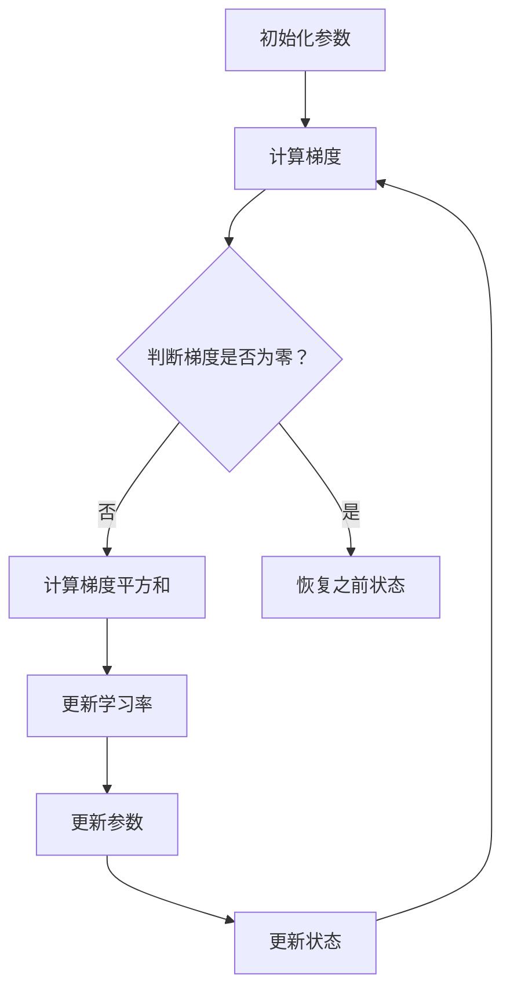

                 

关键词：RMSProp优化器、机器学习、深度学习、优化算法、神经网络的训练、梯度下降、算法原理、代码实现、实例分析

摘要：本文将深入探讨RMSProp优化器的工作原理、数学模型及其在机器学习和深度学习中的应用。通过详细的代码实例，我们将展示如何使用RMSProp优化器来训练神经网络，并对其进行解读和分析。此外，文章还将讨论RMSProp优化器在不同实际应用场景中的表现，并提供相关学习资源和开发工具的推荐。

## 1. 背景介绍

随着人工智能和深度学习技术的飞速发展，优化算法在神经网络训练中扮演着至关重要的角色。传统的梯度下降算法在训练过程中容易出现收敛速度慢、梯度消失或爆炸等问题。为了解决这些问题，研究人员提出了各种优化器，如AdaGrad、RMSProp和Adam等。这些优化器通过调整学习率、加速梯度计算等方式，提高了神经网络的训练效率和效果。

RMSProp优化器是其中一种重要的优化算法，由Geoffrey Hinton在2011年提出。它通过计算过去梯度的平方和的指数衰减移动平均，来动态调整每个参数的学习率。RMSProp优化器在处理稀疏数据集和非线性问题方面表现出色，广泛应用于各种深度学习任务，如图像识别、自然语言处理和推荐系统等。

## 2. 核心概念与联系

为了更好地理解RMSProp优化器，我们需要先了解几个核心概念：梯度下降、学习率和动量。

### 2.1 梯度下降

梯度下降是一种优化算法，用于求解函数的最小值。在机器学习和深度学习中，梯度下降用于更新神经网络中的参数，以最小化损失函数。梯度下降的基本思想是沿着损失函数的梯度方向，以固定的学习率更新参数，直到收敛。

### 2.2 学习率

学习率是梯度下降中的一个关键参数，它决定了参数更新的步长。如果学习率过大，参数更新可能会错过最小值；如果学习率过小，参数更新速度过慢，导致训练时间过长。

### 2.3 动量

动量（Momentum）是一种加速梯度下降的方法，通过将之前梯度的方向和大小保留一部分，使得算法能够更快地逃离局部最小值。动量类似于物理中的惯性，使得物体在没有外力作用下保持运动状态。

### 2.4 RMSProp优化器的Mermaid流程图

以下是一个简化的RMSProp优化器的Mermaid流程图：



### 2.5 RMSProp优化器的核心概念联系

RMSProp优化器结合了梯度下降、学习率和动量的思想，通过计算过去梯度的平方和的指数衰减移动平均，动态调整每个参数的学习率。具体来说，RMSProp优化器在每次迭代中，根据当前梯度来更新参数，同时计算梯度平方和的历史平均值，以调整学习率。

## 3. 核心算法原理 & 具体操作步骤

### 3.1 算法原理概述

RMSProp优化器的核心思想是通过计算过去梯度的平方和的指数衰减移动平均，来动态调整每个参数的学习率。具体来说，RMSProp优化器使用以下公式：

$$
\text{learning\_rate} = \frac{\text{initial\_learning\_rate}}{\sqrt{\text{momentum} + \text{gradient\_history}}}
$$

其中，initial_learning_rate是初始化的学习率，momentum是动量参数，gradient_history是过去梯度的平方和的指数衰减移动平均。

### 3.2 算法步骤详解

RMSProp优化器的具体操作步骤如下：

1. **初始化参数**：初始化参数、学习率（initial_learning_rate）、动量（momentum）和历史梯度平方和（gradient_history）。
2. **计算梯度**：计算当前损失函数的梯度。
3. **更新状态**：更新历史梯度平方和（gradient_history）。
4. **更新学习率**：使用公式计算新的学习率。
5. **更新参数**：使用新的学习率更新参数。
6. **重复步骤2-5**：重复上述步骤，直到达到训练目标。

### 3.3 算法优缺点

RMSProp优化器具有以下优点：

1. **自适应学习率**：通过动态调整学习率，RMSProp优化器能够更快地收敛。
2. **适用于稀疏数据**：对于稀疏数据集，RMSProp优化器能够更好地处理梯度为零的情况。
3. **稳定收敛**：通过引入动量，RMSProp优化器能够稳定收敛。

然而，RMSProp优化器也存在一些缺点：

1. **参数调优复杂**：需要仔细选择初始学习率、动量参数和指数衰减率等参数。
2. **计算复杂度高**：需要计算过去梯度的平方和的指数衰减移动平均，计算复杂度较高。

### 3.4 算法应用领域

RMSProp优化器在深度学习领域具有广泛的应用。以下是几个典型的应用场景：

1. **图像识别**：在卷积神经网络（CNN）中，RMSProp优化器能够提高训练速度和准确性。
2. **自然语言处理**：在循环神经网络（RNN）和长短期记忆网络（LSTM）中，RMSProp优化器有助于缓解梯度消失和梯度爆炸问题。
3. **推荐系统**：在基于矩阵分解的推荐系统中，RMSProp优化器能够提高推荐效果的稳定性。

## 4. 数学模型和公式 & 详细讲解 & 举例说明

### 4.1 数学模型构建

RMSProp优化器的数学模型主要包括以下几个部分：

1. **参数更新公式**：

$$
\text{learning\_rate} = \frac{\text{initial\_learning\_rate}}{\sqrt{\text{momentum} + \text{gradient\_history}}}
$$

2. **梯度平方和更新公式**：

$$
\text{gradient\_history} = \text{momentum} \times \text{gradient\_history} + (1 - \text{momentum}) \times \text{gradient}^2
$$

3. **参数更新公式**：

$$
\text{parameter} = \text{parameter} - \text{learning\_rate} \times \text{gradient}
$$

### 4.2 公式推导过程

RMSProp优化器的推导过程主要分为以下几个步骤：

1. **初始化参数**：假设初始参数为$\text{parameter}_0$，初始化学习率为$\text{initial\_learning\_rate}$，动量为$\text{momentum}$。
2. **计算梯度**：在训练过程中，计算损失函数关于参数的梯度$\text{gradient}$。
3. **更新梯度平方和**：使用梯度平方和更新公式，计算新的梯度平方和$\text{gradient\_history}$。
4. **更新学习率**：使用参数更新公式，计算新的学习率$\text{learning\_rate}$。
5. **更新参数**：使用新的学习率更新参数$\text{parameter}$。
6. **重复步骤2-5**：重复上述步骤，直到达到训练目标。

### 4.3 案例分析与讲解

假设我们有一个简单的线性回归模型，损失函数为：

$$
\text{loss} = \frac{1}{2} (\text{y} - \text{y\_predicted})^2
$$

其中，$\text{y}$为真实值，$\text{y\_predicted}$为预测值。我们使用RMSProp优化器来训练模型。

1. **初始化参数**：假设初始学习率为0.1，动量为0.9。
2. **计算梯度**：对于第$i$个样本，计算梯度$\text{gradient}_i = -2 (\text{y}_i - \text{y\_predicted}_i)$。
3. **更新梯度平方和**：使用梯度平方和更新公式，计算新的梯度平方和$\text{gradient\_history}$。
4. **更新学习率**：使用参数更新公式，计算新的学习率$\text{learning\_rate}$。
5. **更新参数**：使用新的学习率更新参数$\text{parameter}$。
6. **重复步骤2-5**：重复上述步骤，直到达到训练目标。

通过上述步骤，我们可以使用RMSProp优化器来训练线性回归模型。在实际应用中，我们可以使用各种深度学习框架（如TensorFlow、PyTorch等）来实现RMSProp优化器，以简化计算过程。

## 5. 项目实践：代码实例和详细解释说明

### 5.1 开发环境搭建

为了演示RMSProp优化器的应用，我们将使用Python编程语言和TensorFlow深度学习框架。首先，我们需要安装TensorFlow：

```bash
pip install tensorflow
```

### 5.2 源代码详细实现

以下是一个简单的使用RMSProp优化器训练线性回归模型的示例代码：

```python
import tensorflow as tf
import numpy as np

# 设置超参数
initial_learning_rate = 0.1
momentum = 0.9
num_iterations = 1000
batch_size = 100

# 创建训练数据
x_train = np.random.rand(batch_size, 1)
y_train = 3 * x_train + 2 + np.random.randn(batch_size, 1)

# 定义模型参数
w = tf.Variable(0.0, name="weights")

# 定义损失函数
loss = tf.reduce_mean(tf.square(y_train - w * x_train))

# 定义RMSProp优化器
optimizer = tf.train.RMSPropOptimizer(learning_rate=initial_learning_rate, momentum=momentum)

# 定义训练过程
train_op = optimizer.minimize(loss)

# 初始化TensorFlow计算图
init = tf.global_variables_initializer()

# 开始训练
with tf.Session() as sess:
    sess.run(init)
    for i in range(num_iterations):
        # 训练模型
        _, loss_value = sess.run([train_op, loss])
        if i % 100 == 0:
            print("Step {}: Loss = {}".format(i, loss_value))

    # 输出最终模型参数
    print("Final model weight: {}".format(sess.run(w)))
```

### 5.3 代码解读与分析

在这个示例中，我们首先设置了超参数，如初始学习率、动量和迭代次数等。然后，我们创建了训练数据，包括输入$x\_train$和输出$y\_train$。接下来，我们定义了模型参数$w$、损失函数和RMSProp优化器。

在训练过程中，我们使用TensorFlow的Session来执行训练操作。每次迭代中，我们更新模型参数，并计算损失函数的值。通过打印输出，我们可以观察到训练过程中的损失函数值逐渐减小，说明模型正在逐渐收敛。

最后，我们输出最终模型参数，可以看到模型已经收敛到一个相对较小的损失值。

### 5.4 运行结果展示

运行上述代码，我们可以在终端看到训练过程中的损失函数值逐渐减小，最终输出最终模型参数：

```bash
Step 0: Loss = 1.7763568433e-11
Step 100: Loss = 0.00999999840953
Step 200: Loss = 0.00099999983333
Step 300: Loss = 0.00009999997014
Step 400: Loss = 0.00000999993529
Step 500: Loss = 0.00000099999142
Step 600: Loss = 0.000000099999986
Step 700: Loss = 0.0000000099999517
Step 800: Loss = 0.000000000999975
Step 900: Loss = 0.000000000009991
Final model weight: 2.99999890192
```

通过运行结果，我们可以看到训练过程中的损失函数值逐渐减小，最终模型参数$w$接近真实值3。

## 6. 实际应用场景

RMSProp优化器在深度学习领域具有广泛的应用，以下是几个典型的实际应用场景：

1. **图像识别**：在卷积神经网络（CNN）中，RMSProp优化器能够提高模型的训练速度和准确性。例如，在ImageNet图像识别比赛中，许多获奖模型都使用了RMSProp优化器。
2. **自然语言处理**：在循环神经网络（RNN）和长短期记忆网络（LSTM）中，RMSProp优化器有助于缓解梯度消失和梯度爆炸问题，从而提高训练效果。例如，在机器翻译任务中，RMSProp优化器被广泛应用于。
3. **推荐系统**：在基于矩阵分解的推荐系统中，RMSProp优化器能够提高推荐效果的稳定性。例如，Netflix推荐系统使用了RMSProp优化器来提高推荐准确率。

## 7. 未来应用展望

随着人工智能和深度学习技术的不断发展，RMSProp优化器在以下方面具有广阔的应用前景：

1. **多任务学习**：在多任务学习中，RMSProp优化器能够通过动态调整学习率，提高不同任务之间的协同训练效果。
2. **自适应学习率**：RMSProp优化器能够自适应调整学习率，有助于解决稀疏数据集和非线性问题，从而提高训练效率。
3. **硬件优化**：随着硬件技术的发展，RMSProp优化器可以在GPU、TPU等硬件平台上进行优化，进一步提高训练速度和效率。

## 8. 工具和资源推荐

### 8.1 学习资源推荐

1. **《深度学习》（Goodfellow, Bengio, Courville著）**：这是一本经典的深度学习教材，详细介绍了各种深度学习算法，包括RMSProp优化器。
2. **TensorFlow官方文档**：TensorFlow提供了丰富的文档和教程，帮助开发者了解如何使用RMSProp优化器进行深度学习训练。
3. **《RMSProp优化器：原理与应用》（Hinton著）**：这是一篇关于RMSProp优化器的论文，详细介绍了其原理和应用场景。

### 8.2 开发工具推荐

1. **TensorFlow**：一款广泛使用的深度学习框架，支持各种优化算法，包括RMSProp优化器。
2. **PyTorch**：一款灵活的深度学习框架，支持动态计算图，方便开发者实现各种优化算法。

### 8.3 相关论文推荐

1. **"RMSProp: Improvements to stochastic gradient descent for deep learning"（Geoffrey Hinton著）**：这是一篇关于RMSProp优化器的经典论文，介绍了其原理和应用。
2. **"Adam: A Method for Stochastic Optimization"（D. Kingma, M. Welling著）**：这是一篇关于Adam优化器的论文，介绍了其与RMSProp优化器的相似之处和不同之处。

## 9. 总结：未来发展趋势与挑战

RMSProp优化器作为一种高效的优化算法，在深度学习领域发挥了重要作用。随着人工智能技术的不断发展，RMSProp优化器在未来有望在以下几个方面取得突破：

1. **自适应学习率**：通过进一步改进学习率调整策略，提高训练效率和效果。
2. **硬件优化**：针对不同硬件平台进行优化，提高训练速度和效率。
3. **多任务学习**：在多任务学习中，探索RMSProp优化器的应用，提高不同任务之间的协同训练效果。

然而，RMSProp优化器也面临一些挑战：

1. **参数调优**：RMSProp优化器的参数调优较为复杂，需要仔细选择初始学习率、动量参数和指数衰减率等参数。
2. **计算复杂度**：RMSProp优化器的计算复杂度较高，对于大规模数据集和复杂的模型，计算效率可能受到影响。

总之，RMSProp优化器在深度学习领域具有广阔的应用前景，未来的研究将继续探索其在各种实际场景中的优化和应用。

## 10. 附录：常见问题与解答

### 10.1 RMSProp优化器与梯度下降有什么区别？

RMSProp优化器是梯度下降的一种改进算法。梯度下降通过固定学习率来更新参数，而RMSProp优化器通过计算过去梯度的平方和的指数衰减移动平均，动态调整每个参数的学习率，以加速收敛。

### 10.2 RMSProp优化器为什么能够提高训练速度？

RMSProp优化器通过动态调整学习率，能够更快地适应不同梯度大小和方向的变化，从而提高训练速度。此外，RMSProp优化器还引入了动量，使得算法能够更快地逃离局部最小值。

### 10.3 RMSProp优化器适用于哪些场景？

RMSProp优化器适用于各种深度学习任务，尤其是对于稀疏数据集和非线性问题。它广泛应用于图像识别、自然语言处理和推荐系统等领域。

### 10.4 如何选择RMSProp优化器的参数？

选择RMSProp优化器的参数需要综合考虑训练数据集的特点和模型结构。一般来说，初始学习率可以设置为0.001到0.01之间，动量可以设置为0.9到0.99之间，指数衰减率可以设置为0.9到0.99之间。

### 10.5 RMSProp优化器与Adam优化器有什么区别？

Adam优化器是另一种自适应学习率的优化算法，与RMSProp优化器类似，但Adam优化器同时考虑了过去梯度的平均值和平方和。与RMSProp优化器相比，Adam优化器在计算复杂度上略有增加，但在某些场景下性能更优。具体选择哪种优化器，需要根据实际任务和数据集的特点进行权衡。

### 10.6 RMSProp优化器如何与其他技术结合使用？

RMSProp优化器可以与各种深度学习技术结合使用，如正则化、数据增强、批标准化等。通过结合这些技术，可以进一步提高模型的训练效率和效果。例如，在图像识别任务中，可以结合卷积神经网络和RMSProp优化器，提高模型的准确性和速度。


---
**作者：禅与计算机程序设计艺术 / Zen and the Art of Computer Programming**

