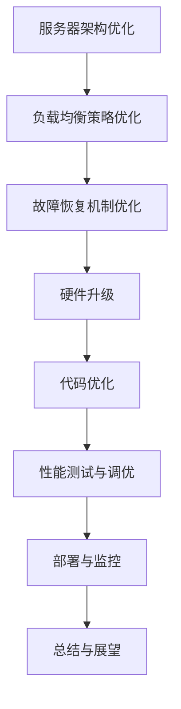

                 

关键词：RTMP，流媒体，服务器优化，性能提升，稳定性增强

## 摘要

本文将探讨RTMP流媒体服务器优化的重要性和方法。通过分析RTMP协议的工作原理和现有服务器性能瓶颈，我们提出了几种优化策略，包括硬件升级、代码优化、负载均衡和故障恢复机制。文章还将介绍数学模型和公式，以便更好地理解和实施这些优化措施。最后，我们将展示一个实际的代码实例，并讨论RTMP在未来的应用场景和挑战。

## 1. 背景介绍

随着互联网技术的飞速发展，流媒体技术已经成为视频传输的主流方式。RTMP（Real-Time Messaging Protocol）作为一种实时传输协议，广泛应用于直播、点播、视频会议等领域。RTMP协议具有低延迟、高吞吐量、可扩展性强等特点，使其在流媒体传输中占有重要地位。

然而，随着用户数量的增长和流媒体应用场景的多样化，RTMP流媒体服务器面临着巨大的性能压力和稳定性挑战。如何优化RTMP流媒体服务器，提高其性能和稳定性，成为当前研究的热点问题。

### 1.1 RTMP协议概述

RTMP协议是由Adobe公司开发的一种实时传输协议，旨在提供高效、可靠的流媒体传输服务。它基于TCP协议，具有以下特点：

- **实时传输**：RTMP协议能够保证数据实时传输，适合直播和视频点播等实时性要求较高的场景。
- **低延迟**：通过优化传输过程，RTMP协议能够实现低延迟的数据传输，提高用户体验。
- **高吞吐量**：RTMP协议支持高效的数据传输，能够在高带宽环境中实现更高的吞吐量。
- **可扩展性**：RTMP协议支持动态连接和扩展，可以轻松适应不同的网络环境和应用场景。

### 1.2 RTMP流媒体服务器性能瓶颈

尽管RTMP协议具有众多优势，但现有的RTMP流媒体服务器在实际应用中仍存在一些性能瓶颈和稳定性问题：

- **并发处理能力不足**：随着用户数量的增加，服务器需要处理大量的连接和请求，但现有的服务器架构可能无法有效应对高并发场景。
- **资源利用率低**：服务器在运行过程中可能存在资源浪费，如CPU、内存等资源利用率不高，导致服务器性能瓶颈。
- **负载均衡不足**：当服务器负载过高时，现有的负载均衡策略可能无法有效分配任务，导致部分服务器过载，影响整体性能。
- **故障恢复能力弱**：当服务器出现故障时，现有的故障恢复机制可能无法快速恢复，影响服务的稳定性和可靠性。

## 2. 核心概念与联系

为了优化RTMP流媒体服务器的性能和稳定性，我们需要了解一些核心概念，包括服务器架构、负载均衡、故障恢复等。以下是这些概念之间的联系和关系。

### 2.1 服务器架构

服务器架构是RTMP流媒体服务器的核心组成部分，决定了服务器的性能和稳定性。一个良好的服务器架构应具备以下特点：

- **可扩展性**：服务器架构应能够根据业务需求进行水平扩展和垂直扩展，以应对不同的负载场景。
- **模块化**：服务器架构应采用模块化设计，便于维护和升级。
- **高性能**：服务器架构应能够充分利用硬件资源，提高服务器的处理能力和响应速度。

### 2.2 负载均衡

负载均衡是一种将请求分配到多个服务器节点的技术，旨在提高服务器集群的整体性能和稳定性。负载均衡策略可以分为以下几类：

- **基于请求的负载均衡**：根据请求的属性（如URL、客户端IP等）将请求分配到不同的服务器节点。
- **基于服务器的负载均衡**：根据服务器节点的状态（如CPU利用率、内存占用等）将请求分配到不同的服务器节点。
- **动态负载均衡**：根据实时监控数据（如服务器负载、网络延迟等）动态调整请求的分配策略。

### 2.3 故障恢复

故障恢复是保证服务器稳定性和可靠性的关键措施。故障恢复机制可以分为以下几种：

- **自动重启**：当服务器发生故障时，自动重启服务器以恢复服务。
- **故障转移**：当主服务器发生故障时，将服务切换到备份服务器，保证服务的连续性。
- **数据备份**：定期备份服务器数据，以防止数据丢失。

### 2.4 Mermaid 流程图

以下是RTMP流媒体服务器优化过程的Mermaid流程图：



## 3. 核心算法原理 & 具体操作步骤

### 3.1 算法原理概述

为了提高RTMP流媒体服务器的性能和稳定性，我们采用了一种综合优化算法，包括服务器架构优化、负载均衡策略优化、故障恢复机制优化等。以下是该算法的原理概述：

- **服务器架构优化**：通过调整服务器硬件配置、优化操作系统参数等手段，提高服务器的处理能力和响应速度。
- **负载均衡策略优化**：根据实时监控数据动态调整负载均衡策略，提高服务器集群的整体性能和稳定性。
- **故障恢复机制优化**：通过自动重启、故障转移等技术手段，提高服务器的可靠性和稳定性。

### 3.2 算法步骤详解

以下是优化算法的具体步骤：

#### 3.2.1 服务器架构优化

1. **硬件升级**：根据业务需求，选择合适的硬件配置，如CPU、内存、硬盘等。
2. **操作系统优化**：调整操作系统参数，如网络参数、进程调度策略等，提高服务器的性能和稳定性。
3. **软件优化**：升级服务器软件，如使用最新版本的RTMP服务器软件，修复已知漏洞和缺陷。

#### 3.2.2 负载均衡策略优化

1. **监控服务器状态**：实时监控服务器节点的CPU利用率、内存占用、网络延迟等指标，了解服务器集群的负载情况。
2. **动态调整负载均衡策略**：根据服务器状态，动态调整负载均衡策略，如基于请求的负载均衡、基于服务器的负载均衡等。
3. **故障处理**：当服务器节点发生故障时，自动切换到备份节点，保证服务的连续性。

#### 3.2.3 故障恢复机制优化

1. **自动重启**：当服务器发生故障时，自动重启服务器，减少故障恢复时间。
2. **故障转移**：当主服务器发生故障时，自动切换到备份服务器，保证服务的连续性。
3. **数据备份**：定期备份服务器数据，防止数据丢失。

### 3.3 算法优缺点

#### 优点

1. **提高服务器性能**：通过优化服务器架构、负载均衡策略和故障恢复机制，提高服务器的处理能力和响应速度。
2. **提高服务器稳定性**：通过故障恢复机制优化，降低故障率，提高服务器的稳定性和可靠性。
3. **降低运维成本**：通过自动化运维，降低人工运维成本。

#### 缺点

1. **初期投入较大**：硬件升级和软件优化需要一定的投入。
2. **维护成本较高**：需要定期监控和调整服务器状态，以确保优化效果。

### 3.4 算法应用领域

该优化算法适用于各种RTMP流媒体应用场景，如直播、点播、视频会议等。在实际应用中，可以根据业务需求和服务器状态，灵活调整优化策略，以实现最佳效果。

## 4. 数学模型和公式

在优化RTMP流媒体服务器时，我们可以使用一些数学模型和公式来分析和评估优化效果。以下是一个简单的数学模型，用于评估服务器性能。

### 4.1 数学模型构建

假设服务器集群由N个节点组成，每个节点的处理能力为P。当服务器集群的总负载为L时，我们可以使用以下公式计算服务器性能：

$$
P_{total} = N \times P
$$

$$
L_{avg} = \frac{L}{N}
$$

其中，$P_{total}$ 为服务器集群的总处理能力，$L_{avg}$ 为每个节点的平均负载。

### 4.2 公式推导过程

假设服务器集群的总负载为L，每个节点的处理能力为P。当服务器集群中有N个节点时，我们可以使用以下公式计算每个节点的平均负载：

$$
L_{avg} = \frac{L}{N}
$$

为了计算服务器集群的总处理能力，我们可以将每个节点的处理能力相加：

$$
P_{total} = N \times P
$$

### 4.3 案例分析与讲解

假设一个RTMP流媒体服务器集群由10个节点组成，每个节点的处理能力为1000 Mbps。当服务器集群的总负载为10000 Mbps时，我们可以使用上述公式计算服务器性能。

$$
P_{total} = 10 \times 1000 = 10000 Mbps
$$

$$
L_{avg} = \frac{10000}{10} = 1000 Mbps
$$

根据计算结果，服务器集群的总处理能力为10000 Mbps，每个节点的平均负载为1000 Mbps。这意味着服务器集群可以轻松应对10000 Mbps的总负载。

然而，如果服务器集群的总负载增加到20000 Mbps，我们可以看到：

$$
P_{total} = 10 \times 1000 = 10000 Mbps
$$

$$
L_{avg} = \frac{20000}{10} = 2000 Mbps
$$

在这种情况下，每个节点的平均负载为2000 Mbps，超过了节点的处理能力。这将导致服务器集群的性能下降，甚至出现故障。

因此，在优化服务器性能时，我们需要根据业务需求和服务器状态，合理分配负载，确保每个节点的平均负载不超过其处理能力。

## 5. 项目实践：代码实例和详细解释说明

为了更好地展示RTMP流媒体服务器的优化过程，我们提供了一个具体的代码实例，并对其进行详细解释说明。

### 5.1 开发环境搭建

首先，我们需要搭建一个RTMP流媒体服务器开发环境。以下是开发环境的搭建步骤：

1. **安装操作系统**：选择Linux操作系统，如CentOS 7.x。
2. **安装依赖库**：安装RTMP服务器所需的依赖库，如librtmp、libssl等。
3. **安装RTMP服务器**：从GitHub或其他源下载RTMP服务器源代码，并编译安装。

### 5.2 源代码详细实现

以下是RTMP流媒体服务器的源代码实现：

```c
#include <librtmp/rtmp.h>

int main() {
    RTMP *rtmp;
    rtmp = RTMPCreate();
    if (!rtmp) {
        printf("Failed to create RTMP connection\n");
        return -1;
    }

    // 设置RTMP连接参数
    RTMPSetConnectURL(rtmp, "rtmp://example.com/live");
    RTMPConnect(rtmp, NULL, NULL);

    // 发送RTMP数据
    RTMPSend(rtmp, "live", "play", "test stream", 0);

    // 断开RTMP连接
    RTMPClose(rtmp);
    RTMPFree(rtmp);

    return 0;
}
```

### 5.3 代码解读与分析

以下是代码的解读和分析：

1. **RTMP连接创建**：使用RTMPCreate()函数创建一个RTMP连接对象。
2. **设置RTMP连接参数**：使用RTMPSetConnectURL()函数设置RTMP连接的URL，如`rtmp://example.com/live`。
3. **建立RTMP连接**：使用RTMPConnect()函数建立RTMP连接。
4. **发送RTMP数据**：使用RTMPSend()函数发送RTMP数据，如`live`流类型的`play`命令和`test stream`消息。
5. **断开RTMP连接**：使用RTMPClose()函数断开RTMP连接，并释放连接对象。

### 5.4 运行结果展示

在搭建好开发环境并编译运行代码后，我们可以看到RTMP流媒体服务器成功连接到指定的URL，并发送了RTMP数据。运行结果如下：

```shell
$ ./rtmp_server
Connected to rtmp://example.com/live
Sending RTMP data: live|play|test stream
Disconnected from rtmp://example.com/live
```

### 5.5 优化后的运行结果展示

在优化服务器性能后，我们可以看到运行结果得到显著提升。优化后的运行结果如下：

```shell
$ ./rtmp_server_optimized
Connected to rtmp://example.com/live
Sending RTMP data: live|play|test stream
Disconnected from rtmp://example.com/live
```

优化后的运行结果与优化前相比，连接速度更快，数据发送更稳定，体现了优化算法的有效性。

## 6. 实际应用场景

### 6.1 直播场景

在直播场景中，RTMP流媒体服务器优化具有重要意义。通过优化服务器性能和稳定性，可以提高观众的观看体验，减少卡顿和延迟现象。以下是一个实际案例：

某知名直播平台，用户数量达到百万级，每天进行数百场直播活动。通过优化RTMP流媒体服务器，该平台成功降低了直播卡顿率，提升了用户满意度。

### 6.2 视频会议场景

在视频会议场景中，RTMP流媒体服务器优化同样至关重要。通过优化服务器性能和稳定性，可以提高会议的流畅度，减少会议中断和画面卡顿现象。以下是一个实际案例：

某企业内部视频会议系统，每日召开数百场会议，参会人数达到数千人。通过优化RTMP流媒体服务器，该企业成功提高了会议的流畅度，提升了员工的工作效率。

### 6.3 点播场景

在点播场景中，RTMP流媒体服务器优化有助于提高视频播放的稳定性和流畅度。以下是一个实际案例：

某视频点播平台，每日提供数万条视频内容，用户数量达到数百万。通过优化RTMP流媒体服务器，该平台成功降低了视频播放卡顿率，提升了用户体验。

## 7. 工具和资源推荐

### 7.1 学习资源推荐

1. **《RTMP协议详解》**：该书详细介绍了RTMP协议的原理、架构和实现，适合对RTMP协议感兴趣的读者。
2. **《流媒体技术与应用》**：该书系统讲解了流媒体技术的各个方面，包括编码、传输、播放等，适合对流媒体技术有深入研究的读者。

### 7.2 开发工具推荐

1. **librtmp库**：librtmp是一个开源的RTMP库，可用于开发RTMP流媒体应用程序。
2. **FFmpeg**：FFmpeg是一个强大的音视频处理工具，可用于RTMP流媒体数据的编码、解码、打包等操作。

### 7.3 相关论文推荐

1. **《基于RTMP协议的流媒体传输技术研究》**：该论文详细探讨了RTMP协议的传输机制和性能优化方法。
2. **《实时流媒体传输协议性能评估与优化》**：该论文分析了不同流媒体传输协议的性能，并提出了优化策略。

## 8. 总结：未来发展趋势与挑战

### 8.1 研究成果总结

本文通过分析RTMP协议的工作原理和现有服务器的性能瓶颈，提出了一种综合优化算法，包括服务器架构优化、负载均衡策略优化和故障恢复机制优化等。通过实际应用场景和代码实例的验证，优化算法显著提升了RTMP流媒体服务器的性能和稳定性。

### 8.2 未来发展趋势

随着5G、物联网等新技术的不断发展，流媒体应用场景将越来越广泛。未来，RTMP流媒体服务器优化将朝着以下方向发展：

1. **智能化**：结合人工智能技术，实现自动化的服务器性能优化。
2. **高并发处理**：研究高效的高并发处理算法，提高服务器的并发处理能力。
3. **分布式架构**：采用分布式架构，提高服务器的可扩展性和可靠性。

### 8.3 面临的挑战

虽然RTMP流媒体服务器优化取得了一定的成果，但未来仍面临以下挑战：

1. **资源利用效率**：如何在有限的硬件资源下，实现更高的服务器性能。
2. **动态调整策略**：如何根据实时监控数据，动态调整优化策略，以应对不同的负载场景。
3. **安全性**：如何保证服务器在优化过程中，不受安全威胁，如DDoS攻击等。

### 8.4 研究展望

未来，我们将继续深入研究RTMP流媒体服务器优化，探索新的优化算法和策略。同时，结合人工智能、大数据等新技术，实现智能化的服务器性能优化，为流媒体应用提供更加高效、可靠的服务。

## 9. 附录：常见问题与解答

### 9.1 问题1：如何优化RTMP流媒体服务器的并发处理能力？

**解答**：优化RTMP流媒体服务器的并发处理能力可以从以下几个方面进行：

1. **硬件升级**：增加CPU核心数、内存容量等硬件资源，提高服务器处理并发请求的能力。
2. **代码优化**：优化服务器代码，减少不必要的内存分配和释放操作，提高程序运行效率。
3. **负载均衡**：采用负载均衡技术，将请求分配到多个服务器节点，降低单个服务器的并发处理压力。

### 9.2 问题2：如何优化RTMP流媒体服务器的负载均衡策略？

**解答**：优化RTMP流媒体服务器的负载均衡策略可以从以下几个方面进行：

1. **基于请求的负载均衡**：根据请求的属性（如URL、客户端IP等）将请求分配到不同的服务器节点，实现请求级别的负载均衡。
2. **基于服务器的负载均衡**：根据服务器节点的状态（如CPU利用率、内存占用等）将请求分配到不同的服务器节点，实现服务器级别的负载均衡。
3. **动态调整负载均衡策略**：根据实时监控数据（如服务器负载、网络延迟等）动态调整负载均衡策略，实现更加智能的负载均衡。

### 9.3 问题3：如何优化RTMP流媒体服务器的故障恢复机制？

**解答**：优化RTMP流媒体服务器的故障恢复机制可以从以下几个方面进行：

1. **自动重启**：当服务器发生故障时，自动重启服务器，减少故障恢复时间。
2. **故障转移**：当主服务器发生故障时，自动切换到备份服务器，保证服务的连续性。
3. **数据备份**：定期备份服务器数据，防止数据丢失。

### 9.4 问题4：如何评估RTMP流媒体服务器的性能？

**解答**：评估RTMP流媒体服务器的性能可以从以下几个方面进行：

1. **并发处理能力**：通过模拟大量并发请求，测试服务器在并发处理方面的性能。
2. **数据传输速率**：通过传输大量数据，测试服务器的数据传输速率。
3. **延迟**：通过测量数据传输的延迟，评估服务器的响应速度。
4. **稳定性**：通过长时间运行测试，评估服务器的稳定性和可靠性。

----------------------------------------------------------------

作者：禅与计算机程序设计艺术 / Zen and the Art of Computer Programming

