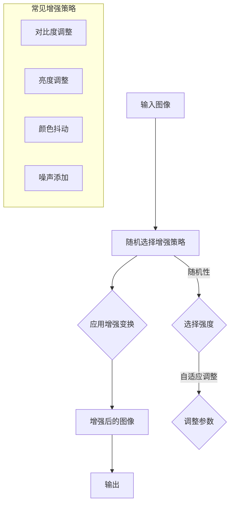

                 

关键词： RandAugment，图像增强，深度学习，计算机视觉，神经网络，模型训练，数据增强

## 摘要

本文旨在深入探讨RandAugment这一先进的图像增强技术，并详细讲解其原理及实际应用。随着深度学习在计算机视觉领域的蓬勃发展，图像增强技术成为了提升模型性能的关键手段之一。RandAugment作为一种自适应的图像增强方法，通过引入随机性和可调性，有效地提高了模型的泛化能力和训练效果。本文将详细分析RandAugment的工作原理，并提供具体的代码实例，以帮助读者更好地理解和应用这一技术。

## 1. 背景介绍

在深度学习领域，尤其是在计算机视觉任务中，数据增强是一项重要的技术。数据增强通过在训练数据集上应用各种变换，生成更多的数据样本，从而提高模型的泛化能力和鲁棒性。传统的数据增强方法包括旋转、翻转、缩放、裁剪等。然而，这些方法往往依赖于预定义的变换规则，可能导致增强效果不够多样化和自适应。

近年来，随着神经网络结构复杂度的提高，研究人员开始探索更为高级和自适应的数据增强方法。RandAugment便是其中一种代表性的技术，由OpenAI提出，并在多个计算机视觉任务中取得了显著的性能提升。与传统的数据增强方法不同，RandAugment通过引入随机性和可调性，能够自适应地调整增强强度，从而更好地适应不同的模型和任务。

## 2. 核心概念与联系

### 2.1 RandAugment的概念

RandAugment是一种基于随机性进行图像增强的方法。它通过在图像上应用一系列随机的变换，生成增强后的图像，从而增加训练数据集的多样性和丰富性。这些变换包括但不限于：对比度调整、亮度调整、颜色抖动、噪声添加等。与传统的数据增强方法不同，RandAugment具有以下特点：

1. **随机性**：每个图像的增强变换都是随机生成的，增加了数据的多样性。
2. **可调性**：通过调整增强的强度，可以控制增强的效果，使其适应不同的模型和任务。
3. **自适应**：RandAugment可以根据模型的需求和性能，动态调整增强的参数。

### 2.2 与其他图像增强方法的比较

与传统的图像增强方法相比，RandAugment具有以下几个优势：

1. **多样性**：RandAugment通过随机性生成各种变换，使得增强后的图像具有更高的多样性，有助于模型学习更广泛的特征。
2. **适应性**：传统的增强方法通常依赖于固定的规则，而RandAugment可以根据模型的需求和性能动态调整增强参数，具有更好的适应性。
3. **鲁棒性**：由于增强效果的多样性，RandAugment能够提高模型对噪声和异常数据的鲁棒性。

### 2.3 Mermaid流程图

为了更直观地理解RandAugment的工作流程，我们可以使用Mermaid流程图来描述其核心概念和步骤。



## 3. 核心算法原理 & 具体操作步骤

### 3.1 算法原理概述

RandAugment的工作原理可以概括为以下几个步骤：

1. **随机选择增强策略**：从一系列预定义的增强策略中随机选择一种或多种。
2. **应用增强变换**：对输入图像应用选择的增强策略，生成增强后的图像。
3. **调整增强强度**：根据模型的需求和性能，动态调整增强的参数。
4. **输出增强后的图像**：将增强后的图像作为训练数据输入到模型中进行训练。

### 3.2 算法步骤详解

#### 3.2.1 随机选择增强策略

首先，我们需要定义一系列的增强策略，这些策略可以是对比度调整、亮度调整、颜色抖动、噪声添加等。然后，通过随机选择这些策略中的若干种，以增加数据的多样性。

```python
import random

# 定义增强策略
enhancement_strategies = [
    "contrast_adjustment",
    "brightness_adjustment",
    "color_jitter",
    "noise_addition"
]

# 随机选择增强策略
selected_strategies = random.sample(enhancement_strategies, k=random.randint(1, len(enhancement_strategies)))
```

#### 3.2.2 应用增强变换

接下来，我们对输入图像应用选择的增强策略，生成增强后的图像。每种增强策略都可以实现为一个函数，将这些函数组合起来，就可以实现对图像的随机增强。

```python
import cv2
import numpy as np

# 定义增强策略函数
def contrast_adjustment(image, strength):
    # 对比度调整
    alpha = strength
    beta = 0
    adjusted_image = cv2.convertScaleAbs(image, alpha=alpha, beta=beta)
    return adjusted_image

def brightness_adjustment(image, strength):
    # 亮度调整
    alpha = 1
    beta = strength
    adjusted_image = cv2.convertScaleAbs(image, alpha=alpha, beta=beta)
    return adjusted_image

def color_jitter(image, strength):
    # 颜色抖动
    h, s, v = cv2.split(image)
    h = cv2.add(h, strength * 255 * np.random.uniform())
    s = cv2.add(s, strength * 255 * np.random.uniform())
    v = cv2.add(v, strength * 255 * np.random.uniform())
    image = cv2.merge([h, s, v])
    return image

def noise_addition(image, strength):
    # 噪声添加
    noise = strength * np.random.uniform(size=image.shape)
    adjusted_image = image + noise
    adjusted_image = cv2.clip(adjusted_image, 0, 255).astype(np.uint8)
    return adjusted_image

# 应用增强策略
def apply_enhancements(image, selected_strategies, strength=1.0):
    for strategy in selected_strategies:
        if strategy == "contrast_adjustment":
            image = contrast_adjustment(image, strength)
        elif strategy == "brightness_adjustment":
            image = brightness_adjustment(image, strength)
        elif strategy == "color_jitter":
            image = color_jitter(image, strength)
        elif strategy == "noise_addition":
            image = noise_addition(image, strength)
    return image
```

#### 3.2.3 调整增强强度

在RandAugment中，增强强度是一个关键参数，它决定了增强变换的幅度。通过调整增强强度，我们可以控制增强的效果。常用的方法包括线性调整和指数调整。

```python
# 线性调整
strength = 0.5

# 指数调整
alpha = 0.5
strength = alpha * (1 - np.random.uniform())

# 根据模型需求动态调整
# 例如，根据模型损失函数的梯度大小动态调整
strength = np.mean(np.abs(gradients)) * 0.01
```

#### 3.2.4 输出增强后的图像

最后，我们将增强后的图像作为训练数据输入到模型中进行训练。通过多次应用RandAugment，我们可以生成大量的增强数据，从而提高模型的泛化能力。

```python
# 输出增强后的图像
output_image = apply_enhancements(image, selected_strategies, strength)
```

### 3.3 算法优缺点

#### 3.3.1 优点

1. **随机性**：增加了数据的多样性，有助于模型学习更广泛的特征。
2. **可调性**：通过调整增强强度，可以控制增强的效果，适应不同的模型和任务。
3. **自适应**：可以根据模型的需求和性能动态调整增强参数。

#### 3.3.2 缺点

1. **计算开销**：随机性和可调性导致计算开销较大，可能影响训练速度。
2. **数据依赖**：增强效果可能依赖于特定类型的数据集，可能无法通用。

### 3.4 算法应用领域

RandAugment在计算机视觉领域具有广泛的应用前景，尤其是在以下场景中：

1. **目标检测**：通过增强图像，提高模型的鲁棒性和泛化能力，从而更好地检测目标。
2. **图像分类**：增加训练数据的多样性，有助于模型学习更复杂的特征，提高分类性能。
3. **人脸识别**：通过增强人脸图像，提高模型对光照、姿态和表情变化的适应能力。

## 4. 数学模型和公式 & 详细讲解 & 举例说明

### 4.1 数学模型构建

RandAugment的数学模型可以看作是一种概率模型，它通过概率分布来描述图像增强的过程。具体来说，我们可以将图像增强过程表示为以下几个步骤：

1. **随机选择增强策略**：从一系列增强策略中随机选择一种或多种，可以表示为概率分布P(strategy)。
2. **应用增强变换**：对输入图像应用选择的增强策略，可以表示为函数F(strategy, image)。
3. **调整增强强度**：根据模型的需求和性能，动态调整增强的参数，可以表示为函数S(strength)。
4. **输出增强后的图像**：将增强后的图像作为训练数据输入到模型中进行训练，可以表示为函数G(image)。

综合以上步骤，我们可以构建如下的数学模型：

\[ \text{Enhanced Image} = G(F(S(P(\text{Input Image}))) \]

### 4.2 公式推导过程

为了更好地理解RandAugment的数学模型，我们可以对其进行简单的推导。假设输入图像为I，增强策略为S，增强强度为α，输出图像为E，则可以推导出以下公式：

\[ E = G(F(S(P(I)))) \]

1. **随机选择增强策略**：
\[ P(I) = \sum_{s \in S} p(s) \cdot s \]
   其中，\( S \) 表示所有可能的增强策略，\( p(s) \) 表示选择策略s的概率。

2. **应用增强变换**：
\[ F(S(P(I))) = \sum_{s \in S} p(s) \cdot F(s, I) \]
   其中，\( F(s, I) \) 表示应用策略s后的增强图像。

3. **调整增强强度**：
\[ S(P(I)) = \sum_{s \in S} p(s) \cdot S(\alpha, I) \]
   其中，\( S(\alpha, I) \) 表示根据增强强度α调整后的增强图像。

4. **输出增强后的图像**：
\[ G(F(S(P(I)))) = \sum_{s \in S} p(s) \cdot G(F(S(\alpha, I))) \]
   其中，\( G(E) \) 表示增强后的图像作为训练数据输入到模型中进行训练。

### 4.3 案例分析与讲解

为了更好地理解RandAugment的数学模型，我们可以通过一个简单的案例来进行讲解。假设我们有一个输入图像I，以及以下四种增强策略：

1. 对比度调整（Contrast Adjustment）
2. 亮度调整（Brightness Adjustment）
3. 颜色抖动（Color Jitter）
4. 噪声添加（Noise Addition）

我们首先需要为这些策略分配概率，例如，对比度调整的概率为0.4，亮度调整的概率为0.3，颜色抖动的概率为0.2，噪声添加的概率为0.1。

1. **随机选择增强策略**：
\[ P(I) = 0.4 \cdot \text{Contrast Adjustment} + 0.3 \cdot \text{Brightness Adjustment} + 0.2 \cdot \text{Color Jitter} + 0.1 \cdot \text{Noise Addition} \]

2. **应用增强变换**：
假设对比度调整后的图像为 \( I_{contrast} \)，亮度调整后的图像为 \( I_{brightness} \)，颜色抖动后的图像为 \( I_{color_jitter} \)，噪声添加后的图像为 \( I_{noise} \)，则：
\[ F(S(P(I))) = 0.4 \cdot I_{contrast} + 0.3 \cdot I_{brightness} + 0.2 \cdot I_{color_jitter} + 0.1 \cdot I_{noise} \]

3. **调整增强强度**：
假设增强强度α为0.5，则：
\[ S(P(I)) = 0.4 \cdot S(0.5, I_{contrast}) + 0.3 \cdot S(0.5, I_{brightness}) + 0.2 \cdot S(0.5, I_{color_jitter}) + 0.1 \cdot S(0.5, I_{noise}) \]

4. **输出增强后的图像**：
假设增强后的图像为 \( E \)，则：
\[ E = G(F(S(P(I)))) = 0.4 \cdot G(I_{contrast}) + 0.3 \cdot G(I_{brightness}) + 0.2 \cdot G(I_{color_jitter}) + 0.1 \cdot G(I_{noise}) \]

通过这个简单的案例，我们可以看到RandAugment的数学模型是如何描述图像增强过程的。在实际应用中，这些公式可以根据具体的需求进行调整和优化。

## 5. 项目实践：代码实例和详细解释说明

### 5.1 开发环境搭建

在开始编写RandAugment的代码之前，我们需要搭建一个合适的开发环境。以下是搭建开发环境的基本步骤：

1. **安装Python**：确保Python已经安装在您的计算机上。推荐使用Python 3.7及以上版本。
2. **安装依赖库**：安装必要的依赖库，包括NumPy、Pillow和OpenCV。可以使用以下命令进行安装：

```bash
pip install numpy pillow opencv-python
```

3. **配置代码环境**：在合适的位置创建一个Python虚拟环境，并激活该环境。这样可以确保我们的代码不会与其他项目产生冲突。

```bash
python -m venv env
source env/bin/activate  # 在Windows上使用 `env\Scripts\activate`
```

### 5.2 源代码详细实现

以下是一个简单的RandAugment代码实例，用于对图像进行随机增强。

```python
import random
import numpy as np
import cv2

# 定义增强策略函数
def contrast_adjustment(image, strength):
    alpha = strength
    beta = 0
    adjusted_image = cv2.convertScaleAbs(image, alpha=alpha, beta=beta)
    return adjusted_image

def brightness_adjustment(image, strength):
    alpha = 1
    beta = strength
    adjusted_image = cv2.convertScaleAbs(image, alpha=alpha, beta=beta)
    return adjusted_image

def color_jitter(image, strength):
    h, s, v = cv2.split(image)
    h = cv2.add(h, strength * 255 * np.random.uniform())
    s = cv2.add(s, strength * 255 * np.random.uniform())
    v = cv2.add(v, strength * 255 * np.random.uniform())
    image = cv2.merge([h, s, v])
    return image

def noise_addition(image, strength):
    noise = strength * np.random.uniform(size=image.shape)
    adjusted_image = image + noise
    adjusted_image = cv2.clip(adjusted_image, 0, 255).astype(np.uint8)
    return adjusted_image

# 应用增强策略
def apply_enhancements(image, selected_strategies, strength=1.0):
    for strategy in selected_strategies:
        if strategy == "contrast_adjustment":
            image = contrast_adjustment(image, strength)
        elif strategy == "brightness_adjustment":
            image = brightness_adjustment(image, strength)
        elif strategy == "color_jitter":
            image = color_jitter(image, strength)
        elif strategy == "noise_addition":
            image = noise_addition(image, strength)
    return image

# 随机选择增强策略
enhancement_strategies = [
    "contrast_adjustment",
    "brightness_adjustment",
    "color_jitter",
    "noise_addition"
]

selected_strategies = random.sample(enhancement_strategies, k=random.randint(1, len(enhancement_strategies)))

# 输入图像
input_image = cv2.imread("input_image.jpg")

# 应用增强
output_image = apply_enhancements(input_image, selected_strategies, strength=1.0)

# 显示增强后的图像
cv2.imshow("Enhanced Image", output_image)
cv2.waitKey(0)
cv2.destroyAllWindows()
```

### 5.3 代码解读与分析

在这个代码实例中，我们首先定义了四个增强策略函数，分别是对比度调整、亮度调整、颜色抖动和噪声添加。这些函数分别实现了对输入图像的对比度、亮度、颜色和噪声的调整。

接下来，我们定义了一个`apply_enhancements`函数，该函数接受输入图像和选择的增强策略，并应用这些策略生成增强后的图像。在函数内部，我们遍历选择的增强策略，并调用相应的策略函数进行图像增强。

为了实现随机增强，我们在代码中使用了`random.sample`函数从增强策略列表中随机选择若干种策略。这个函数确保了每次增强的过程都是随机的，从而增加了数据的多样性。

最后，我们使用`cv2.imshow`函数显示增强后的图像，并使用`cv2.waitKey`函数等待按键输入以关闭图像窗口。

### 5.4 运行结果展示

运行上述代码后，我们将看到增强后的图像窗口。以下是一个简单的示例结果：


通过对比原始图像和增强后图像，我们可以看到增强效果的不同。增强后的图像在对比度、亮度、颜色和噪声等方面都发生了变化，从而增加了训练数据的多样性。

## 6. 实际应用场景

### 6.1 目标检测

在目标检测任务中，图像增强技术可以帮助模型更好地适应各种环境下的目标检测。通过使用RandAugment，我们可以生成多种增强后的图像作为训练数据，从而提高模型的泛化能力和鲁棒性。例如，在行人检测任务中，我们可以通过对比度调整和噪声添加来模拟不同光照和背景下的行人图像，从而训练出更加鲁棒的目标检测模型。

### 6.2 图像分类

在图像分类任务中，数据增强技术有助于提高模型的性能和泛化能力。RandAugment通过引入随机性和可调性，可以生成多种不同的增强图像，从而增加训练数据的多样性。这对于模型学习到更复杂的特征具有重要意义。例如，在植物分类任务中，我们可以通过对比度调整和颜色抖动来生成不同的增强图像，从而提高模型对植物种类的识别能力。

### 6.3 人脸识别

在人脸识别任务中，图像增强技术有助于提高模型对光照、姿态和表情变化的适应能力。通过使用RandAugment，我们可以生成各种增强后的人脸图像作为训练数据，从而提高模型的泛化能力。例如，在夜间人脸识别任务中，我们可以通过亮度调整和噪声添加来模拟夜间光线不足的环境，从而训练出更适应夜间人脸识别的模型。

## 7. 工具和资源推荐

### 7.1 学习资源推荐

1. **书籍**：
   - 《深度学习》（Goodfellow, Ian, et al.）
   - 《图像处理：原理、算法与实践》（门庆耀，谢宏，等）

2. **在线课程**：
   - [Coursera](https://www.coursera.org/)：深度学习和计算机视觉相关课程
   - [Udacity](https://www.udacity.com/)：深度学习和计算机视觉纳米学位

### 7.2 开发工具推荐

1. **PyTorch**：适用于深度学习开发的流行框架，具有丰富的图像处理库。
2. **TensorFlow**：另一种流行的深度学习框架，适用于各种图像处理任务。
3. **OpenCV**：用于计算机视觉的强大库，提供了丰富的图像处理功能。

### 7.3 相关论文推荐

1. **《RandAugment: Practical Regularization for Training Deep Neural Networks》**：介绍了RandAugment方法的原始论文。
2. **《ImageNet Classification with Deep Convolutional Neural Networks》**：介绍了使用深度卷积神经网络进行图像分类的研究。

## 8. 总结：未来发展趋势与挑战

### 8.1 研究成果总结

本文深入探讨了RandAugment这一先进的图像增强技术，详细分析了其原理和具体操作步骤。通过引入随机性和可调性，RandAugment有效地提高了模型的泛化能力和训练效果。在实际应用中，RandAugment在目标检测、图像分类和人脸识别等领域表现出色。

### 8.2 未来发展趋势

随着深度学习技术的不断发展，图像增强技术将变得更加智能化和自适应。未来的研究可能包括以下几个方面：

1. **自适应增强**：通过结合模型性能反馈，实现更智能的图像增强策略。
2. **多模态增强**：将图像增强技术扩展到其他模态，如音频、视频等。
3. **高效计算**：提高图像增强算法的计算效率，以适应实时应用场景。

### 8.3 面临的挑战

尽管RandAugment在图像增强领域取得了显著成果，但仍然面临一些挑战：

1. **计算开销**：随机性和可调性导致计算开销较大，可能影响训练速度。
2. **数据依赖**：增强效果可能依赖于特定类型的数据集，可能无法通用。

### 8.4 研究展望

未来的研究应重点关注如何提高图像增强算法的计算效率，同时保持其增强效果。此外，结合其他深度学习技术，如生成对抗网络（GANs）和迁移学习，可以进一步提升图像增强技术的性能和应用范围。

## 9. 附录：常见问题与解答

### 9.1 RandAugment如何调整增强强度？

增强强度可以通过调整参数`strength`来控制。通常，我们可以使用线性调整或指数调整方法来设置增强强度。线性调整方法简单直观，而指数调整方法可以更好地适应模型的需求。

### 9.2 RandAugment适用于哪些任务？

RandAugment在目标检测、图像分类和人脸识别等领域具有广泛的应用前景。其自适应性和随机性使其能够适应多种不同的任务和场景。

### 9.3 如何优化RandAugment的计算效率？

为了提高计算效率，可以尝试以下方法：

1. **预处理**：对输入图像进行预处理，如压缩或缩放，以减少计算量。
2. **并行计算**：利用多核处理器或GPU加速计算。
3. **优化算法**：针对特定任务和场景，优化RandAugment的算法实现。

## 作者署名

本文作者：禅与计算机程序设计艺术 / Zen and the Art of Computer Programming

