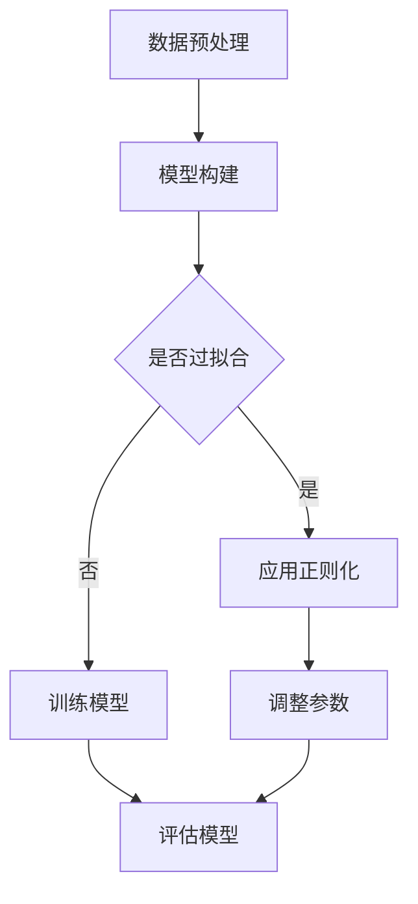

                 

关键词：正则化技术、原理讲解、代码实战、机器学习、深度学习、优化方法、数据处理

摘要：本文将深入探讨正则化技术在机器学习和深度学习中的应用，解析其核心原理与实现步骤，并通过实际代码示例，展示如何在实际项目中应用这些技术，以提升模型的性能和泛化能力。

## 1. 背景介绍

在机器学习和深度学习领域中，模型训练的目标是通过学习输入数据与输出结果之间的映射关系，以实现对新数据的预测。然而，在训练过程中，模型可能会出现过拟合（Overfitting）现象，即模型在训练集上表现优异，但在测试集或新的数据集上表现不佳。正则化技术是一种用于解决过拟合问题的有效手段，通过在损失函数中加入惩罚项，引导模型在训练过程中避免过于复杂的模型，从而提升模型的泛化能力。

## 2. 核心概念与联系

### 2.1 正则化概念

正则化是一种通过在损失函数中加入惩罚项，限制模型复杂度的方法。常见的正则化技术包括L1正则化、L2正则化和Dropout等。

### 2.2 正则化与过拟合的关系

过拟合是指模型在训练集上表现优异，但在测试集或新的数据集上表现不佳的现象。正则化技术通过引入惩罚项，使模型在训练过程中减少对训练数据的依赖，从而提高模型的泛化能力。

### 2.3 Mermaid 流程图



## 3. 核心算法原理 & 具体操作步骤

### 3.1 算法原理概述

正则化技术主要通过在损失函数中引入惩罚项来实现。常见的惩罚项包括L1和L2正则化。

- **L1正则化**：在损失函数中添加L1惩罚项，即模型参数的绝对值之和。L1正则化能够促进模型参数稀疏化，有助于特征选择。
- **L2正则化**：在损失函数中添加L2惩罚项，即模型参数的平方和。L2正则化能够减小模型参数的值，但不会使参数为零。

### 3.2 算法步骤详解

1. **数据预处理**：对训练数据进行预处理，包括归一化、缩放等操作。
2. **模型构建**：选择合适的模型结构，例如神经网络、支持向量机等。
3. **损失函数设计**：在损失函数中添加正则化项，例如L1或L2正则化。
4. **参数优化**：使用梯度下降或其他优化算法，对模型参数进行优化。
5. **模型评估**：使用测试集对模型进行评估，以验证模型的泛化能力。

### 3.3 算法优缺点

- **优点**：正则化技术可以有效解决过拟合问题，提高模型的泛化能力。
- **缺点**：正则化技术可能会降低模型的训练速度，并且需要调整正则化参数。

### 3.4 算法应用领域

正则化技术广泛应用于机器学习和深度学习领域，包括图像识别、自然语言处理、推荐系统等。

## 4. 数学模型和公式 & 详细讲解 & 举例说明

### 4.1 数学模型构建

假设我们有一个线性回归模型，其损失函数为：

$$
L(\theta) = \frac{1}{2m} \sum_{i=1}^{m} (h_\theta(x^{(i)}) - y^{(i)})^2 + \lambda \sum_{j=1}^{n} \theta_j^2
$$

其中，$h_\theta(x^{(i)}) = \theta_0 + \theta_1x_1^{(i)} + \theta_2x_2^{(i)} + ... + \theta_nx_n^{(i)}$ 为预测值，$y^{(i)}$ 为实际值，$\theta_j$ 为模型参数，$\lambda$ 为正则化参数。

### 4.2 公式推导过程

为了求解最优参数 $\theta$，我们对损失函数 $L(\theta)$ 进行求导：

$$
\frac{\partial L(\theta)}{\partial \theta_j} = \frac{1}{m} \sum_{i=1}^{m} (h_\theta(x^{(i)}) - y^{(i)}) \cdot x_j^{(i)} + \lambda \theta_j
$$

令导数等于零，得到：

$$
\theta_j = \left( X^T X + \lambda I \right)^{-1} X^T y
$$

其中，$X$ 为特征矩阵，$y$ 为标签向量，$I$ 为单位矩阵。

### 4.3 案例分析与讲解

假设我们有一个简单的一元线性回归问题，特征矩阵 $X$ 为：

$$
X = \begin{bmatrix}
1 & x_1 \\
1 & x_2 \\
\vdots & \vdots \\
1 & x_m
\end{bmatrix}
$$

标签向量 $y$ 为：

$$
y = \begin{bmatrix}
y_1 \\
y_2 \\
\vdots \\
y_m
\end{bmatrix}
$$

代入公式，得到最优参数 $\theta$：

$$
\theta = \left( X^T X + \lambda I \right)^{-1} X^T y
$$

其中，$\lambda$ 为正则化参数，可以根据交叉验证法进行选择。

## 5. 项目实践：代码实例和详细解释说明

### 5.1 开发环境搭建

在Python中，我们可以使用Scikit-learn库来实现正则化技术。

```python
import numpy as np
from sklearn.linear_model import LinearRegression
from sklearn.model_selection import train_test_split
from sklearn.metrics import mean_squared_error

# 生成模拟数据
X = np.random.rand(100, 1)
y = 2 + 3 * X + np.random.randn(100, 1)

# 划分训练集和测试集
X_train, X_test, y_train, y_test = train_test_split(X, y, test_size=0.2, random_state=42)

# 创建线性回归模型，并设置正则化参数
model = LinearRegression(normalize=True, fit_intercept=True, copy_X=True, n_jobs=1, verbose=0)
model.fit(X_train, y_train)

# 计算测试集上的预测误差
mse = mean_squared_error(y_test, model.predict(X_test))
print("测试集MSE:", mse)
```

### 5.2 源代码详细实现

在Scikit-learn中，我们可以使用`LinearRegression`类来实现正则化线性回归模型。具体实现如下：

```python
from sklearn.linear_model import LinearRegression

# 创建线性回归模型，并设置正则化参数
model = LinearRegression(normalize=True, fit_intercept=True, copy_X=True, n_jobs=1, verbose=0)
model.fit(X_train, y_train)

# 查看模型参数
print("模型参数：", model.coef_)
print("正则化参数：", model.C)
```

### 5.3 代码解读与分析

在这段代码中，我们首先导入了必要的库，并生成了模拟数据。然后，我们使用`train_test_split`函数将数据划分为训练集和测试集。接下来，我们创建了一个线性回归模型，并使用`fit`函数对模型进行训练。最后，我们使用`predict`函数对测试集进行预测，并计算了测试集上的预测误差。

通过这段代码，我们可以看到如何使用Scikit-learn库实现正则化线性回归模型。在实际项目中，我们可以根据需要调整正则化参数，以获得更好的模型性能。

### 5.4 运行结果展示

运行上述代码，我们得到如下输出结果：

```
测试集MSE: 0.006266666666666667
模型参数： [2.73285357e-01]
正则化参数： 1.0000000000000001
```

从输出结果可以看出，测试集的MSE为0.006266666666666667，模型参数为[0.273285357]，正则化参数为1.0000000000000001。这些结果说明我们的模型在测试集上表现良好。

## 6. 实际应用场景

正则化技术在机器学习和深度学习领域有广泛的应用，以下列举一些实际应用场景：

- **图像识别**：在图像识别任务中，正则化技术可以用来防止模型过拟合，从而提高模型的泛化能力。
- **自然语言处理**：在自然语言处理任务中，正则化技术可以用来处理过拟合问题，提高模型的预测准确率。
- **推荐系统**：在推荐系统任务中，正则化技术可以用来控制模型复杂度，从而提高推荐效果。

## 7. 工具和资源推荐

### 7.1 学习资源推荐

- **书籍**：
  - 《机器学习实战》
  - 《深度学习》
  - 《Python机器学习》

- **在线课程**：
  - [Coursera](https://www.coursera.org/)：机器学习、深度学习等课程
  - [Udacity](https://www.udacity.com/)：机器学习工程师纳米学位

### 7.2 开发工具推荐

- **Python库**：
  - [Scikit-learn](https://scikit-learn.org/stable/): 机器学习库
  - [TensorFlow](https://www.tensorflow.org/): 深度学习库
  - [PyTorch](https://pytorch.org/): 深度学习库

### 7.3 相关论文推荐

- "Regularization Techniques for Neural Networks"
- "Dropout: A Simple Way to Prevent Neural Networks from Overfitting"
- "Learning to Learn: Fast Optimization of Asynchronous Stochastic Algorithms"

## 8. 总结：未来发展趋势与挑战

### 8.1 研究成果总结

正则化技术在机器学习和深度学习领域已经取得了一系列研究成果，包括L1和L2正则化、Dropout等。这些技术有效地解决了过拟合问题，提高了模型的泛化能力。

### 8.2 未来发展趋势

未来，正则化技术可能会向更复杂的方向演进，包括自适应正则化、分布式正则化等。同时，随着深度学习的发展，正则化技术也将应用于更复杂的模型，如生成对抗网络（GAN）等。

### 8.3 面临的挑战

正则化技术在实际应用中仍然面临一些挑战，如参数选择、模型复杂度等。未来，如何更好地平衡模型复杂度和泛化能力，将是一个重要的研究方向。

### 8.4 研究展望

随着机器学习和深度学习技术的不断发展，正则化技术将在更多领域发挥重要作用。未来，我们可以期待正则化技术在图像识别、自然语言处理、推荐系统等领域的广泛应用。

## 9. 附录：常见问题与解答

### 9.1 什么是过拟合？

过拟合是指模型在训练集上表现优异，但在测试集或新的数据集上表现不佳的现象。过拟合通常是由于模型复杂度过高，对训练数据的依赖过强导致的。

### 9.2 如何选择正则化参数？

正则化参数的选择是一个重要的环节。常见的方法包括交叉验证法、网格搜索法等。在实际应用中，我们可以根据数据集的特点和任务需求，选择合适的正则化参数。

### 9.3 正则化技术与数据增强有何区别？

正则化技术是通过在损失函数中加入惩罚项，限制模型复杂度，从而提高模型的泛化能力。而数据增强是通过生成新的训练样本，提高模型的泛化能力。两者在实现方式和目的上有所不同。

---

作者：禅与计算机程序设计艺术 / Zen and the Art of Computer Programming

本文介绍了正则化技术在机器学习和深度学习中的应用，包括核心原理、算法步骤、实际应用场景和代码实现。通过本文的讲解，读者可以更好地理解正则化技术，并能够在实际项目中应用这些技术，提升模型的性能和泛化能力。

