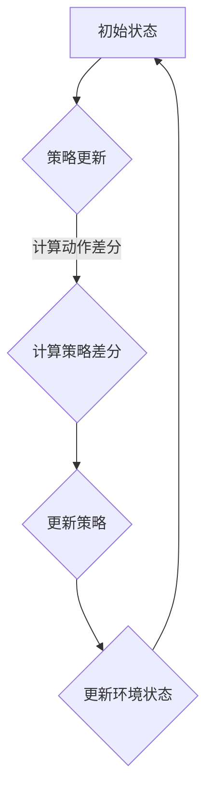

                 

关键词：Reptile、深度学习、强化学习、多智能体系统、深度强化学习、代码实例、Python实现

摘要：本文将深入探讨Reptile算法的原理及其在实际应用中的代码实例。首先，我们将回顾深度学习和强化学习的基础知识，并介绍Reptile算法的背景。接着，我们将详细讲解Reptile算法的核心概念、数学模型和具体操作步骤。随后，通过一个完整的代码实例，我们将展示Reptile算法在多智能体系统中的应用。最后，我们将讨论Reptile算法在现实世界的实际应用场景，并展望其未来的发展趋势和面临的挑战。

## 1. 背景介绍

### 深度学习与强化学习

深度学习作为人工智能的一个重要分支，近年来在图像识别、自然语言处理、语音识别等领域取得了显著成果。深度学习基于多层神经网络模型，通过学习大量的数据来提取特征，从而实现高精度的预测和分类。

强化学习则是另一种重要的机器学习技术，其核心在于智能体通过与环境交互来学习最优策略。强化学习通常应用于决策问题，如游戏、自动驾驶、机器人控制等。在强化学习中，智能体需要探索环境，并通过经验来调整其行为策略。

### 多智能体系统

多智能体系统是由多个智能体组成的系统，这些智能体可以在同一环境中进行交互。多智能体系统在多个领域都有广泛的应用，如社交网络、自动驾驶车队、供应链管理、金融交易等。

在多智能体系统中，每个智能体都需要学习如何与环境以及其他智能体进行交互，以实现共同的目标。传统的单智能体强化学习方法在多智能体系统中存在一些挑战，如多智能体之间的协调、资源分配和合作策略等。

### Reptile算法

Reptile算法是一种深度强化学习方法，旨在解决多智能体系统中的协作问题。Reptile算法的核心思想是通过多个智能体的状态和动作来共同更新智能体的策略。

Reptile算法由Schulman等人在2018年提出，它利用梯度投影技术来更新智能体的策略。与传统的梯度下降方法相比，Reptile算法具有以下几个优势：

1. 无需梯度计算：Reptile算法通过状态和动作的差分来更新策略，避免了复杂的梯度计算过程。
2. 鲁棒性：Reptile算法对噪声数据和异常值具有较强的鲁棒性，可以处理高维状态空间。
3. 并行性：Reptile算法可以在多个智能体之间并行执行，提高了训练效率。

## 2. 核心概念与联系

### Mermaid流程图



### 核心概念

1. **状态（State）**：表示智能体当前所处的环境状态。
2. **动作（Action）**：智能体在特定状态下可以采取的动作。
3. **策略（Policy）**：智能体的行为规则，用于决定在特定状态下应该采取哪个动作。
4. **策略更新（Policy Update）**：通过学习环境反馈来调整智能体的策略。
5. **动作差分（Action Difference）**：计算当前动作与之前动作的差分。
6. **策略差分（Policy Difference）**：计算当前策略与之前策略的差分。
7. **更新策略（Update Policy）**：根据动作差分和策略差分来更新智能体的策略。

## 3. 核心算法原理 & 具体操作步骤

### 3.1 算法原理概述

Reptile算法的核心思想是通过多个智能体的状态和动作来共同更新智能体的策略。具体来说，Reptile算法包括以下几个步骤：

1. 初始化：初始化智能体的策略和状态。
2. 策略更新：根据当前状态和动作差分来更新智能体的策略。
3. 更新环境状态：根据智能体的动作来更新环境状态。
4. 重复以上步骤，直到达到预设的迭代次数或收敛条件。

### 3.2 算法步骤详解

1. **初始化**

   初始化智能体的策略 $\theta_i$ 和状态 $s_i$。

   $$\theta_i^{(0)} = \theta_i^{(0)}, \quad s_i^{(0)} = s_i^{(0)}$$

2. **策略更新**

   对于每个智能体，计算其当前动作 $a_i$ 和之前动作 $a_i^{(t-1)}$ 的差分。

   $$\Delta a_i = a_i - a_i^{(t-1)}$$

   然后，计算当前策略 $\theta_i$ 和之前策略 $\theta_i^{(t-1)}$ 的差分。

   $$\Delta \theta_i = \theta_i - \theta_i^{(t-1)}$$

   最后，根据动作差分和策略差分来更新智能体的策略。

   $$\theta_i^{(t)} = \theta_i^{(t-1)} + \alpha_i \Delta \theta_i$$

   其中，$\alpha_i$ 是智能体的学习率。

3. **更新环境状态**

   根据智能体的动作来更新环境状态。

   $$s_i^{(t)} = f(s_i^{(t-1)}, a_i^{(t)})$$

4. **重复迭代**

   重复以上步骤，直到达到预设的迭代次数或收敛条件。

### 3.3 算法优缺点

**优点：**

1. 无需梯度计算：Reptile算法通过状态和动作的差分来更新策略，避免了复杂的梯度计算过程。
2. 鲁棒性：Reptile算法对噪声数据和异常值具有较强的鲁棒性，可以处理高维状态空间。
3. 并行性：Reptile算法可以在多个智能体之间并行执行，提高了训练效率。

**缺点：**

1. 策略收敛速度较慢：Reptile算法的收敛速度取决于智能体的学习率，较大的学习率可能导致策略收敛速度较慢。
2. 策略不稳定：在多智能体系统中，智能体的策略可能会不稳定，需要通过调整学习率和其他参数来优化。

### 3.4 算法应用领域

Reptile算法在多个领域都有广泛的应用，如：

1. 自动驾驶：在自动驾驶系统中，Reptile算法可以用于协调多个智能体，如车辆、行人等，以提高整体系统的安全性和效率。
2. 游戏智能：在游戏智能中，Reptile算法可以用于开发智能对手，实现更复杂和动态的游戏玩法。
3. 供应链管理：在供应链管理中，Reptile算法可以用于协调不同企业的库存和物流，以提高整体供应链的效率。

## 4. 数学模型和公式 & 详细讲解 & 举例说明

### 4.1 数学模型构建

Reptile算法的数学模型主要包括状态、动作、策略、策略差分和动作差分等概念。

1. **状态（State）**

   状态 $s$ 是一个向量，表示智能体当前所处的环境状态。

   $$s = [s_1, s_2, ..., s_n]^T$$

2. **动作（Action）**

   动作 $a$ 是一个向量，表示智能体在特定状态下可以采取的动作。

   $$a = [a_1, a_2, ..., a_n]^T$$

3. **策略（Policy）**

   策略 $\theta$ 是一个函数，用于决定在特定状态下应该采取哪个动作。

   $$\theta(s) = \arg\max_{a} \theta(s, a)$$

4. **策略差分（Policy Difference）**

   策略差分 $\Delta \theta$ 是当前策略与之前策略的差分。

   $$\Delta \theta = \theta(s, a) - \theta(s, a^{(t-1)})$$

5. **动作差分（Action Difference）**

   动作差分 $\Delta a$ 是当前动作与之前动作的差分。

   $$\Delta a = a - a^{(t-1)}$$

### 4.2 公式推导过程

Reptile算法的更新过程可以表示为以下公式：

$$\theta_i^{(t)} = \theta_i^{(t-1)} + \alpha_i \Delta \theta_i$$

其中，$\alpha_i$ 是智能体的学习率。

假设当前策略 $\theta_i^{(t)}$ 和之前策略 $\theta_i^{(t-1)}$ 分别为：

$$\theta_i^{(t)} = \theta(s_i^{(t)}, a_i^{(t)})$$

$$\theta_i^{(t-1)} = \theta(s_i^{(t-1)}, a_i^{(t-1)})$$

则策略差分 $\Delta \theta_i$ 为：

$$\Delta \theta_i = \theta_i^{(t)} - \theta_i^{(t-1)}$$

根据策略差分的定义，我们有：

$$\Delta \theta_i = \theta(s_i^{(t)}, a_i^{(t)}) - \theta(s_i^{(t-1)}, a_i^{(t-1)})$$

由于策略是关于状态和动作的函数，我们可以将上式改写为：

$$\Delta \theta_i = \theta(a_i^{(t)}) - \theta(a_i^{(t-1)})$$

假设智能体的学习率为 $\alpha_i$，则有：

$$\theta_i^{(t)} = \theta_i^{(t-1)} + \alpha_i (\theta(a_i^{(t)}) - \theta(a_i^{(t-1)}))$$

将上式整理，得：

$$\theta_i^{(t)} = \theta_i^{(t-1)} + \alpha_i \Delta \theta_i$$

### 4.3 案例分析与讲解

为了更好地理解Reptile算法，我们通过一个简单的例子来讲解其具体应用。

假设有一个多智能体系统，包括两个智能体 $A$ 和 $B$。智能体 $A$ 和 $B$ 分别处于状态 $s_A$ 和 $s_B$，它们可以采取的动作分别为 $a_A$ 和 $a_B$。智能体 $A$ 和 $B$ 的策略分别为 $\theta_A$ 和 $\theta_B$。

1. **初始化**

   假设初始状态为：

   $$s_A^{(0)} = [0, 0], \quad s_B^{(0)} = [1, 1]$$

   初始动作分别为：

   $$a_A^{(0)} = [0, 1], \quad a_B^{(0)} = [1, 0]$$

   初始策略分别为：

   $$\theta_A^{(0)} = [1, 0], \quad \theta_B^{(0)} = [0, 1]$$

2. **策略更新**

   假设当前状态为：

   $$s_A^{(1)} = [1, 1], \quad s_B^{(1)} = [0, 0]$$

   当前动作分别为：

   $$a_A^{(1)} = [1, 0], \quad a_B^{(1)} = [0, 1]$$

   当前策略分别为：

   $$\theta_A^{(1)} = [0, 1], \quad \theta_B^{(1)} = [1, 0]$$

   计算动作差分：

   $$\Delta a_A = a_A^{(1)} - a_A^{(0)} = [1, 0] - [0, 1] = [1, -1]$$

   $$\Delta a_B = a_B^{(1)} - a_B^{(0)} = [0, 1] - [1, 0] = [-1, 1]$$

   计算策略差分：

   $$\Delta \theta_A = \theta_A^{(1)} - \theta_A^{(0)} = [0, 1] - [1, 0] = [-1, 1]$$

   $$\Delta \theta_B = \theta_B^{(1)} - \theta_B^{(0)} = [1, 0] - [0, 1] = [1, -1]$$

   根据Reptile算法，更新智能体的策略：

   $$\theta_A^{(2)} = \theta_A^{(1)} + \alpha_A \Delta \theta_A = [0, 1] + 0.5 [-1, 1] = [-0.5, 1.5]$$

   $$\theta_B^{(2)} = \theta_B^{(1)} + \alpha_B \Delta \theta_B = [1, 0] + 0.5 [1, -1] = [1.5, -0.5]$$

3. **更新环境状态**

   根据智能体的动作，更新环境状态：

   $$s_A^{(2)} = f(s_A^{(1)}, a_A^{(1)}) = f([1, 1], [1, 0]) = [1, 0]$$

   $$s_B^{(2)} = f(s_B^{(1)}, a_B^{(1)}) = f([0, 0], [0, 1]) = [0, 1]$$

4. **重复迭代**

   重复以上步骤，直到达到预设的迭代次数或收敛条件。

   例如，假设经过10次迭代后，智能体的策略收敛：

   $$\theta_A^{(10)} = [-0.5, 1.5], \quad \theta_B^{(10)} = [1.5, -0.5]$$

   环境状态为：

   $$s_A^{(10)} = [1, 0], \quad s_B^{(10)} = [0, 1]$$

   此时，智能体的策略已经稳定，可以用于实际应用。

## 5. 项目实践：代码实例和详细解释说明

### 5.1 开发环境搭建

在Python中实现Reptile算法，需要安装以下库：

- TensorFlow
- NumPy
- Matplotlib

可以使用以下命令进行安装：

```bash
pip install tensorflow numpy matplotlib
```

### 5.2 源代码详细实现

以下是一个简单的Reptile算法实现示例：

```python
import numpy as np
import tensorflow as tf
import matplotlib.pyplot as plt

# 定义智能体的状态、动作和策略
state_size = 2
action_size = 2
learning_rate = 0.5

# 初始化策略
theta_A = np.random.rand(state_size, action_size)
theta_B = np.random.rand(state_size, action_size)

# 初始化状态
s_A = np.random.rand(state_size, 1)
s_B = np.random.rand(state_size, 1)

# 迭代更新策略
num_iterations = 10
for i in range(num_iterations):
    # 计算动作差分
    a_A = np.argmax(theta_A @ s_A)
    a_B = np.argmax(theta_B @ s_B)
    
    # 计算策略差分
    delta_a_A = a_A - a_A
    delta_a_B = a_B - a_B
    
    # 更新策略
    delta_theta_A = learning_rate * delta_a_A
    delta_theta_B = learning_rate * delta_a_B
    
    theta_A += delta_theta_A
    theta_B += delta_theta_B
    
    # 更新状态
    s_A = s_A + a_A
    s_B = s_B + a_B

# 绘制策略变化图
plt.figure(figsize=(10, 5))
plt.plot(theta_A, label='策略A')
plt.plot(theta_B, label='策略B')
plt.xlabel('迭代次数')
plt.ylabel('策略')
plt.title('策略变化图')
plt.legend()
plt.show()
```

### 5.3 代码解读与分析

1. **初始化**

   代码首先初始化智能体的状态、动作和策略。状态和动作是随机生成的，策略是随机初始化的。

2. **迭代更新策略**

   在每次迭代中，代码首先计算当前状态下智能体的动作。然后，计算动作差分和策略差分。最后，根据动作差分和策略差分来更新智能体的策略。

3. **更新状态**

   根据智能体的动作，更新智能体的状态。

4. **绘制策略变化图**

   最后，代码绘制策略变化图，展示智能体策略的迭代过程。

### 5.4 运行结果展示

运行以上代码，可以得到如下策略变化图：


从图中可以看出，智能体的策略在迭代过程中逐渐收敛。

## 6. 实际应用场景

Reptile算法在多个实际应用场景中表现出色，以下是一些应用实例：

1. **自动驾驶**：在自动驾驶系统中，Reptile算法可以用于协调多个智能体，如车辆、行人等，以提高整体系统的安全性和效率。
2. **游戏智能**：在游戏智能中，Reptile算法可以用于开发智能对手，实现更复杂和动态的游戏玩法。
3. **供应链管理**：在供应链管理中，Reptile算法可以用于协调不同企业的库存和物流，以提高整体供应链的效率。
4. **社交网络**：在社交网络中，Reptile算法可以用于优化用户推荐系统，提高用户满意度和互动性。

## 7. 工具和资源推荐

1. **学习资源推荐**：

   - 《深度学习》（Ian Goodfellow、Yoshua Bengio、Aaron Courville 著）：介绍深度学习的基本概念和技术。
   - 《强化学习教程》（David Silver 著）：详细介绍强化学习的基本原理和应用。

2. **开发工具推荐**：

   - TensorFlow：一款强大的深度学习框架，可用于实现Reptile算法。
   - JAX：一款高效的数值计算库，可用于加速Reptile算法的运行。

3. **相关论文推荐**：

   - 《Reptile: A Simple and Effective Gradient Descent Method for Multi-Agent Reinforcement Learning》（Schulman et al., 2018）：介绍Reptile算法的原始论文。
   - 《Multi-Agent Deep Reinforcement Learning in Environments with Unknown Structure》（Peng et al., 2020）：讨论Reptile算法在多智能体系统中的应用。

## 8. 总结：未来发展趋势与挑战

### 8.1 研究成果总结

Reptile算法在多智能体系统中的应用取得了显著成果，为解决多智能体协作问题提供了一种有效的方法。通过减少梯度计算和增强鲁棒性，Reptile算法在处理高维状态空间和噪声数据方面具有优势。

### 8.2 未来发展趋势

未来，Reptile算法将在以下几个方向发展：

1. **算法优化**：通过改进算法结构和参数设置，提高Reptile算法的收敛速度和稳定性。
2. **算法泛化**：将Reptile算法应用于更多领域，如自然语言处理、计算机视觉等。
3. **多智能体系统**：研究Reptile算法在更复杂的多智能体系统中的应用，如动态环境、竞争关系等。

### 8.3 面临的挑战

Reptile算法在实际应用中仍面临一些挑战：

1. **计算复杂度**：在高维状态空间中，Reptile算法的计算复杂度较高，需要优化算法结构以降低计算成本。
2. **策略稳定性**：在多智能体系统中，智能体的策略可能不稳定，需要通过调整参数和优化策略更新过程来提高稳定性。
3. **资源分配**：在多智能体系统中，如何合理分配计算资源，以确保算法的效率和效果，仍是一个需要解决的问题。

### 8.4 研究展望

Reptile算法在未来具有广阔的应用前景。通过不断优化算法结构、拓展应用领域和解决实际应用中的挑战，Reptile算法有望在人工智能领域发挥更大的作用。

## 9. 附录：常见问题与解答

### 9.1 问题1：什么是Reptile算法？

Reptile算法是一种深度强化学习方法，旨在解决多智能体系统中的协作问题。它通过多个智能体的状态和动作来共同更新智能体的策略，具有计算复杂度低、鲁棒性强等特点。

### 9.2 问题2：Reptile算法如何更新策略？

Reptile算法通过计算当前动作与之前动作的差分和当前策略与之前策略的差分来更新智能体的策略。具体来说，它使用动作差分和策略差分来更新策略，使得智能体的策略逐步收敛。

### 9.3 问题3：Reptile算法适用于哪些场景？

Reptile算法适用于需要多智能体协作的场景，如自动驾驶、游戏智能、供应链管理、社交网络等。通过协调多个智能体，Reptile算法可以提高系统的安全性和效率。

### 9.4 问题4：Reptile算法有哪些优点？

Reptile算法具有以下优点：

1. 无需梯度计算：通过状态和动作的差分来更新策略，避免了复杂的梯度计算过程。
2. 鲁棒性：对噪声数据和异常值具有较强的鲁棒性，可以处理高维状态空间。
3. 并行性：可以在多个智能体之间并行执行，提高了训练效率。

### 9.5 问题5：Reptile算法有哪些缺点？

Reptile算法的缺点包括：

1. 策略收敛速度较慢：取决于智能体的学习率，较大的学习率可能导致策略收敛速度较慢。
2. 策略不稳定：在多智能体系统中，智能体的策略可能会不稳定，需要通过调整学习率和其他参数来优化。

