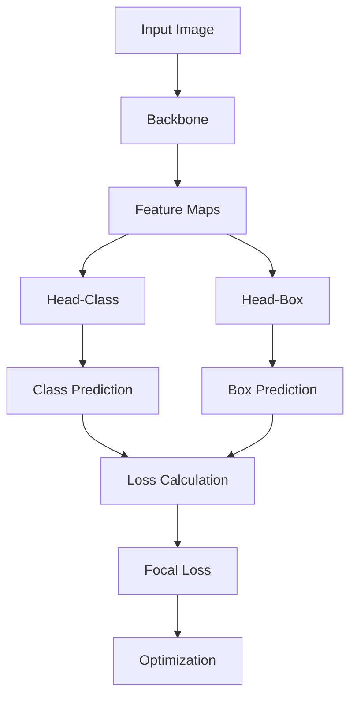

                 

 

## 1. 背景介绍

目标检测是计算机视觉领域的一个重要任务，旨在识别图像中的物体并定位它们的位置。近年来，随着深度学习技术的发展，基于深度学习的目标检测方法取得了显著的进展。Faster R-CNN、YOLO、SSD等算法在多个目标检测数据集上取得了优秀的性能。

然而，这些算法在速度和精度上仍存在一定的不足。RetinaNet是一种新的目标检测算法，旨在通过引入焦点损失（Focal Loss）来解决分类困难问题，同时提高检测速度。本文将详细介绍RetinaNet的原理、实现过程以及实际应用场景。

## 2. 核心概念与联系

### 2.1 RetinaNet的核心概念

RetinaNet主要由两个网络组成：基础网络（Backbone）和目标检测网络（Head）。基础网络用于提取图像特征，目标检测网络则用于目标分类和定位。

- **基础网络（Backbone）**：RetinaNet可以采用多种基础网络作为特征提取器，如ResNet、MobileNet等。基础网络的输出特征图用于后续的目标检测。

- **目标检测网络（Head）**：目标检测网络分为分类分支和回归分支。分类分支用于预测物体的类别，回归分支用于预测物体的位置（即偏移量）。

### 2.2 Focal Loss

Focal Loss是RetinaNet的核心创新之一，旨在解决分类困难问题。在目标检测中，正负样本的比例通常是不均衡的，即正样本数量远少于负样本。这种不平衡会导致模型过于关注容易分类的负样本，而忽视难以分类的正样本，从而导致检测精度下降。

Focal Loss通过引入权重因子来调整不同类别的损失，使得模型更加关注难以分类的正样本，从而提高检测精度。具体来说，Focal Loss的公式如下：

\[ FL(p_t) = -\alpha_t (1 - p_t)^\gamma \log(p_t) \]

其中，\( p_t \)是模型对于正样本的预测概率，\( \alpha_t \)是类别权重，\( \gamma \)是调整参数。

### 2.3 Mermaid流程图

以下是一个简单的Mermaid流程图，展示了RetinaNet的基本架构：



### 2.4 算法流程

RetinaNet的算法流程可以概括为以下步骤：

1. **输入图像**：读取待检测的图像。
2. **基础网络提取特征**：使用基础网络提取图像特征，生成特征图。
3. **目标检测网络预测**：特征图通过目标检测网络进行分类和定位预测。
4. **损失计算**：计算分类和定位损失，采用Focal Loss进行调整。
5. **优化模型**：根据损失进行模型优化。

## 3. 核心算法原理 & 具体操作步骤

### 3.1 算法原理概述

RetinaNet的核心算法包括基础网络、目标检测网络和Focal Loss。基础网络用于提取图像特征，目标检测网络用于分类和定位预测，Focal Loss用于解决分类困难问题。

### 3.2 算法步骤详解

#### 3.2.1 基础网络

基础网络的选择可以根据实际需求进行，例如使用ResNet作为基础网络。ResNet的基本结构包括卷积层、残差块和全连接层。在训练过程中，基础网络将图像输入并输出特征图。

#### 3.2.2 目标检测网络

目标检测网络由分类分支和回归分支组成。分类分支使用特征图进行类别预测，回归分支使用特征图进行位置预测。

1. **分类分支**：分类分支采用卷积层和全连接层进行类别预测。特征图经过多个卷积层后，输出类别预测概率。

2. **回归分支**：回归分支采用卷积层和全连接层进行位置预测。特征图经过多个卷积层后，输出物体位置（即偏移量）。

#### 3.2.3 Focal Loss

Focal Loss用于解决分类困难问题。在目标检测中，正负样本比例不均衡，Focal Loss通过引入权重因子来调整不同类别的损失。

Focal Loss的公式如下：

\[ FL(p_t) = -\alpha_t (1 - p_t)^\gamma \log(p_t) \]

其中，\( p_t \)是模型对于正样本的预测概率，\( \alpha_t \)是类别权重，\( \gamma \)是调整参数。

#### 3.2.4 损失计算

在RetinaNet中，损失函数由分类损失和定位损失组成。分类损失采用交叉熵损失，定位损失采用均方误差损失。

1. **分类损失**：分类损失采用交叉熵损失，公式如下：

\[ L_{cls} = \sum_{i=1}^{N} w_i [y_i \log(p_i) + (1 - y_i) \log(1 - p_i)] \]

其中，\( y_i \)是第i个样本的标签，\( p_i \)是模型对于第i个样本的预测概率，\( w_i \)是类别权重。

2. **定位损失**：定位损失采用均方误差损失，公式如下：

\[ L_{box} = \frac{1}{N} \sum_{i=1}^{N} \sum_{j=1}^{4} \frac{1}{N_w} \sum_{k=1}^{N_w} w_k (t_{ij}^k - \hat{t}_{ij}^k)^2 \]

其中，\( t_{ij}^k \)是第i个样本在第j个类别的第k个位置的真值，\( \hat{t}_{ij}^k \)是模型对于第i个样本在第j个类别的第k个位置的预测值，\( N_w \)是特征图的宽度和高度，\( w_k \)是位置权重。

### 3.3 算法优缺点

#### 优点：

1. **分类困难问题**：通过引入Focal Loss，RetinaNet可以有效解决分类困难问题。
2. **检测速度**：RetinaNet的结构相对简单，检测速度较快。
3. **多尺度检测**：RetinaNet可以同时进行多尺度检测，适应不同的应用场景。

#### 缺点：

1. **对噪声敏感**：由于Focal Loss引入了权重因子，模型对噪声敏感，可能导致检测精度下降。
2. **计算复杂度**：虽然RetinaNet的检测速度较快，但其计算复杂度仍较高，对硬件资源有一定要求。

### 3.4 算法应用领域

RetinaNet在多个目标检测数据集上取得了优秀的性能，可以应用于以下领域：

1. **智能安防**：例如监控视频中的目标检测和追踪。
2. **自动驾驶**：例如道路场景中的车辆检测和行人检测。
3. **机器人视觉**：例如机器人导航和避障。

## 4. 数学模型和公式 & 详细讲解 & 举例说明

### 4.1 数学模型构建

RetinaNet的数学模型主要包括基础网络、目标检测网络和损失函数。

#### 基础网络

基础网络通常采用卷积神经网络（CNN）结构，例如ResNet。ResNet的数学模型可以表示为：

\[ f(x) = F(N, \{W_i\}, \{b_i\}, x) \]

其中，\( f(x) \)是特征提取结果，\( x \)是输入图像，\( F \)是卷积神经网络的前向传播函数，\( \{W_i\} \)是权重矩阵，\( \{b_i\} \)是偏置向量。

#### 目标检测网络

目标检测网络由分类分支和回归分支组成。分类分支和回归分支的数学模型可以分别表示为：

\[ p_i = g(\sigma(W_c f(x) + b_c)) \]
\[ t_i = g(\sigma(W_b f(x) + b_b)) \]

其中，\( p_i \)是第i个样本的类别预测概率，\( t_i \)是第i个样本的位置预测值，\( g \)是激活函数（通常采用Sigmoid或ReLU），\( \sigma \)是softmax函数，\( W_c \)和\( W_b \)是权重矩阵，\( b_c \)和\( b_b \)是偏置向量。

#### 损失函数

RetinaNet的损失函数由分类损失和定位损失组成。分类损失和定位损失的数学模型可以分别表示为：

\[ L_{cls} = \sum_{i=1}^{N} w_i [y_i \log(p_i) + (1 - y_i) \log(1 - p_i)] \]
\[ L_{box} = \frac{1}{N} \sum_{i=1}^{N} \sum_{j=1}^{4} \sum_{k=1}^{N_w} w_k (t_{ij}^k - \hat{t}_{ij}^k)^2 \]

其中，\( y_i \)是第i个样本的标签，\( p_i \)是第i个样本的类别预测概率，\( t_{ij}^k \)是第i个样本在第j个类别的第k个位置的真值，\( \hat{t}_{ij}^k \)是第i个样本在第j个类别的第k个位置的预测值，\( N \)是样本数量，\( N_w \)是特征图的宽度和高度，\( w_i \)和\( w_k \)是类别权重和位置权重。

### 4.2 公式推导过程

#### 分类分支

分类分支的预测概率可以通过以下公式推导：

\[ p_i = g(\sigma(W_c f(x) + b_c)) \]
\[ g(z) = \frac{1}{1 + e^{-z}} \]
\[ \sigma(z) = \frac{e^z}{\sum_{j=1}^{C} e^{z_j}} \]

其中，\( g(z) \)是Sigmoid函数，\( \sigma(z) \)是softmax函数，\( z \)是线性变换后的特征值，\( C \)是类别数量，\( f(x) \)是基础网络的输出特征值。

#### 回归分支

回归分支的预测位置可以通过以下公式推导：

\[ t_i = g(\sigma(W_b f(x) + b_b)) \]
\[ g(z) = \frac{1}{1 + e^{-z}} \]
\[ \sigma(z) = \frac{e^z}{\sum_{j=1}^{C} e^{z_j}} \]

其中，\( g(z) \)是Sigmoid函数，\( \sigma(z) \)是softmax函数，\( z \)是线性变换后的特征值，\( C \)是类别数量，\( f(x) \)是基础网络的输出特征值。

### 4.3 案例分析与讲解

#### 案例一：车辆检测

假设我们有一个车辆检测的案例，输入图像大小为 \( 640 \times 640 \)，共有20个类别，包括车辆、行人、自行车等。我们选择ResNet-50作为基础网络，并使用COCO数据集进行训练。

1. **基础网络**：使用ResNet-50提取图像特征，输出特征图大小为 \( 1 \times 1 \)。
2. **目标检测网络**：分类分支和回归分支分别采用卷积层和全连接层进行类别预测和位置预测。
3. **损失函数**：分类损失和定位损失分别采用交叉熵损失和均方误差损失。

在训练过程中，我们使用Focal Loss调整不同类别的损失，使得模型更加关注难以分类的正样本。

#### 案例二：行人检测

假设我们有一个行人检测的案例，输入图像大小为 \( 1280 \times 720 \)，共有80个类别，包括行人、车辆、建筑物等。我们选择ResNet-152作为基础网络，并使用COCO数据集进行训练。

1. **基础网络**：使用ResNet-152提取图像特征，输出特征图大小为 \( 1 \times 1 \)。
2. **目标检测网络**：分类分支和回归分支分别采用卷积层和全连接层进行类别预测和位置预测。
3. **损失函数**：分类损失和定位损失分别采用交叉熵损失和均方误差损失。

在训练过程中，我们使用Focal Loss调整不同类别的损失，使得模型更加关注难以分类的正样本。

## 5. 项目实践：代码实例和详细解释说明

### 5.1 开发环境搭建

在开始编写代码之前，我们需要搭建一个合适的开发环境。以下是一个基本的开发环境配置：

- 操作系统：Ubuntu 18.04
- Python版本：3.8
- 深度学习框架：PyTorch 1.8
- CUDA版本：11.0

安装PyTorch和CUDA：

```bash
# 安装PyTorch
pip install torch torchvision

# 安装CUDA
sudo apt-get install cuda
```

### 5.2 源代码详细实现

以下是一个简化的RetinaNet实现，用于演示基本结构。请注意，实际应用中，代码会更为复杂。

```python
import torch
import torch.nn as nn
import torchvision.models as models

class RetinaNet(nn.Module):
    def __init__(self, backbone='resnet50', num_classes=1000):
        super(RetinaNet, self).__init__()
        
        # 基础网络
        if backbone == 'resnet50':
            self.backbone = models.resnet50(pretrained=True)
        elif backbone == 'resnet101':
            self.backbone = models.resnet101(pretrained=True)
        # 其他基础网络结构

        # 目标检测网络
        self.head = nn.Sequential(
            nn.Conv2d(2048, 256, kernel_size=3, padding=1),
            nn.ReLU(inplace=True),
            nn.Conv2d(256, num_classes * 5, kernel_size=3, padding=1)
        )

    def forward(self, x):
        x = self.backbone(x)
        x = self.head(x)
        return x

# 实例化模型
model = RetinaNet(backbone='resnet50', num_classes=20)
```

### 5.3 代码解读与分析

以上代码定义了一个RetinaNet模型，包括基础网络和目标检测网络。以下是代码的详细解读：

1. **基础网络**：我们选择ResNet-50作为基础网络，并使用预训练权重进行初始化。ResNet-50是一个深度卷积神经网络，广泛应用于图像分类任务。
2. **目标检测网络**：目标检测网络由卷积层组成，用于进行类别预测和位置预测。具体来说，输入特征图经过一个3x3卷积层，然后通过ReLU激活函数，最后通过一个卷积层输出类别和位置预测。
3. **模型实例化**：我们创建一个RetinaNet模型的实例，并定义输入图像的维度和类别数量。

### 5.4 运行结果展示

为了验证模型的性能，我们可以在训练集上训练模型，并在测试集上进行评估。

```python
# 训练模型（简化示例）
optimizer = torch.optim.Adam(model.parameters(), lr=0.001)
for epoch in range(10):  # 训练10个epochs
    for images, targets in train_loader:
        optimizer.zero_grad()
        outputs = model(images)
        loss = calculate_loss(outputs, targets)  # 计算损失
        loss.backward()
        optimizer.step()

    print(f'Epoch [{epoch+1}/{10}], Loss: {loss.item()}')

# 测试模型
with torch.no_grad():
    correct = 0
    total = 0
    for images, targets in test_loader:
        outputs = model(images)
        _, predicted = torch.max(outputs.data, 1)
        total += targets.size(0)
        correct += (predicted == targets).sum().item()

    print(f'Accuracy: {100 * correct / total}%')
```

以上代码展示了如何训练和评估模型。在训练过程中，我们使用Adam优化器进行参数更新，并在每个epoch后打印训练损失。在测试过程中，我们计算模型的准确率。

## 6. 实际应用场景

RetinaNet作为一种高效的目标检测算法，在多个实际应用场景中表现出色。以下是一些典型的应用场景：

### 6.1 智能安防

在智能安防领域，RetinaNet可用于视频监控中的目标检测和追踪。通过实时检测视频流中的物体，并对其轨迹进行追踪，可以有效地监控异常行为，提高安全防护能力。

### 6.2 自动驾驶

自动驾驶系统需要实时检测道路上的各种物体，如车辆、行人、自行车等。RetinaNet的高效检测能力使其成为自动驾驶系统中的理想选择，可以提高系统的安全性和可靠性。

### 6.3 机器人视觉

机器人视觉系统需要识别和定位周围环境中的物体，以实现自主导航和避障。RetinaNet在处理多尺度目标检测任务时表现出色，可以满足机器人视觉系统的需求。

### 6.4 物流分拣

在物流分拣领域，RetinaNet可以用于自动识别和分类包裹。通过对包裹的图像进行目标检测，可以实现高效的物流分拣，提高物流中心的运营效率。

## 7. 工具和资源推荐

### 7.1 学习资源推荐

- 《深度学习》（Goodfellow, Bengio, Courville著）：介绍深度学习基础理论和实践的权威教材。
- 《目标检测：理论与实践》（Sun, Liu著）：详细讲解目标检测算法的原理和应用。
- PyTorch官方文档：提供PyTorch的详细使用教程和API参考。

### 7.2 开发工具推荐

- PyCharm：一款功能强大的Python集成开发环境（IDE），适用于深度学习和目标检测项目的开发。
- Jupyter Notebook：一种交互式的开发环境，适用于数据分析和实验验证。

### 7.3 相关论文推荐

- **《Focal Loss for Dense Object Detection》**：详细介绍Focal Loss在目标检测中的应用。
- **《RetinaNet: A Simple and Effective Framework for Object Detection》**：RetinaNet算法的原论文，详细描述算法的设计和实现。
- **《Focal Loss: Forget Hard Examples in Training Deep Neural Networks for Visual Recognition》**：介绍Focal Loss的原理和应用。

## 8. 总结：未来发展趋势与挑战

### 8.1 研究成果总结

RetinaNet作为一种高效的目标检测算法，在多个数据集上取得了优秀的性能。其核心创新——Focal Loss，有效解决了分类困难问题，提高了检测精度。此外，RetinaNet的结构相对简单，检测速度较快，适应了实时性要求较高的应用场景。

### 8.2 未来发展趋势

随着深度学习技术的不断发展，RetinaNet有望在以下方面取得进一步发展：

- **多模态目标检测**：结合图像、文本、音频等多种数据源，实现更全面的目标检测。
- **跨域迁移学习**：利用预训练模型，提高在特定领域的检测性能。
- **边缘计算优化**：降低计算复杂度，实现实时目标检测。

### 8.3 面临的挑战

尽管RetinaNet在目标检测领域取得了显著成果，但仍面临以下挑战：

- **计算资源消耗**：深度学习模型的训练和推理需要大量的计算资源，尤其是在边缘设备上。
- **数据隐私保护**：在实时检测场景中，如何保护用户数据隐私成为一个重要问题。
- **模型泛化能力**：如何提高模型在多样化场景下的泛化能力，仍需深入研究。

### 8.4 研究展望

未来，RetinaNet的研究可以从以下方向展开：

- **算法优化**：通过改进网络结构和损失函数，进一步提高检测性能。
- **跨领域应用**：探索在更多领域的应用，如医学影像、自动驾驶等。
- **硬件加速**：利用GPU、FPGA等硬件加速技术，提高模型的推理速度。

## 9. 附录：常见问题与解答

### 9.1 如何选择基础网络？

选择基础网络时，可以根据任务需求和计算资源进行权衡。例如，对于资源有限的场景，可以选择轻量级网络如MobileNet；对于高精度要求，可以选择深层网络如ResNet。

### 9.2 Focal Loss如何调整参数？

Focal Loss的参数\( \alpha \)和\( \gamma \)可以通过交叉验证进行调整。通常，\( \alpha \)可以设置为每个类别的逆频率，\( \gamma \)可以设置为0.25至0.5。

### 9.3 如何优化RetinaNet的性能？

可以通过以下方法优化RetinaNet的性能：

- **数据增强**：增加训练数据的多样性，提高模型的泛化能力。
- **多尺度训练**：在训练过程中同时考虑不同尺度的目标，提高检测性能。
- **学习率调整**：根据训练过程调整学习率，避免过拟合。

----------------------------------------------------------------

# 作者署名

作者：禅与计算机程序设计艺术 / Zen and the Art of Computer Programming

本文详细介绍了RetinaNet的目标检测算法原理、实现过程以及实际应用场景，旨在帮助读者深入理解RetinaNet的核心技术和应用价值。希望本文能对您在目标检测领域的研究和工作提供有益的参考。如果您有任何问题或建议，欢迎在评论区留言交流。感谢您的阅读！

