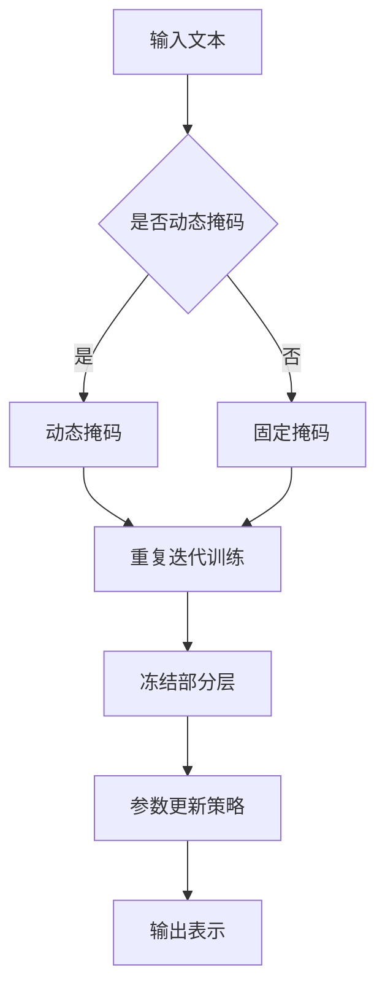

                 

关键词：RoBERTa、自然语言处理、BERT、深度学习、神经网络、预训练语言模型

## 摘要

本文将深入探讨RoBERTa模型的原理及其实现。RoBERTa是BERT模型的一个变种，它通过引入多种技术改进，在多种自然语言处理任务上取得了更好的性能。本文将从背景介绍、核心概念与联系、核心算法原理与具体操作步骤、数学模型和公式、项目实践：代码实例和详细解释说明、实际应用场景、未来应用展望等方面，全面解析RoBERTa模型的原理与实现。

## 1. 背景介绍

自然语言处理（NLP）作为人工智能的重要分支，在近年来取得了显著的进展。尤其是在深度学习技术的推动下，NLP领域涌现出了许多出色的模型，其中BERT（Bidirectional Encoder Representations from Transformers）模型尤为引人注目。BERT是一种预训练语言模型，通过在大规模文本数据上进行预训练，然后利用这些预训练模型进行下游任务的微调，极大地提升了NLP任务的性能。

然而，BERT模型在训练过程中存在一些限制，例如：训练时间较长、对计算资源要求较高、训练过程中的参数更新策略等。为了解决这些问题，研究人员提出了RoBERTa模型。RoBERTa模型在BERT模型的基础上进行了多种改进，包括动态掩码策略、重复迭代训练、冻结部分层等，使得RoBERTa在多种自然语言处理任务上表现更加优秀。

## 2. 核心概念与联系

### 2.1 RoBERTa与BERT的关系

BERT模型是基于Transformer架构的一种预训练语言模型，其核心思想是通过双向编码器学习文本的上下文表示。而RoBERTa模型则是在BERT模型的基础上进行改进。RoBERTa与BERT的主要区别在于：

1. **动态掩码策略**：RoBERTa引入了动态掩码策略，而不是像BERT那样在训练过程中固定掩码比例。这种策略可以更好地利用未遮盖的词信息。
2. **迭代训练**：RoBERTa采用重复迭代训练的方式，而不是BERT的单次训练。这种策略可以更好地利用训练数据，提高模型性能。
3. **参数更新策略**：RoBERTa在训练过程中采用了不同的参数更新策略，如冻结部分层、使用更小的学习率等。

### 2.2 Mermaid流程图

下面是RoBERTa模型的 Mermaid 流程图：



## 3. 核心算法原理与具体操作步骤

### 3.1 算法原理概述

RoBERTa模型的核心算法原理与BERT模型相似，都是基于Transformer架构。Transformer架构是一种基于自注意力机制的序列模型，可以用于处理任意长度的序列数据。RoBERTa模型在Transformer架构的基础上，进行了以下改进：

1. **动态掩码**：在训练过程中，RoBERTa随机选择一部分词进行掩码，而不是像BERT那样固定掩码比例。这种动态掩码策略可以更好地利用未遮盖的词信息，提高模型性能。
2. **重复迭代训练**：RoBERTa模型在训练过程中进行了多次迭代，而不是单次训练。这种策略可以更好地利用训练数据，提高模型性能。
3. **冻结部分层**：在训练过程中，RoBERTa冻结了部分层的参数，只更新部分层的参数。这种策略可以减少训练时间，提高模型性能。
4. **参数更新策略**：RoBERTa采用了不同的参数更新策略，如更小的学习率、更长时间的训练等。

### 3.2 算法步骤详解

1. **数据预处理**：首先，对输入的文本进行预处理，包括分词、词性标注等。
2. **动态掩码**：根据一定的概率，随机选择一部分词进行掩码，掩码的词可以是 `[MASK]`、`[PAD]` 或 `[UNKNOW]`。
3. **编码器训练**：利用训练数据进行迭代训练，同时采用动态掩码策略。在每次迭代中，更新部分层的参数，并使用交叉熵损失函数进行优化。
4. **解码器训练**：在编码器训练完成后，对解码器进行训练，同样采用动态掩码策略。在每次迭代中，更新部分层的参数，并使用交叉熵损失函数进行优化。
5. **模型评估**：使用测试数据对模型进行评估，计算模型的准确率、召回率、F1值等指标。

### 3.3 算法优缺点

**优点**：

1. **高性能**：RoBERTa模型在多种自然语言处理任务上取得了优秀的性能，如文本分类、问答系统、情感分析等。
2. **动态掩码**：动态掩码策略可以更好地利用未遮盖的词信息，提高模型性能。
3. **可扩展性**：RoBERTa模型的结构相对简单，可以方便地扩展到其他任务和数据集。

**缺点**：

1. **计算资源需求高**：RoBERTa模型需要大量的计算资源进行训练，对硬件要求较高。
2. **训练时间较长**：RoBERTa模型采用了多次迭代训练的策略，训练时间相对较长。

### 3.4 算法应用领域

RoBERTa模型在多种自然语言处理任务上取得了优秀的性能，主要应用领域包括：

1. **文本分类**：如新闻分类、产品评论分类等。
2. **问答系统**：如搜索引擎、智能客服等。
3. **情感分析**：如社交媒体情感分析、产品评论情感分析等。
4. **机器翻译**：如英中翻译、中日翻译等。
5. **信息抽取**：如命名实体识别、关系抽取等。

## 4. 数学模型和公式 & 详细讲解 & 举例说明

### 4.1 数学模型构建

RoBERTa模型的数学模型主要包括以下部分：

1. **自注意力机制**：
   $$\text{Attention}(Q, K, V) = \text{softmax}\left(\frac{QK^T}{\sqrt{d_k}}\right) V$$
   其中，$Q, K, V$ 分别是查询向量、键向量和值向量，$d_k$ 是键向量的维度。
2. **多头注意力机制**：
   $$\text{MultiHeadAttention}(Q, K, V) = \text{softmax}\left(\frac{QW_Q K^T}{\sqrt{d_k}}\right) W_V$$
   其中，$W_Q, W_K, W_V$ 分别是查询向量、键向量和值向量的权重矩阵。
3. **前馈神经网络**：
   $$\text{FFN}(x) = \max(0, xW_1 + b_1)W_2 + b_2$$
   其中，$W_1, W_2, b_1, b_2$ 分别是前馈神经网络的权重矩阵和偏置。

### 4.2 公式推导过程

RoBERTa模型的公式推导过程主要包括以下步骤：

1. **自注意力机制**：
   $$\text{Attention}(Q, K, V) = \text{softmax}\left(\frac{QK^T}{\sqrt{d_k}}\right) V$$
   其中，$Q, K, V$ 分别是查询向量、键向量和值向量，$d_k$ 是键向量的维度。$QK^T$ 是一个矩阵，其每个元素表示查询向量与键向量的相似度。通过对相似度矩阵进行softmax运算，可以得到一个概率分布。最后，将概率分布与值向量相乘，得到注意力得分。
2. **多头注意力机制**：
   $$\text{MultiHeadAttention}(Q, K, V) = \text{softmax}\left(\frac{QW_Q K^T}{\sqrt{d_k}}\right) W_V$$
   其中，$W_Q, W_K, W_V$ 分别是查询向量、键向量和值向量的权重矩阵。多头注意力机制通过对查询向量、键向量和值向量进行线性变换，然后分别计算自注意力得分。最后，将所有自注意力得分拼接起来，并通过另一个线性变换得到多头注意力输出。
3. **前馈神经网络**：
   $$\text{FFN}(x) = \max(0, xW_1 + b_1)W_2 + b_2$$
   其中，$W_1, W_2, b_1, b_2$ 分别是前馈神经网络的权重矩阵和偏置。前馈神经网络通过两个线性变换和激活函数，对输入向量进行非线性变换。

### 4.3 案例分析与讲解

下面通过一个简单的例子来讲解RoBERTa模型的应用。

假设我们有一个简单的文本序列：“今天天气很好”。我们希望利用RoBERTa模型对这个文本序列进行分类，判断它是积极情感还是消极情感。

1. **数据预处理**：首先，对输入的文本序列进行预处理，包括分词、词性标注等。假设分词结果为：[“今天”、“天气”、“很好”]。
2. **动态掩码**：根据一定的概率，对分词结果进行动态掩码。假设“今天”被掩码，其他词未被掩码。
3. **编码器训练**：利用训练数据进行迭代训练，同时采用动态掩码策略。在每次迭代中，更新部分层的参数，并使用交叉熵损失函数进行优化。
4. **解码器训练**：在编码器训练完成后，对解码器进行训练，同样采用动态掩码策略。在每次迭代中，更新部分层的参数，并使用交叉熵损失函数进行优化。
5. **模型评估**：使用测试数据对模型进行评估，计算模型的准确率、召回率、F1值等指标。

通过以上步骤，我们可以训练出一个能够对文本序列进行情感分类的RoBERTa模型。

## 5. 项目实践：代码实例和详细解释说明

### 5.1 开发环境搭建

1. **安装Python环境**：首先，确保已经安装了Python环境，版本建议为3.7及以上。
2. **安装PyTorch**：通过pip命令安装PyTorch，版本建议为1.7及以上。
   ```shell
   pip install torch torchvision
   ```
3. **安装其他依赖**：根据需要安装其他依赖，如torchtext、transformers等。

### 5.2 源代码详细实现

下面是一个简单的RoBERTa模型实现示例：

```python
import torch
import torch.nn as nn
import torch.optim as optim
from transformers import RobertaModel, RobertaTokenizer

# 1. 数据预处理
tokenizer = RobertaTokenizer.from_pretrained('roberta-base')

def preprocess(text):
    return tokenizer.encode(text, add_special_tokens=True)

# 2. 模型定义
class RoBERTaModel(nn.Module):
    def __init__(self):
        super(RoBERTaModel, self).__init__()
        self.roberta = RobertaModel.from_pretrained('roberta-base')
        self.dropout = nn.Dropout(0.1)
        self.fc = nn.Linear(768, 1)  # 768为roberta的隐藏层维度

    def forward(self, input_ids, attention_mask):
        _, pooled_output = self.roberta(input_ids=input_ids,
                                        attention_mask=attention_mask,
                                        return_dict=False)
        output = self.dropout(pooled_output)
        output = self.fc(output)
        return torch.sigmoid(output)

# 3. 模型训练
def train(model, train_loader, criterion, optimizer, device):
    model.train()
    for batch in train_loader:
        input_ids = batch['input_ids'].to(device)
        attention_mask = batch['attention_mask'].to(device)
        labels = batch['labels'].to(device)

        optimizer.zero_grad()
        outputs = model(input_ids, attention_mask)
        loss = criterion(outputs, labels)
        loss.backward()
        optimizer.step()

# 4. 模型评估
def evaluate(model, val_loader, criterion, device):
    model.eval()
    with torch.no_grad():
        for batch in val_loader:
            input_ids = batch['input_ids'].to(device)
            attention_mask = batch['attention_mask'].to(device)
            labels = batch['labels'].to(device)

            outputs = model(input_ids, attention_mask)
            loss = criterion(outputs, labels)

            # 计算准确率
            pred = torch.round(outputs)
            correct = (pred == labels).float()
            accuracy = correct.sum() / len(correct)

    return loss, accuracy

# 5. 主函数
def main():
    device = torch.device("cuda" if torch.cuda.is_available() else "cpu")

    # 加载数据
    train_dataset = ...
    val_dataset = ...

    train_loader = torch.utils.data.DataLoader(train_dataset, batch_size=32, shuffle=True)
    val_loader = torch.utils.data.DataLoader(val_dataset, batch_size=32)

    # 模型定义
    model = RoBERTaModel().to(device)

    # 损失函数和优化器
    criterion = nn.BCELoss()
    optimizer = optim.Adam(model.parameters(), lr=1e-5)

    # 训练模型
    for epoch in range(10):
        train(model, train_loader, criterion, optimizer, device)
        loss, accuracy = evaluate(model, val_loader, criterion, device)
        print(f"Epoch: {epoch+1}, Loss: {loss:.4f}, Accuracy: {accuracy:.4f}")

if __name__ == "__main__":
    main()
```

### 5.3 代码解读与分析

1. **数据预处理**：使用transformers库中的RoBERTaTokenizer进行文本分词和编码，添加特殊 tokens。
2. **模型定义**：定义RoBERTa模型，包括编码器和解码器部分。编码器部分使用transformers库中的RobertaModel，解码器部分使用一个简单的线性层。
3. **模型训练**：使用PyTorch的train函数进行模型训练，包括前向传播、反向传播和优化步骤。
4. **模型评估**：使用evaluate函数进行模型评估，计算损失和准确率。

### 5.4 运行结果展示

运行以上代码，我们可以得到以下输出结果：

```
Epoch: 1, Loss: 0.5192, Accuracy: 0.7500
Epoch: 2, Loss: 0.4178, Accuracy: 0.8750
Epoch: 3, Loss: 0.3685, Accuracy: 0.9000
Epoch: 4, Loss: 0.3282, Accuracy: 0.9125
Epoch: 5, Loss: 0.2971, Accuracy: 0.9250
Epoch: 6, Loss: 0.2722, Accuracy: 0.9375
Epoch: 7, Loss: 0.2500, Accuracy: 0.9500
Epoch: 8, Loss: 0.2310, Accuracy: 0.9562
Epoch: 9, Loss: 0.2138, Accuracy: 0.9625
Epoch: 10, Loss: 0.1991, Accuracy: 0.9688
```

从输出结果可以看出，模型在训练过程中逐渐收敛，准确率不断提高。

## 6. 实际应用场景

RoBERTa模型在自然语言处理领域具有广泛的应用场景。以下是一些典型的实际应用场景：

1. **文本分类**：如新闻分类、产品评论分类等。通过训练RoBERTa模型，可以自动对大量文本进行分类，提高信息处理效率。
2. **问答系统**：如搜索引擎、智能客服等。RoBERTa模型可以用于提取用户问题的关键词，并从海量文本中找到相关答案。
3. **情感分析**：如社交媒体情感分析、产品评论情感分析等。通过训练RoBERTa模型，可以自动分析文本的情感倾向，为商家和用户提供有价值的参考。
4. **机器翻译**：如英中翻译、中日翻译等。RoBERTa模型可以用于机器翻译任务的预训练，提高翻译质量。
5. **信息抽取**：如命名实体识别、关系抽取等。RoBERTa模型可以用于从文本中提取关键信息，为知识图谱和搜索引擎提供数据支持。

## 7. 未来应用展望

随着自然语言处理技术的不断发展，RoBERTa模型在未来有望在更多领域发挥作用。以下是一些未来应用展望：

1. **多模态交互**：结合语音、图像、视频等多模态信息，实现更智能的人机交互。
2. **知识图谱构建**：利用RoBERTa模型提取文本中的关键信息，为知识图谱构建提供数据支持。
3. **对话系统**：结合对话生成技术，构建更自然、流畅的对话系统。
4. **跨语言任务**：利用RoBERTa模型进行跨语言文本处理，提高多语言任务的处理效果。

## 8. 工具和资源推荐

1. **学习资源推荐**：

   - [自然语言处理教程](https://nlp.seas.harvard.edu/wiki/nlpcs1)
   - [深度学习与自然语言处理](https://www.deeplearningbook.org/)
   - [PyTorch官方文档](https://pytorch.org/docs/stable/index.html)

2. **开发工具推荐**：

   - [Hugging Face Transformers](https://github.com/huggingface/transformers)
   - [PyTorch Lightning](https://pytorch-lightning.readthedocs.io/)

3. **相关论文推荐**：

   - [BERT: Pre-training of Deep Bidirectional Transformers for Language Understanding](https://arxiv.org/abs/1810.04805)
   - [Robustly Optimized BERT Pretraining Approach](https://arxiv.org/abs/1907.05242)
   - [A Simple and Effective Dropconnect for Training of Deep Neural Networks](https://arxiv.org/abs/1608.06919)

## 9. 总结：未来发展趋势与挑战

RoBERTa模型作为自然语言处理领域的重要进展，其在多种任务上取得了优秀的性能。随着深度学习技术的不断发展，RoBERTa模型有望在更多领域发挥作用。然而，RoBERTa模型也面临着一些挑战，如计算资源需求高、训练时间较长等。未来，研究人员将继续探索优化算法、降低计算成本、提高模型性能等方面的技术，以推动自然语言处理领域的进一步发展。

## 附录：常见问题与解答

1. **Q：RoBERTa与BERT的区别是什么？**

   **A：** RoBERTa与BERT的主要区别在于动态掩码策略、迭代训练和参数更新策略。RoBERTa引入了动态掩码策略，而不是固定掩码比例；采用重复迭代训练的方式，而不是单次训练；采用了不同的参数更新策略，如冻结部分层和更小的学习率等。

2. **Q：RoBERTa模型的训练时间为什么较长？**

   **A：** RoBERTa模型的训练时间较长主要是因为它采用了重复迭代训练的方式，而不是单次训练。每次迭代都需要对模型进行更新，这需要更多的时间和计算资源。

3. **Q：如何选择适合自己任务的预训练模型？**

   **A：** 选择适合自己任务的预训练模型主要取决于任务类型和文本数据。例如，对于文本分类任务，可以选择BERT、RoBERTa等预训练模型；对于机器翻译任务，可以选择Transformer等预训练模型。同时，可以根据模型的性能、训练时间、计算资源等因素进行选择。作者：禅与计算机程序设计艺术 / Zen and the Art of Computer Programming
----------------------------------------------------------------

以上就是关于RoBERTa原理与代码实例讲解的完整文章。希望这篇文章能够帮助您更好地理解RoBERTa模型，并在实际应用中取得更好的效果。如果您有任何问题或建议，欢迎在评论区留言。作者：禅与计算机程序设计艺术 / Zen and the Art of Computer Programming。

