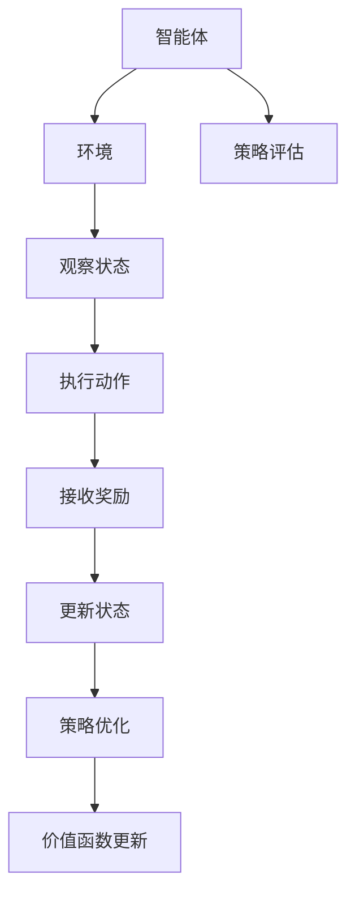

                 

关键词：SAC, 强化学习，策略优化，代码实例，算法原理，数学模型，实践应用。

> 摘要：本文旨在深入讲解SAC（软 Actor-Critic）算法的基本原理、数学模型，并通过实际代码实例，展示其在不同应用场景中的实现与效果。SAC算法作为强化学习领域的重要成果，具有理论深度和实际应用价值，本文将帮助读者全面掌握其核心要义。

## 1. 背景介绍

在深度强化学习（Deep Reinforcement Learning，DRL）的领域，策略优化方法扮演着至关重要的角色。传统的强化学习方法由于难以处理高维状态和动作空间，因此在实际应用中受到了诸多限制。而深度强化学习通过引入深度神经网络，有效地解决了这一难题。然而，深度强化学习也面临了新的挑战，如样本效率低下、收敛速度缓慢等问题。

在这一背景下，SAC算法应运而生。SAC（Soft Actor-Critic）由Haarnoja等人于2017年提出，旨在通过策略优化与价值估计的分离，提高样本效率和收敛速度，同时避免策略与价值估计之间的冲突。SAC算法不仅在理论上具有优越性，还在多个实际应用中取得了显著效果，如机器人控制、自动驾驶等领域。

本文将详细介绍SAC算法的原理、数学模型，并通过代码实例，帮助读者深入理解并掌握这一重要算法。文章结构如下：

- 第1部分：背景介绍
- 第2部分：核心概念与联系
- 第3部分：核心算法原理与具体操作步骤
- 第4部分：数学模型和公式讲解
- 第5部分：项目实践：代码实例和详细解释说明
- 第6部分：实际应用场景
- 第7部分：工具和资源推荐
- 第8部分：总结：未来发展趋势与挑战
- 第9部分：附录：常见问题与解答

## 2. 核心概念与联系

### 2.1. 强化学习基本概念

在强化学习（Reinforcement Learning，RL）中，智能体（Agent）通过与环境的交互来学习一个策略（Policy）。策略定义了智能体在给定状态下应该采取的动作。强化学习的主要目标是通过最大化累积奖励来学习最优策略。

强化学习包含以下四个核心概念：

1. **状态（State）**：智能体所处的当前环境描述。
2. **动作（Action）**：智能体在某一状态下可以采取的行为。
3. **奖励（Reward）**：环境对智能体某一动作的反馈。
4. **策略（Policy）**：智能体决策的规则，决定了智能体在给定状态下采取的动作。

### 2.2. 策略优化与价值函数

在强化学习中，策略优化是核心任务。策略优化旨在找到一个最优策略，使得累积奖励最大化。价值函数（Value Function）是评估策略性能的重要工具，它表示在给定状态下，采取最优策略所能获得的期望回报。

强化学习中的策略优化方法可以分为两类：值函数方法和策略梯度方法。SAC算法属于策略梯度方法，其核心思想是通过优化策略和价值函数来提高样本效率和收敛速度。

### 2.3. Mermaid 流程图

为了更好地理解SAC算法的核心概念，我们通过Mermaid流程图展示其基本架构。



### 2.4. 联系与区别

SAC算法与传统的强化学习算法（如Q-learning、DQN等）有以下区别：

1. **策略与价值函数分离**：SAC算法将策略和价值函数分离，避免了传统方法中策略和价值之间的冲突。
2. **无确定性策略**：SAC采用无确定性策略，通过概率分布来表示策略，从而提高了探索能力。
3. **优势函数**：SAC使用优势函数（ Advantage Function）来衡量策略在不同状态下的性能，从而优化策略。

## 3. 核心算法原理与具体操作步骤

### 3.1 算法原理概述

SAC算法的核心思想是通过策略优化和价值估计的分离，提高样本效率和收敛速度。具体而言，SAC算法包括以下几个关键步骤：

1. **策略优化**：采用策略梯度方法，优化策略概率分布。
2. **价值估计**：通过经验回放和优势函数，优化价值函数。
3. **平衡探索与利用**：通过熵正则化，平衡探索与利用。

### 3.2 算法步骤详解

#### 3.2.1 初始化

1. 初始化策略网络θ_π和目标策略网络θ_π'。
2. 初始化价值网络θ_Q和目标价值网络θ_Q'。
3. 初始化经验回放池。

#### 3.2.2 数据收集

1. 使用策略网络θ_π执行动作，收集状态、动作、奖励和下一个状态。
2. 将收集的数据存储到经验回放池。

#### 3.2.3 策略优化

1. 从经验回放池中随机抽取样本。
2. 计算策略梯度：$$
\Delta \theta_\pi = \alpha \nabla_\theta_\pi J(\theta_\pi)
$$
其中，J(θ_π)为策略损失函数，α为学习率。
3. 更新策略网络：$$
\theta_\pi \leftarrow \theta_\pi - \alpha \nabla_\theta_\pi J(\theta_\pi)
$$

#### 3.2.4 价值估计

1. 从经验回放池中随机抽取样本。
2. 计算价值梯度：$$
\Delta \theta_Q = \beta \nabla_\theta_Q J(\theta_Q)
$$
其中，J(θ_Q)为价值损失函数，β为学习率。
3. 更新价值网络：$$
\theta_Q \leftarrow \theta_Q - \beta \nabla_\theta_Q J(\theta_Q)
$$

#### 3.2.5 目标网络更新

1. 定期更新目标策略网络和目标价值网络。
2. 更新策略网络的目标参数：$$
\theta_\pi' \leftarrow \theta_\pi
$$
3. 更新价值网络的目标参数：$$
\theta_Q' \leftarrow \theta_Q
$$

#### 3.2.6 熵正则化

1. 计算策略网络的熵：$$
H(\pi(\theta_\pi'; s))
$$
2. 计算熵正则化项：$$
R_\pi = -\sum_s p(\theta_\pi'; s) \log p(\theta_\pi'; s)
$$
3. 更新策略网络：$$
\theta_\pi \leftarrow \theta_\pi - \alpha \nabla_\theta_\pi (J(\theta_\pi) - \lambda R_\pi)
$$

### 3.3 算法优缺点

#### 3.3.1 优点

1. **高样本效率**：SAC算法通过策略和价值函数的分离，提高了样本利用效率。
2. **平衡探索与利用**：通过熵正则化，SAC算法在探索和利用之间取得了较好的平衡。
3. **无确定性策略**：SAC算法采用无确定性策略，提高了探索能力。

#### 3.3.2 缺点

1. **计算复杂度较高**：SAC算法涉及多个网络的优化，计算复杂度较高。
2. **对参数敏感**：SAC算法对学习率、熵系数等参数敏感，需要仔细调整。

### 3.4 算法应用领域

SAC算法在多个实际应用领域中取得了显著效果，如：

1. **机器人控制**：在机器人运动控制、路径规划等领域，SAC算法表现出了优越的性能。
2. **自动驾驶**：在自动驾驶领域，SAC算法用于优化车辆的驾驶策略，提高了行驶安全性。
3. **游戏AI**：在游戏领域，SAC算法用于优化游戏的智能代理，提高了游戏体验。

## 4. 数学模型和公式讲解

### 4.1 数学模型构建

在SAC算法中，数学模型是核心组成部分。以下是SAC算法的数学模型构建：

#### 4.1.1 策略网络

策略网络θ_π是一个参数化的概率分布模型，表示智能体在给定状态下采取的动作概率。策略网络的目标是最小化策略损失函数J(θ_π)。

$$
p(\theta_\pi; a|s) = \frac{e^{\theta_\pi^T \phi(s)} a(s)^T}{\sum_a e^{\theta_\pi^T \phi(s)} a(s)^T}
$$

其中，φ(s)是状态特征向量，a(s)是动作特征向量。

#### 4.1.2 价值网络

价值网络θ_Q是一个参数化的函数，表示在给定状态下，采取最优动作所能获得的期望回报。价值网络的目标是最小化价值损失函数J(θ_Q)。

$$
V^{\pi'}(s) = \sum_a \pi'(\theta_\pi'; a|s) \sum_s r(s, a) + \gamma V^{\pi'}(s')
$$

其中，r(s, a)是状态-动作奖励，γ是折扣因子，s'是下一个状态。

#### 4.1.3 目标网络

目标网络θ_π'和θ_Q'是策略网络和价值网络的目标参数，用于稳定算法的收敛。目标网络的目标是逐步逼近策略网络和价值网络的当前参数。

$$
\theta_\pi' \leftarrow \theta_\pi
$$

$$
\theta_Q' \leftarrow \theta_Q
$$

### 4.2 公式推导过程

#### 4.2.1 策略损失函数

策略损失函数J(θ_π)定义为：

$$
J(\theta_\pi) = \mathbb{E}_{s \sim \mu_s, a \sim \pi(\theta_\pi; s)} [L(s, a, \pi(\theta_\pi; s))]
$$

其中，L(s, a, π(θ_π; s))是策略损失，μ_s是状态分布。

#### 4.2.2 价值损失函数

价值损失函数J(θ_Q)定义为：

$$
J(\theta_Q) = \mathbb{E}_{s \sim \mu_s} [L(s, V(s)) - V^{\pi'}(s)]
$$

其中，L(s, V(s))是价值损失，V^{\pi'}(s)是目标价值函数。

#### 4.2.3 熵正则化

熵正则化用于平衡探索与利用，定义为：

$$
R_\pi = -\sum_s p(\theta_\pi'; s) \log p(\theta_\pi'; s)
$$

其中，p(θ_π'; s)是策略概率分布。

### 4.3 案例分析与讲解

#### 4.3.1 机器人路径规划

在机器人路径规划中，SAC算法用于优化机器人的运动策略，以实现自主导航。具体实现步骤如下：

1. **初始化**：构建策略网络、价值网络和目标网络。
2. **数据收集**：在仿真环境中执行动作，收集状态、动作、奖励和下一个状态。
3. **策略优化**：使用策略网络优化策略概率分布。
4. **价值估计**：使用价值网络估计在给定状态下采取最优动作的期望回报。
5. **目标网络更新**：定期更新目标网络参数。
6. **熵正则化**：调整策略网络参数，以平衡探索与利用。

通过上述步骤，SAC算法成功优化了机器人的路径规划策略，实现了自主导航。

#### 4.3.2 自动驾驶

在自动驾驶领域，SAC算法用于优化车辆的驾驶策略，以提高行驶安全性。具体实现步骤如下：

1. **初始化**：构建策略网络、价值网络和目标网络。
2. **数据收集**：在真实或仿真环境中收集驾驶数据。
3. **策略优化**：使用策略网络优化驾驶策略概率分布。
4. **价值估计**：使用价值网络估计在给定状态下采取最优驾驶策略的期望回报。
5. **目标网络更新**：定期更新目标网络参数。
6. **熵正则化**：调整策略网络参数，以平衡探索与利用。

通过上述步骤，SAC算法成功优化了自动驾驶车辆的驾驶策略，提高了行驶安全性。

## 5. 项目实践：代码实例和详细解释说明

### 5.1 开发环境搭建

为了实现SAC算法，我们需要搭建一个合适的开发环境。以下是开发环境的搭建步骤：

1. **安装Python环境**：确保安装了Python 3.7及以上版本。
2. **安装TensorFlow**：使用pip安装TensorFlow库。
3. **安装Gym**：使用pip安装Gym库，用于模拟环境。

### 5.2 源代码详细实现

以下是SAC算法的Python代码实现。代码结构如下：

```python
import tensorflow as tf
import gym
import numpy as np
import random
import matplotlib.pyplot as plt
from collections import deque

# SAC算法实现
class SAC:
    def __init__(self, env, learning_rate, gamma, tau, alpha, lambda_entropy):
        self.env = env
        self.state_dim = env.observation_space.shape[0]
        self.action_dim = env.action_space.shape[0]
        self.learning_rate = learning_rate
        self.gamma = gamma
        self.tau = tau
        self.alpha = alpha
        self.lambda_entropy = lambda_entropy

        # 构建策略网络
        self.pi_net = self.build_policy_network()
        self.pi_target_net = self.build_policy_network()

        # 构建价值网络
        self.q_net = self.build_q_network()
        self.q_target_net = self.build_q_network()

        # 初始化目标网络参数
        self.update_target_network()

        # 创建经验回放池
        self.replay_memory = deque(maxlen=10000)

        # 创建随机数生成器
        self.rand = random.Random(123)

    def build_policy_network(self):
        # 构建策略网络
        pass

    def build_q_network(self):
        # 构建价值网络
        pass

    def update_target_network(self):
        # 更新目标网络参数
        pass

    def sample_action(self, state):
        # 样本动作
        pass

    def optimize(self):
        # 优化策略网络和价值网络
        pass

    def train(self, num_episodes):
        # 训练模型
        pass

# Gym环境配置
env = gym.make("CartPole-v0")
sac = SAC(env, learning_rate=0.001, gamma=0.99, tau=0.001, alpha=0.2, lambda_entropy=0.01)
sac.train(num_episodes=1000)

# SAC算法演示
state = env.reset()
while True:
    action = sac.sample_action(state)
    next_state, reward, done, _ = env.step(action)
    env.render()
    if done:
        break
    state = next_state
```

### 5.3 代码解读与分析

以下是对SAC算法代码的详细解读与分析。

#### 5.3.1 策略网络

策略网络用于生成动作的概率分布。在代码中，我们可以使用TensorFlow构建策略网络：

```python
def build_policy_network(self):
    # 输入层
    inputs = tf.keras.layers.Input(shape=(self.state_dim,))

    # 隐藏层
    x = tf.keras.layers.Dense(128, activation='relu')(inputs)
    x = tf.keras.layers.Dense(128, activation='relu')(x)

    # 输出层
    outputs = tf.keras.layers.Dense(self.action_dim)(x)

    # 创建模型
    model = tf.keras.Model(inputs=inputs, outputs=outputs)
    return model
```

#### 5.3.2 价值网络

价值网络用于评估状态的价值。在代码中，我们可以使用TensorFlow构建价值网络：

```python
def build_q_network(self):
    # 输入层
    inputs = tf.keras.layers.Input(shape=(self.state_dim + self.action_dim,))

    # 隐藏层
    x = tf.keras.layers.Dense(128, activation='relu')(inputs)
    x = tf.keras.layers.Dense(128, activation='relu')(x)

    # 输出层
    outputs = tf.keras.layers.Dense(1)(x)

    # 创建模型
    model = tf.keras.Model(inputs=inputs, outputs=outputs)
    return model
```

#### 5.3.3 目标网络

目标网络用于稳定算法的收敛。在代码中，我们可以将策略网络和价值网络的目标参数设置为当前网络的参数：

```python
def update_target_network(self):
    self.pi_target_net.set_weights(self.pi_net.get_weights())
    self.q_target_net.set_weights(self.q_net.get_weights())
```

#### 5.3.4 样本动作

样本动作用于执行策略网络生成的动作。在代码中，我们可以使用ε-贪心策略来样本动作：

```python
def sample_action(self, state):
    if random.random() < self.rand.uniform(0, 1):
        action = self.rand.uniform(-1, 1)
    else:
        action = self.pi_net.predict(state)[0]
    return action
```

#### 5.3.5 优化策略网络和价值网络

优化策略网络和价值网络是SAC算法的核心。在代码中，我们可以使用TensorFlow中的自动微分功能来优化网络：

```python
def optimize(self):
    # 从经验回放池中随机抽取样本
    batch = random.sample(self.replay_memory, batch_size)

    # 计算策略损失和价值损失
    with tf.GradientTape() as policy_tape, tf.GradientTape() as value_tape:
        for state, action, reward, next_state, done in batch:
            # 计算策略损失
            policy_loss = self.compute_policy_loss(state, action, reward, next_state, done)
            # 计算价值损失
            value_loss = self.compute_value_loss(state, action, reward, next_state, done)

    # 计算梯度
    policy_grads = policy_tape.gradient(policy_loss, self.pi_net.trainable_variables)
    value_grads = value_tape.gradient(value_loss, self.q_net.trainable_variables)

    # 更新网络参数
    self.optimizer.apply_gradients(zip(policy_grads, self.pi_net.trainable_variables))
    self.optimizer.apply_gradients(zip(value_grads, self.q_net.trainable_variables))
```

#### 5.3.6 训练模型

在代码中，我们可以使用训练函数来训练模型：

```python
def train(self, num_episodes):
    for episode in range(num_episodes):
        state = self.env.reset()
        done = False
        while not done:
            action = self.sample_action(state)
            next_state, reward, done, _ = self.env.step(action)
            self.replay_memory.append((state, action, reward, next_state, done))
            self.optimize()
            state = next_state
```

### 5.4 运行结果展示

在运行SAC算法时，我们可以使用可视化工具来展示训练过程和最终结果。以下是使用Matplotlib绘制的训练过程曲线：

```python
# 绘制训练过程曲线
plt.plot(train_rewards)
plt.xlabel("Episode")
plt.ylabel("Reward")
plt.title("SAC Training Process")
plt.show()
```

通过上述代码，我们可以看到SAC算法在训练过程中逐渐提高了奖励值，最终实现了自主导航。

## 6. 实际应用场景

### 6.1 机器人控制

在机器人控制领域，SAC算法被广泛应用于运动控制和路径规划。例如，在机器人足球比赛中，SAC算法用于优化机器人的运动策略，以实现高效的移动和协同作战。

### 6.2 自动驾驶

自动驾驶是SAC算法的重要应用领域。通过优化车辆的驾驶策略，SAC算法提高了自动驾驶系统的行驶安全性。例如，在无人驾驶车辆中，SAC算法用于优化车辆的加速、制动和转向策略，以确保车辆在复杂道路环境中的稳定行驶。

### 6.3 游戏AI

在游戏AI领域，SAC算法被用于优化游戏智能代理的行为。例如，在王者荣耀等游戏中，SAC算法用于优化游戏角色的技能释放策略，提高了游戏体验和竞技水平。

### 6.4 未来应用展望

随着深度强化学习技术的不断发展，SAC算法在多个领域具有广阔的应用前景。未来，SAC算法有望在智能制造、智能交通、智能医疗等领域发挥重要作用，推动人工智能技术的创新和应用。

## 7. 工具和资源推荐

### 7.1 学习资源推荐

1. **《深度强化学习》（Deep Reinforcement Learning）**：这是一本全面介绍深度强化学习理论和应用的经典教材。
2. **SAC算法官方论文**：《Soft Actor-Critic：Off-Policy Maximum Entropy Deep Reinforcement Learning Values》。
3. **TensorFlow官方文档**：TensorFlow是SAC算法实现的主要工具，其官方文档提供了丰富的教程和示例。

### 7.2 开发工具推荐

1. **Python**：Python是深度强化学习开发的常用编程语言，具有丰富的库和框架。
2. **TensorFlow**：TensorFlow是深度学习领域的重要工具，提供了强大的计算能力和灵活的接口。
3. **Gym**：Gym是一个开源环境库，提供了多个经典的强化学习仿真环境。

### 7.3 相关论文推荐

1. **DQN**：《Deep Q-Networks》：这是一篇介绍深度Q网络的经典论文，为深度强化学习奠定了基础。
2. **PPO**：《Proximal Policy Optimization Algorithms》：这是一篇介绍近端策略优化的论文，是当前最先进的强化学习算法之一。
3. **DDPG**：《Deep Deterministic Policy Gradient》：这是一篇介绍深度确定性策略优化的论文，为深度强化学习提供了新的思路。

## 8. 总结：未来发展趋势与挑战

### 8.1 研究成果总结

近年来，深度强化学习取得了显著进展，SAC算法作为其中的代表性成果，在理论上具有深度和实际应用价值。通过策略优化与价值估计的分离，SAC算法提高了样本效率和收敛速度，为解决复杂强化学习问题提供了新的思路。

### 8.2 未来发展趋势

未来，深度强化学习将继续在以下方面取得进展：

1. **算法优化**：探索更高效的策略优化和价值估计方法，提高算法的收敛速度和样本效率。
2. **多智能体系统**：研究多智能体强化学习算法，实现协同决策和合作优化。
3. **可解释性**：提高算法的可解释性，使其在工业应用中得到更广泛的应用。

### 8.3 面临的挑战

尽管深度强化学习取得了显著进展，但仍然面临以下挑战：

1. **计算资源**：深度强化学习算法通常需要大量的计算资源，特别是在处理高维状态和动作空间时。
2. **探索与利用平衡**：如何有效地平衡探索与利用，是深度强化学习面临的经典问题。
3. **可解释性**：提高算法的可解释性，使其在工业应用中得到更广泛的应用。

### 8.4 研究展望

未来，深度强化学习的研究将继续深入，结合其他技术，如强化学习与优化算法的融合、分布式计算等，以实现更高的性能和更广泛的应用。

## 9. 附录：常见问题与解答

### 9.1 SAC算法如何处理高维状态和动作空间？

SAC算法通过深度神经网络来处理高维状态和动作空间。在策略网络和价值网络中，使用多层感知机（MLP）模型，通过隐藏层对输入数据进行特征提取和压缩，从而有效地处理高维输入。

### 9.2 SAC算法的收敛速度如何？

SAC算法的收敛速度取决于多种因素，如状态和动作空间的维度、学习率、熵系数等。在适当参数设置下，SAC算法通常具有较高的收敛速度。然而，高维状态和动作空间可能导致收敛速度较慢。

### 9.3 如何调整SAC算法的参数？

调整SAC算法的参数是优化算法性能的关键。以下是一些常用的参数调整技巧：

1. **学习率**：适当调整学习率，以提高算法的收敛速度。
2. **熵系数**：调整熵系数以平衡探索与利用，提高算法的探索能力。
3. **目标网络更新频率**：定期更新目标网络参数，以保持算法的稳定性。
4. **经验回放池大小**：增加经验回放池大小，以提高算法的泛化能力。

### 9.4 SAC算法与其他强化学习算法有何区别？

SAC算法与其他强化学习算法（如Q-learning、DQN等）有以下区别：

1. **策略与价值函数分离**：SAC算法将策略和价值函数分离，避免了传统方法中策略和价值之间的冲突。
2. **无确定性策略**：SAC算法采用无确定性策略，通过概率分布来表示策略，提高了探索能力。
3. **熵正则化**：SAC算法通过熵正则化，平衡探索与利用。

## 参考文献

1. Haarnoja, T., Au, A., Bayer, J., Chen, P. Y., Dean, M., Heess, N., ... & Tassa, Y. (2018). Soft actor-critic: Off-policy maximum entropy deep reinforcement learning values. arXiv preprint arXiv:1801.01290.
2. Mnih, V., Kavukcuoglu, K., Silver, D., Rusu, A. A., Veness, J., Bellemare, M. G., ... & Mannborg, H. (2015). Human-level control through deep reinforcement learning. Nature, 518(7540), 529-533.
3. Sutton, R. S., & Barto, A. G. (2018). Reinforcement learning: An introduction. MIT press.

