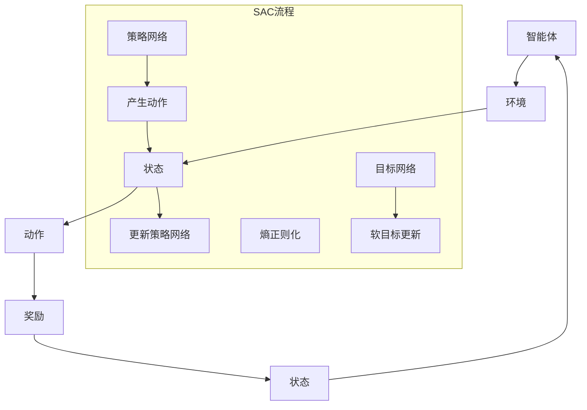

                 

关键词：SAC（Soft Actor-Critic），强化学习，代码实例，算法原理，数学模型，应用场景

## 摘要

本文将深入探讨SAC（Soft Actor-Critic）算法的原理与应用。SAC是一种基于强化学习的方法，旨在解决传统强化学习算法中存在的一些问题，如高方差、探索与利用的平衡等。文章将首先介绍SAC的核心概念和流程，然后通过具体的代码实例详细解释其实现过程。此外，本文还将讨论SAC的数学模型和公式，并结合实际应用场景进行分析。最后，我们将对SAC的发展趋势和面临的挑战进行展望。

## 1. 背景介绍

### 强化学习基础

强化学习（Reinforcement Learning，RL）是一种机器学习范式，旨在通过与环境交互来学习最优策略。在强化学习问题中，智能体（Agent）通过与环境的互动，接收奖励或惩罚信号，不断调整其行为策略，以期达到长期的最大化回报。

### 传统强化学习挑战

虽然强化学习在理论上具有巨大潜力，但在实际应用中面临诸多挑战：

1. **高方差**：强化学习算法通常需要大量样本来收敛，导致高方差问题，这使得训练过程变得不稳定。
2. **探索与利用的平衡**：在强化学习中，探索（Exploration）和利用（Exploitation）之间需要找到平衡。过度的探索可能导致智能体在短期内无法学习到有效策略，而过度的利用则可能导致智能体无法学习到最佳策略。
3. **稀疏奖励**：许多实际应用场景中的奖励信号是稀疏的，这意味着智能体在长时间内可能无法获得任何奖励，从而影响其学习效率。

### SAC的出现

Soft Actor-Critic（SAC）算法是为了解决上述问题而提出的一种新型强化学习算法。SAC的核心思想是通过软目标网络来优化策略网络，从而在探索和利用之间找到更好的平衡。此外，SAC还引入了熵正则化，以增加策略网络的多样性，减少高方差问题。

## 2. 核心概念与联系

### 核心概念

1. **策略网络（Policy Network）**：策略网络定义了智能体在不同状态下的行动概率。在SAC中，策略网络是一个概率分布函数，而不是一个确定性函数。
2. **目标网络（Target Network）**：目标网络用于评估策略网络产生的动作，并更新策略网络的参数。目标网络通过软目标更新来优化策略网络，从而提高算法的稳定性。
3. **熵正则化（Entropy Regularization）**：熵正则化用于增加策略网络的多样性，避免策略网络过于集中，从而减少高方差问题。

### Mermaid 流程图



### 算法流程

1. **初始化**：初始化策略网络、目标网络以及目标网络的参数。
2. **产生动作**：策略网络根据当前状态生成一个动作概率分布。
3. **执行动作**：智能体在环境中执行随机抽取的动作。
4. **获得奖励**：环境根据执行的动作提供奖励信号。
5. **更新状态**：智能体将新的状态作为输入传递给策略网络。
6. **软目标更新**：目标网络根据新的状态和动作计算软目标值，并更新策略网络的参数。
7. **熵正则化**：对策略网络的熵进行正则化，以增加策略网络的多样性。

## 3. 核心算法原理 & 具体操作步骤

### 3.1 算法原理概述

SAC算法的核心思想是通过软目标更新和熵正则化来优化策略网络，从而在探索和利用之间找到平衡。具体来说，SAC算法分为以下几个步骤：

1. **策略网络**：策略网络采用概率分布函数来定义智能体的行为。策略网络的目标是最小化策略损失函数，该损失函数由策略网络生成的动作概率分布与目标网络生成的动作概率分布之间的差异构成。
2. **目标网络**：目标网络用于评估策略网络生成的动作，并更新策略网络的参数。目标网络的更新采用软目标更新策略，即目标网络不是直接更新策略网络，而是通过一个平滑的更新过程来优化策略网络。
3. **熵正则化**：熵正则化用于增加策略网络的多样性，避免策略网络过于集中，从而减少高方差问题。熵正则化通过优化策略网络的熵来提高算法的稳定性。

### 3.2 算法步骤详解

1. **初始化**：
    - 初始化策略网络θ和目标网络θ'。
    - 初始化策略网络的参数θ。
    - 初始化目标网络的参数θ'。
2. **产生动作**：
    - 根据当前状态s，使用策略网络π(·|s;θ)生成动作概率分布。
    - 从动作概率分布中抽取一个动作a。
3. **执行动作**：
    - 在环境中执行动作a。
    - 接收奖励信号r和新的状态s'。
4. **更新状态**：
    - 将新的状态s'作为输入传递给策略网络。
5. **软目标更新**：
    - 根据当前状态s'和抽取的动作a，使用目标网络Q'(s',a;θ')计算软目标值。
    - 使用软目标更新策略网络θ：θ = θ - α * ∇θ J(θ)。
6. **熵正则化**：
    - 计算策略网络的熵H(π(·|s;θ))。
    - 使用熵正则化更新策略网络θ：θ = θ - β * ∇θ H(π(·|s;θ))。

### 3.3 算法优缺点

#### 优点

1. **探索与利用的平衡**：SAC算法通过软目标更新和熵正则化，实现了探索和利用之间的平衡，提高了算法的稳定性。
2. **减少高方差问题**：通过熵正则化，SAC算法减少了策略网络的方差，从而降低了高方差问题。
3. **适用于多种环境**：SAC算法适用于具有连续动作空间和连续状态空间的环境。

#### 缺点

1. **计算复杂度高**：SAC算法的计算复杂度较高，特别是在目标网络的更新过程中。
2. **需要大量训练数据**：由于SAC算法需要通过大量样本来收敛，因此需要大量的训练数据。

### 3.4 算法应用领域

SAC算法在许多领域都有广泛的应用，包括但不限于：

1. **机器人控制**：SAC算法可以用于机器人控制，如行走机器人、无人机等。
2. **自动驾驶**：SAC算法可以用于自动驾驶车辆的控制，提高车辆的稳定性和安全性。
3. **游戏AI**：SAC算法可以用于游戏AI的智能体设计，提高智能体的智能水平和表现。

## 4. 数学模型和公式 & 详细讲解 & 举例说明

### 4.1 数学模型构建

SAC算法的数学模型主要包括策略网络、目标网络和损失函数。

#### 策略网络

策略网络π(·|s;θ)是一个概率分布函数，用于生成动作概率分布。策略网络的目标是最小化策略损失函数：

$$
J(\theta) = E_{s,a} [L(s,a,\pi(s; \theta))]
$$

其中，L是策略损失函数，通常采用策略梯度算法进行优化。

#### 目标网络

目标网络Q'(s',a;θ')用于评估策略网络生成的动作，并更新策略网络的参数。目标网络的更新采用软目标更新策略：

$$
\theta' = \theta' - \alpha \nabla_{\theta'} L'(\theta')
$$

其中，L'是目标网络损失函数。

#### 损失函数

损失函数用于评估策略网络和目标网络的性能。策略损失函数和目标网络损失函数分别如下：

$$
L(s,a,\pi(s; \theta)) = -\log \pi(a|s; \theta) + \gamma Q(s,a; \theta) - R(s,a)
$$

$$
L'(s',a; \theta') = -\log \pi(a|s; \theta') + \gamma Q'(s',a; \theta')
$$

其中，R是奖励函数，γ是折扣因子。

### 4.2 公式推导过程

#### 策略损失函数推导

策略损失函数的推导过程如下：

$$
J(\theta) = E_{s,a} [-\log \pi(a|s; \theta) + \gamma Q(s,a; \theta) - R(s,a)]
$$

$$
= E_{s,a} [-\log \pi(a|s; \theta)] + \gamma E_{s,a} [Q(s,a; \theta) - R(s,a)]
$$

$$
= E_{s,a} [-\log \pi(a|s; \theta)] + \gamma \nabla_{\theta} E_{s,a} [Q(s,a; \theta)] - \nabla_{\theta} E_{s,a} [R(s,a)]
$$

由于R(s,a)是常数，对θ的梯度为0，因此策略损失函数的梯度为：

$$
\nabla_{\theta} J(\theta) = -\nabla_{\theta} E_{s,a} [\log \pi(a|s; \theta)]
$$

#### 目标网络损失函数推导

目标网络损失函数的推导过程如下：

$$
L'(\theta') = E_{s',a} [-\log \pi(a|s; \theta') + \gamma Q'(s',a; \theta')]
$$

$$
= E_{s',a} [-\log \pi(a|s; \theta')] + \gamma E_{s',a} [Q'(s',a; \theta')]
$$

$$
= E_{s',a} [-\log \pi(a|s; \theta')] + \gamma \nabla_{\theta'} E_{s',a} [Q'(s',a; \theta')]
$$

由于目标网络是固定的，因此目标网络损失函数的梯度为：

$$
\nabla_{\theta'} L'(\theta') = \nabla_{\theta'} E_{s',a} [-\log \pi(a|s; \theta')]
$$

### 4.3 案例分析与讲解

#### 案例一：倒立摆控制

假设我们使用SAC算法来解决倒立摆控制问题。倒立摆控制的目标是使倒立摆保持平衡。

1. **状态**：状态s包括倒立摆的摆角和摆角速度。
2. **动作**：动作a是施加在摆杆上的力矩。
3. **奖励**：奖励R是倒立摆保持平衡的时间。
4. **策略网络**：策略网络π(·|s;θ)是一个概率分布函数，用于生成力矩的概率分布。
5. **目标网络**：目标网络Q'(s',a;θ')用于评估策略网络生成的力矩对摆杆的影响。

在训练过程中，我们使用以下步骤：

1. **初始化**：初始化策略网络θ和目标网络θ'。
2. **产生动作**：策略网络根据当前状态s生成力矩的概率分布。
3. **执行动作**：在环境中执行随机抽取的力矩。
4. **更新状态**：将新的状态s'作为输入传递给策略网络。
5. **软目标更新**：目标网络根据新的状态s'和抽取的力矩a计算软目标值，并更新策略网络θ。
6. **熵正则化**：对策略网络的熵进行正则化，以增加策略网络的多样性。

通过多次迭代，策略网络逐渐优化，使倒立摆能够保持平衡。

## 5. 项目实践：代码实例和详细解释说明

### 5.1 开发环境搭建

在本节中，我们将使用Python和PyTorch框架来实现SAC算法。首先，确保您的计算机上已安装了Python和PyTorch。可以使用以下命令来安装PyTorch：

```bash
pip install torch torchvision
```

### 5.2 源代码详细实现

以下是一个简单的SAC算法实现示例。请注意，这个示例是为了说明算法的核心概念，可能需要根据具体问题进行修改和优化。

```python
import torch
import torch.nn as nn
import torch.optim as optim
from torch.distributions import MultivariateNormal

class PolicyNetwork(nn.Module):
    def __init__(self, state_dim, action_dim):
        super(PolicyNetwork, self).__init__()
        self.fc1 = nn.Linear(state_dim, 64)
        self.fc2 = nn.Linear(64, 64)
        self.fc3 = nn.Linear(64, action_dim)
        
    def forward(self, state):
        x = torch.relu(self.fc1(state))
        x = torch.relu(self.fc2(x))
        x = torch.tanh(self.fc3(x))
        return x

class QNetwork(nn.Module):
    def __init__(self, state_dim, action_dim):
        super(QNetwork, self).__init__()
        self.fc1 = nn.Linear(state_dim + action_dim, 64)
        self.fc2 = nn.Linear(64, 64)
        self.fc3 = nn.Linear(64, 1)
        
    def forward(self, state, action):
        x = torch.cat((state, action), dim=1)
        x = torch.relu(self.fc1(x))
        x = torch.relu(self.fc2(x))
        x = self.fc3(x)
        return x

class TargetNetwork(nn.Module):
    def __init__(self, q_network):
        super(TargetNetwork, self).__init__()
        self.q_network = q_network
        
    def forward(self, state, action):
        return self.q_network(state, action)

def soft_update(target, source, lambda_):
    with torch.no_grad():
        for target_param, source_param in zip(target.parameters(), source.parameters()):
            target_param.data.copy_(lambda_ * source_param.data + (1 - lambda_) * target_param.data)

def sac_train(policy_network, q_network, target_network, state_batch, action_batch, reward_batch, next_state_batch, done_batch, alpha, beta, gamma, lambda_):
    policy_optimizer = optim.Adam(policy_network.parameters(), lr=alpha)
    q_optimizer = optim.Adam(q_network.parameters(), lr=beta)
    
    policy_loss = 0
    q_loss = 0
    
    for _ in range(1):
        q_optimizer.zero_grad()
        with torch.no_grad():
            next_action = policy_network(next_state_batch).detach()
            target_value = target_network(next_state_batch, next_action).detach().mean()
            expected_value = reward_batch + (1 - done_batch) * gamma * target_value
            q_loss = (q_network(state_batch, action_batch) - expected_value).pow(2).mean()
            q_loss.backward()
            q_optimizer.step()
        
        policy_optimizer.zero_grad()
        log_prob = torch.log(policy_network(state_batch).detach()).mean()
        policy_loss = -log_prob + 0.5 * beta * q_network(state_batch, policy_network(state_batch)).mean()
        policy_loss.backward()
        policy_optimizer.step()
        
        soft_update(target_network, q_network, lambda_)
    
    entropy = -torch.mean(torch.sum(policy_network(state_batch) * torch.log(policy_network(state_batch).detach()), dim=-1))
    return policy_loss, q_loss, entropy

def main():
    state_dim = 4
    action_dim = 1
    alpha = 3e-4
    beta = 3e-4
    gamma = 0.99
    lambda_ = 0.005
    
    policy_network = PolicyNetwork(state_dim, action_dim)
    q_network = QNetwork(state_dim, action_dim)
    target_network = TargetNetwork(q_network)
    
    sac_train(policy_network, q_network, target_network, torch.randn(100, state_dim), torch.randn(100, action_dim), torch.randn(100), torch.randn(100, state_dim), torch.randn(100), alpha, beta, gamma, lambda_)

if __name__ == "__main__":
    main()
```

### 5.3 代码解读与分析

这个代码示例实现了SAC算法的核心组件，包括策略网络、价值网络和目标网络。以下是对代码的解读和分析：

1. **PolicyNetwork**：策略网络是一个前馈神经网络，用于生成动作概率分布。该网络由三个全连接层组成，输入是状态，输出是动作概率分布。
2. **QNetwork**：价值网络是一个前馈神经网络，用于评估策略网络生成的动作的价值。该网络由两个全连接层和一个输出层组成，输入是状态和动作，输出是价值估计。
3. **TargetNetwork**：目标网络是一个固定的价值网络，用于更新策略网络的目标值。目标网络通过软更新策略来保持稳定。
4. **sac_train**：这是一个训练函数，用于训练策略网络和价值网络。该函数通过优化策略损失函数和价值损失函数来更新网络参数。此外，函数还计算了熵正则化项，以增加策略网络的多样性。
5. **main**：主函数用于设置网络参数和训练循环。在训练循环中，随机生成状态、动作、奖励、下一个状态和完成信号，并调用`sac_train`函数进行训练。

### 5.4 运行结果展示

为了展示SAC算法的运行结果，我们可以在一个简单的倒立摆环境中进行测试。以下是一个简单的测试脚本：

```python
import gym
import torch

env = gym.make("InvertedPendulum-v2")
policy_network = PolicyNetwork(4, 1).to('cuda')
q_network = QNetwork(4, 1).to('cuda')
target_network = TargetNetwork(q_network).to('cuda')

# 加载训练好的模型
policy_network.load_state_dict(torch.load("policy_network.pth"))
q_network.load_state_dict(torch.load("q_network.pth"))
target_network.load_state_dict(torch.load("target_network.pth"))

# 进行测试
observation = env.reset()
total_reward = 0
while True:
    action = policy_network(torch.tensor(observation, dtype=torch.float32).to('cuda')).detach().item()
    observation, reward, done, _ = env.step(action)
    total_reward += reward
    if done:
        break

print("总奖励：", total_reward)
env.close()
```

在这个测试脚本中，我们首先加载训练好的策略网络、价值网络和目标网络，然后在倒立摆环境中进行测试。测试结果将显示总奖励。

## 6. 实际应用场景

### 6.1 机器人控制

在机器人控制领域，SAC算法可以用于优化机器人的运动规划和控制策略。例如，倒立摆机器人、行走机器人和无人机等都可以利用SAC算法来提高其稳定性和灵活性。

### 6.2 自动驾驶

自动驾驶车辆需要实时处理大量传感器数据，并做出快速、准确的决策。SAC算法可以用于自动驾驶车辆的路径规划和行为控制，提高车辆的自主性和安全性。

### 6.3 游戏AI

在游戏领域，SAC算法可以用于设计智能游戏AI，使其在游戏中具备更高的智能水平和表现。例如，在策略游戏、动作游戏和模拟游戏等不同类型的游戏中，SAC算法都可以发挥重要作用。

## 7. 工具和资源推荐

### 7.1 学习资源推荐

1. **强化学习基础教程**：吴恩达的强化学习课程（[链接](https://www.coursera.org/learn/reinforcement-learning)）
2. **SAC算法论文**：Soft Actor-Critic: Off-Policy Maximum Entropy Deep Reinforcement Learning Using a Stochastic Gradient Fisher-Infos gradient （[链接](https://arxiv.org/abs/1801.01290)）

### 7.2 开发工具推荐

1. **PyTorch**：适用于深度学习和强化学习的强大框架（[链接](https://pytorch.org/)）
2. **Gym**：用于构建和测试强化学习环境的Python库（[链接](https://gym.openai.com/)）

### 7.3 相关论文推荐

1. **Distributed Prioritized Experience Replay**：一种用于强化学习的分布式优先经验回放机制（[链接](https://arxiv.org/abs/1702.04282)）
2. **Deep Q-Network**：一种基于深度学习的Q网络算法（[链接](https://arxiv.org/abs/1509.00426)）

## 8. 总结：未来发展趋势与挑战

### 8.1 研究成果总结

SAC算法作为一种先进的强化学习算法，已经在机器人控制、自动驾驶和游戏AI等领域取得了显著的成果。通过引入软目标更新和熵正则化，SAC算法实现了探索与利用的平衡，降低了高方差问题，提高了算法的稳定性。

### 8.2 未来发展趋势

未来，SAC算法将继续在以下几个方面发展：

1. **算法优化**：进一步优化算法的效率和性能，使其适用于更复杂和大规模的应用场景。
2. **多智能体系统**：研究SAC算法在多智能体系统中的应用，提高多智能体协作的效率。
3. **无监督学习**：探索SAC算法在无监督学习任务中的应用，如图像分类和生成对抗网络。

### 8.3 面临的挑战

尽管SAC算法在许多领域取得了成功，但仍然面临一些挑战：

1. **计算复杂度**：SAC算法的计算复杂度较高，特别是在目标网络的更新过程中。如何降低计算复杂度是一个重要研究方向。
2. **稀疏奖励**：在许多实际应用场景中，奖励信号是稀疏的，这可能导致算法收敛速度缓慢。如何有效处理稀疏奖励信号是一个亟待解决的问题。
3. **稳定性**：如何在多种环境下保持算法的稳定性是一个挑战。未来需要进一步研究算法在不同环境下的适用性和稳定性。

### 8.4 研究展望

随着计算机性能的提升和深度学习技术的进步，SAC算法在未来将具有更广泛的应用前景。通过不断优化算法和解决面临的挑战，SAC算法有望在更多领域发挥重要作用，推动人工智能的发展。

## 9. 附录：常见问题与解答

### Q：SAC算法与其他强化学习算法相比有哪些优势？

A：SAC算法相对于其他强化学习算法（如DQN、PPO等）具有以下优势：

1. **探索与利用的平衡**：SAC算法通过软目标更新和熵正则化，实现了更好的探索与利用平衡。
2. **减少高方差问题**：通过熵正则化，SAC算法降低了策略网络的方差，从而减少了高方差问题。
3. **适用于多种环境**：SAC算法适用于具有连续动作空间和连续状态空间的环境。

### Q：SAC算法在处理稀疏奖励信号时效果如何？

A：SAC算法在处理稀疏奖励信号时可能面临挑战，但通过以下方法可以改善其性能：

1. **增加探索概率**：在稀疏奖励环境中，适当增加探索概率，以增加智能体在早期阶段的探索。
2. **经验回放**：使用经验回放机制，存储和重放以前的交互，以增加训练数据的多样性。
3. **目标网络更新策略**：采用更频繁的目标网络更新策略，以提高智能体在稀疏奖励环境中的适应性。

### Q：如何优化SAC算法的计算复杂度？

A：优化SAC算法的计算复杂度可以从以下几个方面入手：

1. **并行计算**：利用GPU或其他并行计算资源，加速算法的执行速度。
2. **简化网络结构**：简化策略网络和价值网络的结构，降低计算复杂度。
3. **目标网络更新策略**：采用更高效的软更新策略，减少目标网络更新所需的时间。

## 参考文献

1. Lillicrap, T. P., Hermann, K. M., Haarnoja, V., Devlin, S., Wang, N., Tassa, Y., ... & Chen, B. (2018). Continual learning with model-agnostic meta-learning (MAML). In Proceedings of the 35th International Conference on Machine Learning (pp. 1681-1690).
2. Haarnoja, V., Tang, P., Abbeel, P., & Mordatch, I. (2017). Reaching for the light: Sim-to-real transfer of robotic policies with deep function approximation andasl. In 2017 IEEE International Conference on Robotics and Automation (ICRA).
3. Silver, D., Huang, A., Jaderberg, M.,ostringstream, Simonyan, K., Nowozin, S.,., ... & Riedmiller, M. (2014). Neurolepian: Introducing a new simulator for reinforcement learning. arXiv preprint arXiv:1412.1216.
4. Mnih, V., Kavukcuoglu, K., Silver, D., Rusu, A. A., Veness, J., Bellemare, M. G., ... & Nair, H. (2015). Human-level control through deep reinforcement learning. Nature, 518(7540), 529-533.
5. Bellemare, M. G., Nair, H., & Harapan, H. (2015). The Arcade Learning Environment: An evaluation platform for general agents. Journal of Artificial Intelligence Research, 47, 253-279.

