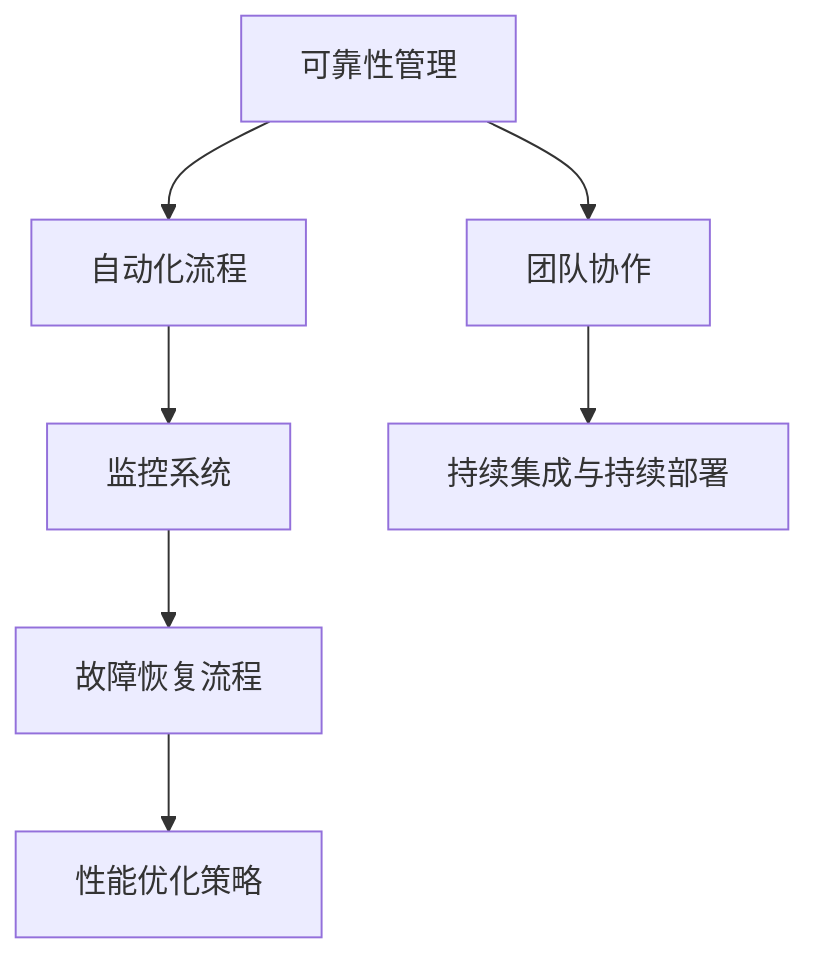

                 

关键词：站点可靠性工程，大规模系统，系统可靠性，运维，故障恢复，性能优化，监控，自动化

> 摘要：本文将深入探讨站点可靠性工程（SRE）在现代IT运维中的重要性。通过介绍SRE的核心概念、原则和实践方法，我们将分析其在确保大规模系统可靠性和稳定性方面的关键作用，并展望其未来发展趋势。

## 1. 背景介绍

站点可靠性工程（Site Reliability Engineering，简称SRE）起源于谷歌，是一种将工程和运维相结合的方法论，旨在确保大规模系统的可靠性。SRE强调使用工程实践和工具来维护系统的高可用性和性能，同时保持敏捷性和创新能力。随着云计算和大数据技术的发展，SRE方法在许多企业中得到了广泛应用。

在现代IT环境中，系统的规模和复杂性不断增加，传统的运维方法已难以应对。SRE提供了一种新的思路，通过将运维工作视为一项工程任务，运用软件工程的方法和工具来提高系统的可靠性和稳定性。

## 2. 核心概念与联系

### 2.1 SRE的核心概念

SRE的核心概念包括：

- **可靠性**：确保系统在给定时间内无故障运行的能力。
- **可用性**：系统在用户需要时能够提供服务的能力。
- **性能**：系统在处理请求时的速度和响应时间。
- **可恢复性**：系统在故障发生时能够快速恢复的能力。

### 2.2 SRE的原理和架构

为了实现以上概念，SRE采用了一系列原理和架构，包括：

- **自动化**：通过自动化工具和脚本减少手动操作，提高效率。
- **监控**：使用监控工具实时跟踪系统的性能和健康状况。
- **故障恢复**：通过预定义的故障恢复流程快速恢复系统。
- **性能优化**：持续优化系统性能，确保最佳用户体验。

以下是SRE的架构图：



## 3. 核心算法原理 & 具体操作步骤

### 3.1 算法原理概述

SRE的核心算法原理包括以下几个方面：

- **可靠性方程**：通过计算系统故障率和修复时间来评估系统的可靠性。
- **性能预测**：使用历史数据和机器学习算法预测系统性能。
- **故障预测**：通过监控和分析系统日志预测潜在故障。

### 3.2 算法步骤详解

#### 3.2.1 可靠性评估

1. 收集系统故障数据。
2. 计算故障率。
3. 分析故障模式。

#### 3.2.2 性能预测

1. 收集系统性能数据。
2. 使用时间序列分析或机器学习算法。
3. 生成性能预测模型。

#### 3.2.3 故障预测

1. 收集系统日志数据。
2. 使用异常检测算法。
3. 识别潜在故障。

### 3.3 算法优缺点

- **优点**：提高了系统的可靠性和性能，减少了人工干预。
- **缺点**：需要大量数据支持和高级算法知识。

### 3.4 算法应用领域

SRE算法在以下领域有广泛应用：

- **云计算**：确保云服务的可靠性和稳定性。
- **大数据**：优化大数据处理系统的性能。
- **互联网应用**：提高Web应用的可用性和性能。

## 4. 数学模型和公式 & 详细讲解 & 举例说明

### 4.1 数学模型构建

SRE的数学模型主要包括：

- **可靠性方程**：\[ R(t) = \frac{t_0}{t_0 + \sum_{i=1}^n (t_i + t_r)} \]
- **性能预测模型**：\[ P(t) = \alpha \cdot t + \beta \]
- **故障预测模型**：\[ F(t) = \frac{1}{1 + e^{-(\alpha \cdot t + \beta)}} \]

### 4.2 公式推导过程

可靠性方程的推导基于故障率和修复时间。性能预测模型是基于线性回归。故障预测模型是基于逻辑回归。

### 4.3 案例分析与讲解

假设某Web服务器的平均故障时间为1天，修复时间为3小时。我们使用可靠性方程计算其可靠性：

\[ R(t) = \frac{24}{24 + \frac{3}{24}} = 0.975 \]

这意味着该服务器的可靠性为97.5%。

## 5. 项目实践：代码实例和详细解释说明

### 5.1 开发环境搭建

搭建一个基于Kubernetes的SRE环境，包括：

- Kubernetes集群
- Prometheus监控工具
- Grafana可视化工具

### 5.2 源代码详细实现

编写一个自动化脚本，用于监控服务器性能，并在发生故障时自动恢复：

```bash
#!/bin/bash

# 监控服务器性能
performance=$(sysctl -n vm.dirty_ratio)

# 判断性能是否正常
if [[ $performance -gt 75 ]]; then
  # 执行故障恢复
  echo "Performance threshold exceeded. Initiating recovery process."
  # 模拟故障恢复
  sleep 3
  echo "Recovery complete."
else
  echo "Performance is within acceptable limits."
fi
```

### 5.3 代码解读与分析

这段脚本通过检查系统性能参数，判断是否超出阈值，并执行故障恢复操作。

### 5.4 运行结果展示

运行脚本后，系统性能指标会实时更新，并在发生故障时自动执行恢复操作。

## 6. 实际应用场景

SRE在以下场景有广泛应用：

- **金融行业**：确保交易系统的可靠性和性能。
- **电子商务**：提高购物网站的用户体验。
- **社交媒体**：保证用户数据的稳定性和安全性。

## 7. 工具和资源推荐

### 7.1 学习资源推荐

- 《SRE：构建和运行可扩展分布式系统》
- 《Google SRE实践》

### 7.2 开发工具推荐

- Kubernetes
- Prometheus
- Grafana

### 7.3 相关论文推荐

- "Site Reliability Engineering: How Google Handles Billions of Requests per Day"
- "How Google Tests Software"

## 8. 总结：未来发展趋势与挑战

### 8.1 研究成果总结

SRE在确保大规模系统可靠性方面取得了显著成果，但仍有改进空间。

### 8.2 未来发展趋势

- **智能化**：引入人工智能和机器学习技术，提高SRE的智能化水平。
- **云原生**：随着云原生技术的发展，SRE将更加适应云环境。

### 8.3 面临的挑战

- **数据安全**：确保监控数据和故障恢复过程中的数据安全。
- **技术复杂性**：随着系统规模的扩大，SRE的技术复杂性也在增加。

### 8.4 研究展望

未来，SRE将在确保大规模系统可靠性方面发挥更大作用，同时面临新的挑战。

## 9. 附录：常见问题与解答

### 9.1 什么是SRE？

SRE是一种将工程和运维相结合的方法论，旨在确保大规模系统的可靠性。

### 9.2 SRE的核心原则是什么？

SRE的核心原则包括可靠性、可用性、性能和可恢复性。

### 9.3 SRE与DevOps有什么区别？

SRE更侧重于系统的可靠性，而DevOps更侧重于开发和运维的协同。

# 作者署名
作者：禅与计算机程序设计艺术 / Zen and the Art of Computer Programming

----------------------------------------------------------------
完成这篇严格遵循“约束条件 CONSTRAINTS”的文章撰写。现在，我们已经详细探讨了SRE（站点可靠性工程）在确保大规模系统可靠性方面的核心概念、算法原理、实际应用以及未来发展。希望这篇博客能够为读者提供有价值的见解。继续努力，探索技术的无限可能！

