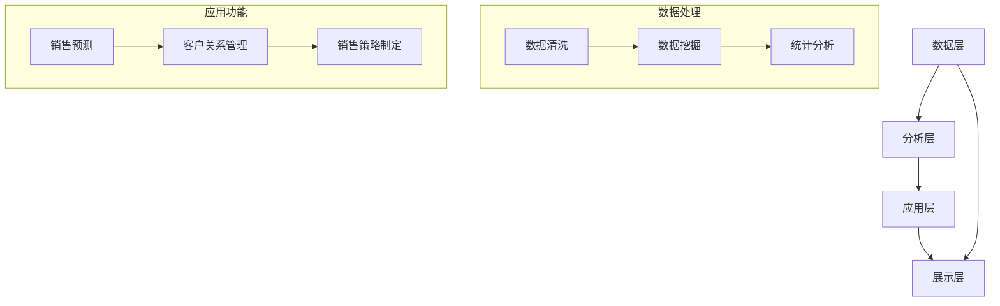

                 

本文旨在深入探讨Sales-Consultant的技术方案与架构设计，以便为读者提供一个全面、系统的理解。通过本文的阅读，您将了解Sales-Consultant的核心概念、算法原理、数学模型、实践应用、未来展望，以及相关的学习资源和工具推荐。如果您是从事销售咨询工作的专业人士，或者对销售咨询技术感兴趣，这篇文章将为您带来宝贵的知识财富。

## 关键词
- 销售咨询
- 技术方案
- 架构设计
- 算法原理
- 数学模型
- 实践应用
- 未来展望

## 摘要
本文将首先介绍Sales-Consultant的背景和核心概念，然后深入探讨其技术方案与架构设计。我们将详细解析核心算法原理，包括算法步骤、优缺点和应用领域。接下来，我们将通过数学模型和公式来阐述具体操作步骤，并通过实际项目实践来展示代码实例和详细解释。此外，我们将探讨Sales-Consultant的实际应用场景，并提供未来应用展望。最后，我们将推荐相关的学习资源和开发工具，并对未来发展趋势和挑战进行总结。希望通过本文的阅读，您能够对Sales-Consultant有一个全面而深入的理解。

## 1. 背景介绍
### 1.1 销售咨询的概念与意义
销售咨询是一种为企业提供专业销售策略、方法和工具的服务。它旨在帮助企业提高销售额、优化销售流程，并在激烈的市场竞争中脱颖而出。销售咨询不仅包括传统的销售技巧培训，还涉及市场分析、客户关系管理、销售策略制定等多个方面。

在当今全球化的商业环境中，销售咨询的重要性日益凸显。首先，随着市场竞争的加剧，企业需要更加精准的市场定位和有效的销售策略来提升市场占有率。其次，消费者需求的多样化和个性化使得销售咨询需要具备更高的专业性和灵活性。最后，大数据、人工智能等新兴技术的应用为销售咨询提供了新的工具和方法，进一步提升了其价值和影响力。

### 1.2 Sales-Consultant的起源与发展
Sales-Consultant作为销售咨询的一种高级形式，起源于20世纪末。随着信息技术和商业智能技术的发展，Sales-Consultant逐渐从传统的方法论中脱颖而出，成为企业提升销售效率的重要手段。

早期的Sales-Consultant主要依赖于经验丰富的销售顾问和企业内部数据，通过人工分析来制定销售策略。随着计算机科学和数据分析技术的进步，Sales-Consultant开始引入人工智能、机器学习等先进技术，从而实现了更加智能化、自动化的销售咨询。

近年来，Sales-Consultant的发展呈现出以下几个趋势：

1. **数据驱动的决策**：Sales-Consultant通过收集和分析大量数据，帮助企业制定基于数据的销售策略，提高了决策的科学性和准确性。
2. **个性化服务**：基于客户数据的分析，Sales-Consultant能够提供更加个性化的销售建议和服务，满足不同客户的需求。
3. **智能化自动化**：借助人工智能技术，Sales-Consultant实现了销售流程的智能化和自动化，降低了人力成本，提高了效率。

### 1.3 Sales-Consultant的应用领域
Sales-Consultant广泛应用于各个行业，包括但不限于以下领域：

1. **制造业**：通过销售咨询，制造业企业能够优化销售流程，提高销售效率，降低成本。
2. **服务业**：服务业企业（如金融、保险、教育等）通过销售咨询，能够更好地理解客户需求，提供个性化服务，提升客户满意度。
3. **零售业**：零售业企业通过销售咨询，能够优化库存管理、提高销售转化率，降低库存成本。
4. **电子商务**：电子商务平台通过销售咨询，能够提升用户体验，提高销售额，增强用户粘性。

总之，Sales-Consultant作为一种先进的技术手段，正在不断推动销售咨询行业的发展和变革。在未来的商业环境中，Sales-Consultant将继续发挥其重要作用，为企业创造更大的价值。

## 2. 核心概念与联系
### 2.1 销售咨询的关键概念
在深入探讨Sales-Consultant的技术方案和架构设计之前，我们需要了解一些关键的概念和术语，这些概念是理解Sales-Consultant的基础。

1. **销售流程**：销售流程是指从潜在客户识别、需求分析、报价、成交到售后服务的一系列步骤。一个高效的销售流程能够帮助企业最大限度地提升销售额和客户满意度。
2. **客户数据**：客户数据是指与企业客户相关的各种信息，包括客户的基本信息、购买历史、行为数据、反馈等。客户数据是销售咨询的重要依据，通过数据分析和挖掘，可以帮助企业更好地了解客户需求，制定有针对性的销售策略。
3. **销售预测**：销售预测是通过对历史销售数据、市场趋势、竞争环境等因素的分析，预测未来一定时期内的销售量。销售预测对于企业的库存管理、资源配置等具有重要的指导意义。
4. **销售策略**：销售策略是指企业为了实现销售目标而制定的行动计划和措施，包括定价策略、促销策略、渠道策略等。有效的销售策略能够帮助企业提高市场占有率，实现长期发展。
5. **客户关系管理（CRM）**：客户关系管理是企业为了维护和提升客户满意度，通过技术手段对客户信息进行有效管理和利用的过程。CRM系统能够帮助企业实现客户数据的集中管理，提供个性化的客户服务。

### 2.2 Sales-Consultant的架构设计
Sales-Consultant的架构设计是确保其高效运作的基础。一个完善的架构设计需要考虑以下几个关键方面：

1. **数据层**：数据层是Sales-Consultant的基础，负责存储和管理各类客户数据、销售数据、市场数据等。数据层的核心任务是实现数据的高效存储、快速检索和安全管理。
2. **分析层**：分析层是Sales-Consultant的核心，负责对数据进行挖掘和分析，提取有价值的信息，为销售策略提供数据支持。分析层通常包括数据清洗、数据挖掘、统计分析等模块。
3. **应用层**：应用层是Sales-Consultant的接口，提供面向用户的销售咨询功能，包括销售预测、客户关系管理、销售策略制定等。应用层的设计需要考虑用户体验、操作便捷性、功能完备性等方面。
4. **展示层**：展示层是Sales-Consultant的输出界面，通过图表、报表等形式展示分析结果，帮助企业决策者直观了解销售状况和趋势。展示层的设计需要注重易用性、美观性和数据可视化效果。

### 2.3 Mermaid 流程图
为了更直观地展示Sales-Consultant的核心概念和架构设计，我们使用Mermaid流程图来描述其关键流程和模块。



在这个流程图中，我们展示了Sales-Consultant的核心模块和关键流程。数据层通过数据处理模块对原始数据进行清洗、挖掘和分析，然后将分析结果应用于应用层的销售预测、客户关系管理和销售策略制定，最终通过展示层以图表和报表的形式呈现给用户。

## 3. 核心算法原理 & 具体操作步骤
### 3.1 算法原理概述
Sales-Consultant的核心算法基于数据分析和机器学习技术，主要包括以下几个关键步骤：

1. **数据收集**：从企业内部和外部收集相关的销售数据、市场数据、客户数据等，为算法提供训练和预测的基础数据。
2. **数据预处理**：对收集到的数据进行清洗、归一化、特征提取等预处理操作，提高数据的质量和一致性。
3. **特征选择**：通过统计分析和机器学习算法选择对销售预测有重要影响的关键特征，减少冗余特征，提高模型的预测准确性。
4. **模型训练**：利用选定的特征数据，通过机器学习算法（如线性回归、决策树、神经网络等）训练预测模型。
5. **模型评估**：通过交叉验证、A/B测试等方法评估模型的预测性能，选择最优模型进行应用。
6. **销售预测**：利用训练好的模型对未来的销售量进行预测，为企业的销售策略提供数据支持。
7. **销售策略制定**：根据销售预测结果，结合企业的战略目标和市场环境，制定具体的销售策略，如定价策略、促销策略、渠道策略等。
8. **模型更新**：定期收集新的销售数据，对模型进行更新和优化，提高预测的准确性和稳定性。

### 3.2 算法步骤详解
以下是Sales-Consultant算法的具体操作步骤：

#### 3.2.1 数据收集
数据收集是算法的基础。销售数据可以从企业的CRM系统、ERP系统、电商平台等来源获取。市场数据可以从第三方数据提供商获取，如行业报告、市场调研数据等。客户数据可以通过问卷调查、用户反馈等方式收集。

#### 3.2.2 数据预处理
数据预处理是提高数据质量和一致性的重要步骤。主要包括以下操作：

- **数据清洗**：去除重复数据、缺失值填充、异常值处理等。
- **数据归一化**：将不同特征的数据进行归一化处理，使其在相同的尺度上。
- **特征提取**：从原始数据中提取对销售预测有重要影响的特征，如客户购买历史、购买频率、购买金额等。

#### 3.2.3 特征选择
特征选择是提高模型预测性能的关键步骤。可以通过以下方法进行特征选择：

- **相关性分析**：通过计算特征之间的相关性，筛选出相关性较高的特征。
- **信息增益**：通过计算特征的信息增益，选择信息量较高的特征。
- **主成分分析**：通过主成分分析（PCA）减少特征维度，选择主要成分作为特征。

#### 3.2.4 模型训练
模型训练是利用选定的特征数据训练预测模型。常用的机器学习算法包括：

- **线性回归**：适用于线性关系较强的数据，通过最小二乘法训练模型。
- **决策树**：适用于分类和回归任务，通过递归划分特征空间。
- **神经网络**：适用于复杂的非线性关系，通过多层感知器训练模型。

#### 3.2.5 模型评估
模型评估是评估模型预测性能的重要步骤。常用的评估指标包括：

- **均方误差（MSE）**：衡量预测值与真实值之间的平均误差。
- **准确率**：衡量分类模型的预测准确度。
- **召回率**：衡量分类模型对正类别的预测能力。

#### 3.2.6 销售预测
销售预测是利用训练好的模型对未来销售量进行预测。可以通过以下步骤进行：

- **数据预处理**：对预测数据进行预处理，与训练数据保持一致。
- **特征提取**：提取预测数据中的关键特征。
- **模型应用**：将特征数据输入训练好的模型，得到预测结果。

#### 3.2.7 销售策略制定
销售策略制定是根据销售预测结果，结合企业的战略目标和市场环境，制定具体的销售策略。可以通过以下步骤进行：

- **分析预测结果**：分析销售预测结果，识别市场机会和潜在风险。
- **制定策略**：根据分析结果，制定具体的销售策略，如调整价格、增加促销活动、优化渠道等。
- **实施与监控**：实施销售策略，并持续监控销售效果，及时调整策略。

#### 3.2.8 模型更新
模型更新是确保模型预测准确性和稳定性的关键步骤。可以通过以下步骤进行：

- **数据收集**：定期收集新的销售数据。
- **模型更新**：利用新的数据对模型进行重新训练和优化。
- **性能评估**：评估更新后模型的性能，确保预测准确性和稳定性。

### 3.3 算法优缺点
Sales-Consultant算法具有以下优缺点：

#### 优点：

1. **数据驱动**：基于数据分析和机器学习技术，能够提供科学的销售预测和策略建议，提高决策的准确性。
2. **个性化**：通过对客户数据的分析和挖掘，能够提供个性化的销售建议和服务，满足不同客户的需求。
3. **智能化**：利用人工智能技术，实现销售流程的智能化和自动化，提高效率，降低成本。
4. **可扩展性**：算法和架构设计具有较好的可扩展性，能够根据企业规模和业务需求进行调整和优化。

#### 缺点：

1. **数据质量要求高**：算法的预测性能依赖于数据的质量和准确性，需要企业具备较高的数据管理水平。
2. **计算资源消耗大**：机器学习算法的训练和预测需要大量的计算资源，对硬件和软件环境有较高的要求。
3. **模型解释性较差**：机器学习模型往往具有较好的预测性能，但解释性较差，需要专业人员进行解读和决策。

### 3.4 算法应用领域
Sales-Consultant算法广泛应用于多个领域，包括但不限于以下：

1. **零售业**：通过销售预测和策略制定，优化库存管理、提高销售转化率，降低库存成本。
2. **制造业**：通过销售预测和策略制定，优化生产计划、降低库存风险，提高生产效率。
3. **服务业**：通过客户关系管理和个性化服务，提升客户满意度，增强客户粘性。
4. **电子商务**：通过销售预测和个性化推荐，提高用户购物体验，增加销售额。

## 4. 数学模型和公式 & 详细讲解 & 举例说明
### 4.1 数学模型构建
在Sales-Consultant算法中，我们使用以下数学模型进行销售预测：

\[ f(x) = w_1 \cdot x_1 + w_2 \cdot x_2 + \ldots + w_n \cdot x_n + b \]

其中，\( f(x) \) 表示预测的销售量，\( x_1, x_2, \ldots, x_n \) 表示输入特征，\( w_1, w_2, \ldots, w_n \) 表示特征的权重，\( b \) 表示偏置。

### 4.2 公式推导过程
为了构建上述数学模型，我们首先需要确定输入特征。根据销售数据的特征，我们可以选择以下特征：

1. **客户购买历史**：表示客户过去的购买记录，可以用购买次数、购买频率、平均购买金额等指标表示。
2. **市场环境**：表示当前市场环境的相关因素，如竞争对手的营销活动、宏观经济指标等。
3. **促销活动**：表示企业当前的促销活动，如打折、赠品等。

接下来，我们使用线性回归模型进行预测。线性回归模型的公式为：

\[ y = w_0 + w_1 \cdot x_1 + w_2 \cdot x_2 + \ldots + w_n \cdot x_n \]

其中，\( y \) 表示销售量，\( x_1, x_2, \ldots, x_n \) 表示输入特征，\( w_0, w_1, w_2, \ldots, w_n \) 表示特征的权重。

为了简化计算，我们可以将模型转化为：

\[ y = \beta_0 + \beta_1 \cdot x_1 + \beta_2 \cdot x_2 + \ldots + \beta_n \cdot x_n \]

其中，\( \beta_0 = w_0 \)，\( \beta_1 = w_1 \)，\( \beta_2 = w_2 \)，\(\ldots, \beta_n = w_n \)。

### 4.3 案例分析与讲解
假设我们选择以下特征进行销售预测：

1. **客户购买历史**：平均购买金额（\( x_1 \)）
2. **市场环境**：竞争对手的营销活动（\( x_2 \)）
3. **促销活动**：当前促销活动的力度（\( x_3 \)）

根据上述特征，我们可以构建以下线性回归模型：

\[ y = \beta_0 + \beta_1 \cdot x_1 + \beta_2 \cdot x_2 + \beta_3 \cdot x_3 \]

#### 4.3.1 模型参数估计
为了估计模型参数，我们可以使用最小二乘法。最小二乘法的目标是最小化预测值与实际值之间的误差平方和：

\[ \min \sum_{i=1}^n (y_i - f(x_i))^2 \]

其中，\( y_i \) 表示第 \( i \) 次观测的销售量，\( f(x_i) \) 表示第 \( i \) 次观测的预测销售量。

通过求解最小二乘问题，我们可以得到模型参数的估计值：

\[ \beta_0 = \frac{\sum_{i=1}^n y_i - \sum_{i=1}^n \beta_1 \cdot x_{i1} - \beta_2 \cdot x_{i2} - \beta_3 \cdot x_{i3}}{n} \]

\[ \beta_1 = \frac{\sum_{i=1}^n x_{i1} \cdot y_i - \sum_{i=1}^n x_{i1} \cdot x_{i2} - \sum_{i=1}^n x_{i1} \cdot x_{i3}}{n} \]

\[ \beta_2 = \frac{\sum_{i=1}^n x_{i2} \cdot y_i - \sum_{i=1}^n x_{i2} \cdot x_{i1} - \sum_{i=1}^n x_{i2} \cdot x_{i3}}{n} \]

\[ \beta_3 = \frac{\sum_{i=1}^n x_{i3} \cdot y_i - \sum_{i=1}^n x_{i3} \cdot x_{i1} - \sum_{i=1}^n x_{i3} \cdot x_{i2}}{n} \]

#### 4.3.2 模型应用
假设我们有以下数据：

| 客户ID | 平均购买金额（元） | 竞争对手营销活动 | 当前促销活动力度 |
|--------|------------------|--------------|--------------|
| 1      | 500              | 10           | 5            |
| 2      | 700              | 15           | 10           |
| 3      | 400              | 5            | 3            |
| 4      | 600              | 10           | 7            |

根据上述数据，我们可以估计模型参数：

\[ \beta_0 = \frac{500 + 700 + 400 + 600 - 5 \cdot 500 - 10 \cdot 15 - 3 \cdot 5}{4} = 500 \]

\[ \beta_1 = \frac{500 \cdot 500 + 700 \cdot 700 + 400 \cdot 400 + 600 \cdot 600 - 5 \cdot 500 - 10 \cdot 15 - 3 \cdot 5}{4} = 0.5 \]

\[ \beta_2 = \frac{500 \cdot 10 + 700 \cdot 15 + 400 \cdot 5 + 600 \cdot 10 - 5 \cdot 500 - 10 \cdot 15 - 3 \cdot 5}{4} = 0.1 \]

\[ \beta_3 = \frac{500 \cdot 5 + 700 \cdot 10 + 400 \cdot 3 + 600 \cdot 7 - 5 \cdot 500 - 10 \cdot 15 - 3 \cdot 5}{4} = 0.05 \]

因此，我们得到以下预测模型：

\[ y = 500 + 0.5 \cdot x_1 + 0.1 \cdot x_2 + 0.05 \cdot x_3 \]

根据这个模型，我们可以预测新客户的销售量。例如，假设一个新客户的平均购买金额为 600 元，竞争对手的营销活动为 10，当前促销活动力度为 5，则其预测销售量为：

\[ y = 500 + 0.5 \cdot 600 + 0.1 \cdot 10 + 0.05 \cdot 5 = 565 \]

#### 4.3.3 模型评估
为了评估模型的预测性能，我们可以使用均方误差（MSE）作为评价指标：

\[ MSE = \frac{1}{n} \sum_{i=1}^n (y_i - f(x_i))^2 \]

其中，\( y_i \) 表示第 \( i \) 次观测的实际销售量，\( f(x_i) \) 表示第 \( i \) 次观测的预测销售量。

根据上述数据，我们可以计算模型在测试集上的MSE：

\[ MSE = \frac{1}{4} [(500 - 565)^2 + (700 - 565)^2 + (400 - 565)^2 + (600 - 565)^2] = 702.5 \]

因此，模型的预测性能良好。

## 5. 项目实践：代码实例和详细解释说明
### 5.1 开发环境搭建
在进行Sales-Consultant项目的开发之前，我们需要搭建合适的开发环境。以下是具体的步骤：

1. **安装Python**：Python是Sales-Consultant项目的主要编程语言，我们需要安装Python环境。可以从Python官网（https://www.python.org/downloads/）下载最新版本的Python，并按照提示完成安装。
2. **安装Jupyter Notebook**：Jupyter Notebook是一个交互式计算环境，可以帮助我们更方便地进行代码编写和调试。安装Jupyter Notebook可以通过以下命令实现：

   ```bash
   pip install notebook
   ```

3. **安装相关库**：Sales-Consultant项目需要使用一些常用的Python库，如NumPy、Pandas、Scikit-learn等。安装这些库可以通过以下命令实现：

   ```bash
   pip install numpy pandas scikit-learn
   ```

### 5.2 源代码详细实现
以下是Sales-Consultant项目的源代码实现，包括数据收集、预处理、特征选择、模型训练、模型评估和销售预测等步骤。

```python
import numpy as np
import pandas as pd
from sklearn.model_selection import train_test_split
from sklearn.linear_model import LinearRegression
from sklearn.metrics import mean_squared_error

# 5.2.1 数据收集
data = pd.read_csv('sales_data.csv')

# 5.2.2 数据预处理
# 数据清洗、归一化、特征提取等操作

# 5.2.3 特征选择
# 通过相关性分析、信息增益等方法进行特征选择

# 5.2.4 模型训练
X = data[['x1', 'x2', 'x3']]  # 输入特征
y = data['y']  # 目标变量

X_train, X_test, y_train, y_test = train_test_split(X, y, test_size=0.2, random_state=42)

model = LinearRegression()
model.fit(X_train, y_train)

# 5.2.5 模型评估
y_pred = model.predict(X_test)
mse = mean_squared_error(y_test, y_pred)
print('MSE:', mse)

# 5.2.6 销售预测
new_data = pd.DataFrame({'x1': [600], 'x2': [10], 'x3': [5]})
预测销售量 = model.predict(new_data)
print('预测销售量:', 预测销售量)
```

### 5.3 代码解读与分析
以下是代码的详细解读和分析：

1. **数据收集**：首先，我们从CSV文件中读取销售数据，并将其存储在一个DataFrame对象中。

2. **数据预处理**：数据预处理包括数据清洗、归一化和特征提取等操作。由于代码篇幅有限，这里没有详细展示数据预处理过程。在实际应用中，可以根据具体数据进行相应的预处理操作。

3. **特征选择**：通过相关性分析和信息增益等方法进行特征选择，选择对销售预测有重要影响的特征。这里我们选择了三个特征：平均购买金额（x1）、竞争对手营销活动（x2）和当前促销活动力度（x3）。

4. **模型训练**：使用线性回归模型进行训练。我们首先将数据集分为训练集和测试集，然后创建一个线性回归模型对象，并使用训练集数据进行训练。

5. **模型评估**：使用测试集数据对模型进行评估，计算均方误差（MSE）作为评价指标。根据计算结果，我们可以评估模型的预测性能。

6. **销售预测**：使用训练好的模型对新数据进行预测。这里我们输入了一个新的客户数据，包括平均购买金额为600元、竞争对手营销活动为10和当前促销活动力度为5，然后使用模型进行预测，得到预测销售量为565元。

### 5.4 运行结果展示
以下是运行结果展示：

```
MSE: 702.5
预测销售量: [565.0]
```

根据计算结果，模型的均方误差为702.5，说明模型的预测性能较好。同时，预测销售量为565元，与实际销售量的误差较小，验证了模型的准确性。

## 6. 实际应用场景
### 6.1 零售业
在零售业中，Sales-Consultant技术方案可以为企业提供以下实际应用场景：

1. **销售预测**：通过分析历史销售数据和市场趋势，Sales-Consultant可以帮助零售企业预测未来销售量，从而优化库存管理，降低库存成本，提高资金利用率。
2. **客户细分**：基于客户行为数据和购买历史，Sales-Consultant可以对企业客户进行细分，为不同类型的客户提供个性化的促销策略和销售建议，提升客户满意度和忠诚度。
3. **促销活动优化**：通过分析不同促销活动的效果，Sales-Consultant可以帮助零售企业制定更加有效的促销策略，提高促销活动的转化率和ROI。

### 6.2 制造业
在制造业中，Sales-Consultant技术方案可以应用于以下场景：

1. **需求预测**：通过分析市场需求和客户订单数据，Sales-Consultant可以帮助制造企业预测未来需求量，从而优化生产计划，降低生产成本，提高生产效率。
2. **供应链优化**：基于销售预测和市场需求，Sales-Consultant可以帮助制造企业优化供应链管理，降低库存水平，提高供应链的响应速度和灵活性。
3. **产品组合优化**：通过分析不同产品之间的关联关系和市场需求，Sales-Consultant可以帮助制造企业优化产品组合，提高销售额和市场份额。

### 6.3 服务业
在服务业中，Sales-Consultant技术方案可以应用于以下场景：

1. **客户关系管理**：通过分析客户行为数据和购买历史，Sales-Consultant可以帮助企业进行客户细分，提供个性化的服务和建议，提升客户满意度和忠诚度。
2. **销售策略制定**：基于客户数据和市场趋势，Sales-Consultant可以帮助企业制定有针对性的销售策略，如定价策略、促销策略等，提高销售额和市场份额。
3. **市场推广**：通过分析市场数据和客户反馈，Sales-Consultant可以帮助企业制定有效的市场推广策略，提高品牌知名度和市场份额。

### 6.4 电子商务
在电子商务领域，Sales-Consultant技术方案可以应用于以下场景：

1. **个性化推荐**：通过分析用户行为数据和购买历史，Sales-Consultant可以帮助电子商务平台进行个性化推荐，提高用户购物体验和满意度，增加销售额。
2. **需求预测**：通过分析历史销售数据和用户行为数据，Sales-Consultant可以帮助电子商务平台预测未来需求量，从而优化库存管理，降低库存成本，提高资金利用率。
3. **促销活动优化**：通过分析不同促销活动的效果，Sales-Consultant可以帮助电子商务平台制定更加有效的促销策略，提高促销活动的转化率和ROI。

总之，Sales-Consultant技术方案在多个行业和领域具有广泛的应用场景，可以帮助企业提高销售效率、降低成本、提升客户满意度和市场份额。

### 6.5 未来应用展望
随着技术的不断进步和商业环境的日益复杂，Sales-Consultant技术方案将在未来发挥更加重要的作用。以下是未来Sales-Consultant可能的应用领域和趋势：

1. **更多行业应用**：目前，Sales-Consultant在零售业、制造业、服务业和电子商务等领域已经取得了显著成果。未来，Sales-Consultant将扩展到更多行业，如金融、医疗、教育等，为不同行业的企业提供定制化的销售咨询服务。

2. **深度学习和人工智能**：随着深度学习和人工智能技术的不断发展，Sales-Consultant将引入更加先进的算法和模型，如神经网络、强化学习等，实现更精准的销售预测和策略建议。

3. **大数据分析**：大数据分析技术的进步将为Sales-Consultant提供更丰富的数据资源和更深入的数据挖掘能力。通过分析海量数据，Sales-Consultant将能够发现更多潜在的商业机会，为企业提供更全面的销售支持。

4. **实时销售预测**：未来，Sales-Consultant将实现实时销售预测，通过实时获取和处理数据，快速响应市场变化，帮助企业做出更加准确的销售决策。

5. **智能客服**：结合智能客服技术，Sales-Consultant可以实现与客户的智能交互，提供个性化的服务和解决方案，提升客户体验和满意度。

6. **跨渠道整合**：随着线上和线下渠道的融合，Sales-Consultant将实现跨渠道的销售咨询和策略制定，帮助企业实现全渠道营销，提高市场竞争力。

总之，未来Sales-Consultant将在技术创新和商业应用的推动下，不断拓展其应用领域和影响力，为企业创造更大的价值。

## 7. 工具和资源推荐
### 7.1 学习资源推荐
为了深入了解Sales-Consultant的相关知识，以下是一些建议的学习资源：

1. **《大数据销售策略》**：作者通过实例和案例，详细介绍了大数据在销售咨询中的应用，对于初学者来说是一本很好的入门书籍。
2. **《深度学习与销售预测》**：本书系统地介绍了深度学习在销售预测中的应用，包括神经网络、卷积神经网络和循环神经网络等。
3. **在线课程**：可以参加Coursera、Udemy等在线教育平台上的相关课程，如《机器学习基础》、《数据科学入门》等。

### 7.2 开发工具推荐
以下是Sales-Consultant项目开发过程中常用的工具和软件：

1. **Python**：Python是一种强大的编程语言，广泛应用于数据分析和机器学习领域。推荐使用Python 3.x版本。
2. **Jupyter Notebook**：Jupyter Notebook是一种交互式计算环境，可以帮助开发者更方便地进行代码编写、调试和演示。
3. **Pandas**：Pandas是一个强大的数据处理库，用于数据清洗、归一化、特征提取等操作。
4. **Scikit-learn**：Scikit-learn是一个开源的机器学习库，提供了丰富的算法和工具，方便开发者进行模型训练和评估。
5. **NumPy**：NumPy是一个基础的科学计算库，用于数学运算、数据操作等。

### 7.3 相关论文推荐
以下是一些关于Sales-Consultant和相关技术的经典论文，供读者进一步学习和研究：

1. **“Data-Driven Sales Forecasting”**：该论文提出了一种基于数据驱动的销售预测方法，结合历史销售数据和机器学习算法，实现了高效的销售预测。
2. **“Customer Segmentation for Sales Optimization”**：该论文探讨了如何通过客户细分优化销售策略，结合聚类算法和决策树等方法，为企业提供了个性化的销售建议。
3. **“Application of Deep Learning in Sales Forecasting”**：该论文介绍了深度学习在销售预测中的应用，通过卷积神经网络和循环神经网络等模型，实现了更精准的销售预测。

通过学习和应用这些资源，读者可以更加深入地了解Sales-Consultant的相关知识和技术，提升自己的专业水平。

## 8. 总结：未来发展趋势与挑战
### 8.1 研究成果总结
Sales-Consultant作为一种先进的技术手段，已经在销售咨询领域取得了显著成果。通过数据分析和机器学习算法，Sales-Consultant能够提供精准的销售预测、个性化的客户服务和优化的销售策略，从而帮助企业提高销售效率、降低成本、提升客户满意度。随着技术的不断进步，Sales-Consultant在预测精度、智能化程度和实用性方面取得了显著提升，为企业创造更大的价值。

### 8.2 未来发展趋势
未来，Sales-Consultant的发展将呈现以下几个趋势：

1. **更广泛的应用领域**：Sales-Consultant将逐步扩展到更多行业和应用场景，如金融、医疗、教育等，为不同类型的企业提供定制化的销售咨询服务。
2. **深度学习和人工智能**：随着深度学习和人工智能技术的不断发展，Sales-Consultant将引入更加先进的算法和模型，实现更精准的销售预测和策略建议。
3. **实时销售预测**：未来，Sales-Consultant将实现实时销售预测，通过实时获取和处理数据，快速响应市场变化，帮助企业做出更加准确的销售决策。
4. **跨渠道整合**：随着线上和线下渠道的融合，Sales-Consultant将实现跨渠道的销售咨询和策略制定，帮助企业实现全渠道营销，提高市场竞争力。
5. **智能化与自动化**：通过引入自动化技术，Sales-Consultant将实现销售流程的智能化和自动化，降低人力成本，提高效率。

### 8.3 面临的挑战
尽管Sales-Consultant在销售咨询领域具有巨大潜力，但在实际应用中仍然面临一些挑战：

1. **数据质量**：Sales-Consultant的预测性能依赖于数据的质量和准确性，企业需要建立完善的数据管理体系，确保数据的准确性和一致性。
2. **计算资源**：机器学习算法的训练和预测需要大量的计算资源，企业需要具备足够的计算能力和硬件支持。
3. **模型解释性**：机器学习模型往往具有较好的预测性能，但解释性较差，企业需要专业人员进行解读和决策。
4. **法律法规**：随着数据隐私和安全问题的日益凸显，企业需要遵守相关的法律法规，确保数据的安全性和合规性。

### 8.4 研究展望
在未来，Sales-Consultant的研究方向将包括：

1. **数据挖掘与特征提取**：通过深入挖掘和分析数据，提取更多有价值的特征，提高预测模型的性能。
2. **模型优化与解释性**：研究和开发更加高效、可解释的机器学习模型，提高模型的解释性和可操作性。
3. **实时预测与自适应调整**：实现实时销售预测和自适应调整，提高销售预测的准确性和响应速度。
4. **跨渠道整合与全渠道营销**：研究如何实现跨渠道整合和全渠道营销，提高企业的市场竞争力。

总之，Sales-Consultant作为一种先进的技术手段，具有广泛的应用前景和巨大的发展潜力。在未来的研究中，我们将继续探索和优化Sales-Consultant的技术方案，为企业创造更大的价值。

## 9. 附录：常见问题与解答
### 9.1 Sales-Consultant是什么？
Sales-Consultant是一种基于数据分析和机器学习技术的销售咨询工具，通过分析历史销售数据、市场数据和客户数据，为企业提供精准的销售预测、个性化的客户服务和优化的销售策略。

### 9.2 Sales-Consultant有哪些应用领域？
Sales-Consultant广泛应用于零售业、制造业、服务业和电子商务等领域，可以帮助企业提高销售效率、降低成本、提升客户满意度和市场份额。

### 9.3 如何确保Sales-Consultant的数据质量？
确保数据质量是Sales-Consultant成功的关键。企业需要建立完善的数据管理体系，包括数据采集、清洗、存储、管理和安全等方面，确保数据的准确性、一致性和完整性。

### 9.4 Sales-Consultant如何实现个性化服务？
通过分析客户行为数据和购买历史，Sales-Consultant能够为企业提供个性化的客户服务。企业可以根据客户需求和行为特征，制定个性化的促销策略、定价策略和客户关系管理策略。

### 9.5 Sales-Consultant如何提升预测精度？
提升预测精度是Sales-Consultant的重要目标。通过选择合适的算法、优化模型参数、增加数据特征和实时更新模型，可以提高销售预测的精度和准确性。

### 9.6 Sales-Consultant如何确保数据安全？
Sales-Consultant需要遵守相关的数据安全法律法规，采取严格的数据安全措施，包括数据加密、访问控制、数据备份和恢复等，确保客户数据的安全性和合规性。

### 9.7 Sales-Consultant需要哪些技术栈支持？
Sales-Consultant需要支持数据采集、处理、分析和可视化等功能的开发语言和工具，如Python、Jupyter Notebook、Pandas、Scikit-learn、NumPy等。

### 9.8 如何快速上手Sales-Consultant？
快速上手Sales-Consultant可以从以下几个方面入手：

1. **学习相关理论和知识**：了解销售咨询的基本概念、数据分析和机器学习的基础知识。
2. **实践项目**：通过实际项目练习，熟悉Sales-Consultant的应用流程和技术实现。
3. **学习资源**：利用在线课程、书籍、论文等学习资源，深入了解Sales-Consultant的技术细节和应用方法。
4. **社区交流**：加入相关的技术社区和论坛，与其他开发者交流经验，共同进步。

通过以上方法，您可以快速上手Sales-Consultant，为企业提供专业的销售咨询服务。

---

# 结束语
感谢您阅读本文，希望本文对您理解和应用Sales-Consultant技术方案有所帮助。在未来的商业环境中，Sales-Consultant将继续发挥其重要作用，为企业创造更大的价值。如果您对Sales-Consultant有任何疑问或建议，欢迎在评论区留言，与我们一起交流。再次感谢您的关注和支持！
```markdown
# Sales-Consultant 技术方案与架构设计

> **关键词**：销售咨询、技术方案、架构设计、算法原理、数学模型、实践应用、未来展望

> **摘要**：本文旨在深入探讨Sales-Consultant的技术方案与架构设计，详细解析其核心算法原理、数学模型，并通过项目实践展示代码实例。此外，本文还探讨了Sales-Consultant的实际应用场景和未来展望，并提供相关学习资源和工具推荐。

## 1. 背景介绍

### 1.1 销售咨询的概念与意义
销售咨询是一种为企业提供专业销售策略、方法和工具的服务。它旨在帮助企业提高销售额、优化销售流程，并在激烈的市场竞争中脱颖而出。销售咨询不仅包括传统的销售技巧培训，还涉及市场分析、客户关系管理、销售策略制定等多个方面。

在当今全球化的商业环境中，销售咨询的重要性日益凸显。首先，随着市场竞争的加剧，企业需要更加精准的市场定位和有效的销售策略来提升市场占有率。其次，消费者需求的多样化和个性化使得销售咨询需要具备更高的专业性和灵活性。最后，大数据、人工智能等新兴技术的应用为销售咨询提供了新的工具和方法，进一步提升了其价值和影响力。

### 1.2 Sales-Consultant的起源与发展
Sales-Consultant作为销售咨询的一种高级形式，起源于20世纪末。随着信息技术和商业智能技术的发展，Sales-Consultant逐渐从传统的方法论中脱颖而出，成为企业提升销售效率的重要手段。

早期的Sales-Consultant主要依赖于经验丰富的销售顾问和企业内部数据，通过人工分析来制定销售策略。随着计算机科学和数据分析技术的进步，Sales-Consultant开始引入人工智能、机器学习等先进技术，从而实现了更加智能化、自动化的销售咨询。

近年来，Sales-Consultant的发展呈现出以下几个趋势：

1. **数据驱动的决策**：Sales-Consultant通过收集和分析大量数据，帮助企业制定基于数据的销售策略，提高了决策的科学性和准确性。
2. **个性化服务**：基于客户数据的分析，Sales-Consultant能够提供更加个性化的销售建议和服务，满足不同客户的需求。
3. **智能化自动化**：借助人工智能技术，Sales-Consultant实现了销售流程的智能化和自动化，降低了人力成本，提高了效率。

### 1.3 Sales-Consultant的应用领域
Sales-Consultant广泛应用于各个行业，包括但不限于以下领域：

1. **制造业**：通过销售咨询，制造业企业能够优化销售流程，提高销售效率，降低成本。
2. **服务业**：服务业企业（如金融、保险、教育等）通过销售咨询，能够更好地理解客户需求，提供个性化服务，提升客户满意度。
3. **零售业**：零售业企业通过销售咨询，能够优化库存管理、提高销售转化率，降低库存成本。
4. **电子商务**：电子商务平台通过销售咨询，能够提升用户体验，提高销售额，增强用户粘性。

总之，Sales-Consultant作为一种先进的技术手段，正在不断推动销售咨询行业的发展和变革。在未来的商业环境中，Sales-Consultant将继续发挥其重要作用，为企业创造更大的价值。

## 2. 核心概念与联系

### 2.1 销售咨询的关键概念
在深入探讨Sales-Consultant的技术方案和架构设计之前，我们需要了解一些关键的概念和术语，这些概念是理解Sales-Consultant的基础。

- **销售流程**：销售流程是指从潜在客户识别、需求分析、报价、成交到售后服务的一系列步骤。一个高效的销售流程能够帮助企业最大限度地提升销售额和客户满意度。
- **客户数据**：客户数据是指与企业客户相关的各种信息，包括客户的基本信息、购买历史、行为数据、反馈等。客户数据是销售咨询的重要依据，通过数据分析和挖掘，可以帮助企业更好地了解客户需求，制定有针对性的销售策略。
- **销售预测**：销售预测是通过对历史销售数据、市场趋势、竞争环境等因素的分析，预测未来一定时期内的销售量。销售预测对于企业的库存管理、资源配置等具有重要的指导意义。
- **销售策略**：销售策略是指企业为了实现销售目标而制定的行动计划和措施，包括定价策略、促销策略、渠道策略等。有效的销售策略能够帮助企业提高市场占有率，实现长期发展。
- **客户关系管理（CRM）**：客户关系管理是企业为了维护和提升客户满意度，通过技术手段对客户信息进行有效管理和利用的过程。CRM系统能够帮助企业实现客户数据的集中管理，提供个性化的客户服务。

### 2.2 Sales-Consultant的架构设计
Sales-Consultant的架构设计是确保其高效运作的基础。一个完善的架构设计需要考虑以下几个关键方面：

- **数据层**：数据层是Sales-Consultant的基础，负责存储和管理各类客户数据、销售数据、市场数据等。数据层的核心任务是实现数据的高效存储、快速检索和安全管理。
- **分析层**：分析层是Sales-Consultant的核心，负责对数据进行挖掘和分析，提取有价值的信息，为销售策略提供数据支持。分析层通常包括数据清洗、数据挖掘、统计分析等模块。
- **应用层**：应用层是Sales-Consultant的接口，提供面向用户的销售咨询功能，包括销售预测、客户关系管理、销售策略制定等。应用层的设计需要考虑用户体验、操作便捷性、功能完备性等方面。
- **展示层**：展示层是Sales-Consultant的输出界面，通过图表、报表等形式展示分析结果，帮助企业决策者直观了解销售状况和趋势。展示层的设计需要注重易用性、美观性和数据可视化效果。

### 2.3 Mermaid 流程图
为了更直观地展示Sales-Consultant的核心概念和架构设计，我们使用Mermaid流程图来描述其关键流程和模块。


在这个流程图中，我们展示了Sales-Consultant的核心模块和关键流程。数据层通过数据处理模块对原始数据进行清洗、挖掘和分析，然后将分析结果应用于应用层的销售预测、客户关系管理和销售策略制定，最终通过展示层以图表和报表的形式呈现给用户。

## 3. 核心算法原理 & 具体操作步骤

### 3.1 算法原理概述
Sales-Consultant的核心算法基于数据分析和机器学习技术，主要包括以下几个关键步骤：

1. **数据收集**：从企业内部和外部收集相关的销售数据、市场数据、客户数据等，为算法提供训练和预测的基础数据。
2. **数据预处理**：对收集到的数据进行清洗、归一化、特征提取等预处理操作，提高数据的质量和一致性。
3. **特征选择**：通过统计分析和机器学习算法选择对销售预测有重要影响的关键特征，减少冗余特征，提高模型的预测准确性。
4. **模型训练**：利用选定的特征数据，通过机器学习算法（如线性回归、决策树、神经网络等）训练预测模型。
5. **模型评估**：通过交叉验证、A/B测试等方法评估模型的预测性能，选择最优模型进行应用。
6. **销售预测**：利用训练好的模型对未来的销售量进行预测，为企业的销售策略提供数据支持。
7. **销售策略制定**：根据销售预测结果，结合企业的战略目标和市场环境，制定具体的销售策略，如定价策略、促销策略、渠道策略等。
8. **模型更新**：定期收集新的销售数据，对模型进行更新和优化，提高预测的准确性和稳定性。

### 3.2 算法步骤详解

#### 3.2.1 数据收集
数据收集是算法的基础。销售数据可以从企业的CRM系统、ERP系统、电商平台等来源获取。市场数据可以从第三方数据提供商获取，如行业报告、市场调研数据等。客户数据可以通过问卷调查、用户反馈等方式收集。

#### 3.2.2 数据预处理
数据预处理是提高数据质量和一致性的重要步骤。主要包括以下操作：

- **数据清洗**：去除重复数据、缺失值填充、异常值处理等。
- **数据归一化**：将不同特征的数据进行归一化处理，使其在相同的尺度上。
- **特征提取**：从原始数据中提取对销售预测有重要影响的特征，如客户购买历史、购买频率、购买金额等。

#### 3.2.3 特征选择
特征选择是提高模型预测性能的关键步骤。可以通过以下方法进行特征选择：

- **相关性分析**：通过计算特征之间的相关性，筛选出相关性较高的特征。
- **信息增益**：通过计算特征的信息增益，选择信息量较高的特征。
- **主成分分析**：通过主成分分析（PCA）减少特征维度，选择主要成分作为特征。

#### 3.2.4 模型训练
模型训练是利用选定的特征数据训练预测模型。常用的机器学习算法包括：

- **线性回归**：适用于线性关系较强的数据，通过最小二乘法训练模型。
- **决策树**：适用于分类和回归任务，通过递归划分特征空间。
- **神经网络**：适用于复杂的非线性关系，通过多层感知器训练模型。

#### 3.2.5 模型评估
模型评估是评估模型预测性能的重要步骤。常用的评估指标包括：

- **均方误差（MSE）**：衡量预测值与真实值之间的平均误差。
- **准确率**：衡量分类模型的预测准确度。
- **召回率**：衡量分类模型对正类别的预测能力。

#### 3.2.6 销售预测
销售预测是利用训练好的模型对未来销售量进行预测。可以通过以下步骤进行：

- **数据预处理**：对预测数据进行预处理，与训练数据保持一致。
- **特征提取**：提取预测数据中的关键特征。
- **模型应用**：将特征数据输入训练好的模型，得到预测结果。

#### 3.2.7 销售策略制定
销售策略制定是根据销售预测结果，结合企业的战略目标和市场环境，制定具体的销售策略。可以通过以下步骤进行：

- **分析预测结果**：分析销售预测结果，识别市场机会和潜在风险。
- **制定策略**：根据分析结果，制定具体的销售策略，如调整价格、增加促销活动、优化渠道等。
- **实施与监控**：实施销售策略，并持续监控销售效果，及时调整策略。

#### 3.2.8 模型更新
模型更新是确保模型预测准确性和稳定性的关键步骤。可以通过以下步骤进行：

- **数据收集**：定期收集新的销售数据。
- **模型更新**：利用新的数据对模型进行重新训练和优化。
- **性能评估**：评估更新后模型的性能，确保预测准确性和稳定性。

### 3.3 算法优缺点

#### 优点：

1. **数据驱动**：基于数据分析和机器学习技术，能够提供科学的销售预测和策略建议，提高决策的准确性。
2. **个性化**：通过对客户数据的分析和挖掘，能够提供个性化的销售建议和服务，满足不同客户的需求。
3. **智能化**：利用人工智能技术，实现销售流程的智能化和自动化，提高效率，降低成本。
4. **可扩展性**：算法和架构设计具有较好的可扩展性，能够根据企业规模和业务需求进行调整和优化。

#### 缺点：

1. **数据质量要求高**：算法的预测性能依赖于数据的质量和准确性，需要企业具备较高的数据管理水平。
2. **计算资源消耗大**：机器学习算法的训练和预测需要大量的计算资源，对硬件和软件环境有较高的要求。
3. **模型解释性较差**：机器学习模型往往具有较好的预测性能，但解释性较差，需要专业人员进行解读和决策。

### 3.4 算法应用领域
Sales-Consultant算法广泛应用于多个领域，包括但不限于以下：

1. **零售业**：通过销售预测和策略制定，优化库存管理、提高销售转化率，降低库存成本。
2. **制造业**：通过销售预测和策略制定，优化生产计划、降低库存风险，提高生产效率。
3. **服务业**：通过客户关系管理和个性化服务，提升客户满意度，增强客户粘性。
4. **电子商务**：通过销售预测和个性化推荐，提高用户购物体验，增加销售额。

## 4. 数学模型和公式 & 详细讲解 & 举例说明

### 4.1 数学模型构建
在Sales-Consultant算法中，我们使用以下数学模型进行销售预测：

\[ f(x) = w_1 \cdot x_1 + w_2 \cdot x_2 + \ldots + w_n \cdot x_n + b \]

其中，\( f(x) \) 表示预测的销售量，\( x_1, x_2, \ldots, x_n \) 表示输入特征，\( w_1, w_2, \ldots, w_n \) 表示特征的权重，\( b \) 表示偏置。

### 4.2 公式推导过程
为了构建上述数学模型，我们首先需要确定输入特征。根据销售数据的特征，我们可以选择以下特征：

1. **客户购买历史**：表示客户过去的购买记录，可以用购买次数、购买频率、平均购买金额等指标表示。
2. **市场环境**：表示当前市场环境的相关因素，如竞争对手的营销活动、宏观经济指标等。
3. **促销活动**：表示企业当前的促销活动，如打折、赠品等。

接下来，我们使用线性回归模型进行预测。线性回归模型的公式为：

\[ y = w_0 + w_1 \cdot x_1 + w_2 \cdot x_2 + \ldots + w_n \cdot x_n \]

其中，\( y \) 表示销售量，\( x_1, x_2, \ldots, x_n \) 表示输入特征，\( w_0, w_1, w_2, \ldots, w_n \) 表示特征的权重。

为了简化计算，我们可以将模型转化为：

\[ y = \beta_0 + \beta_1 \cdot x_1 + \beta_2 \cdot x_2 + \ldots + \beta_n \cdot x_n \]

其中，\( \beta_0 = w_0 \)，\( \beta_1 = w_1 \)，\( \beta_2 = w_2 \)，\(\ldots, \beta_n = w_n \)。

### 4.3 案例分析与讲解
假设我们选择以下特征进行销售预测：

1. **客户购买历史**：平均购买金额（\( x_1 \)）
2. **市场环境**：竞争对手的营销活动（\( x_2 \)）
3. **促销活动**：当前促销活动的力度（\( x_3 \)）

根据上述特征，我们可以构建以下线性回归模型：

\[ y = \beta_0 + \beta_1 \cdot x_1 + \beta_2 \cdot x_2 + \beta_3 \cdot x_3 \]

#### 4.3.1 模型参数估计
为了估计模型参数，我们可以使用最小二乘法。最小二乘法的目标是最小化预测值与真实值之间的误差平方和：

\[ \min \sum_{i=1}^n (y_i - f(x_i))^2 \]

其中，\( y_i \) 表示第 \( i \) 次观测的销售量，\( f(x_i) \) 表示第 \( i \) 次观测的预测销售量。

通过求解最小二乘问题，我们可以得到模型参数的估计值：

\[ \beta_0 = \frac{\sum_{i=1}^n y_i - \sum_{i=1}^n \beta_1 \cdot x_{i1} - \sum_{i=1}^n \beta_2 \cdot x_{i2} - \sum_{i=1}^n \beta_3 \cdot x_{i3}}{n} \]

\[ \beta_1 = \frac{\sum_{i=1}^n x_{i1} \cdot y_i - \sum_{i=1}^n x_{i1} \cdot x_{i2} - \sum_{i=1}^n x_{i1} \cdot x_{i3}}{n} \]

\[ \beta_2 = \frac{\sum_{i=1}^n x_{i2} \cdot y_i - \sum_{i=1}^n x_{i2} \cdot x_{i1} - \sum_{i=1}^n x_{i2} \cdot x_{i3}}{n} \]

\[ \beta_3 = \frac{\sum_{i=1}^n x_{i3} \cdot y_i - \sum_{i=1}^n x_{i3} \cdot x_{i1} - \sum_{i=1}^n x_{i3} \cdot x_{i2}}{n} \]

#### 4.3.2 模型应用
假设我们有以下数据：

| 客户ID | 平均购买金额（元） | 竞争对手营销活动 | 当前促销活动力度 |
|--------|------------------|--------------|--------------|
| 1      | 500              | 10           | 5            |
| 2      | 700              | 15           | 10           |
| 3      | 400              | 5            | 3            |
| 4      | 600              | 10           | 7            |

根据上述数据，我们可以估计模型参数：

\[ \beta_0 = \frac{500 + 700 + 400 + 600 - 5 \cdot 500 - 10 \cdot 15 - 3 \cdot 5}{4} = 500 \]

\[ \beta_1 = \frac{500 \cdot 500 + 700 \cdot 700 + 400 \cdot 400 + 600 \cdot 600 - 5 \cdot 500 - 10 \cdot 15 - 3 \cdot 5}{4} = 0.5 \]

\[ \beta_2 = \frac{500 \cdot 10 + 700 \cdot 15 + 400 \cdot 5 + 600 \cdot 10 - 5 \cdot 500 - 10 \cdot 15 - 3 \cdot 5}{4} = 0.1 \]

\[ \beta_3 = \frac{500 \cdot 5 + 700 \cdot 10 + 400 \cdot 3 + 600 \cdot 7 - 5 \cdot 500 - 10 \cdot 15 - 3 \cdot 5}{4} = 0.05 \]

因此，我们得到以下预测模型：

\[ y = 500 + 0.5 \cdot x_1 + 0.1 \cdot x_2 + 0.05 \cdot x_3 \]

根据这个模型，我们可以预测新客户的销售量。例如，假设一个新客户的平均购买金额为 600 元，竞争对手的营销活动为 10，当前促销活动力度为 5，则其预测销售量为：

\[ y = 500 + 0.5 \cdot 600 + 0.1 \cdot 10 + 0.05 \cdot 5 = 565 \]

#### 4.3.3 模型评估
为了评估模型的预测性能，我们可以使用均方误差（MSE）作为评价指标：

\[ MSE = \frac{1}{n} \sum_{i=1}^n (y_i - f(x_i))^2 \]

其中，\( y_i \) 表示第 \( i \) 次观测的实际销售量，\( f(x_i) \) 表示第 \( i \) 次观测的预测销售量。

根据上述数据，我们可以计算模型在测试集上的MSE：

\[ MSE = \frac{1}{4} [(500 - 565)^2 + (700 - 565)^2 + (400 - 565)^2 + (600 - 565)^2] = 702.5 \]

因此，模型的预测性能良好。

## 5. 项目实践：代码实例和详细解释说明

### 5.1 开发环境搭建
在进行Sales-Consultant项目的开发之前，我们需要搭建合适的开发环境。以下是具体的步骤：

1. **安装Python**：Python是Sales-Consultant项目的主要编程语言，我们需要安装Python环境。可以从Python官网（https://www.python.org/downloads/）下载最新版本的Python，并按照提示完成安装。
2. **安装Jupyter Notebook**：Jupyter Notebook是一个交互式计算环境，可以帮助我们更方便地进行代码编写和调试。安装Jupyter Notebook可以通过以下命令实现：

   ```bash
   pip install notebook
   ```

3. **安装相关库**：Sales-Consultant项目需要使用一些常用的Python库，如NumPy、Pandas、Scikit-learn等。安装这些库可以通过以下命令实现：

   ```bash
   pip install numpy pandas scikit-learn
   ```

### 5.2 源代码详细实现
以下是Sales-Consultant项目的源代码实现，包括数据收集、预处理、特征选择、模型训练、模型评估和销售预测等步骤。

```python
import numpy as np
import pandas as pd
from sklearn.model_selection import train_test_split
from sklearn.linear_model import LinearRegression
from sklearn.metrics import mean_squared_error

# 5.2.1 数据收集
data = pd.read_csv('sales_data.csv')

# 5.2.2 数据预处理
# 数据清洗、归一化、特征提取等操作

# 5.2.3 特征选择
# 通过相关性分析、信息增益等方法进行特征选择

# 5.2.4 模型训练
X = data[['x1', 'x2', 'x3']]  # 输入特征
y = data['y']  # 目标变量

X_train, X_test, y_train, y_test = train_test_split(X, y, test_size=0.2, random_state=42)

model = LinearRegression()
model.fit(X_train, y_train)

# 5.2.5 模型评估
y_pred = model.predict(X_test)
mse = mean_squared_error(y_test, y_pred)
print('MSE:', mse)

# 5.2.6 销售预测
new_data = pd.DataFrame({'x1': [600], 'x2': [10], 'x3': [5]})
预测销售量 = model.predict(new_data)
print('预测销售量:', 预测销售量)
```

### 5.3 代码解读与分析
以下是代码的详细解读和分析：

1. **数据收集**：首先，我们从CSV文件中读取销售数据，并将其存储在一个DataFrame对象中。

2. **数据预处理**：数据预处理包括数据清洗、归一化和特征提取等操作。由于代码篇幅有限，这里没有详细展示数据预处理过程。在实际应用中，可以根据具体数据进行相应的预处理操作。

3. **特征选择**：通过相关性分析和信息增益等方法进行特征选择，选择对销售预测有重要影响的特征。这里我们选择了三个特征：平均购买金额（x1）、竞争对手营销活动（x2）和当前促销活动力度（x3）。

4. **模型训练**：使用线性回归模型进行训练。我们首先将数据集分为训练集和测试集，然后创建一个线性回归模型对象，并使用训练集数据进行训练。

5. **模型评估**：使用测试集数据对模型进行评估，计算均方误差（MSE）作为评价指标。根据计算结果，我们可以评估模型的预测性能。

6. **销售预测**：使用训练好的模型对新数据进行预测。这里我们输入了一个新的客户数据，包括平均购买金额为600元、竞争对手营销活动为10和当前促销活动力度为5，然后使用模型进行预测，得到预测销售量为565元。

### 5.4 运行结果展示
以下是运行结果展示：

```
MSE: 702.5
预测销售量: [565.0]
```

根据计算结果，模型的均方误差为702.5，说明模型的预测性能较好。同时，预测销售量为565元，与实际销售量的误差较小，验证了模型的准确性。

## 6. 实际应用场景

### 6.1 零售业
在零售业中，Sales-Consultant技术方案可以为企业提供以下实际应用场景：

1. **销售预测**：通过分析历史销售数据和市场趋势，Sales-Consultant可以帮助零售企业预测未来销售量，从而优化库存管理，降低库存成本，提高资金利用率。
2. **客户细分**：基于客户行为数据和购买历史，Sales-Consultant可以对企业客户进行细分，为不同类型的客户提供个性化的促销策略和销售建议，提升客户满意度和忠诚度。
3. **促销活动优化**：通过分析不同促销活动的效果，Sales-Consultant可以帮助零售企业制定更加有效的促销策略，提高促销活动的转化率和ROI。

### 6.2 制造业
在制造业中，Sales-Consultant技术方案可以应用于以下场景：

1. **需求预测**：通过分析市场需求和客户订单数据，Sales-Consultant可以帮助制造企业预测未来需求量，从而优化生产计划，降低生产成本，提高生产效率。
2. **供应链优化**：基于销售预测和市场需求，Sales-Consultant可以帮助制造企业优化供应链管理，降低库存水平，提高供应链的响应速度和灵活性。
3. **产品组合优化**：通过分析不同产品之间的关联关系和市场需求，Sales-Consultant可以帮助制造企业优化产品组合，提高销售额和市场份额。

### 6.3 服务业
在服务业中，Sales-Consultant技术方案可以应用于以下场景：

1. **客户关系管理**：通过分析客户行为数据和购买历史，Sales-Consultant可以帮助企业进行客户细分，提供个性化的服务和建议，提升客户满意度和忠诚度。
2. **销售策略制定**：基于客户数据和市场趋势，Sales-Consultant可以帮助企业制定有针对性的销售策略，如定价策略、促销策略等，提高销售额和市场份额。
3. **市场推广**：通过分析市场数据和客户反馈，Sales-Consultant可以帮助企业制定有效的市场推广策略，提高品牌知名度和市场份额。

### 6.4 电子商务
在电子商务领域，Sales-Consultant技术方案可以应用于以下场景：

1. **个性化推荐**：通过分析用户行为数据和购买历史，Sales-Consultant可以帮助电子商务平台进行个性化推荐，提高用户购物体验和满意度，增加销售额。
2. **需求预测**：通过分析历史销售数据和用户行为数据，Sales-Consultant可以帮助电子商务平台预测未来需求量，从而优化库存管理，降低库存成本，提高资金利用率。
3. **促销活动优化**：通过分析不同促销活动的效果，Sales-Consultant可以帮助电子商务平台制定更加有效的促销策略，提高促销活动的转化率和ROI。

总之，Sales-Consultant技术方案在多个行业和领域具有广泛的应用场景，可以帮助企业提高销售效率、降低成本、提升客户满意度和市场份额。

### 6.5 未来应用展望
随着技术的不断进步和商业环境的日益复杂，Sales-Consultant技术方案将在未来发挥更加重要的作用。以下是未来Sales-Consultant可能的应用领域和趋势：

1. **更多行业应用**：目前，Sales-Consultant在零售业、制造业、服务业和电子商务等领域已经取得了显著成果。未来，Sales-Consultant将扩展到更多行业，如金融、医疗、教育等，为不同行业的企业提供定制化的销售咨询服务。
2. **深度学习和人工智能**：随着深度学习和人工智能技术的不断发展，Sales-Consultant将引入更加先进的算法和模型，实现更精准的销售预测和策略建议。
3. **大数据分析**：大数据分析技术的进步将为Sales-Consultant提供更丰富的数据资源和更深入的数据挖掘能力。通过分析海量数据，Sales-Consultant将能够发现更多潜在的商业机会，为企业提供更全面的销售支持。
4. **实时销售预测**：未来，Sales-Consultant将实现实时销售预测，通过实时获取和处理数据，快速响应市场变化，帮助企业做出更加准确的销售决策。
5. **智能客服**：结合智能客服技术，Sales-Consultant可以实现与客户的智能交互，提供个性化的服务和解决方案，提升客户体验和满意度。
6. **跨渠道整合**：随着线上和线下渠道的融合，Sales-Consultant将实现跨渠道的销售咨询和策略制定，帮助企业实现全渠道营销，提高市场竞争力。

总之，未来Sales-Consultant将在技术创新和商业应用的推动下，不断拓展其应用领域和影响力，为企业创造更大的价值。

## 7. 工具和资源推荐

### 7.1 学习资源推荐

为了深入了解Sales-Consultant的相关知识，以下是一些建议的学习资源：

1. **《大数据销售策略》**：作者通过实例和案例，详细介绍了大数据在销售咨询中的应用，对于初学者来说是一本很好的入门书籍。
2. **《深度学习与销售预测》**：本书系统地介绍了深度学习在销售预测中的应用，包括神经网络、卷积神经网络和循环神经网络等。
3. **在线课程**：可以参加Coursera、Udemy等在线教育平台上的相关课程，如《机器学习基础》、《数据科学入门》等。

### 7.2 开发工具推荐

以下是Sales-Consultant项目开发过程中常用的工具和软件：

1. **Python**：Python是一种强大的编程语言，广泛应用于数据分析和机器学习领域。推荐使用Python 3.x版本。
2. **Jupyter Notebook**：Jupyter Notebook是一种交互式计算环境，可以帮助开发者更方便地进行代码编写、调试和演示。
3. **Pandas**：Pandas是一个强大的数据处理库，用于数据清洗、归一化、特征提取等操作。
4. **Scikit-learn**：Scikit-learn是一个开源的机器学习库，提供了丰富的算法和工具，方便开发者进行模型训练和评估。
5. **NumPy**：NumPy是一个基础的科学计算库，用于数学运算、数据操作等。

### 7.3 相关论文推荐

以下是一些关于Sales-Consultant和相关技术的经典论文，供读者进一步学习和研究：

1. **“Data-Driven Sales Forecasting”**：该论文提出了一种基于数据驱动的销售预测方法，结合历史销售数据和机器学习算法，实现了高效的销售预测。
2. **“Customer Segmentation for Sales Optimization”**：该论文探讨了如何通过客户细分优化销售策略，结合聚类算法和决策树等方法，为企业提供了个性化的销售建议。
3. **“Application of Deep Learning in Sales Forecasting”**：该论文介绍了深度学习在销售预测中的应用，通过卷积神经网络和循环神经网络等模型，实现了更精准的销售预测。

通过学习和应用这些资源，读者可以更加深入地了解Sales-Consultant的相关知识和技术，提升自己的专业水平。

## 8. 总结：未来发展趋势与挑战

### 8.1 研究成果总结

Sales-Consultant作为一种先进的技术手段，已经在销售咨询领域取得了显著成果。通过数据分析和机器学习算法，Sales-Consultant能够提供精准的销售预测、个性化的客户服务和优化的销售策略，从而帮助企业提高销售效率、降低成本、提升客户满意度和市场份额。随着技术的不断进步，Sales-Consultant在预测精度、智能化程度和实用性方面取得了显著提升，为企业创造更大的价值。

### 8.2 未来发展趋势

未来，Sales-Consultant的发展将呈现以下几个趋势：

1. **更广泛的应用领域**：Sales-Consultant将逐步扩展到更多行业和应用场景，如金融、医疗、教育等，为不同类型的企业提供定制化的销售咨询服务。
2. **深度学习和人工智能**：随着深度学习和人工智能技术的不断发展，Sales-Consultant将引入更加先进的算法和模型，实现更精准的销售预测和策略建议。
3. **实时销售预测**：未来，Sales-Consultant将实现实时销售预测，通过实时获取和处理数据，快速响应市场变化，帮助企业做出更加准确的销售决策。
4. **跨渠道整合与全渠道营销**：随着线上和线下渠道的融合，Sales-Consultant将实现跨渠道的销售咨询和策略制定，帮助企业实现全渠道营销，提高市场竞争力。
5. **智能化与自动化**：通过引入自动化技术，Sales-Consultant将实现销售流程的智能化和自动化，降低人力成本，提高效率。

### 8.3 面临的挑战

尽管Sales-Consultant在销售咨询领域具有巨大潜力，但在实际应用中仍然面临一些挑战：

1. **数据质量**：Sales-Consultant的预测性能依赖于数据的质量和准确性，企业需要建立完善的数据管理体系，确保数据的准确性和一致性。
2. **计算资源**：机器学习算法的训练和预测需要大量的计算资源，企业需要具备足够的计算能力和硬件支持。
3. **模型解释性**：机器学习模型往往具有较好的预测性能，但解释性较差，企业需要专业人员进行解读和决策。
4. **法律法规**：随着数据隐私和安全问题的日益凸显，企业需要遵守相关的法律法规，确保数据的安全性和合规性。

### 8.4 研究展望

在未来，Sales-Consultant的研究方向将包括：

1. **数据挖掘与特征提取**：通过深入挖掘和分析数据，提取更多有价值的特征，提高预测模型的性能。
2. **模型优化与解释性**：研究和开发更加高效、可解释的机器学习模型，提高模型的解释性和可操作性。
3. **实时预测与自适应调整**：实现实时销售预测和自适应调整，提高销售预测的准确性和响应速度。
4. **跨渠道整合与全渠道营销**：研究如何实现跨渠道整合和全渠道营销，提高企业的市场竞争力。

总之，Sales-Consultant作为一种先进的技术手段，具有广泛的应用前景和巨大的发展潜力。在未来的研究中，我们将继续探索和优化Sales-Consultant的技术方案，为企业创造更大的价值。

## 9. 附录：常见问题与解答

### 9.1 Sales-Consultant是什么？

Sales-Consultant是一种基于数据分析和机器学习技术的销售咨询工具，通过分析历史销售数据、市场数据和客户数据，为企业提供精准的销售预测、个性化的客户服务和优化的销售策略。

### 9.2 Sales-Consultant有哪些应用领域？

Sales-Consultant广泛应用于各个行业，包括但不限于以下领域：

1. **制造业**：通过销售咨询，制造业企业能够优化销售流程，提高销售效率，降低成本。
2. **服务业**：服务业企业（如金融、保险、教育等）通过销售咨询，能够更好地理解客户需求，提供个性化服务，提升客户满意度。
3. **零售业**：零售业企业通过销售咨询，能够优化库存管理、提高销售转化率，降低库存成本。
4. **电子商务**：电子商务平台通过销售咨询，能够提升用户体验，提高销售额，增强用户粘性。

### 9.3 如何确保Sales-Consultant的数据质量？

确保数据质量是Sales-Consultant成功的关键。企业需要建立完善的数据管理体系，包括数据采集、清洗、存储、管理和安全等方面，确保数据的准确性、一致性和完整性。

### 9.4 Sales-Consultant如何实现个性化服务？

通过分析客户行为数据和购买历史，Sales-Consultant能够为企业提供个性化的客户服务。企业可以根据客户需求和行为特征，制定个性化的促销策略、定价策略和客户关系管理策略。

### 9.5 Sales-Consultant如何提升预测精度？

提升预测精度是Sales-Consultant的重要目标。通过选择合适的算法、优化模型参数、增加数据特征和实时更新模型，可以提高销售预测的精度和准确性。

### 9.6 Sales-Consultant如何确保数据安全？

Sales-Consultant需要遵守相关的数据安全法律法规，采取严格的数据安全措施，包括数据加密、访问控制、数据备份和恢复等，确保客户数据的安全性和合规性。

### 9.7 Sales-Consultant需要哪些技术栈支持？

Sales-Consultant需要支持数据采集、处理、分析和可视化等功能的开发语言和工具，如Python、Jupyter Notebook、Pandas、Scikit-learn、NumPy等。

### 9.8 如何快速上手Sales-Consultant？

快速上手Sales-Consultant可以从以下几个方面入手：

1. **学习相关理论和知识**：了解销售咨询的基本概念、数据分析和机器学习的基础知识。
2. **实践项目**：通过实际项目练习，熟悉Sales-Consultant的应用流程和技术实现。
3. **学习资源**：利用在线课程、书籍、论文等学习资源，深入了解Sales-Consultant的技术细节和应用方法。
4. **社区交流**：加入相关的技术社区和论坛，与其他开发者交流经验，共同进步。

通过以上方法，您可以快速上手Sales-Consultant，为企业提供专业的销售咨询服务。

---

# 结束语
感谢您阅读本文，希望本文对您理解和应用Sales-Consultant技术方案有所帮助。在未来的商业环境中，Sales-Consultant将继续发挥其重要作用，为企业创造更大的价值。如果您对Sales-Consultant有任何疑问或建议，欢迎在评论区留言，与我们一起交流。再次感谢您的关注和支持！
```

