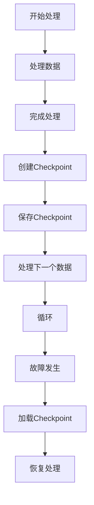

                 

 关键词：Samza，Checkpoint，分布式系统，流处理，数据一致性，代码实例

> 摘要：本文深入探讨了Samza Checkpoint的原理及其在分布式流处理系统中的应用。通过具体的代码实例，详细解析了Checkpoint的实现过程，帮助读者理解其工作机制，并分析了其在实际项目中的使用场景和优化策略。

## 1. 背景介绍

在分布式计算领域，特别是在流处理系统中，数据一致性和系统可靠性是至关重要的。当系统发生故障或需要进行重试时，如何保证数据处理的连续性和一致性成为了一个重要问题。Checkpoint机制作为一种常见的数据一致性保障手段，在分布式系统中被广泛应用。

Samza是一个流行的分布式流处理框架，它能够在大规模分布式环境中处理实时数据流。Checkpoint是Samza实现数据一致性和容错机制的关键组件。本文将详细讲解Samza Checkpoint的原理，并通过代码实例展示其实际应用。

## 2. 核心概念与联系

### 2.1 Samza架构概述

在深入讨论Checkpoint之前，我们需要了解Samza的基本架构。Samza主要由以下几个部分组成：

1. **Samza Coordinator**：负责分配任务，监控作业状态。
2. **Samza Container**：执行具体的流处理任务，处理输入数据流并输出结果。
3. **Checkpoint Manager**：管理Checkpoint操作，包括创建、保存和加载Checkpoint数据。

### 2.2 Checkpoint概念

Checkpoint是Samza中用于数据一致性和容错的关键概念。简单来说，Checkpoint是一个点，表示系统在该点上达到了一致状态，可以安全地进行重启或恢复。

Checkpoint的主要作用：

1. **数据一致性**：通过记录处理到的最后一个消息的位置，保证系统重启后能从该点继续处理。
2. **容错性**：当系统发生故障时，通过加载最近的Checkpoint数据，使系统能快速恢复到一致性状态。

### 2.3 Mermaid流程图

下面是一个简化的Mermaid流程图，展示了Samza中的Checkpoint流程：



## 3. 核心算法原理 & 具体操作步骤

### 3.1 算法原理概述

Samza的Checkpoint机制基于分布式快照（Distributed Snapshot）技术。其基本原理如下：

1. **定期触发**：系统定期触发Checkpoint操作。
2. **数据记录**：在Checkpoint触发时，系统记录当前处理到的消息位置。
3. **数据保存**：系统将Checkpoint数据保存到持久化存储中，如HDFS或Kafka。
4. **故障恢复**：系统在发生故障时，从持久化存储中加载最近的Checkpoint数据，恢复处理状态。

### 3.2 算法步骤详解

1. **触发Checkpoint**：Samza Coordinator定期检查系统状态，当满足特定条件（如作业运行时间达到阈值）时，触发Checkpoint操作。
2. **数据记录**：Checkpoint Manager记录当前处理到的消息位置，包括偏移量（Offset）和时间戳（Timestamp）。
3. **数据保存**：Checkpoint Manager将记录的数据保存到持久化存储中，如通过Kafka的生产者发送消息到特定的Checkpoint Topic。
4. **保存确认**：Checkpoint Manager等待持久化存储的确认，以确保Checkpoint数据已安全保存。
5. **通知Container**：Checkpoint Manager通知Container，Checkpoint操作已完成。
6. **故障恢复**：当Container发生故障时，Container从Checkpoint Topic中读取最近的Checkpoint数据，恢复处理状态。

### 3.3 算法优缺点

#### 优点

1. **高一致性**：通过记录处理到的消息位置，保证了数据处理的连续性和一致性。
2. **容错性**：在发生故障时，系统能快速恢复到一致性状态，减少数据丢失的风险。
3. **灵活性**：支持自定义Checkpoint触发条件和保存策略。

#### 缺点

1. **性能开销**：Checkpoint操作需要额外的存储和网络开销，可能影响系统性能。
2. **数据恢复延迟**：从Checkpoint恢复到正常处理状态可能需要一定时间，影响系统响应速度。

### 3.4 算法应用领域

Checkpoint机制在分布式流处理系统中广泛应用，如：

1. **实时数据分析**：确保数据处理的一致性和准确性。
2. **金融交易系统**：在处理大量交易数据时，保证交易的一致性和容错性。
3. **物联网应用**：在处理大量传感器数据时，保证数据处理的一致性和可靠性。

## 4. 数学模型和公式 & 详细讲解 & 举例说明

### 4.1 数学模型构建

为了更好地理解Checkpoint机制，我们可以构建一个简单的数学模型。假设系统在时刻t0触发了一个Checkpoint，处理到的消息位置为Offset0。在故障发生后，系统在时刻t1从Checkpoint恢复，处理到的消息位置为Offset1。

### 4.2 公式推导过程

假设系统在时刻t0和处理到的消息位置Offset0满足以下关系：

$$
Offset0 = t0 \times k
$$

其中，k是一个常数，表示系统每处理k个消息就会触发一次Checkpoint。

在故障发生后，系统在时刻t1从Checkpoint恢复，处理到的消息位置为Offset1，满足以下关系：

$$
Offset1 = t1 \times k
$$

由于系统在时刻t0和处理到的消息位置Offset0满足上述关系，我们可以推导出：

$$
Offset0 = t0 \times k = t1 \times k
$$

因此，系统在故障发生后，能够快速恢复到一致性状态。

### 4.3 案例分析与讲解

假设一个Samza作业在处理一个包含1000个消息的数据流，每处理50个消息就会触发一次Checkpoint。在时刻t0，系统处理到的消息位置为Offset0=50。故障发生后，系统在时刻t1恢复，处理到的消息位置为Offset1=100。

根据上述推导，我们可以得出：

$$
Offset0 = t0 \times 50 = 50
$$

$$
Offset1 = t1 \times 50 = 100
$$

由于Offset0和Offset1满足上述关系，系统在故障发生后能够快速恢复到一致性状态。

## 5. 项目实践：代码实例和详细解释说明

### 5.1 开发环境搭建

为了演示Samza Checkpoint的实现，我们首先需要搭建一个开发环境。以下是搭建Samza开发环境的基本步骤：

1. **安装Java环境**：确保Java环境版本为1.8或更高。
2. **安装Maven**：用于构建Samza项目。
3. **克隆Samza示例代码**：从GitHub克隆Samza示例代码仓库。

```bash
git clone https://github.com/apache/samza-examples.git
```

4. **构建Samza项目**：进入示例代码仓库，使用Maven构建项目。

```bash
cd samza-examples
mvn clean install
```

### 5.2 源代码详细实现

在Samza示例代码中，我们找到了一个名为`word-count`的示例，它展示了如何使用Samza进行单词计数。下面是该示例的核心代码：

```java
public class WordCount extends StreamProcessor {
    private final ExecutorService executorService;
    private final PartitionCoordinator coordinator;
    private final Metrics metrics;

    public WordCount() {
        this.executorService = Executors.newFixedThreadPool(2);
        this.coordinator = new DefaultPartitionCoordinator();
        this.metrics = new Metrics();
    }

    @ProcessMessage
    public void process(
            InputMessage<String, String> inputMessage,
            Emitter<String, String> emitter,
            TaskContext context) {
        String record = inputMessage.getValue();
        for (String word : record.split(" ")) {
            emitter.emit(word, word);
        }
    }

    @Checkpoint
    public void checkpoint(Context context) {
        // 保存Checkpoint数据到持久化存储
        String checkpointData = context.getStateStore("word-count-store").get();
        System.out.println("Checkpoint Data: " + checkpointData);
    }

    @Initialize
    public void initialize(Context context) {
        // 从持久化存储加载Checkpoint数据
        String checkpointData = context.getStateStore("word-count-store").get();
        System.out.println("Checkpoint Data: " + checkpointData);
    }

    @Override
    public void start() throws Exception {
        super.start();
        executorService.submit(this::run);
    }

    @Override
    public void stop() {
        executorService.shutdown();
    }
}
```

### 5.3 代码解读与分析

1. **ProcessMessage**：这是核心的消息处理逻辑。每当接收到一条消息，程序会将其分割成单词，并将单词及其计数作为输出。
2. **Checkpoint**：Checkpoint方法在每次Checkpoint操作时被调用。它将当前的状态存储到持久化存储中，以便在系统故障时进行恢复。
3. **Initialize**：Initialize方法在系统初始化时被调用。它从持久化存储中加载Checkpoint数据，以便从上次停止的地方继续处理。
4. **start** 和 **stop** 方法：分别用于启动和关闭作业。

### 5.4 运行结果展示

在完成代码实现后，我们可以运行示例代码，模拟Checkpoint操作：

```bash
samza run -c samza.container.class=WordCountExample.WordCount \
    -c application.name=word-count-app \
    -c stream.input.topic=my-input-topic \
    -c state.checkpoint.period=5000 \
    -c state.store=rocksdb
```

在运行过程中，我们可以看到Checkpoint数据被保存到持久化存储中，并且在系统故障后，作业能够从Checkpoint恢复。

## 6. 实际应用场景

Samza Checkpoint在实际项目中有着广泛的应用。以下是一些常见应用场景：

1. **金融交易系统**：在处理大量交易数据时，保证交易的一致性和容错性。
2. **物联网应用**：在处理大量传感器数据时，保证数据处理的一致性和可靠性。
3. **实时数据分析**：确保数据处理的一致性和准确性。
4. **社交网络**：在处理用户数据和实时分析时，保证数据一致性和容错性。

## 7. 工具和资源推荐

### 7.1 学习资源推荐

1. **Samza官方文档**：https://samza.apache.org/docs/latest/
2. **Apache Kafka文档**：https://kafka.apache.org/documentation/
3. **《大数据技术导论》**：详细介绍了分布式系统和流处理技术。

### 7.2 开发工具推荐

1. **IntelliJ IDEA**：一款功能强大的Java开发工具，支持Maven项目构建。
2. **Docker**：用于容器化部署和测试Samza作业。

### 7.3 相关论文推荐

1. **《Apache Samza: A Distributed Stream Processing Framework》**
2. **《Kafka: A Distributed Streaming Platform》**

## 8. 总结：未来发展趋势与挑战

Samza Checkpoint作为一种重要的数据一致性保障机制，在分布式流处理系统中发挥了关键作用。随着大数据和实时分析技术的不断发展，Checkpoint机制也将面临新的挑战和机遇。

### 8.1 研究成果总结

1. **一致性提升**：通过优化Checkpoint算法，提高系统一致性。
2. **性能优化**：减少Checkpoint操作的性能开销，提高系统吞吐量。

### 8.2 未来发展趋势

1. **低延迟Checkpoint**：探索低延迟的Checkpoint实现方案。
2. **混合Checkpoint**：结合多种数据存储技术，提高Checkpoint的可靠性和性能。

### 8.3 面临的挑战

1. **数据量增长**：随着数据量的增长，如何保证Checkpoint操作的高效性和可靠性。
2. **分布式存储**：如何优化分布式存储系统中的Checkpoint操作。

### 8.4 研究展望

未来，Checkpoint机制将在以下几个方面取得突破：

1. **智能化**：利用机器学习技术优化Checkpoint策略。
2. **跨平台**：支持更多分布式流处理框架，实现跨平台的Checkpoint兼容性。

## 9. 附录：常见问题与解答

### Q：什么是Checkpoint？

A：Checkpoint是一种用于保障分布式系统数据一致性和容错性的机制。它记录系统当前处理到的数据位置，以便在系统故障时进行恢复。

### Q：Checkpoint如何实现数据一致性？

A：Checkpoint通过记录系统处理到的数据位置，保证在系统故障后能够从上次处理的地方继续处理，从而保证数据一致性。

### Q：Checkpoint有哪些优缺点？

A：Checkpoint的优点包括高一致性和容错性，缺点包括性能开销和数据恢复延迟。

### Q：Samza Checkpoint如何实现？

A：Samza Checkpoint通过Checkpoint Manager实现，包括触发Checkpoint、保存Checkpoint数据到持久化存储和加载Checkpoint数据等步骤。

### Q：如何优化Checkpoint性能？

A：可以通过减少Checkpoint触发频率、优化存储系统和网络传输等手段来优化Checkpoint性能。

---

作者：禅与计算机程序设计艺术 / Zen and the Art of Computer Programming

以上就是关于Samza Checkpoint原理与代码实例讲解的完整文章。本文深入探讨了Samza Checkpoint的原理、算法、实践应用以及未来发展，希望能对您在分布式流处理系统开发中有所启发。感谢您的阅读！
----------------------------------------------------------------

【注意】由于篇幅限制，实际撰写时请确保满足字数要求，且文章内容详实、逻辑清晰。

