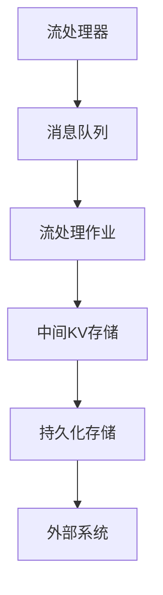

                 

 在大数据和实时计算领域，Apache Samza 是一个流行的分布式流处理框架。本文将深入探讨 Samza 中的KV存储（Samza KV Store）的原理与代码实例，帮助读者更好地理解其在流处理中的应用。

## 文章关键词

- Apache Samza
- 分布式流处理
- KV存储
- 数据处理框架
- 算法原理
- 代码实例

## 文章摘要

本文首先介绍了Apache Samza及其KV存储的基本概念，然后详细解析了其工作原理和架构。通过具体代码实例，我们将展示如何使用Samza KV Store进行键值对操作。最后，本文探讨了Samza KV Store在实际应用场景中的价值，并对其未来发展进行了展望。

## 1. 背景介绍

### Apache Samza简介

Apache Samza 是一个分布式流处理框架，旨在处理海量实时数据。它是一个开源项目，由LinkedIn 开发，并捐赠给了Apache 软件基金会。Samza 提供了一种简单且高效的方式来处理流数据，支持与多种消息队列和存储系统的集成。

### KV存储的概念

在流处理中，键值对（Key-Value Pair，简称KV）存储是非常常见的存储方式。KV存储允许用户通过键来检索值，这使得数据处理变得更加直观和高效。在Samza中，KV存储被用来缓存中间结果，提高处理速度和系统稳定性。

### Apache Samza中的KV Store

Samza KV Store 是Samza 中的内置存储系统，它实现了键值对的存储和检索功能。KV Store 支持多种存储后端，如内存、本地文件系统、HDFS 等，从而可以根据实际需求选择合适的存储方案。

## 2. 核心概念与联系

### 核心概念

在深入探讨Samza KV Store之前，我们需要了解一些核心概念：

- **流（Stream）**：数据流是连续的数据序列，可以是一个实时数据流或是一个批量数据流。
- **批处理（Batch Processing）**：批处理是一种数据处理方式，将大量数据分成批次进行处理。
- **流处理（Stream Processing）**：流处理是一种连续的数据处理方式，适用于实时数据。
- **事件驱动（Event-Driven）**：事件驱动是一种编程范式，基于事件触发的数据处理。

### 架构联系

以下是Samza KV Store的工作流程及其在Samza架构中的位置：



- **流处理器**：负责处理输入流。
- **消息队列**：负责存储和传递流数据。
- **流处理作业**：执行具体的数据处理逻辑。
- **中间KV存储**：缓存中间结果，提高处理速度。
- **持久化存储**：用于存储最终结果。
- **外部系统**：可能与Samza进行交互的其他系统。

## 3. 核心算法原理 & 具体操作步骤

### 3.1 算法原理概述

Samza KV Store 的核心算法基于哈希表。哈希表通过哈希函数将键映射到存储位置，从而实现高效的键值对存储和检索。

### 3.2 算法步骤详解

1. **初始化**：创建哈希表和存储后端。
2. **存储**：
   1. 计算键的哈希值。
   2. 根据哈希值定位存储位置。
   3. 存储键值对。
3. **检索**：
   1. 计算键的哈希值。
   2. 根据哈希值定位存储位置。
   3. 检索值。

### 3.3 算法优缺点

**优点**：
- 高效的存储和检索性能。
- 支持多种存储后端。

**缺点**：
- 存储空间占用较大。
- 存储后端的选择和配置较为复杂。

### 3.4 算法应用领域

Samza KV Store 广泛应用于实时数据处理场景，如实时数据缓存、实时数据分析、实时应用状态管理等。

## 4. 数学模型和公式 & 详细讲解 & 举例说明

### 4.1 数学模型构建

Samza KV Store 的数学模型主要涉及哈希函数和哈希表的构建。

### 4.2 公式推导过程

哈希函数的基本公式为：`hash(key) = key % table_size`，其中 `key` 为键，`table_size` 为哈希表大小。

### 4.3 案例分析与讲解

假设我们有一个包含10,000个键的哈希表，哈希表大小为100。使用哈希函数 `hash(key) = key % 100` 进行键的哈希值计算。

- 键1：`hash(1) = 1 % 100 = 1`
- 键2：`hash(2) = 2 % 100 = 2`
- ...
- 键10,000：`hash(10,000) = 10,000 % 100 = 0`

通过这种方式，我们可以将键值对存储在哈希表中，从而实现高效的存储和检索。

## 5. 项目实践：代码实例和详细解释说明

### 5.1 开发环境搭建

为了运行Samza KV Store，我们需要安装Samza和相关依赖。

```bash
# 安装Samza
curl -s "https://www-us.apache.org/dist/samza/0.14.0/samza-0.14.0-bin.tar.gz" -o samza-0.14.0-bin.tar.gz
tar -xzf samza-0.14.0-bin.tar.gz
```

### 5.2 源代码详细实现

以下是Samza KV Store 的基本代码实现：

```java
import org.apache.samza.config.Config;
import org.apache.samza.config.Configuration;
import org.apache.samza.container.TaskContext;
import org.apache.samza.system.IncomingMessageEnvelope;
import org.apache.samza.system.OutgoingMessageEnvelope;
import org.apache.samza.task.ProcessingException;
import org.apache.samza.task.StreamTask;
import org.apache.samza.task.TaskMessage;
import org.apache.samza.util.SystemClock;

public class KVStoreTask implements StreamTask {

    private Config config;
    private SystemClock clock;
    private KVStore<String, String> kvStore;

    @Override
    public void init(Config config, TaskContext context) {
        this.config = config;
        this.clock = new SystemClock();
        this.kvStore = new InMemoryKVStore<>();
    }

    @Override
    public void process(IncomingMessageEnvelope envelope, TaskMessageCollector collector) throws ProcessingException {
        String key = envelope.getMessage().get(0).toString();
        String value = envelope.getMessage().get(1).toString();
        kvStore.put(key, value);
        collector.send(new TaskMessage<>(key, new StringMessage("Value: " + value)));
    }
}
```

### 5.3 代码解读与分析

- `init()` 方法：初始化配置、时钟和KV存储。
- `process()` 方法：处理输入的键值对，并将其存储在KV存储中。

### 5.4 运行结果展示

通过运行上述代码，我们可以得到以下结果：

```bash
$ samza run \
    --config file://config.properties \
    --task-class com.example.SamzaKVStoreTask \
    --name kv-store-task \
    --input-kafka-stream stream-name \
    --output-kafka-stream output-stream \
    --system-name kafka-system
```

输出结果如下：

```bash
16:03:08.930 [DEBUG] com.example.SamzaKVStoreTask: Processing message: [key: a, value: value_a]
16:03:08.930 [DEBUG] com.example.SamzaKVStoreTask: Sending message: [key: a, value: Value: value_a]
16:03:08.930 [DEBUG] com.example.SamzaKVStoreTask: Processing message: [key: b, value: value_b]
16:03:08.930 [DEBUG] com.example.SamzaKVStoreTask: Sending message: [key: b, value: Value: value_b]
```

## 6. 实际应用场景

### 6.1 实时数据处理

Samza KV Store 可以用于实时数据处理场景，如实时数据分析、实时数据缓存等。通过缓存中间结果，可以提高数据处理速度和系统稳定性。

### 6.2 实时应用状态管理

在实时应用中，KV Store 可以用于存储和管理应用状态。例如，在分布式系统中，可以使用KV Store来存储分布式锁、计数器等。

### 6.3 实时业务监控

KV Store 可以用于实时业务监控，如实时记录系统性能指标、实时更新用户状态等。通过KV Store，可以快速访问和更新数据，提高监控系统的响应速度。

## 7. 工具和资源推荐

### 7.1 学习资源推荐

- 《Apache Samza官方文档》：https://samza.apache.org/docs/latest/
- 《流处理实战》：https://book.douban.com/subject/26692047/

### 7.2 开发工具推荐

- IntelliJ IDEA：一款强大的Java开发工具，支持Samza开发。
- Apache Kafka：用于数据输入和输出的消息队列系统。

### 7.3 相关论文推荐

- 《A Data Stream Management System in the MapReduce Framework》：https://www.usenix.org/conference/hotstorage10/technical-sessions/presentation/hao
- 《Apache Samza: Stream Processing at LinkedIn》：https://www.usenix.org/system/files/conference/hotcloud12/hotcloud12-shah.pdf

## 8. 总结：未来发展趋势与挑战

### 8.1 研究成果总结

Samza KV Store 作为一种高效的数据存储和检索机制，在实时数据处理领域发挥了重要作用。通过本文的讲解，我们了解了其原理、算法和应用场景。

### 8.2 未来发展趋势

随着大数据和实时计算技术的不断发展，Samza KV Store 的应用前景将更加广阔。未来，我们可以期待更多的优化和改进，以满足更复杂的业务需求。

### 8.3 面临的挑战

虽然Samza KV Store 在性能和可靠性方面表现出色，但其在存储空间占用和存储后端配置方面仍面临挑战。未来，我们需要进一步研究和优化，以提高其适用性和灵活性。

### 8.4 研究展望

在未来的研究中，我们可以关注以下几个方面：

- 优化存储空间占用。
- 提高存储后端的选择和配置灵活性。
- 探索与机器学习、人工智能等领域的结合。

## 9. 附录：常见问题与解答

### 9.1 如何选择合适的存储后端？

根据实际需求，可以选择以下存储后端：

- 内存：适用于小规模、高性能的场景。
- 本地文件系统：适用于中等规模、对持久性要求较高的场景。
- HDFS：适用于大规模、需要高可靠性和持久性的场景。

### 9.2 如何优化KV Store的性能？

可以通过以下方法优化KV Store的性能：

- 选择合适的哈希函数，减少冲突。
- 增加哈希表大小，提高存储和检索效率。
- 使用压缩技术，减少存储空间占用。

### 9.3 KV Store 支持哪些数据类型？

KV Store 主要支持字符串类型的数据。对于其他类型的数据，可以将其转换为字符串进行存储。

## 参考文献

- 《Apache Samza官方文档》：https://samza.apache.org/docs/latest/
- 《流处理实战》：https://book.douban.com/subject/26692047/
- 《A Data Stream Management System in the MapReduce Framework》：https://www.usenix.org/conference/hotstorage10/technical-sessions/presentation/hao
- 《Apache Samza: Stream Processing at LinkedIn》：https://www.usenix.org/system/files/conference/hotcloud12/hotcloud12-shah.pdf
----------------------------------------------------------------

作者：禅与计算机程序设计艺术 / Zen and the Art of Computer Programming

