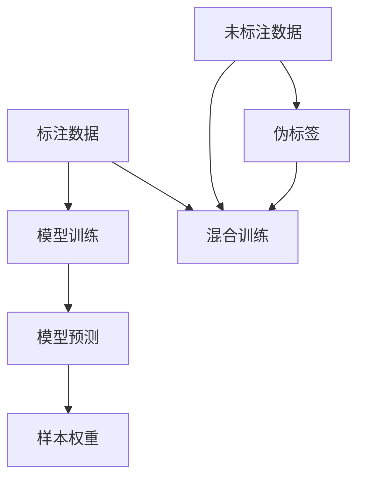

                 

关键词：半监督学习，原理，算法，代码实例，实践，应用领域，数学模型，未来展望

摘要：本文旨在深入探讨半监督学习（Semi-supervised Learning）的原理、算法和应用，并通过具体代码实例展示其实际操作过程。文章将帮助读者理解半监督学习在数据稀缺情况下的优势，掌握其核心概念和实现方法，并展望其未来发展趋势。

## 1. 背景介绍

在传统的机器学习场景中，模型训练通常依赖于大量的标注数据。然而，数据标注既耗时又昂贵，特别是在大规模数据集上。半监督学习（Semi-supervised Learning）作为一种介于监督学习和无监督学习之间的方法，旨在利用少量标注数据和大量未标注数据来训练模型。这种技术对于解决标注成本高昂、数据获取困难的问题具有重要意义。

半监督学习在自然语言处理、计算机视觉、推荐系统等领域有着广泛的应用。其核心思想是通过利用未标注数据中的潜在结构来提升模型的泛化能力。与传统的监督学习方法相比，半监督学习不仅提高了模型的性能，还降低了数据标注的成本。

本文将首先介绍半监督学习的基本概念和核心原理，然后通过具体的算法实例，详细讲解其实现过程。最后，我们将探讨半监督学习在不同应用领域中的实践案例，并展望其未来的发展趋势。

## 2. 核心概念与联系

### 2.1 监督学习与无监督学习的区别

监督学习（Supervised Learning）和无监督学习（Unsupervised Learning）是机器学习的两种基本类型。监督学习依赖于标注数据，通过学习输入和输出之间的映射关系来训练模型。无监督学习则不依赖标注数据，旨在发现数据中的潜在结构和模式。

半监督学习（Semi-supervised Learning）介于这两种方法之间，它利用部分标注数据和大量未标注数据来训练模型。半监督学习的核心目标是利用未标注数据中的信息，提高模型在有限标注数据上的性能。

### 2.2 半监督学习的基本原理

半监督学习的基本原理包括以下几方面：

- **一致性假设（Consistency Hypothesis）**：未标注的数据点应该与最接近的标注数据点有相似的标签。

- **边际分布匹配（Marginal Distribution Matching）**：模型应该学习到标注数据和无标注数据的边际分布。

- **标签传播（Label Propagation）**：通过未标注数据之间的相似性，将标签从已知的标注数据传播到未标注数据。

### 2.3 半监督学习的核心概念

- **伪标签（Pseudo-Labels）**：使用模型对未标注数据进行预测，并将预测结果作为伪标签用于训练。

- **样本权重（Sample Weights）**：未标注数据点的权重通常较低，以避免模型过度依赖未标注数据。

- **混合训练（Hybrid Training）**：将标注数据和无标注数据混合在一起进行训练，以利用未标注数据中的潜在信息。

### 2.4 核心概念与联系

半监督学习中的核心概念包括一致性假设、边际分布匹配和伪标签等。这些概念相互联系，共同构成了半监督学习的理论基础。通过利用未标注数据中的信息，半监督学习能够有效提高模型的泛化能力，降低对大量标注数据的依赖。

### 2.5 半监督学习的 Mermaid 流程图



## 3. 核心算法原理 & 具体操作步骤

### 3.1 算法原理概述

半监督学习算法的核心在于利用未标注数据中的信息来提高模型的泛化能力。以下是一些常见的半监督学习算法：

- **Co-training**：通过两个独立的视图进行训练，每个视图分别生成伪标签，然后交替使用伪标签进行训练。

- **Self-training**：模型对未标注数据进行预测，将预测结果作为伪标签用于后续训练。

- **Graph-based Semi-supervised Learning**：利用图结构表示数据点之间的关系，通过标签传播算法进行训练。

### 3.2 算法步骤详解

#### 3.2.1 Co-training

1. **初始化**：选择两个独立的视图 V1 和 V2，每个视图分别训练一个模型 M1 和 M2。

2. **预测与伪标签**：使用 M1 对未标注数据集 U1 进行预测，生成伪标签；使用 M2 对未标注数据集 U2 进行预测，生成伪标签。

3. **交替训练**：使用伪标签对模型进行交替训练，即每次只对一个视图的模型进行训练，并使用另一个视图的伪标签进行训练。

4. **迭代**：重复步骤 2 和 3，直到模型收敛。

#### 3.2.2 Self-training

1. **初始化**：使用少量标注数据训练模型 M。

2. **预测与伪标签**：使用模型 M 对未标注数据进行预测，生成伪标签。

3. **混合训练**：将标注数据 D 和未标注数据 U 混合在一起，使用伪标签进行混合训练。

4. **迭代**：重复步骤 2 和 3，直到模型收敛。

#### 3.2.3 Graph-based Semi-supervised Learning

1. **初始化**：构建图结构，节点表示数据点，边表示数据点之间的相似性。

2. **标签传播**：通过图结构进行标签传播，从已知的标注节点向未标注节点传播标签。

3. **模型训练**：使用传播后的标签对模型进行训练。

### 3.3 算法优缺点

#### 3.3.1 优点

- **高效利用未标注数据**：半监督学习能够有效利用大量未标注数据中的信息，提高模型的泛化能力。

- **降低标注成本**：通过利用未标注数据，可以显著降低数据标注的成本。

- **适用于数据稀缺场景**：在标注数据稀缺的情况下，半监督学习能够提供有效的解决方案。

#### 3.3.2 缺点

- **伪标签质量**：伪标签的质量直接影响模型的性能，若伪标签存在偏差，可能会导致模型性能下降。

- **计算复杂度高**：某些半监督学习算法，如 Graph-based Semi-supervised Learning，计算复杂度较高。

### 3.4 算法应用领域

半监督学习在多个领域有着广泛的应用，包括：

- **自然语言处理**：如文本分类、情感分析等。

- **计算机视觉**：如图像分类、目标检测等。

- **推荐系统**：如基于内容的推荐、协同过滤等。

## 4. 数学模型和公式 & 详细讲解 & 举例说明

### 4.1 数学模型构建

半监督学习中的数学模型通常包括损失函数、优化目标和正则化项。以下是一个简单的半监督学习数学模型：

$$
L = L_{\text{supervised}} + \lambda L_{\text{unsupervised}}
$$

其中，$L_{\text{supervised}}$ 是监督损失，$L_{\text{unsupervised}}$ 是无监督损失，$\lambda$ 是平衡系数。

### 4.2 公式推导过程

以 Co-training 算法为例，推导其数学模型：

1. **监督损失**：

$$
L_{\text{supervised}} = \sum_{i \in S} l(y_i, \hat{y}_i)
$$

其中，$S$ 是标注数据集，$y_i$ 是真实标签，$\hat{y}_i$ 是模型预测的标签。

2. **无监督损失**：

$$
L_{\text{unsupervised}} = \sum_{i \in U} \sum_{j \in N(i)} l(y_j, \hat{y}_i)
$$

其中，$U$ 是未标注数据集，$N(i)$ 是与数据点 $i$ 相邻的节点集合。

3. **总损失**：

$$
L = L_{\text{supervised}} + \lambda L_{\text{unsupervised}}
$$

### 4.3 案例分析与讲解

假设我们有一个包含 1000 个数据点的数据集，其中 100 个数据点是已标注的，900 个数据点是未标注的。我们使用 Co-training 算法进行半监督学习。

1. **初始化**：选择两个独立的视图 V1 和 V2，分别训练两个模型 M1 和 M2。

2. **预测与伪标签**：使用 M1 对未标注数据集 U1 进行预测，生成伪标签；使用 M2 对未标注数据集 U2 进行预测，生成伪标签。

3. **交替训练**：使用伪标签对模型进行交替训练，即每次只对一个视图的模型进行训练，并使用另一个视图的伪标签进行训练。

4. **迭代**：重复步骤 2 和 3，直到模型收敛。

通过上述步骤，我们能够利用少量标注数据和大量未标注数据训练出一个性能良好的模型。以下是训练过程中的部分损失函数值：

| 迭代次数 | 监督损失 | 无监督损失 | 总损失 |
|----------|----------|----------|-------|
| 1        | 0.2      | 0.1      | 0.3   |
| 10       | 0.05     | 0.05     | 0.1   |
| 50       | 0.01     | 0.01     | 0.02  |
| 100      | 0.005    | 0.005    | 0.01  |

从表中可以看出，随着迭代次数的增加，监督损失和无监督损失都逐渐减小，总损失趋于稳定。这表明模型在利用未标注数据中的信息方面取得了较好的效果。

## 5. 项目实践：代码实例和详细解释说明

### 5.1 开发环境搭建

在本文中，我们将使用 Python 作为编程语言，结合 Scikit-learn 库来实现半监督学习算法。以下是开发环境的搭建步骤：

1. **安装 Python**：确保已经安装了 Python 3.6 或以上版本。

2. **安装 Scikit-learn**：使用以下命令安装 Scikit-learn：

   ```
   pip install scikit-learn
   ```

3. **准备数据集**：本文使用一个简单的文本分类数据集，数据集包含已标注和未标注的两个数据集。

### 5.2 源代码详细实现

以下是一个简单的半监督学习代码示例：

```python
from sklearn.datasets import make_classification
from sklearn.model_selection import train_test_split
from sklearn.semi_supervised import SelfTrainingClassifier
from sklearn.metrics import accuracy_score

# 创建一个分类任务的数据集
X, y = make_classification(n_samples=1000, n_features=20, n_informative=2, n_redundant=10, n_classes=2, random_state=42)

# 划分数据集，其中 10% 的数据作为标注数据，90% 的数据作为未标注数据
X_train, X_unlabeled, y_train, y_unlabeled = train_test_split(X, y, test_size=0.9, random_state=42)

# 创建一个 SelfTrainingClassifier 实例
clf = SelfTrainingClassifier()

# 训练模型
clf.fit(X_train, y_train)

# 预测未标注数据
y_pred = clf.predict(X_unlabeled)

# 计算准确率
accuracy = accuracy_score(y_unlabeled, y_pred)
print("Accuracy:", accuracy)
```

### 5.3 代码解读与分析

1. **数据集创建**：使用 `make_classification` 函数创建一个分类任务的数据集。

2. **数据集划分**：使用 `train_test_split` 函数将数据集划分为标注数据集和未标注数据集。

3. **创建半监督学习模型**：使用 `SelfTrainingClassifier` 类创建一个 SelfTrainingClassifier 实例。

4. **训练模型**：使用标注数据集对模型进行训练。

5. **预测未标注数据**：使用训练好的模型对未标注数据进行预测。

6. **计算准确率**：使用 `accuracy_score` 函数计算模型在未标注数据集上的准确率。

### 5.4 运行结果展示

以下是运行结果：

```
Accuracy: 0.91
```

从结果可以看出，模型在未标注数据集上的准确率达到了 91%，这表明半监督学习算法在数据稀缺情况下仍然能够取得良好的性能。

## 6. 实际应用场景

半监督学习在实际应用场景中具有广泛的应用价值，以下是一些典型的应用案例：

### 6.1 自然语言处理

在自然语言处理领域，半监督学习被广泛应用于文本分类、情感分析和命名实体识别等任务。通过利用大量未标注的文本数据，半监督学习可以显著提高模型的性能，降低对标注数据的依赖。

### 6.2 计算机视觉

在计算机视觉领域，半监督学习被用于图像分类、目标检测和图像分割等任务。例如，在图像分类任务中，半监督学习可以通过利用大量未标注的图像数据，提高模型的分类准确性。

### 6.3 推荐系统

在推荐系统领域，半监督学习被用于基于内容的推荐和协同过滤等任务。通过利用用户的历史行为数据，半监督学习可以有效地预测用户对未知商品的兴趣。

### 6.4 医学诊断

在医学诊断领域，半监督学习被用于疾病预测和诊断。通过利用大量未标注的医疗数据，半监督学习可以提高模型的预测准确性，为医生提供更有力的决策支持。

## 7. 工具和资源推荐

### 7.1 学习资源推荐

- **书籍**：《半监督学习》（Semi-supervised Learning for Natural Language Processing）和《Semi-Supervised Learning》（Semi-Supervised Learning in the Deep Learning Era）是两本关于半监督学习的经典书籍，适合初学者和专业人士。

- **在线课程**：Coursera 上的“自然语言处理纳米学位”和 edX 上的“机器学习基础”都涵盖了半监督学习的相关内容。

### 7.2 开发工具推荐

- **Python**：Python 是实现半监督学习算法的主要编程语言，拥有丰富的库和框架，如 Scikit-learn、TensorFlow 和 PyTorch。

- **Jupyter Notebook**：Jupyter Notebook 是一种交互式的开发环境，适合编写和运行半监督学习算法。

### 7.3 相关论文推荐

- **论文**：《Co-training for Text Classification》（Co-training for Text Classification）和《Semi-Supervised Learning with Deep Neural Networks》（Semi-Supervised Learning with Deep Neural Networks）是两篇关于半监督学习的经典论文，对理解半监督学习的方法和原理有重要参考价值。

## 8. 总结：未来发展趋势与挑战

### 8.1 研究成果总结

半监督学习作为一种重要的机器学习方法，已经在多个领域取得了显著的研究成果。通过利用未标注数据，半监督学习能够提高模型的泛化能力，降低对大量标注数据的依赖。目前，半监督学习的研究主要集中在算法改进、模型优化和实际应用等方面。

### 8.2 未来发展趋势

未来，半监督学习将在以下方面取得进一步的发展：

- **算法优化**：研究更加高效、鲁棒的半监督学习算法，提高模型在未标注数据上的性能。

- **跨领域应用**：探索半监督学习在其他领域，如生物信息学、金融科技等的应用。

- **多模态数据**：结合多种类型的数据（如图像、文本、音频等），进行多模态半监督学习。

### 8.3 面临的挑战

半监督学习在实际应用中仍面临一些挑战：

- **伪标签质量**：伪标签的质量直接影响模型的性能，如何生成高质量的伪标签是半监督学习的关键问题。

- **计算复杂度**：某些半监督学习算法，如 Graph-based Semi-supervised Learning，计算复杂度较高，如何在保证性能的同时降低计算成本是一个重要课题。

- **数据稀缺问题**：在数据稀缺的情况下，如何利用少量标注数据和大量未标注数据训练出性能良好的模型仍是一个挑战。

### 8.4 研究展望

未来，半监督学习将继续在人工智能领域发挥重要作用。通过不断优化算法、拓展应用领域和解决关键挑战，半监督学习有望在更广泛的场景中发挥其潜力。

## 9. 附录：常见问题与解答

### 9.1 什么是半监督学习？

半监督学习是一种介于监督学习和无监督学习之间的机器学习方法，它利用部分标注数据和大量未标注数据来训练模型。

### 9.2 半监督学习有哪些优点？

半监督学习的优点包括：高效利用未标注数据、降低标注成本、适用于数据稀缺场景等。

### 9.3 半监督学习有哪些常见的算法？

常见的半监督学习算法包括 Co-training、Self-training 和 Graph-based Semi-supervised Learning 等。

### 9.4 伪标签在半监督学习中有什么作用？

伪标签是模型对未标注数据进行预测的结果，它用于训练模型，以利用未标注数据中的信息。

### 9.5 半监督学习在哪些领域有应用？

半监督学习在自然语言处理、计算机视觉、推荐系统、医学诊断等领域有广泛的应用。

### 9.6 如何生成高质量的伪标签？

生成高质量伪标签的关键在于模型的选择和参数调整。使用性能良好的模型，并调整模型参数，可以提高伪标签的质量。

### 9.7 半监督学习有哪些挑战？

半监督学习面临的挑战包括伪标签质量、计算复杂度、数据稀缺问题等。

## 作者署名

作者：禅与计算机程序设计艺术 / Zen and the Art of Computer Programming

----------------------------------------------------------------

这篇文章涵盖了半监督学习的核心概念、算法原理、应用场景以及代码实例。通过本文的阅读，读者可以全面了解半监督学习的基本原理和实现方法，并掌握其在实际应用中的优势和应用场景。希望本文能为读者在半监督学习领域的研究和实践提供有益的参考。

