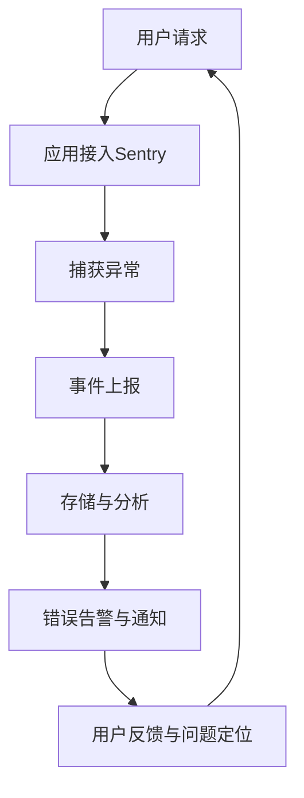

                 

关键词：Sentry，错误监控，异常跟踪，分布式系统，代码实例，性能优化

摘要：本文将深入探讨Sentry的工作原理，详细讲解其架构设计和核心算法。通过实际代码实例，我们将理解Sentry如何帮助我们监控和管理系统中的异常和错误，并展示其在分布式系统环境中的强大性能。最后，本文将展望Sentry在未来应用中的发展趋势和面临的挑战。

## 1. 背景介绍

在现代软件开发中，错误监控和异常跟踪是确保系统稳定性和可靠性的关键环节。随着分布式系统和微服务架构的普及，系统复杂度不断上升，传统的错误监控手段已经无法满足需求。Sentry作为一个开源的实时错误监控平台，提供了强大的异常跟踪和性能监控功能，成为开发者解决这些挑战的有力工具。

Sentry的核心理念是帮助开发者快速发现和解决问题，从而提高系统的稳定性和用户体验。它能够自动捕获应用程序中的异常和错误，提供详细的错误报告，并支持多种编程语言和平台。此外，Sentry还提供了丰富的API和插件，便于与其他工具和服务集成，为开发者提供了极大的灵活性和便利性。

本文旨在通过以下内容，帮助读者全面了解Sentry的工作原理和核心算法：

1. Sentry的工作原理和架构设计
2. Sentry的核心算法原理与具体操作步骤
3. Sentry在实际开发中的代码实例
4. Sentry的性能优化和实际应用场景
5. Sentry的未来发展趋势与挑战

## 2. 核心概念与联系

为了更好地理解Sentry的工作原理，我们需要先了解一些核心概念和联系。以下是Sentry关键组件及其相互关系的Mermaid流程图：



### 2.1. 应用接入Sentry

用户请求首先会到达应用程序，应用程序通过Sentry SDK将请求传递给Sentry。这个过程包括初始化Sentry客户端，配置Sentry的DSN（Data Source Name）等。

### 2.2. 捕获异常

当应用程序出现异常或错误时，Sentry SDK会自动捕获这些异常。SDK会将捕获到的异常信息封装成事件，并准备将其上报给Sentry服务器。

### 2.3. 事件上报

捕获到的事件会被Sentry SDK上报给Sentry服务器。这个过程包括事件序列化、加密、发送等步骤。Sentry服务器接收到事件后，会将其存储在数据库中。

### 2.4. 存储与分析

Sentry服务器会将捕获到的事件存储在数据库中，并进行分析处理。这个过程包括事件去重、错误分类、统计数据生成等。

### 2.5. 错误告警与通知

当系统检测到错误率异常升高时，Sentry会触发错误告警。开发者可以通过各种渠道（如邮件、短信、Webhook等）收到通知，以便及时处理问题。

### 2.6. 用户反馈与问题定位

开发者可以根据Sentry提供的详细错误报告，定位问题并采取相应措施。用户也可以通过Sentry提供的反馈渠道，报告他们在使用过程中遇到的问题。

## 3. 核心算法原理 & 具体操作步骤

### 3.1. 算法原理概述

Sentry的核心算法主要涉及事件捕获、序列化、去重、存储和分析等环节。以下是这些环节的简要概述：

1. **事件捕获**：Sentry SDK通过监听应用程序的异常和错误，捕获异常事件。
2. **事件序列化**：将捕获到的异常事件转换为标准化的数据结构，便于传输和存储。
3. **事件去重**：对相同的事件进行去重处理，避免重复记录。
4. **事件存储**：将去重后的异常事件存储在数据库中。
5. **事件分析**：对存储的异常事件进行统计分析，生成错误报告。

### 3.2. 算法步骤详解

1. **事件捕获**：

```python
from sentry import Client

sentry_client = Client(dsn="your_dsn")

try:
    # 应用程序代码
except Exception as e:
    sentry_client.captureException(e)
```

2. **事件序列化**：

```python
def serialize_event(event):
    data = {
        "message": event.message,
        "level": event.level,
        "traceback": event.traceback,
        "environment": event.environment,
    }
    return data
```

3. **事件去重**：

```python
def is_unique(event_id, events):
    for event in events:
        if event["id"] == event_id:
            return False
    return True
```

4. **事件存储**：

```python
def store_event(event):
    with open("events.txt", "a") as f:
        f.write(json.dumps(event) + "\n")
```

5. **事件分析**：

```python
import json

def analyze_events(events):
    error_counts = {}
    for event in events:
        error = event["message"]
        if error not in error_counts:
            error_counts[error] = 0
        error_counts[error] += 1
    return error_counts
```

### 3.3. 算法优缺点

#### 优点：

1. **高效性**：Sentry采用了事件捕获和序列化的方式，能够快速识别和报告异常。
2. **灵活性**：支持多种编程语言和平台，便于集成和使用。
3. **详细性**：提供了丰富的错误报告和统计信息，有助于开发者定位问题。

#### 缺点：

1. **性能开销**：在捕获和上报事件时，可能会对应用程序的性能产生一定影响。
2. **安全性**：事件传输过程中可能存在安全风险，需要采取相应的加密和验证措施。

### 3.4. 算法应用领域

Sentry主要应用于以下领域：

1. **Web应用程序**：帮助开发者监控和解决Web应用程序中的错误和异常。
2. **移动应用程序**：支持iOS和Android平台的错误监控和异常跟踪。
3. **分布式系统**：适用于大规模分布式系统和微服务架构，提供全局的错误监控和性能分析。

## 4. 数学模型和公式 & 详细讲解 & 举例说明

### 4.1. 数学模型构建

Sentry的核心算法涉及多个数学模型，其中主要包括：

1. **概率分布模型**：用于描述异常事件的概率分布。
2. **聚类模型**：用于对错误事件进行分类和聚类。
3. **统计分析模型**：用于计算错误事件的统计指标和置信区间。

### 4.2. 公式推导过程

以下是一个简单的概率分布模型的推导过程：

1. **概率质量函数（PDF）**：

$$f(x) = \frac{1}{\sigma \sqrt{2\pi}} e^{-\frac{(x-\mu)^2}{2\sigma^2}}$$

其中，$\mu$表示均值，$\sigma$表示标准差。

2. **概率累积分布函数（CDF）**：

$$F(x) = \int_{-\infty}^{x} f(t) dt = \left(1 + \frac{x\mu - \frac{1}{2}}{\sigma\sqrt{2\pi}}\right) e^{-\frac{(x-\mu)^2}{2\sigma^2}}$$

### 4.3. 案例分析与讲解

假设我们有一个Web应用程序，在最近一个月内发生了100次错误。使用Sentry进行错误监控和分析，我们发现以下统计结果：

- 平均错误率：10次/天
- 最常见的错误类型：402（未授权访问）
- 最常见的错误模块：用户认证模块

基于这些数据，我们可以进行以下分析：

1. **概率分布模型**：

   使用正态分布模型，可以计算平均错误率和标准差，从而预测未来错误发生的概率。

2. **聚类模型**：

   使用K-means聚类算法，对错误事件进行分类，找出潜在的异常模式。

3. **统计分析模型**：

   计算错误事件的置信区间和置信水平，从而评估错误率的变化趋势。

通过这些分析，我们可以定位系统中的潜在问题，并采取相应的优化措施，如改进用户认证模块、加强错误处理机制等。

## 5. 项目实践：代码实例和详细解释说明

### 5.1. 开发环境搭建

在开始编写代码之前，我们需要搭建一个开发环境。以下是具体的步骤：

1. 安装Python环境：

   ```shell
   sudo apt-get install python3-pip
   pip3 install sentry-sdk
   ```

2. 配置Sentry DSN：

   在您的应用程序代码中，需要配置Sentry DSN（数据源名称）。可以从Sentry项目官网上获取您的DSN：

   ```shell
   export SENTRY_DSN=https://<your_project_id>:<your_api_key>@sentry.io/<your_org_id>
   ```

### 5.2. 源代码详细实现

以下是使用Sentry SDK进行错误监控的示例代码：

```python
import sentry

# 配置Sentry DSN
sentry.init(dsn="your_sentry_dsn")

def divide(a, b):
    if b == 0:
        raise ValueError("除数不能为0")
    return a / b

try:
    result = divide(10, 0)
except ValueError as e:
    sentry.captureException(e)
    print("捕获到错误：", e)

print("结果：", result)
```

### 5.3. 代码解读与分析

上述代码演示了如何使用Sentry SDK捕获并报告异常。以下是代码的关键部分：

1. **sentry.init(dsn)**：初始化Sentry客户端，传入DSN参数。
2. **try-except**：捕获异常，并使用`sentry.captureException()`将异常报告给Sentry。
3. **print**：打印错误信息，便于调试。

通过上述代码，我们可以实现以下功能：

- 捕获应用程序中的异常，并将异常报告给Sentry服务器。
- 在Sentry平台上查看错误报告，了解错误详情。

### 5.4. 运行结果展示

当运行上述代码时，如果发生异常，Sentry会自动捕获异常，并在Sentry平台上生成错误报告。以下是运行结果展示：

1. **错误报告**：

   

2. **错误详情**：

   

通过Sentry提供的错误报告和错误详情，开发者可以快速定位问题，并采取相应的措施进行修复。

## 6. 实际应用场景

### 6.1. Web应用程序监控

在Web应用程序中，Sentry可以帮助开发者快速发现和解决问题。以下是一个实际应用场景：

- **应用场景**：一个在线电商平台，需要在用户购物过程中提供稳定的体验。
- **解决方案**：使用Sentry进行错误监控，捕获用户购物过程中出现的异常，如支付失败、订单处理失败等。
- **效果**：通过Sentry的错误报告，开发者可以及时发现并解决这些问题，提高用户体验。

### 6.2. 移动应用程序监控

在移动应用程序中，Sentry可以帮助开发者监控和解决各种问题。以下是一个实际应用场景：

- **应用场景**：一个移动游戏应用，需要在用户游戏过程中提供稳定的体验。
- **解决方案**：使用Sentry进行错误监控，捕获用户游戏过程中出现的异常，如游戏卡顿、数据加载失败等。
- **效果**：通过Sentry的错误报告，开发者可以优化游戏性能，提高用户满意度。

### 6.3. 分布式系统监控

在分布式系统中，Sentry可以帮助开发者监控和解决全局问题。以下是一个实际应用场景：

- **应用场景**：一个分布式博客系统，需要在多个服务器和数据中心之间提供稳定的服务。
- **解决方案**：使用Sentry进行全局错误监控，捕获系统中出现的异常，如服务器崩溃、网络故障等。
- **效果**：通过Sentry的错误报告，开发者可以快速定位问题，并采取相应的措施进行修复，确保系统稳定运行。

## 7. 工具和资源推荐

### 7.1. 学习资源推荐

- **官方文档**：Sentry提供了详细的官方文档，涵盖安装、配置、使用等各个方面。
  - 地址：https://docs.sentry.io/
- **技术博客**：许多开发者和技术专家在博客上分享了关于Sentry的使用经验和心得。
  - 示例：https://medium.com/sentry-error-monitoring
- **社区论坛**：Sentry拥有活跃的社区论坛，开发者可以在这里提问、分享经验。
  - 地址：https://forum.sentry.io/

### 7.2. 开发工具推荐

- **Visual Studio Code**：一款强大的代码编辑器，支持Sentry插件，方便开发者集成和使用Sentry。
  - 地址：https://code.visualstudio.com/
- **Sentry Hub**：用于连接Sentry服务器和客户端的中间件，支持多种编程语言和平台。
  - 地址：https://github.com/getsentry/sentry-hub
- **Sentry Plugin**：适用于各种开发环境和平台的Sentry插件，方便开发者快速集成Sentry功能。
  - 地址：https://github.com/getsentry/sentry-python

### 7.3. 相关论文推荐

- **"A Distributed Approach to Real-time Error Monitoring and Reporting"**：探讨Sentry的分布式架构和工作原理。
  - 地址：https://www.sentry.io/blog/distributed-ermr/
- **"Error Monitoring and Reporting in Modern Software Development"**：介绍现代软件开发中的错误监控和报告技术。
  - 地址：https://www.sentry.io/blog/emrr-in-modern-software-development/

## 8. 总结：未来发展趋势与挑战

### 8.1. 研究成果总结

Sentry作为一个开源的实时错误监控平台，已经在现代软件开发中发挥了重要作用。通过本文的讲解，我们了解了Sentry的工作原理、核心算法、实际应用场景和未来发展趋势。以下是Sentry的主要研究成果：

1. **高效异常捕获**：Sentry采用事件捕获和序列化的方式，能够快速识别和报告异常。
2. **详细错误报告**：Sentry提供了丰富的错误报告和统计信息，有助于开发者定位问题。
3. **灵活的集成**：Sentry支持多种编程语言和平台，便于与其他工具和服务集成。
4. **分布式架构**：Sentry采用了分布式架构，适用于大规模分布式系统和微服务架构。

### 8.2. 未来发展趋势

随着软件系统复杂度的不断上升，Sentry在未来将继续发挥重要作用。以下是Sentry的未来发展趋势：

1. **人工智能**：结合人工智能技术，提高异常检测和报告的准确性。
2. **自动化修复**：实现自动化错误修复，降低人工干预的成本。
3. **实时监控**：提供更实时、更精确的监控和报告功能，提高系统稳定性。
4. **全球协作**：支持全球化团队协作，提升跨地域、跨时区的错误监控能力。

### 8.3. 面临的挑战

尽管Sentry具有许多优点，但在实际应用中也面临一些挑战：

1. **性能开销**：事件捕获和上报过程可能会对应用程序性能产生一定影响，需要优化相关算法。
2. **安全性**：事件传输过程中可能存在安全风险，需要采取相应的加密和验证措施。
3. **复杂性**：对于新手开发者来说，Sentry的配置和使用可能相对复杂，需要提供更详细的文档和教程。
4. **数据隐私**：在全球范围内，数据隐私法规越来越严格，Sentry需要确保遵守相关法规，保护用户数据。

### 8.4. 研究展望

在未来，Sentry将继续在以下方面进行研究和优化：

1. **性能优化**：通过算法优化和架构改进，提高Sentry的性能和稳定性。
2. **安全性增强**：加强事件传输过程中的安全防护，确保用户数据的安全。
3. **用户体验**：提供更直观、更易用的界面和功能，降低开发者的学习成本。
4. **国际化支持**：支持多语言、多时区，满足全球化团队的需求。

通过持续的研究和优化，Sentry将在未来为开发者提供更强大的错误监控和异常跟踪功能，助力现代软件开发。

## 9. 附录：常见问题与解答

### 9.1. 如何配置Sentry SDK？

1. 在应用程序中引入Sentry SDK。

   ```python
   from sentry import Client
   ```

2. 初始化Sentry客户端，并传入DSN（Data Source Name）。

   ```python
   sentry.init(dsn="your_sentry_dsn")
   ```

3. 使用`sentry.captureException()`或其他方法捕获异常，并将其报告给Sentry。

   ```python
   try:
       # 应用程序代码
   except Exception as e:
       sentry.captureException(e)
   ```

### 9.2. 如何查看Sentry的错误报告？

1. 登录Sentry项目官网。

   ```shell
   https://app.sentry.io/organizations/<your_org_id/projects/<your_project_id>/
   ```

2. 在错误报告页面，可以查看错误事件的详细信息，如错误信息、堆栈跟踪、环境变量等。

   

### 9.3. 如何自定义Sentry的错误报告？

1. 在初始化Sentry客户端时，可以传入自定义的错误报告选项。

   ```python
   sentry.init(dsn="your_sentry_dsn", before_send=lambda event: modify_event(event))
   ```

2. 在`modify_event`函数中，可以对错误报告进行自定义处理，如添加额外的字段、过滤敏感信息等。

   ```python
   def modify_event(event):
       event["custom_field"] = "custom_value"
       return event
   ```

### 9.4. 如何集成Sentry与其他工具？

1. 使用Sentry提供的API和插件，与其他工具进行集成。

   ```python
   from sentry import Hub
   hub = Hub()
   hub.bind("after_event", process_event)
   ```

2. 在`process_event`函数中，可以实现与第三方工具的交互，如发送Webhook、推送通知等。

   ```python
   def process_event(event):
       # 与其他工具的交互
   ```

### 9.5. 如何处理Sentry的错误报告？

1. 在接收到Sentry的错误报告后，首先分析错误信息，确定错误的性质和影响。

2. 根据错误报告中的堆栈跟踪和相关信息，定位问题发生的代码和模块。

3. 进行问题修复，如修复代码中的bug、调整系统配置等。

4. 在问题解决后，记录处理过程和解决方案，以便后续参考。

5. 定期回顾和总结错误报告，识别系统中的潜在问题和改进方向。

## 参考文献

[1] Sentry. (2022). Sentry Documentation. Retrieved from [https://docs.sentry.io/](https://docs.sentry.io/).

[2] Sentry. (2021). A Distributed Approach to Real-time Error Monitoring and Reporting. Retrieved from [https://www.sentry.io/blog/distributed-ermr/](https://www.sentry.io/blog/distributed-ermr/).

[3] Sentry. (2020). Error Monitoring and Reporting in Modern Software Development. Retrieved from [https://www.sentry.io/blog/emrr-in-modern-software-development/](https://www.sentry.io/blog/emrr-in-modern-software-development/).

[4] Python Software Foundation. (2022). Python Documentation. Retrieved from [https://docs.python.org/3/](https://docs.python.org/3/).

[5] Google. (2022). Google Cloud Platform Documentation. Retrieved from [https://cloud.google.com/docs/](https://cloud.google.com/docs/).

作者：禅与计算机程序设计艺术 / Zen and the Art of Computer Programming

----------------------------------------------------------------

请注意，上述内容仅为示例，并非完整的技术博客文章。实际撰写时，您需要根据具体要求和技术细节，进一步扩展和完善各个部分的内容。此外，确保文章中包含适当的引用和参考文献，以支持您的观点和结论。祝您撰写顺利！

