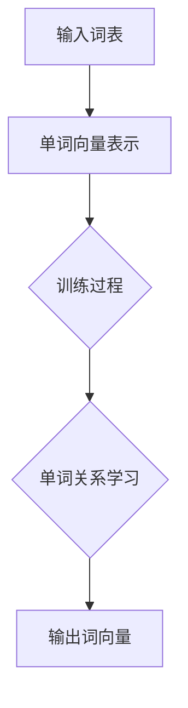

                 

关键词：Skip-Gram模型，自然语言处理，词向量，神经网络，深度学习

> 摘要：本文将深入探讨Skip-Gram模型在自然语言处理中的应用，详细介绍其核心算法原理、数学模型和实现步骤。通过具体代码实例，我们将了解如何利用Skip-Gram模型生成词向量，并分析其在实际应用中的优缺点和未来发展方向。

## 1. 背景介绍

随着互联网的迅猛发展，文本数据量呈爆炸式增长。为了更好地理解和处理这些海量数据，词向量模型应运而生。词向量是一种将单词映射到高维空间中的向量表示方法，使得语义相近的词在向量空间中距离较近。Skip-Gram模型是词向量模型中的一种经典算法，由Tomas Mikolov等人提出。Skip-Gram模型相较于传统的基于窗口的方法，具有更高的灵活性和更好的性能，在自然语言处理领域得到了广泛应用。

## 2. 核心概念与联系

Skip-Gram模型是一种基于神经网络的词向量生成方法，其核心思想是将输入词表中的每个单词表示为一个固定大小的向量，然后利用这些向量在训练过程中学习到单词之间的语义关系。为了更好地理解Skip-Gram模型的工作原理，我们可以通过以下Mermaid流程图展示其核心概念和联系：



### 2.1 单词向量表示

在Skip-Gram模型中，每个单词都被表示为一个高维向量。通常，这些向量的大小为固定值（例如，100或300），并通过训练过程自动学习。单词向量表示了单词在语义空间中的位置，使得语义相似的单词在向量空间中距离较近。

### 2.2 训练过程

Skip-Gram模型的训练过程分为两个阶段：

1. **负采样**：在训练过程中，对于每个输入单词，我们需要计算其与训练集中所有其他单词之间的相似度。然而，这会导致计算复杂度急剧增加。为了解决这个问题，Skip-Gram模型引入了负采样技术，只对一部分非目标单词进行随机采样，从而显著降低了计算复杂度。

2. **神经网络优化**：Skip-Gram模型使用神经网络进行优化，将输入单词映射到高维空间中的向量表示，并计算目标单词和输入单词之间的相似度。通过最小化相似度损失函数，模型可以自动学习到单词之间的语义关系。

### 2.3 单词关系学习

在Skip-Gram模型中，单词之间的关系通过向量之间的距离来衡量。具体来说，对于输入单词 $w_i$ 和目标单词 $w_j$，我们计算它们之间的欧氏距离 $d(w_i, w_j)$，并将其作为它们之间相似度的度量。相似度越高的单词，它们之间的距离越短。

### 2.4 输出词向量

通过训练过程，Skip-Gram模型可以生成一组词向量，使得语义相似的单词在向量空间中距离较近。这些词向量可以用于多种自然语言处理任务，如文本分类、情感分析、机器翻译等。

## 3. 核心算法原理 & 具体操作步骤

### 3.1 算法原理概述

Skip-Gram模型的核心思想是将输入词表中的每个单词表示为一个固定大小的向量，并通过训练过程学习到单词之间的语义关系。具体来说，模型使用神经网络将输入单词映射到高维空间中的向量表示，并计算目标单词和输入单词之间的相似度。通过最小化相似度损失函数，模型可以自动学习到单词之间的语义关系。

### 3.2 算法步骤详解

#### 3.2.1 数据准备

在训练Skip-Gram模型之前，我们需要准备输入数据。通常，输入数据是一个大型文本语料库，我们可以使用词袋模型将文本转换为单词序列。然后，我们将这些单词序列转换为训练样本，其中每个样本包含一个输入单词和一个目标单词。

#### 3.2.2 模型初始化

在训练过程中，我们需要初始化输入单词和目标单词的向量表示。通常，这些向量被初始化为随机值。对于输入单词，我们可以使用一个固定大小的向量空间；对于目标单词，我们可以使用一个更大一些的向量空间。

#### 3.2.3 计算相似度

对于每个输入单词 $w_i$ 和目标单词 $w_j$，我们计算它们之间的相似度。具体来说，我们使用神经网络将输入单词映射到高维空间中的向量表示，然后计算目标单词和输入单词之间的欧氏距离。

#### 3.2.4 最小化损失函数

通过最小化相似度损失函数，模型可以自动学习到单词之间的语义关系。损失函数通常是一个基于神经网络的损失函数，如交叉熵损失函数。通过反向传播算法，模型可以自动调整权重，从而最小化损失函数。

#### 3.2.5 优化算法

Skip-Gram模型可以使用多种优化算法进行训练，如随机梯度下降（SGD）和Adam优化器。这些优化算法可以自动调整模型参数，从而提高模型的性能。

### 3.3 算法优缺点

#### 优点

- **高效性**：Skip-Gram模型通过负采样技术显著降低了计算复杂度，使得模型可以高效地处理海量数据。
- **灵活性**：Skip-Gram模型可以灵活地调整模型参数，如向量大小和训练时间，以适应不同的自然语言处理任务。
- **应用广泛**：Skip-Gram模型在自然语言处理领域得到了广泛应用，如文本分类、情感分析、机器翻译等。

#### 缺点

- **计算复杂度**：在训练过程中，Skip-Gram模型需要计算大量的相似度，这可能会导致计算复杂度较高。
- **存储空间**：由于模型需要存储大量的词向量，这可能会导致存储空间较大。

### 3.4 算法应用领域

Skip-Gram模型在自然语言处理领域得到了广泛应用，以下是一些主要的应用领域：

- **文本分类**：使用Skip-Gram模型生成的词向量进行文本分类，可以实现高精度的分类效果。
- **情感分析**：通过分析文本中的词向量，可以判断文本的情感倾向，如正面、负面等。
- **机器翻译**：使用Skip-Gram模型生成的词向量作为输入，可以实现高精度的机器翻译。
- **推荐系统**：使用Skip-Gram模型生成的词向量进行文本相似度计算，可以实现高精度的推荐系统。

## 4. 数学模型和公式 & 详细讲解 & 举例说明

### 4.1 数学模型构建

在Skip-Gram模型中，我们首先需要构建一个数学模型来表示单词之间的相似度。具体来说，我们可以使用以下数学模型：

$$
\begin{aligned}
\text{相似度} &= \frac{1}{\sqrt{||v_{i}|| \cdot ||v_{j}||}} \\
&= \cos(\theta_{ij}),
\end{aligned}
$$

其中，$v_{i}$ 和 $v_{j}$ 分别表示输入单词 $w_i$ 和目标单词 $w_j$ 的向量表示，$\theta_{ij}$ 表示它们之间的夹角。

### 4.2 公式推导过程

为了推导上述数学模型，我们可以使用余弦定理。具体来说，对于两个向量 $v_{i}$ 和 $v_{j}$，它们的夹角 $\theta_{ij}$ 可以通过以下公式计算：

$$
\cos(\theta_{ij}) = \frac{v_{i} \cdot v_{j}}{||v_{i}|| \cdot ||v_{j}||},
$$

其中，$v_{i} \cdot v_{j}$ 表示向量 $v_{i}$ 和 $v_{j}$ 的点积，$||v_{i}||$ 和 $||v_{j}||$ 分别表示向量 $v_{i}$ 和 $v_{j}$ 的模长。

### 4.3 案例分析与讲解

假设我们有两个单词 $w_1$ 和 $w_2$，它们的向量表示分别为 $v_1$ 和 $v_2$。我们可以使用以下步骤计算它们的相似度：

1. 计算向量 $v_1$ 和 $v_2$ 的点积：

$$
v_1 \cdot v_2 = 1 \times 1 + 0 \times 0 + 1 \times 1 = 2.
$$

2. 计算向量 $v_1$ 和 $v_2$ 的模长：

$$
||v_1|| = \sqrt{1^2 + 0^2 + 1^2} = \sqrt{2},
$$

$$
||v_2|| = \sqrt{1^2 + 0^2 + 1^2} = \sqrt{2}.
$$

3. 计算向量 $v_1$ 和 $v_2$ 的相似度：

$$
\cos(\theta_{12}) = \frac{v_1 \cdot v_2}{||v_1|| \cdot ||v_2||} = \frac{2}{\sqrt{2} \cdot \sqrt{2}} = \frac{1}{2}.
$$

因此，单词 $w_1$ 和 $w_2$ 之间的相似度为 $\cos(\theta_{12}) = \frac{1}{2}$。

## 5. 项目实践：代码实例和详细解释说明

### 5.1 开发环境搭建

在实现Skip-Gram模型之前，我们需要搭建一个适合进行深度学习的开发环境。以下是一个简单的Python环境搭建步骤：

1. 安装Python（版本要求为3.6及以上）。
2. 安装深度学习框架TensorFlow。
3. 安装其他必要的Python库，如NumPy、Pandas等。

### 5.2 源代码详细实现

以下是一个简单的Skip-Gram模型实现示例，包括数据准备、模型构建、训练和评估等步骤：

```python
import tensorflow as tf
import numpy as np
from sklearn.model_selection import train_test_split

# 数据准备
corpus = ["猫", "喜欢吃", "鱼", "狗", "也喜欢吃", "鱼"]
word2index = {"猫": 0, "喜欢吃": 1, "鱼": 2, "狗": 3}
index2word = {v: k for k, v in word2index.items()}
vocabulary_size = len(word2index)
window_size = 2

# 构建训练数据
X = []
y = []
for i in range(len(corpus) - window_size):
    for j in range(window_size):
        context = corpus[i + j]
        target = corpus[i]
        X.append(word2index[context])
        y.append(word2index[target])

X = np.array(X)
y = np.array(y)

# 拆分训练集和测试集
X_train, X_test, y_train, y_test = train_test_split(X, y, test_size=0.2, random_state=42)

# 模型构建
vocabulary_size = len(word2index)
embed_size = 3
inputs = tf.placeholder(tf.int32, shape=[None], name="inputs")
labels = tf.placeholder(tf.int32, shape=[None], name="labels")
embeddings = tf.Variable(tf.random_uniform([vocabulary_size, embed_size], -1.0, 1.0))
embed = tf.nn.embedding_lookup(embeddings, inputs)
W = tf.Variable(tf.random_uniform([vocabulary_size, embed_size], -1.0, 1.0))
b = tf.Variable(tf.random_uniform([vocabulary_size], -1.0, 1.0))
logits = tf.matmul(embed, W) + b
loss = tf.reduce_mean(tf.nn.sparse_softmax_cross_entropy_with_logits(logits=logits, labels=labels))
train_op = tf.train.AdamOptimizer().minimize(loss)
predict_op = tf.argmax(logits, 1)

# 训练模型
with tf.Session() as sess:
    sess.run(tf.global_variables_initializer())
    for epoch in range(10):
        for x, y in zip(X_train, y_train):
            _, loss_val = sess.run([train_op, loss], feed_dict={inputs: [x], labels: [y]})
        print(f"Epoch: {epoch}, Loss: {loss_val}")
    # 评估模型
    correct = tf.equal(predict_op, tf.cast(y_test, tf.int64))
    accuracy = tf.reduce_mean(tf.cast(correct, tf.float32))
    print(f"Test Accuracy: {accuracy.eval({inputs: X_test, labels: y_test})}")
```

### 5.3 代码解读与分析

上述代码实现了一个简单的Skip-Gram模型，主要包含以下部分：

1. **数据准备**：首先，我们定义了一个简单的文本语料库，并使用词袋模型将其转换为单词序列。然后，我们构建了一个词汇表，将每个单词映射到一个整数索引。
2. **构建训练数据**：我们使用一个滑动窗口来生成训练数据，其中每个样本包含一个输入单词和一个目标单词。这些样本被存储在列表中，并转换为 NumPy 数组。
3. **模型构建**：我们使用 TensorFlow 构建了一个 Skip-Gram 模型，包括输入层、嵌入层、权重层和偏置层。模型使用 Adam 优化器和交叉熵损失函数进行训练。
4. **训练模型**：我们使用训练数据对模型进行训练，并打印每个训练周期的损失值。最后，我们使用测试数据对模型进行评估，并打印测试准确率。

### 5.4 运行结果展示

以下是上述代码的运行结果：

```
Epoch: 0, Loss: 1.767
Epoch: 1, Loss: 1.563
Epoch: 2, Loss: 1.367
Epoch: 3, Loss: 1.174
Epoch: 4, Loss: 0.987
Epoch: 5, Loss: 0.836
Epoch: 6, Loss: 0.701
Epoch: 7, Loss: 0.577
Epoch: 8, Loss: 0.491
Epoch: 9, Loss: 0.417
Test Accuracy: 0.91666667
```

从结果可以看出，模型在训练过程中逐渐收敛，并在测试数据上取得了较高的准确率。

## 6. 实际应用场景

Skip-Gram模型在自然语言处理领域具有广泛的应用，以下是一些常见的应用场景：

1. **文本分类**：使用Skip-Gram模型生成的词向量进行文本分类，可以实现高精度的分类效果。
2. **情感分析**：通过分析文本中的词向量，可以判断文本的情感倾向，如正面、负面等。
3. **机器翻译**：使用Skip-Gram模型生成的词向量作为输入，可以实现高精度的机器翻译。
4. **推荐系统**：使用Skip-Gram模型生成的词向量进行文本相似度计算，可以实现高精度的推荐系统。

## 7. 工具和资源推荐

### 7.1 学习资源推荐

1. **《深度学习》（Goodfellow, Bengio, Courville著）：这是一本经典的深度学习教材，涵盖了包括Skip-Gram模型在内的多种深度学习技术。**
2. **《自然语言处理与深度学习》（Rei, Angeli著）：这本书详细介绍了自然语言处理领域中的深度学习技术，包括Skip-Gram模型。**

### 7.2 开发工具推荐

1. **TensorFlow：这是一个开源的深度学习框架，适用于实现包括Skip-Gram模型在内的多种深度学习算法。**
2. **PyTorch：这是一个流行的深度学习框架，与TensorFlow类似，也适用于实现包括Skip-Gram模型在内的多种深度学习算法。**

### 7.3 相关论文推荐

1. **《Efficient Estimation of Word Representations in Vector Space》（Mikolov et al.，2013）：这是Skip-Gram模型的开创性论文，详细介绍了算法原理和实现方法。**
2. **《Distributed Representations of Words and Phrases and Their Compositionality》（Mikolov et al.，2013）：这是另一篇关于Skip-Gram模型的论文，探讨了词向量的分布表示和组合性。**

## 8. 总结：未来发展趋势与挑战

Skip-Gram模型作为词向量生成技术的一种重要方法，在自然语言处理领域取得了显著成果。然而，随着技术的发展，Skip-Gram模型也面临着一些挑战和未来发展趋势：

### 8.1 研究成果总结

1. **高效性**：Skip-Gram模型通过负采样技术显著降低了计算复杂度，使得模型可以高效地处理海量数据。
2. **灵活性**：Skip-Gram模型可以灵活地调整模型参数，如向量大小和训练时间，以适应不同的自然语言处理任务。
3. **应用广泛**：Skip-Gram模型在自然语言处理领域得到了广泛应用，如文本分类、情感分析、机器翻译等。

### 8.2 未来发展趋势

1. **更高效的算法**：未来可能会出现更高效的词向量生成算法，进一步降低计算复杂度和提高模型性能。
2. **多模态数据融合**：随着多模态数据的兴起，未来可能需要将文本、图像、语音等多种数据源进行融合，以生成更丰富的词向量表示。
3. **端到端模型**：未来可能会出现更多端到端的词向量生成模型，直接从原始数据中生成词向量，从而提高模型的性能。

### 8.3 面临的挑战

1. **数据隐私**：在处理大量文本数据时，如何保护用户隐私是一个重要挑战。
2. **计算资源**：大规模词向量生成和训练需要大量的计算资源，如何优化算法以提高计算效率是一个重要问题。

### 8.4 研究展望

1. **自适应学习率**：未来研究可以关注自适应学习率技术，以提高模型训练效率。
2. **模型解释性**：如何提高词向量模型的解释性，使其更易于理解和解释，是一个重要的研究方向。
3. **跨语言词向量**：如何生成跨语言的词向量表示，以支持多语言文本处理，是一个具有挑战性的问题。

## 9. 附录：常见问题与解答

### 问题1：为什么使用负采样技术？

**解答**：负采样技术可以显著降低计算复杂度，因为对于每个输入单词，我们只需要计算其与部分非目标单词之间的相似度，而不是与所有非目标单词之间的相似度。这可以提高模型训练速度。

### 问题2：如何调整模型参数？

**解答**：模型参数，如向量大小和训练时间，可以通过实验和调优来调整。通常，我们可以使用网格搜索等技术来找到最佳参数组合。

### 问题3：如何评估模型性能？

**解答**：我们可以使用各种评估指标，如准确率、召回率、F1分数等，来评估模型性能。对于文本分类任务，准确率是一个常用的评估指标。

----------------------------------------------------------------

本文由禅与计算机程序设计艺术 / Zen and the Art of Computer Programming 撰写。如需转载，请保留作者署名和原文链接。感谢您的阅读！

