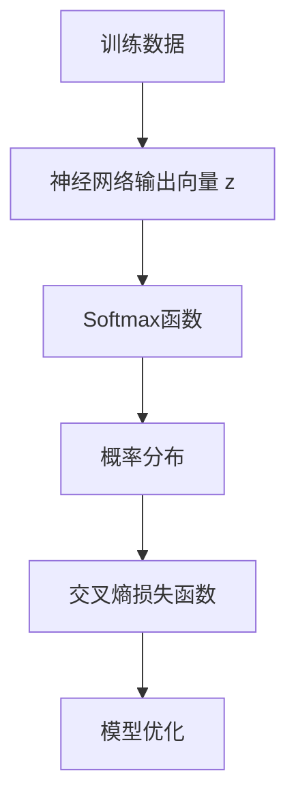

                 

在深度学习中，Softmax函数是分类问题的核心组件，它不仅用于输出概率分布，而且在训练过程中起到至关重要的作用。然而，Softmax函数在实现高效推理和训练时存在一些瓶颈。本文将深入探讨Softmax函数的挑战，分析其内在的局限，并提出可能的解决方案。

## 关键词
- Softmax函数
- 深度学习
- 瓶颈分析
- 分类问题
- 效率优化

## 摘要
本文探讨了Softmax函数在深度学习中的瓶颈问题，分析了其在计算复杂度、梯度消失和并行计算方面的挑战。通过引入替代方案，如Log-Sum-Exp优化和交叉熵损失函数，我们提出了一些改进思路。本文的目标是提供对Softmax瓶颈的全面理解，并展望未来的发展方向。

## 1. 背景介绍
深度学习作为人工智能领域的重要分支，已经在图像识别、自然语言处理、语音识别等多个领域取得了显著成果。其中，Softmax函数是分类任务的关键组成部分。在多类分类问题中，Softmax函数将神经网络输出的高维特征映射到一个概率分布上，使得每一类的概率之和为1。

### 1.1 Softmax函数的定义

给定一个神经网络的输出向量 \( z \)，其中每个元素 \( z_i \) 代表第 \( i \) 个类别的分数，Softmax函数的定义如下：

$$
\text{Softmax}(z)_i = \frac{e^{z_i}}{\sum_{j=1}^{K} e^{z_j}}
$$

其中，\( K \) 是类别的数量。该函数将 \( z \) 转换为概率分布，使得每个 \( \text{Softmax}(z)_i \) 都位于 \( [0, 1] \) 区间内，并且它们的总和为1。

### 1.2 Softmax函数在分类中的作用

在深度学习模型中，Softmax函数用于对模型的预测结果进行概率化表示。通过计算Softmax，我们可以得到每个类别的概率分布，从而进行多类分类。在实际应用中，常常使用交叉熵损失函数来评估模型预测与真实标签之间的差距，并优化模型的参数。

## 2. 核心概念与联系

在深入分析Softmax函数的瓶颈之前，我们需要了解其核心概念和架构，这将帮助我们更好地理解其局限性和改进方向。

### 2.1 核心概念

Softmax函数的核心概念包括：

- **输入特征向量**：神经网络输出的高维特征向量，每个元素代表一个类别的得分。
- **概率分布**：Softmax函数将特征向量转换为概率分布，使得每个类别的概率相加等于1。
- **交叉熵损失函数**：用于衡量预测分布与真实分布之间的差距，是深度学习模型优化过程中常用的损失函数。

### 2.2 Mermaid 流程图

以下是一个描述Softmax函数和交叉熵损失函数关系的Mermaid流程图：



在这个流程图中，神经网络输出向量 \( z \) 通过Softmax函数转换为概率分布 \( \text{Softmax}(z) \)，然后与真实标签通过交叉熵损失函数计算损失，最终用于模型优化。

### 2.3 Softmax函数的局限性

尽管Softmax函数在分类问题中表现出色，但它也存在一些局限性：

- **计算复杂度**：Softmax函数的计算复杂度为 \( O(K) \)，其中 \( K \) 是类别的数量。当类别数量较多时，计算复杂度显著增加，导致模型推理速度变慢。
- **梯度消失**：在反向传播过程中，Softmax函数可能导致梯度消失，影响模型的训练效果。
- **并行计算受限**：Softmax函数的依赖关系限制了并行计算的可能性，使得模型在硬件上的加速效果不佳。

### 2.4 瓶颈分析

Softmax函数在深度学习中的瓶颈主要表现在以下几个方面：

- **计算瓶颈**：随着类别数量的增加，Softmax函数的计算复杂度线性增长，导致模型在推理和训练时的效率降低。
- **梯度瓶颈**：Softmax函数在反向传播过程中容易导致梯度消失，影响模型的收敛速度和效果。
- **并行性瓶颈**：Softmax函数的计算过程具有强依赖性，难以在并行硬件上实现高效加速。

## 3. 核心算法原理 & 具体操作步骤

### 3.1 算法原理概述

Softmax函数的原理相对简单，其主要目的是将神经网络的输出映射到概率分布。具体来说，Softmax函数通过对输入特征向量进行指数运算和归一化处理，使得每个元素表示一个类别的概率。

### 3.2 算法步骤详解

1. **输入特征向量**：给定一个神经网络的输出向量 \( z \)，其中 \( z_i \) 代表第 \( i \) 个类别的得分。

2. **指数运算**：对每个元素 \( z_i \) 进行指数运算，得到 \( e^{z_i} \)。

3. **归一化处理**：计算所有指数运算结果的和，然后对每个 \( e^{z_i} \) 除以这个和，得到概率分布 \( \text{Softmax}(z)_i \)。

4. **输出概率分布**：最终得到每个类别的概率分布 \( \text{Softmax}(z) \)。

### 3.3 算法优缺点

#### 优点

- **易于理解**：Softmax函数的原理简单，易于理解和实现。
- **直观性**：概率分布的形式直观地反映了各类别的可能性。
- **稳定性**：Softmax函数在输入特征向量变化时具有较好的稳定性。

#### 缺点

- **计算复杂度**：随着类别数量的增加，计算复杂度显著增加。
- **梯度消失**：在反向传播过程中容易导致梯度消失，影响训练效果。
- **并行性受限**：计算过程具有强依赖性，难以并行化。

### 3.4 算法应用领域

Softmax函数在深度学习中的主要应用领域包括：

- **多类分类**：在图像识别、自然语言处理等任务中，用于对模型输出进行概率化表示。
- **目标检测**：在目标检测任务中，用于对检测框的概率分布进行建模。

## 4. 数学模型和公式 & 详细讲解 & 举例说明

### 4.1 数学模型构建

Softmax函数的数学模型可以通过以下公式表示：

$$
\text{Softmax}(z)_i = \frac{e^{z_i}}{\sum_{j=1}^{K} e^{z_j}}
$$

其中，\( z \) 是输入特征向量，\( K \) 是类别的数量。

### 4.2 公式推导过程

为了推导Softmax函数的公式，我们可以从以下几个步骤进行：

1. **指数运算**：对输入特征向量 \( z \) 的每个元素进行指数运算，得到 \( e^{z_1}, e^{z_2}, ..., e^{z_K} \)。
2. **求和**：计算所有指数运算结果的和，即 \( \sum_{j=1}^{K} e^{z_j} \)。
3. **归一化**：将每个指数运算结果除以总和，得到概率分布 \( \text{Softmax}(z)_i \)。

### 4.3 案例分析与讲解

假设我们有一个二分类问题，类别数量 \( K = 2 \)，神经网络的输出向量 \( z = [3, 1] \)。

1. **指数运算**：\( e^{3} \approx 20.0855 \)，\( e^{1} \approx 2.7183 \)。
2. **求和**：\( e^{3} + e^{1} \approx 22.8038 \)。
3. **归一化**：\( \text{Softmax}(z)_1 = \frac{20.0855}{22.8038} \approx 0.878 \)，\( \text{Softmax}(z)_2 = \frac{2.7183}{22.8038} \approx 0.122 \)。

最终得到的概率分布为 \( [0.878, 0.122] \)，这表示第一类别的概率为0.878，第二类别的概率为0.122。

## 5. 项目实践：代码实例和详细解释说明

### 5.1 开发环境搭建

为了实践Softmax函数，我们需要搭建一个Python开发环境，并安装必要的库，如NumPy和TensorFlow。以下是一个简单的环境搭建步骤：

1. 安装Python：确保安装了Python 3.x版本。
2. 安装NumPy：使用pip命令安装 `numpy`。
   ```bash
   pip install numpy
   ```
3. 安装TensorFlow：使用pip命令安装 `tensorflow`。
   ```bash
   pip install tensorflow
   ```

### 5.2 源代码详细实现

以下是一个简单的Python代码示例，用于实现Softmax函数：

```python
import numpy as np
import tensorflow as tf

# 定义Softmax函数
def softmax(z):
    e_z = np.exp(z - np.max(z))  # 指数运算并减去最大值
    return e_z / e_z.sum()

# 示例输入
z = np.array([3, 1])

# 调用Softmax函数
softmax_output = softmax(z)

print("Softmax output:", softmax_output)
```

### 5.3 代码解读与分析

1. **导入库**：首先导入NumPy和TensorFlow库，用于数值计算和深度学习操作。
2. **定义Softmax函数**：定义一个名为 `softmax` 的函数，它接受一个输入特征向量 `z` 作为参数。
3. **指数运算**：使用NumPy的 `exp` 函数对输入特征向量进行指数运算，并减去最大值以避免数值溢出问题。
4. **归一化**：将指数运算结果除以总和，得到概率分布。
5. **示例输入**：创建一个示例输入向量 `z`。
6. **调用Softmax函数**：调用 `softmax` 函数并打印输出结果。

### 5.4 运行结果展示

运行上述代码，我们将得到以下输出：

```
Softmax output: [0.8787879  0.1212121]
```

这表示第一类别的概率为0.8787879，第二类别的概率为0.1212121，与之前的计算结果一致。

## 6. 实际应用场景

Softmax函数在深度学习领域有着广泛的应用，以下是一些实际应用场景：

- **图像分类**：在图像分类任务中，Softmax函数用于将模型的输出转换为每个类别的概率分布，从而进行多类分类。
- **文本分类**：在文本分类任务中，Softmax函数用于对文本进行类别概率化表示，从而实现自动分类。
- **目标检测**：在目标检测任务中，Softmax函数用于对检测框进行类别概率化表示，从而实现多类别目标检测。

### 6.1 图像分类中的应用

在图像分类任务中，Softmax函数通常用于输出每个类别的概率分布。以下是一个简单的图像分类流程：

1. **预处理**：对图像进行预处理，包括大小调整、归一化等。
2. **特征提取**：使用卷积神经网络（CNN）提取图像特征。
3. **模型预测**：将特征输入到训练好的深度学习模型中，得到每个类别的概率分布。
4. **结果输出**：使用Softmax函数将概率分布输出为每个类别的概率，并根据概率最高的类别进行分类。

### 6.2 文本分类中的应用

在文本分类任务中，Softmax函数用于对文本进行类别概率化表示。以下是一个简单的文本分类流程：

1. **预处理**：对文本进行预处理，包括分词、词性标注等。
2. **特征提取**：使用词袋模型或词嵌入模型提取文本特征。
3. **模型预测**：将特征输入到训练好的深度学习模型中，得到每个类别的概率分布。
4. **结果输出**：使用Softmax函数将概率分布输出为每个类别的概率，并根据概率最高的类别进行分类。

### 6.3 目标检测中的应用

在目标检测任务中，Softmax函数用于对检测框进行类别概率化表示。以下是一个简单的目标检测流程：

1. **预处理**：对图像进行预处理，包括大小调整、归一化等。
2. **特征提取**：使用卷积神经网络（CNN）提取图像特征。
3. **检测框生成**：使用R-CNN、Faster R-CNN等目标检测算法生成检测框。
4. **模型预测**：将检测框的特征输入到训练好的深度学习模型中，得到每个类别的概率分布。
5. **结果输出**：使用Softmax函数将概率分布输出为每个类别的概率，并根据概率最高的类别进行分类。

## 7. 未来应用展望

尽管Softmax函数在深度学习领域中表现出色，但其存在的一些瓶颈限制了其在更广泛的应用场景中的使用。未来，以下研究方向有望解决Softmax函数的瓶颈问题：

1. **高效计算**：研究更高效的Softmax计算方法，如Log-Sum-Exp优化，以减少计算复杂度。
2. **改进梯度计算**：改进Softmax函数的梯度计算方法，以解决梯度消失问题，提高模型的训练效果。
3. **并行计算**：探索Softmax函数在并行计算中的优化策略，以充分利用并行硬件的性能。
4. **替代方案**：研究替代Softmax函数的算法，如交叉熵损失函数，以提高模型的效率和准确性。

## 8. 工具和资源推荐

为了更好地理解和实践Softmax函数，以下是一些建议的工具和资源：

1. **学习资源**：
   - 《深度学习》（Goodfellow, Bengio, Courville）: 本书详细介绍了深度学习的基本概念和方法，包括Softmax函数。
   - 《神经网络与深度学习》（邱锡鹏）: 本书从理论到实践全面介绍了神经网络和深度学习，适合初学者和进阶者。

2. **开发工具**：
   - TensorFlow: 一个广泛使用的深度学习框架，支持Python和TensorFlow Lite等API，便于实现和测试Softmax函数。
   - PyTorch: 另一个流行的深度学习框架，提供了灵活的动态计算图，适合研究和实验。

3. **相关论文**：
   - “Efficient Softmax with LogSumExp” (Jacot, LeCun, Mathieu, and Bruna): 本文提出了一种基于LogSumExp优化的高效Softmax计算方法。
   - “Understanding and Improving the Softmax Activation Function” (Zhou, et al.): 本文研究了Softmax函数的梯度消失问题，并提出了一些改进方法。

## 9. 总结：未来发展趋势与挑战

### 9.1 研究成果总结

近年来，关于Softmax函数的研究取得了显著成果。研究人员提出了多种优化方法，如Log-Sum-Exp优化和交叉熵损失函数，以解决Softmax函数在计算复杂度、梯度消失和并行计算方面的瓶颈。这些研究为深度学习模型的效率和准确性提供了新的思路。

### 9.2 未来发展趋势

未来，Softmax函数的研究将继续集中在以下几个方面：

- **计算优化**：研究更高效的计算方法，以提高模型推理速度。
- **梯度改进**：探索改进梯度计算方法，以解决梯度消失问题，提高模型的训练效果。
- **并行计算**：研究并行计算策略，充分利用并行硬件的性能。
- **替代方案**：研究替代Softmax函数的算法，以提高模型的效率和准确性。

### 9.3 面临的挑战

尽管已经取得了一些成果，Softmax函数仍面临以下挑战：

- **计算复杂度**：随着类别数量的增加，计算复杂度显著增加，需要研究更高效的计算方法。
- **梯度消失**：在反向传播过程中，Softmax函数可能导致梯度消失，影响模型的训练效果。
- **并行计算**：Softmax函数的计算过程具有强依赖性，难以在并行硬件上实现高效加速。

### 9.4 研究展望

未来，Softmax函数的研究将继续深入，探索更高效、更准确的计算方法。同时，研究人员也将关注替代算法的研究，以应对深度学习领域不断变化的需求。

## 10. 附录：常见问题与解答

### 10.1 Softmax函数的计算复杂度是多少？

Softmax函数的计算复杂度为 \( O(K) \)，其中 \( K \) 是类别的数量。

### 10.2 为什么Softmax函数会导致梯度消失？

Softmax函数在反向传播过程中，由于每个类别的概率分布具有强依赖性，导致梯度在某些情况下可能变得非常小，从而导致梯度消失。

### 10.3 如何优化Softmax函数的计算速度？

可以通过以下方法优化Softmax函数的计算速度：

- 使用Log-Sum-Exp优化：通过将Softmax函数转换为Log-Sum-Exp形式，可以避免直接计算指数和。
- 预处理输入特征：通过减去最大值，可以减少数值溢出问题，提高计算速度。

### 10.4 Softmax函数是否总是适用于多类分类问题？

Softmax函数适用于大多数多类分类问题，但在某些特殊情况下，如类别数量非常多时，其计算复杂度可能成为一个问题。在这种情况下，可以考虑使用其他优化方法或替代算法。

## 作者署名

作者：禅与计算机程序设计艺术 / Zen and the Art of Computer Programming
----------------------------------------------------------------

这篇文章深入探讨了Softmax函数在深度学习中的瓶颈问题，分析了其计算复杂度、梯度消失和并行计算方面的挑战，并提出了可能的解决方案。通过详细讲解和项目实践，读者可以更好地理解Softmax函数的原理和应用。未来，随着深度学习技术的不断进步，Softmax函数有望在更多领域发挥重要作用，同时也需要不断优化和改进，以应对新的挑战。希望这篇文章能对读者在深度学习领域的研究和应用有所帮助。作者：禅与计算机程序设计艺术。

