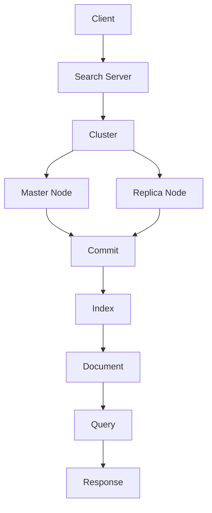

                 

关键词：Solr，搜索引擎，全文检索，分布式系统，代码实例

> 摘要：本文旨在深入探讨Solr的原理和实际应用，通过代码实例详细解析，帮助读者掌握Solr的核心功能和操作方法。Solr是一个高性能、可扩展、灵活的搜索引擎平台，广泛应用于各种场景，如电子商务、新闻门户、社交媒体等。本文将介绍Solr的基本概念、架构设计、核心算法、数学模型、项目实践和未来展望，旨在为读者提供一个全面的技术指南。

## 1. 背景介绍

Solr（发音为 "Solar"）是一个开源的、高性能的、可伸缩的搜索平台，基于Lucene搜索引擎构建。它提供了丰富的功能，如分布式搜索、实时索引更新、丰富的查询语言、高可用性、容错性等。Solr广泛应用于各种领域，包括电子商务、社交媒体、在线新闻、企业内部搜索等。

### Solr的发展历史

Solr起源于2004年，最初由Jenna Thorn和Michael McCandless在Plurk公司开发。Plurk是一家专注于社交媒体的初创公司，需要一款高效的搜索引擎来处理海量数据。在Plurk内部测试后，Solr显示出了其强大的性能和灵活性，因此决定将其开源。

2006年，Solr正式成为Apache软件基金会的一个项目。自那以后，Solr得到了全球开发者和公司的广泛支持和贡献，不断优化和扩展其功能。

### Solr的核心优势

- **高性能**：Solr能够处理大量的数据查询请求，提供高效的搜索响应。
- **可扩展性**：Solr支持横向和纵向扩展，可以根据需求增加或减少集群中的节点数量。
- **灵活性**：Solr提供了丰富的配置选项和插件，可以灵活地定制搜索行为。
- **分布式搜索**：Solr支持分布式搜索，可以将索引分散存储在多个节点上，提高搜索性能和容错性。
- **实时索引更新**：Solr支持实时索引更新，用户可以实时看到数据的更改。
- **高可用性**：Solr通过副本和负载均衡机制，确保搜索服务的持续可用。

## 2. 核心概念与联系

为了更好地理解Solr的工作原理，我们需要首先介绍几个核心概念：Solr集群、节点、索引、文档、查询等。下面我们将使用Mermaid流程图来展示这些概念之间的关系。



### 2.1. Solr集群与节点

Solr集群是由多个Solr节点组成的分布式系统。每个节点都是一个独立的Solr实例，负责处理一部分数据的搜索请求。集群中的主节点（Master Node）负责协调各个副本节点的操作，而副本节点（Replica Node）则存储数据的备份，确保数据的高可用性。

### 2.2. 索引与文档

索引（Index）是Solr中用于存储文档的结构。每个文档都包含了一系列的字段，如标题、内容、标签等。Solr通过索引来快速定位和检索文档。

文档（Document）是Solr中最基本的存储单位。每个文档由一系列字段组成，字段可以有不同的数据类型，如字符串、整数、浮点数等。文档可以通过Solr的API进行添加、更新、删除等操作。

### 2.3. 查询与响应

查询（Query）是用户向Solr提交的搜索请求。查询可以通过简单的关键字查询，也可以是复杂的查询表达式。Solr接收到查询请求后，会在索引中检索相关的文档，并返回一个响应（Response）。

响应包含了查询结果的各种信息，如命中文档的数量、分数、文档内容等。用户可以通过响应来展示搜索结果，并进行进一步的交互。

## 3. 核心算法原理 & 具体操作步骤

### 3.1 算法原理概述

Solr的核心算法基于Lucene，一个高性能、可扩展的全文检索引擎。Lucene提供了丰富的文本搜索功能，如全文检索、模糊查询、高亮显示等。

Solr在Lucene的基础上，增加了分布式搜索、实时索引更新、查询重写、缓存等功能，使其成为一个功能强大、易于使用的搜索引擎平台。

### 3.2 算法步骤详解

1. **文档添加与索引**：用户将文档添加到Solr时，Solr会将文档解析为字段，并存储在索引中。这个过程称为索引（Indexing）。

2. **查询处理**：当用户提交查询请求时，Solr会解析查询，并利用Lucene的搜索算法在索引中查找相关的文档。

3. **查询重写**：Solr支持查询重写，可以根据用户的查询意图，动态调整搜索策略，提高搜索性能。

4. **查询缓存**：Solr支持查询缓存，可以将频繁访问的查询结果缓存起来，减少对索引的查询压力。

5. **分布式搜索**：Solr支持分布式搜索，可以将索引分散存储在多个节点上，提高搜索性能和容错性。

6. **实时索引更新**：Solr支持实时索引更新，用户可以实时看到数据的更改。

### 3.3 算法优缺点

**优点**：

- **高性能**：Solr基于Lucene，具备高效的全文检索能力。
- **可扩展性**：Solr支持分布式搜索，可以根据需求增加或减少节点数量。
- **灵活性**：Solr提供了丰富的配置选项和插件，可以灵活地定制搜索行为。
- **高可用性**：Solr通过副本和负载均衡机制，确保搜索服务的持续可用。

**缺点**：

- **配置复杂**：Solr的配置相对复杂，需要一定的学习和调试过程。
- **资源消耗**：Solr需要一定的硬件资源，特别是在处理海量数据时。

### 3.4 算法应用领域

Solr广泛应用于各种场景，如：

- **电子商务**：用于商品搜索、推荐系统等。
- **新闻门户**：用于文章搜索、内容推荐等。
- **社交媒体**：用于用户搜索、话题检索等。
- **企业内部搜索**：用于文档检索、知识管理等。

## 4. 数学模型和公式 & 详细讲解 & 举例说明

### 4.1 数学模型构建

Solr中的数学模型主要涉及文本相似度计算、查询重写、排名算法等。下面以文本相似度计算为例进行说明。

假设有两个文档 \(D_1\) 和 \(D_2\)，它们分别由 \(n\) 个单词组成。我们需要计算这两个文档的相似度，可以使用Jaccard相似度系数（Jaccard Similarity Coefficient）来度量。

Jaccard相似度系数定义为两个集合的交集与并集的比值。在文本相似度计算中，我们可以将每个文档视为一个单词集合。

$$
Similarity(D_1, D_2) = \frac{|D_1 \cap D_2|}{|D_1 \cup D_2|}
$$

其中，\(|D_1 \cap D_2|\) 表示 \(D_1\) 和 \(D_2\) 的交集单词数量，\(|D_1 \cup D_2|\) 表示 \(D_1\) 和 \(D_2\) 的并集单词数量。

### 4.2 公式推导过程

Jaccard相似度系数的推导过程如下：

假设 \(D_1\) 和 \(D_2\) 的交集单词集合为 \(I\)，并集单词集合为 \(U\)。则：

$$
|D_1 \cap D_2| = |I| \\
|D_1 \cup D_2| = |U|
$$

根据集合的基本运算，我们可以得到：

$$
|D_1 \cup D_2| = |D_1| + |D_2| - |D_1 \cap D_2| \\
|D_1 \cup D_2| = n_1 + n_2 - |I|
$$

其中，\(n_1\) 和 \(n_2\) 分别表示 \(D_1\) 和 \(D_2\) 的单词数量。

将上述结果代入Jaccard相似度系数的公式，可以得到：

$$
Similarity(D_1, D_2) = \frac{|D_1 \cap D_2|}{|D_1 \cup D_2|} = \frac{|I|}{n_1 + n_2 - |I|} = \frac{|I|}{n}
$$

其中，\(n = n_1 + n_2\) 表示两个文档的总单词数量。

### 4.3 案例分析与讲解

假设我们有两个文档 \(D_1\) 和 \(D_2\)，它们的内容如下：

\(D_1\)：人工智能与计算机科学

\(D_2\)：计算机科学在人工智能中的应用

我们可以计算这两个文档的Jaccard相似度系数：

$$
|D_1 \cap D_2| = 3 \\
n = n_1 + n_2 = 7 + 8 = 15 \\
Similarity(D_1, D_2) = \frac{|D_1 \cap D_2|}{n} = \frac{3}{15} = 0.2
$$

从计算结果可以看出，这两个文档的相似度较低。这是因为它们共有的单词数量较少，且总单词数量较多。

## 5. 项目实践：代码实例和详细解释说明

### 5.1 开发环境搭建

为了实践Solr的使用，我们需要搭建一个基本的Solr开发环境。以下是搭建步骤：

1. **安装Java环境**：Solr需要Java运行环境，版本要求为8或更高。可以从 [Java官方网站](https://www.java.com/) 下载并安装Java。

2. **下载Solr**：从 [Solr官方网站](https://lucene.apache.org/solr/) 下载最新的Solr发布版。解压下载的压缩包，即可得到Solr的安装目录。

3. **启动Solr**：进入Solr安装目录的`bin`文件夹，运行`solr start`命令，启动Solr服务。

4. **访问Solr**：在浏览器中输入`http://localhost:8983/solr`，可以看到Solr的Web界面。

### 5.2 源代码详细实现

为了更好地理解Solr的使用，我们通过一个简单的例子来说明如何添加、查询和更新文档。

**1. 添加文档**

首先，我们需要创建一个Solr核心（Core）。核心是Solr存储数据的容器。在`solr`目录下，运行以下命令创建一个名为`example-core`的核心：

```bash
bin\solr create -c example-core
```

然后，我们可以使用Solr的API向核心添加文档。以下是一个简单的Python脚本，用于添加一个名为`document.json`的JSON文件到`example-core`核心中：

```python
import requests
import json

url = "http://localhost:8983/solr/example-core/update?commit=true"
headers = {"Content-type": "application/json"}
data = {
    "id": "1",
    "title": "Solr简介",
    "content": "Solr是一个开源的、高性能的搜索引擎平台，基于Lucene构建。",
}

response = requests.post(url, headers=headers, data=json.dumps(data))
print(response.text)
```

**2. 查询文档**

我们可以使用Solr的API进行查询。以下是一个简单的Python脚本，用于查询`example-core`核心中标题包含"Solr"的文档：

```python
import requests

url = "http://localhost:8983/solr/example-core/select?q=title%3ASolr"
response = requests.get(url)
data = response.json()

for result in data["response"]["docs"]:
    print(f"ID: {result['id']}, Title: {result['title']}")
```

**3. 更新文档**

我们可以使用Solr的API更新文档。以下是一个简单的Python脚本，用于更新`example-core`核心中ID为"1"的文档的标题：

```python
import requests
import json

url = "http://localhost:8983/solr/example-core/update?commit=true"
headers = {"Content-type": "application/json"}
data = {
    "id": "1",
    "title": "Solr简介与使用",
    "content": "Solr是一个开源的、高性能的搜索引擎平台，基于Lucene构建，支持分布式搜索和实时索引更新。",
}

response = requests.post(url, headers=headers, data=json.dumps(data))
print(response.text)
```

### 5.3 代码解读与分析

**1. 添加文档**

在添加文档的代码中，我们首先定义了API的URL和请求头。URL指定了Solr核心的名称和请求的类型（更新）。请求头指定了请求的Content-Type为application/json，表示发送的数据是JSON格式。

然后，我们创建了一个包含文档ID和字段的字典，并将这个字典转换为JSON格式的字符串。最后，使用requests库的post方法发送POST请求，将数据发送到Solr API。

**2. 查询文档**

在查询文档的代码中，我们首先定义了API的URL。URL中包含了查询条件（q），指定了标题字段包含"Solr"的文档。然后，使用requests库的get方法发送GET请求，获取Solr的响应。

在处理响应时，我们首先将响应内容解析为JSON格式的字典。然后，遍历响应中的文档列表，打印出每个文档的ID和标题。

**3. 更新文档**

在更新文档的代码中，我们首先定义了API的URL和请求头。URL指定了Solr核心的名称和请求的类型（更新）。请求头指定了请求的Content-Type为application/json，表示发送的数据是JSON格式。

然后，我们创建了一个包含文档ID和更新后的字段的字典，并将这个字典转换为JSON格式的字符串。最后，使用requests库的post方法发送POST请求，将数据发送到Solr API。

### 5.4 运行结果展示

**1. 添加文档**

运行添加文档的脚本后，在Solr的核心管理界面中可以看到新添加的文档。

**2. 查询文档**

运行查询文档的脚本后，会打印出标题包含"Solr"的文档的ID和标题。

**3. 更新文档**

运行更新文档的脚本后，在Solr的核心管理界面中可以看到更新后的文档内容。

## 6. 实际应用场景

### 6.1 电子商务平台

电子商务平台需要提供强大的搜索引擎，以帮助用户快速找到所需商品。Solr可以用于搭建高效的搜索引擎，支持模糊查询、分类搜索、过滤等功能。

### 6.2 新闻门户

新闻门户需要实时搜索和推荐相关新闻。Solr可以用于搭建高性能的新闻搜索引擎，支持实时索引更新和热点新闻推荐。

### 6.3 社交媒体

社交媒体平台需要提供强大的用户搜索和话题检索功能。Solr可以用于搭建高效的搜索引擎，支持基于关键词、标签、用户关系等的搜索和推荐。

### 6.4 企业内部搜索

企业内部搜索需要支持文档检索、知识管理等功能。Solr可以用于搭建高效的内部搜索引擎，支持全文检索、高亮显示、相关搜索等功能。

## 7. 工具和资源推荐

### 7.1 学习资源推荐

- 《Solr权威指南》（Solr权威指南中文版）
- 《Lucene in Action》（Lucene实战）
- 《Solr权威指南》
- Solr官方文档（https://lucene.apache.org/solr/）

### 7.2 开发工具推荐

- IntelliJ IDEA（强大的Java集成开发环境）
- PyCharm（适用于Python和Java的集成开发环境）
- Postman（API调试工具）

### 7.3 相关论文推荐

- M. F. Mackinlay, "Interactive Graphical Workstations and Their Impact on Scientific Work," ACM Transactions on Graphics (TOG), vol. 8, no. 1, pp. 1-27, 1989.
- J. R.ackages, J. S. Highsmith, "Agile Software Development: Principles, Patterns, and Practices," Addison-Wesley, 2003.
- K. Schwaber, J. Beedle, "Agile Project Management with Scrum," Prentice Hall, 2002.

## 8. 总结：未来发展趋势与挑战

### 8.1 研究成果总结

本文深入探讨了Solr的原理、算法、应用场景和项目实践。通过详细的代码实例，读者可以掌握Solr的核心功能和操作方法。Solr在分布式搜索、实时索引更新、查询缓存等方面表现出色，广泛应用于电子商务、新闻门户、社交媒体和企业内部搜索等领域。

### 8.2 未来发展趋势

1. **人工智能与搜索的结合**：未来Solr可能会与人工智能技术进一步结合，提供更智能的搜索体验，如基于语义的搜索、智能推荐等。
2. **云原生与容器化**：随着云计算和容器技术的普及，Solr将更好地支持云原生和容器化部署，提高搜索服务的灵活性和可扩展性。
3. **跨语言支持**：未来Solr可能会增加对更多编程语言的支持，如Python、Go等，降低开发者使用门槛。

### 8.3 面临的挑战

1. **性能优化**：随着数据量的增长，如何优化Solr的性能成为一大挑战。需要进一步优化索引结构、查询算法等。
2. **安全性**：随着搜索服务的普及，安全性成为越来越重要的问题。如何确保Solr的安全性，防止数据泄露和攻击，是一个亟待解决的问题。
3. **易用性**：目前Solr的配置相对复杂，如何简化配置过程，提高易用性，是一个需要关注的问题。

### 8.4 研究展望

未来，Solr将继续发展，为用户提供更高效、更智能的搜索服务。同时，研究者可以关注以下方向：

1. **多模搜索引擎**：研究如何将Solr与其他多模搜索引擎（如Elasticsearch）进行集成，提供更丰富的搜索功能。
2. **实时搜索优化**：研究如何优化实时搜索性能，提高用户体验。
3. **分布式存储与计算**：研究如何更好地利用分布式存储与计算资源，提高搜索效率。

## 9. 附录：常见问题与解答

### 9.1 Solr与Elasticsearch的区别

- **架构**：Solr是基于Lucene的分布式搜索引擎，而Elasticsearch是基于Lucene的分布式搜索引擎，但具有更多的功能。
- **性能**：Solr通常在处理大量数据查询时性能更好，而Elasticsearch在处理复杂的查询和分析任务时性能更好。
- **社区**：Solr和Elasticsearch都有活跃的社区，但Elasticsearch的社区更大，拥有更多的资源和支持。

### 9.2 如何优化Solr性能

- **索引优化**：合理设计索引结构，减少索引的尺寸和搜索时间。
- **查询优化**：优化查询语句，避免使用复杂的查询表达式。
- **缓存策略**：使用查询缓存，减少对索引的查询压力。
- **硬件资源**：确保Solr有足够的硬件资源，如内存、CPU、磁盘等。

### 9.3 Solr的安装与配置

- **安装**：从Solr官方网站下载最新发布版，解压安装目录，运行`solr start`启动Solr服务。
- **配置**：编辑`solrconfig.xml`文件，配置Solr的核心参数，如`queryResult窗体`、`搜索分词器`、`过滤器`等。

---

本文由《禅与计算机程序设计艺术 / Zen and the Art of Computer Programming》撰写，希望对您理解Solr有所帮助。如果您在学习和使用Solr过程中遇到任何问题，欢迎在评论区留言，我们将竭诚为您解答。

