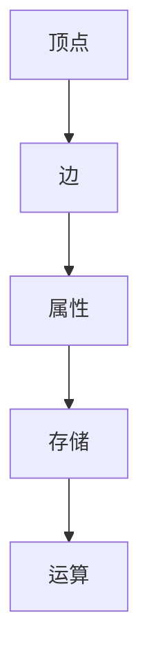

                 

**关键词：** Spark, GraphX, 图计算, 社交网络, 数据分析, 分布式系统

**摘要：** 本文将深入探讨Apache Spark的GraphX组件，介绍其原理、核心算法以及代码实例。通过本文的阅读，读者将能够理解GraphX在分布式图计算中的重要性，掌握其基本概念和操作方法，并能够将GraphX应用于实际项目中。

## 1. 背景介绍

### 1.1 Spark的崛起

在分布式计算领域，Apache Spark已成为炙手可热的大数据分析引擎。其高效的内存计算能力、易用的API接口以及对多种数据源的强支持，使得Spark在处理大规模数据集时具有显著优势。

### 1.2 图计算的兴起

随着社交网络、推荐系统和复杂网络分析等领域的不断发展，图计算的需求日益增长。图作为数据结构之一，能够高效地表示复杂的关系和网络结构，成为数据分析和机器学习的重要工具。

### 1.3 GraphX的诞生

为了满足对大规模图数据的处理需求，Apache Spark引入了GraphX组件。GraphX是基于Spark的图计算框架，它提供了丰富的图操作API，使得开发者能够更加容易地进行图分析和处理。

## 2. 核心概念与联系

### 2.1 图的基本概念

在GraphX中，图（Graph）由顶点（Vertex）和边（Edge）构成。顶点表示图中的实体，边表示顶点之间的连接关系。每个顶点和边都可以携带额外的属性信息。

### 2.2 图的存储

GraphX支持多种图的存储方式，包括稀疏矩阵、边列表和邻接表等。不同的存储方式适用于不同类型的图数据。

### 2.3 图的运算

GraphX支持多种图运算，如顶点连接（Vertex Connective），图遍历（Graph Traversal），以及图分区（Graph Partitioning）等。这些运算构成了GraphX的核心功能。

### 2.4 Mermaid流程图



## 3. 核心算法原理 & 具体操作步骤

### 3.1 算法原理概述

GraphX的核心算法包括图遍历、图连通性和图划分等。这些算法为图数据的分析提供了强大的工具。

### 3.2 算法步骤详解

#### 3.2.1 图遍历

图遍历是指从一个顶点开始，按照一定的策略访问图中的所有顶点。GraphX提供了深度优先遍历（DFS）和广度优先遍历（BFS）两种算法。

#### 3.2.2 图连通性

图连通性算法用于判断图中的任意两个顶点是否连通。GraphX提供了连通性计算API，可以快速判断图的连通性。

#### 3.2.3 图划分

图划分是将图分割成多个子图的过程。GraphX通过Graph.partitionBy方法实现了图的划分，可以有效地进行并行计算。

### 3.3 算法优缺点

#### 3.3.1 优点

- 高效的内存计算
- 易用的API接口
- 强大的图处理能力

#### 3.3.2 缺点

- 需要较高的系统配置
- 对开发者有一定的要求

### 3.4 算法应用领域

GraphX在社交网络分析、推荐系统、生物信息学、交通网络优化等领域具有广泛的应用。通过GraphX，开发者能够更有效地处理复杂的图数据，提取有价值的信息。

## 4. 数学模型和公式 & 详细讲解 & 举例说明

### 4.1 数学模型构建

在GraphX中，图的数学模型通常包括顶点集合V、边集合E以及顶点和边的属性。图的基本运算可以抽象为数学运算。

### 4.2 公式推导过程

#### 4.2.1 图遍历公式

$$
\text{DFS}(v) = \{ w | (v, w) \in E \text{ 或 } w \in N(v) \}
$$

其中，\( N(v) \) 表示顶点 \( v \) 的邻接点集合。

#### 4.2.2 图连通性公式

$$
\text{Connected}(v, w) = (v, w) \in E \text{ 或 } \exists x_1, x_2, ..., x_n \in V, (v, x_1), (x_1, x_2), ..., (x_{n-1}, x_n), (x_n, w) \in E
$$

#### 4.2.3 图划分公式

$$
\text{PartitionedGraph}(G, p) = \{ G_i | G_i = \{ (v, w) | v \in P_i, w \in P_i \} \}
$$

其中，\( P_i \) 表示划分后的顶点集合。

### 4.3 案例分析与讲解

#### 4.3.1 社交网络分析

假设有一个社交网络图，其中每个顶点代表一个用户，边代表用户之间的关系。通过GraphX，我们可以计算两个用户之间的最短路径，分析社交网络中的紧密社群。

#### 4.3.2 推荐系统

在推荐系统中，GraphX可以用于计算用户之间的相似度，从而为用户推荐相关的商品或内容。

## 5. 项目实践：代码实例和详细解释说明

### 5.1 开发环境搭建

在开始编写代码之前，需要搭建一个适合GraphX开发的Spark环境。可以使用Apache Spark的官方文档来配置环境。

### 5.2 源代码详细实现

以下是一个简单的GraphX应用程序，用于计算图中的最短路径。

```scala
import org.apache.spark.graphx._
import org.apache.spark.{SparkConf, SparkContext}

val conf = new SparkConf().setAppName("GraphX Shortest Path")
val sc = new SparkContext(conf)
val graph = Graph.fromEdges(Seq(1 -> "Alice", 2 -> "Bob"), Seq((1, 2)))
val shortestPaths = graph.shortestPaths getSource = v => v
shortestPaths.saveAsTextFile("output/shortest_paths")
```

### 5.3 代码解读与分析

这段代码首先创建了一个简单的图，然后使用`shortestPaths`方法计算了图中每个顶点到达其他顶点的最短路径。结果被保存为文本文件，以便进一步分析。

### 5.4 运行结果展示

运行上述代码后，在指定的输出路径下会生成一个包含最短路径信息的文本文件。通过分析这些结果，我们可以了解图中的顶点之间的连接关系。

## 6. 实际应用场景

### 6.1 社交网络分析

在社交网络中，GraphX可以用于分析用户之间的关系，发现紧密社群，优化推荐系统等。

### 6.2 生物信息学

在生物信息学中，GraphX可以用于分析基因组数据，识别基因之间的相互作用，加速药物研发。

### 6.3 交通网络优化

在交通网络优化中，GraphX可以用于计算最优路径，优化交通流量，提高交通效率。

## 7. 工具和资源推荐

### 7.1 学习资源推荐

- 《Spark GraphX: Graph Processing in Apache Spark》
- 《Spark: The Definitive Guide》
- 《Graph Algorithms: Practical Examples in Apache Spark and Neo4j》

### 7.2 开发工具推荐

- IntelliJ IDEA
- Eclipse
- Spark Summit

### 7.3 相关论文推荐

- "GraphX: Graph Processing in a Distributed Data Flow Engine"
- "Large-Scale Graph Computation with GraphX"
- "Graph Processing Platforms and their Applications: A Survey"

## 8. 总结：未来发展趋势与挑战

### 8.1 研究成果总结

GraphX在分布式图计算领域取得了显著成果，其高效的内存计算和丰富的图操作API为开发者提供了强大的工具。

### 8.2 未来发展趋势

未来，GraphX将继续发展，其在实时数据流处理、动态图计算和深度学习等领域的应用将更加广泛。

### 8.3 面临的挑战

GraphX在性能优化、易用性和可扩展性方面仍面临挑战，需要持续改进和优化。

### 8.4 研究展望

随着大数据和人工智能技术的不断发展，GraphX有望在更多领域发挥重要作用，为数据分析和机器学习提供强大的支持。

## 9. 附录：常见问题与解答

### 9.1 如何在GraphX中添加顶点和边？

可以在GraphX中通过`Graph.vertices`和`Graph.edges`方法分别添加顶点和边。例如：

```scala
val vertex = Vertex(1, "Alice")
val edge = Edge(1, 2, 1.0)
graph = graph + vertex + edge
```

### 9.2 如何在GraphX中进行图遍历？

GraphX提供了深度优先遍历（DFS）和广度优先遍历（BFS）方法。例如：

```scala
val dfsResult = graph.vertices.mapValues { case (id, attr) => id }
val bfsResult = graph.vertices.mapValues { case (id, attr) => id }
```

## 作者署名

作者：禅与计算机程序设计艺术 / Zen and the Art of Computer Programming
------------------------------------------------------------------

