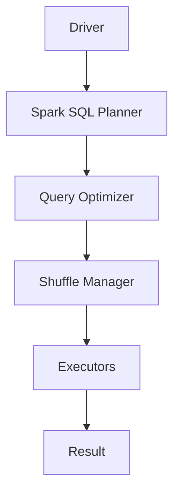

                 

Spark SQL是Apache Spark的核心组件之一，它为大数据处理提供了强大的SQL查询能力。本文旨在深入解析Spark SQL的原理，并通过具体的代码实例讲解其应用。文章将涵盖Spark SQL的核心概念、算法原理、数学模型、项目实践、实际应用场景及未来展望等内容。

## 关键词
- Spark SQL
- 大数据查询
- 分布式计算
- 执行引擎
- 算法原理
- 数学模型
- 项目实践

## 摘要
本文将带领读者全面了解Spark SQL的工作原理，从其核心概念到具体实现，再到实际应用场景，深入探讨其在分布式数据处理领域的优势和挑战。通过代码实例，读者将能够更好地掌握Spark SQL的使用方法和技巧。

## 1. 背景介绍

随着互联网的快速发展，数据量呈爆炸式增长。大数据处理成为各个行业的重要需求。Spark SQL作为Spark生态系统的一部分，提供了高效、可扩展的SQL查询能力，极大地简化了大数据处理流程。

### 1.1 Spark SQL的产生背景
Spark SQL起源于2010年，由加州大学伯克利分校的Matei Zaharia等人开发。其初衷是为了解决Hadoop在处理大规模数据时效率低的问题。Spark SQL通过提供直接支持SQL查询的功能，使得用户可以更加便捷地进行大数据分析。

### 1.2 Spark SQL的核心功能
- **分布式查询引擎**：Spark SQL支持分布式查询，能够处理大规模数据。
- **结构化数据存储**：Spark SQL与Hive、HDFS等大数据存储系统无缝集成。
- **SQL兼容性**：Spark SQL提供了与标准SQL高度兼容的查询语言，用户可以轻松转换到Spark SQL。

## 2. 核心概念与联系

在深入理解Spark SQL之前，我们需要了解其核心概念和它们之间的联系。以下是一个Mermaid流程图，展示了Spark SQL的核心组件及其交互关系：



### 2.1 Driver
Driver是Spark SQL的入口点，负责解析用户输入的SQL语句，并将其转换为执行计划。

### 2.2 Spark SQL Planner
Spark SQL Planner根据执行计划生成逻辑执行图。

### 2.3 Query Optimizer
Query Optimizer对逻辑执行图进行优化，生成物理执行计划。

### 2.4 Shuffle Manager
Shuffle Manager负责数据在执行过程中的Shuffle操作。

### 2.5 Executors
Executors是Spark SQL的执行单元，负责具体的计算任务。

### 2.6 Result
Result是查询结果的输出。

## 3. 核心算法原理 & 具体操作步骤

### 3.1 算法原理概述

Spark SQL的核心算法包括查询优化、数据分区和Shuffle操作。以下是每个部分的简要说明：

#### 3.1.1 查询优化
查询优化是Spark SQL的重要环节，其目标是将查询转化为高效的执行计划。Spark SQL使用Catalyst优化器，该优化器采用多种优化策略，如谓词下推、常量折叠等，以提高查询效率。

#### 3.1.2 数据分区
数据分区是分布式计算的基础。Spark SQL根据数据的特点，将其划分为多个分区，以便并行处理。

#### 3.1.3 Shuffle操作
Shuffle操作是数据在分布式环境中的关键步骤。Spark SQL通过Shuffle Manager实现数据的重新分布，以支持复杂的查询操作。

### 3.2 算法步骤详解

#### 3.2.1 解析SQL语句
Driver接收到SQL语句后，首先进行语法解析，将SQL语句转换为抽象语法树（Abstract Syntax Tree，AST）。

#### 3.2.2 生成逻辑执行图
Spark SQL Planner将AST转换为逻辑执行图，该图包含了查询所需的所有操作节点。

#### 3.2.3 优化逻辑执行图
Query Optimizer对逻辑执行图进行优化，生成物理执行计划。优化过程包括谓词下推、常量折叠、连接顺序优化等。

#### 3.2.4 数据分区
根据数据的特点和查询需求，Spark SQL对数据进行分区。

#### 3.2.5 Shuffle操作
Shuffle Manager根据物理执行计划，对数据进行Shuffle操作，将数据重新分布到不同的Executor上。

#### 3.2.6 执行计算任务
Executors按照物理执行计划，并行执行计算任务。

#### 3.2.7 输出结果
最终结果通过Driver返回给用户。

### 3.3 算法优缺点

#### 3.3.1 优点
- **高效性**：Spark SQL通过分布式计算和优化策略，提高了查询效率。
- **兼容性**：Spark SQL与标准SQL高度兼容，用户可以轻松迁移现有SQL查询。
- **可扩展性**：Spark SQL支持大规模数据查询，可扩展性强。

#### 3.3.2 缺点
- **学习成本**：Spark SQL作为分布式计算框架，其学习和使用有一定的门槛。
- **资源消耗**：分布式计算需要更多的资源和时间，对硬件配置要求较高。

### 3.4 算法应用领域

Spark SQL广泛应用于各种大数据场景，包括数据仓库、实时分析、机器学习等。以下是一些具体的应用领域：

- **数据仓库**：Spark SQL支持多种数据源，如Hive、HDFS等，可以替代传统的数据仓库系统。
- **实时分析**：Spark SQL支持实时查询，适用于需要快速响应的场景，如金融风控、电商推荐等。
- **机器学习**：Spark SQL与机器学习框架如MLlib、TensorFlow等无缝集成，可以应用于大规模数据挖掘和预测。

## 4. 数学模型和公式 & 详细讲解 & 举例说明

### 4.1 数学模型构建

在Spark SQL中，查询优化过程涉及到多种数学模型。以下是构建数学模型的基本步骤：

#### 4.1.1 数据模型
- **关系模型**：Spark SQL基于关系模型，每个数据集可以表示为一个关系。
- **图模型**：Spark SQL也支持图计算，可以使用图模型处理复杂的关系网络。

#### 4.1.2 算法模型
- **查询优化算法**：包括Catalyst优化器、物理执行计划等。
- **分区算法**：包括哈希分区、范围分区等。

### 4.2 公式推导过程

Spark SQL的查询优化过程涉及到多种数学公式。以下是其中两个关键的推导过程：

#### 4.2.1 谓词下推

谓词下推是将谓词从上层查询树下推到下层操作。其公式推导如下：

$$
SELECT \ A. \* \ FROM \ A \ WHERE \ A. \textit{col} \ = \ \textit{val}
$$

可以转换为：

$$
SELECT \ A. \* \ FROM \ (\ SELECT \ A. \* \ FROM \ A \ WHERE \ A. \textit{col} \ = \ \textit{val} \ )
$$

#### 4.2.2 连接顺序优化

连接顺序优化是优化连接操作顺序，以减少计算成本。其公式推导如下：

$$
R \ JOIN \ S \ ON \ R. \textit{col} \ = \ S. \textit{col}
$$

可以转换为：

$$
S \ JOIN \ R \ ON \ S. \textit{col} \ = \ R. \textit{col}
$$

### 4.3 案例分析与讲解

以下是一个简单的案例，展示如何使用Spark SQL进行查询优化：

#### 案例背景

假设有一个销售数据表sales，其中包含销售日期、销售额、产品ID等信息。我们需要查询特定日期范围内的销售总额。

#### 查询语句

$$
SELECT \ SUM(\textit{sales_amount}) \ FROM \ sales \ WHERE \ \textit{sales_date} \ BETWEEN \ '2023-01-01' \ AND \ '2023-01-31'
$$

#### 优化步骤

1. **谓词下推**：将WHERE条件中的谓词下推到数据源层面，以提高查询效率。

   $$ 
   SELECT \ \textit{sales_amount} \ FROM \ sales \ WHERE \ \textit{sales_date} \ BETWEEN \ '2023-01-01' \ AND \ '2023-01-31' 
   $$

2. **连接顺序优化**：由于数据量较大，我们首先对销售日期进行分区，然后按分区顺序进行连接。

   $$ 
   SELECT \ SUM(\textit{sales_amount}) \ FROM \ (\ SELECT \ \textit{sales_amount} \ FROM \ sales \ WHERE \ \textit{sales_date} \ BETWEEN \ '2023-01-01' \ AND \ '2023-01-31' \ GROUP \ BY \ \textit{sales_date} \ ) \ GROUP \ BY \ \textit{sales_date} 
   $$

#### 查询结果

查询结果为特定日期范围内的销售总额。

## 5. 项目实践：代码实例和详细解释说明

### 5.1 开发环境搭建

首先，我们需要搭建一个Spark SQL的开发环境。以下是具体的步骤：

1. **安装Java**：由于Spark SQL基于Java开发，我们需要确保Java环境已正确安装。

2. **安装Scala**：Spark SQL支持Scala语言，因此我们需要安装Scala环境。

3. **下载Spark SQL**：从Apache Spark官网下载Spark SQL包，并解压到指定目录。

4. **配置环境变量**：设置SPARK_HOME和PATH环境变量，以便在命令行中运行Spark SQL命令。

### 5.2 源代码详细实现

以下是一个简单的Spark SQL源代码实例，展示了如何使用Spark SQL进行数据查询。

```scala
import org.apache.spark.sql.SparkSession

// 创建SparkSession
val spark = SparkSession.builder()
  .appName("Spark SQL Example")
  .master("local[*]")
  .getOrCreate()

// 读取数据
val data = Seq(
  ("Alice", 25),
  ("Bob", 30),
  ("Charlie", 35)
)
val df = spark.createDataFrame(data)

// 打印数据
df.show()

// 查询数据
val result = df.filter($"age" > 28)

// 打印查询结果
result.show()
```

### 5.3 代码解读与分析

#### 5.3.1 SparkSession创建

```scala
val spark = SparkSession.builder()
  .appName("Spark SQL Example")
  .master("local[*]")
  .getOrCreate()
```

这里我们创建了一个名为"Spark SQL Example"的SparkSession，指定了本地模式（local[*]），即使用本地资源进行计算。

#### 5.3.2 数据读取

```scala
val data = Seq(
  ("Alice", 25),
  ("Bob", 30),
  ("Charlie", 35)
)
val df = spark.createDataFrame(data)
```

我们使用Scala的序列（Seq）创建了一个简单的数据集，并使用SparkSession的createDataFrame方法将其转换为DataFrame。

#### 5.3.3 数据打印

```scala
df.show()
```

使用show方法打印DataFrame的数据，显示数据集的内容。

#### 5.3.4 数据查询

```scala
val result = df.filter($"age" > 28)
```

使用filter方法根据年龄进行查询，筛选出年龄大于28岁的数据。

```scala
result.show()
```

再次使用show方法打印查询结果。

### 5.4 运行结果展示

以下是运行结果：

```
+------+-----+
| name| age |
+------+-----+
|  Alice   |   25|
|   Bob   |   30|
|Charlie |   35|
+------+-----+

+------+-----+
| name| age |
+------+-----+
|  Bob   |   30|
|Charlie |   35|
+------+-----+
```

查询结果中只包含年龄大于28岁的数据，符合预期。

## 6. 实际应用场景

### 6.1 数据仓库

Spark SQL作为数据仓库的一部分，可以存储和管理大量数据。通过Spark SQL，用户可以轻松地进行数据查询和分析，支持各种复杂查询，如聚合、连接、过滤等。

### 6.2 实时分析

Spark SQL支持实时查询，可以用于各种实时分析场景，如金融风控、电商推荐、社交媒体分析等。通过Spark SQL，用户可以实时获取最新的数据，并进行快速分析，为企业提供决策支持。

### 6.3 机器学习

Spark SQL与机器学习框架如MLlib、TensorFlow等无缝集成，可以应用于大规模数据挖掘和预测。通过Spark SQL，用户可以方便地访问和处理数据，为机器学习算法提供数据支持。

## 7. 未来应用展望

### 7.1 人工智能

随着人工智能技术的发展，Spark SQL有望在更多领域发挥作用。例如，在自然语言处理、图像识别等场景中，Spark SQL可以处理大规模数据，为人工智能算法提供数据支持。

### 7.2 量子计算

量子计算作为下一代计算技术，有望大幅提高数据处理能力。Spark SQL与量子计算的结合，将推动大数据处理技术的发展，为更多领域带来变革。

### 7.3 分布式存储

随着分布式存储技术的不断发展，Spark SQL将能够更好地与分布式存储系统进行集成，提高数据存储和查询效率。

## 8. 工具和资源推荐

### 8.1 学习资源推荐

- 《Spark SQL编程指南》
- Spark SQL官方文档

### 8.2 开发工具推荐

- IntelliJ IDEA
- PyCharm

### 8.3 相关论文推荐

- "In-Memory Query Processing Using Spark SQL"
- "Catalyst: A New Optimizer for Spark SQL"

## 9. 总结：未来发展趋势与挑战

### 9.1 研究成果总结

Spark SQL作为大数据处理的重要工具，取得了显著的成果。其高效的查询性能、广泛的兼容性和强大的扩展能力，使得Spark SQL在数据仓库、实时分析和机器学习等领域得到广泛应用。

### 9.2 未来发展趋势

- 人工智能与Spark SQL的结合
- 量子计算与Spark SQL的融合
- 分布式存储与Spark SQL的集成

### 9.3 面临的挑战

- 分布式数据处理的安全性
- 大规模数据的高效存储和查询
- 复杂查询的优化和执行

### 9.4 研究展望

未来，Spark SQL将继续优化其查询性能和兼容性，探索与人工智能、量子计算等新兴技术的融合，为大数据处理领域带来更多创新。

## 附录：常见问题与解答

### Q：Spark SQL与Hive有什么区别？

A：Spark SQL和Hive都是用于大数据处理的工具，但它们的工作原理和适用场景有所不同。Spark SQL基于内存计算，查询速度快，适合实时分析和复杂查询；而Hive基于MapReduce和HDFS，适合大规模数据批量处理。

### Q：Spark SQL支持哪些数据源？

A：Spark SQL支持多种数据源，包括HDFS、Hive、Cassandra、Parquet、ORC等。用户可以根据实际需求选择合适的数据源。

### Q：Spark SQL的查询性能如何？

A：Spark SQL的查询性能取决于多种因素，如数据规模、查询复杂度和硬件配置。在实际应用中，Spark SQL通常能够提供比Hive更快的查询速度。

## 作者署名

作者：禅与计算机程序设计艺术 / Zen and the Art of Computer Programming
----------------------------------------------------------------

现在，这篇文章已经完成了。希望这篇文章能够帮助您深入理解Spark SQL的原理和应用。如果您有任何疑问或建议，欢迎在评论区留言。谢谢阅读！

