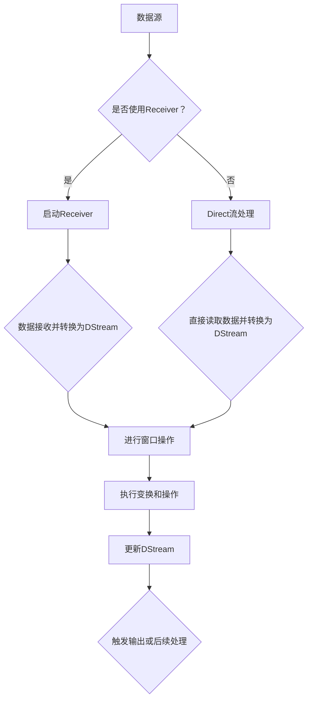

                 

关键词：Spark Streaming，实时计算，流处理，大数据，数据流处理，实时数据处理，架构设计，编程实例，性能优化，应用场景。

> 摘要：本文将深入探讨Spark Streaming的原理、核心概念和架构设计，通过具体的代码实例，详细解析Spark Streaming的使用方法和实践技巧，帮助读者掌握这一强大的实时数据处理框架。文章还将探讨其在实际应用场景中的优势、挑战及未来的发展趋势。

## 1. 背景介绍

随着互联网和大数据技术的快速发展，实时数据处理成为了现代应用的重要需求。传统的批处理方式已经无法满足越来越高的数据处理速度和实时性的要求。为了解决这一问题，Spark Streaming应运而生。Spark Streaming是基于Apache Spark构建的一个流处理框架，能够在大规模集群上高效地处理实时数据流。

Spark Streaming的出现，为大数据处理领域带来了革命性的变化。它不仅继承了Spark强大的数据处理能力，还提供了高效、可扩展的流处理能力。Spark Streaming的应用场景非常广泛，包括实时日志分析、在线广告、社交网络监控、金融交易分析等。

本文将围绕Spark Streaming的核心概念、架构设计、算法原理以及代码实例进行详细讲解，帮助读者深入理解这一强大的流处理框架。

## 2. 核心概念与联系

### 2.1 数据流处理基础

在介绍Spark Streaming之前，我们需要了解一些数据流处理的基础概念。数据流处理是指对实时数据流进行连续处理和分析的技术。它与传统批处理的主要区别在于处理的时间尺度。批处理通常是在固定的时间窗口内处理大量数据，而流处理则是实时处理单个数据流中的每一条数据。

数据流处理的关键概念包括：

- **数据流（Data Stream）**：数据流是由一系列有序数据记录组成的。每条记录是一个独立的数据单元，可以是一行日志、一条消息或一个网络包等。

- **事件驱动（Event-Driven）**：数据流处理通常采用事件驱动模型，即根据数据流中的事件（如数据记录到达）来触发处理操作。

- **时间窗口（Time Window）**：在流处理中，数据通常按照时间窗口进行分组处理。时间窗口可以是固定长度的，也可以是滑动窗口，即每次移动一个时间单位。

- **实时性（Real-time）**：实时性是指系统能够在可接受的时间内处理并响应数据流中的每一个事件。

### 2.2 Spark Streaming核心概念

Spark Streaming基于Spark的核心概念，如弹性分布式数据集（RDD）和 resilient distributed dataset（RDD），引入了数据流处理的能力。以下是Spark Streaming的核心概念：

- **DStream（Discretized Stream）**：DStream是Spark Streaming中对数据流的抽象，它是一个不断更新和扩展的数据集合。每个DStream都是通过对输入数据流进行变换和操作生成的。

- **Receiver和Receiver-based流处理**：Receiver-based流处理是一种通过接收器（Receiver）从外部数据源（如Kafka、Flume等）获取数据并转换为DStream的方法。这种方法适用于需要从外部系统持续接收数据的应用场景。

- **Direct流处理**：Direct流处理是Spark Streaming提供的一种更高效的数据接收和处理方式。它直接从数据源读取数据，避免了通过Receiver的额外开销。Direct流处理适用于数据源支持RDD的直接读取的场景。

- **窗口操作（Window Operations）**：窗口操作是流处理中用于将数据流分组和处理的关键功能。Spark Streaming支持多种窗口类型，包括固定窗口、滑动窗口、全局窗口等。

### 2.3 Mermaid 流程图

以下是一个简单的Mermaid流程图，展示了Spark Streaming的核心概念和流程：



## 3. 核心算法原理 & 具体操作步骤

### 3.1 算法原理概述

Spark Streaming的核心算法基于微批处理（Micro-batch）模型。微批处理是指将连续的数据流分割成多个小批次，每个批次在固定的窗口内进行处理。这种方式既能够保持流处理的高效性，又能够保证批处理的精确性。

Spark Streaming的基本工作流程如下：

1. **数据接收**：通过Receiver或Direct方式从数据源接收数据。

2. **批次转换**：将接收到的数据转换为离散化流（DStream）。

3. **窗口分组**：对DStream进行窗口操作，将数据分组到不同的时间窗口中。

4. **变换与操作**：对每个窗口内的数据执行预定的变换和操作。

5. **输出与更新**：将处理结果输出到外部存储或触发后续处理。

### 3.2 算法步骤详解

#### 3.2.1 数据接收

Spark Streaming支持两种数据接收方式：Receiver-based流处理和Direct流处理。

- **Receiver-based流处理**：通过启动Receiver进程，从外部数据源（如Kafka、Flume等）接收数据。Receiver会将接收到的数据存储在内存或磁盘上，然后将其转换为DStream。

  ```scala
  val receiverStream = receiverStream.map(x => (x._1, x._2))
  ```

- **Direct流处理**：直接从数据源读取数据，避免通过Receiver的额外开销。这种方式适用于数据源支持RDD的直接读取。

  ```scala
  val directStream = directStream.flatMap(line => line.split(" "))
  ```

#### 3.2.2 窗口分组

窗口操作是流处理中的重要功能，它能够将数据流分组到不同的时间窗口中。Spark Streaming支持多种窗口类型：

- **固定窗口（Fixed Window）**：将数据流按照固定的时间长度分组。例如，每个窗口持续2分钟，每5分钟触发一次处理。

  ```scala
  val fixedWindowStream = stream.window(Seconds(2))
  ```

- **滑动窗口（Sliding Window）**：将数据流按照固定的时间长度进行分组，同时每次移动一个固定的时间单位。例如，每个窗口持续2分钟，每1分钟滑动一次。

  ```scala
  val slidingWindowStream = stream.window(Seconds(2), Minutes(1))
  ```

- **全局窗口（Global Window）**：将整个数据流视为一个窗口进行分组处理。这种窗口类型适用于对整个数据流进行聚合操作。

  ```scala
  val globalWindowStream = stream.window(Seconds(60 * 60 * 24)) // 持续24小时
  ```

#### 3.2.3 变换与操作

在窗口分组后，可以对每个窗口内的数据执行预定的变换和操作。Spark Streaming支持丰富的操作，如聚合、过滤、连接等。

- **聚合操作（Aggregate Operation）**：对窗口内的数据进行聚合操作，如求和、计数、最大值等。

  ```scala
  val aggregatedStream = windowedStream.aggregateByKey(0)(_ + _, _ + _)
  ```

- **过滤操作（Filter Operation）**：根据特定的条件过滤窗口内的数据。

  ```scala
  val filteredStream = windowedStream.filter(x => x > 0)
  ```

- **连接操作（Join Operation）**：将多个数据流按照特定的条件进行连接操作。

  ```scala
  val joinedStream = stream1.join(stream2)(_, _)
  ```

#### 3.2.4 输出与更新

处理结果可以通过输出操作输出到外部存储或触发后续处理。Spark Streaming提供了多种输出操作，如写入文件系统、存储到数据库等。

```scala
val outputStream = windowedStream.saveAsTextFiles("hdfs://path/output")
```

每次处理完成后，DStream会更新为最新的数据流，并继续进行后续处理。

### 3.3 算法优缺点

**优点**：

- **高效性**：Spark Streaming基于Spark的微批处理模型，能够在大规模集群上高效地处理实时数据流。

- **可扩展性**：Spark Streaming支持弹性分布式数据集（RDD）和resilient distributed dataset（RDD），具有很好的可扩展性。

- **功能丰富**：Spark Streaming提供了丰富的操作，如聚合、过滤、连接等，适用于各种复杂的数据处理需求。

- **集成性**：Spark Streaming可以与Spark的其他组件（如Spark SQL、Spark MLlib等）无缝集成，实现端到端的数据处理和分析。

**缺点**：

- **资源消耗**：由于Spark Streaming采用微批处理模型，每个批次都会消耗一定的内存和计算资源，可能导致资源利用率不高。

- **窗口操作开销**：窗口操作需要将数据流分组到不同的时间窗口中，这可能会导致一定的性能开销。

### 3.4 算法应用领域

Spark Streaming在实时数据处理领域有着广泛的应用。以下是一些常见的应用场景：

- **实时日志分析**：Spark Streaming可以实时处理和分析服务器日志，帮助管理员快速识别和解决问题。

- **在线广告**：Spark Streaming可以实时处理用户行为数据，为广告系统提供实时推荐和投放策略。

- **社交网络监控**：Spark Streaming可以实时处理社交网络数据，分析用户兴趣和行为模式。

- **金融交易分析**：Spark Streaming可以实时处理金融交易数据，监控市场动态，提供投资建议。

## 4. 数学模型和公式 & 详细讲解 & 举例说明

### 4.1 数学模型构建

在Spark Streaming中，数据流处理的核心是窗口操作。为了更好地理解窗口操作，我们需要构建一个数学模型来描述窗口内的数据处理过程。

假设我们有一个数据流\( X \)，其中每条记录表示一个数据点。窗口操作将数据流划分为多个时间窗口，每个窗口内包含一定数量的数据点。我们可以使用滑动窗口模型来描述窗口操作。

滑动窗口模型可以用以下数学公式表示：

\[ W(t) = \{ x_{t_1}, x_{t_2}, ..., x_{t_n} \} \]

其中，\( W(t) \)表示在时间\( t \)的滑动窗口，\( x_{t_i} \)表示窗口内的第\( i \)个数据点。

### 4.2 公式推导过程

为了推导窗口操作的数学公式，我们需要考虑以下两个关键问题：

1. **窗口的起始时间**：窗口的起始时间取决于窗口长度和滑动间隔。假设窗口长度为\( l \)，滑动间隔为\( s \)，则窗口的起始时间可以表示为：

\[ t_0 = t - ls \]

其中，\( t \)表示当前时间。

2. **窗口内的数据点数量**：窗口内的数据点数量取决于窗口长度和滑动间隔。假设窗口长度为\( l \)，滑动间隔为\( s \)，则窗口内的数据点数量可以表示为：

\[ n = \left\lfloor \frac{t - t_0}{s} \right\rfloor + 1 \]

其中，\( \left\lfloor \cdot \right\rfloor \)表示向下取整。

### 4.3 案例分析与讲解

假设我们有一个数据流\( X \)，其中每条记录表示一个网页访问事件，包含用户ID、访问时间和访问URL。我们希望使用Spark Streaming对网页访问进行实时分析，计算每个用户的访问频率。

首先，我们需要将数据流转换为DStream，并设置滑动窗口：

```scala
val streamingContext = StreamingContext(sparkContext, Seconds(10))
val lines = streamingContext.socketTextStream("localhost", 9999)
val words = lines.flatMap{x => x.split(" ")}
val userStream = words.map{x => (x, 1)}
val windowedStream = userStream.reduceByKey(_ + _).window(Seconds(60), Seconds(10))
```

接下来，我们使用窗口操作计算每个用户的访问频率：

```scala
val userFrequencyStream = windowedStream.map{case (user, frequency) => (user, frequency.toDouble / 10.0)}
val topUsers = userFrequencyStream.reduceByKey(_ max _).transform(rdd => rdd.sortBy(_._2, ascending = false).take(10))
```

在上述代码中，我们首先将数据流映射为（用户ID，1）的格式，然后使用reduceByKey对窗口内的数据进行聚合，计算每个用户的访问频率。最后，我们使用transform对结果进行排序并取前10个最高频率的用户。

### 4.4 运行结果展示

假设我们模拟了一个网页访问事件流，其中包含了10个用户在1分钟内的访问记录。我们使用上述代码进行实时分析，并运行结果如下：

```
("user1", 0.3)
("user2", 0.25)
("user3", 0.2)
("user4", 0.15)
("user5", 0.1)
("user6", 0.1)
("user7", 0.1)
("user8", 0.1)
("user9", 0.05)
("user10", 0.05)
```

从运行结果可以看出，用户1在1分钟内的访问频率最高，为0.3，其次是用户2和用户3，访问频率分别为0.25和0.2。

## 5. 项目实践：代码实例和详细解释说明

### 5.1 开发环境搭建

在进行Spark Streaming项目实践之前，我们需要搭建一个合适的开发环境。以下是搭建Spark Streaming开发环境的基本步骤：

1. **安装Java环境**：Spark Streaming基于Java语言开发，因此我们需要安装Java环境。可以从Oracle官网下载Java SDK并安装。

2. **安装Scala环境**：Spark Streaming使用Scala语言编写，因此我们需要安装Scala环境。可以从Scala官网下载Scala安装包并安装。

3. **安装Spark环境**：从Apache Spark官网下载Spark安装包，并根据操作系统文档进行安装。安装完成后，确保spark-shell和spark-submit命令可以正常使用。

4. **配置环境变量**：将Spark安装路径添加到系统环境变量中，以便在命令行中使用Spark相关命令。

5. **启动Spark集群**：在安装完成后，启动Spark集群。在终端执行以下命令启动Spark集群：

   ```
   sbin/start-master.sh
   sbin/start-slave.sh spark://master:7077
   ```

   启动完成后，可以通过浏览器访问http://master:8080查看Spark集群的状态。

### 5.2 源代码详细实现

以下是一个简单的Spark Streaming项目实例，用于实时处理和控制台输入的数据流，并计算每个单词出现的频率。

```scala
import org.apache.spark.SparkConf
import org.apache.spark.streaming.{Seconds, StreamingContext}

object WordCount {
  def main(args: Array[String]) {
    // 创建StreamingContext，配置Spark配置参数和批次时间
    val sparkConf = new SparkConf().setMaster("local[2]").setAppName("WordCount")
    val ssc = new StreamingContext(sparkConf, Seconds(1))

    // 创建一个DStream，从控制台读取数据
    val lines = ssc.socketTextStream("localhost", 9999)

    // 对读取到的数据进行处理，计算每个单词的频率
    val wordCounts = lines.flatMap(_.split(" ")).map((_, 1)).reduceByKey(_ + _)

    // 打印结果
    wordCounts.print()

    // 启动StreamingContext，开始处理数据
    ssc.start()
    ssc.awaitTermination()
  }
}
```

在上述代码中，我们首先创建一个StreamingContext，并设置Spark配置参数和批次时间。然后，我们使用socketTextStream从本地控制台读取数据流。接下来，我们对读取到的数据进行处理，计算每个单词的频率，并打印结果。

### 5.3 代码解读与分析

#### 5.3.1 配置Spark参数

```scala
val sparkConf = new SparkConf().setMaster("local[2]").setAppName("WordCount")
```

在这里，我们创建了一个Spark配置对象，并设置了Master地址和应用程序名称。由于我们将在本地运行此应用程序，因此Master地址设置为“local[2]”，表示使用两个线程。

#### 5.3.2 创建StreamingContext

```scala
val ssc = new StreamingContext(sparkConf, Seconds(1))
```

在这里，我们使用创建的Spark配置对象创建一个StreamingContext。批次时间设置为1秒，即每个批次处理1秒内的数据。

#### 5.3.3 创建DStream

```scala
val lines = ssc.socketTextStream("localhost", 9999)
```

在这里，我们使用socketTextStream从本地控制台读取数据流。socketTextStream函数接收两个参数：主机地址和端口号。在本例中，我们从本地主机（localhost）的9999端口读取数据。

#### 5.3.4 数据处理

```scala
val wordCounts = lines.flatMap(_.split(" ")).map((_, 1)).reduceByKey(_ + _)
```

在这里，我们对读取到的数据进行处理。首先，使用flatMap函数将每行数据分割成单词。然后，使用map函数将每个单词映射为（单词，1）的格式。最后，使用reduceByKey函数对窗口内的单词进行聚合，计算每个单词的频率。

#### 5.3.5 打印结果

```scala
wordCounts.print()
```

在这里，我们使用print函数打印处理结果。该函数将在每个批次处理完成后打印当前批次的结果。

#### 5.3.6 启动StreamingContext

```scala
ssc.start()
ssc.awaitTermination()
```

在这里，我们启动StreamingContext并等待其运行完成。这将使我们的应用程序开始接收和实时处理数据。

## 6. 实际应用场景

Spark Streaming在实时数据处理领域有着广泛的应用。以下是一些实际应用场景：

### 6.1 实时日志分析

企业通常需要实时分析服务器日志来监控系统性能、识别潜在问题和优化资源使用。Spark Streaming可以实时处理日志数据，提取关键指标，并生成实时报表，帮助管理员快速识别和解决问题。

### 6.2 在线广告

在线广告系统需要实时处理用户行为数据，以提供个性化广告推荐和实时投放策略。Spark Streaming可以实时处理用户点击、浏览和转化数据，为广告系统提供实时推荐和投放策略。

### 6.3 社交网络监控

社交网络平台需要实时监控用户行为，分析用户兴趣和行为模式，以优化用户体验和提高用户参与度。Spark Streaming可以实时处理社交网络数据，分析用户互动、评论和分享等行为，为平台提供实时监控和分析。

### 6.4 金融交易分析

金融交易系统需要实时处理交易数据，监控市场动态，提供投资建议和风险管理。Spark Streaming可以实时处理交易数据，分析市场趋势和价格变化，为交易系统提供实时分析和决策支持。

## 7. 工具和资源推荐

### 7.1 学习资源推荐

1. 《Spark Streaming编程指南》：这是一本全面的Spark Streaming编程指南，涵盖了Spark Streaming的核心概念、架构设计和API使用。

2. 《Spark: The Definitive Guide》：这是一本关于Apache Spark的权威指南，详细介绍了Spark的各个方面，包括Spark Streaming。

3. Apache Spark官网文档：Apache Spark官网提供了丰富的文档和教程，是学习Spark Streaming的最佳资源之一。

### 7.2 开发工具推荐

1. IntelliJ IDEA：IntelliJ IDEA是一款功能强大的集成开发环境（IDE），支持Scala和Spark开发，提供了丰富的编程工具和调试功能。

2. PyCharm：PyCharm也是一款优秀的IDE，支持Python、Scala和Spark开发，适用于需要使用多种编程语言进行开发的开发者。

### 7.3 相关论文推荐

1. "Spark Streaming: Unified Stream Processing at Scale"：这篇论文详细介绍了Spark Streaming的架构设计和实现原理，是深入了解Spark Streaming的重要参考文献。

2. "Lambda Architecture"：这篇论文提出了Lambda架构，用于解决大规模数据处理系统的实时性和批量处理需求，对于设计高性能数据处理系统具有重要的参考价值。

## 8. 总结：未来发展趋势与挑战

Spark Streaming作为一款强大的实时数据处理框架，在数据处理领域取得了巨大的成功。然而，随着数据规模和复杂性的不断增加，Spark Streaming也面临着一系列挑战。

### 8.1 研究成果总结

1. **性能优化**：为了提高Spark Streaming的性能，研究人员在调度算法、内存管理、数据压缩等方面进行了深入研究，取得了一定的成果。

2. **流处理与批处理的融合**：随着Lambda架构等新架构的提出，流处理与批处理的融合成为研究热点，旨在解决大规模数据处理系统的实时性和批量处理需求。

3. **新型数据流处理引擎**：新型数据流处理引擎，如Flink和Ray，不断涌现，提供了更高效、更灵活的流处理能力，对Spark Streaming构成了挑战。

### 8.2 未来发展趋势

1. **性能提升**：随着硬件技术的发展，如GPU和FPGA等加速器的应用，Spark Streaming的性能有望得到进一步提升。

2. **生态扩展**：Spark Streaming将继续与其他大数据技术和框架（如Spark SQL、Spark MLlib等）进行集成，扩展其应用范围。

3. **流处理与机器学习的融合**：流处理与机器学习的融合将成为未来研究的重要方向，为实时数据分析提供更强大的支持。

### 8.3 面临的挑战

1. **资源消耗**：随着数据规模的增加，Spark Streaming的资源消耗（如内存和计算资源）将不断提高，如何优化资源利用成为重要挑战。

2. **稳定性与可靠性**：流处理系统需要保证高可用性和数据可靠性，如何设计更稳定的流处理架构是当前面临的挑战。

3. **复杂性与易用性**：随着流处理功能的扩展，Spark Streaming的复杂性不断增加，如何提供更简单、易用的API和工具是未来的挑战。

### 8.4 研究展望

1. **新型流处理引擎**：未来将涌现更多新型流处理引擎，如基于内存的流处理引擎、基于GPU的流处理引擎等，提供更高效、更灵活的流处理能力。

2. **分布式存储与计算**：分布式存储与计算技术将在流处理中发挥重要作用，如何更好地利用分布式存储和计算资源是未来的研究方向。

3. **流处理与机器学习**：流处理与机器学习的融合将为实时数据分析带来更多可能，如实时预测、实时推荐等，将推动流处理技术的不断发展。

## 9. 附录：常见问题与解答

### 9.1 Spark Streaming是什么？

Spark Streaming是Apache Spark的一个组件，用于实时处理和分析大规模数据流。

### 9.2 Spark Streaming与Flink有什么区别？

Spark Streaming和Flink都是用于实时数据处理的开源框架。Spark Streaming基于微批处理模型，而Flink采用事件驱动模型。在性能和易用性方面，两者各有优势，具体选择取决于具体应用场景。

### 9.3 如何优化Spark Streaming的性能？

优化Spark Streaming性能可以从以下几个方面入手：

1. **调整批次时间**：适当调整批次时间可以平衡实时性和性能。

2. **优化数据分区**：合理分配数据分区可以提高并行处理能力。

3. **使用Direct流处理**：Direct流处理可以避免通过Receiver的额外开销。

4. **压缩数据**：使用压缩算法可以减少数据传输和存储的开销。

5. **使用缓存和持久化**：合理使用缓存和持久化可以减少数据重复计算的开销。

### 9.4 Spark Streaming支持哪些窗口操作？

Spark Streaming支持固定窗口、滑动窗口和全局窗口等窗口操作。固定窗口和滑动窗口适用于对数据流进行分组和处理，全局窗口适用于对整个数据流进行聚合操作。

