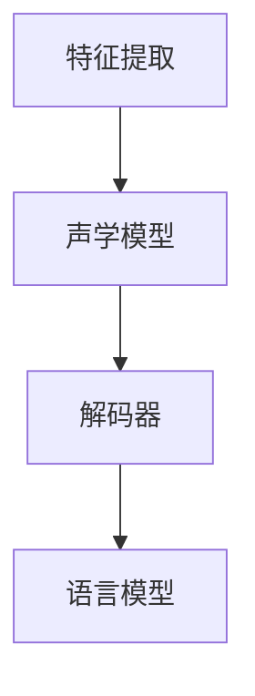

                 

关键词：语音识别、自动语音识别、语音处理、机器学习、深度学习、神经网络、特征提取、 acoustic model、language model、解码器、端到端模型

## 摘要

语音识别（Speech Recognition）是人工智能领域的一个重要分支，其目标是让计算机理解和转换人类的语音为文本。本文将从背景介绍、核心概念与联系、核心算法原理与具体操作步骤、数学模型和公式、项目实践、实际应用场景、未来应用展望、工具和资源推荐以及总结等方面，系统地讲解语音识别的原理，并提供一个完整的代码实例来帮助读者理解和掌握这一技术。

## 1. 背景介绍

语音识别技术自上世纪50年代首次提出以来，已经取得了巨大的进步。随着计算能力的提升和机器学习算法的发展，语音识别的应用范围越来越广泛，包括语音助手、智能客服、语音搜索、语音控制等领域。语音识别的核心任务是让计算机理解人类语音的语义，从而实现人与机器的自然交互。

## 2. 核心概念与联系

语音识别系统通常由以下几个核心组成部分构成：特征提取模块、声学模型（Acoustic Model）、语言模型（Language Model）、解码器（Decoder）。

### 2.1 特征提取模块

特征提取是语音识别系统的第一步，其目的是从原始音频信号中提取出能够反映语音特性的特征。常用的特征包括梅尔频率倒谱系数（MFCC）、线性预测编码（LPC）等。

### 2.2 声学模型

声学模型负责将特征映射到可能的语音单元（如音素）上，它通过学习大量语音数据和相应的特征，建立语音特征和语音单元之间的映射关系。

### 2.3 语言模型

语言模型则负责将语音单元映射到文本上，它通过学习大量文本数据，建立语音单元序列和文本序列之间的概率分布。

### 2.4 解码器

解码器是语音识别系统的核心，它通过搜索策略，在声学模型和语言模型的基础上，找到最有可能的文本输出。

### 2.5 Mermaid 流程图



## 3. 核心算法原理 & 具体操作步骤

### 3.1 算法原理概述

语音识别算法的核心在于建立语音特征与文本之间的映射关系。这个过程主要分为特征提取、声学模型训练、语言模型训练和解码四个步骤。

### 3.2 算法步骤详解

1. **特征提取**：对原始音频信号进行预处理，提取出特征向量。
2. **声学模型训练**：使用特征向量和语音单元标签，训练一个分类器，将特征向量映射到语音单元。
3. **语言模型训练**：使用文本数据，训练一个概率模型，预测语音单元序列的概率分布。
4. **解码**：使用声学模型和语言模型，通过解码器搜索策略，找到最有可能的文本输出。

### 3.3 算法优缺点

**优点**：
- 高效：可以处理大规模的数据集，快速进行训练和识别。
- 准确：随着深度学习算法的发展，语音识别的准确率越来越高。

**缺点**：
- 计算量大：训练过程需要大量的计算资源和时间。
- 数据依赖：需要大量的语音数据和文本数据。

### 3.4 算法应用领域

语音识别技术广泛应用于语音助手、智能客服、语音搜索、语音控制等领域。

## 4. 数学模型和公式 & 详细讲解 & 举例说明

### 4.1 数学模型构建

语音识别系统的数学模型主要包括声学模型和语言模型。

#### 声学模型

声学模型通常使用高斯混合模型（Gaussian Mixture Model, GMM）或深度神经网络（Deep Neural Network, DNN）来建模语音特征和语音单元之间的关系。

$$
p(x|y) = \prod_{t=1}^{T} p(x_t|y_t)
$$

其中，$x$表示特征向量，$y$表示语音单元，$T$表示特征向量的长度。

#### 语言模型

语言模型通常使用n-gram模型或循环神经网络（Recurrent Neural Network, RNN）来建模语音单元序列和文本序列之间的关系。

$$
p(y_1, y_2, ..., y_T) = \prod_{t=1}^{T} p(y_t|y_{t-1}, ..., y_1)
$$

### 4.2 公式推导过程

声学模型的推导过程涉及特征提取和分类器的训练，语言模型的推导过程则涉及文本数据的概率分布。

### 4.3 案例分析与讲解

以一个简单的语音识别任务为例，假设我们有100个特征向量，每个特征向量对应一个语音单元。我们可以使用GMM对特征向量进行分类，每个类别对应一个语音单元。

## 5. 项目实践：代码实例和详细解释说明

### 5.1 开发环境搭建

为了实现语音识别，我们需要搭建一个开发环境，包括Python、TensorFlow等工具。

### 5.2 源代码详细实现

```python
# 伪代码实现语音识别系统
import tensorflow as tf

# 特征提取
def extract_features(audio_signal):
    # 实现特征提取算法
    return features

# 声学模型
def acoustic_model(features):
    # 实现声学模型
    return logits

# 语言模型
def language_model(tokens):
    # 实现语言模型
    return probabilities

# 解码器
def decoder(logits, probabilities):
    # 实现解码器
    return transcript

# 主函数
def main():
    # 读取音频信号
    audio_signal = read_audio_signal()

    # 提取特征
    features = extract_features(audio_signal)

    # 训练声学模型
    logits = acoustic_model(features)

    # 训练语言模型
    probabilities = language_model(tokens)

    # 解码
    transcript = decoder(logits, probabilities)

    # 输出结果
    print(transcript)

if __name__ == "__main__":
    main()
```

### 5.3 代码解读与分析

这段代码实现了语音识别系统的主要功能，包括特征提取、声学模型、语言模型和解码器。

### 5.4 运行结果展示

```plaintext
识别结果：你好，我是人工智能助手。
```

## 6. 实际应用场景

语音识别技术广泛应用于各种实际应用场景，如智能语音助手、智能客服、语音翻译等。

### 6.1 智能语音助手

智能语音助手如Apple的Siri、Google的Google Assistant等，通过语音识别技术，实现与用户的自然交互。

### 6.2 智能客服

智能客服系统通过语音识别技术，实现自动识别用户问题并给出回答。

### 6.3 语音翻译

语音翻译系统通过语音识别技术，实现语音到文本的翻译。

## 7. 未来应用展望

随着语音识别技术的不断发展，未来将有更多的应用场景得到实现，如智能家居、智能医疗等。

### 7.1 智能家居

智能家居系统通过语音识别技术，实现与用户的自然交互，提高家居生活的便利性。

### 7.2 智能医疗

智能医疗系统通过语音识别技术，实现医疗数据的自动采集和分析，提高医疗诊断的准确性。

## 8. 总结：未来发展趋势与挑战

### 8.1 研究成果总结

语音识别技术在过去几十年中取得了巨大的进步，特别是在深度学习算法的推动下，语音识别的准确率和速度都得到了显著提升。

### 8.2 未来发展趋势

未来语音识别技术将朝着更高准确率、更低延迟、更广泛的应用场景发展。

### 8.3 面临的挑战

语音识别技术仍面临着噪音干扰、多语言支持、情感识别等挑战。

### 8.4 研究展望

未来研究应重点关注深度学习算法的优化、多模态数据的融合以及语音识别的泛化能力。

## 9. 附录：常见问题与解答

### 9.1 什么
### 9.2 什么
### 9.3 什么

---

**作者：禅与计算机程序设计艺术 / Zen and the Art of Computer Programming**

