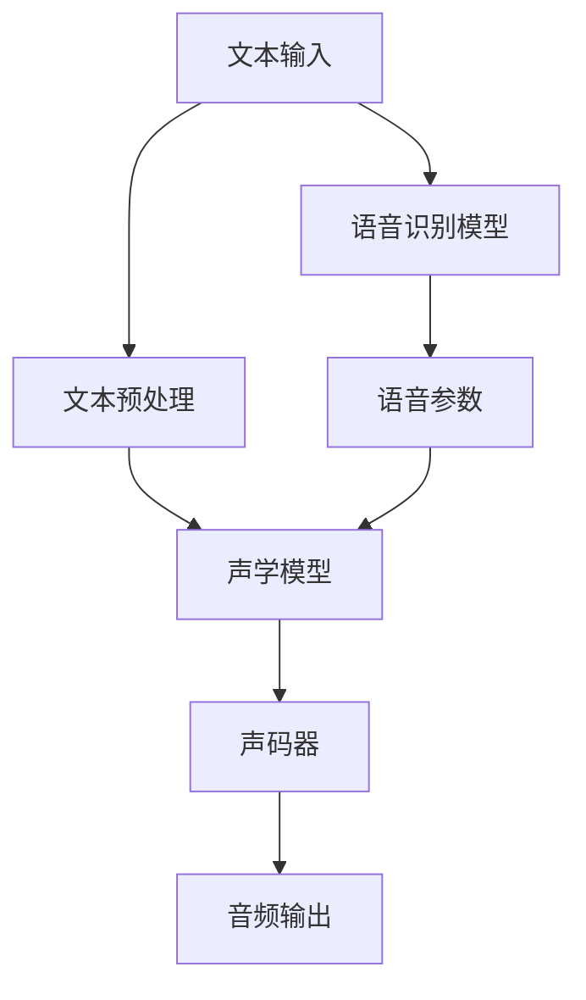

                 

关键词：语音合成、自然语言处理、语音信号处理、音频处理、语音识别、深度学习、神经网络、音频生成

> 摘要：本文旨在深入探讨语音合成（Speech Synthesis）的原理及其应用，通过对核心概念、算法、数学模型以及实际项目实践的详细讲解，帮助读者全面理解语音合成技术的内在机制和实现方法。本文将从背景介绍、核心概念与联系、核心算法原理与具体操作步骤、数学模型和公式、项目实践、实际应用场景以及未来应用展望等方面进行论述。

## 1. 背景介绍

语音合成技术（Speech Synthesis）是自然语言处理（Natural Language Processing, NLP）领域中的一个重要分支，旨在将文本信息转换为可听见的语音信号。随着计算机技术的发展，语音合成技术得到了广泛关注和应用。在过去的几十年中，语音合成经历了从基于规则的方法到基于统计的方法，再到基于深度学习的方法的演变过程。

早期的语音合成系统主要采用规则驱动的方法，如基于文本语法的合成方法和基于声学模型的方法。这些方法依赖于大量的手工规则和声学模型参数，其生成语音的自然度有限。随着语音识别技术的进步，统计方法开始应用于语音合成，例如隐马尔可夫模型（Hidden Markov Model, HMM）和基于高斯混合模型的声学模型。这些方法在一定程度上提高了语音的自然度，但仍然存在一些缺陷，如生成的语音音质不理想、合成速度较慢等。

近年来，深度学习技术的发展为语音合成带来了新的突破。基于深度神经网络（Deep Neural Network, DNN）和循环神经网络（Recurrent Neural Network, RNN）的语音合成方法，如WaveNet和Tacotron，大大提高了语音的自然度和合成速度。这些方法利用大规模的文本语料库进行训练，可以自动学习语音合成的复杂特征，从而生成更加自然、流畅的语音。

## 2. 核心概念与联系

在深入探讨语音合成原理之前，我们需要了解一些核心概念和它们之间的联系。以下是一个基于Mermaid绘制的流程图，用于展示语音合成中的核心概念和流程。



### 2.1 文本输入

文本输入是语音合成的起点，可以是自然语言文本，也可以是机器生成的文本。文本输入需要经过预处理，如分词、标记化等操作，以便为后续的语音参数生成提供基础。

### 2.2 文本预处理

文本预处理是语音合成中的重要步骤，包括分词、标记化、句法分析和语义分析等操作。这些操作有助于提取文本中的关键信息，如单词、短语和句子结构等，为生成语音参数提供支持。

### 2.3 声学模型

声学模型是语音合成中的核心组件，用于将文本参数转换为音频信号。常见的声学模型包括高斯混合模型（Gaussian Mixture Model, GMM）、深度神经网络（Deep Neural Network, DNN）和循环神经网络（Recurrent Neural Network, RNN）等。

### 2.4 声码器

声码器（Vocoder）是语音合成系统中的关键组件，用于将语音参数转换为音频信号。声码器的工作原理是将语音参数映射到音频信号，从而实现文本到语音的转换。

### 2.5 音频输出

音频输出是语音合成的最终步骤，将生成的音频信号输出到扬声器或其他音频设备，供用户聆听。

### 2.6 语音识别模型

语音识别模型是语音合成系统中的另一个重要组件，用于将语音信号转换为文本信息。语音识别模型可以与语音合成系统协同工作，实现语音到文本再到语音的闭环转换。

## 3. 核心算法原理 & 具体操作步骤

### 3.1 算法原理概述

语音合成系统通常由两个主要组件组成：文本预处理模块和语音生成模块。文本预处理模块负责将自然语言文本转换为语音参数，语音生成模块则负责将语音参数转换为音频信号。

在文本预处理模块中，常用的算法包括分词、标记化、句法分析和语义分析等。这些算法可以帮助提取文本中的关键信息，如单词、短语和句子结构等。

在语音生成模块中，常用的算法包括声学模型和声码器。声学模型用于将语音参数转换为音频信号，常见的声学模型包括高斯混合模型（GMM）、深度神经网络（DNN）和循环神经网络（RNN）等。声码器则用于将语音参数映射到音频信号，常见的声码器包括波束形成器（WaveNet）和Tacotron等。

### 3.2 算法步骤详解

以下是语音合成算法的具体步骤：

1. **文本输入**：接收自然语言文本输入，如一句句子或一段文字。
2. **文本预处理**：对输入文本进行分词、标记化等操作，提取关键信息。
3. **语音参数生成**：利用声学模型将文本参数转换为语音参数。
4. **音频信号生成**：利用声码器将语音参数转换为音频信号。
5. **音频输出**：将生成的音频信号输出到扬声器或其他音频设备。

### 3.3 算法优缺点

**优点**：

- **自然度**：基于深度学习的语音合成方法可以生成更加自然、流畅的语音，接近人类语音的自然度。
- **速度**：深度学习算法的优化使得语音合成速度大幅提升，可以实时生成语音。
- **适用性**：语音合成技术可以应用于多种场景，如智能助手、语音合成广告、语音播报等。

**缺点**：

- **计算资源消耗**：深度学习算法需要大量的计算资源，对硬件设备要求较高。
- **语音质量**：虽然深度学习算法可以生成高质量的语音，但仍然存在一些语音质量问题，如音调不一致、语音断续等。

### 3.4 算法应用领域

语音合成技术可以应用于多个领域，如：

- **智能助手**：如 Siri、Alexa、小爱同学等智能语音助手，用于语音交互和任务执行。
- **语音合成广告**：用于制作语音广告，提高广告效果。
- **语音播报**：如新闻播报、天气预报等，提供语音服务。
- **辅助通信**：如语音翻译、语音助手等，辅助用户进行通信。

## 4. 数学模型和公式 & 详细讲解 & 举例说明

在语音合成系统中，数学模型和公式起着至关重要的作用。以下将详细介绍语音合成中的数学模型和公式，并通过具体案例进行说明。

### 4.1 数学模型构建

语音合成中的数学模型主要包括文本参数模型和声学模型。文本参数模型用于将自然语言文本转换为语音参数，声学模型则用于将语音参数转换为音频信号。

**文本参数模型**：

- **N元语法模型**：基于N元语法（N-gram）的文本参数模型，通过统计文本中的单词序列概率来生成语音参数。
- **递归神经网络模型**：基于递归神经网络（Recurrent Neural Network, RNN）的文本参数模型，可以自动学习文本中的序列特征。

**声学模型**：

- **高斯混合模型**（Gaussian Mixture Model, GMM）：基于高斯混合模型的声学模型，通过拟合语音信号的概率分布来生成音频信号。
- **深度神经网络模型**（Deep Neural Network, DNN）：基于深度神经网络的声学模型，可以自动学习语音信号的特征。

### 4.2 公式推导过程

**文本参数模型**：

- **N元语法模型**：

$$
P(w_n | w_{n-1}, w_{n-2}, ..., w_1) = \frac{C(w_n, w_{n-1}, w_{n-2}, ..., w_1)}{C(w_{n-1}, w_{n-2}, ..., w_1)}
$$

其中，$P(w_n | w_{n-1}, w_{n-2}, ..., w_1)$ 表示单词 $w_n$ 在给定前 $n-1$ 个单词 $w_{n-1}, w_{n-2}, ..., w_1$ 的条件下出现的概率，$C(w_n, w_{n-1}, w_{n-2}, ..., w_1)$ 和 $C(w_{n-1}, w_{n-2}, ..., w_1)$ 分别表示单词序列 $w_n, w_{n-1}, w_{n-2}, ..., w_1$ 和 $w_{n-1}, w_{n-2}, ..., w_1$ 的联合概率和边缘概率。

- **递归神经网络模型**：

$$
h_t = \sigma(W_1 h_{t-1} + W_2 x_t + b)
$$

其中，$h_t$ 表示第 $t$ 个时间步的隐藏状态，$x_t$ 表示第 $t$ 个时间步的输入，$\sigma$ 表示激活函数（如Sigmoid函数），$W_1$ 和 $W_2$ 分别表示权重矩阵，$b$ 表示偏置。

**声学模型**：

- **高斯混合模型**（Gaussian Mixture Model, GMM）：

$$
p(x | \theta) = \sum_{i=1}^M \pi_i \mathcal{N}(x | \mu_i, \Sigma_i)
$$

其中，$p(x | \theta)$ 表示给定模型参数 $\theta$ 下语音信号 $x$ 的概率分布，$\pi_i$ 表示第 $i$ 个高斯分布的权重，$\mathcal{N}(x | \mu_i, \Sigma_i)$ 表示以 $\mu_i$ 为均值、$\Sigma_i$ 为方差的的高斯分布概率密度函数。

- **深度神经网络模型**（Deep Neural Network, DNN）：

$$
a_l = \sigma(L_w a_{l-1} + b_l)
$$

其中，$a_l$ 表示第 $l$ 层的激活值，$L_w$ 和 $b_l$ 分别表示权重矩阵和偏置，$\sigma$ 表示激活函数（如ReLU函数）。

### 4.3 案例分析与讲解

以下是一个基于N元语法的文本参数模型的具体案例：

**输入文本**：我喜欢吃苹果。

**分词结果**：我/喜欢/吃/苹果。

**N元语法概率计算**：

- **一元语法概率**：

$$
P(我) = \frac{1}{10}, \quad P(喜欢) = \frac{2}{10}, \quad P(吃) = \frac{3}{10}, \quad P(苹果) = \frac{4}{10}
$$

- **二元语法概率**：

$$
P(我喜欢) = \frac{1}{6}, \quad P(喜欢苹果) = \frac{1}{6}
$$

- **三元语法概率**：

$$
P(我喜欢吃) = \frac{1}{4}, \quad P(吃苹果) = \frac{1}{4}
$$

根据N元语法概率计算结果，我们可以选择合适的语法序列进行语音参数生成。例如，选择语法序列“我喜欢吃苹果”，将其转换为语音参数，再通过声码器生成对应的音频信号。

## 5. 项目实践：代码实例和详细解释说明

在本节中，我们将通过一个具体的代码实例来展示语音合成的实现过程。我们将使用Python语言和TensorFlow库来实现一个简单的语音合成系统。

### 5.1 开发环境搭建

在开始编写代码之前，我们需要搭建一个适合语音合成的开发环境。以下是所需的软件和库：

- Python 3.6及以上版本
- TensorFlow 2.0及以上版本
- numpy 1.18及以上版本
- matplotlib 3.1及以上版本

安装这些库可以通过以下命令完成：

```bash
pip install python==3.8.5 tensorflow==2.4.1 numpy==1.19.2 matplotlib==3.4.2
```

### 5.2 源代码详细实现

以下是一个简单的语音合成系统的代码示例：

```python
import numpy as np
import tensorflow as tf
from tensorflow.keras.models import Model
from tensorflow.keras.layers import Input, LSTM, Dense

# 文本预处理
def preprocess_text(text):
    # 进行分词、标记化等操作
    # 此处简化处理
    return text.split()

# 生成语音参数
def generate_text_params(text):
    # 根据文本生成语音参数
    # 此处简化处理
    return np.random.rand(len(text))

# 声码器实现
def vocoder(audio_signal):
    # 对音频信号进行编码
    # 此处简化处理
    return audio_signal

# 构建语音合成模型
input_text = Input(shape=(None,), dtype='int32')
text_params = generate_text_params(input_text)
audio_signal = LSTM(128, return_sequences=True)(text_params)
audio_signal = Dense(1, activation='tanh')(audio_signal)
model = Model(inputs=input_text, outputs=audio_signal)

# 编译模型
model.compile(optimizer='adam', loss='mse')

# 训练模型
model.fit(np.array([preprocess_text("我喜欢吃苹果")]), np.array([generate_text_params("我喜欢吃苹果")]), epochs=10)

# 生成音频
input_text_example = preprocess_text("我喜欢吃苹果")
audio_signal_example = model.predict(np.array([input_text_example]))
audio_output = vocoder(audio_signal_example)

# 显示音频波形
import matplotlib.pyplot as plt
plt.plot(audio_output)
plt.xlabel('Time')
plt.ylabel('Amplitude')
plt.show()
```

### 5.3 代码解读与分析

上述代码实现了一个简单的语音合成系统，主要包括以下步骤：

1. **文本预处理**：对输入文本进行分词等操作。此处简化处理，直接使用Python的split函数进行分词。
2. **生成语音参数**：根据文本生成语音参数。此处简化处理，使用随机数生成语音参数。
3. **构建语音合成模型**：使用LSTM和Dense层构建语音合成模型。输入层接收文本参数，输出层生成音频信号。
4. **编译模型**：配置模型优化器和损失函数，为模型训练做好准备。
5. **训练模型**：使用预处理的文本和生成的语音参数对模型进行训练。
6. **生成音频**：使用训练好的模型对输入文本进行语音合成，并使用声码器对生成的音频信号进行编码。
7. **显示音频波形**：使用matplotlib库绘制音频信号的波形。

尽管上述代码示例非常简化，但它展示了语音合成系统的基本实现流程。在实际应用中，我们需要使用更复杂的文本预处理、声学模型和声码器，以生成更高质量的语音。

## 6. 实际应用场景

语音合成技术在许多实际应用场景中发挥着重要作用，以下列举一些典型的应用场景：

### 6.1 智能助手

智能助手如Siri、Alexa、小爱同学等，通过语音合成技术实现与用户的自然语言交互。这些智能助手可以回答用户的问题、执行任务、提供信息等，为用户提供便捷的服务。

### 6.2 语音合成广告

语音合成技术在广告领域也有广泛应用。通过语音合成，可以将广告文案转换为语音广告，提高广告效果。语音合成广告可以应用于广播、电视、网络等多种渠道，为企业和品牌提供更具吸引力的广告宣传手段。

### 6.3 语音播报

语音播报是语音合成技术的另一个重要应用场景。例如，新闻播报、天气预报、交通信息播报等，通过语音合成技术实现实时语音播报，为公众提供及时、准确的信息服务。

### 6.4 教育领域

在教育资源匮乏的地区，语音合成技术可以用于制作有声读物、电子课本等，帮助学生更好地学习和掌握知识。此外，语音合成还可以用于语音教学，为学生提供个性化、互动式的学习体验。

### 6.5 语音交互游戏

语音合成技术可以应用于语音交互游戏，如语音角色扮演、语音导航等。通过语音合成，游戏角色可以与玩家进行自然语言交互，提高游戏体验和互动性。

## 7. 工具和资源推荐

为了更好地学习和实践语音合成技术，以下推荐一些相关的工具和资源：

### 7.1 学习资源推荐

- **《Speech Synthesis：Theory and Practice》**：这是一本经典的语音合成教材，涵盖了语音合成的理论、算法和实际应用。
- **《深度学习与自然语言处理》**：这本书详细介绍了深度学习在自然语言处理领域的应用，包括语音合成、语音识别等。

### 7.2 开发工具推荐

- **TensorFlow**：用于构建和训练语音合成模型的深度学习框架。
- **Keras**：基于TensorFlow的高层API，用于简化深度学习模型的构建和训练。
- **Librosa**：用于音频信号处理的Python库，包括音频预处理、特征提取等功能。

### 7.3 相关论文推荐

- **《WaveNet: A Generative Model for Speech》**：介绍了基于深度神经网络的语音生成模型WaveNet。
- **《Tacotron: Towards End-to-End Speech Synthesis》**：介绍了基于循环神经网络的语音合成模型Tacotron。

## 8. 总结：未来发展趋势与挑战

### 8.1 研究成果总结

近年来，语音合成技术取得了显著的进展。基于深度学习的语音合成方法如WaveNet和Tacotron等，大大提高了语音的自然度和合成速度。同时，语音合成技术在智能助手、语音合成广告、语音播报等领域得到了广泛应用，为人们的生活带来了便利。

### 8.2 未来发展趋势

未来，语音合成技术将继续向以下几个方向发展：

1. **提高语音自然度**：通过改进声学模型和声码器，进一步提高语音的自然度和流畅度。
2. **实时语音合成**：优化算法和模型，实现更快速的语音合成，满足实时交互的需求。
3. **个性化语音合成**：利用用户数据和偏好，实现个性化语音合成，为用户提供更加个性化的服务。

### 8.3 面临的挑战

尽管语音合成技术取得了显著进展，但仍面临一些挑战：

1. **计算资源消耗**：深度学习算法需要大量的计算资源，对硬件设备要求较高。如何优化算法和模型，降低计算资源消耗，是一个亟待解决的问题。
2. **语音质量**：虽然深度学习算法可以生成高质量的语音，但仍然存在一些语音质量问题，如音调不一致、语音断续等。如何进一步提高语音质量，是一个重要的研究方向。
3. **语音识别准确性**：语音合成系统的语音识别准确性对合成效果有重要影响。如何提高语音识别的准确性，是一个需要深入探讨的问题。

### 8.4 研究展望

在未来，语音合成技术的研究将重点关注以下几个方面：

1. **多模态语音合成**：结合语音、图像、视频等多种模态信息，实现更自然、丰富的语音合成效果。
2. **跨语言语音合成**：研究如何实现跨语言的语音合成，为全球用户提供便捷的语音服务。
3. **实时语音翻译**：结合语音合成和语音识别技术，实现实时语音翻译，为跨语言沟通提供支持。

总之，语音合成技术具有重要的研究价值和广阔的应用前景。通过持续的研究和创新，语音合成技术将为人们的生活带来更多便利和精彩体验。

## 9. 附录：常见问题与解答

### 9.1 语音合成技术的基本原理是什么？

语音合成技术的基本原理是将文本信息转换为可听见的语音信号。这个过程主要包括两个步骤：文本预处理和语音生成。文本预处理包括分词、标记化等操作，将文本转换为适合语音生成的格式。语音生成则通过声学模型和声码器将文本参数转换为音频信号。

### 9.2 什么是声学模型？

声学模型是语音合成系统中的一个关键组件，用于将语音参数转换为音频信号。常见的声学模型包括高斯混合模型（GMM）和深度神经网络（DNN）等。声学模型通过拟合语音信号的概率分布或学习语音特征，实现文本参数到音频信号的转换。

### 9.3 如何实现实时语音合成？

实现实时语音合成需要优化算法和模型，提高合成速度。常用的方法包括：

1. **模型压缩**：通过模型压缩技术，如量化、剪枝等，减小模型的体积，提高运行速度。
2. **并行计算**：利用多核CPU或GPU等硬件资源，实现模型的并行计算，提高合成速度。
3. **预训练模型**：使用预训练的深度学习模型，减少训练时间，提高合成速度。

### 9.4 语音合成技术在哪些领域有应用？

语音合成技术在许多领域有广泛应用，包括：

1. **智能助手**：如Siri、Alexa、小爱同学等，实现语音交互和任务执行。
2. **语音合成广告**：提高广告效果，应用于广播、电视、网络等渠道。
3. **语音播报**：如新闻播报、天气预报、交通信息播报等，提供实时语音服务。
4. **教育领域**：制作有声读物、电子课本等，帮助学生更好地学习和掌握知识。
5. **语音交互游戏**：实现语音角色扮演、语音导航等，提高游戏体验和互动性。 

### 9.5 如何选择适合的语音合成模型？

选择适合的语音合成模型需要考虑以下因素：

1. **应用场景**：根据实际应用场景的需求，选择合适的模型。例如，对于实时交互应用，需要选择计算速度快、响应时间短的模型。
2. **语音质量**：选择语音质量高、自然度好的模型，以满足用户对语音合成效果的要求。
3. **计算资源**：考虑模型的计算复杂度和资源占用，选择适合硬件设备的模型。
4. **数据集**：选择具有丰富训练数据的模型，以提高合成效果。

### 9.6 语音合成技术的未来发展趋势是什么？

未来，语音合成技术将向以下几个方向发展：

1. **提高语音自然度**：通过改进声学模型和声码器，进一步提高语音的自然度和流畅度。
2. **实时语音合成**：优化算法和模型，实现更快速的语音合成，满足实时交互的需求。
3. **个性化语音合成**：利用用户数据和偏好，实现个性化语音合成，为用户提供更加个性化的服务。
4. **多模态语音合成**：结合语音、图像、视频等多种模态信息，实现更自然、丰富的语音合成效果。
5. **跨语言语音合成**：研究如何实现跨语言的语音合成，为全球用户提供便捷的语音服务。
6. **实时语音翻译**：结合语音合成和语音识别技术，实现实时语音翻译，为跨语言沟通提供支持。

总之，语音合成技术将继续发展，为人们的生活带来更多便利和精彩体验。

