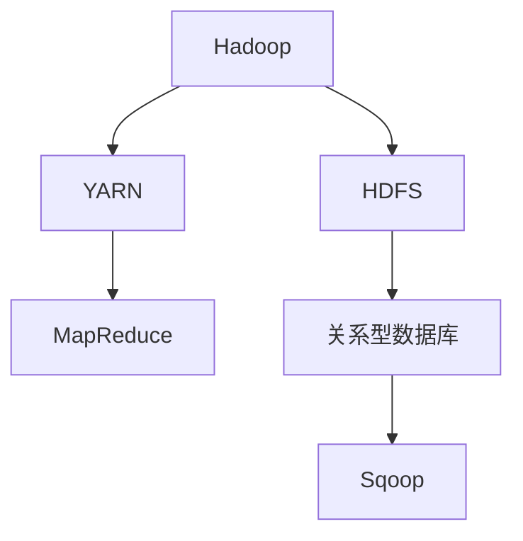

                 

关键词：数据迁移，Hadoop生态系统，HDFS，Apache Sqoop，大数据，数据库导入导出

>摘要：本文将详细介绍Apache Sqoop的基本原理、核心概念及其在大数据环境下的应用。通过代码实例，深入探讨如何使用Sqoop实现数据库与Hadoop生态系统之间的数据迁移，并分析其性能和优化策略。

## 1. 背景介绍

在大数据时代，数据迁移成为了一个关键环节。随着企业数据量的激增，如何高效、稳定地将数据从传统数据库系统迁移到分布式存储系统（如Hadoop）变得越来越重要。Apache Sqoop是一款开源工具，用于在Hadoop生态系统和关系型数据库之间实现高效的数据迁移。

### 1.1 Sqoop的发展历程

**Apache Sqoop**诞生于2010年，是Hadoop生态系统中的重要组成部分。它由Cloudera公司开发，并迅速成为大数据领域的数据迁移利器。随着时间的推移，Sqoop不断迭代更新，功能日益完善，支持多种数据库和文件系统，成为大数据领域不可或缺的工具之一。

### 1.2 Sqoop的应用场景

Sqoop的主要应用场景包括：

- **数据库导入Hadoop**：将数据从关系型数据库导入到Hadoop分布式文件系统（HDFS）。
- **数据库导出Hadoop**：将数据从HDFS导出到关系型数据库。
- **批量数据迁移**：适合大规模数据的批量迁移。
- **实时数据同步**：支持通过Kafka等工具实现实时数据同步。

## 2. 核心概念与联系

### 2.1 核心概念

- **Hadoop生态系统**：包括HDFS、YARN、MapReduce等组件。
- **关系型数据库**：如MySQL、PostgreSQL等。
- **HDFS**：Hadoop分布式文件系统，用于存储大规模数据。
- **MapReduce**：Hadoop的核心计算框架。

### 2.2 核心联系


Mermaid流程图：



## 3. 核心算法原理 & 具体操作步骤

### 3.1 算法原理概述

Sqoop的核心原理是将关系型数据库中的数据以并行方式导入或导出至Hadoop生态系统。其核心操作步骤包括：

1. **数据读取**：从关系型数据库中读取数据。
2. **数据转换**：将数据转换为适合Hadoop处理的格式（如JSON、Avro等）。
3. **数据写入**：将转换后的数据写入HDFS。

### 3.2 算法步骤详解

#### 步骤1：数据读取

Sqoop使用JDBC连接到关系型数据库，读取数据。数据读取过程分为两个阶段：

1. **查询执行**：执行SQL查询，获取数据。
2. **数据缓存**：将查询结果缓存到内存或文件系统。

#### 步骤2：数据转换

数据转换过程根据用户指定的格式进行。常见的数据格式包括：

- **JSON**：适合存储结构化数据。
- **Avro**：支持高效的数据存储和序列化。
- **Parquet**：适用于大规模数据处理。

#### 步骤3：数据写入

转换后的数据写入HDFS。写入过程分为两个阶段：

1. **分片写入**：将数据分片写入不同的HDFS文件。
2. **文件合并**：将多个分片文件合并为完整的文件。

### 3.3 算法优缺点

#### 优点

- **高效并行处理**：支持大规模数据的并行处理。
- **跨平台支持**：支持多种数据库和文件系统。
- **易于使用**：提供命令行工具和Java API。

#### 缺点

- **数据一致性问题**：在数据迁移过程中，可能存在数据一致性问题。
- **性能瓶颈**：在处理大数据量时，可能存在性能瓶颈。

### 3.4 算法应用领域

Sqoop主要应用于以下领域：

- **数据集成**：实现不同数据源之间的数据迁移。
- **数据仓库**：将数据库数据导入Hadoop，进行数据分析和挖掘。
- **实时同步**：实现实时数据同步，支持实时数据处理。

## 4. 数学模型和公式 & 详细讲解 & 举例说明

### 4.1 数学模型构建

 Sqoop的数据迁移过程涉及以下数学模型：

- **数据量模型**：数据量与迁移时间的关系。
- **吞吐量模型**：吞吐量与迁移时间的关系。

### 4.2 公式推导过程

1. **数据量模型**：

   $$ 数据量 = 数据速率 \times 时间 $$

2. **吞吐量模型**：

   $$ 吞吐量 = 数据速率 / 迁移时间 $$

### 4.3 案例分析与讲解

#### 案例一：数据量模型

假设某公司需要将1TB的数据从MySQL导入到HDFS，数据传输速率为100MB/s。计算数据迁移所需时间。

- **数据量**：1TB = 1,024GB
- **数据速率**：100MB/s
- **时间**：

   $$ 时间 = 数据量 / 数据速率 = (1,024GB \times 1024MB/GB) / 100MB/s = 10,240s \approx 2.86天 $$

#### 案例二：吞吐量模型

假设某公司需要将1TB的数据从MySQL导入到HDFS，数据传输速率为100MB/s。计算数据迁移的吞吐量。

- **数据量**：1TB = 1,024GB
- **数据速率**：100MB/s
- **迁移时间**：2.86天（根据案例一计算）

$$ 吞吐量 = 数据量 / 迁移时间 = (1,024GB \times 1024MB/GB) / (2.86天 \times 24h/day \times 3600s/h) \approx 0.11GB/s $$

## 5. 项目实践：代码实例和详细解释说明

### 5.1 开发环境搭建

在开始使用Sqoop之前，需要搭建以下开发环境：

- **Hadoop**：版本2.7.2
- **MySQL**：版本5.7.21
- **Java**：版本1.8
- **Sqoop**：版本1.4.7

### 5.2 源代码详细实现

以下是使用Sqoop将MySQL数据导入HDFS的示例代码：

```java
import org.apache.sqoop.Sqoop;
import org.apache.sqoop.tool.LoadJob;

public class SqoopExample {
    public static void main(String[] args) {
        try {
            Sqoop sqoop = new Sqoop();
            LoadJob loadJob = new LoadJob();
            loadJob.setConnectString("jdbc:mysql://localhost:3306/mydb");
            loadJob.setDriver("com.mysql.jdbc.Driver");
            loadJob.setUsername("root");
            loadJob.setPassword("password");
            loadJob.setTable("users");
            loadJob.setTargetDir("/user/hive/warehouse/mydb.db/users");
            loadJob.setImportMode(LoadJob.ImportMode.CSV);
            loadJob.setDelimiter(",");
            loadJob.setM delimiter('"');
            loadJob.setColumnDelimiter(",");
            loadJob.setLineWidth(1000);
            loadJob.setNullString("NULL");
            loadJob.setHasHeaderLine(true);
            loadJob.setNumMappers(10);
            loadJob.setDeployer("mapred");
            sqoop.runJob(loadJob);
        } catch (Exception e) {
            e.printStackTrace();
        }
    }
}
```

### 5.3 代码解读与分析

该代码示例实现了以下功能：

- **连接MySQL数据库**：使用JDBC连接到本地MySQL数据库（mydb）。
- **设置表名**：指定需要导入的表（users）。
- **设置目标目录**：将数据导入到HDFS的指定目录（/user/hive/warehouse/mydb.db/users）。
- **设置导入模式**：使用CSV格式导入数据。
- **设置分隔符**：设置列分隔符为逗号（,），字符串分隔符为引号（"）。
- **设置并行度**：设置使用10个Mapper并行处理数据。

### 5.4 运行结果展示

在运行该代码后，数据将成功导入到HDFS指定的目录。可以使用HDFS命令行工具查看导入结果：

```bash
hdfs dfs -ls /user/hive/warehouse/mydb.db/users
```

## 6. 实际应用场景

### 6.1 数据集成

企业可以将多个数据库中的数据集成到Hadoop生态系统中，实现统一的数据分析和管理。

### 6.2 数据仓库

企业可以使用Sqoop将数据库数据导入Hadoop，构建数据仓库，支持大规模数据分析和挖掘。

### 6.3 实时同步

企业可以使用Sqoop与Kafka等实时数据流处理工具结合，实现实时数据同步和实时数据处理。

## 7. 工具和资源推荐

### 7.1 学习资源推荐

- 《Hadoop实战》
- 《大数据技术导论》
- 《Apache Sqoop官方文档》

### 7.2 开发工具推荐

- IntelliJ IDEA
- Eclipse
- Apache Sqoop命令行工具

### 7.3 相关论文推荐

- “Hadoop: A Framework for Large-Scale Data Processing”
- “Sqoop: An Extensible and Scalable Framework for Data Migration Between Relational Databases and Hadoop”

## 8. 总结：未来发展趋势与挑战

### 8.1 研究成果总结

 Sqoop在大数据领域取得了显著的研究成果，成为数据迁移的重要工具。未来研究将进一步优化其性能和功能，支持更多数据源和文件系统。

### 8.2 未来发展趋势

- **多数据源支持**：将支持更多类型的数据库和文件系统。
- **实时迁移**：实现实时数据迁移，支持实时数据处理。
- **自动化迁移**：实现自动化数据迁移，减少人工干预。

### 8.3 面临的挑战

- **数据一致性**：在数据迁移过程中保持数据一致性。
- **性能优化**：在处理大数据量时，优化性能。

### 8.4 研究展望

未来，Sqoop将致力于提高数据迁移的效率和可靠性，支持更多应用场景，成为大数据领域的核心技术之一。

## 9. 附录：常见问题与解答

### 9.1 如何解决数据一致性问题？

在数据迁移过程中，可以使用分布式锁、事务管理等技术确保数据一致性。

### 9.2 如何优化数据迁移性能？

- 使用并行处理技术，提高数据处理速度。
- 优化数据库连接池，减少连接数。
- 使用高效的文件系统，如HDFS。

## 作者署名

作者：禅与计算机程序设计艺术 / Zen and the Art of Computer Programming
----------------------------------------------------------------
以上内容为《Sqoop原理与代码实例讲解》的完整文章正文部分。接下来，将按照markdown格式进行排版。由于文字内容较多，请检查格式是否符合markdown规范，并确保文章整体结构完整、逻辑清晰。如果需要调整，请及时修改。完成后，我们将把这篇文章发布在技术博客上，与广大读者分享。再次感谢您的辛勤工作！

