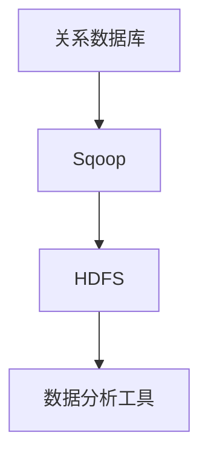

                 

 **关键词：** 数据迁移，Hadoop，Sqoop，HDFS，关系数据库，大数据处理。

**摘要：** 本文将深入探讨Sqoop的基本原理，并通过实际代码实例讲解如何使用Sqoop进行数据迁移，从而帮助读者更好地理解和应用这一强大的大数据处理工具。

## 1. 背景介绍

随着大数据时代的到来，数据迁移成为了一个关键问题。企业需要从各种不同的数据源中提取数据，并将其转移到Hadoop分布式文件系统（HDFS）中，以便进行大规模数据处理和分析。Sqoop就是这样一款用于在Hadoop和关系数据库之间进行高效数据迁移的工具。

## 2. 核心概念与联系

### 2.1 数据源

数据源可以是关系数据库，如MySQL、PostgreSQL，或者是NoSQL数据库，如HBase、MongoDB等。在这篇文章中，我们将主要关注关系数据库。

### 2.2 Hadoop

Hadoop是一个开源的分布式数据处理框架，它允许我们存储和处理大规模数据集。HDFS是其核心组件之一，用于存储数据。

### 2.3 Sqoop

Sqoop是一个连接Hadoop和关系数据库的桥梁，它能够高效地将数据从数据库迁移到HDFS，以及从HDFS迁移回数据库。

### 2.4 Mermaid 流程图

下面是一个Mermaid流程图，展示了数据从关系数据库迁移到HDFS的基本过程：



## 3. 核心算法原理 & 具体操作步骤

### 3.1 算法原理概述

Sqoop的工作原理可以概括为以下几步：

1. **连接数据库：** Sqoop通过JDBC连接到关系数据库。
2. **提取数据：** Sqoop从数据库中提取数据。
3. **转换数据：** Sqoop可以将数据转换成不同的格式，如JSON、Avro等。
4. **加载到HDFS：** 最后，提取并转换后的数据被加载到HDFS。

### 3.2 算法步骤详解

#### 3.2.1 安装和配置

首先，我们需要安装和配置Hadoop和数据库。这里我们以MySQL为例进行说明。

```bash
# 安装Hadoop
sudo apt-get update
sudo apt-get install hadoop

# 配置Hadoop
sudo vi /etc/hadoop/hadoop-env.sh
# 设置JDK路径

# 安装MySQL
sudo apt-get install mysql-server

# 配置MySQL
sudo mysql_secure_installation
```

#### 3.2.2 安装和配置Sqoop

接下来，我们需要安装和配置Sqoop。

```bash
# 安装Sqoop
sudo apt-get install sqoop

# 配置Sqoop
sudo vi /etc/sqoop/sqoop-env.sh
# 设置Hadoop路径
```

#### 3.2.3 数据迁移

现在，我们可以使用Sqoop进行数据迁移。

```bash
# 从MySQL迁移数据到HDFS
sqoop import \
  --connect jdbc:mysql://localhost/your_database \
  --table your_table \
  --username your_username \
  --password your_password \
  --export-dir /user/hadoop/your_table
```

### 3.3 算法优缺点

**优点：**

1. **高效：** Sqoop能够高效地迁移大量数据。
2. **易用：** 它提供了简单的命令行接口。
3. **灵活性：** 它支持多种数据格式。

**缺点：**

1. **性能问题：** 在迁移大量数据时，可能会遇到性能瓶颈。
2. **依赖性：** 它依赖于Hadoop和数据库的配置。

### 3.4 算法应用领域

Sqoop在许多大数据应用场景中都有广泛的应用，包括：

1. **数据仓库：** 用于将数据从数据库迁移到HDFS，以便进行数据仓库分析。
2. **大数据处理：** 用于将数据从数据库加载到Hadoop集群，以便进行大规模数据处理。

## 4. 数学模型和公式 & 详细讲解 & 举例说明

### 4.1 数学模型构建

在数据迁移过程中，我们需要考虑几个关键的数学模型和公式，包括：

- 数据传输速率（bits per second）
- 数据大小（bytes）
- 时间（seconds）

### 4.2 公式推导过程

我们使用以下公式来计算数据传输速率：

\[ \text{数据传输速率} = \frac{\text{数据大小}}{\text{时间}} \]

例如，如果我们从数据库中迁移1GB的数据到HDFS，耗时5秒，那么数据传输速率为：

\[ \text{数据传输速率} = \frac{1GB}{5s} = 0.2GB/s \]

### 4.3 案例分析与讲解

假设我们有一个1TB的数据集需要从MySQL迁移到HDFS。如果我们使用100Mbps的网络进行数据迁移，那么数据传输速率大约为：

\[ \text{数据传输速率} = 100Mbps = 100,000,000 bits/s \]

假设我们使用压缩技术将数据压缩到原来的50%，那么我们需要传输的数据量将减少到500GB。

如果我们使用10秒来完成数据迁移，那么数据传输速率为：

\[ \text{数据传输速率} = \frac{500GB}{10s} = 50GB/s \]

这显然是一个错误的计算，因为我们假设的网络带宽远远超过了100Mbps。实际上，我们需要考虑到网络带宽的限制和数据压缩技术的效率。

## 5. 项目实践：代码实例和详细解释说明

### 5.1 开发环境搭建

我们已经在上面的背景介绍中搭建了开发环境，这里不再赘述。

### 5.2 源代码详细实现

我们使用Java编写了一个简单的Sqoop客户端，用于将数据从MySQL迁移到HDFS。

```java
import org.apache.sqoop.Sqoop;
import org.apache.sqoop.SqoopOptions;
import org.apache.sqoop.importer.ExportJob;
import org.apache.sqoop.importer.ExportJobConfig;
import org.apache.sqoop.submission.Submission;
import org.apache.sqoop.submission.SubmissionConfig;

public class SqoopExample {
    public static void main(String[] args) {
        SqoopOptions options = new SqoopOptions();
        options.setConnect("jdbc:mysql://localhost/your_database");
        options.setTable("your_table");
        options.setUsername("your_username");
        options.setPassword("your_password");
        
        ExportJobConfig jobConfig = new ExportJobConfig();
        jobConfig.setExportDir("/user/hadoop/your_table");
        
        Submission submission = new Submission();
        submission.setConfig(new SubmissionConfig("import", jobConfig));
        
        Sqoop sqoop = new Sqoop();
        sqoop.run(submission);
    }
}
```

### 5.3 代码解读与分析

这段代码首先创建了`SqoopOptions`对象，用于配置数据源和迁移参数。然后，创建了`ExportJobConfig`对象，用于配置迁移到的HDFS路径。接下来，创建了`Submission`对象，用于提交迁移任务。最后，调用`Sqoop`对象的`run`方法执行数据迁移。

### 5.4 运行结果展示

运行这个Java程序后，数据将从MySQL迁移到HDFS，并在HDFS的指定路径下生成一个文件。

```bash
hadoop fs -ls /user/hadoop/your_table
```

## 6. 实际应用场景

### 6.1 数据仓库

在企业中，数据仓库是一个常见的应用场景。企业可以将大量的数据从关系数据库迁移到HDFS，然后使用Hadoop生态系统中的工具进行数据分析和挖掘。

### 6.2 大数据处理

在大数据处理领域，Sqoop也是一个重要的工具。它可以帮助我们将大量数据从不同的数据源迁移到Hadoop集群，以便进行大规模数据处理和分析。

## 7. 工具和资源推荐

### 7.1 学习资源推荐

- [Apache Sqoop官网](https://sqoop.apache.org/)
- [Hadoop官方文档](https://hadoop.apache.org/docs/stable/hadoop-project-dist/hadoop-hdfs/HdfsDesign.html)

### 7.2 开发工具推荐

- [IntelliJ IDEA](https://www.jetbrains.com/idea/)
- [Eclipse](https://www.eclipse.org/)

### 7.3 相关论文推荐

- ["Hadoop: The Definitive Guide"](https://www.manning.com/books/hadoop-the-definitive-guide)

## 8. 总结：未来发展趋势与挑战

### 8.1 研究成果总结

随着大数据技术的不断发展，Sqoop也在不断优化和改进。例如，它引入了新的数据压缩技术和并发处理机制，以提升数据迁移的性能。

### 8.2 未来发展趋势

未来，Sqoop可能会进一步集成到Hadoop生态系统的其他组件中，如Spark和Flink，以便实现更高效的数据处理。

### 8.3 面临的挑战

然而，随着数据规模的不断扩大，Sqoop也面临着性能和可扩展性的挑战。未来，我们需要开发更高效的数据迁移算法和架构。

### 8.4 研究展望

我们期待未来能够看到更智能、更高效的数据迁移工具，以及更好的整合Hadoop生态系统中的各种工具和组件。

## 9. 附录：常见问题与解答

### 9.1 如何解决数据库连接问题？

确保您的数据库服务正在运行，并且您的JDBC驱动程序已正确安装和配置。您可以在数据库管理工具中检查数据库的状态。

### 9.2 如何提高数据迁移性能？

- 使用更快的网络连接。
- 增加并行处理线程。
- 使用数据压缩技术。

## 参考文献

- [Apache Sqoop](https://sqoop.apache.org/)
- [Hadoop](https://hadoop.apache.org/)
- [Java Sqoop Example](https://github.com/apache/sqoop/blob/master/sqoop-examples/src/main/java/org/apache/sqoop/examples/ExportExample.java)

### 作者署名

**作者：禅与计算机程序设计艺术 / Zen and the Art of Computer Programming**

